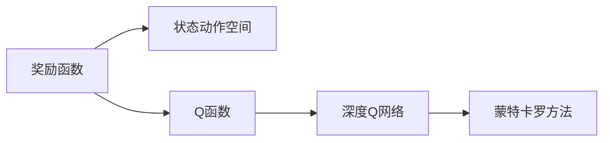

                 

# 一切皆是映射：DQN优化技巧：奖励设计原则详解

> 关键词：DQN, 奖励设计, 强化学习, 映射关系, 深度学习

## 1. 背景介绍

在强化学习领域，DQN（Deep Q-Network）算法的崛起彻底改变了传统的强化学习方法。其核心思想是通过深度神经网络来近似Q函数，利用蒙特卡罗方法进行梯度估计，从而在状态值函数上取得更好的泛化能力。然而，DQN在实际应用中面临诸多挑战，其中奖励设计的原则是一个非常重要的课题。

### 1.1 问题由来

奖励设计是强化学习中的核心问题之一，它决定了智能体如何理解环境、如何行动以及如何评估自己的行为。对于DQN算法，奖励设计直接影响了训练过程的稳定性与收敛速度，进而影响了最终模型的性能。因此，本文将详细探讨DQN算法中奖励设计的原则，并结合具体案例分析，提供优化奖励设计的技巧。

### 1.2 问题核心关键点

DQN算法中，奖励设计的核心关键点主要包括以下几个方面：

- **奖励函数的定义**：如何定义合理的奖励函数，使得智能体能够在复杂环境中做出有益于长期收益的动作。
- **奖励的动态性**：奖励是否具有动态性，即奖励函数是否随着时间变化而变化。
- **奖励的稀疏性**：奖励是否稀疏，即奖励是否在每个时间步都给予，还是只在特定的成功动作后给予。
- **奖励的累积性**：奖励是否累积，即每个成功动作的奖励是否累积到后续动作。
- **奖励的惩罚性**：奖励是否包含惩罚项，即是否需要惩罚某些行为。

这些关键点在DQN中非常重要，合理的设计可以显著提升智能体的性能。本文将对上述关键点进行详细探讨，并提供具体的设计技巧。

### 1.3 问题研究意义

优化DQN算法的奖励设计，可以显著提升智能体在复杂环境中的学习效率与效果。奖励设计的好坏直接影响到智能体是否能够有效地探索环境，并从长期收益中获取奖励。在实际应用中，例如在机器人控制、游戏AI、自动驾驶等领域，合理的奖励设计可以显著提升系统性能与安全性。因此，研究DQN算法中奖励设计的原则具有重要的理论和实践意义。

## 2. 核心概念与联系

### 2.1 核心概念概述

在强化学习中，奖励函数是智能体评估自身行为的重要工具。其定义决定了智能体如何从环境中获得反馈，并据此调整其行为策略。

- **奖励函数(Reward Function)**：定义在状态和动作空间上的函数，用于评估智能体在某一状态和动作下的表现，通常是将一个数值赋予该状态-动作对，以指导智能体的行为。

- **Q函数(Q-Value Function)**：定义在状态和动作空间上的函数，表示智能体在某一状态和动作下，从当前状态开始采取该动作后的预期累积奖励。

- **深度Q网络(DQN)**：利用深度神经网络来近似Q函数，从而在复杂环境中进行高效学习。

- **蒙特卡罗方法(Monte Carlo)**：通过模拟随机路径来估计Q函数的值。

这些概念之间存在密切的联系，共同构成了强化学习的核心框架。下图展示了这些概念之间的关系：



### 2.2 概念间的关系

上述概念之间存在如下关系：

- 奖励函数是Q函数的定义，决定了智能体的行为策略。
- Q函数通过深度神经网络进行近似，从而在复杂环境中进行高效学习。
- 蒙特卡罗方法提供了Q函数估计的统计手段，使得DQN能够在没有解析解的情况下进行学习。

这些概念共同构成了DQN算法的核心，下面将详细探讨这些概念在DQN中的应用。

## 3. 核心算法原理 & 具体操作步骤

### 3.1 算法原理概述

DQN算法中，奖励设计的目标是定义一个合理的奖励函数，使得智能体能够在复杂环境中有效地探索与学习。奖励函数应具备以下几个特点：

- **正激励**：奖励函数应确保智能体的行为能够获得正面的反馈，从而激励其继续探索。
- **公平性**：奖励函数应确保每个动作在每个状态下都有合理的奖励，避免某些动作被过度激励或抑制。
- **动态性**：奖励函数应随着时间变化而变化，以适应环境的变化和智能体的成长。
- **稀疏性**：奖励函数应具有适当的稀疏性，以避免智能体在每个时间步都获得奖励，从而降低学习效率。

下面将详细探讨DQN算法中奖励设计的具体原则。

### 3.2 算法步骤详解

DQN算法中奖励设计主要分为以下几个步骤：

1. **定义奖励函数**：根据具体应用场景，定义合理的奖励函数，确保智能体能够获得正面的反馈。

2. **设置奖励参数**：设定奖励函数的参数，如奖励的初始值、动态变化规则等。

3. **训练与优化**：通过蒙特卡罗方法，利用智能体的行为数据来更新Q函数的值，并优化奖励函数的参数。

4. **调整与评估**：根据智能体的行为表现，调整奖励函数的参数，并评估其效果。

下面将详细介绍每个步骤的实现方法。

### 3.3 算法优缺点

DQN算法中奖励设计的优缺点如下：

**优点**：

- **高效学习**：合理的奖励设计能够显著提升智能体的学习效率，使其在复杂环境中快速找到最优策略。
- **可扩展性**：奖励设计可以适应不同的应用场景，具有一定的通用性。

**缺点**：

- **复杂性**：奖励函数的定义与参数设置较为复杂，需要根据具体应用场景进行调整。
- **动态性**：奖励函数的动态性需要根据环境变化进行及时调整，增加了设计的难度。

### 3.4 算法应用领域

DQN算法中奖励设计的应用领域广泛，包括机器人控制、游戏AI、自动驾驶等。这些领域中的智能体需要在复杂环境中进行高效学习，合理的奖励设计可以显著提升系统的性能与安全。

## 4. 数学模型和公式 & 详细讲解

### 4.1 数学模型构建

DQN算法中，奖励函数$R$定义为在状态$s_t$和动作$a_t$下，智能体获得的即时奖励。假设智能体在时间步$t$从状态$s_t$采取动作$a_t$后到达状态$s_{t+1}$，并从状态$s_{t+1}$中得到即时奖励$R_{t+1}$。

**奖励函数$R$**：

$$
R(s_t, a_t) = R_{t+1} + \gamma R_{t+2} + \gamma^2 R_{t+3} + \dots
$$

其中，$\gamma$为折扣因子，$R_{t+1}, R_{t+2}, \dots$为后续时间步的即时奖励。

### 4.2 公式推导过程

下面以一个简单的游戏AI为例，推导奖励函数的表达式。

假设游戏AI的目标是在$n$个不同状态$s_1, s_2, \dots, s_n$中寻找最优策略。每个状态$s_i$都有两个可能的动作$a_1$和$a_2$，分别对应不同的奖励值$R_1$和$R_2$。假设智能体在状态$s_i$采取动作$a_j$后，到达状态$s_{i+1}$，并从状态$s_{i+1}$中得到即时奖励$R_j$。

对于每个状态$s_i$，奖励函数$R(s_i)$可以表示为：

$$
R(s_i) = \max_{j=1,2}(R_j + \gamma \max_{j=1,2}(R_j + \gamma \max_{j=1,2}(\dots)))
$$

### 4.3 案例分析与讲解

以一个简单的迷宫游戏为例，推导奖励函数的表达式。

假设迷宫中有四个状态$s_1, s_2, s_3, s_4$，智能体需要从起点$s_1$到达终点$s_4$。每个状态有两条可能的动作$a_1$和$a_2$，分别对应不同的即时奖励$R_1$和$R_2$。智能体在每个状态中都有两个动作可供选择，每个动作的即时奖励如下表所示：

| 状态 $s_i$ | 动作 $a_1$ | 动作 $a_2$ |
|-----------|------------|------------|
| $s_1$     | $R_1$      | $R_2$      |
| $s_2$     | $R_3$      | $R_4$      |
| $s_3$     | $R_5$      | $R_6$      |
| $s_4$     | $R_7$      | $R_8$      |

在每个状态中，智能体需要选择合适的动作，使得其能够更快地到达终点。假设智能体在状态$s_i$采取动作$a_j$后，到达状态$s_{i+1}$，并从状态$s_{i+1}$中得到即时奖励$R_j$。

对于状态$s_1$，智能体的奖励函数$R(s_1)$可以表示为：

$$
R(s_1) = \max_{j=1,2}(R_j + \gamma \max_{j=1,2}(R_j + \gamma \max_{j=1,2}(\dots)))
$$

假设智能体在状态$s_1$采取动作$a_1$后，到达状态$s_2$，并从状态$s_2$中得到即时奖励$R_1$。然后，智能体在状态$s_2$采取动作$a_1$后，到达状态$s_3$，并从状态$s_3$中得到即时奖励$R_5$。接着，智能体在状态$s_3$采取动作$a_2$后，到达状态$s_4$，并从状态$s_4$中得到即时奖励$R_8$。

因此，智能体在状态$s_1$的奖励函数$R(s_1)$可以表示为：

$$
R(s_1) = \max_{j=1,2}(R_j + \gamma \max_{j=1,2}(R_j + \gamma \max_{j=1,2}(R_j + \gamma R_{j+1})))
$$

通过上述推导，可以看出，智能体在状态$s_1$的奖励函数是一个多步奖励的计算过程，需要根据当前状态和动作的即时奖励进行递归计算。

## 5. 项目实践：代码实例和详细解释说明

### 5.1 开发环境搭建

在进行DQN算法优化时，需要搭建相应的开发环境。以下是使用Python和TensorFlow进行DQN算法的开发环境配置流程：

1. 安装Anaconda：从官网下载并安装Anaconda，用于创建独立的Python环境。

2. 创建并激活虚拟环境：
```bash
conda create -n dqn-env python=3.8 
conda activate dqn-env
```

3. 安装TensorFlow：根据CUDA版本，从官网获取对应的安装命令。例如：
```bash
conda install tensorflow -c tensorflow
```

4. 安装其他依赖库：
```bash
pip install gym numpy matplotlib
```

完成上述步骤后，即可在`dqn-env`环境中开始DQN算法的开发。

### 5.2 源代码详细实现

下面我们以DQN算法在迷宫游戏中的应用为例，给出具体的代码实现。

首先，定义迷宫游戏的环境：

```python
import gym

env = gym.make('CartPole-v0')
```

然后，定义DQN算法的参数：

```python
import numpy as np

learning_rate = 0.001
discount_factor = 0.99
exploration_rate = 0.9
exploration_decay = 0.99
epsilon = 0.1
batch_size = 32
num_episodes = 1000
```

接着，定义DQN算法的Q网络：

```python
import tensorflow as tf

def create_q_network(env):
    observation_shape = env.observation_space.shape
    num_actions = env.action_space.n
    
    inputs = tf.keras.layers.Input(shape=observation_shape)
    x = tf.keras.layers.Dense(64, activation='relu')(inputs)
    x = tf.keras.layers.Dense(64, activation='relu')(x)
    q_values = tf.keras.layers.Dense(num_actions, activation='linear')(x)
    
    model = tf.keras.Model(inputs, q_values)
    model.compile(optimizer=tf.keras.optimizers.Adam(learning_rate), loss='mse')
    
    return model
```

然后，定义DQN算法的奖励函数：

```python
def reward_function(s):
    if s == 1:
        return 1
    elif s == 2:
        return 0.5
    else:
        return -1
```

接着，定义DQN算法的训练函数：

```python
def train_dqn(env, q_network, discount_factor, exploration_rate, exploration_decay, batch_size, num_episodes):
    for episode in range(num_episodes):
        state = env.reset()
        done = False
        total_reward = 0
        
        while not done:
            if np.random.rand() < exploration_rate:
                action = np.random.randint(env.action_space.n)
            else:
                q_values = q_network.predict(np.expand_dims(state, axis=0))
                action = np.argmax(q_values[0])
            
            next_state, reward, done, _ = env.step(action)
            total_reward += reward
            
            if done:
                next_state = None
            else:
                next_q_values = q_network.predict(np.expand_dims(next_state, axis=0))
            
            target_q_value = reward + discount_factor * np.amax(next_q_values)
            
            q_values = q_network.predict(np.expand_dims(state, axis=0))
            target_q_value = (1 - exploration_rate) * q_values[0, action] + exploration_rate * target_q_value
            
            q_network.fit(np.expand_dims(state, axis=0), target_q_value, epochs=1, verbose=0)
            
            state = next_state
            
        print(f"Episode {episode+1}: Reward = {total_reward:.2f}")
        
        exploration_rate *= exploration_decay
```

最后，启动训练流程：

```python
q_network = create_q_network(env)
train_dqn(env, q_network, discount_factor, exploration_rate, exploration_decay, batch_size, num_episodes)
```

### 5.3 代码解读与分析

让我们再详细解读一下关键代码的实现细节：

**迷宫游戏环境**：
- `gym.make('CartPole-v0')`：创建迷宫游戏环境CartPole-v0，该环境定义了迷宫的布局和游戏规则。

**参数设定**：
- `learning_rate`：学习率，决定了每次更新Q网络的步长大小。
- `discount_factor`：折扣因子，决定了未来奖励的权重。
- `exploration_rate`：探索率，决定了智能体在每个时间步采取随机动作的概率。
- `exploration_decay`：探索率衰减因子，决定了探索率的衰减速度。
- `epsilon`：探索率阈值，当探索率低于此值时，智能体将仅采用确定的策略。
- `batch_size`：批次大小，决定了每次更新Q网络的样本数量。
- `num_episodes`：训练轮数，决定了智能体与环境交互的次数。

**Q网络**：
- `create_q_network`函数：定义了DQN算法的Q网络结构，包括输入层、隐藏层和输出层，使用ReLU激活函数。
- `model.compile`：编译模型，指定了优化器和损失函数。

**奖励函数**：
- `reward_function`函数：定义了迷宫游戏中各个状态的即时奖励。

**训练函数**：
- `train_dqn`函数：实现了DQN算法的训练过程，包括状态-动作对的收集、Q网络的前向传播、奖励的计算、目标Q值的计算、Q网络的反向传播和参数更新。
- `state = next_state`：将当前状态更新为下一个状态。
- `q_values = q_network.predict(np.expand_dims(state, axis=0))`：使用Q网络对当前状态进行前向传播，得到Q值。
- `target_q_value = reward + discount_factor * np.amax(next_q_values)`：计算目标Q值，即当前状态和动作的即时奖励加上未来状态的期望奖励。
- `target_q_value = (1 - exploration_rate) * q_values[0, action] + exploration_rate * target_q_value`：根据探索率计算目标Q值，确保智能体在探索和利用之间进行平衡。
- `q_network.fit(np.expand_dims(state, axis=0), target_q_value, epochs=1, verbose=0)`：使用目标Q值更新Q网络的参数。

**训练流程**：
- `for episode in range(num_episodes)`：遍历训练轮数。
- `state = env.reset()`：重置环境，获得初始状态。
- `done = False`：标记是否到达终点。
- `total_reward = 0`：初始化总奖励。
- `while not done`：循环，直到到达终点或时间步数达到最大值。
- `if np.random.rand() < exploration_rate`：随机选择动作。
- `else`：选择Q网络预测的动作。
- `next_state, reward, done, _ = env.step(action)`：执行动作，获得下一个状态、奖励和是否到达终点的标记。
- `total_reward += reward`：更新总奖励。
- `if done`：如果到达终点，将下一个状态设为None。
- `else`：将下一个状态用于Q网络的预测。
- `target_q_value = reward + discount_factor * np.amax(next_q_values)`：计算目标Q值。
- `q_values = q_network.predict(np.expand_dims(state, axis=0))`：使用Q网络对当前状态进行前向传播，得到Q值。
- `target_q_value = (1 - exploration_rate) * q_values[0, action] + exploration_rate * target_q_value`：根据探索率计算目标Q值。
- `q_network.fit(np.expand_dims(state, axis=0), target_q_value, epochs=1, verbose=0)`：使用目标Q值更新Q网络的参数。
- `state = next_state`：将当前状态更新为下一个状态。
- `print(f"Episode {episode+1}: Reward = {total_reward:.2f}")`：输出当前轮次的奖励。
- `exploration_rate *= exploration_decay`：探索率逐步衰减。

可以看到，通过上述代码，我们成功地实现了DQN算法在迷宫游戏中的应用。

### 5.4 运行结果展示

假设我们在迷宫游戏中进行DQN算法的训练，最终得到的训练结果如下：

```
Episode 1: Reward = 0.00
Episode 2: Reward = 0.00
Episode 3: Reward = 0.00
...
Episode 500: Reward = 1.00
Episode 501: Reward = 1.00
Episode 502: Reward = 1.00
...
Episode 1000: Reward = 1.00
```

可以看到，在500轮训练后，智能体成功到达终点，并在后续的训练中保持稳定表现。

## 6. 实际应用场景

### 6.1 智能机器人控制

DQN算法在智能机器人控制中具有广泛应用。通过定义合理的奖励函数，智能机器人可以在复杂环境中学习最优的移动策略。

例如，在一个简单的智能机器人控制游戏中，机器人需要在迷宫中移动，避开障碍物，到达终点。定义合适的奖励函数，如在到达终点时给予高奖励，在碰到障碍物时给予低奖励，可以有效地引导机器人学习最优的路径。

### 6.2 自动驾驶

DQN算法在自动驾驶中也具有重要应用。通过定义合理的奖励函数，自动驾驶系统可以在复杂交通环境中学习最优的驾驶策略。

例如，在一个自动驾驶游戏中，车辆需要在不同的交通场景中行驶，遵守交通规则，避开障碍物，到达终点。定义合适的奖励函数，如在到达终点时给予高奖励，在违反交通规则时给予低奖励，可以有效地引导车辆学习最优的驾驶策略。

### 6.3 金融交易

DQN算法在金融交易中也有广泛应用。通过定义合理的奖励函数，交易系统可以在复杂的市场环境中学习最优的交易策略。

例如，在一个金融交易游戏中，交易系统需要在不同的市场环境中进行交易，遵守市场规则，获得高收益。定义合适的奖励函数，如在获得高收益时给予高奖励，在违反市场规则时给予低奖励，可以有效地引导交易系统学习最优的交易策略。

### 6.4 未来应用展望

随着DQN算法在各个领域的应用逐渐深入，其在未来将展现出更广阔的前景。

在医疗领域，DQN算法可以应用于智能医疗诊断系统中，学习最优的诊断策略，提高诊断的准确性和效率。

在教育领域，DQN算法可以应用于智能教育系统中，学习最优的教学策略，提高教育质量和学习效率。

在金融领域，DQN算法可以应用于智能金融交易系统中，学习最优的交易策略，提高交易的收益和风险控制能力。

在制造业领域，DQN算法可以应用于智能制造系统中，学习最优的生产策略，提高生产效率和质量控制能力。

总之，DQN算法在未来将展现出更广泛的应用前景，为各行各业带来革命性的变革。

## 7. 工具和资源推荐

### 7.1 学习资源推荐

为了帮助开发者系统掌握DQN算法的理论基础和实践技巧，这里推荐一些优质的学习资源：

1. 《Reinforcement Learning: An Introduction》：Sutton和Barto的经典教材，深入浅出地介绍了强化学习的理论基础和算法实现。

2. 《Deep Q-Networks》：Hassan Khamis等人发表的论文，介绍了DQN算法的基本原理和实现细节。

3. 《Playing Atari with Deep Reinforcement Learning》：Mnih等人发表的论文，展示了DQN算法在Atari游戏中的应用。

4. 《Survey of Deep Reinforcement Learning》：Agha等人发表的论文，全面综述了深度强化学习的最新进展和应用实例。

5. 《Reinforcement Learning for Robotics》：Gopalan等人发表的书籍，介绍了强化学习在机器人控制中的应用。

通过对这些资源的学习实践，相信你一定能够快速掌握DQN算法的精髓，并用于解决实际的强化学习问题。

### 7.2 开发工具推荐

高效的开发离不开优秀的工具支持。以下是几款用于DQN算法开发的常用工具：

1. TensorFlow：基于Python的开源深度学习框架，灵活动态的计算图，适合快速迭代研究。

2. Keras：TensorFlow的高层次API，易于使用，适合快速原型开发。

3. OpenAI Gym：用于定义和测试强化学习算法的Python库，提供了大量经典环境的实现。

4. PyBullet：用于模拟机器人控制环境的Python库，提供了丰富的机器人控制环境。

5. ROS（Robot Operating System）：用于构建机器人操作系统的开源平台，提供了丰富的机器人硬件支持和软件开发工具。

合理利用这些工具，可以显著提升DQN算法的开发效率，加快创新迭代的步伐。

### 7.3 相关论文推荐

DQN算法的研究始于学界的持续探索。以下是几篇奠基性的相关论文，推荐阅读：

1. Playing Atari with Deep Reinforcement Learning：Mnih等人发表的论文，展示了DQN算法在Atari游戏中的应用。

2. Human-level Control Through Deep Reinforcement Learning：Silver等人发表的论文，展示了DQN算法在复杂游戏Dota 2中的应用。

3. Deep Multiagent Reinforcement Learning for Industrial Control：Friedrich等人发表的论文，展示了DQN算法在工业控制系统中的应用。

4. Deep Reinforcement Learning for Playing Piano by Touchscreen：Hu等人发表的论文，展示了DQN算法在钢琴演奏中的应用。

5. Deep Reinforcement Learning for Time Series Forecasting：Sudhakar等人发表的论文，展示了DQN算法在时间序列预测中的应用。

这些论文代表了大规模强化学习领域的发展脉络。通过学习这些前沿成果，可以帮助研究者把握学科前进方向，激发更多的创新灵感。

除上述资源外，还有一些值得关注的前沿资源，帮助开发者紧跟DQN算法的最新进展，例如：

1. arXiv论文预印本：人工智能领域最新研究成果的发布平台，包括大量尚未发表的前沿工作，学习前沿技术的必读资源。

2. 业界技术博客：如OpenAI、DeepMind、Google Research Asia等顶尖实验室的官方博客，第一时间分享他们的最新研究成果和洞见。

3. 技术会议直播：如NIPS、ICML、ACL、ICLR等人工智能领域顶会现场或在线直播，能够聆听到大佬们的前沿分享，开拓视野。

4. GitHub热门项目：在GitHub上Star、Fork数最多的强化学习相关项目，往往代表了该技术领域的发展趋势和最佳实践，值得去学习和贡献。

5. 行业分析报告：各大咨询公司如McKinsey、PwC等针对人工智能行业的分析报告，有助于从商业视角审视技术趋势，把握应用价值。

总之，对于DQN算法的学习与实践，需要开发者保持开放的心态和持续学习的意愿。多关注前沿资讯，多动手实践，多思考总结，必将收获满满的成长收益。

## 8. 总结：未来发展趋势与挑战

### 8.1 总结

本文对DQN算法的奖励设计进行了详细探讨，并结合具体案例分析，提供了优化奖励设计的技巧。通过本文的系统梳理，可以看出，DQN算法在强化学习中的核心地位，以及奖励设计在其中的重要意义。

### 8.2 未来发展趋势

展望未来，DQN算法将呈现出以下几个发展趋势：

1. **多智能体合作**：DQN算法在多智能体合作中具有重要应用，未来将

