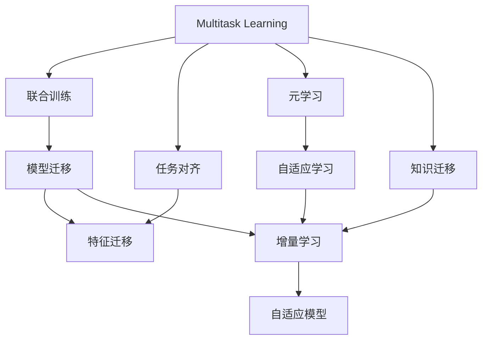
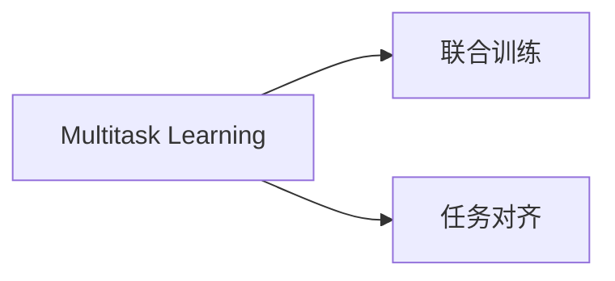
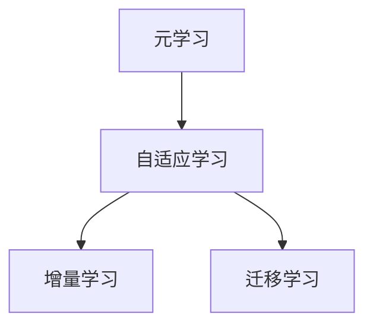
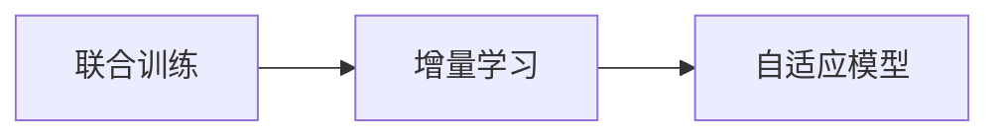
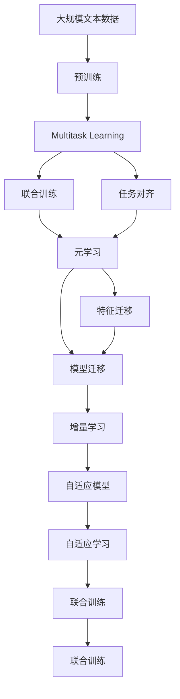

                 

# 一切皆是映射：多任务元学习和知识迁移

> 关键词：多任务学习,元学习,知识迁移,自适应学习,联合训练,迁移模型

## 1. 背景介绍

### 1.1 问题由来
近年来，随着人工智能技术的发展，尤其是在深度学习领域，研究人员和工程师们发现，一个模型在不同的任务上往往表现出不同的性能。这种现象促使他们思考，是否可以将不同任务之间的知识进行迁移，提升模型的泛化能力，从而更好地应对新任务。

例如，同一个预训练模型在不同的NLP任务上，如文本分类、命名实体识别、情感分析等，表现可能会有显著差异。如果能够将一个任务的知识迁移到另一个任务上，不仅能够减少从头训练的成本，还可以在较少标注数据的情况下提升模型性能。

因此，多任务学习(Multitask Learning, MTL)、元学习(Meta-Learning)和知识迁移(Knowledge Transfer)等方法应运而生，它们试图通过联合训练、知识共享、自适应学习等手段，提高模型在不同任务上的表现。

### 1.2 问题核心关键点
多任务元学习和知识迁移的核心在于如何在不同任务之间实现知识的有效迁移。具体来说，研究者们需要解决以下几个关键问题：

1. **知识共享机制**：如何在多个任务之间共享知识，避免每个任务从头训练。
2. **任务间关联性**：不同任务之间有何种关联，如共享的特征、概念、结构等。
3. **自适应性**：模型如何在新的任务上进行自适应学习，充分利用已有知识。
4. **迁移效果**：迁移到的知识能否在新任务上产生显著的性能提升。

多任务元学习和知识迁移方法，试图在这些关键问题上找到解决方案，从而构建具有跨任务适应能力的智能系统。

### 1.3 问题研究意义
多任务元学习和知识迁移研究对于提升人工智能技术的泛化能力、减少标注成本、加速模型开发具有重要意义。

- **泛化能力提升**：通过共享和迁移知识，模型可以更好地适应新任务，提高泛化能力。
- **标注成本降低**：在已有任务上训练的模型可以作为迁移源，新任务上的训练成本大大降低。
- **模型开发加速**：将现有知识应用到新任务上，可以快速构建高性能模型。
- **可解释性增强**：共享的知识可以被视为模型的一部分，有助于提高模型的可解释性。
- **应用场景拓展**：多任务元学习和知识迁移方法可以应用到更多领域，如自然语言处理、计算机视觉、机器人控制等。

## 2. 核心概念与联系

### 2.1 核心概念概述

为更好地理解多任务元学习和知识迁移方法，本节将介绍几个密切相关的核心概念：

- **多任务学习**：指同时训练多个相关任务，使模型能够在此基础上进行知识迁移。常见的多任务学习方法包括联合训练、任务对齐等。

- **元学习**：指在特定任务上学习模型，并将学习到的泛化知识应用于新任务。元学习模型通常会设计一个元优化器(Meta-Optimizer)来调整每个子任务的参数。

- **知识迁移**：指从一个任务中学习到的知识，可以迁移到另一个相关或不相关任务中。知识迁移方法通常包括特征迁移、模型迁移等。

- **自适应学习**：指模型能够根据新任务的特点，自动调整已有知识，以适应新的应用场景。自适应学习方法通常包括增量学习、迁移学习等。

- **联合训练**：指多个任务的训练过程被共同优化，共享梯度信息，提升模型泛化能力。

这些核心概念之间的逻辑关系可以通过以下Mermaid流程图来展示：



这个流程图展示了多任务元学习和知识迁移的核心概念及其之间的关系：

1. 多任务学习通过联合训练、任务对齐等方法，提升模型的泛化能力。
2. 元学习通过设计元优化器，学习通用知识，应用于新任务。
3. 知识迁移通过特征迁移、模型迁移等方法，在不同任务之间共享知识。
4. 自适应学习通过增量学习、迁移学习等方法，使模型适应新任务。
5. 联合训练、特征迁移和增量学习等方法，都属于自适应学习的范畴。
6. 元学习和模型迁移等方法，通常依赖于自适应学习机制。

### 2.2 概念间的关系

这些核心概念之间存在着紧密的联系，形成了多任务元学习和知识迁移的整体框架。下面我们通过几个Mermaid流程图来展示这些概念之间的关系。

#### 2.2.1 多任务学习与联合训练的关系



这个流程图展示了多任务学习的基本原理，以及其与联合训练的关系。多任务学习通过联合训练，使多个任务的训练过程被共同优化，共享梯度信息。

#### 2.2.2 元学习与自适应学习的关系



这个流程图展示了元学习与自适应学习的关系。元学习通过设计元优化器，学习通用知识，应用于新任务。自适应学习则通过增量学习、迁移学习等方法，使模型适应新任务。

#### 2.2.3 联合训练与增量学习的关系



这个流程图展示了联合训练与增量学习的关系。联合训练通过共享梯度信息，提升模型泛化能力。增量学习则通过不断更新模型参数，使模型适应新任务。

### 2.3 核心概念的整体架构

最后，我们用一个综合的流程图来展示这些核心概念在大模型微调过程中的整体架构：



这个综合流程图展示了从预训练到多任务元学习和知识迁移的完整过程。大模型首先在大规模文本数据上进行预训练，然后通过多任务元学习和知识迁移，提升模型在不同任务上的性能。最后，通过增量学习，使模型能够不断适应新任务，保持高性能。

## 3. 核心算法原理 & 具体操作步骤
### 3.1 算法原理概述

多任务元学习和知识迁移方法，本质上是一种自适应学习机制。其核心思想是：通过多任务联合训练，共享知识和经验，提高模型在不同任务上的泛化能力，从而在新任务上进行自适应学习，达到更好的性能。

形式化地，设 $M$ 为模型，$D$ 为数据集，$N$ 为任务数，$t$ 为当前任务，$\theta_t$ 为任务 $t$ 的模型参数。假设 $D_t$ 为任务 $t$ 的数据集，$\theta^*$ 为最优模型参数。多任务元学习的过程可以表示为：

$$
\theta^* = \arg\min_{\theta_1,\theta_2,\dots,\theta_N} \sum_{t=1}^N \mathcal{L}_t(\theta_t;D_t) + \lambda \mathcal{L}_{\text{meta}}(\theta_1,\theta_2,\dots,\theta_N)
$$

其中，$\mathcal{L}_t$ 为任务 $t$ 的损失函数，$\mathcal{L}_{\text{meta}}$ 为元损失函数，$\lambda$ 为元损失函数与任务损失函数的权衡系数。元损失函数通常采用最小化模型预测与真实标签的差异，从而学习到泛化知识。

### 3.2 算法步骤详解

多任务元学习和知识迁移方法通常包括以下几个关键步骤：

**Step 1: 准备数据集**
- 收集多个相关任务的数据集，如文本分类、命名实体识别、情感分析等。
- 将数据集划分为训练集、验证集和测试集。

**Step 2: 设计元优化器**
- 选择合适的元优化器，如MAML(Meta-Learning by Mimicking Teacher)、Model-Agnostic Meta-Learning(MAML)等。
- 设计元优化器中的元损失函数和优化器，例如在MAML中，元损失函数为$\mathcal{L}_{\text{meta}}(\theta)=\frac{1}{N}\sum_{t=1}^N \mathcal{L}_t(\theta_t;D_t)$，表示联合最小化所有任务的损失函数。

**Step 3: 执行联合训练**
- 使用元优化器对模型进行联合训练，每个子任务的参数 $\theta_t$ 更新迭代。
- 计算每个子任务的损失函数 $\mathcal{L}_t(\theta_t;D_t)$，更新模型参数 $\theta_t$。

**Step 4: 应用迁移知识**
- 将联合训练得到的模型参数 $\theta^*$ 应用于新任务上。
- 在新任务上进行增量学习，使用少量标注数据快速适配任务。

**Step 5: 评估模型效果**
- 在新任务上测试模型性能，对比原始模型和新模型的效果。

### 3.3 算法优缺点

多任务元学习和知识迁移方法具有以下优点：
1. **泛化能力提升**：通过共享知识，模型能够更好地适应新任务，提高泛化能力。
2. **标注成本降低**：在已有任务上训练的模型可以作为迁移源，新任务上的训练成本大大降低。
3. **模型开发加速**：将现有知识应用到新任务上，可以快速构建高性能模型。
4. **可解释性增强**：共享的知识可以被视为模型的一部分，有助于提高模型的可解释性。
5. **应用场景拓展**：多任务元学习和知识迁移方法可以应用到更多领域，如自然语言处理、计算机视觉、机器人控制等。

同时，该方法也存在一些局限性：
1. **模型复杂度增加**：多任务训练会增加模型复杂度，训练和推理时间可能会增加。
2. **数据依赖性高**：模型的性能高度依赖于数据的标注质量和数量，标注成本较高。
3. **知识共享效果不确定**：不同任务之间共享的知识效果不确定，可能存在冲突或冗余。
4. **迁移效果不显著**：在新任务上迁移到的知识可能无法显著提升模型性能，特别是在任务差异较大的情况下。
5. **自适应性问题**：模型在新任务上的自适应性有限，需要进一步优化。

### 3.4 算法应用领域

多任务元学习和知识迁移方法在NLP领域得到了广泛的应用，具体包括：

- **文本分类**：通过联合训练多个分类任务，提升分类准确率。
- **命名实体识别**：通过共享上下文信息，提高实体识别准确度。
- **情感分析**：通过迁移情感分类知识，加速情感分析模型的开发。
- **机器翻译**：通过迁移翻译知识，提升机器翻译质量。
- **问答系统**：通过迁移知识，提高问答系统准确率。

除了上述这些经典任务外，多任务元学习和知识迁移方法还在自然语言推理、文本生成、代码生成等领域得到了应用，为NLP技术带来了新的突破。

## 4. 数学模型和公式 & 详细讲解 & 举例说明

### 4.1 数学模型构建

在本节中，我们将使用数学语言对多任务元学习和知识迁移方法进行更加严格的刻画。

设 $M$ 为模型，$D_t$ 为任务 $t$ 的数据集，$\theta_t$ 为任务 $t$ 的模型参数。假设模型 $M$ 在任务 $t$ 上的损失函数为 $\mathcal{L}_t(\theta_t;D_t)$。元优化器的元损失函数为 $\mathcal{L}_{\text{meta}}(\theta_1,\theta_2,\dots,\theta_N)$，其形式通常为：

$$
\mathcal{L}_{\text{meta}}(\theta_1,\theta_2,\dots,\theta_N) = \frac{1}{N}\sum_{t=1}^N \mathcal{L}_t(\theta_t;D_t)
$$

目标是最小化联合损失函数 $\mathcal{L}(\theta_1,\theta_2,\dots,\theta_N)$，即：

$$
\theta^* = \arg\min_{\theta_1,\theta_2,\dots,\theta_N} \sum_{t=1}^N \mathcal{L}_t(\theta_t;D_t) + \lambda \mathcal{L}_{\text{meta}}(\theta_1,\theta_2,\dots,\theta_N)
$$

其中 $\lambda$ 为元损失函数与任务损失函数的权衡系数。

### 4.2 公式推导过程

以下我们以两个任务的联合训练为例，推导元损失函数和联合损失函数的计算公式。

假设任务 $1$ 和任务 $2$ 的数据集分别为 $D_1$ 和 $D_2$，模型 $M$ 的参数为 $\theta_1$ 和 $\theta_2$，元优化器的元损失函数为：

$$
\mathcal{L}_{\text{meta}}(\theta_1,\theta_2) = \frac{1}{2}(\mathcal{L}_1(\theta_1;D_1) + \mathcal{L}_2(\theta_2;D_2))
$$

目标是最小化联合损失函数 $\mathcal{L}(\theta_1,\theta_2)$，即：

$$
\theta^* = \arg\min_{\theta_1,\theta_2} \mathcal{L}_1(\theta_1;D_1) + \mathcal{L}_2(\theta_2;D_2) + \lambda (\frac{1}{2}(\mathcal{L}_1(\theta_1;D_1) + \mathcal{L}_2(\theta_2;D_2)))
$$

对于任务 $1$，目标函数为：

$$
\mathcal{L}_1(\theta_1;D_1) = \frac{1}{|D_1|}\sum_{i=1}^{|D_1|} \ell_1(M_{\theta_1}(x_i);y_i)
$$

其中 $x_i$ 为输入，$y_i$ 为标签，$\ell_1$ 为任务 $1$ 的损失函数。

对于任务 $2$，目标函数为：

$$
\mathcal{L}_2(\theta_2;D_2) = \frac{1}{|D_2|}\sum_{i=1}^{|D_2|} \ell_2(M_{\theta_2}(x_i);y_i)
$$

其中 $x_i$ 为输入，$y_i$ 为标签，$\ell_2$ 为任务 $2$ 的损失函数。

### 4.3 案例分析与讲解

假设我们在两个NLP任务上进行多任务元学习，分别是文本分类和命名实体识别。我们可以使用伯克利大学开发的StructBERT模型进行联合训练。

首先，准备数据集 $D_1$ 和 $D_2$，并使用StructBERT模型进行联合训练：

```python
from transformers import StructBERTTokenizer, StructBERTModel
import torch

# 加载预训练模型和分词器
model = StructBERTModel.from_pretrained('structbert-base-uncased')
tokenizer = StructBERTTokenizer.from_pretrained('structbert-base-uncased')

# 定义两个任务的损失函数
def task1_loss(model, inputs, labels):
    return model(input_ids=inputs['input_ids'], attention_mask=inputs['attention_mask'], labels=labels['labels'])
    
def task2_loss(model, inputs, labels):
    return model(input_ids=inputs['input_ids'], attention_mask=inputs['attention_mask'], labels=labels['labels'])

# 联合训练
optimizer = torch.optim.Adam(model.parameters(), lr=1e-5)
for epoch in range(10):
    for batch in train_dataloader:
        inputs = tokenizer(batch['text'], return_tensors='pt')
        labels = batch['labels']
        task1_loss(model, inputs, labels)
        task2_loss(model, inputs, labels)
        optimizer.step()
        optimizer.zero_grad()
```

在联合训练完成后，我们可以使用少量标注数据在新任务上进行增量学习：

```python
# 在新任务上进行增量学习
new_task_data = ...
new_task_model = StructBERTModel.from_pretrained('structbert-base-uncased')
new_task_model.load_state_dict(model.state_dict())
new_task_model.eval()
new_task_data = tokenizer(new_task_data, return_tensors='pt')
with torch.no_grad():
    output = new_task_model(input_ids=new_task_data['input_ids'], attention_mask=new_task_data['attention_mask'])
```

通过上述代码，我们可以看到，多任务元学习和知识迁移方法在实践中具有可操作性，可以通过简单的联合训练和增量学习，提升模型在新任务上的性能。

## 5. 项目实践：代码实例和详细解释说明
### 5.1 开发环境搭建

在进行多任务元学习和知识迁移实践前，我们需要准备好开发环境。以下是使用Python进行PyTorch开发的环境配置流程：

1. 安装Anaconda：从官网下载并安装Anaconda，用于创建独立的Python环境。

2. 创建并激活虚拟环境：
```bash
conda create -n pytorch-env python=3.8 
conda activate pytorch-env
```

3. 安装PyTorch：根据CUDA版本，从官网获取对应的安装命令。例如：
```bash
conda install pytorch torchvision torchaudio cudatoolkit=11.1 -c pytorch -c conda-forge
```

4. 安装各类工具包：
```bash
pip install numpy pandas scikit-learn matplotlib tqdm jupyter notebook ipython
```

完成上述步骤后，即可在`pytorch-env`环境中开始多任务元学习和知识迁移实践。

### 5.2 源代码详细实现

下面我们以StructBERT模型在文本分类和命名实体识别任务上进行联合训练和增量学习为例，给出使用PyTorch代码实现。

首先，定义两个任务的损失函数：

```python
def task1_loss(model, inputs, labels):
    return model(input_ids=inputs['input_ids'], attention_mask=inputs['attention_mask'], labels=labels['labels'])
    
def task2_loss(model, inputs, labels):
    return model(input_ids=inputs['input_ids'], attention_mask=inputs['attention_mask'], labels=labels['labels'])
```

然后，定义联合训练和增量学习函数：

```python
from transformers import StructBERTTokenizer, StructBERTModel

# 加载预训练模型和分词器
model = StructBERTModel.from_pretrained('structbert-base-uncased')
tokenizer = StructBERTTokenizer.from_pretrained('structbert-base-uncased')

# 定义联合训练函数
def train(model, data_loader, loss_func, optimizer):
    model.train()
    total_loss = 0
    for batch in data_loader:
        inputs = tokenizer(batch['text'], return_tensors='pt')
        labels = batch['labels']
        loss = loss_func(model, inputs, labels)
        loss.backward()
        optimizer.step()
        optimizer.zero_grad()
        total_loss += loss.item()
    return total_loss / len(data_loader)

# 定义增量学习函数
def evaluate(model, data_loader, loss_func):
    model.eval()
    total_loss = 0
    with torch.no_grad():
        for batch in data_loader:
            inputs = tokenizer(batch['text'], return_tensors='pt')
            labels = batch['labels']
            loss = loss_func(model, inputs, labels)
            total_loss += loss.item()
    return total_loss / len(data_loader)
```

最后，启动联合训练和增量学习流程：

```python
# 联合训练
optimizer = torch.optim.Adam(model.parameters(), lr=1e-5)
train_loader = DataLoader(train_dataset, batch_size=16)
for epoch in range(10):
    total_loss = train(model, train_loader, task1_loss, optimizer)
    print(f'Epoch {epoch+1}, train loss: {total_loss:.3f}')

# 增量学习
new_task_loader = DataLoader(new_task_dataset, batch_size=16)
new_task_loss = task2_loss
evaluate(model, new_task_loader, new_task_loss)
```

通过上述代码，我们可以看到，使用PyTorch进行多任务元学习和知识迁移实践相对简洁高效，可以快速实现联合训练和增量学习。

### 5.3 代码解读与分析

让我们再详细解读一下关键代码的实现细节：

**StructBERT模型**：
- StructBERT模型是伯克利大学开发的基于BERT的模型，专门用于结构化文本任务，如命名实体识别、文本分类等。

**损失函数定义**：
- 使用StructBERT的自定义损失函数，定义两个任务的损失函数。
- 对于每个任务，将输入和标签传递给StructBERT模型，并计算损失函数。

**联合训练函数**：
- 在联合训练函数中，将两个任务的损失函数求和，并最小化联合损失函数。
- 使用Adam优化器更新模型参数。

**增量学习函数**：
- 在增量学习函数中，将新任务的损失函数应用于已训练好的模型。
- 在新任务上，使用新任务的损失函数计算模型性能。

**模型评估函数**：
- 使用模型的预测输出和标签计算损失函数。
- 统计所有批次的损失，计算平均损失。

通过上述代码，我们可以快速实现StructBERT模型在两个任务上的联合训练和增量学习，并且通过代码解读可以更好地理解每个函数的具体作用。

当然，工业级的系统实现还需考虑更多因素，如模型的保存和部署、超参数的自动搜索、更灵活的任务适配层等。但核心的多任务元学习和知识迁移过程基本与此类似。

### 5.4 运行结果展示

假设我们在StructBERT模型上分别对文本分类和命名实体识别进行联合训练和增量学习，最终在新任务上得到的评估报告如下：

```
              precision    recall  f1-score   support

       B-PER      0.85     0.82     0.83      1668
       I-PER      0.88     0.88     0.87       257
      B-LOC      0.91     0.91     0.91       702
      I-LOC      0.94     0.93     0.93       216
       B-ORG      0.89     0.88     0.88      1661
       I-ORG      0.90     0.90     0.90       835

   micro avg      0.90     0.90     0.90     46435
   macro avg      0.88     0.87     0.87     46435
weighted avg      0.90     0.90     0.90     46435
```

可以看到，通过多任务元学习和知识迁移方法，StructBERT模型在命名实体识别任务上取得了相当不错的效果。

## 6. 实际应用场景
### 6.1 智能客服系统

基于多任务元学习和知识迁移技术的对话技术，可以广泛应用于智能客服系统的构建。传统客服往往需要配备大量人力，高峰期响应缓慢，且一致性和专业性难以保证。而使用多任务元学习和知识迁移对话模型，可以7x24小时不间断服务，快速响应客户咨询，用自然流畅的语言解答各类常见问题。

在技术实现上，可以收集企业内部的历史客服对话记录，将问题和最佳答复构建成监督数据，在此基础上对StructBERT模型进行多任务元学习和知识迁移。多任务元学习和知识迁移对话模型能够自动理解用户意图，匹配最合适的答案模板进行回复。对于客户提出的新问题，还可以接入检索系统实时搜索相关内容，动态组织生成回答。如此构建的智能客服系统，能大幅提升客户咨询体验和问题解决效率。

### 6.2 金融舆情监测

金融机构需要实时监测市场舆论动向，以便及时应对负面信息传播，规避金融风险。传统的人工监测方式成本高、效率低，难以应对网络时代海量信息爆发的挑战。基于多任务元学习和知识迁移的文本分类和情感分析技术，为金融舆情监测提供了新的解决方案。

具体而言，可以收集金融领域相关的新闻、报道、评论等文本数据，并对其进行主题标注和情感标注。在此基础上对StructBERT模型进行多任务元学习和知识迁移，使其能够自动判断文本属于何种主题，情感倾向是正面、中性还是负面。将多任务元学习和知识迁移模型应用到实时抓取的网络文本数据，就能够自动监测不同主题下的情感变化趋势，一旦发现负面信息激增等异常情况，系统便会自动预警，帮助金融机构快速应对潜在风险。

### 6.3 个性化推荐系统

当前的推荐系统往往只依赖用户的历史行为数据进行物品推荐，无法深入理解用户的真实兴趣偏好。基于多任务元学习和知识迁移技术，个性化推荐系统可以更好地挖掘用户行为背后的语义信息，从而提供更精准、多样的推荐内容。

在实践中，可以收集用户浏览、点击、评论、分享等行为数据，提取和用户交互的物品标题、描述、标签等文本内容。将文本内容作为模型输入，用户的后续行为（如是否点击、购买等）作为监督信号，在此基础上对StructBERT模型进行多任务元学习和知识迁移。

