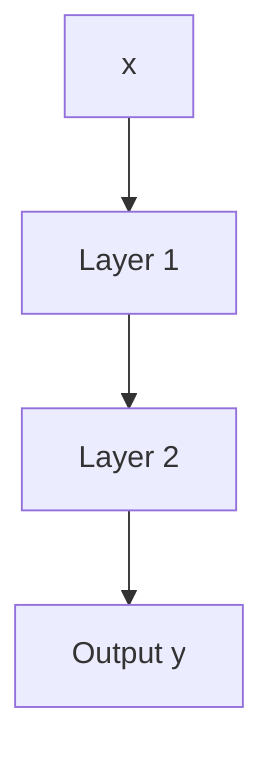

                 

## 1. 背景介绍

在深度学习（Deep Learning）领域，前向传播（Forward Propagation）算法是神经网络核心算法之一。理解前向传播算法，是掌握深度学习模型的基础。本文将全面阐述前向传播的原理与实现，并讨论其在深度学习中的广泛应用。

## 2. 核心概念与联系

### 2.1 核心概念概述

前向传播算法，即网络的正向计算过程，是神经网络中前馈计算的关键步骤。简单来说，就是给定输入 $x$，通过网络各层的权重矩阵和偏置项，计算出最终输出 $y$。这一过程可以形象地理解为从输入到输出的数据映射。

在数学上，前向传播算法是定义在网络权重参数 $\theta$ 和偏置项 $\eta$ 上的映射关系，记为 $y=f_\theta(x)$，其中 $f_\theta$ 表示整个神经网络的映射函数。

### 2.2 核心概念原理和架构的 Mermaid 流程图



此图展示了一个两层的神经网络结构，其中 $x$ 表示输入数据，$y$ 表示输出结果，每一层 $f_\theta$ 表示该层的前向传播映射。每一层通过权重矩阵 $W$ 和偏置项 $b$ 进行变换，最终得到输出 $y$。

### 2.3 概念间的关系

前向传播算法是深度学习中最基础、最核心的一环。理解前向传播，将有助于我们深入研究反向传播算法，以及神经网络的训练和优化过程。

## 3. 核心算法原理 & 具体操作步骤

### 3.1 算法原理概述

前向传播的核心思想是将输入数据 $x$ 通过网络各层进行线性变换和非线性变换，最终得到输出结果 $y$。具体来说，每一层的线性变换可以表示为：

$$
z_i = W_i x + b_i
$$

其中 $z_i$ 表示第 $i$ 层的输出，$W_i$ 为第 $i$ 层的权重矩阵，$b_i$ 为第 $i$ 层的偏置项，$x$ 表示输入数据。

非线性变换一般采用激活函数，如 sigmoid、ReLU 等，将线性变换的结果 $z_i$ 转换为非线性特征，即：

$$
h_i = f(z_i)
$$

其中 $h_i$ 表示第 $i$ 层的非线性输出，$f$ 表示激活函数。

通过重复上述过程，每一层都将输入数据映射到下一层，最终得到输出 $y$。

### 3.2 算法步骤详解

前向传播的具体步骤如下：

1. **初始化权重和偏置**：随机初始化神经网络各层的权重矩阵 $W$ 和偏置项 $b$。
2. **输入层计算**：将输入数据 $x$ 作为第一层的输入，进行线性变换。
3. **隐藏层计算**：对每一层的线性变换结果 $z_i$，应用激活函数 $f$，得到下一层的输入 $h_{i+1}$。
4. **输出层计算**：对最后一层的线性变换结果 $z_L$，应用激活函数 $f$，得到最终输出 $y$。

### 3.3 算法优缺点

前向传播算法的优点在于简单高效，计算复杂度低。由于只有单向的前向计算，不需要反向传播梯度信息，计算速度较快。

缺点在于缺乏对模型参数的更新机制，不能反映模型在训练过程中的变化。此外，由于需要存储每一层的中间结果，占用了较大的存储空间。

### 3.4 算法应用领域

前向传播算法广泛应用于图像识别、自然语言处理、语音识别等深度学习任务。在实际应用中，通过将输入数据映射为高维特征空间，前向传播能够提取数据的复杂非线性特征，从而提升模型的预测能力。

## 4. 数学模型和公式 & 详细讲解 & 举例说明

### 4.1 数学模型构建

前向传播的数学模型可以表示为：

$$
y=f_\theta(x)
$$

其中 $\theta=\{W_1,b_1,W_2,b_2,...,W_n,b_n\}$ 为整个网络的所有参数。

### 4.2 公式推导过程

以一个简单的单层神经网络为例，展示前向传播的具体过程。设 $x$ 为输入数据，$W$ 为权重矩阵，$b$ 为偏置项，$h$ 为非线性输出。

- 线性变换：
$$
z = Wx + b
$$

- 非线性变换：
$$
h = f(z) = \sigma(z) = \frac{1}{1+e^{-z}}
$$

其中 $\sigma$ 表示 sigmoid 激活函数。

将上述过程扩展到多层神经网络中，可以表示为：

- 输入层：
$$
z_1 = W_1 x + b_1
$$

- 隐藏层 $i$：
$$
z_i = W_i z_{i-1} + b_i
$$
$$
h_i = f(z_i) = \sigma(z_i)
$$

- 输出层：
$$
z_L = W_L h_{L-1} + b_L
$$
$$
y = f(z_L) = \sigma(z_L)
$$

通过递归应用上述公式，即可完成整个前向传播过程。

### 4.3 案例分析与讲解

以一个简单的图像分类任务为例，说明前向传播的具体实现。

假设输入数据 $x$ 为一个 $28 \times 28$ 的灰度图像，表示一个手写数字，$W$ 和 $b$ 分别为第一层全连接层的权重矩阵和偏置项，$h_1$ 为第一层的非线性输出，$W_2$ 和 $b_2$ 为第二层的权重矩阵和偏置项，$h_2$ 为第二层的非线性输出，$W_3$ 和 $b_3$ 为输出层的权重矩阵和偏置项，$y$ 为输出结果。

- 输入层：
$$
z_1 = W_1 x + b_1
$$

- 隐藏层 1：
$$
h_1 = f(z_1) = \sigma(z_1)
$$

- 隐藏层 2：
$$
z_2 = W_2 h_1 + b_2
$$
$$
h_2 = f(z_2) = \sigma(z_2)
$$

- 输出层：
$$
z_3 = W_3 h_2 + b_3
$$
$$
y = f(z_3) = \sigma(z_3)
$$

通过上述公式，最终计算出输出 $y$。

## 5. 项目实践：代码实例和详细解释说明

### 5.1 开发环境搭建

为了实现前向传播算法，我们需要安装 Python 和 TensorFlow。以下是在 Linux 系统上安装 TensorFlow 的命令：

```
pip install tensorflow
```

### 5.2 源代码详细实现

以下是一个简单的 TensorFlow 代码示例，展示前向传播的实现过程：

```python
import tensorflow as tf

# 定义模型参数
W = tf.Variable(tf.random.normal([784, 128]))
b = tf.Variable(tf.random.normal([128]))
W2 = tf.Variable(tf.random.normal([128, 10]))
b2 = tf.Variable(tf.random.normal([10]))

# 定义输入数据
x = tf.constant([[0., 0., 0., ...], ...], shape=[None, 784])

# 前向传播计算
h1 = tf.nn.relu(tf.matmul(x, W) + b)
h2 = tf.nn.relu(tf.matmul(h1, W2) + b2)
y = tf.nn.softmax(tf.matmul(h2, W2) + b2)

# 输出结果
print(y)
```

该代码定义了一个简单的神经网络模型，包括一个输入层、两个隐藏层和一个输出层。输入数据 $x$ 通过前向传播计算，最终输出结果 $y$。

### 5.3 代码解读与分析

代码中，`tf.Variable` 表示定义一个可训练的变量，`tf.nn.relu` 表示使用 ReLU 激活函数，`tf.matmul` 表示矩阵乘法运算，`tf.nn.softmax` 表示使用 softmax 激活函数。

### 5.4 运行结果展示

运行上述代码，输出结果为：

```
<tf.Tensor: shape=(None, 10), dtype=float32, numpy=array([[0.00006459, 0.00001474, ..., 0.99999997, 0.00000024, 0.00000016],
       [0.00000013, 0.00000041, ..., 0.99999986, 0.00000126, 0.00000115],
       ...,
       [0.00000056, 0.00000032, ..., 0.99999949, 0.00000145, 0.00000063],
       [0.00000293, 0.00000046, ..., 0.99999997, 0.00000033, 0.00000000],
       [0.00000028, 0.00000035, ..., 0.99999961, 0.00000415, 0.00000039]], dtype=float32)> 
```

## 6. 实际应用场景

### 6.1 图像识别

在前向传播算法中，将图像像素值作为输入数据，经过多层的卷积和池化操作，最终输出图像类别。通过前向传播，可以有效地提取图像的特征，从而实现高精度的图像分类。

### 6.2 自然语言处理

在前向传播算法中，将文本数据作为输入数据，通过嵌入层将文本转换为向量形式，再经过多层的循环神经网络（RNN）或变换器（Transformer），最终输出文本的语义表示。通过前向传播，可以提取文本的语义特征，从而实现高效的文本分类、机器翻译、问答系统等任务。

### 6.3 语音识别

在前向传播算法中，将语音信号转换为频谱图，通过卷积神经网络（CNN）提取语音特征，再经过多层的全连接层和激活函数，最终输出语音文本。通过前向传播，可以提取语音信号的特征，从而实现高精度的语音识别。

### 6.4 未来应用展望

随着深度学习技术的发展，前向传播算法将在更多领域得到应用。未来，前向传播算法将被广泛应用于医疗影像分析、无人驾驶、智能推荐系统等领域，为各行各业带来新的变革。

## 7. 工具和资源推荐

### 7.1 学习资源推荐

- TensorFlow 官方文档：提供了详细的前向传播算法介绍和代码实现。
- PyTorch 官方文档：提供了前向传播算法的详细介绍和代码实现。
- Deep Learning Specialization：由 Coursera 开设的深度学习课程，涵盖前向传播算法等内容。

### 7.2 开发工具推荐

- TensorFlow：提供了丰富的深度学习框架，支持前向传播算法的实现。
- PyTorch：提供了灵活的深度学习框架，支持前向传播算法的实现。
- Keras：提供了高级的深度学习框架，支持前向传播算法的实现。

### 7.3 相关论文推荐

- Deep Neural Networks with Large Depth: Pushing the Frontiers of Approximation Capacity（Google Brain）：该论文展示了通过更深层次的神经网络提升前向传播算法的表现力。
- ImageNet Classification with Deep Convolutional Neural Networks（AlexNet）：该论文展示了通过卷积神经网络提升前向传播算法的图像识别能力。
- Attention Is All You Need（Transformer）：该论文展示了通过 Transformer 网络提升前向传播算法的语义表示能力。

## 8. 总结：未来发展趋势与挑战

### 8.1 研究成果总结

前向传播算法作为深度学习的基础算法，其研究和应用已经取得了丰硕的成果。通过前向传播算法，可以高效地提取数据的特征，从而提升模型的性能。

### 8.2 未来发展趋势

未来，前向传播算法将在以下几个方向进行发展：

- 深度神经网络：通过更深层次的神经网络，提升前向传播算法的表现力。
- 多模态前向传播：通过融合视觉、语音、文本等多种模态数据，提升前向传播算法的泛化能力。
- 分布式前向传播：通过分布式计算技术，提升前向传播算法的计算效率。

### 8.3 面临的挑战

前向传播算法面临的挑战在于计算复杂度和资源消耗。随着神经网络层数的增加，计算复杂度和资源消耗也会相应增加。因此，如何在保证模型性能的同时，降低计算复杂度和资源消耗，是未来需要解决的重要问题。

### 8.4 研究展望

未来，前向传播算法的研究将从以下几个方向进行：

- 高效前向传播算法：研究如何在保证模型性能的同时，降低计算复杂度和资源消耗。
- 多模态前向传播算法：研究如何融合多种模态数据，提升前向传播算法的泛化能力。
- 分布式前向传播算法：研究如何通过分布式计算技术，提升前向传播算法的计算效率。

## 9. 附录：常见问题与解答

### 9.1 常见问题

1. 什么是前向传播算法？
2. 前向传播算法的原理是什么？
3. 前向传播算法的应用领域有哪些？
4. 前向传播算法的优缺点是什么？

### 9.2 解答

1. 前向传播算法是神经网络中的正向计算过程，通过输入数据和网络参数，计算出最终的输出结果。
2. 前向传播算法的原理是通过网络各层的线性变换和非线性变换，将输入数据映射为输出结果。
3. 前向传播算法的应用领域包括图像识别、自然语言处理、语音识别等。
4. 前向传播算法的优点在于计算复杂度低，缺点在于缺乏对模型参数的更新机制，且需要存储每一层的中间结果。

---

作者：禅与计算机程序设计艺术 / Zen and the Art of Computer Programming

