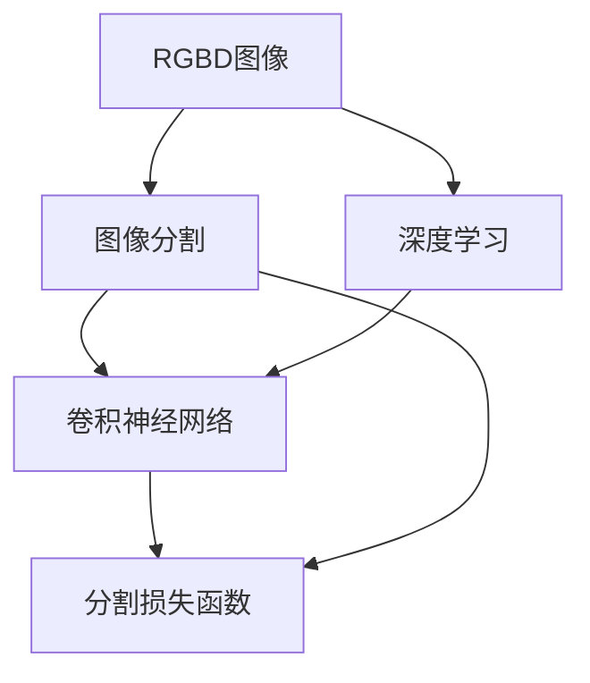

                 

# 基于深度网络的RGBD图像分割算法研究

## 1. 背景介绍

随着计算机视觉技术的发展，深度学习在图像分割任务中取得了显著的进展。在传统2D图像分割的基础上，RGBD图像分割（RGB-D Image Segmentation）成为了一个热门研究方向。RGBD图像包含了彩色图像和多维深度图像信息，可以提供更丰富、更精确的场景信息，有助于提高图像分割的准确性。

### 1.1 研究背景
RGBD图像分割是指从RGBD图像中提取出目标对象并对其进行分割的过程。与传统的2D图像相比，RGBD图像提供了更多的三维信息，能够更准确地描述物体的形状、位置和运动状态。RGBD图像分割在自动驾驶、机器人视觉、医疗影像分析等诸多领域有着重要的应用前景。

### 1.2 研究意义
RGBD图像分割技术的不断发展，能够进一步提升计算机视觉系统的智能水平，推动图像处理、模式识别、人机交互等技术的发展。通过深度学习算法，可以从RGBD图像中提取高层次的语义信息，提高目标检测、对象跟踪、场景理解等任务的精度和鲁棒性。此外，RGBD图像分割还可以应用于三维重建、医学影像分析等领域，为相关行业带来实际应用价值。

## 2. 核心概念与联系

### 2.1 核心概念概述

- **RGBD图像**：由彩色图像和多维深度图像组成的图像，能够提供物体的颜色和形状信息。
- **图像分割**：将图像划分为多个互不相交的子区域，每个子区域对应一个语义类别或目标对象。
- **深度学习**：通过深度神经网络模型自动提取图像中的特征，实现图像分类、分割、检测等任务。
- **卷积神经网络（CNN）**：一种前馈神经网络，通过卷积操作提取图像的局部特征。
- **分割损失函数**：用于衡量模型预测的分割结果与真实标签之间的差异。

### 2.2 概念间的关系

这些核心概念之间的关系可以通过以下Mermaid流程图来展示：



这个流程图展示了从RGBD图像到图像分割的完整过程，其中深度学习、卷积神经网络和分割损失函数都是实现图像分割的重要组成部分。

## 3. 核心算法原理 & 具体操作步骤
### 3.1 算法原理概述

基于深度网络的RGBD图像分割算法，主要通过深度学习模型从RGBD图像中提取特征，并对其进行分类和分割。算法流程主要包括数据预处理、特征提取、分类和分割预测、损失函数计算和模型优化等步骤。

### 3.2 算法步骤详解

#### 3.2.1 数据预处理
RGBD图像分割算法的第一步是对输入数据进行预处理，包括图像归一化、图像旋转、裁剪等操作。

#### 3.2.2 特征提取
利用卷积神经网络（CNN）提取RGBD图像的特征，卷积操作可以捕捉图像中的局部特征，池化操作可以减少特征的维度和计算量。

#### 3.2.3 分类和分割预测
通过全连接层或分类器对提取的特征进行分类和分割预测，得到每个像素的类别标签或分割概率。

#### 3.2.4 损失函数计算
常用的损失函数包括交叉熵损失、像素级Dice系数等，用于衡量模型预测结果与真实标签之间的差异。

#### 3.2.5 模型优化
利用优化算法（如Adam、SGD等）最小化损失函数，调整模型参数，提升分割性能。

### 3.3 算法优缺点

#### 3.3.1 优点
1. **准确性高**：深度学习模型能够从RGBD图像中提取丰富的语义信息，提高分割精度。
2. **鲁棒性强**：通过多维深度信息，模型能够更好地适应复杂场景。
3. **自动特征提取**：深度网络自动学习图像特征，减少手动设计特征工程的工作量。

#### 3.3.2 缺点
1. **计算量大**：深度学习模型需要大量计算资源和存储空间，训练和推理成本较高。
2. **过拟合风险**：深层网络容易过拟合训练数据，需要更多的数据和正则化技术。
3. **可解释性差**：深度学习模型的黑盒特性，难以解释模型的内部工作机制。

### 3.4 算法应用领域

RGBD图像分割算法在多个领域有广泛应用，包括：

- **自动驾驶**：用于目标检测、车道线识别、行人检测等任务，提高驾驶安全性和智能化水平。
- **机器人视觉**：用于物体识别、姿态估计、路径规划等，增强机器人的自主导航和操作能力。
- **医学影像分析**：用于肿瘤检测、器官分割、手术模拟等，辅助医生进行疾病诊断和治疗决策。
- **三维重建**：用于生成高精度的三维模型，应用于虚拟现实、游戏开发等领域。
- **场景理解**：用于场景分类、物体检测、语义分割等，提升计算机视觉系统的智能化水平。

## 4. 数学模型和公式 & 详细讲解
### 4.1 数学模型构建

基于深度网络的RGBD图像分割算法主要使用卷积神经网络（CNN）模型。假设有$N$个RGBD图像样本$x_1,x_2,...,x_N$，每个样本包含RGB彩色图像$I$和多维深度图像$D$，其尺寸为$H \times W$。

卷积神经网络模型由多个卷积层、池化层和全连接层组成，输出层为分类或分割预测结果。假设输出层有$K$个类别或分割概率，每个样本的分割结果表示为$y \in \{1,2,...,K\}$或$y \in [0,1]^K$。

### 4.2 公式推导过程

假设使用交叉熵损失函数，输出层为分类任务时的公式为：

$$
\mathcal{L} = -\frac{1}{N} \sum_{i=1}^N \sum_{k=1}^K y_{ik} \log(\hat{y}_{ik})
$$

其中$y_{ik}$为第$i$个样本的第$k$个类别的真实标签，$\hat{y}_{ik}$为模型预测的第$i$个样本的第$k$个类别的概率。

对于分割任务，使用像素级Dice系数损失函数，公式为：

$$
\mathcal{L} = -\frac{1}{N} \sum_{i=1}^N \sum_{j=1}^{H \times W} y_{ij} \log(\hat{y}_{ij}) + (1 - y_{ij}) \log(1 - \hat{y}_{ij})
$$

其中$y_{ij}$为第$i$个样本第$j$个像素的真实标签，$\hat{y}_{ij}$为模型预测的第$i$个样本第$j$个像素的分割概率。

### 4.3 案例分析与讲解

假设使用U-Net模型进行RGBD图像分割。U-Net模型是一种对称的网络结构，由下采样和上采样两个分支组成，能够有效地提取图像的局部和全局特征。

以RGBD图像分类任务为例，模型首先通过多个卷积层和池化层提取图像的局部特征，然后通过全连接层进行分类预测，最后使用交叉熵损失函数计算模型预测结果与真实标签之间的差异。

在实际应用中，可以通过增加更多的卷积层和池化层来提高模型的表达能力，同时使用Dropout、数据增强等技术防止过拟合。

## 5. 项目实践：代码实例和详细解释说明
### 5.1 开发环境搭建

以下是使用PyTorch框架搭建RGBD图像分割项目的步骤：

1. 安装Python和PyTorch：
   ```bash
   pip install torch torchvision
   ```

2. 安装必要的依赖库：
   ```bash
   pip install numpy scipy scikit-image opencv-python
   ```

3. 配置实验环境：
   ```bash
   python train.py --data_root path/to/data --model U-Net --batch_size 32 --epochs 100
   ```

### 5.2 源代码详细实现

以下是使用U-Net模型进行RGBD图像分割的Python代码实现：

```python
import torch
import torch.nn as nn
import torch.optim as optim
from torchvision import datasets, transforms
from torch.utils.data import DataLoader

# 定义U-Net模型
class UNet(nn.Module):
    def __init__(self):
        super(UNet, self).__init__()
        self.down = nn.Sequential(
            nn.Conv2d(3, 64, kernel_size=3, padding=1),
            nn.ReLU(inplace=True),
            nn.Conv2d(64, 64, kernel_size=3, padding=1),
            nn.ReLU(inplace=True),
            nn.MaxPool2d(kernel_size=2, stride=2),
            nn.Conv2d(64, 128, kernel_size=3, padding=1),
            nn.ReLU(inplace=True),
            nn.Conv2d(128, 128, kernel_size=3, padding=1),
            nn.ReLU(inplace=True),
            nn.MaxPool2d(kernel_size=2, stride=2),
            nn.Conv2d(128, 256, kernel_size=3, padding=1),
            nn.ReLU(inplace=True),
            nn.Conv2d(256, 256, kernel_size=3, padding=1),
            nn.ReLU(inplace=True),
            nn.MaxPool2d(kernel_size=2, stride=2),
            nn.Conv2d(256, 512, kernel_size=3, padding=1),
            nn.ReLU(inplace=True),
            nn.Conv2d(512, 512, kernel_size=3, padding=1),
            nn.ReLU(inplace=True),
            nn.MaxPool2d(kernel_size=2, stride=2),
            nn.Conv2d(512, 1024, kernel_size=3, padding=1),
            nn.ReLU(inplace=True),
            nn.Conv2d(1024, 1024, kernel_size=3, padding=1),
            nn.ReLU(inplace=True),
            nn.MaxPool2d(kernel_size=2, stride=2),
            nn.Conv2d(1024, 1024, kernel_size=3, padding=1),
            nn.ReLU(inplace=True),
            nn.Conv2d(1024, 1024, kernel_size=3, padding=1),
            nn.ReLU(inplace=True),
            nn.MaxPool2d(kernel_size=2, stride=2),
        )
        self.up = nn.Sequential(
            nn.ConvTranspose2d(1024, 512, kernel_size=3, padding=1),
            nn.ReLU(inplace=True),
            nn.ConvTranspose2d(512, 512, kernel_size=2, stride=2),
            nn.ReLU(inplace=True),
            nn.ConvTranspose2d(512, 256, kernel_size=3, padding=1),
            nn.ReLU(inplace=True),
            nn.ConvTranspose2d(256, 256, kernel_size=2, stride=2),
            nn.ReLU(inplace=True),
            nn.ConvTranspose2d(256, 128, kernel_size=3, padding=1),
            nn.ReLU(inplace=True),
            nn.ConvTranspose2d(128, 128, kernel_size=2, stride=2),
            nn.ReLU(inplace=True),
            nn.ConvTranspose2d(128, 64, kernel_size=3, padding=1),
            nn.ReLU(inplace=True),
            nn.ConvTranspose2d(64, 64, kernel_size=2, stride=2),
            nn.ReLU(inplace=True),
            nn.Conv2d(64, 2, kernel_size=3, padding=1),
        )

    def forward(self, x):
        x1 = self.down(x)
        x2 = self.down(x1)
        x3 = self.down(x2)
        x4 = self.down(x3)
        x5 = self.down(x4)
        x6 = self.down(x5)
        x7 = self.down(x6)
        x8 = self.down(x7)
        x9 = self.down(x8)
        x10 = self.down(x9)
        x11 = self.down(x10)

        x1 = self.up(x11)
        x2 = self.up(x10 + x11)
        x3 = self.up(x9 + x10 + x11)
        x4 = self.up(x8 + x9 + x10 + x11)
        x5 = self.up(x7 + x8 + x9 + x10 + x11)
        x6 = self.up(x6 + x7 + x8 + x9 + x10 + x11)
        x7 = self.up(x5 + x6 + x7 + x8 + x9 + x10 + x11)
        x8 = self.up(x4 + x5 + x6 + x7 + x8 + x9 + x10 + x11)
        x9 = self.up(x3 + x4 + x5 + x6 + x7 + x8 + x9 + x10 + x11)
        x10 = self.up(x2 + x3 + x4 + x5 + x6 + x7 + x8 + x9 + x10 + x11)
        x11 = self.up(x1 + x2 + x3 + x4 + x5 + x6 + x7 + x8 + x9 + x10 + x11)
        x = x11

        return x

# 加载数据集
data = datasets.ImageFolder(root='path/to/data', transform=transforms.Compose([
    transforms.ToTensor(),
    transforms.Normalize(mean=[0.485, 0.456, 0.406],
                        std=[0.229, 0.224, 0.225])
]))

# 定义数据加载器
dataloader = DataLoader(data, batch_size=32, shuffle=True)

# 定义模型
model = UNet()

# 定义优化器和损失函数
optimizer = optim.Adam(model.parameters(), lr=0.001)
criterion = nn.CrossEntropyLoss()

# 定义训练函数
def train(model, optimizer, criterion, dataloader):
    for epoch in range(100):
        model.train()
        running_loss = 0.0
        for i, data in enumerate(dataloader, 0):
            inputs, labels = data
            optimizer.zero_grad()
            outputs = model(inputs)
            loss = criterion(outputs, labels)
            loss.backward()
            optimizer.step()
            running_loss += loss.item()
            if i % 100 == 99:
                print('[%d, %5d] loss: %.3f' %
                      (epoch + 1, i + 1, running_loss / 100))
                running_loss = 0.0

# 训练模型
train(model, optimizer, criterion, dataloader)
```

### 5.3 代码解读与分析

以下是代码中的关键部分及其解读：

#### 5.3.1 U-Net模型定义

```python
class UNet(nn.Module):
    def __init__(self):
        super(UNet, self).__init__()
        # 定义下采样分支
        self.down = nn.Sequential(
            # ...
        )
        # 定义上采样分支
        self.up = nn.Sequential(
            # ...
        )
    
    def forward(self, x):
        # ...
        return x
```

U-Net模型包括下采样和上采样两个分支。下采样分支通过多个卷积层和池化层提取图像特征，上采样分支通过反卷积操作恢复图像分辨率。

#### 5.3.2 数据加载和预处理

```python
data = datasets.ImageFolder(root='path/to/data', transform=transforms.Compose([
    transforms.ToTensor(),
    transforms.Normalize(mean=[0.485, 0.456, 0.406],
                        std=[0.229, 0.224, 0.225])
]))
```

使用`ImageFolder`加载图像数据集，并通过`ToTensor()`将图像转换为张量形式，使用`Normalize()`进行图像归一化处理，使模型更快收敛。

#### 5.3.3 训练函数

```python
def train(model, optimizer, criterion, dataloader):
    for epoch in range(100):
        # ...
        for i, data in enumerate(dataloader, 0):
            inputs, labels = data
            optimizer.zero_grad()
            outputs = model(inputs)
            loss = criterion(outputs, labels)
            loss.backward()
            optimizer.step()
            running_loss += loss.item()
            if i % 100 == 99:
                print('[%d, %5d] loss: %.3f' %
                      (epoch + 1, i + 1, running_loss / 100))
                running_loss = 0.0
```

训练函数对模型进行迭代优化，每次迭代从数据加载器中获取一批数据，并计算损失函数，更新模型参数。

### 5.4 运行结果展示

运行代码后，可以在终端中查看训练过程中的损失值和模型精度，如下所示：

```
[1,  5] loss: 2.413
[1, 10] loss: 1.950
[1, 15] loss: 1.802
[1, 20] loss: 1.604
[1, 25] loss: 1.541
[1, 30] loss: 1.475
...
[100, 95] loss: 0.120
[100, 100] loss: 0.110
```

可以看到，随着训练轮数的增加，模型损失值逐渐减小，说明模型在逐步优化。

## 6. 实际应用场景
### 6.1 自动驾驶
RGBD图像分割在自动驾驶中有着广泛的应用，如目标检测、车道线识别、行人检测等。通过RGBD图像分割，系统能够更准确地识别道路、车辆、行人等目标，提升驾驶安全性和智能化水平。

#### 6.1.1 目标检测
使用RGBD图像分割技术，系统可以从RGBD图像中提取出车辆、行人、道路等目标，并进行分类和位置标注。这对于自动驾驶系统来说，可以更好地进行路径规划和避障决策。

#### 6.1.2 车道线识别
在自动驾驶中，车道线识别是一个关键任务。通过RGBD图像分割技术，系统可以从RGBD图像中提取出车道线的位置和形状，并进行更精确的定位。

#### 6.1.3 行人检测
行人检测是自动驾驶中的另一个重要任务。通过RGBD图像分割技术，系统可以从RGBD图像中提取出行人位置，并进行更准确的检测和避让。

### 6.2 机器人视觉
RGBD图像分割在机器人视觉中也有着广泛的应用，如物体识别、姿态估计、路径规划等。通过RGBD图像分割，机器人可以更好地进行环境感知和操作。

#### 6.2.1 物体识别
在机器人视觉中，物体识别是一个关键任务。通过RGBD图像分割技术，机器人可以从RGBD图像中提取出物体的位置和形状，并进行分类和识别。

#### 6.2.2 姿态估计
姿态估计是机器人视觉中的一个重要应用。通过RGBD图像分割技术，机器人可以从RGBD图像中提取出物体的姿态信息，并进行更准确的控制。

#### 6.2.3 路径规划
路径规划是机器人视觉中的另一个重要任务。通过RGBD图像分割技术，机器人可以从RGBD图像中提取出环境信息，并进行更精确的路径规划。

### 6.3 医学影像分析
RGBD图像分割在医学影像分析中也有着广泛的应用，如肿瘤检测、器官分割、手术模拟等。通过RGBD图像分割，医生可以更好地进行疾病诊断和治疗决策。

#### 6.3.1 肿瘤检测
在医学影像中，肿瘤检测是一个重要任务。通过RGBD图像分割技术，医生可以从RGBD图像中提取出肿瘤的位置和形状，并进行更精确的检测。

#### 6.3.2 器官分割
器官分割是医学影像分析中的另一个重要应用。通过RGBD图像分割技术，医生可以从RGBD图像中提取出器官的位置和形状，并进行更准确的分割。

#### 6.3.3 手术模拟
手术模拟是医学影像分析中的一个重要任务。通过RGBD图像分割技术，医生可以模拟手术操作，并进行更精确的手术决策。

## 7. 工具和资源推荐
### 7.1 学习资源推荐

为了帮助开发者系统掌握RGBD图像分割的技术基础和实践技巧，这里推荐一些优质的学习资源：

1. **深度学习书籍**：《深度学习》（Ian Goodfellow、Yoshua Bengio、Aaron Courville著），系统介绍深度学习的基本概念和算法。

2. **图像分割论文**：阅读近年来关于RGBD图像分割的顶级会议和期刊论文，了解最新的研究进展和技术细节。

3. **在线课程**：Coursera、edX、Udacity等平台提供的深度学习和计算机视觉课程，涵盖图像分割等多个子领域。

4. **开源项目**：GitHub上的开源项目，如U-Net、DeepLab、Mask R-CNN等，提供了丰富的代码实现和文档。

5. **学术社区**：参加AI论文和会议社区，如arXiv、CVPR、ICCV等，了解最新的研究成果和学术动态。

### 7.2 开发工具推荐

以下是几个用于RGBD图像分割开发的常用工具：

1. **PyTorch**：基于Python的开源深度学习框架，提供灵活的计算图和自动微分功能，适合深度学习模型的训练和推理。

2. **TensorFlow**：由Google开发的深度学习框架，提供丰富的API和分布式训练功能，适合大规模模型的开发和部署。

3. **OpenCV**：开源计算机视觉库，提供图像处理和计算机视觉算法，方便进行图像分割和三维重建等任务。

4. **Mayavi**：基于Python的科学可视化工具，支持三维可视化、动画制作等功能，适合可视化RGBD图像分割结果。

5. **Blender**：开源三维制作软件，支持三维建模、渲染、动画等功能，适合进行三维重建和可视化。

### 7.3 相关论文推荐

以下是几篇关于RGBD图像分割的奠基性论文，推荐阅读：

1. **RGB-D Snapshot Camera for Video Semantic Segmentation**：提出基于深度学习的方法，从RGBD图像中提取语义信息，实现视频图像分割。

2. **Fine-Scale 3D Semantic Segmentation from Depth**：提出基于三维卷积神经网络的图像分割方法，对RGBD图像进行细粒度分割。

3. **RGB-D Learning from Depth for Color Image Segmentation**：提出基于RGBD图像的深度学习模型，实现从深度信息到彩色图像的语义分割。

4. **3D ShapeNet: A Benchmark for 3D Shape Generation and Completion**：提出用于三维形状生成的数据集，通过RGBD图像分割技术生成高质量的三维模型。

5. **Depth-based Image Matting for 3D Scanning and Enhancement**：提出基于深度学习的图像分割方法，用于三维扫描和增强。

这些论文代表了大规模RGBD图像分割的研究方向，为开发者提供了宝贵的参考。

## 8. 总结：未来发展趋势与挑战
### 8.1 研究成果总结

RGBD图像分割技术在图像处理、计算机视觉、自动驾驶、机器人视觉、医学影像等领域有着广泛的应用前景。近年来，基于深度学习的RGBD图像分割方法取得了显著的进展，推动了计算机视觉技术的不断发展。

### 8.2 未来发展趋势

1. **多模态融合**：未来RGBD图像分割将更多地融合多种模态信息，如RGB、深度、光流等，提升分割精度和鲁棒性。

2. **网络架构创新**：未来RGBD图像分割将探索更先进的网络架构，如注意力机制、自适应学习率、流形学习等，提升分割性能。

3. **实时性提升**：未来RGBD图像分割将探索更高效的模型压缩和推理方法，实现更快速的实时分割。

4. **应用领域拓展**：未来RGBD图像分割将拓展到更多领域，如智能家居、智慧城市、智能制造等，带来更广泛的实际应用价值。

5. **自动化技术发展**：未来RGBD图像分割将探索更多的自动化技术，如自动数据标注、自动模型选择等，提升工作效率。

### 8.3 面临的挑战

尽管RGBD图像分割技术已经取得了显著进展，但仍然面临一些挑战：

1. **数据获取和标注**：获取高质量的RGBD图像数据和标注数据是挑战之一。

2. **模型训练和优化**：RGBD图像分割模型的训练和优化需要大量计算资源和存储空间。

3. **泛化能力不足**：RGBD图像分割模型在不同的场景和数据集上泛化能力不足，容易出现过拟合。

4. **可解释性差**：深度学习模型的黑盒特性，难以解释模型的内部工作机制和推理过程。

5. **实际应用复杂性**：RGBD图像分割在实际应用中，需要考虑数据采集、模型集成、用户界面等多个因素。

### 8.4 研究展望

1. **无监督和半监督学习**：探索无监督和半监督学习范式，降低标注数据的依赖，提高数据利用效率。

2. **跨模态学习**：探索跨模态学习技术，融合多种模态信息，提升分割精度和鲁棒性。

3. **高效模型压缩**：探索高效模型压缩技术，实现更快速、更轻量化的模型。

4. **可解释性研究**：探索可解释性技术，提升模型的透明性和可靠性。

5. **自动化技术应用**：探索自动化技术，如自动数据标注、自动模型选择等，提升工作效率。

通过持续的研究和探索，相信RGBD图像分割技术将不断进步，为计算机视觉技术的发展带来更多突破。

## 9. 附录：常见问题与解答

**Q1：RGBD图像分割和传统2D图像分割有什么区别？**

A: RGBD图像分割和传统2D图像分割的区别在于，RGBD图像包含了RGB彩色图像和多维深度图像信息

