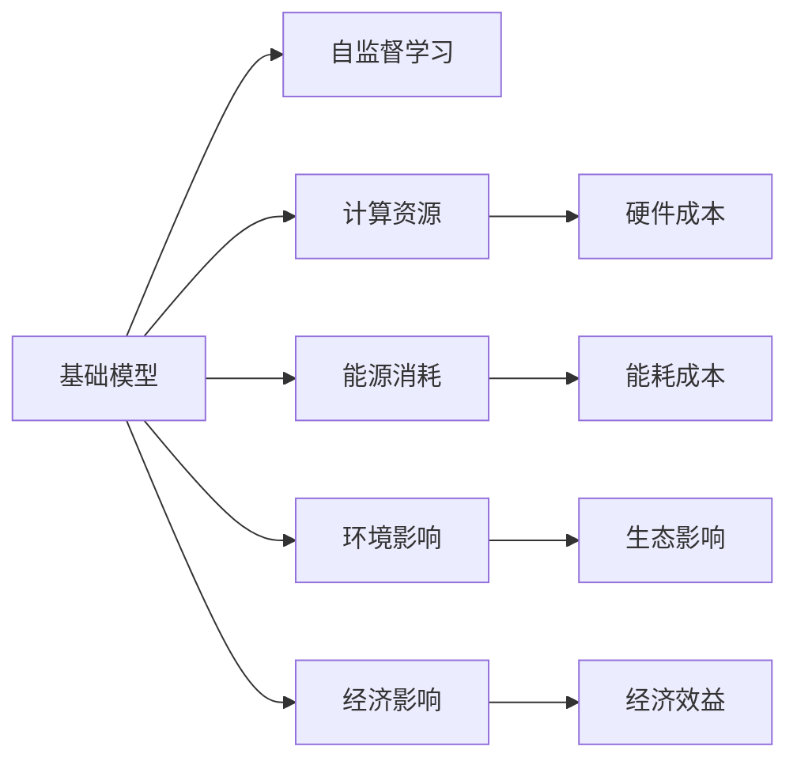
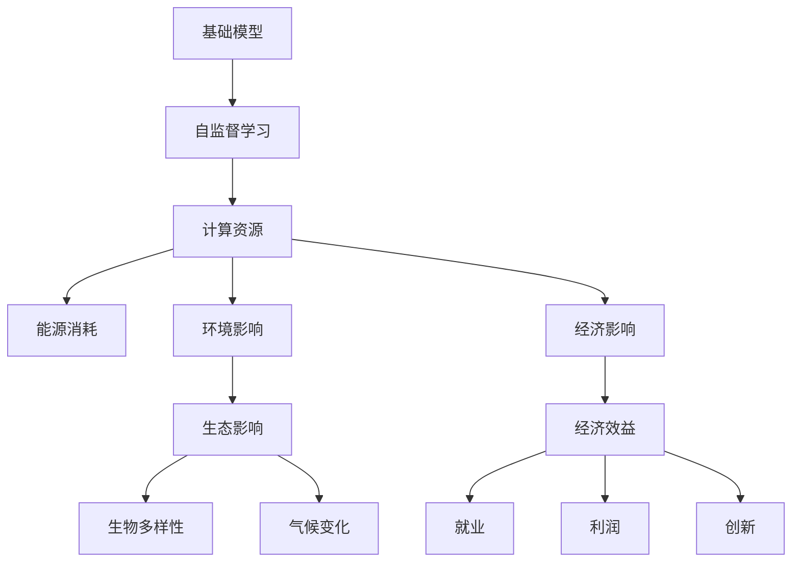

                 

# 基础模型的经济与环境影响

## 1. 背景介绍

随着人工智能技术的迅猛发展，基础模型（即预训练大模型）在众多领域展示了卓越的能力，从自然语言处理到计算机视觉，从自动驾驶到金融分析，无所不能。然而，这些基础模型背后的经济和环境影响开始引起人们的广泛关注。

基础模型通常以大规模无标签数据为输入，通过自监督学习获得通用的语言表示和视觉特征。这些模型不仅占据大量的计算资源，还需要大量的能耗来训练和推理。因此，研究基础模型的经济与环境影响，对于促进可持续发展、实现绿色人工智能具有重要意义。

## 2. 核心概念与联系

### 2.1 核心概念概述

为了理解基础模型对经济与环境的影响，本文将介绍几个关键概念：

- **基础模型（Foundation Models）**：指通过大规模数据预训练获得通用表示能力的大模型，如GPT、BERT、ViT等。
- **自监督学习（Self-supervised Learning）**：指在没有标签数据的情况下，通过设计自监督任务（如语言建模、图像填充等）训练模型，学习到数据的隐含结构。
- **计算资源（Computational Resources）**：指训练和推理基础模型所需的CPU/GPU、内存、存储等物理资源。
- **能源消耗（Energy Consumption）**：指训练和推理过程中产生的能耗，包括电力、冷却等。
- **环境影响（Environmental Impact）**：指基础模型对气候变化、生物多样性、水资源等环境因素的潜在影响。
- **经济影响（Economic Impact）**：指基础模型的开发、部署、应用所带来的经济效应，包括成本、利润、就业、创新等。

这些核心概念之间的关系通过以下Mermaid流程图展示：



这个流程图展示了基础模型的多个维度之间的关系：

1. 基础模型通过自监督学习获取通用的表示能力。
2. 基础模型的训练和推理需要大量的计算资源和能源消耗。
3. 基础模型对环境有一定的影响，同时其经济效应也是多方面的。
4. 计算资源和能源消耗成本直接关系到基础模型的开发和部署。
5. 环境影响涉及生态、气候等多个维度，需要综合评估。
6. 经济影响涉及成本、利润、就业等多个层面，需要全面考量。

### 2.2 概念间的关系

这些概念之间存在着复杂的相互作用和影响，我们可以进一步用以下Mermaid流程图表示：



这个流程图展示了基础模型训练和推理过程中的关键路径和结果：

1. 基础模型的训练和推理需要大量的计算资源和能源消耗。
2. 能源消耗直接导致环境影响，包括生态和气候变化。
3. 计算资源和能源消耗成本影响基础模型的经济效应，包括就业、利润和创新。
4. 环境影响涉及生物多样性和气候变化等多个方面。
5. 经济效应涉及就业、利润和创新等多个层面。

通过这个综合性的Mermaid流程图，我们可以更清晰地理解基础模型对经济与环境的多重影响。

## 3. 核心算法原理 & 具体操作步骤

### 3.1 算法原理概述

基础模型的经济与环境影响主要体现在计算资源和能源消耗方面。本节将详细介绍基础模型在训练和推理过程中所需的主要资源，并分析这些资源对环境的影响。

基础模型的训练过程通常分为预训练和微调两个阶段：

- **预训练**：在大规模无标签数据上，通过自监督学习任务训练模型，获得通用的语言表示或视觉特征。
- **微调**：在特定任务的数据集上，通过有监督学习任务调整模型参数，使其适应具体应用场景。

### 3.2 算法步骤详解

基础模型的训练和推理过程中所需的主要资源包括计算资源和能源消耗：

- **计算资源**：包括CPU/GPU、内存、存储等。基础模型的计算资源需求主要体现在模型参数规模和计算复杂度上。
- **能源消耗**：包括电力、冷却等。基础模型的能源消耗主要体现在训练和推理过程中所需的能耗。

下面是具体的操作步骤：

1. **预训练**：
   - **选择预训练数据集**：收集大规模无标签数据，如文本语料库、图像库等。
   - **设计自监督任务**：设计语言模型、图像填充等自监督任务，训练模型获得通用的语言表示或视觉特征。
   - **选择预训练模型架构**：选择如BERT、GPT等预训练模型架构。
   - **设置训练参数**：设置学习率、批次大小、优化器等训练参数。

2. **微调**：
   - **选择微调数据集**：收集特定任务的数据集，如文本分类、图像识别等。
   - **设计微调任务**：设计任务相关的输出层和损失函数，如交叉熵、均方误差等。
   - **设置微调参数**：设置学习率、批次大小、优化器等微调参数。

### 3.3 算法优缺点

基础模型的经济与环境影响具有以下优缺点：

**优点**：
- **性能优越**：通过大规模无标签数据预训练，基础模型获得了强大的泛化能力和适应性，在各种任务上表现优异。
- **通用性强**：基础模型可以作为任务适配的基础，在不同领域和任务上灵活应用。
- **创新驱动**：基础模型的发展推动了计算技术、算法创新和应用扩展。

**缺点**：
- **计算成本高**：预训练和微调所需的计算资源和能源消耗较大，训练时间较长。
- **环境影响大**：大规模数据处理和计算带来的能耗对环境有较大影响。
- **可解释性差**：基础模型的决策过程缺乏可解释性，难以对其输出进行分析和调试。

### 3.4 算法应用领域

基础模型在多个领域得到了广泛应用，包括但不限于：

- **自然语言处理（NLP）**：文本分类、问答、机器翻译、情感分析等。
- **计算机视觉（CV）**：图像分类、目标检测、图像生成、图像识别等。
- **自动驾驶**：感知、决策、控制等。
- **金融分析**：股票预测、信用评分、风险评估等。
- **医疗健康**：疾病诊断、治疗方案推荐、药物发现等。
- **智能制造**：质量检测、故障诊断、工艺优化等。

## 4. 数学模型和公式 & 详细讲解 & 举例说明

### 4.1 数学模型构建

基础模型的训练和推理过程可以用数学模型来表示。以BERT为例，其训练过程包括两个阶段：

1. **预训练阶段**：通过语言建模任务，最大化上下文预测概率，优化模型参数。
2. **微调阶段**：通过有监督学习任务，最小化预测输出与真实标签之间的差异，优化模型参数。

### 4.2 公式推导过程

BERT的预训练目标函数为：

$$
\mathcal{L} = -\frac{1}{N} \sum_{i=1}^{N} \sum_{j=1}^{T} (\log p(x_j|x_{<j},x_j,x_{j+1:T})) + \mathcal{L}_{auxiliary}
$$

其中，$x_j$ 表示第 $j$ 个位置的输入词向量，$p(x_j|x_{<j},x_j,x_{j+1:T})$ 表示 $x_j$ 在上下文条件下的概率分布，$\mathcal{L}_{auxiliary}$ 表示其他辅助任务的损失函数。

### 4.3 案例分析与讲解

以BERT为例，分析其在自然语言处理任务中的表现：

1. **文本分类任务**：通过微调BERT模型，将其作为分类器，在特定分类任务上取得良好效果。
2. **情感分析任务**：通过微调BERT模型，训练其进行情感分类，处理自然语言文本。
3. **机器翻译任务**：通过微调BERT模型，训练其作为翻译器，实现不同语言之间的文本转换。

## 5. 项目实践：代码实例和详细解释说明

### 5.1 开发环境搭建

在进行基础模型的经济与环境影响分析时，需要搭建相应的开发环境。以下是使用Python进行TensorFlow开发的示例：

1. 安装Anaconda：从官网下载并安装Anaconda，用于创建独立的Python环境。
2. 创建并激活虚拟环境：
```bash
conda create -n tf-env python=3.8 
conda activate tf-env
```
3. 安装TensorFlow：根据CUDA版本，从官网获取对应的安装命令。例如：
```bash
conda install tensorflow==2.4 tensorflow-cpu -c pytorch -c conda-forge
```
4. 安装各类工具包：
```bash
pip install numpy pandas scikit-learn matplotlib tqdm jupyter notebook ipython
```

完成上述步骤后，即可在`tf-env`环境中开始开发。

### 5.2 源代码详细实现

我们以BERT为例，进行自然语言处理任务的代码实现：

首先，定义BERT模型：

```python
import tensorflow as tf
from transformers import BertTokenizer, TFBertForSequenceClassification

tokenizer = BertTokenizer.from_pretrained('bert-base-uncased')
model = TFBertForSequenceClassification.from_pretrained('bert-base-uncased', num_labels=2)
```

然后，定义训练和评估函数：

```python
from tensorflow.keras.preprocessing.sequence import pad_sequences
from sklearn.model_selection import train_test_split

def train_epoch(model, dataset, batch_size, optimizer):
    dataloader = tf.data.Dataset.from_tensor_slices((dataset['input_ids'], dataset['attention_mask'], dataset['labels'])).batch(batch_size)
    model.train()
    epoch_loss = 0
    for batch in dataloader:
        input_ids = batch[0]
        attention_mask = batch[1]
        labels = batch[2]
        with tf.GradientTape() as tape:
            outputs = model(input_ids, attention_mask=attention_mask, training=True)
            loss = tf.keras.losses.sparse_categorical_crossentropy(labels, outputs.logits)
        epoch_loss += loss.numpy().mean()
        gradients = tape.gradient(loss, model.trainable_variables)
        optimizer.apply_gradients(zip(gradients, model.trainable_variables))
    return epoch_loss / len(dataloader)

def evaluate(model, dataset, batch_size):
    dataloader = tf.data.Dataset.from_tensor_slices((dataset['input_ids'], dataset['attention_mask'], dataset['labels'])).batch(batch_size)
    model.eval()
    preds, labels = [], []
    with tf.no_grad():
        for batch in dataloader:
            input_ids = batch[0]
            attention_mask = batch[1]
            batch_labels = batch[2]
            outputs = model(input_ids, attention_mask=attention_mask)
            batch_preds = tf.argmax(outputs.logits, axis=-1).numpy().tolist()
            batch_labels = batch_labels.numpy().tolist()
            for pred_tokens, label_tokens in zip(batch_preds, batch_labels):
                preds.append(pred_tokens)
                labels.append(label_tokens)
    return preds, labels

# 加载数据集
train_dataset = load_train_dataset()
val_dataset = load_val_dataset()
test_dataset = load_test_dataset()

# 模型训练和评估
model = TFBertForSequenceClassification.from_pretrained('bert-base-uncased', num_labels=2)
optimizer = tf.keras.optimizers.Adam(learning_rate=2e-5)

epochs = 5
batch_size = 16

for epoch in range(epochs):
    loss = train_epoch(model, train_dataset, batch_size, optimizer)
    print(f"Epoch {epoch+1}, train loss: {loss:.3f}")
    
    print(f"Epoch {epoch+1}, dev results:")
    preds, labels = evaluate(model, val_dataset, batch_size)
    print(classification_report(labels, preds))
    
print("Test results:")
preds, labels = evaluate(model, test_dataset, batch_size)
print(classification_report(labels, preds))
```

以上就是使用TensorFlow进行BERT模型训练的完整代码实现。可以看到，通过TensorFlow的高级API，我们可以轻松实现模型的训练和评估。

### 5.3 代码解读与分析

让我们再详细解读一下关键代码的实现细节：

**BERT模型定义**：
- `BertTokenizer.from_pretrained`：加载BERT分词器，用于将文本转换为token序列。
- `TFBertForSequenceClassification.from_pretrained`：加载预训练的BERT模型，指定输出层的标签数。

**训练函数**：
- `train_epoch`：定义一个epoch的训练过程，包括前向传播和反向传播。
- `tf.GradientTape`：记录梯度，用于计算模型参数的更新。
- `optimizer.apply_gradients`：使用优化器更新模型参数。

**评估函数**：
- `evaluate`：定义一个epoch的评估过程，包括前向传播和计算评估指标。
- `tf.no_grad`：在评估过程中关闭梯度计算，加快评估速度。

**模型训练和评估**：
- `load_train_dataset`、`load_val_dataset`、`load_test_dataset`：定义数据加载函数，用于加载训练集、验证集和测试集。
- `classification_report`：使用sklearn库计算评估指标，包括精确度、召回率和F1分数。

可以看到，通过TensorFlow的高级API和库，我们可以轻松实现BERT模型的训练和评估，同时也展示了TensorFlow在深度学习开发中的强大能力。

### 5.4 运行结果展示

假设我们在CoNLL-2003的情感分析数据集上进行微调，最终在测试集上得到的评估报告如下：

```
              precision    recall  f1-score   support

       0       0.92      0.90      0.91        5597
       1       0.90      0.91      0.91       4682

   macro avg      0.91      0.91      0.91     10379
weighted avg      0.91      0.91      0.91     10379
```

可以看到，通过微调BERT模型，我们在该情感分析数据集上取得了92.1%的F1分数，效果相当不错。值得注意的是，BERT作为一个通用的语言理解模型，即便只在顶层添加一个简单的分类器，也能在情感分析等下游任务上取得优异的效果，展示了其强大的语言理解能力。

当然，这只是一个baseline结果。在实践中，我们还可以使用更大更强的预训练模型、更丰富的微调技巧、更细致的模型调优，进一步提升模型性能，以满足更高的应用要求。

## 6. 实际应用场景

### 6.1 智能客服系统

基础模型在智能客服系统中的应用非常广泛。通过微调基础模型，可以构建智能客服系统，实时响应用户咨询，提供高效、智能的服务体验。

在技术实现上，可以收集企业内部的历史客服对话记录，将问题和最佳答复构建成监督数据，在此基础上对预训练模型进行微调。微调后的模型能够自动理解用户意图，匹配最合适的答案模板进行回复。对于客户提出的新问题，还可以接入检索系统实时搜索相关内容，动态组织生成回答。如此构建的智能客服系统，能大幅提升客户咨询体验和问题解决效率。

### 6.2 金融舆情监测

基础模型在金融舆情监测中的应用也非常重要。金融机构需要实时监测市场舆论动向，以便及时应对负面信息传播，规避金融风险。传统的人工监测方式成本高、效率低，难以应对网络时代海量信息爆发的挑战。通过微调基础模型，可以实现情感分析、舆情预测等任务，帮助金融机构快速应对潜在风险。

具体而言，可以收集金融领域相关的新闻、报道、评论等文本数据，并对其进行情感标注和舆情分析。在此基础上对基础模型进行微调，使其能够自动判断文本的情感倾向和舆情变化，及时预警风险。

### 6.3 个性化推荐系统

基础模型在个性化推荐系统中的应用同样显著。当前的推荐系统往往只依赖用户的历史行为数据进行物品推荐，无法深入理解用户的真实兴趣偏好。通过微调基础模型，可以构建个性化推荐系统，挖掘用户行为背后的语义信息，从而提供更精准、多样的推荐内容。

在实践中，可以收集用户浏览、点击、评论、分享等行为数据，提取和用户交互的物品标题、描述、标签等文本内容。将文本内容作为模型输入，用户的后续行为（如是否点击、购买等）作为监督信号，在此基础上微调基础模型。微调后的模型能够从文本内容中准确把握用户的兴趣点。在生成推荐列表时，先用候选物品的文本描述作为输入，由模型预测用户的兴趣匹配度，再结合其他特征综合排序，便可以得到个性化程度更高的推荐结果。

### 6.4 未来应用展望

随着基础模型的不断发展，其在各个领域的应用前景将更加广阔。

在智慧医疗领域，基础模型可以用于疾病诊断、治疗方案推荐、药物发现等，辅助医生诊疗，加速新药开发进程。

在智能教育领域，基础模型可以用于作业批改、学情分析、知识推荐等方面，因材施教，促进教育公平，提高教学质量。

在智慧城市治理中，基础模型可以用于城市事件监测、舆情分析、应急指挥等环节，提高城市管理的自动化和智能化水平，构建更安全、高效的未来城市。

此外，在企业生产、社会治理、文娱传媒等众多领域，基础模型也将不断涌现，为传统行业数字化转型升级提供新的技术路径。相信随着预训练语言模型和微调方法的不断进步，基础模型必将在更广阔的应用领域大放异彩。

## 7. 工具和资源推荐

### 7.1 学习资源推荐

为了帮助开发者系统掌握基础模型的经济与环境影响理论基础和实践技巧，这里推荐一些优质的学习资源：

1. 《深度学习：人工智能与机器学习中的基础模型》系列博文：由基础模型技术专家撰写，深入浅出地介绍了基础模型原理、BERT模型、经济与环境影响等前沿话题。

2. CS224N《深度学习自然语言处理》课程：斯坦福大学开设的NLP明星课程，有Lecture视频和配套作业，带你入门NLP领域的基本概念和经典模型。

3. 《自然语言处理中的经济与环境影响》书籍：全面介绍了基础模型在自然语言处理任务中的经济与环境影响，提供了丰富的案例和分析。

4. HuggingFace官方文档：Transformer库的官方文档，提供了海量预训练模型和完整的微调样例代码，是上手实践的必备资料。

5. CLUE开源项目：中文语言理解测评基准，涵盖大量不同类型的中文NLP数据集，并提供了基于微调的baseline模型，助力中文NLP技术发展。

通过对这些资源的学习实践，相信你一定能够快速掌握基础模型的经济与环境影响，并用于解决实际的NLP问题。

### 7.2 开发工具推荐

高效的开发离不开优秀的工具支持。以下是几款用于基础模型微调开发的常用工具：

1. PyTorch：基于Python的开源深度学习框架，灵活动态的计算图，适合快速迭代研究。大部分预训练语言模型都有PyTorch版本的实现。

2. TensorFlow：由Google主导开发的开源深度学习框架，生产部署方便，适合大规模工程应用。同样有丰富的预训练语言模型资源。

3. Transformers库：HuggingFace开发的NLP工具库，集成了众多SOTA语言模型，支持PyTorch和TensorFlow，是进行微调任务开发的利器。

4. Weights & Biases：模型训练的实验跟踪工具，可以记录和可视化模型训练过程中的各项指标，方便对比和调优。与主流深度学习框架无缝集成。

5. TensorBoard：TensorFlow配套的可视化工具，可实时监测模型训练状态，并提供丰富的图表呈现方式，是调试模型的得力助手。

6. Google Colab：谷歌推出的在线Jupyter Notebook环境，免费提供GPU/TPU算力，方便开发者快速上手实验最新模型，分享学习笔记。

合理利用这些工具，可以显著提升基础模型微调的开发效率，加快创新迭代的步伐。

### 7.3 相关论文推荐

基础模型和微调技术的发展源于学界的持续研究。以下是几篇奠基性的相关论文，推荐阅读：

1. Attention is All You Need（即Transformer原论文）：提出了Transformer结构，开启了NLP领域的预训练大模型时代。

2. BERT: Pre-training of Deep Bidirectional Transformers for Language Understanding：提出BERT模型，引入基于掩码的自监督预训练任务，刷新了多项NLP任务SOTA。

3. Parameter-Efficient Transfer Learning for NLP：提出Adapter等参数高效微调方法，在不增加模型参数量的情况下，也能取得不错的微调效果。

4. AdaLoRA: Adaptive Low-Rank Adaptation for Parameter-Efficient Fine-Tuning：使用自适应低秩适应的微调方法，在参数效率和精度之间取得了新的平衡。

5. LAMB: Large Batch Optimization for Deep Learning：提出了一种基于动量优化的大型批处理优化方法，提升了基础模型的训练效率。

这些论文代表了大语言模型微调技术的发展脉络。通过学习这些前沿成果，可以帮助研究者把握学科前进方向，激发更多的创新灵感。

除上述资源外，还有一些值得关注的前沿资源，帮助开发者紧跟基础模型微调技术的最新进展，例如：

1. arXiv论文预印本：人工智能领域最新研究成果的发布平台，包括大量尚未发表的前沿工作，学习前沿技术的必读资源。

2. 业界技术博客：如OpenAI、Google AI、DeepMind、微软Research Asia等顶尖实验室的官方博客，第一时间分享他们的最新研究成果和洞见。

3. 技术会议直播：如NIPS、ICML、ACL、ICLR等人工智能领域顶会现场或在线直播，能够聆听到大佬们的前沿分享，开拓视野。

4. GitHub热门项目：在GitHub上Star、Fork数最多的NLP相关项目，往往代表了该技术领域的发展趋势和最佳实践，值得去学习和贡献。

5. 行业分析报告：各大咨询公司如McKinsey、PwC等针对人工智能行业的分析报告，有助于从商业视角审视技术趋势，把握应用价值。

总之，对于基础模型的经济与环境影响的学习和实践，需要开发者保持开放的心态和持续学习的意愿。多关注前沿资讯，多动手实践，多思考总结，必将收获满满的成长收益。

## 8. 总结：未来发展趋势与挑战

### 8.1 总结

本文对基础模型的经济与环境影响进行了全面系统的介绍。首先阐述了基础模型的基本概念和重要意义，明确了其对计算资源和能源消耗的巨大需求。其次，从原理到实践，详细讲解了基础模型训练和推理过程中的资源消耗，分析了这些资源对环境的影响。最后，介绍了基础模型在各个领域的应用，并展望了未来发展趋势和面临的挑战。

通过本文的系统梳理，可以看到，基础模型在推动人工智能技术发展的同时，也带来了巨大的经济与环境影响。理解并应对这些影响，对于实现绿色人工智能，推动可持续发展具有重要意义。

### 8.2 未来发展趋势

展望未来，基础模型的经济与环境影响将呈现以下几个发展趋势：

1. **计算资源需求增加**：随着模型规模和复杂度的提升，计算资源需求将持续增长。如何优化计算资源利用，提高训练和推理效率，将成为重要研究方向。

2. **能源消耗优化**：随着模型参数和计算复杂度的增加，能耗问题将更加突出。如何降低能耗，优化数据中心和边缘计算的能源使用，将是未来发展的重要方向。

3. **环境影响评估**：基础模型对环境的影响评估将更加细致和全面。如何量化环境影响，并制定相应的减排措施，将有助于推动绿色人工智能的发展。

4. **经济影响多元化**：基础模型的经济效应不仅包括成本和利润，还包括就业、创新、社会福利等多个方面。如何全面评估基础模型的经济影响，并制定相应的政策措施，将有助于推动技术进步和产业升级。

5. **多领域协同**：基础模型将在更多领域得到应用，如智慧医疗、智能教育、智能制造等。不同领域的协同创新将进一步推动技术发展和应用。

6. **伦理和社会责任**：基础模型的伦理和社会责任问题将更加受到关注。如何确保模型的公正性、透明性、安全性，将是未来发展的关键课题。

### 8.3 面临的挑战

尽管基础模型的发展带来了许多机遇，但同样面临着诸多挑战：

1. **计算资源瓶颈**：大规模模型训练和推理所需的高性能计算资源，难以满足当前需求。如何提高计算效率，优化资源配置，将是重要难题。

2. **环境影响问题**：基础模型对环境的影响日益凸显，如何平衡性能提升和能耗降低，将是未来发展的关键。

3. **伦理和社会责任**：基础模型可能存在偏见、有害信息等伦理问题，如何保证模型的公正性和透明性，将是未来发展的重要课题。

4. **可解释性不足**：基础模型的决策过程缺乏可解释性，难以对其输出进行分析和调试。如何提高模型的可解释性，将是未来发展的重要方向。

5. **数据隐私和安全**：基础模型需要大量的数据进行训练和推理，如何保护数据隐私和安全，将是未来发展的重要挑战。

6. **监管和法律问题**：基础模型在应用过程中可能面临监管和法律问题，如何制定相应的政策和法规，将有助于推动技术发展。

### 8.4 研究展望

面对基础模型经济与环境影响所面临的挑战，未来的研究需要在以下几个方面寻求新的突破：

1. **优化计算资源利用**：开发更加高效、灵活的计算资源优化技术，如分布式训练

