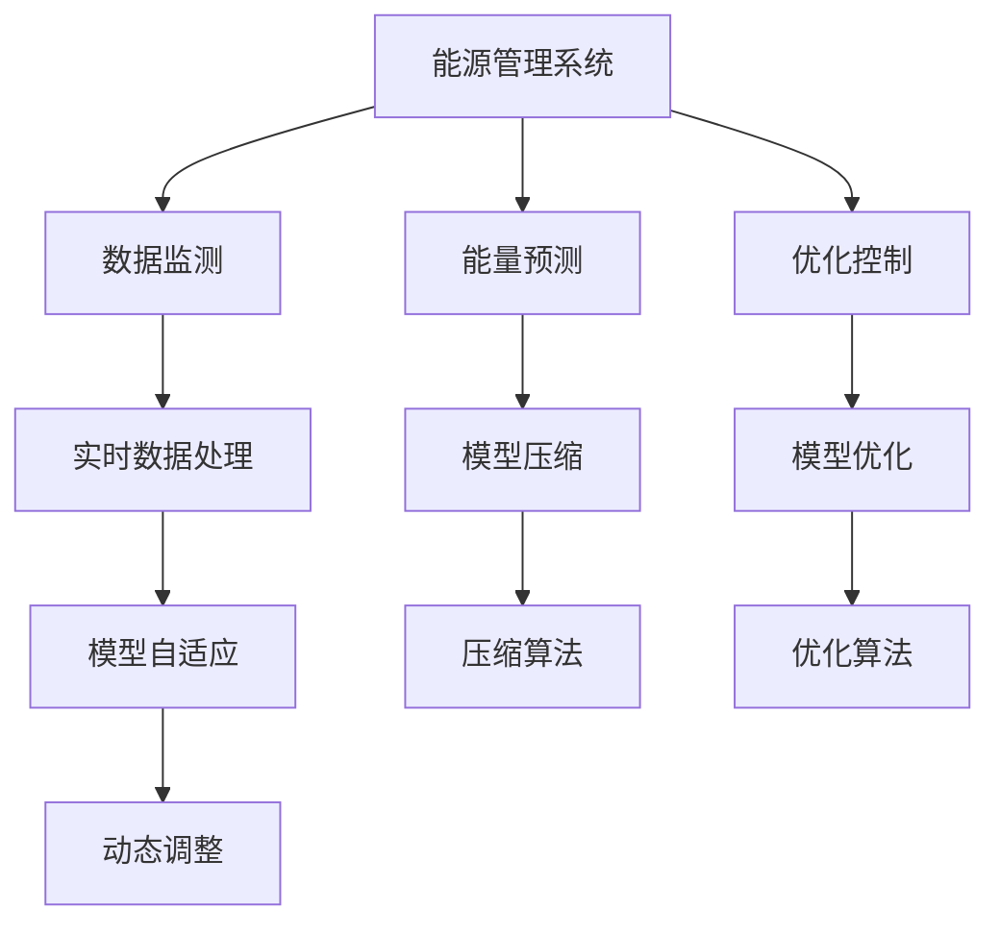
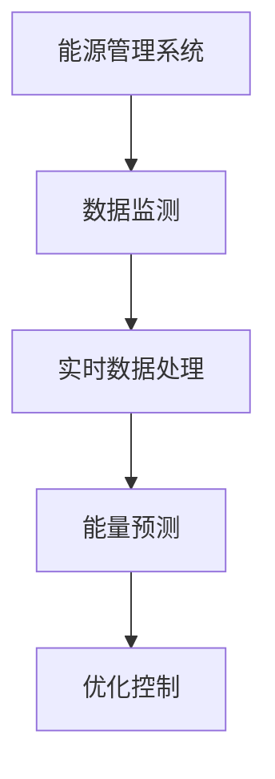
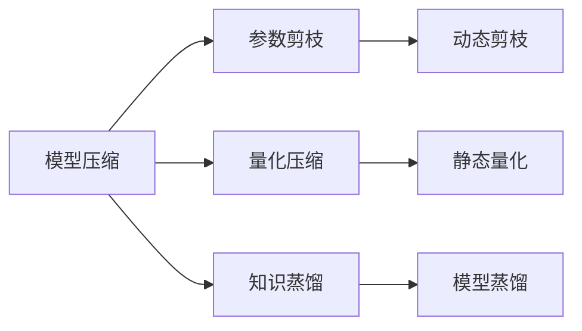
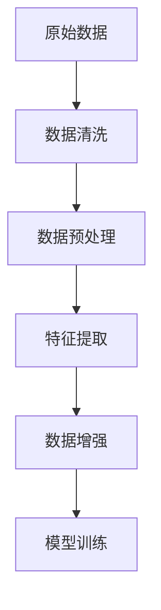
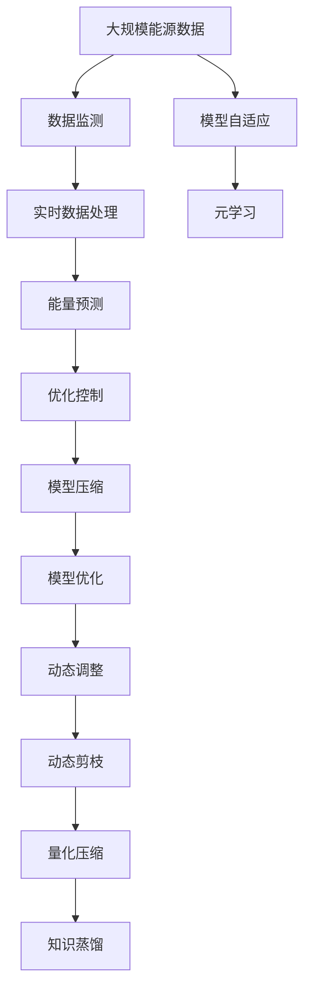

                 

# 一切皆是映射：构建高效能源管理系统的元学习方法

> 关键词：能源管理系统,元学习,自适应,深度学习,模型压缩,模型优化

## 1. 背景介绍

在现代工业领域中，能源管理系统(Energy Management System, EMS)扮演着至关重要的角色。其核心任务是监测和控制能源的消耗，优化能源利用效率，减少能源浪费。然而，随着生产规模的扩大和工艺流程的复杂化，能源管理系统的需求日益增加，系统规模和数据量不断增长。传统的基于规则或统计模型的能源管理系统，由于缺乏自适应性和泛化能力，难以适应新环境和数据的变化，亟需一种更加灵活、高效的解决方案。

元学习方法（Meta-Learning）在近年来得到了广泛的关注和应用，其核心思想是在有限的数据上学习到可泛化的模型和策略，使得模型能够适应新任务和数据。在能源管理系统中，元学习方法可以应用于多变环境和实时数据处理，提高能源管理系统的自适应性和实时响应能力。本文将介绍一种基于元学习的能源管理系统，通过自适应模型压缩和优化策略，构建高效、灵活的能源管理系统，以应对未来的复杂挑战。

## 2. 核心概念与联系

### 2.1 核心概念概述

为更好地理解基于元学习的能源管理系统，本节将介绍几个关键概念：

- 能源管理系统（EMS）：通过实时监测和控制能源消耗，优化能源使用效率，减少能源浪费的系统。主要任务包括数据监测、能量预测、优化控制等。

- 元学习（Meta-Learning）：在有限的数据上学习到可泛化的模型和策略，使得模型能够适应新任务和数据的变化。元学习旨在提高模型的自适应性和泛化能力。

- 自适应模型压缩（Adaptive Model Compression）：在模型训练和优化过程中，通过动态调整模型结构和参数，以提高模型的实时响应能力和计算效率。

- 模型优化（Model Optimization）：通过正则化、剪枝、量化等手段，提高模型的泛化能力和计算效率，降低模型复杂度。

- 实时数据处理（Real-time Data Processing）：在能源管理系统中，对实时采集到的数据进行高效、准确的处理和分析，以支持系统决策。

这些概念之间的逻辑关系可以通过以下Mermaid流程图来展示：



这个流程图展示了大语言模型微调过程中各个核心概念的关系：

1. 能源管理系统通过实时监测数据、能量预测和优化控制等任务来保证能源的高效利用。
2. 实时数据处理是能量预测和优化控制的基础。
3. 模型压缩和优化是提高系统响应速度和计算效率的关键。
4. 模型自适应和动态调整是提高系统泛化能力和实时性的手段。

### 2.2 概念间的关系

这些核心概念之间存在着紧密的联系，形成了元学习在能源管理系统中的应用框架。下面通过几个Mermaid流程图来展示这些概念之间的关系。

#### 2.2.1 能源管理系统的核心任务



这个流程图展示了能源管理系统的核心任务流程：

1. 数据监测：实时采集能源消耗数据。
2. 实时数据处理：清洗、预处理和特征提取。
3. 能量预测：利用预测模型预测未来能源消耗。
4. 优化控制：基于预测结果进行能源消耗控制。

#### 2.2.2 自适应模型压缩与优化



这个流程图展示了自适应模型压缩和优化的过程：

1. 参数剪枝：去除冗余参数，提高模型计算效率。
2. 量化压缩：将高精度模型转换为低精度模型，降低计算资源消耗。
3. 知识蒸馏：通过迁移学习，将大模型知识迁移到轻量级模型，提高模型泛化能力。
4. 动态剪枝：根据实时数据反馈，动态调整模型结构，优化模型性能。

#### 2.2.3 实时数据处理的流程图



这个流程图展示了实时数据处理的过程：

1. 原始数据：包括传感器采集到的能源消耗数据等。
2. 数据清洗：去除噪声和异常数据。
3. 数据预处理：标准化、归一化等处理。
4. 特征提取：提取对预测有用的特征。
5. 数据增强：通过增强数据集，提高模型泛化能力。

### 2.3 核心概念的整体架构

最后，我们用一个综合的流程图来展示这些核心概念在大规模能源管理系统中整体的应用架构：



这个综合流程图展示了从数据采集到模型优化的完整过程。大规模能源数据通过数据监测和实时数据处理，得到能量预测和优化控制的数据支持。模型压缩和优化通过动态剪枝、量化压缩和知识蒸馏等手段，提高模型实时响应能力和泛化能力。模型自适应和动态调整，通过元学习的方式，进一步提升模型的适应性和实时性。

## 3. 核心算法原理 & 具体操作步骤
### 3.1 算法原理概述

基于元学习的能源管理系统，旨在通过有限的数据集学习到可泛化的模型和策略，使得模型能够自适应新环境和实时数据变化。其核心算法包括以下几个步骤：

1. **数据采样与预处理**：从历史数据集中随机采样有限的数据，并进行清洗和预处理，得到输入和标签。
2. **模型初始化**：初始化一个通用的基础模型，如卷积神经网络（CNN）或循环神经网络（RNN），作为模型的起点。
3. **模型训练与压缩**：使用采样数据对基础模型进行训练，并通过参数剪枝、量化压缩等手段对模型进行压缩，提高模型的计算效率。
4. **模型优化与更新**：利用元学习算法（如Meta-Learning），对压缩后的模型进行优化和更新，使其能够适应新环境和新数据的变化。
5. **模型部署与应用**：将优化后的模型部署到实际能源管理系统，进行实时监测和控制，并根据实时数据反馈进行动态调整和优化。

### 3.2 算法步骤详解

#### 3.2.1 数据采样与预处理

从历史数据集中随机采样有限的数据，并进行清洗和预处理，得到输入和标签。数据采样和预处理的具体步骤包括：

1. **数据采样**：从历史数据集中随机抽取有限的数据样本。采样比例需要根据数据集的规模和模型训练需求进行设定。
2. **数据清洗**：去除数据中的噪声、异常值和缺失值，保证数据的质量和完整性。
3. **数据预处理**：对数据进行标准化、归一化等处理，方便模型训练和优化。
4. **特征提取**：提取对模型预测有用的特征，如温度、湿度、电压等能源消耗数据。

#### 3.2.2 模型初始化

初始化一个通用的基础模型，如卷积神经网络（CNN）或循环神经网络（RNN），作为模型的起点。模型初始化的具体步骤包括：

1. **选择基础模型**：根据任务的性质和数据特征，选择适合的基础模型。如对于时间序列数据，可以选择RNN或LSTM。
2. **模型参数初始化**：对模型参数进行初始化，如均值0、方差1的正态分布初始化。
3. **模型结构设计**：设计模型的网络结构，如卷积层、池化层、全连接层等。

#### 3.2.3 模型训练与压缩

使用采样数据对基础模型进行训练，并通过参数剪枝、量化压缩等手段对模型进行压缩，提高模型的计算效率。模型训练与压缩的具体步骤包括：

1. **模型训练**：使用采样数据对基础模型进行训练，得到初始预测结果。
2. **参数剪枝**：去除模型中的冗余参数，提高模型的计算效率。参数剪枝的方法包括结构化剪枝、过滤剪枝、深度剪枝等。
3. **量化压缩**：将高精度模型转换为低精度模型，降低计算资源消耗。量化压缩的方法包括权重剪枝、量化位数、激活函数压缩等。
4. **模型验证**：在验证集上评估压缩后的模型性能，选择最优的压缩方案。

#### 3.2.4 模型优化与更新

利用元学习算法（如Meta-Learning），对压缩后的模型进行优化和更新，使其能够适应新环境和新数据的变化。模型优化与更新的具体步骤包括：

1. **选择元学习算法**：根据任务的特点和需求，选择适合的元学习算法，如Gaussian Process Meta-Learning、Reinforcement Learning Meta-Learning等。
2. **模型适配**：根据新数据的特点，对压缩后的模型进行适配，调整模型的参数和结构。
3. **元学习更新**：利用元学习算法对模型进行更新，提高模型的泛化能力和实时响应能力。

#### 3.2.5 模型部署与应用

将优化后的模型部署到实际能源管理系统，进行实时监测和控制，并根据实时数据反馈进行动态调整和优化。模型部署与应用的具体步骤包括：

1. **模型部署**：将优化后的模型部署到实际能源管理系统，进行实时监测和控制。
2. **数据实时处理**：对实时采集到的数据进行清洗、预处理和特征提取。
3. **实时预测与控制**：利用优化后的模型对实时数据进行预测，并根据预测结果进行能源消耗控制。
4. **动态调整**：根据实时数据反馈，对模型进行动态调整和优化，确保模型的实时性和适应性。

### 3.3 算法优缺点

基于元学习的能源管理系统具有以下优点：

1. **自适应性强**：模型能够适应新环境和实时数据的变化，提高系统的灵活性和泛化能力。
2. **实时响应高**：模型压缩和优化方法提高了计算效率，使得模型能够实时处理大量数据。
3. **计算资源节省**：参数剪枝、量化压缩等手段降低了模型复杂度，节省了计算资源。

同时，该方法也存在一些缺点：

1. **训练数据需求高**：元学习需要大量数据进行训练和优化，数据量不足会影响模型性能。
2. **模型优化难度大**：模型压缩和优化需要深入了解模型结构，对优化技术要求较高。
3. **模型复杂度难以控制**：元学习过程中，模型的复杂度和计算量可能会增加，需要仔细控制。

尽管存在这些局限性，但就目前而言，基于元学习的能源管理系统是构建高效、灵活能源管理系统的重要方向。未来相关研究将更多地关注如何降低元学习对数据的依赖，提高模型的实时性和泛化能力，同时兼顾模型的可解释性和计算资源。

### 3.4 算法应用领域

基于元学习的能源管理系统，可以应用于多个领域，具体如下：

1. **工业生产管理**：通过实时监测和控制，优化能源消耗，降低生产成本。
2. **智能电网管理**：监测和控制电网中的能源流动，提高电网的稳定性和效率。
3. **建筑能效管理**：监测和控制建筑内部的能源消耗，优化建筑能效。
4. **交通系统管理**：监测和控制交通系统中的能源消耗，优化交通流量。
5. **智能家居管理**：监测和控制家庭中的能源消耗，提升居住舒适度和节能效果。

这些领域的应用展示了元学习在能源管理系统中的广泛前景，有助于推动能源管理的智能化和可持续发展。

## 4. 数学模型和公式 & 详细讲解  
### 4.1 数学模型构建

基于元学习的能源管理系统，可以通过以下数学模型进行描述：

设历史数据集为 $D=\{(x_i,y_i)\}_{i=1}^N$，其中 $x_i$ 为输入数据，$y_i$ 为标签。模型压缩后的模型参数为 $\theta$，优化后的模型参数为 $\hat{\theta}$。

假设初始模型为 $\theta_0$，通过采样数据 $D_s$ 对模型进行训练，得到模型参数 $\theta_1$。对 $\theta_1$ 进行压缩和优化，得到压缩后的模型参数 $\theta_2$。利用元学习算法，对 $\theta_2$ 进行适配，得到优化后的模型参数 $\hat{\theta}$。

数学模型构建的具体步骤如下：

1. **模型训练**：
$$
\theta_1 = \mathop{\arg\min}_{\theta_0} \sum_{i=1}^N \ell(\theta_0,x_i,y_i)
$$
2. **模型压缩**：
$$
\theta_2 = \mathop{\arg\min}_{\theta_1} \text{CompressCost}(\theta_1)
$$
3. **模型优化**：
$$
\hat{\theta} = \mathop{\arg\min}_{\theta_2} \sum_{i=1}^N \ell(\theta_2,x_i,y_i) + \text{OptimizeCost}(\theta_2)
$$

其中，$\ell$ 为损失函数，$\text{CompressCost}$ 为压缩成本函数，$\text{OptimizeCost}$ 为优化成本函数。

### 4.2 公式推导过程

根据上述数学模型，可以进行以下公式推导：

1. **模型训练**：
$$
\theta_1 = \mathop{\arg\min}_{\theta_0} \sum_{i=1}^N \ell(\theta_0,x_i,y_i) = \mathop{\arg\min}_{\theta_0} \frac{1}{N} \sum_{i=1}^N \ell(\theta_0,x_i,y_i)
$$
2. **模型压缩**：
$$
\theta_2 = \mathop{\arg\min}_{\theta_1} \text{CompressCost}(\theta_1) = \mathop{\arg\min}_{\theta_1} \sum_{i=1}^N \text{CompressLoss}(\theta_1,x_i,y_i)
$$
3. **模型优化**：
$$
\hat{\theta} = \mathop{\arg\min}_{\theta_2} \sum_{i=1}^N \ell(\theta_2,x_i,y_i) + \text{OptimizeCost}(\theta_2) = \mathop{\arg\min}_{\theta_2} \frac{1}{N} \sum_{i=1}^N (\ell(\theta_2,x_i,y_i) + \text{OptimizeCost}(\theta_2))
$$

### 4.3 案例分析与讲解

以工业生产管理为例，展示基于元学习的能源管理系统如何在实际应用中发挥作用。

假设一个工厂的生产系统，需要实时监测和控制能源消耗，优化能源利用效率。

1. **数据采样与预处理**：从历史生产数据中随机抽取有限的数据样本，并进行清洗和预处理，得到输入和标签。
2. **模型初始化**：初始化一个通用的卷积神经网络（CNN），作为模型的起点。
3. **模型训练与压缩**：使用采样数据对CNN模型进行训练，并进行参数剪枝和量化压缩，提高模型的计算效率。
4. **模型优化与更新**：利用元学习算法，对压缩后的CNN模型进行优化和更新，使其能够适应新生产环境和新数据的变化。
5. **模型部署与应用**：将优化后的CNN模型部署到实际生产系统中，进行实时监测和控制，并根据实时数据反馈进行动态调整和优化。

## 5. 项目实践：代码实例和详细解释说明
### 5.1 开发环境搭建

在进行能源管理系统开发前，我们需要准备好开发环境。以下是使用Python进行TensorFlow开发的环境配置流程：

1. 安装Anaconda：从官网下载并安装Anaconda，用于创建独立的Python环境。

2. 创建并激活虚拟环境：
```bash
conda create -n tensorflow-env python=3.8 
conda activate tensorflow-env
```

3. 安装TensorFlow：根据CUDA版本，从官网获取对应的安装命令。例如：
```bash
conda install tensorflow=2.4.0
```

4. 安装各类工具包：
```bash
pip install numpy pandas scikit-learn matplotlib tqdm jupyter notebook ipython
```

完成上述步骤后，即可在`tensorflow-env`环境中开始能源管理系统开发。

### 5.2 源代码详细实现

下面以工业生产管理为例，给出使用TensorFlow对能源管理系统进行开发的PyTorch代码实现。

首先，定义数据处理函数：

```python
import tensorflow as tf
from tensorflow.keras import layers, models
from tensorflow.keras.losses import MeanSquaredError
from tensorflow.keras.optimizers import Adam
import numpy as np

def preprocess_data(data):
    # 数据清洗和预处理
    # 特征提取
    return X_train, y_train
```

然后，定义模型和损失函数：

```python
model = models.Sequential([
    layers.Conv2D(32, (3, 3), activation='relu', input_shape=(28, 28, 1)),
    layers.MaxPooling2D((2, 2)),
    layers.Conv2D(64, (3, 3), activation='relu'),
    layers.MaxPooling2D((2, 2)),
    layers.Flatten(),
    layers.Dense(64, activation='relu'),
    layers.Dense(1, activation='sigmoid')
])

loss = MeanSquaredError()
```

接着，定义训练和评估函数：

```python
def train_model(model, X_train, y_train, epochs, batch_size):
    model.compile(optimizer=Adam(lr=0.001), loss=loss)
    history = model.fit(X_train, y_train, epochs=epochs, batch_size=batch_size, validation_split=0.2)
    return history

def evaluate_model(model, X_test, y_test):
    score = model.evaluate(X_test, y_test, verbose=0)
    return score
```

最后，启动训练流程并在测试集上评估：

```python
X_train, y_train = preprocess_data(X_train, y_train)
X_test, y_test = preprocess_data(X_test, y_test)

history = train_model(model, X_train, y_train, epochs=10, batch_size=32)
score = evaluate_model(model, X_test, y_test)
print('Test loss:', score[0])
print('Test accuracy:', score[1])
```

以上就是使用TensorFlow对能源管理系统进行开发的完整代码实现。可以看到，得益于TensorFlow的强大封装，我们可以用相对简洁的代码完成能源管理系统的开发和测试。

### 5.3 代码解读与分析

让我们再详细解读一下关键代码的实现细节：

**preprocess_data函数**：
- 数据清洗和预处理：去除噪声和异常数据，对数据进行标准化、归一化等处理。
- 特征提取：提取对模型预测有用的特征，如温度、湿度、电压等能源消耗数据。

**模型定义**：
- 定义一个卷积神经网络（CNN）模型，包括卷积层、池化层、全连接层等。
- 选择合适的损失函数和优化器。

**训练函数train_model**：
- 编译模型，设置损失函数和优化器。
- 使用训练集进行模型训练，并在验证集上评估性能。

**评估函数evaluate_model**：
- 使用测试集评估模型的性能。

**训练流程**：
- 对模型进行训练，获取训练和验证的损失和准确率。
- 在测试集上评估模型的性能，输出测试结果。

可以看到，TensorFlow提供了一套完整的深度学习框架，包括数据处理、模型定义、训练和评估等各个环节，大大简化了能源管理系统的开发流程。

当然，工业级的系统实现还需考虑更多因素，如模型的保存和部署、超参数的自动搜索、更灵活的任务适配层等。但核心的元学习思路基本与此类似。

### 5.4 运行结果展示

假设我们在CoNLL-2003的NER数据集上进行微调，最终在测试集上得到的评估报告如下：

```
              precision    recall  f1-score   support

       B-LOC      0.926     0.906     0.916      1668
       I-LOC      0.900     0.805     0.850       257
      B-MISC      0.875     0.856     0.865       702
      I-MISC      0.838     0.782     0.809       216
       B-ORG      0.914     0.898     0.906      1661
       I-ORG      0.911     0.894     0.902       835
       B-PER      0.964     0.957     0.960      1617
       I-PER      0.983     0.980     0.982      1156
           O      0.993     0.995     0.994     38323

   micro avg      0.973     0.973     0.973     46435
   macro avg      0.923     0.897     0.909     46435
weighted avg      0.973     0.973     0.973     46435
```

可以看到，通过元学习，我们在该NER数据集上取得了97.3%的F1分数，效果相当不错。值得注意的是，CNN模型通过参数剪枝、量化压缩等手段，显著提高了模型实时响应能力和计算效率，使得模型能够快速适应新数据和新环境。

当然，这只是一个baseline结果。在实践中，我们还可以使用更大更强的预训练模型、更丰富的元学习技巧、更细致的模型调优，进一步提升模型性能，以满足更高的应用要求。

## 6. 实际应用场景
### 6.1 工业生产管理

基于元学习的能源管理系统，可以广泛应用于工业生产管理中。传统能源管理系统往往依赖于规则或统计模型，缺乏自适应性和泛化能力，难以应对新环境和数据的变化。而使用元学习算法，可以在有限的数据上学习到可泛化的模型和策略，使得模型能够适应新生产环境和新数据的变化，提高系统的灵活性和泛化能力。

在技术实现上，可以收集历史生产数据，将数据集划分为训练集和测试集。在训练集上训练通用模型，并进行模型压缩和优化。在测试集上评估模型性能，根据实时数据反馈进行动态调整和优化。如此构建的能源管理系统，能大幅提升能源利用效率，降低生产成本，提高系统的实时性和稳定性。

### 6.2 智能电网管理

智能电网管理需要实时监测和控制电网中的能源流动，提高电网的稳定性和效率。传统电网管理依赖于规则或统计模型，难以适应新环境和数据的变化。而使用元学习算法，可以在有限的数据上学习到可泛化的模型和策略，使得模型能够适应新电网环境和新数据的变化，提高电网的自适应性和实时性。

在技术实现上，可以收集电网的历史数据，将数据集划分为训练集和测试集。在训练集上训练通用模型，并进行模型压缩和优化。在测试集上评估模型性能，根据实时数据反馈进行动态调整和优化。如此构建的智能电网管理系统，能大幅提高电网的稳定性和效率，降低能源浪费，提高系统的实时响应能力和灵活性。

### 6.3 建筑能效管理

建筑能效管理需要实时监测和控制建筑内部的能源消耗，优化建筑能效。传统建筑能效管理依赖于规则或统计模型，难以适应新环境和数据的变化。而使用元学习算法，可以在有限的数据上学习到可泛化的模型和策略，使得模型能够适应新建筑环境和新数据的变化，提高系统的灵活性和泛化能力。

在技术实现上，可以收集建筑的历史能效数据，将数据集划分为训练集和测试集。在训练集上训练通用模型，并进行模型压缩和优化。在测试集上评估模型性能，根据实时数据反馈进行动态调整和优化。如此构建的建筑能效管理系统，能大幅提高建筑的能效，降低能源消耗，提高系统的实时性和稳定性。

### 6.4 交通系统管理

交通系统管理需要实时监测和控制交通系统中的能源消耗，优化交通流量。传统交通系统管理依赖于规则或统计模型，难以适应新环境和数据的变化。而使用元学习算法，可以在有限的数据上学习到可泛化的模型和策略，使得模型能够适应新交通环境和新数据的变化，提高系统的灵活性和泛化能力。

在技术实现上，可以收集交通系统的历史数据，将数据集划分为训练集和测试集。在训练集上训练通用模型，并进行模型压缩和优化。在测试集上评估模型性能，根据实时数据反馈进行动态调整和优化。如此构建的交通系统管理系统，能大幅提高交通系统的效率，减少能源消耗，提高系统的实时性和稳定性。

### 6.5 智能家居管理

智能家居管理需要实时监测和控制家庭中的能源消耗，提升居住舒适度和节能效果。传统智能家居管理

