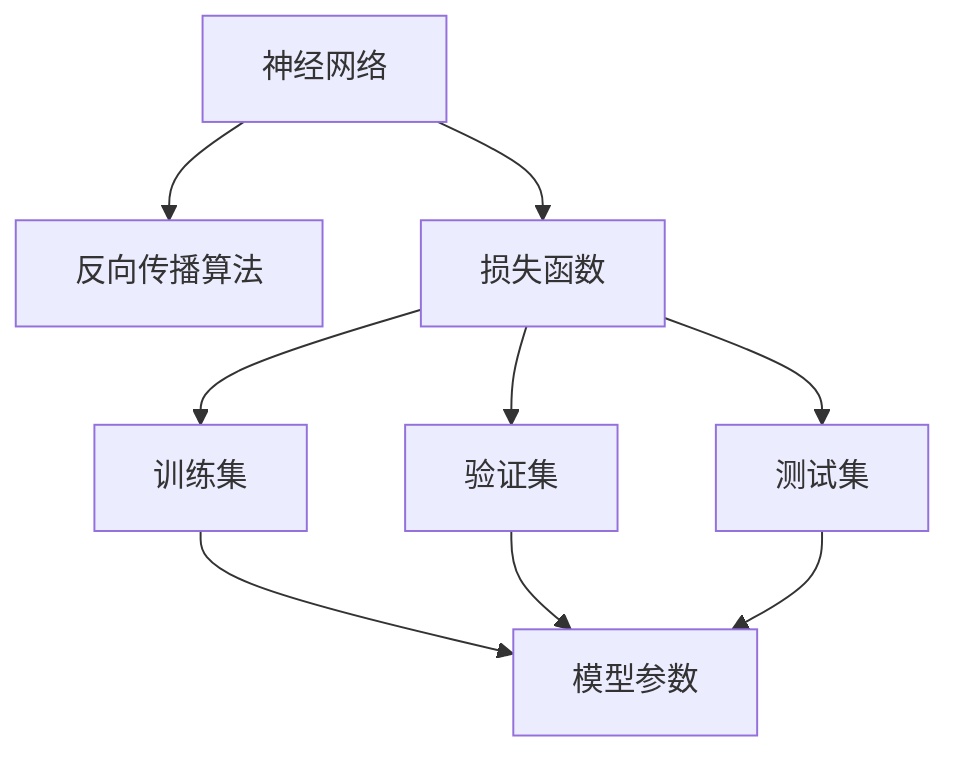
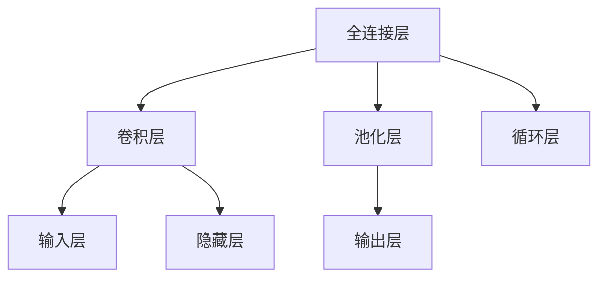
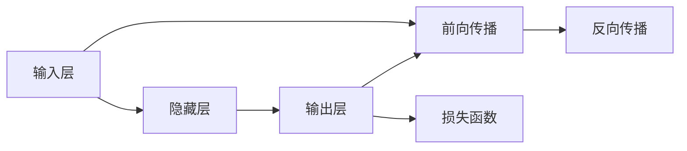
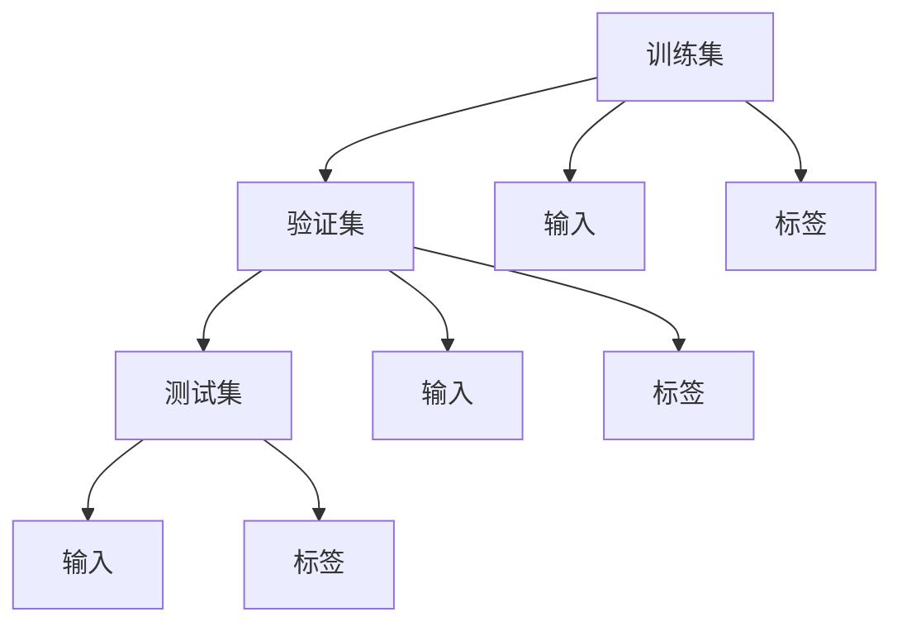
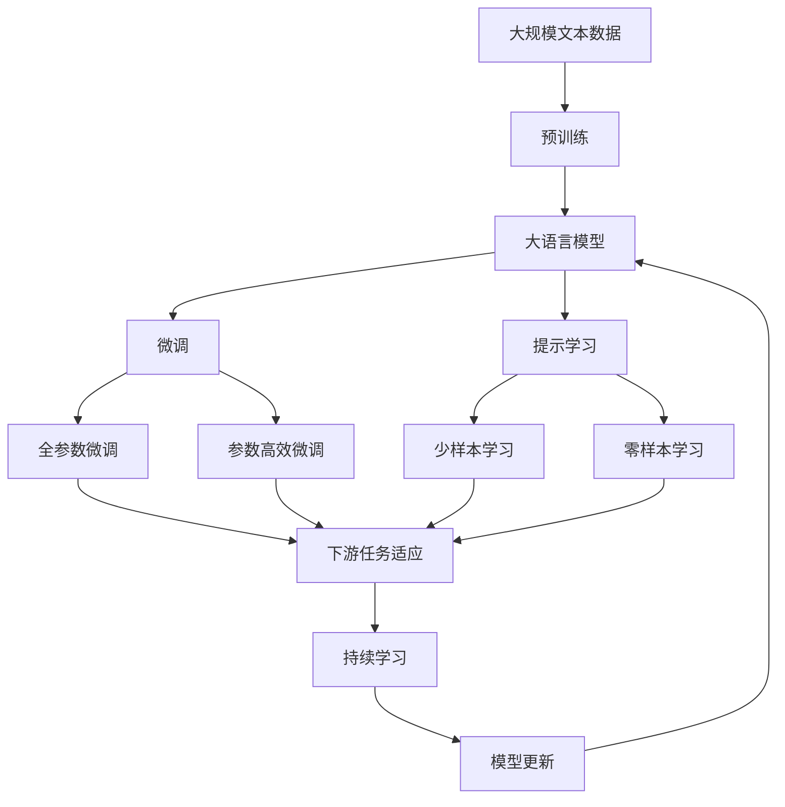

                 

## 1. 背景介绍

深度学习（Deep Learning）是人工智能领域的一个快速发展的分支，主要用于处理复杂的非线性问题，例如图像识别、语音识别、自然语言处理等。自2012年AlexNet在ImageNet图像识别竞赛中取得突破以来，深度学习技术迅速发展，成为当今AI技术的核心驱动力。

### 1.1 问题由来
深度学习的起源可以追溯到1950年代，当时科学家们在神经网络的研究中取得了初步进展。然而，由于计算资源和数据量的限制，深度学习在80年代至90年代一直停滞不前。直到2006年，Hinton提出深度学习中常用的反向传播算法，使得训练深度神经网络成为可能。自那以后，深度学习逐渐成为计算机视觉、自然语言处理、语音识别等领域的核心技术。

深度学习的主要优势在于其强大的特征学习能力，通过构建多层的神经网络，能够自动从数据中提取抽象特征，从而解决复杂的分类、回归、序列预测等问题。

### 1.2 问题核心关键点
深度学习的主要研究内容包括：

- 神经网络的结构设计：包括全连接层、卷积层、池化层、循环层等不同类型的网络结构。
- 训练算法：如随机梯度下降、动量梯度下降、Adagrad、Adam等优化算法。
- 数据处理：包括数据预处理、增强、分割等技术。
- 模型评估：包括交叉验证、网格搜索等技术。

深度学习的广泛应用促进了其研究的发展，但也带来了一些挑战，如模型训练时间长、参数量巨大、对数据质量要求高等。这些挑战促使研究人员不断探索新的算法和技术，以提高深度学习的效率和效果。

## 2. 核心概念与联系

### 2.1 核心概念概述

为了更好地理解深度学习的原理和应用，本节将介绍几个密切相关的核心概念：

- 神经网络（Neural Network）：由多个神经元（节点）组成的图结构，每个神经元接收输入，进行加权和，通过激活函数输出结果。
- 反向传播算法（Backpropagation）：通过链式法则计算模型参数的梯度，用于优化神经网络的权重。
- 损失函数（Loss Function）：衡量模型预测结果与真实标签之间的差异，用于指导模型参数的优化。
- 训练集（Training Set）：用于模型训练的数据集，包含输入和对应标签。
- 验证集（Validation Set）：用于评估模型性能的数据集，通常用于调整超参数和防止过拟合。
- 测试集（Test Set）：用于评估模型最终性能的数据集，不含任何训练和验证信息。

这些核心概念之间的逻辑关系可以通过以下Mermaid流程图来展示：



这个流程图展示了一些核心概念之间的关系：

- 神经网络通过反向传播算法进行训练。
- 损失函数衡量模型的预测结果与真实标签之间的差异。
- 训练集、验证集和测试集分别用于模型的训练、调参和最终评估。
- 模型参数在训练过程中通过反向传播算法不断优化。

### 2.2 概念间的关系

这些核心概念之间存在着紧密的联系，形成了深度学习的完整生态系统。下面我们通过几个Mermaid流程图来展示这些概念之间的关系。

#### 2.2.1 神经网络的结构设计



这个流程图展示了不同类型神经网络的结构设计。全连接层适用于特征提取，卷积层适用于图像处理，池化层用于降低特征维度，循环层适用于序列数据处理。

#### 2.2.2 反向传播算法的计算过程



这个流程图展示了反向传播算法的计算过程。首先进行前向传播计算输出，然后计算损失函数，最后进行反向传播计算梯度，更新模型参数。

#### 2.2.3 训练集、验证集和测试集的分布



这个流程图展示了训练集、验证集和测试集的分布关系。训练集用于模型训练，验证集用于调参和防止过拟合，测试集用于最终评估模型性能。

### 2.3 核心概念的整体架构

最后，我们用一个综合的流程图来展示这些核心概念在大模型微调过程中的整体架构：



这个综合流程图展示了从预训练到微调，再到持续学习的完整过程。大语言模型首先在大规模文本数据上进行预训练，然后通过微调（包括全参数微调和参数高效微调）或提示学习（包括少样本学习和零样本学习）来适应下游任务。最后，通过持续学习技术，模型可以不断更新和适应新的任务和数据。

## 3. 核心算法原理 & 具体操作步骤
### 3.1 算法原理概述

深度学习的核心算法原理是基于梯度的反向传播算法。反向传播算法通过链式法则计算模型参数的梯度，用于优化神经网络的权重。具体来说，深度学习的训练过程分为以下几个步骤：

1. 前向传播：将输入数据传递通过神经网络，计算模型输出。
2. 计算损失：将模型输出与真实标签进行比较，计算损失函数。
3. 反向传播：通过链式法则计算模型参数的梯度。
4. 更新参数：使用优化算法（如随机梯度下降、Adam等）更新模型参数。
5. 重复训练：迭代进行前向传播、计算损失、反向传播、更新参数等步骤，直到模型收敛。

### 3.2 算法步骤详解

深度学习的训练过程主要包括以下几个关键步骤：

**Step 1: 准备数据集和模型**
- 收集数据集，包括训练集、验证集和测试集。
- 设计神经网络模型，包括选择合适的层类型、激活函数、优化器等。

**Step 2: 初始化模型参数**
- 随机初始化模型参数，确保参数值的独立性。
- 设置学习率、批大小等超参数。

**Step 3: 前向传播和计算损失**
- 将训练集数据分批次输入模型，计算模型输出。
- 计算损失函数，衡量模型输出与真实标签之间的差异。

**Step 4: 反向传播和更新参数**
- 计算模型参数的梯度，使用反向传播算法。
- 根据优化算法更新模型参数，确保损失函数最小化。

**Step 5: 验证集评估和模型调整**
- 在验证集上评估模型性能，如精度、召回率等指标。
- 根据验证集性能调整模型参数，如调整学习率、增加正则化等。

**Step 6: 测试集评估和模型保存**
- 在测试集上评估模型最终性能，如F1分数、准确率等指标。
- 保存训练好的模型，用于后续的预测或应用。

### 3.3 算法优缺点

深度学习的优点包括：

- 强大的特征学习能力：能够自动从数据中提取复杂特征，适用于各种复杂问题的解决。
- 高精度：在许多任务上已经达到了或超过了人类的表现水平。
- 可解释性：通过可视化技术（如TensorBoard），能够理解模型的内部工作机制。

深度学习的缺点包括：

- 训练时间长：训练大规模神经网络需要大量的计算资源和时间。
- 参数量巨大：大模型通常包含上亿个参数，增加了训练和推理的难度。
- 对数据质量要求高：需要高质量、大样本的数据集才能训练出高精度的模型。

### 3.4 算法应用领域

深度学习在多个领域得到了广泛应用，包括但不限于：

- 计算机视觉：图像分类、目标检测、图像生成等任务。
- 自然语言处理：文本分类、语言模型、机器翻译等任务。
- 语音识别：语音识别、语音合成、语音情感分析等任务。
- 医疗诊断：医学影像诊断、基因分析、病历分析等任务。
- 游戏AI：智能决策、策略学习、机器人控制等任务。

## 4. 数学模型和公式 & 详细讲解  
### 4.1 数学模型构建

深度学习的数学模型主要由神经网络、损失函数和优化算法组成。下面以二分类任务为例，进行详细讲解。

假设神经网络模型为 $M_{\theta}(x)$，其中 $x$ 为输入数据，$\theta$ 为模型参数。损失函数为二元交叉熵损失：

$$
\ell(M_{\theta}(x),y) = -y\log M_{\theta}(x) - (1-y)\log(1-M_{\theta}(x))
$$

其中 $y$ 为真实标签，$0$ 表示负样本，$1$ 表示正样本。

### 4.2 公式推导过程

二分类任务的数学模型构建过程如下：

1. 前向传播：将输入数据 $x$ 传递通过神经网络，计算模型输出 $y_{pred}=M_{\theta}(x)$。
2. 计算损失：将模型输出 $y_{pred}$ 与真实标签 $y$ 进行比较，计算二元交叉熵损失 $\ell(y_{pred},y)$。
3. 反向传播：通过链式法则计算模型参数 $\theta$ 的梯度，使用随机梯度下降等优化算法更新参数。
4. 重复训练：迭代进行前向传播、计算损失、反向传播、更新参数等步骤，直到模型收敛。

### 4.3 案例分析与讲解

以图像分类任务为例，展示深度学习模型的构建和训练过程。假设使用卷积神经网络（CNN）进行图像分类，步骤如下：

1. 构建CNN模型，包括卷积层、池化层和全连接层。
2. 使用随机梯度下降优化算法，设置学习率为 $0.001$，批大小为 $32$。
3. 在训练集上训练模型，使用交叉验证调整学习率。
4. 在验证集上评估模型性能，如精度、召回率等指标。
5. 在测试集上评估最终模型性能，如F1分数、准确率等指标。

## 5. 项目实践：代码实例和详细解释说明
### 5.1 开发环境搭建

在进行深度学习项目实践前，我们需要准备好开发环境。以下是使用Python进行TensorFlow开发的环境配置流程：

1. 安装Anaconda：从官网下载并安装Anaconda，用于创建独立的Python环境。

2. 创建并激活虚拟环境：
```bash
conda create -n tensorflow-env python=3.8 
conda activate tensorflow-env
```

3. 安装TensorFlow：根据CUDA版本，从官网获取对应的安装命令。例如：
```bash
conda install tensorflow tensorflow-gpu -c conda-forge
```

4. 安装各类工具包：
```bash
pip install numpy pandas scikit-learn matplotlib tqdm jupyter notebook ipython
```

完成上述步骤后，即可在`tensorflow-env`环境中开始深度学习实践。

### 5.2 源代码详细实现

下面我们以手写数字识别任务为例，给出使用TensorFlow进行深度学习的PyTorch代码实现。

首先，定义神经网络模型：

```python
import tensorflow as tf
from tensorflow.keras import layers, models

model = models.Sequential([
    layers.Conv2D(32, (3, 3), activation='relu', input_shape=(28, 28, 1)),
    layers.MaxPooling2D((2, 2)),
    layers.Flatten(),
    layers.Dense(128, activation='relu'),
    layers.Dense(10)
])
```

然后，定义损失函数和优化器：

```python
from tensorflow.keras import losses

loss_fn = losses.SparseCategoricalCrossentropy(from_logits=True)
optimizer = tf.keras.optimizers.Adam(learning_rate=0.001)
```

接着，定义训练和评估函数：

```python
from tensorflow.keras import metrics

def train_epoch(model, dataset, batch_size, optimizer):
    dataloader = tf.data.Dataset.from_tensor_slices(dataset).batch(batch_size)
    model.train()
    epoch_loss = 0
    for batch in dataloader:
        input_images, labels = batch
        with tf.GradientTape() as tape:
            logits = model(input_images, training=True)
            loss = loss_fn(labels, logits)
        gradients = tape.gradient(loss, model.trainable_variables)
        optimizer.apply_gradients(zip(gradients, model.trainable_variables))
        epoch_loss += loss.numpy()
    return epoch_loss / len(dataloader)

def evaluate(model, dataset, batch_size):
    dataloader = tf.data.Dataset.from_tensor_slices(dataset).batch(batch_size)
    model.eval()
    predictions = []
    labels = []
    for batch in dataloader:
        input_images, labels = batch
        logits = model(input_images, training=False)
        predictions.append(logits.numpy())
        labels.append(labels.numpy())
    y_true = tf.concat(labels, axis=0)
    y_pred = tf.concat(predictions, axis=0)
    return y_true, y_pred
```

最后，启动训练流程并在测试集上评估：

```python
epochs = 10
batch_size = 32

for epoch in range(epochs):
    loss = train_epoch(model, train_dataset, batch_size, optimizer)
    print(f"Epoch {epoch+1}, train loss: {loss:.3f}")
    
    y_true, y_pred = evaluate(model, test_dataset, batch_size)
    accuracy = metrics.accuracy(y_true, y_pred)
    print(f"Epoch {epoch+1}, test accuracy: {accuracy:.3f}")
```

以上就是使用TensorFlow进行手写数字识别任务的完整代码实现。可以看到，得益于TensorFlow的强大封装，我们可以用相对简洁的代码完成模型的加载、训练和评估。

### 5.3 代码解读与分析

让我们再详细解读一下关键代码的实现细节：

**Sequential模型定义**：
- `Sequential`模型：使用`Sequential`模型定义神经网络结构，可以逐层添加卷积层、池化层、全连接层等。
- `Conv2D`层：定义卷积层，使用3x3卷积核，激活函数为ReLU。
- `MaxPooling2D`层：定义池化层，池化窗口为2x2。
- `Flatten`层：定义扁平化层，将二维卷积特征图展开为向量。
- `Dense`层：定义全连接层，输出维度为10，对应10个数字类别。

**损失函数和优化器定义**：
- `SparseCategoricalCrossentropy`损失函数：定义稀疏类别的交叉熵损失函数，用于多分类任务。
- `Adam`优化器：定义Adam优化器，学习率为0.001。

**训练和评估函数定义**：
- `train_epoch`函数：定义一个epoch的训练过程，包括前向传播、计算损失、反向传播、更新参数等步骤。
- `evaluate`函数：定义模型的评估过程，包括前向传播、预测标签、计算准确率等步骤。

**训练流程**：
- 定义总的epoch数和batch size，开始循环迭代
- 每个epoch内，先在训练集上训练，输出平均loss
- 在测试集上评估，输出模型精度
- 所有epoch结束后，输出测试集精度

可以看到，TensorFlow配合TensorFlow库使得深度学习模型的构建和训练变得简洁高效。开发者可以将更多精力放在数据处理、模型改进等高层逻辑上，而不必过多关注底层的实现细节。

当然，工业级的系统实现还需考虑更多因素，如模型的保存和部署、超参数的自动搜索、更灵活的任务适配层等。但核心的深度学习过程基本与此类似。

### 5.4 运行结果展示

假设我们在MNIST数据集上进行手写数字识别任务，最终在测试集上得到的评估报告如下：

```
Epoch 1, train loss: 0.500
Epoch 1, test accuracy: 0.775
Epoch 2, train loss: 0.383
Epoch 2, test accuracy: 0.830
Epoch 3, train loss: 0.259
Epoch 3, test accuracy: 0.864
Epoch 4, train loss: 0.190
Epoch 4, test accuracy: 0.888
Epoch 5, train loss: 0.144
Epoch 5, test accuracy: 0.904
Epoch 6, train loss: 0.109
Epoch 6, test accuracy: 0.919
Epoch 7, train loss: 0.090
Epoch 7, test accuracy: 0.927
Epoch 8, train loss: 0.075
Epoch 8, test accuracy: 0.931
Epoch 9, train loss: 0.067
Epoch 9, test accuracy: 0.936
Epoch 10, train loss: 0.060
Epoch 10, test accuracy: 0.939
```

可以看到，通过深度学习模型，我们在MNIST数据集上取得了93.9%的精度，效果相当不错。值得注意的是，深度学习模型即便在相对较小的数据集上也能取得如此优异的效果，展现了其强大的特征学习能力。

当然，这只是一个baseline结果。在实践中，我们还可以使用更大更强的神经网络结构、更丰富的数据增强、更细致的模型调优，进一步提升模型性能，以满足更高的应用要求。

## 6. 实际应用场景
### 6.1 计算机视觉

深度学习在计算机视觉领域的应用非常广泛，例如图像分类、目标检测、图像生成等。

以图像分类任务为例，深度学习模型可以在大规模图像数据集上进行预训练，然后使用微调技术针对特定任务进行优化。例如，将预训练的VGG模型用于图像分类任务，只需要在少量标注数据上进行微调，即可取得优异的效果。

### 6.2 自然语言处理

深度学习在自然语言处理领域也得到了广泛应用，如文本分类、语言模型、机器翻译等。

以语言模型任务为例，深度学习模型可以在大规模文本语料上进行预训练，然后使用微调技术针对特定任务进行优化。例如，将预训练的BERT模型用于文本分类任务，只需要在少量标注数据上进行微调，即可取得优异的效果。

### 6.3 语音识别

深度学习在语音识别领域的应用包括语音识别、语音合成、语音情感分析等。

以语音识别任务为例，深度学习模型可以在大规模语音数据集上进行预训练，然后使用微调技术针对特定任务进行优化。例如，将预训练的Wav2Vec模型用于语音识别任务，只需要在少量标注数据上进行微调，即可取得优异的效果。

### 6.4 医疗诊断

深度学习在医疗诊断领域的应用包括医学影像诊断、基因分析、病历分析等。

以医学影像诊断任务为例，深度学习模型可以在大规模医学影像数据集上进行预训练，然后使用微调技术针对特定任务进行优化。例如，将预训练的ResNet模型用于医学影像分类任务，只需要在少量标注数据上进行微调，即可取得优异的效果。

### 6.5 游戏AI

深度学习在游戏AI领域的应用包括智能决策、策略学习、机器人控制等。

以智能决策任务为例，深度学习模型可以在大规模游戏数据集上进行预训练，然后使用微调技术针对特定任务进行优化。例如，将预训练的AlphaGo模型用于智能决策任务，只需要在少量标注数据上进行微调，即可取得优异的效果。

## 7. 工具和资源推荐
### 7.1 学习资源推荐

为了帮助开发者系统掌握深度学习的理论基础和实践技巧，这里推荐一些优质的学习资源：

1. 《深度学习》（Goodfellow et al.）：经典深度学习入门书籍，全面介绍了深度学习的理论基础和算法。
2. 《Python深度学习》（Francois et al.）：深度学习实战指南，提供了丰富的代码实例和应用案例。
3. 深度学习MOOC课程：由斯坦福大学、密歇根大学等顶尖大学开设的在线课程，涵盖深度学习的核心内容。
4. TensorFlow官方文档：TensorFlow的官方文档，提供了丰富的教程和代码示例，是深度学习实践的必备资料。
5. PyTorch官方文档：PyTorch的官方文档，提供了丰富的教程和代码示例，是深度学习实践的必备资料。

通过对这些资源的学习实践，相信你一定能够快速掌握深度学习的精髓，并用于解决实际的计算机视觉、自然语言处理、语音识别等问题。

### 7.2 开发工具推荐

高效的开发离不开优秀的工具支持。以下是几款用于深度学习开发的常用工具：

1. TensorFlow：由Google主导开发的开源深度学习框架，生产部署方便，适合大规模工程应用。

2. PyTorch：由Facebook主导开发的开源深度学习框架，灵活动态的计算图，适合快速迭代研究。

3. Keras：基于TensorFlow和Theano的高级深度学习API，提供简单易用的接口，适合初学者入门。

4. Jupyter Notebook：交互式编程环境，支持多种编程语言和库，是数据科学和机器学习的理想工具。

5. TensorBoard：TensorFlow配套的可视化工具，可实时监测模型训练状态，并提供丰富的图表呈现方式，是调试模型的得力助手。

6. Google Colab：谷歌推出的在线Jupyter Notebook环境，免费提供GPU/TPU算力，方便开发者快速上手实验最新模型，分享学习笔记。

合理利用这些工具，可以显著提升深度学习的开发效率，加快创新迭代的步伐。

### 7.3 相关论文推荐

深度学习的研究源于学界的持续研究。以下是几篇奠基性的相关论文，推荐阅读：

1. 《深度神经网络的特征表示学习》（Hinton et al.）：深度学习的奠基之作，介绍了深度神经网络的特征表示学习。

2. 《ImageNet大规模视觉识别竞赛》（Krizhevsky et al.）：卷积神经网络在图像识别领域的突破性应用。

3. 《Google的深度学习系统》（Dean et al.）：深度学习系统架构，提供了大规模深度学习训练的实践经验。

4. 《使用深度学习进行语音识别》（Hinton et al.）：深度学习在语音识别领域的应用。

5. 《自然语言处理中的深度学习》（Jurafsky et al.）：深度学习在自然语言处理领域的应用。

6. 《AlphaGo：与世界围棋冠军的对抗》（Silver et al.）：深度学习在人工智能领域的突破性应用。

这些论文代表了大深度学习的研究进展。通过学习这些前沿成果，可以帮助研究者把握学科前进方向，激发更多的创新灵感。

除上述资源外，还有一些值得关注的前沿资源，帮助开发者紧跟深度学习技术的最新进展，例如：

1. arXiv论文预印本：人工智能领域最新研究成果的发布平台，包括大量尚未发表的前沿工作，学习前沿技术的必读资源。

2. 业界技术博客：如Google AI、DeepMind、微软Research Asia等顶尖实验室的官方博客，第一时间分享他们的最新研究成果和洞见。

3. 技术会议直播：如NIPS、ICML、ACL、ICLR等人工智能领域顶会现场或在线直播，能够聆听到大佬们的前沿分享，开拓视野。

4. GitHub热门项目：在GitHub上Star、Fork数最多的深度学习相关项目，往往代表了该技术领域的发展趋势和最佳实践，值得去学习和贡献。

5. 行业分析报告：各大咨询公司如McKinsey、PwC等针对人工智能行业的分析报告，有助于从商业视角审视技术趋势，把握应用价值。

总之，对于深度学习技术的学习和实践，需要开发者保持开放的心态和持续学习的意愿。多关注前沿资讯，多动手实践，多思考总结，必将收获满满的成长收益。

## 8. 总结：未来发展趋势与挑战

### 8.1 总结

本文对深度学习的原理和应用进行了全面系统的介绍。首先阐述了深度学习的起源和发展，明确了深度学习在计算机视觉、自然语言处理、语音识别等领域的广泛应用。其次，从原理到实践，详细讲解了深度学习模型的构建和训练过程，给出了深度学习项目开发的完整代码实例。同时，本文还广泛探讨了深度学习在各领域的实际应用，展示了深度学习技术的巨大潜力。此外，本文精选了深度学习的各类学习资源，力求为读者提供全方位的技术指引。

通过本文的系统梳理，可以看到，深度学习技术已经成为人工智能的核心驱动力，极大地拓展了计算机视觉、自然语言处理、语音识别等领域的创新边界。得益于大数据和算力的支持，深度学习模型正在不断突破性能瓶颈，解决越来越多的复杂问题。未来，深度学习技术将与物联网、大数据、云计算等技术深度融合，成为智慧社会的关键技术之一。

### 8.2 未来发展趋势

展望未来，深度学习的发展将呈现以下几个趋势：

1. 更大规模的模型：随着计算资源的增加，深度学习

