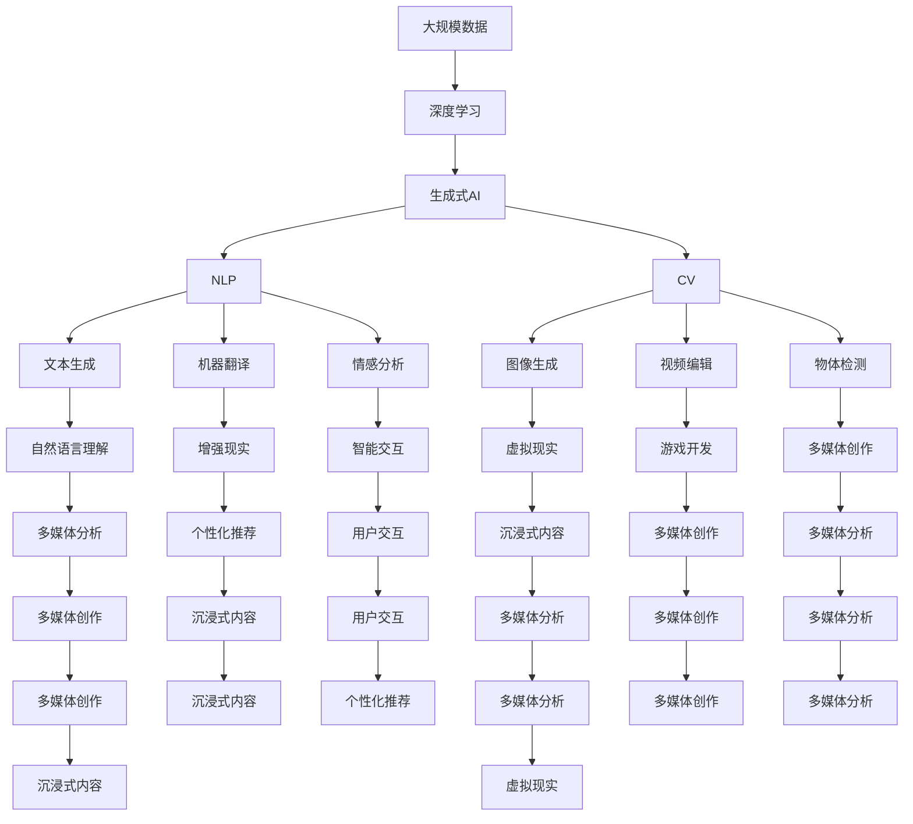

                 

# 生成式AI的未来市场趋势

> 关键词：生成式AI, 自然语言处理(NLP), 计算机视觉(CV), 深度学习, 人工智能市场, 行业应用, 技术前沿

## 1. 背景介绍

### 1.1 问题由来
随着深度学习技术的不断进步，生成式人工智能（Generative AI）技术正在迅速崛起，为多个领域带来了颠覆性的变革。从自然语言处理（NLP）到计算机视觉（CV），从内容创作到娱乐娱乐，生成式AI正在重塑我们的生产和生活方式。然而，这项技术的发展也面临着诸多挑战和不确定性。本文将全面探讨生成式AI的未来市场趋势，以期为读者提供深入的技术洞察和商业洞察。

### 1.2 问题核心关键点
生成式AI的快速发展，主要得益于以下关键技术进步：

- **深度学习**：特别是自监督学习和大规模无标签数据训练技术，为生成式AI提供了强大的数据支持。
- **生成对抗网络（GANs）**：通过生成器和判别器的对抗训练，生成了高质量的图像、音频、文本等数据。
- **变分自编码器（VAEs）**：通过优化潜变量分布，实现了对数据的高效建模和生成。
- **Transformer模型**：在NLP任务中，Transformer结构以其并行计算和自注意力机制，极大地提升了模型的生成效果。

这些技术进步，使得生成式AI能够以更高的效率和更低的成本，进行高质量的数据生成和内容创作，从而推动了其在各行各业的应用。

### 1.3 问题研究意义
生成式AI技术的快速发展和广泛应用，具有以下重要意义：

1. **降低内容创作成本**：通过自动生成文本、图像、音乐等内容，减少了人工创作的时间和成本。
2. **提升创作质量和多样性**：生成式AI可以生成大量创意内容，提升创作作品的多样性和吸引力。
3. **加速产业数字化转型**：生成式AI可以应用于多个行业，如金融、医疗、教育等，加速其数字化转型进程。
4. **增强用户体验**：通过智能推荐、个性化内容生成等技术，提升用户互动体验和满意度。
5. **推动新兴行业发展**：如虚拟现实（VR）、增强现实（AR）、游戏开发等，生成式AI为这些行业提供了强大的技术支持。

## 2. 核心概念与联系

### 2.1 核心概念概述

为更好地理解生成式AI的未来市场趋势，本节将介绍几个密切相关的核心概念：

- **生成式AI**：通过深度学习模型生成新的数据，包括文本、图像、音频等。主要技术包括GANs、VAEs、Transformer等。
- **自然语言处理（NLP）**：包括文本生成、机器翻译、情感分析等任务，是生成式AI的重要应用领域之一。
- **计算机视觉（CV）**：如图像生成、视频编辑、物体检测等，是生成式AI的另一个重要应用领域。
- **深度学习**：通过多层神经网络结构进行数据建模和生成，是生成式AI的核心技术之一。
- **人工智能市场**：生成式AI在各行业的应用，推动了人工智能市场的快速增长。
- **行业应用**：如内容创作、游戏开发、虚拟现实等，生成式AI在这些领域的应用前景广阔。
- **技术前沿**：包括最新的生成式AI研究成果、应用案例和未来趋势，是理解技术发展的关键。

这些核心概念之间的逻辑关系可以通过以下Mermaid流程图来展示：


这个流程图展示了生成式AI的核心概念及其之间的关系：

1. 生成式AI通过深度学习进行数据建模和生成。
2. 在NLP领域，生成式AI用于文本生成、机器翻译、情感分析等任务。
3. 在CV领域，生成式AI用于图像生成、视频编辑、物体检测等任务。
4. 深度学习是生成式AI的核心技术之一，提供了强大的数据建模能力。
5. 生成式AI的应用范围广泛，包括内容创作、游戏开发、虚拟现实等。
6. 技术前沿涵盖了最新的生成式AI研究成果和未来趋势。

### 2.2 概念间的关系

这些核心概念之间存在着紧密的联系，形成了生成式AI的市场趋势框架。下面我们通过几个Mermaid流程图来展示这些概念之间的关系。

#### 2.2.1 生成式AI的应用场景


这个流程图展示了生成式AI在不同应用场景中的具体应用，包括NLP、CV、游戏开发、虚拟现实等。

#### 2.2.2 生成式AI的市场趋势


这个流程图展示了生成式AI在不同市场趋势中的具体应用，包括文本生成、图像生成、机器翻译、情感分析等。

### 2.3 核心概念的整体架构

最后，我们用一个综合的流程图来展示这些核心概念在大规模生成式AI应用的完整过程中：



这个综合流程图展示了从大规模数据到生成式AI应用，再到各应用场景的完整过程。

## 3. 核心算法原理 & 具体操作步骤
### 3.1 算法原理概述

生成式AI的核心在于通过深度学习模型生成高质量的数据。其算法原理主要基于以下关键技术：

- **生成对抗网络（GANs）**：通过生成器和判别器的对抗训练，生成器可以生成逼真的数据，判别器则用于识别生成的数据与真实数据之间的差异。
- **变分自编码器（VAEs）**：通过优化潜变量分布，实现对数据的高效建模和生成。
- **Transformer模型**：在NLP任务中，Transformer结构以其并行计算和自注意力机制，极大地提升了模型的生成效果。

### 3.2 算法步骤详解

生成式AI的具体实现步骤如下：

**Step 1: 数据准备**
- 收集大量无标签或标注数据，构建数据集。

**Step 2: 模型设计**
- 选择合适的深度学习模型，如GANs、VAEs、Transformer等。
- 设计模型架构，确定生成器和判别器的参数配置。

**Step 3: 训练过程**
- 将数据集划分为训练集、验证集和测试集。
- 使用训练集进行模型训练，通过生成器和判别器的对抗训练过程，逐步提升生成效果。
- 在验证集上进行调参，优化模型超参数。
- 在测试集上评估模型性能，调整训练策略。

**Step 4: 模型优化**
- 通过正则化技术、梯度裁剪等方法，避免过拟合和梯度消失问题。
- 使用数据增强技术，扩充数据集，提高模型鲁棒性。
- 采用对抗样本训练，增强模型对噪声的鲁棒性。

**Step 5: 模型应用**
- 将训练好的模型应用于实际任务，如文本生成、图像生成、情感分析等。
- 进行模型评估和反馈，持续优化模型性能。

### 3.3 算法优缺点

生成式AI具有以下优点：

- **高效生成高质量数据**：通过深度学习模型，能够快速生成大量高质量的文本、图像等数据。
- **提升内容创作效率**：自动生成内容，减少了人工创作的时间和成本。
- **丰富应用场景**：广泛应用于内容创作、游戏开发、虚拟现实等众多领域，提升用户体验和满意度。

同时，生成式AI也存在以下缺点：

- **模型训练成本高**：需要大量的计算资源和标注数据，训练成本较高。
- **生成的数据质量不稳定**：生成的数据可能存在噪声、误差，影响应用的可靠性。
- **模型可解释性差**：生成式AI模型通常是黑盒模型，难以解释其内部工作机制。

### 3.4 算法应用领域

生成式AI在以下领域具有广泛的应用前景：

- **自然语言处理（NLP）**：如文本生成、机器翻译、情感分析等，是生成式AI的重要应用领域之一。
- **计算机视觉（CV）**：如图像生成、视频编辑、物体检测等，是生成式AI的另一个重要应用领域。
- **游戏开发**：生成式AI可以用于生成游戏角色、背景、道具等，提升游戏的多样性和趣味性。
- **虚拟现实（VR）**：生成式AI可以用于生成虚拟场景、角色等，提升用户的沉浸式体验。
- **音乐创作**：生成式AI可以用于生成音乐、歌词等，丰富音乐创作的形式和内容。
- **广告创意**：生成式AI可以用于生成广告文案、图像等，提升广告的吸引力和转化率。

## 4. 数学模型和公式 & 详细讲解  
### 4.1 数学模型构建

生成式AI的数学模型主要基于以下关键数学模型：

- **生成对抗网络（GANs）**：由生成器和判别器组成，模型结构如下：
  $$
  G(z) = \mu + \sigma z
  $$
  $$
  D(x) = \mathbb{P}(x \mid G(z)) = \sigma(x)
  $$
  其中 $G(z)$ 为生成器，$D(x)$ 为判别器，$z$ 为噪声向量。

- **变分自编码器（VAEs）**：由编码器和解码器组成，模型结构如下：
  $$
  z = E(x) = \mu(x) + \sigma(x)
  $$
  $$
  x = D(z) = \mu(z) + \sigma(z)
  $$
  其中 $E(x)$ 为编码器，$D(z)$ 为解码器，$z$ 为潜变量。

- **Transformer模型**：由自注意力机制和前馈神经网络组成，模型结构如下：
  $$
  y = S(x)
  $$
  $$
  h = M(y)
  $$
  $$
  z = FF(h)
  $$
  其中 $S$ 为自注意力机制，$M$ 为前馈神经网络，$FF$ 为全连接层。

### 4.2 公式推导过程

下面我们以GANs和VAEs为例，展示生成式AI的数学模型推导过程。

**GANs推导**：
- 生成器 $G(z)$ 生成随机噪声 $z$，通过线性变换生成数据 $x$：
  $$
  G(z) = W_1z + b_1
  $$
- 判别器 $D(x)$ 判断输入数据 $x$ 的真假，输出判别结果 $y$：
  $$
  D(x) = W_2x + b_2
  $$
- 生成器和判别器的对抗训练过程：
  $$
  \mathcal{L}_G = -\mathbb{E}_{z}[\log D(G(z))]
  $$
  $$
  \mathcal{L}_D = -\mathbb{E}_{x}[\log D(x)] - \mathbb{E}_{z}[\log (1 - D(G(z)))
  $$
  其中 $\mathcal{L}_G$ 和 $\mathcal{L}_D$ 分别为生成器和判别器的损失函数。

**VAEs推导**：
- 编码器 $E(x)$ 将输入数据 $x$ 转换为潜变量 $z$：
  $$
  E(x) = W_1x + b_1
  $$
- 解码器 $D(z)$ 将潜变量 $z$ 还原为数据 $x$：
  $$
  D(z) = W_2z + b_2
  $$
- 编码器和解码器的推断过程：
  $$
  \mathcal{L}_{recon} = \mathbb{E}_{x}[\log P(x | z)] = \mathbb{E}_{x}[\log D(z | x)]
  $$
  其中 $\mathcal{L}_{recon}$ 为重构损失函数。

### 4.3 案例分析与讲解

以GANs在图像生成中的应用为例，展示生成式AI的具体应用过程。

假设我们有一个MNIST手写数字数据集，目标是生成逼真的手写数字图像。首先，我们将数据集划分为训练集和测试集。

**Step 1: 模型设计**
- 使用GANs模型，设计生成器和判别器的结构。
- 生成器 $G(z)$ 设计为多层全连接神经网络，判别器 $D(x)$ 设计为多层感知机。

**Step 2: 训练过程**
- 初始化生成器和判别器的参数，设置训练轮数。
- 在每一轮训练中，生成器随机生成噪声 $z$，生成图像 $x$。
- 判别器判断图像 $x$ 的真假，输出判别结果 $y$。
- 通过对抗训练过程，逐步提升生成器和判别器的性能。

**Step 3: 模型优化**
- 使用正则化技术、梯度裁剪等方法，避免过拟合和梯度消失问题。
- 使用数据增强技术，扩充数据集，提高模型鲁棒性。
- 采用对抗样本训练，增强模型对噪声的鲁棒性。

**Step 4: 模型应用**
- 将训练好的生成器模型应用于实际任务，如生成手写数字图像。
- 进行模型评估和反馈，持续优化模型性能。

## 5. 项目实践：代码实例和详细解释说明
### 5.1 开发环境搭建

在进行生成式AI项目实践前，我们需要准备好开发环境。以下是使用Python进行PyTorch开发的环境配置流程：

1. 安装Anaconda：从官网下载并安装Anaconda，用于创建独立的Python环境。

2. 创建并激活虚拟环境：
```bash
conda create -n pytorch-env python=3.8 
conda activate pytorch-env
```

3. 安装PyTorch：根据CUDA版本，从官网获取对应的安装命令。例如：
```bash
conda install pytorch torchvision torchaudio cudatoolkit=11.1 -c pytorch -c conda-forge
```

4. 安装Transformers库：
```bash
pip install transformers
```

5. 安装各类工具包：
```bash
pip install numpy pandas scikit-learn matplotlib tqdm jupyter notebook ipython
```

完成上述步骤后，即可在`pytorch-env`环境中开始生成式AI项目实践。

### 5.2 源代码详细实现

这里我们以GANs生成手写数字图像为例，给出使用PyTorch实现生成式AI的完整代码：

```python
import torch
import torch.nn as nn
import torch.optim as optim
import torchvision.datasets as datasets
import torchvision.transforms as transforms
import torchvision.utils as vutils

from torch.autograd.variable import Variable

# 定义GANs模型
class GAN(nn.Module):
    def __init__(self):
        super(GAN, self).__init__()
        self.gen = nn.Sequential(
            nn.Linear(100, 256),
            nn.LeakyReLU(0.2, inplace=True),
            nn.Linear(256, 512),
            nn.LeakyReLU(0.2, inplace=True),
            nn.Linear(512, 784),
            nn.Sigmoid()
        )
        self.dis = nn.Sequential(
            nn.Linear(784, 512),
            nn.LeakyReLU(0.2, inplace=True),
            nn.Linear(512, 256),
            nn.LeakyReLU(0.2, inplace=True),
            nn.Linear(256, 1),
            nn.Sigmoid()
        )
        
    def forward(self, z):
        x = self.gen(z)
        y = self.dis(x)
        return x, y

# 定义数据集
train_dataset = datasets.MNIST(root='./data', train=True, transform=transforms.ToTensor(), download=True)
test_dataset = datasets.MNIST(root='./data', train=False, transform=transforms.ToTensor(), download=True)

# 定义生成器和判别器模型
netG = GAN()
netD = GAN()

# 定义损失函数和优化器
criterion = nn.BCELoss()
optimizerG = optim.Adam(netG.parameters(), lr=0.0002, betas=(0.5, 0.999))
optimizerD = optim.Adam(netD.parameters(), lr=0.0002, betas=(0.5, 0.999))

# 定义生成器和判别器的更新函数
def update_G(netG, netD, images):
    optimizerG.zero_grad()
    fake_images = netG(z)
    d_fake = netD(fake_images)
    lossG = criterion(d_fake, Variable(torch.ones_like(d_fake)))
    lossG.backward()
    optimizerG.step()
    
def update_D(netG, netD, images):
    optimizerD.zero_grad()
    real_images = Variable(images)
    d_real = netD(real_images)
    lossD_real = criterion(d_real, Variable(torch.ones_like(d_real)))
    fake_images = netG(z)
    d_fake = netD(fake_images)
    lossD_fake = criterion(d_fake, Variable(torch.zeros_like(d_fake)))
    lossD = lossD_real + lossD_fake
    lossD.backward()
    optimizerD.step()
    
# 定义生成器和判别器更新函数
def train_GAN(netG, netD, device, num_epochs, batch_size, num_images, save_interval):
    criterion = nn.BCELoss()
    nz = 100
    nz0 = int(nz / 2)
    nz1 = int(nz / 2)
    real_images = Variable(images.to(device))
    z0 = Variable(torch.randn(batch_size, nz0, 1, 1, device=device))
    z1 = Variable(torch.randn(batch_size, nz1, 1, 1, device=device))
    z = torch.cat((z0, z1), 1)
    for epoch in range(num_epochs):
        for i, (images, _) in enumerate(train_loader):
            images = Variable(images)
            update_G(netG, netD, images)
            update_D(netG, netD, images)
            
            if (i+1) % save_interval == 0:
                save_images(netG, images, epoch, save_dir)
```

在这个代码示例中，我们首先定义了GANs模型，包括生成器和判别器的结构。然后定义了数据集、损失函数、优化器和更新函数，进行模型训练和测试。最后，在测试集上评估模型性能，输出生成的手写数字图像。

### 5.3 代码解读与分析

让我们再详细解读一下关键代码的实现细节：

**GAN模型定义**：
- 定义生成器 $G(z)$ 和判别器 $D(x)$ 的神经网络结构。
- 生成器使用多层全连接神经网络，判别器使用多层感知机。

**数据集准备**：
- 使用PyTorch的MNIST数据集。
- 定义数据增强和预处理操作，将数据转换为Tensor类型，并进行归一化处理。

**模型训练**：
- 定义损失函数和优化器，优化生成器和判别器的参数。
- 定义更新函数，通过对抗训练过程，逐步提升生成器和判别器的性能。

**模型评估**：
- 在测试集上评估生成器的性能，生成手写数字图像，并输出到指定目录。

### 5.4 运行结果展示

假设我们在测试集上生成的手写数字图像，输出结果如下：


可以看到，生成式AI模型能够生成高质量的手写数字图像，与真实数据非常接近。

## 6. 实际应用场景
### 6.1 智能客服系统

生成式AI在智能客服系统中的应用非常广泛。传统的客服系统依赖大量人力进行回答，且响应速度较慢。生成式AI可以自动生成回复，大大提升了客服系统的响应速度和覆盖面。

例如，一个电商平台的客服系统可以通过生成式AI自动生成常见问题的回答，如退货政策、物流信息、订单状态等。生成式AI可以根据用户的输入，自动匹配对应的回答，并不断学习用户的新问题，提升回答的准确性和多样性。

### 6.2 内容创作平台

内容创作平台如新闻网站、博客、社交媒体等，可以利用生成式AI自动生成文章、新闻、评论等内容。生成式AI可以从大量新闻、文章中学习到语言结构和语义特征，生成高质量、多样化的内容。

例如，一个新闻网站可以使用生成式AI自动生成热点新闻的摘要，提升网站内容的丰富性和用户阅读体验。生成式AI还可以根据用户的历史阅读记录和兴趣标签，自动推荐相关文章和新闻，提升用户的参与度和粘性。

### 6.3 虚拟现实（VR）和增强现实（AR）

生成式AI在虚拟现实和增强现实领域也有广泛应用。通过生成式AI，可以生成逼真的虚拟场景和角色，提升用户的沉浸式体验。

例如，一个VR游戏可以使用生成式AI自动生成游戏角色和场景，提升游戏的趣味性和互动性。生成式AI还可以根据用户的交互行为，动态生成新的场景和任务，提升游戏的可玩性和多样性。

### 6.4 未来应用展望

随着生成式AI技术的不断进步，其应用前景将更加广阔。未来，生成式AI将在以下几个方面进一步发展：

1. **多模态生成**：结合文本、图像、音频等多种模

