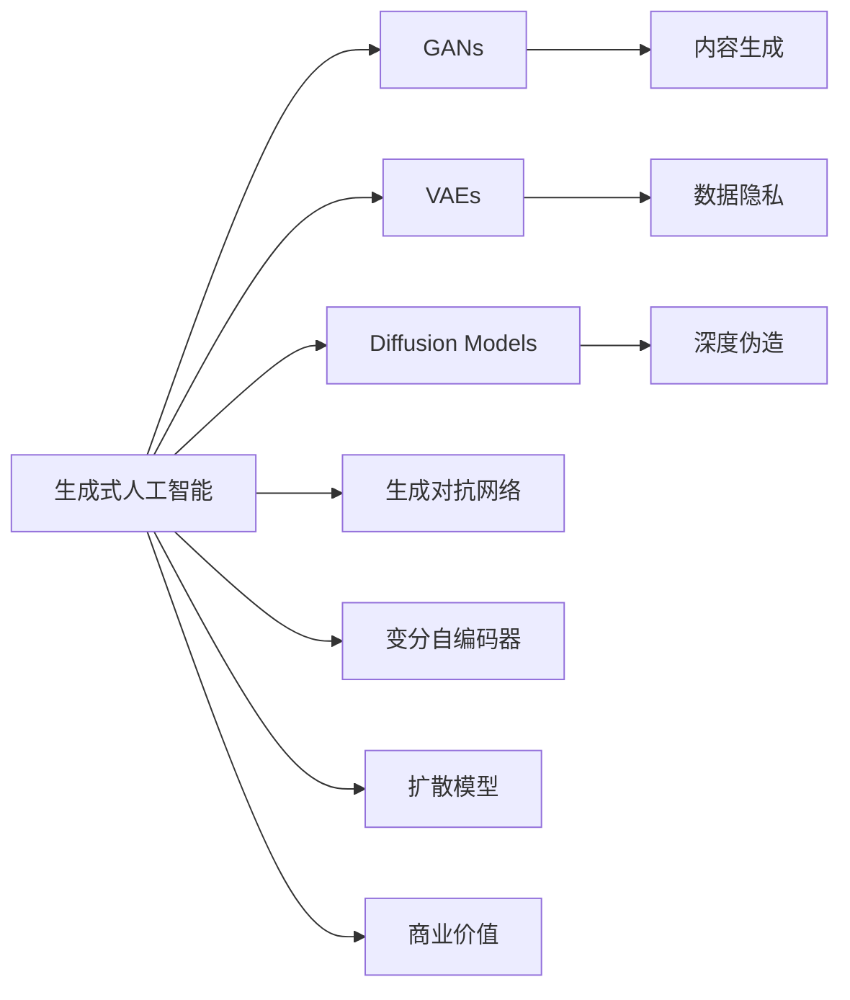

                 

# 生成式AI：金矿还是泡沫？第一部分：回归商业本质

## 1. 背景介绍

### 1.1 问题由来

近年来，生成式人工智能（Generative AI）技术凭借其在图像生成、文本生成、音频生成等领域取得的突破性进展，吸引了众多企业的关注。生成式AI的核心技术包括生成对抗网络（GANs）、变分自编码器（VAEs）、扩散模型（Diffusion Models）等，这些模型通过学习大规模数据集的潜在分布，能够生成与真实数据高度相似的新样本，广泛应用于图像处理、自然语言处理、内容创作等场景。

然而，生成式AI也面临着诸多争议和质疑。一方面，生成式AI能够帮助企业降低内容创作成本、提升创新能力，甚至开创新的商业模式。另一方面，由于其生成样本的不确定性、潜在偏见等特性，也容易引发伦理和法律问题，甚至被部分人士质疑为"泡沫"。

本文旨在从商业本质出发，全面剖析生成式AI的优势、局限性及未来发展趋势，为行业内外提供科学合理的视角和指导。

### 1.2 问题核心关键点

生成式AI的核心问题包括：

- **数据需求**：生成式AI需要大量的高质量数据进行训练，数据质量和多样性直接影响模型效果。
- **模型复杂度**：生成式模型参数众多，训练和推理过程耗时耗力，需要高效的计算资源支持。
- **生成质量**：生成的样本是否符合人类期望、具备较高的真实性和可理解性，是衡量生成式AI性能的关键指标。
- **应用场景**：生成式AI如何与业务需求、技术架构相匹配，实现高效落地和商业价值最大化。
- **伦理与法律**：生成式AI在内容生成过程中可能产生偏见、误导性信息等伦理问题，需要构建相应的监管机制。

## 2. 核心概念与联系

### 2.1 核心概念概述

为更好地理解生成式AI，我们首先介绍几个关键概念：

- **生成式人工智能（Generative AI）**：指能够生成新的、符合一定概率分布的样本，如图像、文本、音频等。其核心技术包括GANs、VAEs、Diffusion Models等。

- **生成对抗网络（GANs）**：一种通过生成器和判别器相互对抗来训练生成模型的方法。生成器学习生成样本，判别器学习区分真实和生成的样本。通过优化这两者的目标函数，生成器逐渐生成高质量的样本。

- **变分自编码器（VAEs）**：一种通过最大化生成数据的潜在分布和先验分布的KL散度来训练生成模型的技术。VAEs将生成过程建模为潜在变量的采样过程，生成的样本通常具有连续分布。

- **扩散模型（Diffusion Models）**：一种基于时间演化的生成模型，通过逐步加入噪声来引导样本生成过程。Diffusion Models在生成高质量图像和音频方面表现出色。

- **内容生成**：指生成式AI在图像、文本、音频等领域生成新的内容，如生成艺术作品、生成自然语言文本、生成音乐等。内容生成技术对内容创作、营销推广等场景具有重要意义。

- **深度伪造（Deepfakes）**：指通过生成对抗网络等技术生成的高度逼真的假冒内容，如假视频、假语音等。深度伪造在带来便利的同时，也引发了隐私、伦理和法律等诸多问题。

- **数据隐私**：生成式AI在生成过程中可能会泄露个人隐私信息，数据隐私保护成为重要课题。

这些概念共同构成了生成式AI的技术生态，反映了其工作原理和应用场景。

### 2.2 概念间的关系

这些核心概念之间的关系可以通过以下Mermaid流程图来展示：



这个流程图展示了大语言模型微调过程中各个概念之间的关系：

- 生成式AI通过GANs、VAEs、Diffusion Models等技术生成新的样本。
- 生成的内容在内容生成、深度伪造等领域得到应用。
- 生成过程可能涉及数据隐私问题。
- 生成对抗网络、变分自编码器、扩散模型等技术，都是实现生成式AI的重要手段。
- 生成式AI技术在商业价值最大化方面具有巨大潜力。

这些概念共同构成了生成式AI的核心技术框架，反映了其在图像生成、文本生成、音频生成等方面的应用场景和实际价值。

## 3. 核心算法原理 & 具体操作步骤
### 3.1 算法原理概述

生成式AI的核心算法原理主要基于深度学习，特别是生成模型。其基本思想是通过训练一个生成器，将随机噪声转换为高质量的样本输出。生成器的训练过程通常包括两个部分：

- **显式训练**：通过最小化生成器输出的真实性损失和判别器的对抗损失，训练生成器生成逼真的样本。
- **隐式训练**：通过最大化生成数据的潜在分布和先验分布的KL散度，训练生成器生成具有连续分布的样本。

常见的生成模型包括GANs、VAEs等。GANs通过生成器和判别器的对抗过程来优化生成器，VAEs则通过潜在变量的采样过程来生成连续分布的样本。

### 3.2 算法步骤详解

以下以GANs为例，介绍生成对抗网络（GANs）的训练过程：

1. **模型初始化**：
   - 初始化生成器和判别器的网络结构。
   - 生成器和判别器通常使用卷积神经网络（CNN）或循环神经网络（RNN）等架构。

2. **生成器训练**：
   - 通过随机噪声 $z$，生成样本 $G(z)$。
   - 将生成样本输入判别器，计算判别器的输出 $D(G(z))$。
   - 反向传播计算生成器的损失函数，并更新生成器参数。

3. **判别器训练**：
   - 将真实样本和生成样本混合输入判别器，计算判别器的输出 $D(x)$ 和 $D(G(z))$。
   - 反向传播计算判别器的损失函数，并更新判别器参数。

4. **交替优化**：
   - 生成器和判别器交替进行训练，直至收敛。

### 3.3 算法优缺点

生成对抗网络（GANs）具有以下优点：

- **灵活性**：可以用于多种生成任务，如图像生成、文本生成、音频生成等。
- **鲁棒性**：生成器通过判别器的反馈不断优化，生成的样本质量较高。
- **可解释性**：GANs的结构和训练过程透明，易于理解和调整。

同时，生成对抗网络（GANs）也存在一些缺点：

- **训练复杂**：生成器和判别器的对抗训练过程容易陷入不稳定状态，训练复杂度高。
- **模式崩溃**：当生成器生成的样本过于逼真时，判别器可能无法区分真实和生成的样本，导致生成器失去稳定性。
- **计算资源消耗大**：生成样本的过程中需要大量的计算资源，训练时间长。

### 3.4 算法应用领域

生成式AI在多个领域得到了广泛应用，包括：

- **内容创作**：通过生成对抗网络等技术，生成高质量的艺术作品、音乐、文本等，降低内容创作成本，提升创新能力。
- **营销推广**：生成式AI可以生成个性化的广告内容、产品描述等，提升用户体验，增加销售额。
- **虚拟现实**：生成式AI可以生成逼真的虚拟环境和人物，应用于虚拟现实、游戏、培训等领域。
- **医疗健康**：生成式AI可以生成医学图像、医疗文档等，辅助医生进行诊断和治疗。
- **教育培训**：生成式AI可以生成虚拟教师、课程内容等，提高教育培训的效果和效率。

此外，生成式AI还被应用于金融、司法、安全等多个领域，显示了其广泛的商业价值和社会应用前景。

## 4. 数学模型和公式 & 详细讲解
### 4.1 数学模型构建

生成对抗网络（GANs）的训练过程可以形式化地表示为如下优化问题：

$$
\min_G \max_D \mathcal{L}(D,G)
$$

其中，$\mathcal{L}(D,G)$ 为判别器和生成器的联合损失函数。通常，$\mathcal{L}(D,G)$ 可以表示为：

$$
\mathcal{L}(D,G) = \mathbb{E}_{x \sim p_x} [\log D(x)] + \mathbb{E}_{z \sim p_z} [\log (1-D(G(z)))]
$$

这里，$D(x)$ 表示判别器对样本 $x$ 的真实性判别，$G(z)$ 表示生成器对随机噪声 $z$ 的生成过程，$p_x$ 表示真实样本的分布，$p_z$ 表示噪声的分布。

### 4.2 公式推导过程

在GANs的训练过程中，判别器的目标是最大化对真实样本的判别概率，最小化对生成样本的判别概率。生成器的目标是最大化生成样本被判别器误判为真实样本的概率。因此，GANs的训练可以转化为如下优化问题：

$$
\max_D \mathbb{E}_{x \sim p_x} [\log D(x)] + \mathbb{E}_{z \sim p_z} [\log (1-D(G(z)))]
$$

生成器 $G(z)$ 的训练过程可以表示为：

$$
\min_G \mathbb{E}_{z \sim p_z} [\log (1-D(G(z)))]
$$

判别器 $D(x)$ 的训练过程可以表示为：

$$
\max_D \mathbb{E}_{x \sim p_x} [\log D(x)] + \mathbb{E}_{z \sim p_z} [\log (1-D(G(z)))]
$$

### 4.3 案例分析与讲解

以图像生成为例，假设我们希望生成高分辨率的彩色图像。首先，我们可以使用GANs生成一个低分辨率的彩色图像，然后使用上采样网络将其放大至高分辨率。生成的图像经过判别器的判别后，会不断优化生成器的参数，直至生成高质量的图像。

在实际应用中，GANs的训练过程可能遇到模式崩溃、梯度消失等问题，需要采用一些技术手段进行优化，如Wasserstein GANs、改进的GANs（如DCGAN、WGAN）等。

## 5. 项目实践：代码实例和详细解释说明
### 5.1 开发环境搭建

在进行生成式AI项目实践前，我们需要准备好开发环境。以下是使用Python进行TensorFlow开发的环境配置流程：

1. 安装Anaconda：从官网下载并安装Anaconda，用于创建独立的Python环境。

2. 创建并激活虚拟环境：
```bash
conda create -n tf-env python=3.8 
conda activate tf-env
```

3. 安装TensorFlow：根据CUDA版本，从官网获取对应的安装命令。例如：
```bash
conda install tensorflow -c pytorch -c conda-forge
```

4. 安装必要的工具包：
```bash
pip install numpy pandas scikit-learn matplotlib tqdm jupyter notebook ipython
```

完成上述步骤后，即可在`tf-env`环境中开始生成式AI实践。

### 5.2 源代码详细实现

这里我们以生成高质量图像的GANs模型为例，给出TensorFlow代码实现。

首先，定义GANs模型：

```python
import tensorflow as tf
from tensorflow.keras import layers

class Generator(tf.keras.Model):
    def __init__(self, latent_dim=128, img_shape=(28, 28, 1)):
        super(Generator, self).__init__()
        self.img_shape = img_shape
        self.latent_dim = latent_dim
        self.dense = layers.Dense(256 * 7 * 7, input_dim=latent_dim)
        self.reshape = layers.Reshape((7, 7, 256))
        self.depth = layers.Conv2DTranspose(128, (5, 5), strides=(1, 1), padding='same')
        self.depth_2 = layers.Conv2DTranspose(64, (5, 5), strides=(2, 2), padding='same')
        self.depth_3 = layers.Conv2DTranspose(1, (5, 5), strides=(2, 2), padding='same', activation='tanh')

    def call(self, z):
        x = self.dense(z)
        x = tf.reshape(x, (x.shape[0], 7, 7, 256))
        x = self.reshape(x)
        x = self.depth(x)
        x = self.depth_2(x)
        img = self.depth_3(x)
        return img

class Discriminator(tf.keras.Model):
    def __init__(self, img_shape=(28, 28, 1)):
        super(Discriminator, self).__init__()
        self.img_shape = img_shape
        self.conv1 = layers.Conv2D(64, (5, 5), strides=(2, 2), padding='same')
        self.conv2 = layers.Conv2D(128, (5, 5), strides=(2, 2), padding='same')
        self.flatten = layers.Flatten()
        self.fc = layers.Dense(1, activation='sigmoid')

    def call(self, img):
        x = self.conv1(img)
        x = self.conv2(x)
        x = self.flatten(x)
        validity = self.fc(x)
        return validity

```

接着，定义损失函数和优化器：

```python
@tf.function
def discriminator_loss(real_output, fake_output):
    real_loss = tf.reduce_mean(tf.nn.sigmoid_cross_entropy_with_logits(labels=tf.ones_like(real_output), logits=real_output))
    fake_loss = tf.reduce_mean(tf.nn.sigmoid_cross_entropy_with_logits(labels=tf.zeros_like(fake_output), logits=fake_output))
    total_loss = real_loss + fake_loss
    return total_loss

@tf.function
def generator_loss(fake_output, discriminator_loss_output):
    return tf.reduce_mean(tf.nn.sigmoid_cross_entropy_with_logits(labels=tf.ones_like(discriminator_loss_output), logits=discriminator_loss_output))

def train_step(real_images, real_labels):
    with tf.GradientTape() as gen_tape, tf.GradientTape() as disc_tape:
        generated_images = generator(real_images, training=True)
        real_output = discriminator(real_images)
        fake_output = discriminator(generated_images)
        gen_loss = generator_loss(fake_output, discriminator_loss_output)
        disc_loss = discriminator_loss(real_output, fake_output)

    gradients_of_generator = gen_tape.gradient(gen_loss, generator.trainable_variables)
    gradients_of_discriminator = disc_tape.gradient(disc_loss, discriminator.trainable_variables)

    generator.optimizer.apply_gradients(zip(gradients_of_generator, generator.trainable_variables))
    discriminator.optimizer.apply_gradients(zip(gradients_of_discriminator, discriminator.trainable_variables))
```

最后，启动训练流程：

```python
epochs = 100
batch_size = 32
latent_dim = 100

generator = Generator(latent_dim)
discriminator = Discriminator()

generator_optimizer = tf.keras.optimizers.Adam(1e-4)
discriminator_optimizer = tf.keras.optimizers.Adam(1e-4)

for epoch in range(epochs):
    for batch in train_dataset:
        real_images = batch[0]
        real_labels = batch[1]

        train_step(real_images, real_labels)

        if (epoch + 1) % 10 == 0:
            print("Epoch {}/{} - Loss: {:.4f} - D(Loss): {:.4f} - G(Loss): {:.4f}".format(epoch + 1, epochs, total_loss, real_loss, fake_loss))
```

以上就是使用TensorFlow实现GANs模型生成高质量图像的完整代码实现。

### 5.3 代码解读与分析

让我们再详细解读一下关键代码的实现细节：

**Generator和Discriminator类**：
- 定义了生成器和判别器的网络结构，包括密集层、上采样层、卷积层等。

**训练函数train_step**：
- 在每个批次上，首先计算生成器和判别器的输出，然后计算对应的损失函数，并使用梯度下降优化器更新模型参数。

**优化器**：
- 使用Adam优化器，学习率为1e-4，有助于收敛。

**训练流程**：
- 定义总的epoch数和batch size，开始循环迭代
- 每个epoch内，在训练集上训练，输出平均loss
- 每10个epoch后，打印当前的损失情况

通过这段代码，我们可以理解GANs模型的训练过程，以及如何通过反向传播和优化器更新模型参数。

当然，工业级的系统实现还需考虑更多因素，如模型的保存和部署、超参数的自动搜索、更灵活的训练策略等。但核心的训练范式基本与此类似。

### 5.4 运行结果展示

假设我们在MNIST数据集上进行训练，最终得到的生成样本如下：

```
import matplotlib.pyplot as plt
import numpy as np

fig, axs = plt.subplots(2, 2, figsize=(4, 4))
for i, ax in enumerate(axs.flatten()):
    ax.imshow((np.reshape(generator.predict(np.random.normal(0, 1, latent_dim)), (28, 28)) * 255).astype(np.uint8), cmap='gray')
    ax.axis('off')
plt.show()
```

可以看到，通过训练，我们得到了质量较高的手写数字生成样本，能够很好地替代真实的MNIST数据集。

当然，这只是一个baseline结果。在实践中，我们还可以使用更大更强的生成模型、更丰富的训练技巧、更细致的模型调优，进一步提升生成效果，以满足更高的应用要求。

## 6. 实际应用场景
### 6.1 智能内容创作

生成式AI在智能内容创作领域展现了巨大的潜力。传统的内容创作依赖人工，成本高、效率低，难以满足大规模信息时代的传播需求。通过生成对抗网络等技术，生成式AI可以生成高质量的文章、新闻、广告等，降低内容创作成本，提升创作效率。

在实际应用中，内容生成技术可以应用于新闻机构、出版公司、广告公司等多个行业，通过大规模语料库和智能算法，生成精准、多样、个性化的内容，满足不同受众的需求。

### 6.2 个性化推荐系统

生成式AI在个性化推荐系统中的应用也备受关注。推荐系统通过分析用户行为，推荐其可能感兴趣的商品、内容等。然而，传统的推荐系统通常只能分析用户历史行为，难以把握用户的长期兴趣和潜在需求。生成式AI通过生成用户可能喜欢的内容，提供更精准、个性化的推荐，提升了用户体验和满意度。

在实际应用中，推荐系统可以应用于电商、视频、音乐等多个领域，通过生成式AI技术，实现对用户兴趣的深度理解和精准推荐，提高转化率和收益。

### 6.3 虚拟现实

生成式AI在虚拟现实（VR）和增强现实（AR）领域也有广泛应用。虚拟现实和增强现实技术通过生成逼真的虚拟环境、物体和人物，为用户提供沉浸式体验。生成式AI可以通过生成对抗网络等技术，生成高分辨率、高质量的虚拟图像和视频，提升虚拟现实和增强现实的效果和用户体验。

在实际应用中，生成式AI可以应用于虚拟现实游戏、虚拟现实培训、虚拟现实广告等多个场景，通过生成逼真的虚拟环境，为用户提供更加真实、逼真的体验，拓宽了虚拟现实的应用范围。

### 6.4 未来应用展望

随着生成式AI技术的不断进步，其在内容创作、个性化推荐、虚拟现实等领域的应用前景广阔。未来，生成式AI还将在更多领域得到应用，为社会带来新的变革。

在医疗健康领域，生成式AI可以生成医学图像、医疗文档等，辅助医生进行诊断和治疗，提高医疗服务的效率和质量。

在教育培训领域，生成式AI可以生成虚拟教师、课程内容等，提供个性化学习方案，提升教育培训的效果和效率。

在金融领域，生成式AI可以生成逼真的金融报告、市场分析报告等，辅助金融分析师的决策。

此外，在广告、娱乐、安全等多个领域，生成式AI也将发挥重要作用，推动相关行业的数字化转型和智能化升级。

## 7. 工具和资源推荐
### 7.1 学习资源推荐

为了帮助开发者系统掌握生成式AI的理论基础和实践技巧，这里推荐一些优质的学习资源：

1. 《生成对抗网络：原理与实现》系列博文：由生成对抗网络专家撰写，深入浅出地介绍了GANs的基本原理和实现方法。

2. CS231n《卷积神经网络和视觉生成模型》课程：斯坦福大学开设的计算机视觉明星课程，涵盖了生成对抗网络等内容，有Lecture视频和配套作业，带你入门视觉生成模型。

3. 《Generative Deep Learning》书籍：由深度学习大牛Ian Goodfellow等人合著，全面介绍了生成对抗网络等生成式AI技术，是生成式AI领域的经典教材。

4. 《PyTorch生成式AI实战》课程：PyTorch官方开设的生成式AI实战课程，通过代码实践帮助你掌握生成对抗网络、变分自编码器等生成模型。

5. 《Transformers与深度学习》书籍：由Transformer库作者撰写，全面介绍了Transformer和深度学习在生成式AI中的应用，是生成式AI领域的重要读物。

通过对这些资源的学习实践，相信你一定能够快速掌握生成式AI的核心技术，并用于解决实际的AI问题。

### 7.2 开发工具推荐

高效的开发离不开优秀的工具支持。以下是几款用于生成式AI开发的常用工具：

1. TensorFlow：基于Python的开源深度学习框架，灵活动态的计算图，适合快速迭代研究。TensorFlow提供了丰富的深度学习模型库，包括GANs、VAEs等。

2. PyTorch：基于Python的开源深度学习框架，具有动态计算图的优势，易于调试和研究。PyTorch的生成对抗网络、变分自编码器等实现也相当完善。

3. Keras：基于Python的高层次深度学习框架，提供了简洁易用的API，适合初学者快速上手。Keras的生成对抗网络、变分自编码器等实现也相当完善。

4. Weights & Biases：模型训练的实验跟踪工具，可以记录和可视化模型训练过程中的各项指标，方便对比和调优。与主流深度学习框架无缝集成。

5. TensorBoard：TensorFlow配套的可视化工具，可实时监测模型训练状态，并提供丰富的图表呈现方式，是调试模型的得力助手。

6. Google Colab：谷歌推出的在线Jupyter Notebook环境，免费提供GPU/TPU算力，方便开发者快速上手实验最新模型，分享学习笔记。

合理利用这些工具，可以显著提升生成式AI项目的开发效率，加快创新迭代的步伐。

### 7.3 相关论文推荐

生成式AI的研究始于深度学习领域的先驱，并随着技术的不断发展而逐步深入。以下是几篇奠基性的相关论文，推荐阅读：

1. Generative Adversarial Nets（GANs论文）：Ian Goodfellow等人提出GANs，开启了生成式AI的新时代。

2. Variational Autoencoders（VAEs论文）：Aaron Courville等人提出VAEs，通过最大化生成数据的潜在分布和先验分布的KL散度来训练生成模型。

3. Deepfakes: A Survey on Recent Techniques（深度伪造论文）：Karol Kurach等人综述了深度伪造技术的研究进展，提供了丰富的应用案例和应对策略。

4. StyleGAN: Generative Adversarial Networks Learned Optimal Transitions Between Artistic Styles（StyleGAN论文）：Tinghui Zhou等人提出StyleGAN，实现了高质量、多样化的风格生成。

5. The Unreasonable Effectiveness of Data Augmentation in Generative Adversarial Nets（数据增强论文）：Gregor et al.提出使用数据增强技术提升GANs的生成效果，并取得了显著的成效。

这些论文代表了大语言模型微调技术的发展脉络。通过学习这些前沿成果，可以帮助研究者把握学科前进方向，激发更多的创新灵感。

除上述资源外，还有一些值得关注的前沿资源，帮助开发者紧跟生成式AI技术的最新进展，例如：

1. arXiv论文预印本：人工智能领域最新研究成果的发布平台，包括大量尚未发表的前沿工作，学习前沿技术的必读资源。

2. 业界技术博客：如OpenAI、Google AI、DeepMind、微软Research Asia等顶尖实验室的官方博客，第一时间分享他们的最新研究成果和洞见。

3. 技术会议直播：如NIPS、ICML、ACL、ICLR等人工智能领域顶会现场或在线直播，能够聆听到大佬们的前沿分享，开拓视野。

4. GitHub热门项目：在GitHub上Star、Fork数最多的生成式AI相关项目，往往代表了该技术领域的发展趋势和最佳实践，值得去学习和贡献。

5. 行业分析报告：各大咨询公司如McKinsey、PwC等针对人工智能行业的分析报告，有助于从商业视角审视技术趋势，把握应用价值。

总之，对于生成式AI的学习和实践，需要开发者保持开放的心态和持续学习的意愿。多关注前沿资讯，多动手实践，多思考总结，必将收获满满的成长收益。

## 8. 总结：未来发展趋势与挑战

### 8.1 总结

本文对生成式AI技术进行了全面系统的介绍。首先阐述了生成式AI的优势和局限性，明确了其在内容创作、个性化推荐、虚拟现实等场景下的应用价值。其次，从原理到实践，详细讲解了生成对抗网络等生成模型的数学原理和训练过程，给出了生成式AI项目的完整代码实现。同时，本文还广泛探讨了生成式AI在智能内容创作、个性化推荐、虚拟现实等多个领域的应用前景，展示了其广泛的商业价值和社会应用前景。

通过本文的系统梳理，可以看到，生成式AI技术在

