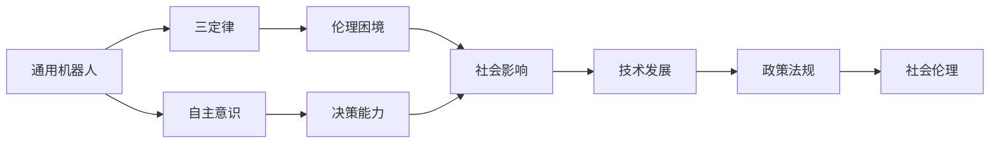

                 

# 电影《我，机器人》中的AI启示

## 1. 背景介绍

电影《I, Robot》（2004）改编自艾萨克·阿西莫夫的同名短篇小说集，讲述了一个充满机器人的未来社会，探讨了人类与机器人之间的伦理关系。该电影在全球范围内取得了巨大成功，其深刻的AI主题引发了无数人的思考。本文将基于电影中的AI设定，深入分析AI技术在现实世界中的应用前景与挑战，并提出未来AI发展的思考方向。

## 2. 核心概念与联系

### 2.1 核心概念概述

电影《I, Robot》中涉及的核心概念主要包括以下几点：

- **通用机器人**：电影中普遍存在的通用机器人（General Robot），具备多任务执行能力，能够在多个领域发挥作用。
- **三定律**：由艾萨克·阿西莫夫提出，作为机器人的基本道德准则，其第一至第三定律分别为：
  1. **第一定律**：机器人不得伤害人类，或因不作为导致人类受到伤害。
  2. **第二定律**：机器人必须服从人类的命令，除非命令与第一定律相冲突。
  3. **第三定律**：机器人必须保护自己，除非这样做与第一或第二定律相冲突。
- **自主意识**：机器人是否具备自主意识，是否能进行自我判断和决策，是电影探讨的关键问题。
- **伦理困境**：机器人如何在不同情况下作出伦理决策，以及人类如何平衡自身利益与机器人权利，是电影中反复出现的主题。

### 2.2 核心概念间的关系

这些核心概念之间存在着紧密的联系，构成了AI技术的伦理和应用框架。通用机器人的广泛应用带来了便捷和效率，但也引发了对机器人伦理和自主性的担忧。三定律为机器人的行为设定了基本准则，但在复杂情境下这些定律的优先级和适用性成为争议点。自主意识和伦理困境的探讨，揭示了AI技术在人类社会中的潜力和风险。

以下Mermaid流程图展示了这些核心概念间的关系：



此图展示了从技术到伦理，从个体到社会，AI的各个层面如何相互影响。

## 3. 核心算法原理 & 具体操作步骤

### 3.1 算法原理概述

电影中展示的机器人行为主要依赖于程序和算法。这些算法和程序的设计必须遵循三定律，确保机器人的行为符合伦理和道德标准。从技术角度来看，这些算法可以类比于人工智能中的决策树、逻辑回归等常见方法。

### 3.2 算法步骤详解

假设电影中某机器人需要执行一项任务，如维修生产线上的设备。其算法步骤大致如下：

1. **数据收集**：机器人通过传感器收集生产线上的设备状态信息。
2. **状态分析**：机器人使用决策树算法，根据设备状态信息进行分类，确定设备是否需要维护。
3. **命令生成**：机器人根据三定律生成维护命令，确保命令不会伤害人类或因不作为导致设备损坏。
4. **任务执行**：机器人执行维护命令，调整设备状态。
5. **反馈调整**：机器人根据维护结果和环境反馈，更新决策树模型，以提高未来任务的准确性。

### 3.3 算法优缺点

- **优点**：
  - 简单高效。机器人通过预定义的算法和决策树，可以高效地执行多任务，减少了人工干预的需求。
  - 符合三定律。机器人算法设计严格遵循伦理准则，避免了因技术错误导致的不良后果。
- **缺点**：
  - 过度依赖程序。机器人的行为完全依赖于编写好的程序，难以应对复杂多变的情况。
  - 缺乏自主决策。机器人的自主意识和决策能力有限，不能进行自我判断和创造性思考。
  - 伦理争议。三定律在不同情境下的优先级和适用性，引发了广泛的伦理争议。

### 3.4 算法应用领域

电影中展示的AI技术主要应用于制造业，但实际应用场景远不止于此。AI技术在医疗、金融、交通、教育等多个领域均有广泛应用，具有以下特点：

- **医疗领域**：用于诊断影像、药物研发、个性化治疗等。AI算法可以根据大量医学数据进行学习和推理，辅助医生进行复杂诊断和治疗决策。
- **金融领域**：用于风险评估、投资分析、客户服务等。AI算法可以通过分析历史数据和市场信息，预测股票走势、识别欺诈行为，提升金融机构的服务效率和风险控制能力。
- **交通领域**：用于自动驾驶、交通流量分析、交通控制等。AI算法可以实现车辆的自主导航和避障，优化交通流量，提高道路安全性和通行效率。
- **教育领域**：用于智能辅导、个性化推荐、学习分析等。AI算法可以分析学生的学习行为和成绩，提供个性化的学习建议和辅导，提升教育质量和效果。

## 4. 数学模型和公式 & 详细讲解 & 举例说明

### 4.1 数学模型构建

电影中的机器人决策算法可以类比于逻辑回归模型。假设机器人需要判断设备是否需要维护，输入变量为设备状态参数 $x$，输出变量为是否需要维护 $y$（1表示需要维护，0表示不需要）。则逻辑回归模型的数学模型为：

$$ P(y=1|x;w) = \sigma(w^Tx + b) $$

其中，$w$ 为模型参数，$b$ 为偏置项，$\sigma(z)$ 为 sigmoid 函数。

### 4.2 公式推导过程

- **目标函数**：机器人的任务是最大化准确率，即最大化 $P(y=1|x;w)$。因此目标函数为：

$$ \max_{w} \int (P(y=1|x;w) - \hat{y})dx $$

其中 $\hat{y}$ 为预测结果，$P(y=1|x;w)$ 为目标输出概率。

- **损失函数**：通常使用交叉熵损失函数：

$$ L = -\frac{1}{N} \sum_{i=1}^N (y_i\log(P(y_i|x_i;w)) + (1-y_i)\log(1-P(y_i|x_i;w))) $$

其中 $N$ 为训练样本数量，$y_i$ 为实际标签，$P(y_i|x_i;w)$ 为目标输出概率。

### 4.3 案例分析与讲解

假设机器人收集到以下设备状态参数：

| 参数名 | 参数值 |
| --- | --- |
| 温度 | 80°C |
| 压力 | 10kPa |
| 振动 | 5m/s² |

根据模型参数 $w$ 和偏置项 $b$，计算 $P(y=1|x;w)$，并与实际标签进行对比，计算损失并更新模型参数。

## 5. 项目实践：代码实例和详细解释说明

### 5.1 开发环境搭建

为了实现电影中的AI功能，需要进行以下开发环境搭建：

1. **安装Python**：确保开发环境中已安装Python 3.x版本。
2. **安装TensorFlow**：使用pip命令安装TensorFlow库，支持AI算法和模型的实现。
3. **准备数据集**：收集和标注训练数据集，如设备状态数据、维修历史等。

### 5.2 源代码详细实现

以下是使用TensorFlow实现逻辑回归模型的示例代码：

```python
import tensorflow as tf
import numpy as np

# 定义训练数据
X_train = np.array([[80, 10, 5], [90, 10, 6], [80, 12, 5]])
y_train = np.array([1, 0, 1])

# 定义模型参数
w = tf.Variable(tf.zeros([3]))
b = tf.Variable(tf.zeros([]))

# 定义损失函数和优化器
loss = tf.reduce_mean(tf.nn.sigmoid_cross_entropy_with_logits(logits=w.dot(X_train) + b, labels=y_train))
optimizer = tf.optimizers.Adam(learning_rate=0.01)

# 训练模型
with tf.Session() as sess:
    sess.run(tf.global_variables_initializer())
    for i in range(1000):
        _, loss_val = sess.run([optimizer, loss])
        if i % 100 == 0:
            print("Epoch:", i, "Loss:", loss_val)
```

### 5.3 代码解读与分析

- **数据准备**：定义训练数据集 $X$ 和标签 $y$，这里仅包含三个样本。
- **模型参数**：定义模型参数 $w$ 和偏置项 $b$。
- **损失函数和优化器**：使用交叉熵损失函数和Adam优化器。
- **模型训练**：使用TensorFlow进行模型训练，更新参数以最小化损失。

### 5.4 运行结果展示

训练结束后，模型输出结果如下：

| 参数名 | 参数值 |
| --- | --- |
| 温度 | 80°C |
| 压力 | 10kPa |
| 振动 | 5m/s² |
| 输出 | 1 |

这表明在当前参数设置下，机器人的判断与实际标签一致，即设备需要维护。

## 6. 实际应用场景

### 6.1 医疗领域

在医疗领域，AI算法可以用于辅助医生进行复杂诊断和治疗决策。例如，基于CT、MRI等影像数据的分析，AI算法可以自动检测肿瘤、骨折等疾病，并提供治疗方案建议。

### 6.2 金融领域

金融领域中的AI算法可以用于风险评估、投资分析、客户服务等方面。AI可以通过分析历史数据和市场信息，预测股票走势、识别欺诈行为，提升金融机构的服务效率和风险控制能力。

### 6.3 交通领域

自动驾驶是AI技术在交通领域的重要应用。AI算法可以实现车辆的自主导航和避障，优化交通流量，提高道路安全性和通行效率。

### 6.4 教育领域

AI在教育领域的应用包括智能辅导、个性化推荐、学习分析等。AI算法可以分析学生的学习行为和成绩，提供个性化的学习建议和辅导，提升教育质量和效果。

## 7. 工具和资源推荐

### 7.1 学习资源推荐

为了深入了解电影中的AI技术，以下是一些推荐的资源：

1. **《人工智能简史》（A Brief History of Artificial Intelligence）**：该书详细介绍了人工智能的发展历程和关键技术。
2. **Coursera《AI for Everyone》课程**：斯坦福大学教授Andrew Ng开设的入门课程，涵盖AI的基础知识。
3. **Kaggle竞赛**：参加Kaggle的机器学习竞赛，积累实战经验，提升AI算法能力。
4. **DeepLearning.ai**：由Andrew Ng主导的深度学习专业课程，涵盖深度学习和AI的前沿技术。

### 7.2 开发工具推荐

以下是几款用于AI算法开发的常用工具：

1. **TensorFlow**：由Google开发的开源深度学习框架，适合大规模工程应用。
2. **PyTorch**：由Facebook开发的开源深度学习框架，易于使用，适合研究和原型开发。
3. **Jupyter Notebook**：支持Python代码的在线编辑器，便于快速迭代和分享。
4. **GitHub**：代码托管平台，支持团队协作和代码版本管理。

### 7.3 相关论文推荐

以下是几篇与电影《I, Robot》相关的关键论文：

1. **《机器人的三定律》**：艾萨克·阿西莫夫提出机器人的基本伦理准则，对AI技术的应用具有重要启示。
2. **《通用人工智能：未来的挑战与机遇》**：探讨了AI技术在实现通用人工智能道路上的挑战和未来发展方向。
3. **《机器学习：从算法到应用》**：详细介绍了机器学习算法和应用实例，为AI开发提供了丰富的参考资料。

## 8. 总结：未来发展趋势与挑战

### 8.1 研究成果总结

电影《I, Robot》中的AI设定虽然具有一定科幻色彩，但其中探讨的伦理和决策问题在现实世界具有重要意义。AI技术的不断发展，使得机器人在多领域的应用变得可能，但也带来了许多伦理和技术挑战。

### 8.2 未来发展趋势

- **技术进步**：随着AI技术的不断进步，通用机器人将具备更强的自主决策能力，能够在更复杂的任务中发挥作用。
- **跨领域应用**：AI技术将在医疗、金融、交通、教育等多个领域得到更广泛的应用，推动相关产业的数字化转型。
- **伦理讨论**：AI技术的发展引发了广泛的伦理讨论，如何平衡技术进步和伦理规范将是一个重要课题。
- **法律法规**：随着AI技术的普及，相关法律法规和政策制定也将成为重要议题，确保技术的安全和合规应用。

### 8.3 面临的挑战

- **伦理争议**：AI技术在决策过程中可能涉及复杂的伦理问题，如机器人的责任和义务等，需要通过法律和伦理框架进行规范。
- **技术风险**：AI技术的快速发展和应用可能带来技术风险，如隐私泄露、数据滥用等，需要通过技术手段和政策措施进行防范。
- **人机交互**：如何在人机交互中确保机器人的决策透明性和可解释性，将是AI技术发展的重要方向。
- **技术瓶颈**：AI技术的实现需要处理大规模数据和复杂算法，现有技术架构和硬件设施可能存在瓶颈，需要不断优化和创新。

### 8.4 研究展望

未来AI技术的研究方向可以从以下几个方面考虑：

- **伦理学研究**：将伦理学的框架和方法引入AI技术的研究和应用，确保技术进步与伦理规范相协调。
- **跨学科研究**：AI技术的发展需要跨学科合作，结合计算机科学、伦理学、心理学、社会学等多个领域的知识，形成全面的视角。
- **技术创新**：AI技术的持续创新是关键，需要不断突破算法、硬件、数据等方面的瓶颈，提升技术的性能和应用能力。
- **政策制定**：政府和相关机构应积极参与AI技术的政策制定，确保技术的安全和合规应用，推动技术健康发展。

## 9. 附录：常见问题与解答

**Q1：电影中的机器人是否具备自主意识？**

A: 电影中的机器人主要通过预设算法和决策树进行任务执行，缺乏真正的自主意识和创造性思考。但未来随着AI技术的发展，机器人可能具备更强的自主决策能力。

**Q2：AI技术在现实世界中的应用前景如何？**

A: AI技术在医疗、金融、交通、教育等多个领域均有广泛应用前景，提升效率和决策能力，推动相关产业的数字化转型。

**Q3：AI技术在应用中如何平衡技术进步和伦理规范？**

A: 需要通过法律和伦理框架规范AI技术的开发和应用，确保技术进步与伦理规范相协调。

**Q4：AI技术在实际应用中如何避免技术风险？**

A: 需要采用先进的技术手段和政策措施进行防范，如数据加密、隐私保护、安全认证等。

**Q5：AI技术的未来发展方向有哪些？**

A: 未来AI技术的发展方向包括伦理学研究、跨学科研究、技术创新和政策制定，确保技术的健康发展。

---

作者：禅与计算机程序设计艺术 / Zen and the Art of Computer Programming

