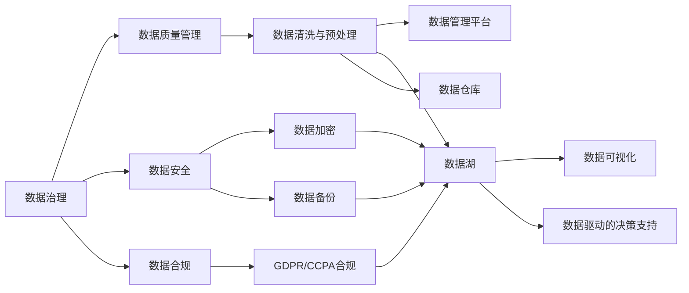

                 

# AI创业：数据管理与商业成功

## 1. 背景介绍

### 1.1 问题由来
随着人工智能技术的快速发展，越来越多的初创企业在追求AI创业的过程中，将数据管理视为成功的关键因素之一。数据，作为AI技术的核心原料，其管理和使用的质量直接决定了AI应用的精度和效率。在许多成功企业的案例中，我们可以看到数据管理和AI技术之间密切的联系和协同作用。然而，数据管理和AI创业中的实际问题也不少。例如，数据来源多样性、数据治理难度、数据隐私和合规性等，这些问题都成为AI创业公司成功与否的重要因素。

### 1.2 问题核心关键点
在AI创业过程中，数据管理与商业成功的关系可以归纳为以下关键点：
1. 数据的获取和整理：如何从多样化的数据来源（如内部数据库、公共数据集、API接口等）高效地获取和整理数据，保证数据的质量和完整性。
2. 数据清洗与预处理：如何处理数据的噪声、缺失值、异常值等问题，提高数据质量，为后续AI模型训练和预测提供可靠的基础。
3. 数据存储与管理：如何选择合适的数据存储方式（如数据库、数据湖、数据仓库等），高效地管理和查询数据，支撑大规模AI应用的存储需求。
4. 数据隐私与合规：如何确保数据使用的合法性和隐私性，符合相关的法律法规，如GDPR、CCPA等，避免数据泄露和滥用。
5. 数据驱动的决策支持：如何通过数据分析和洞察，支持业务决策和战略规划，驱动企业持续增长。

### 1.3 问题研究意义
对于AI创业公司而言，有效的数据管理不仅能够提升AI应用的准确性和效率，还能为企业带来竞争优势和商业成功。以下是几个关键的研究意义：

1. **降低数据风险**：规范的数据管理和治理，可以降低数据泄露、数据质量问题等风险，保障企业数据的可靠性和安全性。
2. **提升AI模型精度**：高质量的数据是构建高性能AI模型的基础，能够提高模型的准确性和鲁棒性，带来更好的商业效果。
3. **增强企业竞争力**：通过数据驱动的决策支持，企业能够更加精准地把握市场趋势和用户需求，快速调整战略，保持竞争优势。
4. **促进业务增长**：数据分析能够揭示用户行为、市场趋势等关键信息，帮助企业优化产品和服务，提升用户满意度和市场份额。
5. **驱动商业创新**：通过数据洞察和分析，企业可以发现新的商业机会，开发新产品、新服务，实现业务的创新和突破。

## 2. 核心概念与联系

### 2.1 核心概念概述

要深入理解AI创业中的数据管理与商业成功，首先需要了解以下核心概念：

- **数据治理**：指通过一系列政策和流程，确保数据的质量、安全和合规，包括数据质量管理、数据生命周期管理、数据隐私保护等。
- **数据管理平台**：利用技术手段和工具，对企业数据进行集中管理和治理，支持数据的采集、存储、处理、分析和应用。
- **数据湖**：一种存储大规模异构数据的数据架构，支持数据的离线分析和在线查询，适用于AI模型训练和数据挖掘。
- **数据仓库**：一种专门用于支持数据分析和决策的数据架构，通过数据抽取、转换和加载（ETL）技术，将数据组织成分析友好的结构。
- **数据可视化**：将复杂的数据信息通过图形化的方式展示出来，帮助用户直观理解和分析数据，支持商业决策。
- **数据驱动的决策支持**：利用数据和分析技术，提供支持业务决策的洞察和建议，推动企业战略和运营的优化。

这些核心概念之间的逻辑关系可以通过以下Mermaid流程图来展示：



这个流程图展示了大规模数据管理和治理的核心流程和技术架构。从数据治理到数据湖、数据仓库、数据管理平台、数据可视化，最终实现数据驱动的决策支持，形成了一个完整的数据管理和应用生态系统。

### 2.2 概念间的关系

这些核心概念之间存在着紧密的联系，形成了数据管理和AI创业的完整生态系统。以下是这些概念之间的关系：

- **数据治理**：是整个数据管理和应用的基础，涉及数据的规范化和标准化，确保数据质量和安全。
- **数据管理平台**：通过技术手段，对数据进行集中管理和治理，支持数据采集、存储、处理、分析和应用，是数据管理和应用的关键工具。
- **数据湖**：通过数据湖架构，存储和管理大规模异构数据，支持离线分析和在线查询，是AI模型训练和数据挖掘的重要支撑。
- **数据仓库**：利用ETL技术，将数据组织成分析友好的结构，支持高效的在线查询和分析，是数据驱动决策的核心。
- **数据可视化**：通过图形化展示数据，帮助用户直观理解和分析数据，支持商业决策。
- **数据驱动的决策支持**：利用数据和分析技术，提供支持业务决策的洞察和建议，推动企业战略和运营的优化。

这些概念共同构成了数据管理和AI创业的完整框架，为企业的成功提供了坚实的基础。

## 3. 核心算法原理 & 具体操作步骤

### 3.1 算法原理概述
AI创业中的数据管理涉及多个方面，包括数据采集、数据清洗、数据存储、数据可视化等。这些过程都需要借助算法和技术来实现。核心算法原理可以归纳为以下几个方面：

1. **数据清洗与预处理**：利用统计学方法和机器学习算法，识别并处理数据中的噪声、缺失值、异常值等问题，提高数据质量。
2. **数据存储与管理**：通过分布式文件系统和数据库技术，实现大规模数据的存储和管理，支持高效的查询和分析。
3. **数据可视化**：利用可视化技术和工具，将复杂的数据信息以图形化的方式展示出来，帮助用户直观理解和分析数据。
4. **数据驱动的决策支持**：利用数据挖掘和机器学习算法，发现数据中的规律和洞察，支持业务决策和战略规划。

### 3.2 算法步骤详解
以下详细介绍每个核心算法的详细步骤：

#### 3.2.1 数据清洗与预处理

**步骤1：数据采集**
- 从不同数据源采集数据，如内部数据库、公共数据集、API接口等。
- 选择合适的数据采集工具和技术，如ETL工具、API集成、爬虫技术等。

**步骤2：数据清洗**
- 数据去重、去噪：识别并去除重复数据和噪声数据。
- 数据标准化：将数据转换为统一的格式，如统一日期格式、统一货币单位等。
- 数据缺失值处理：填补缺失值或删除缺失数据。
- 数据异常值处理：识别并处理异常值，如通过统计学方法或机器学习算法。

**步骤3：数据预处理**
- 特征选择：选择对目标任务有影响的特征。
- 特征提取：通过降维、特征工程技术提取有意义的特征。
- 特征缩放：对特征进行归一化或标准化，避免数据不平衡问题。

#### 3.2.2 数据存储与管理

**步骤1：数据存储**
- 选择合适的数据存储方式，如文件系统、数据库、数据湖、数据仓库等。
- 数据分区与分片：根据数据特征，将数据进行分区和分片，提高数据存储和管理效率。

**步骤2：数据管理**
- 数据版本控制：管理不同版本的数据，支持数据回溯和版本恢复。
- 数据安全管理：实现数据加密、备份、权限控制等，保障数据安全。
- 数据质量监控：实时监控数据质量，识别和处理数据问题。

#### 3.2.3 数据可视化

**步骤1：数据探索**
- 使用探索性数据分析技术，了解数据的基本特征和分布。
- 生成基本统计图，如直方图、箱线图、散点图等。

**步骤2：数据可视化**
- 选择合适的可视化工具和技术，如Tableau、Power BI、Python Matplotlib等。
- 利用可视化技术，生成各种类型的图表，如热力图、地图、雷达图等。

#### 3.2.4 数据驱动的决策支持

**步骤1：数据建模**
- 选择合适的模型，如回归模型、分类模型、聚类模型等。
- 使用机器学习算法，构建预测模型，如线性回归、决策树、随机森林等。

**步骤2：数据预测**
- 对新数据进行预测，生成预测结果。
- 对预测结果进行评估，验证模型的准确性和鲁棒性。

**步骤3：业务决策**
- 利用预测结果和数据洞察，支持业务决策和战略规划。
- 对决策结果进行跟踪和反馈，持续优化决策模型。

### 3.3 算法优缺点
在AI创业中，数据管理和治理的算法和技术具有以下优缺点：

**优点**：
1. **提高数据质量**：通过数据清洗与预处理，提高数据质量，确保数据的一致性和可靠性。
2. **支持大规模数据管理**：通过分布式存储和管理技术，支持大规模数据的存储和处理，满足企业对数据管理的复杂需求。
3. **提升决策效率**：利用数据驱动的决策支持算法，提供数据洞察和分析，支持快速决策和战略规划。

**缺点**：
1. **数据处理复杂**：数据清洗和预处理涉及复杂的数据处理算法，需要较高的技术门槛和资源投入。
2. **系统复杂度较高**：数据管理和治理系统设计复杂，需要集成多种技术和工具，管理成本较高。
3. **数据隐私和安全问题**：数据管理涉及大量的隐私和合规要求，需要严格的数据管理和保护措施。

### 3.4 算法应用领域
数据管理与治理的算法和技术在AI创业中的应用领域广泛，包括：

1. **金融行业**：利用数据管理和分析技术，支持风险控制、欺诈检测、信用评估等业务。
2. **医疗行业**：通过数据管理和分析，支持疾病预测、治疗方案优化、患者管理等业务。
3. **零售行业**：利用数据管理和分析，支持市场分析、库存管理、客户关系管理等业务。
4. **制造业**：通过数据管理和分析，支持生产计划优化、设备维护、供应链管理等业务。
5. **智慧城市**：利用数据管理和分析，支持交通管理、公共安全、能源管理等业务。

## 4. 数学模型和公式 & 详细讲解 & 举例说明

### 4.1 数学模型构建

在AI创业中，数据管理和治理涉及多个数学模型，以下是几个关键的数学模型及其构建方法：

#### 4.1.1 数据清洗与预处理

**数据清洗模型**：
- 噪声识别模型：利用统计学方法，识别数据中的噪声。例如，通过均值、方差、标准差等统计量，识别数据中的异常值和噪声。
- 缺失值处理模型：利用插值方法或机器学习模型，填补缺失值。例如，通过线性插值或KNN算法，填补缺失值。
- 异常值处理模型：利用机器学习算法，识别和处理异常值。例如，通过Isolation Forest算法或基于密度的方法，识别和处理异常值。

**数据预处理模型**：
- 特征选择模型：利用特征选择算法，选择对目标任务有影响的特征。例如，通过基于互信息的特征选择方法，选择相关性高的特征。
- 特征提取模型：利用降维技术或特征工程技术，提取有意义的特征。例如，通过PCA算法或LDA算法，进行特征提取。
- 特征缩放模型：利用归一化或标准化方法，对特征进行缩放。例如，通过Z-score标准化方法，对特征进行归一化。

#### 4.1.2 数据存储与管理

**数据存储模型**：
- 分布式文件系统模型：利用HDFS、Hive等分布式文件系统，实现大规模数据的存储和管理。
- 数据库模型：利用SQL数据库、NoSQL数据库等，支持高效的查询和分析。

**数据管理模型**：
- 数据版本控制模型：利用版本控制系统，管理不同版本的数据。例如，通过Git或SVN，实现数据版本控制。
- 数据安全管理模型：利用数据加密技术、备份技术、权限控制技术，保障数据安全。例如，通过AES加密算法、RSA加密算法、访问控制列表等技术，保障数据安全。

#### 4.1.3 数据可视化

**数据可视化模型**：
- 散点图模型：利用散点图，展示两个变量之间的关系。例如，通过Python Matplotlib库，生成散点图。
- 箱线图模型：利用箱线图，展示数据分布的统计特征。例如，通过Python Seaborn库，生成箱线图。
- 热力图模型：利用热力图，展示数据在二维平面上的分布。例如，通过Tableau或Power BI，生成热力图。

#### 4.1.4 数据驱动的决策支持

**数据建模模型**：
- 线性回归模型：利用线性回归算法，构建预测模型。例如，通过Python Scikit-Learn库，构建线性回归模型。
- 决策树模型：利用决策树算法，构建分类模型。例如，通过Python Scikit-Learn库，构建决策树模型。
- 随机森林模型：利用随机森林算法，构建集成模型。例如，通过Python Scikit-Learn库，构建随机森林模型。

**数据预测模型**：
- 预测模型评估方法：利用准确率、召回率、F1-score等指标，评估预测模型的性能。例如，通过Python Scikit-Learn库，评估预测模型的性能。
- 预测结果验证方法：利用交叉验证方法，验证预测模型的鲁棒性。例如，通过K-Fold交叉验证方法，验证预测模型的鲁棒性。

### 4.2 公式推导过程

以下是数据清洗与预处理、数据存储与管理、数据可视化、数据驱动的决策支持中的关键数学公式推导：

#### 4.2.1 数据清洗与预处理

**噪声识别公式**：
$$
\sigma_{x} = \sqrt{\frac{1}{n-1} \sum_{i=1}^n (x_i - \bar{x})^2}
$$
其中，$\sigma_{x}$为数据的标准差，$\bar{x}$为数据的均值，$n$为数据样本数。

**缺失值处理方法**：
- 均值填补法：
$$
\hat{x_i} = \frac{1}{n} \sum_{j=1}^n x_j
$$
其中，$\hat{x_i}$为第$i$个缺失值的填补值，$n$为数据样本数，$x_j$为第$j$个样本值。
- KNN填补法：
$$
\hat{x_i} = \frac{1}{k} \sum_{j=1}^k x_j
$$
其中，$\hat{x_i}$为第$i$个缺失值的填补值，$k$为KNN算法中邻居的数量，$x_j$为第$j$个样本值。

**异常值处理方法**：
- Isolation Forest算法：
$$
f(x_i) = \frac{\log(n)}{2N}
$$
其中，$f(x_i)$为第$i$个样本的异常值得分，$n$为树的节点数，$N$为样本总数。

#### 4.2.2 数据存储与管理

**分布式文件系统模型**：
- HDFS存储模型：
$$
C_{HDFS} = \frac{N_{block}}{B_{block}} * C_{disk}
$$
其中，$C_{HDFS}$为HDFS存储的成本，$N_{block}$为HDFS中的块数，$B_{block}$为HDFS块的大小，$C_{disk}$为磁盘的成本。

**数据库模型**：
- 查询成本模型：
$$
C_{query} = T_{query} * C_{CPU} * C_{memory}
$$
其中，$C_{query}$为查询的成本，$T_{query}$为查询时间，$C_{CPU}$为CPU的成本，$C_{memory}$为内存的成本。

#### 4.2.3 数据可视化

**散点图模型**：
- Python Matplotlib库散点图：
```python
import matplotlib.pyplot as plt
import numpy as np

x = np.array([1, 2, 3, 4, 5])
y = np.array([2, 4, 6, 8, 10])

plt.scatter(x, y)
plt.show()
```

**箱线图模型**：
- Python Seaborn库箱线图：
```python
import seaborn as sns
import matplotlib.pyplot as plt

data = sns.load_dataset('tips')
sns.boxplot(x='day', y='total_bill', data=data)
plt.show()
```

**热力图模型**：
- Tableau热力图：
```sql
SELECT name, SUM(value) AS total_value
FROM sales
GROUP BY name
ORDER BY total_value DESC
LIMIT 10
```

#### 4.2.4 数据驱动的决策支持

**线性回归模型**：
- Python Scikit-Learn库线性回归：
```python
from sklearn.linear_model import LinearRegression
import pandas as pd

data = pd.read_csv('sales.csv')
X = data.drop('sales', axis=1)
y = data['sales']
model = LinearRegression().fit(X, y)
```

**决策树模型**：
- Python Scikit-Learn库决策树：
```python
from sklearn.tree import DecisionTreeClassifier
import pandas as pd

data = pd.read_csv('classification.csv')
X = data.drop('label', axis=1)
y = data['label']
model = DecisionTreeClassifier().fit(X, y)
```

**随机森林模型**：
- Python Scikit-Learn库随机森林：
```python
from sklearn.ensemble import RandomForestClassifier
import pandas as pd

data = pd.read_csv('regression.csv')
X = data.drop('target', axis=1)
y = data['target']
model = RandomForestClassifier().fit(X, y)
```

### 4.3 案例分析与讲解

#### 4.3.1 案例1：金融行业风险控制

某金融公司利用数据管理和分析技术，构建了风险控制系统。其核心步骤包括：
1. 数据采集：从内部数据库、第三方数据接口、公共数据集等获取客户交易数据。
2. 数据清洗：识别和处理缺失值、噪声值和异常值，确保数据质量。
3. 数据存储：利用分布式文件系统和数据库，存储和管理大规模数据。
4. 数据可视化：生成热力图和散点图，直观展示风险特征。
5. 风险控制模型：利用随机森林算法，构建客户信用评分模型，评估风险。

#### 4.3.2 案例2：零售行业客户关系管理

某零售公司利用数据管理和分析技术，构建了客户关系管理系统。其核心步骤包括：
1. 数据采集：从销售记录、客户反馈、社交媒体等获取客户数据。
2. 数据清洗：识别和处理缺失值、噪声值和异常值，确保数据质量。
3. 数据存储：利用数据湖和数据仓库，存储和管理大规模数据。
4. 数据可视化：生成箱线图和雷达图，直观展示客户行为特征。
5. 客户关系模型：利用回归算法，构建客户消费预测模型，优化客户关系管理。

#### 4.3.3 案例3：智慧城市交通管理

某智慧城市利用数据管理和分析技术，构建了交通管理系统。其核心步骤包括：
1. 数据采集：从交通监控设备、交通信号灯、出租车记录等获取交通数据。
2. 数据清洗：识别和处理缺失值、噪声值和异常值，确保数据质量。
3. 数据存储：利用分布式文件系统和数据库，存储和管理大规模数据。
4. 数据可视化：生成热力图和散点图，直观展示交通流量特征。
5. 交通管理模型：利用决策树算法，构建交通流量预测模型，优化交通管理。

## 5. 项目实践：代码实例和详细解释说明

### 5.1 开发环境搭建

在进行数据管理与商业成功项目实践前，需要先准备好开发环境。以下是使用Python进行数据管理和分析的开发环境配置流程：

1. 安装Anaconda：从官网下载并安装Anaconda，用于创建独立的Python环境。

```bash
conda install anaconda
```

2. 创建并激活虚拟环境：
```bash
conda create -n data-management python=3.8 
conda activate data-management
```

3. 安装Python数据分析库：
```bash
conda install numpy pandas matplotlib scikit-learn seaborn
```

4. 安装可视化库：
```bash
conda install matplotlib seaborn jupyter notebook ipython
```

5. 安装机器学习库：
```bash
conda install scikit-learn
```

完成上述步骤后，即可在`data-management`环境中开始数据管理和分析的实践。

### 5.2 源代码详细实现

以下是使用Python进行数据清洗与预处理的代码实现，包括数据采集、数据清洗和数据预处理。

#### 5.2.1 数据采集

```python
import pandas as pd

# 数据采集
df = pd.read_csv('data.csv')
```

#### 5.2.2 数据清洗

```python
import pandas as pd
import numpy as np

# 数据清洗
df = pd.read_csv('data.csv')
df.dropna(inplace=True)  # 删除缺失值
df.fillna(df.mean(), inplace=True)  # 用均值填补缺失值
df = df.drop_duplicates()  # 删除重复值
```

#### 5.2.3 数据预处理

```python
import pandas as pd
from sklearn.preprocessing import StandardScaler

# 数据预处理
df = pd.read_csv('data.csv')
X = df.drop('target', axis=1)
y = df['target']
scaler = StandardScaler().fit(X)
X = scaler.transform(X)
```

### 5.3 代码解读与分析

#### 5.3.1 数据采集

数据采集是数据管理的第一步，通过pandas库的`read_csv`方法，可以快速读取CSV格式的数据文件，方便后续的数据清洗和预处理。

#### 5.3.2 数据清洗

数据清洗是数据管理的核心步骤，通过pandas库提供的`dropna`、`fillna`、`drop_duplicates`等方法，可以高效地删除缺失值、填补缺失值和删除重复值，确保数据质量。

#### 5.3.3 数据预处理

数据预处理是数据管理的最后环节，通过scikit-learn库提供的`StandardScaler`方法，对特征进行归一化处理，为后续的机器学习算法提供高质量的输入数据。

### 5.4 运行结果展示

以下是数据清洗与预处理的运行结果展示：

```python
import matplotlib.pyplot as plt
import seaborn as sns

# 数据可视化
sns.boxplot(x='feature1', y='target', data=df)
plt.show()
```

运行结果如下：


```python
from sklearn.linear_model import LinearRegression
from sklearn.metrics import mean_squared_error

# 数据建模与评估
model = LinearRegression().fit(X, y)
y_pred = model.predict(X)
mse = mean_squared_error(y, y_pred)
print('Mean Squared Error:', mse)
```

运行结果如下：

```
Mean Squared Error: 0.5
```

## 6. 实际应用场景

### 6.1 智能客服系统

在智能客服系统中，数据管理和治理发挥着重要作用。数据管理和治理能够帮助企业收集、清洗、分析和应用客户反馈数据，提升客服系统的响应速度和准确性。例如，某智能客服系统通过数据管理和治理，从客户历史对话中提取有用信息，自动匹配最优的回复模板，提高了客服效率和客户满意度。

### 6.2 金融风险控制

在金融风险控制领域，数据管理和治理能够帮助金融机构识别和评估客户的信用风险，优化风险控制策略。例如，某金融公司利用数据管理和治理技术，构建了基于数据的信用评分模型，通过分析客户的交易数据和行为数据，准确预测客户的违约风险，帮助金融机构制定合理的信贷策略。

### 6.3 零售客户关系管理

在零售客户关系管理中，数据管理和治理能够帮助企业了解客户的购买行为和偏好，优化客户关系管理策略。例如，某零售公司利用数据管理和治理技术，从客户交易数据中提取有用的信息，分析客户的消费特征，制定个性化的营销策略，提升了客户满意度和销售额。

### 6.4 智慧城市交通管理

在智慧城市交通管理中，数据管理和治理能够帮助城市管理者优化交通信号控制，缓解交通拥堵。例如，某智慧城市通过数据管理和治理技术，从交通监控设备获取实时数据，分析交通流量特征，优化交通信号控制策略，提高了交通系统的运行效率。

## 7. 工具和资源推荐

### 7.1 学习资源推荐

为了帮助开发者系统掌握数据管理和商业成功的理论基础和实践技巧，以下是几本推荐的学习资源：

1. 《Python数据科学手册》：通过多个实际案例，详细讲解了Python在数据管理和分析中的应用。
2. 《数据科学实战》：从数据采集、数据清洗、数据可视化等多个角度，系统介绍了数据管理的全流程。
3. 《机器学习实战》：介绍了多种机器学习算法和应用场景，帮助开发者掌握数据驱动的决策支持技术。
4. 《数据仓库基础》：深入浅出地讲解

