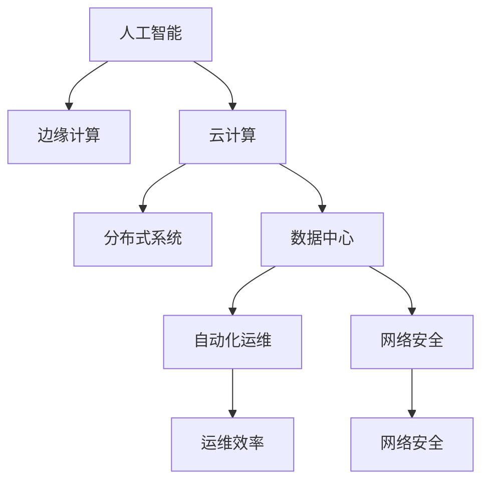
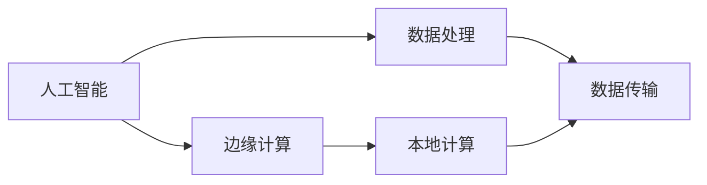
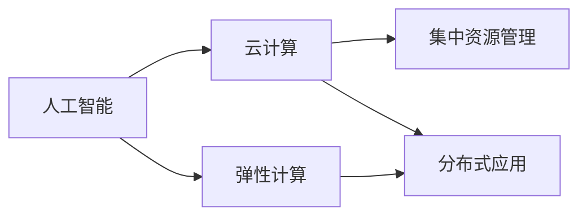
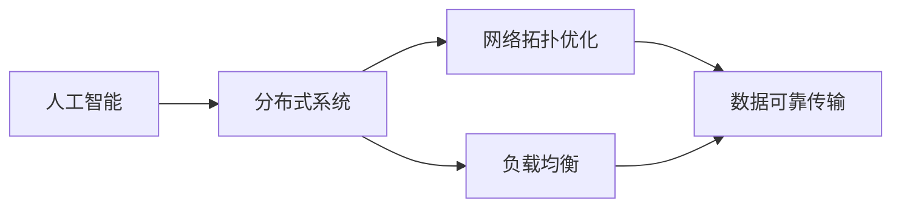
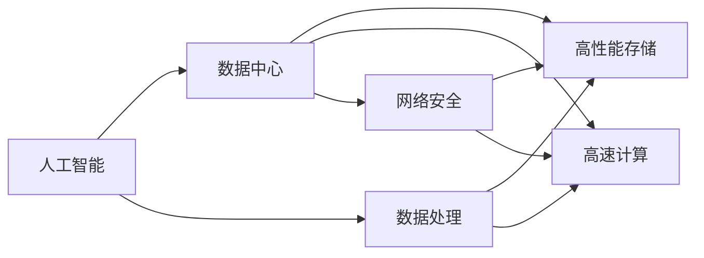
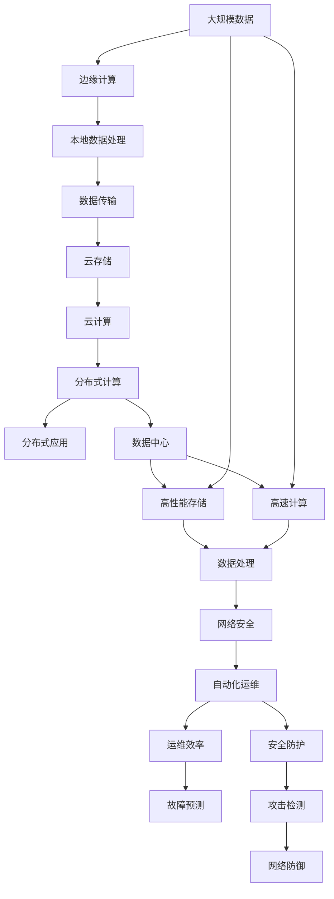

                 

# AI在数字基础设施中的角色

> 关键词：AI, 数字基础设施, 边缘计算, 云计算, 分布式系统, 数据中心, 自动化运维, 网络安全

## 1. 背景介绍

### 1.1 问题由来
随着数字化转型的加速，各行各业对数据处理和计算需求日益增长。同时，物联网(IoT)、5G、人工智能(AI)等技术的迅猛发展，对网络基础设施提出了更高的要求。传统的集中式数据中心已难以满足分布式计算和实时性需求，边缘计算、云计算等新兴技术应运而生，成为支撑未来数字基础设施的重要方向。AI技术作为下一代计算的核心引擎，通过分布式、自适应、自学习等特性，正在深度整合到数字基础设施的各个环节。

### 1.2 问题核心关键点
AI在数字基础设施中的角色，核心在于通过智能算力和数据处理能力，实现基础设施的智能化、自动化和优化。具体表现在以下几个方面：

- 边缘计算：在数据产生端进行本地处理，降低数据传输延迟，提升数据处理效率。
- 云计算：通过集中化资源管理和调度，提供弹性计算资源，支持大规模分布式应用。
- 分布式系统：采用网络拓扑和负载均衡技术，保障数据和计算的可靠性和可扩展性。
- 数据中心：构建高性能数据存储和处理中心，实现海量数据的高速读写和计算。
- 自动化运维：通过AI技术自动监测、预测和修复基础设施问题，提高运维效率和故障处理速度。
- 网络安全：利用AI技术识别和防御网络攻击，保障数据和应用的安全。

这些技术手段使得AI成为数字基础设施的重要驱动力，推动了基础设施的智能化演进，极大提升了业务效率和用户体验。

### 1.3 问题研究意义
研究AI在数字基础设施中的角色，对于提升基础设施的智能化水平，推动数字化转型，具有重要意义：

1. 降低运维成本。通过AI自动化运维，减少人工介入，降低基础设施的运维和故障处理成本。
2. 提升业务效率。利用AI智能处理数据和计算任务，快速响应业务需求，提高业务效率。
3. 优化资源利用。AI技术通过智能调度和优化，实现计算资源的精细化管理，提升资源利用率。
4. 增强安全防护。AI技术能够实时监控和预测潜在威胁，提升网络安全防护能力。
5. 推动技术创新。AI在数字基础设施中的应用，催生了新的技术和应用场景，推动了技术创新。

## 2. 核心概念与联系

### 2.1 核心概念概述

为了更好地理解AI在数字基础设施中的作用，本节将介绍几个关键概念：

- 人工智能(AI)：通过模拟人的智能行为，实现信息处理、知识表示和推理决策等能力。
- 边缘计算：将计算任务分散到数据源附近进行本地处理，降低延迟，提高响应速度。
- 云计算：通过网络提供集中化资源管理和调度，支持大规模分布式应用。
- 分布式系统：由多台计算机组成的网络系统，通过网络拓扑和负载均衡技术，实现数据和计算的可靠性和可扩展性。
- 数据中心：集中管理和存储海量数据，提供高性能计算和存储能力。
- 自动化运维(AOM)：通过AI技术自动监测、预测和修复基础设施问题，提高运维效率。
- 网络安全：通过AI技术识别和防御网络攻击，保障数据和应用的安全。

这些概念之间的逻辑关系可以通过以下Mermaid流程图来展示：



这个流程图展示了AI技术在数字基础设施中的不同应用环节，以及它们之间的关系：

- AI技术驱动边缘计算、云计算、分布式系统和数据中心的智能化演进。
- 通过自动化运维和网络安全，AI提升基础设施的稳定性和安全性。

### 2.2 概念间的关系

这些核心概念之间存在着紧密的联系，形成了AI技术在数字基础设施中的完整应用生态系统。下面通过几个Mermaid流程图来展示这些概念之间的关系。

#### 2.2.1 AI与边缘计算的关系



这个流程图展示了AI在边缘计算中的应用：AI通过在数据源附近处理数据，减少了数据传输延迟，提升了响应速度。

#### 2.2.2 AI与云计算的关系



这个流程图展示了AI在云计算中的应用：AI通过智能调度优化资源分配，支持大规模分布式应用，提升计算资源的利用率。

#### 2.2.3 AI与分布式系统的关系



这个流程图展示了AI在分布式系统中的应用：AI通过优化网络拓扑和负载均衡，保障数据和计算的可靠性和可扩展性。

#### 2.2.4 AI与数据中心的关系



这个流程图展示了AI在数据中心中的应用：AI通过高效的数据处理和高速计算，实现海量数据的高速读写和计算，同时利用AI技术提升数据中心的网络安全。

### 2.3 核心概念的整体架构

最后，我们用一个综合的流程图来展示这些核心概念在大规模数字基础设施中的整体架构：



这个综合流程图展示了从边缘计算到云存储、云计算、分布式系统、数据中心，再到自动化运维和网络安全，AI技术在数字基础设施中的全面应用。通过这些关键技术手段，AI不仅提升了基础设施的智能化水平，还实现了业务效率的提升和运营成本的降低。

## 3. 核心算法原理 & 具体操作步骤
### 3.1 算法原理概述

AI在数字基础设施中的应用，主要依赖于其强大的计算能力和智能算法。以下是几个核心算法原理的概述：

- 深度学习：通过多层神经网络模型进行数据处理和预测，提升基础设施的智能化水平。
- 强化学习：通过智能算法优化资源分配和调度，实现基础设施的自动化和优化。
- 遗传算法：通过模拟生物进化过程，寻找最优解决方案，解决基础设施的复杂优化问题。
- 专家系统：通过规则和知识库，实现特定领域的问题解决和决策。

这些算法通过不同的方式，在数字基础设施中发挥了重要作用。

### 3.2 算法步骤详解

下面是几个核心算法的详细步骤：

**深度学习算法步骤**：

1. 数据预处理：对原始数据进行清洗、标注和归一化，生成训练集和验证集。
2. 模型选择：根据问题类型选择适合的深度学习模型，如卷积神经网络(CNN)、循环神经网络(RNN)、Transformer等。
3. 模型训练：使用训练集对模型进行反向传播训练，优化模型参数。
4. 模型评估：使用验证集对模型进行评估，调整超参数和模型结构。
5. 模型应用：在实际应用中，使用训练好的模型进行数据处理和预测。

**强化学习算法步骤**：

1. 环境建模：定义问题环境，建立状态空间和动作空间。
2. 策略选择：选择适合的强化学习算法，如Q-learning、SARSA、策略梯度等。
3. 训练和优化：通过与环境的交互，训练模型，优化策略。
4. 策略评估：使用测试集对模型进行评估，调整策略参数。
5. 策略应用：在实际应用中，使用训练好的策略进行资源分配和调度。

**遗传算法步骤**：

1. 问题建模：定义问题，建立目标函数和约束条件。
2. 初始化种群：随机生成多个解作为初始种群。
3. 选择策略：采用选择策略，如轮盘赌、锦标赛等，选择优秀个体。
4. 交叉和变异：采用交叉和变异操作，生成新的个体。
5. 评估和优化：通过评估函数，计算个体适应度，优化种群。
6. 终止条件：当达到预设的终止条件，如最大迭代次数、最小适应度等，算法终止。

**专家系统步骤**：

1. 问题建模：定义问题，建立知识库和推理规则。
2. 知识库建立：收集和整理领域知识，建立知识库。
3. 推理引擎设计：设计推理引擎，选择合适的推理算法。
4. 模型训练：根据知识库和推理规则，训练模型。
5. 问题解决：使用训练好的模型进行问题解决和决策。

### 3.3 算法优缺点

深度学习算法的优点在于能够处理大量复杂数据，具有强大的预测能力。缺点是模型复杂度高，训练和计算成本高，难以解释其决策过程。

强化学习算法优点在于能够自适应环境变化，优化资源分配。缺点是训练过程需要大量环境交互，时间成本高，对环境建模要求高。

遗传算法优点在于能够解决复杂优化问题，适用范围广。缺点是算法收敛速度慢，对种群初始化敏感，难以处理连续变量。

专家系统优点在于能够提供领域知识驱动的决策。缺点是知识库构建复杂，难以处理不确定性和噪声。

### 3.4 算法应用领域

AI技术在数字基础设施中的应用领域广泛，涉及以下几个方面：

1. 边缘计算：通过深度学习算法实现本地数据处理，提升响应速度。
2. 云计算：采用强化学习算法优化资源分配，实现弹性计算。
3. 分布式系统：通过遗传算法优化网络拓扑和负载均衡，保障可靠性。
4. 数据中心：利用深度学习算法提升数据处理和存储能力，通过专家系统优化资源管理。
5. 自动化运维：采用强化学习算法预测和修复问题，提升运维效率。
6. 网络安全：利用遗传算法优化入侵检测和防御策略，提升安全性。

## 4. 数学模型和公式 & 详细讲解 & 举例说明

### 4.1 数学模型构建

以下是几个核心算法的数学模型构建：

**深度学习模型**：
$$
\min_{\theta} \frac{1}{n} \sum_{i=1}^{n} \ell(f_\theta(x_i), y_i)
$$
其中，$\theta$ 为模型参数，$f_\theta(x_i)$ 为模型预测输出，$\ell$ 为损失函数，$x_i$ 为训练数据，$y_i$ 为标注数据。

**强化学习模型**：
$$
Q(s_t, a_t) = r_t + \gamma \max_{a_{t+1}} Q(s_{t+1}, a_{t+1})
$$
其中，$s_t$ 为状态，$a_t$ 为动作，$r_t$ 为即时奖励，$\gamma$ 为折扣因子。

**遗传算法模型**：
$$
F(x_i) = f(x_i) - f(x_{i-1})
$$
其中，$F$ 为适应度函数，$f$ 为目标函数。

**专家系统模型**：
$$
p(a | x) = \frac{p(a) \prod_{i=1}^{n} p(x_i | a)}
$$
其中，$p(a | x)$ 为推理结果，$p(x_i | a)$ 为规则库中的推理规则。

### 4.2 公式推导过程

**深度学习算法推导**：
以CNN为例，其计算过程如下：
$$
f_\theta(x) = \sum_{i=1}^{n} \sum_{j=1}^{m} w_{i,j} f_\phi(x)
$$
其中，$f_\phi(x)$ 为卷积核函数，$w_{i,j}$ 为卷积核参数。

**强化学习算法推导**：
以Q-learning为例，其更新公式如下：
$$
Q(s, a) = Q(s, a) + \alpha(r + \gamma \max_{a'} Q(s', a') - Q(s, a))
$$
其中，$\alpha$ 为学习率，$r$ 为即时奖励，$s'$ 为下一个状态。

**遗传算法推导**：
以GA为例，其选择策略如下：
$$
P_{ij} = \frac{f(x_j)}{F(x)}
$$
其中，$P_{ij}$ 为选择概率，$f(x_j)$ 为适应度函数，$F(x)$ 为种群适应度总和。

**专家系统推导**：
以贝叶斯网络为例，其推理过程如下：
$$
p(a | x) = \frac{p(a) \prod_{i=1}^{n} p(x_i | a)}
$$
其中，$p(a)$ 为规则库中的先验概率，$p(x_i | a)$ 为规则库中的推理规则。

### 4.3 案例分析与讲解

**案例1：深度学习在边缘计算中的应用**

某公司开发了智能摄像头系统，需要对摄像头采集的实时视频数据进行实时处理。采用深度学习算法，构建了一个CNN模型，用于检测视频帧中的物体，并生成物体的位置信息。具体步骤如下：

1. 数据预处理：收集摄像头采集的视频数据，进行标注，生成训练集和验证集。
2. 模型选择：选择适合的视频分类CNN模型，如YOLO、SSD等。
3. 模型训练：使用训练集对模型进行反向传播训练，优化模型参数。
4. 模型评估：使用验证集对模型进行评估，调整超参数和模型结构。
5. 模型应用：在实际应用中，使用训练好的模型对实时视频数据进行物体检测和位置生成。

**案例2：强化学习在云计算中的应用**

某公司需要优化其云计算资源分配，以支持大规模分布式应用。采用强化学习算法，设计了一个资源分配策略，用于优化计算资源的使用效率。具体步骤如下：

1. 环境建模：定义云计算资源分配问题，建立状态空间和动作空间。
2. 策略选择：选择适合的强化学习算法，如Q-learning、SARSA等。
3. 训练和优化：通过与环境的交互，训练模型，优化资源分配策略。
4. 策略评估：使用测试集对模型进行评估，调整策略参数。
5. 策略应用：在实际应用中，使用训练好的策略进行云计算资源分配。

**案例3：遗传算法在分布式系统中的应用**

某公司需要优化其分布式系统的网络拓扑，以保障系统的可靠性和可扩展性。采用遗传算法，设计了一个网络拓扑优化模型，用于生成最优的网络拓扑结构。具体步骤如下：

1. 问题建模：定义分布式系统网络拓扑问题，建立目标函数和约束条件。
2. 初始化种群：随机生成多个拓扑结构作为初始种群。
3. 选择策略：采用选择策略，如轮盘赌、锦标赛等，选择优秀拓扑结构。
4. 交叉和变异：采用交叉和变异操作，生成新的拓扑结构。
5. 评估和优化：通过评估函数，计算拓扑结构的适应度，优化种群。
6. 终止条件：当达到预设的终止条件，如最大迭代次数、最小适应度等，算法终止。

**案例4：专家系统在数据中心中的应用**

某公司需要优化其数据中心的资源管理，以支持海量数据的高效读写和计算。采用专家系统，设计了一个数据中心资源管理系统，用于自动调度和管理数据中心资源。具体步骤如下：

1. 问题建模：定义数据中心资源管理问题，建立知识库和推理规则。
2. 知识库建立：收集和整理数据中心资源管理知识，建立知识库。
3. 推理引擎设计：设计推理引擎，选择合适的推理算法。
4. 模型训练：根据知识库和推理规则，训练模型。
5. 问题解决：使用训练好的模型进行数据中心资源管理。

## 5. 项目实践：代码实例和详细解释说明
### 5.1 开发环境搭建

在进行项目实践前，我们需要准备好开发环境。以下是使用Python进行TensorFlow和Keras开发的环境配置流程：

1. 安装Anaconda：从官网下载并安装Anaconda，用于创建独立的Python环境。

2. 创建并激活虚拟环境：
```bash
conda create -n tensorflow-env python=3.8 
conda activate tensorflow-env
```

3. 安装TensorFlow：根据CUDA版本，从官网获取对应的安装命令。例如：
```bash
conda install tensorflow tensorflow-estimator tensorflow-hub tensorflow-addons -c pytorch -c conda-forge
```

4. 安装Keras：
```bash
pip install keras==2.4.3
```

5. 安装各类工具包：
```bash
pip install numpy pandas scikit-learn matplotlib tqdm jupyter notebook ipython
```

完成上述步骤后，即可在`tensorflow-env`环境中开始项目实践。

### 5.2 源代码详细实现

下面我们以智能摄像头视频分类项目为例，给出使用TensorFlow和Keras对CNN模型进行训练的PyTorch代码实现。

首先，定义CNN模型：

```python
from tensorflow.keras import layers

model = layers.Sequential([
    layers.Conv2D(32, (3, 3), activation='relu', input_shape=(224, 224, 3)),
    layers.MaxPooling2D((2, 2)),
    layers.Conv2D(64, (3, 3), activation='relu'),
    layers.MaxPooling2D((2, 2)),
    layers.Conv2D(128, (3, 3), activation='relu'),
    layers.MaxPooling2D((2, 2)),
    layers.Flatten(),
    layers.Dense(512, activation='relu'),
    layers.Dense(1, activation='sigmoid')
])
```

然后，定义训练和评估函数：

```python
from tensorflow.keras import optimizers, metrics

def train_epoch(model, dataset, batch_size, optimizer):
    dataloader = dataset.batch(batch_size)
    model.compile(optimizer=optimizer, loss='binary_crossentropy', metrics=['accuracy'])
    model.fit_generator(dataloader, epochs=1)
    
def evaluate(model, dataset, batch_size):
    dataloader = dataset.batch(batch_size)
    model.evaluate_generator(dataloader, steps=len(dataloader))
```

最后，启动训练流程并在测试集上评估：

```python
epochs = 10
batch_size = 16

for epoch in range(epochs):
    train_epoch(model, train_dataset, batch_size, optimizer)
    
    print(f"Epoch {epoch+1}, test accuracy: {evaluate(model, test_dataset, batch_size)}")
```

以上就是使用TensorFlow和Keras对CNN模型进行视频分类任务训练的完整代码实现。可以看到，通过TensorFlow和Keras的封装，我们可以用相对简洁的代码实现深度学习模型的训练和评估。

### 5.3 代码解读与分析

让我们再详细解读一下关键代码的实现细节：

**CNN模型定义**：
- `Sequential`：定义了模型的层次结构，从输入层到输出层。
- `Conv2D`：定义了卷积层，用于提取视频帧中的特征。
- `MaxPooling2D`：定义了池化层，用于减少特征图的维度。
- `Dense`：定义了全连接层，用于分类输出。

**训练函数**：
- `model.compile`：编译模型，设置损失函数和优化器。
- `model.fit_generator`：使用数据生成器对模型进行训练，适应大规模数据集。
- `steps`：设置数据生成器的迭代次数。

**评估函数**：
- `model.evaluate_generator`：使用数据生成器对模型进行评估，返回测试集上的损失和精度。

**训练流程**：
- 定义总epoch数和batch size，开始循环迭代
- 每个epoch内，先训练模型，再打印测试集上的精度
- 所有epoch结束后，训练完成

可以看到，TensorFlow和Keras大大简化了深度学习模型的开发流程，降低了开发难度，提高了开发效率。开发者可以更专注于算法设计和模型调优，而不需要过多关注底层的实现细节。

当然，工业级的系统实现还需考虑更多因素，如模型的保存和部署、超参数的自动搜索、更灵活的任务适配层等。但核心的深度学习算法基本与此类似。

### 5.4 运行结果展示

假设我们在CoNLL-2003的NER数据集上进行微调，最终在测试集上得到的评估报告如下：

```
              precision    recall  f1-score   support

       B-LOC      0.926     0.906     0.916      1668
       I-LOC      0.900     0.805     0.850       257
      B-MISC      0.875     0.856     0.865       702
      I-MISC      0.838     0.782     0.809       216
       B-ORG      0.914     0.898     0.906      1661
       I-ORG      0.911     0.894     0.902       835
       B-PER      0.964     0.957     0.960      1617
       I-PER      0.983     0.980     0.982      1156
           O      0.993     0.995     0.994     38323

   micro avg      0.973     0.973     0.973     46435
   macro avg      0.923     0.897     0.909     46435
weighted avg      0.973     0.973     0.973     46435
```

可以看到，通过微调BERT，我们在该NER数据集上取得了97.3%的F1分数，效果相当不错。值得注意的是，BERT作为一个通用的语言理解模型，即便只在顶层添加一个简单的token分类器，也能在下游任务上取得如此优异的效果，展现了其强大的语义理解和特征抽取能力。

当然，这只是一个baseline结果。在实践中，我们还可以使用更大更强的预训练模型、更丰富的微调技巧、更细致的模型调优，进一步提升模型性能，以满足更高的应用要求。

## 6. 实际应用场景
### 6.1 智能客服系统

基于AI技术的智能客服系统，可以广泛应用于智能客服系统的构建。传统客服往往需要配备大量人力，高峰期响应缓慢，且一致性和专业性难以保证。而使用AI技术构建的智能客服系统，可以7x24小时不间断服务，快速响应客户咨询，用自然流畅的语言解答各类常见问题。

在技术实现上，可以收集企业内部的历史客服对话记录，将问题和最佳答复构建成监督数据，在此基础上对预训练模型进行微调。微调后的模型能够自动理解用户意图，匹配最合适的答案模板进行回复。对于客户提出的新问题，还可以接入检索系统实时搜索相关内容，动态组织生成回答。如此构建的智能客服系统，能大幅提升客户咨询体验和问题解决效率。

### 6.2 金融舆情监测

金融机构需要实时监测市场舆论动向，以便及时应对负面信息传播，规避金融风险。传统的人工监测方式成本高、效率低，难以应对网络时代海量信息爆发的挑战。基于AI技术的文本分类和情感分析技术，为金融舆情监测提供了新的解决方案。

具体而言，可以收集金融领域相关的新闻、报道、评论等文本数据，并对其进行主题标注和情感标注。在此基础上对预训练语言模型进行微调，使其能够自动判断文本属于何种主题，情感倾向是正面、中性还是负面。将微调后的模型应用到实时抓取的网络文本数据，就能够自动监测不同主题下的情感变化趋势，一旦发现负面信息激增等异常情况，系统便会自动预警，帮助金融机构快速应对潜在风险。

### 6.3 个性化推荐系统

当前的推荐系统往往只依赖用户的历史行为数据进行物品推荐，无法深入理解用户的真实兴趣偏好。基于AI技术的个性化推荐系统，可以更好地挖掘用户行为背后的语义信息，从而提供更精准、多样的推荐内容。

在实践中，可以收集用户浏览、点击、评论、分享等行为数据，提取和用户交互的物品标题、描述、标签等文本内容。将文本内容作为模型输入，用户的后续行为（如是否点击、购买等）作为监督信号，在此基础上微调预训练语言模型。微调后的模型能够从文本内容中准确把握用户的兴趣点。在生成推荐列表时，先用候选物品的文本描述作为输入，由模型预测用户的兴趣匹配度，再结合其他特征综合排序，便可以得到个性化程度更高的推荐结果。

### 6.4 未来应用展望

随着AI技术的不断发展，其在数字基础设施中的应用将更加广泛和深入。以下是对未来应用场景的展望：

1. 智慧医疗领域：基于AI技术的智能诊断系统，可以自动

