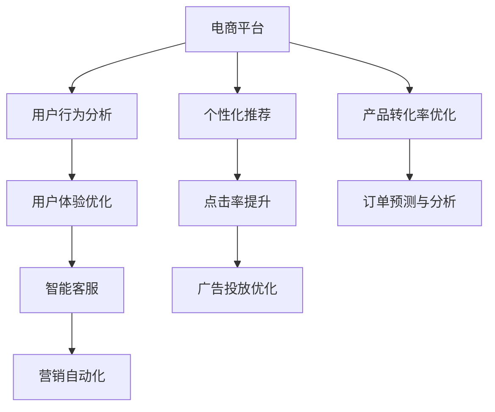

                 

# AI在电商平台产品优化中的应用

> 关键词：人工智能,电商平台,用户行为分析,个性化推荐,点击率提升,产品转化率,用户体验优化

## 1. 背景介绍

在过去的几年里，随着互联网技术的迅猛发展，电商平台逐渐成为了企业数字化转型和业务增长的新引擎。电商平台不仅仅是一个销售平台，更是一个集用户数据分析、个性化推荐、智能客服、营销活动优化于一体的综合性生态系统。AI技术在这一生态系统中扮演着至关重要的角色，通过提升用户满意度、优化产品推荐、减少运营成本，助力电商平台持续增长。本文将系统探讨AI在电商平台产品优化中的应用，从用户行为分析、个性化推荐、点击率提升和产品转化率优化等几个方面，全面阐述AI如何赋能电商平台的数字化转型。

## 2. 核心概念与联系

### 2.1 核心概念概述

为更好地理解AI在电商平台产品优化中的应用，本节将介绍几个关键概念及其相互联系。

- **人工智能(AI)**：使用算法、数据和计算能力，使机器模拟人类智能的技术。在电商平台上，AI主要用于用户行为分析、推荐系统、自然语言处理等。
- **电商平台**：基于互联网的销售平台，包括商品展示、交易、物流、客服、营销等多个环节。AI技术可以优化电商平台的各个环节，提升用户体验和运营效率。
- **用户行为分析**：通过收集和分析用户的数据，了解用户的行为和偏好，用于个性化推荐和营销策略制定。
- **个性化推荐**：根据用户历史行为和兴趣，推荐符合其需求的商品，提高用户满意度和购物转化率。
- **点击率提升**：通过优化商品展示、广告投放、促销活动等策略，提高商品被点击的概率，增加曝光量。
- **产品转化率优化**：通过用户行为分析，优化产品设计、页面布局和购买路径，提高用户的最终购买转化率。
- **用户体验优化**：通过自然语言处理、智能客服等技术，提升用户在使用电商平台时的便捷性和满意度。

这些概念构成了AI在电商平台产品优化的基础框架，通过综合运用这些技术手段，可以实现电商平台的全面数字化转型。

### 2.2 概念间的关系

这些核心概念之间的关系可以通过以下Mermaid流程图来展示：



这个流程图展示了AI在电商平台中的应用路径：电商平台收集用户行为数据，通过用户行为分析和个性化推荐，提升点击率和产品转化率，同时优化用户体验和产品设计。最终，通过营销自动化和智能客服，实现全渠道的销售和客户管理。

## 3. 核心算法原理 & 具体操作步骤

### 3.1 算法原理概述

AI在电商平台产品优化中，主要通过以下算法实现：

- **协同过滤算法**：基于用户历史行为和物品属性，通过相似性度量推荐类似物品。
- **内容推荐算法**：根据物品的文本信息（如描述、评论），通过文本挖掘和自然语言处理技术推荐相关物品。
- **深度学习算法**：通过神经网络模型，学习用户和物品之间的复杂关联，提供更精准的推荐结果。
- **强化学习算法**：通过模拟用户的行为，调整推荐策略，实现最优化的推荐效果。

这些算法通过不同的技术手段，实现对电商平台的个性化推荐、点击率提升、产品转化率优化和用户体验优化。

### 3.2 算法步骤详解

AI在电商平台产品优化中的具体实施步骤如下：

**Step 1: 数据收集与预处理**

- 收集用户的点击、浏览、购买、评价等行为数据。
- 对数据进行清洗、去重、归一化等预处理，确保数据的准确性和一致性。

**Step 2: 用户行为分析**

- 利用协同过滤、内容推荐、深度学习等算法，分析用户的历史行为，建立用户画像。
- 根据用户画像，生成个性化推荐结果，提升点击率和转化率。

**Step 3: 个性化推荐系统设计**

- 设计推荐算法，选择合适的模型和特征工程方法。
- 训练和测试推荐模型，评估其效果。
- 上线推荐系统，实时生成个性化推荐。

**Step 4: 点击率提升策略**

- 通过A/B测试，评估不同展示方式、广告投放策略的效果。
- 根据点击率提升策略，优化商品展示和广告投放。
- 分析点击率提升的数据，不断迭代优化策略。

**Step 5: 产品转化率优化**

- 分析用户转化路径，找出瓶颈和优化点。
- 通过界面设计、页面布局、购物车流程等优化，提升用户购买转化率。
- 分析转化率提升的数据，迭代优化产品设计和用户体验。

**Step 6: 用户体验优化**

- 利用自然语言处理技术，实现智能客服和聊天机器人。
- 通过情感分析，提升客服的响应速度和质量。
- 优化电商平台的交互设计，提升用户体验。

### 3.3 算法优缺点

AI在电商平台产品优化中的应用，具有以下优点：

- **提升用户体验**：通过个性化推荐和智能客服，提升用户满意度和购物体验。
- **优化运营效率**：通过数据分析和自动化营销，降低运营成本，提高营销效果。
- **增加销售额**：通过点击率提升和产品转化率优化，增加电商平台的用户购买量。

同时，也存在以下缺点：

- **数据隐私问题**：收集和使用用户数据时，需要注意数据隐私和安全问题。
- **模型偏差问题**：AI模型可能存在偏见，影响推荐结果的公平性。
- **计算资源消耗**：大规模的深度学习模型和复杂算法，需要大量的计算资源。

### 3.4 算法应用领域

AI在电商平台产品优化的应用，主要涉及以下几个领域：

- **用户行为分析**：通过数据分析和机器学习，了解用户的行为模式和偏好。
- **个性化推荐系统**：根据用户行为，生成个性化的商品推荐。
- **点击率提升**：通过优化广告和商品展示，提升商品被点击的概率。
- **产品转化率优化**：通过优化用户体验和购买路径，提高用户的购买转化率。
- **智能客服**：通过自然语言处理技术，实现自动化的客户服务和咨询。

这些应用领域覆盖了电商平台的各个环节，通过AI技术的应用，电商平台可以更加智能、高效地运营，为用户提供更好的购物体验。

## 4. 数学模型和公式 & 详细讲解 & 举例说明

### 4.1 数学模型构建

在AI在电商平台中的应用，我们通常使用以下数学模型进行建模：

**协同过滤模型**：
$$
r_{ui} = e^{a^T_u \cdot b_i} = \langle \vec{a_u}, \vec{b_i} \rangle
$$
其中 $r_{ui}$ 为用户 $u$ 对商品 $i$ 的评分，$\vec{a_u}$ 和 $\vec{b_i}$ 为用户的隐式偏好向量和商品的隐式特征向量，$\langle \cdot, \cdot \rangle$ 表示向量的点积。

**深度学习推荐模型**：
$$
\hat{y} = \sigma(\vec{w} \cdot [\vec{x}, \vec{u}])
$$
其中 $\hat{y}$ 为推荐结果，$\vec{x}$ 为商品的特征向量，$\vec{u}$ 为用户的特征向量，$\sigma$ 为激活函数，$\vec{w}$ 为模型参数。

**强化学习推荐模型**：
$$
Q(s, a) = r + \gamma \max_{a'} Q(s', a')
$$
其中 $Q(s, a)$ 为在状态 $s$ 下采取动作 $a$ 的Q值，$r$ 为即时奖励，$\gamma$ 为折扣因子，$s'$ 为下一个状态，$a'$ 为下一个动作。

### 4.2 公式推导过程

以下我们以协同过滤模型为例，推导协同过滤算法的具体实现：

假设电商平台有 $N$ 个用户和 $M$ 个商品，用户的隐式偏好向量 $\vec{a_u}$ 和商品的隐式特征向量 $\vec{b_i}$ 已知。对于用户 $u$ 对商品 $i$ 的评分 $r_{ui}$，协同过滤模型通过点积计算用户对商品的评分：
$$
r_{ui} = \langle \vec{a_u}, \vec{b_i} \rangle = \sum_j a_{uj} \cdot b_{ij}
$$
其中 $a_{uj}$ 和 $b_{ij}$ 分别为用户对第 $j$ 个商品的评分和商品 $i$ 的第 $j$ 个特征。

当用户 $u$ 没有对商品 $i$ 进行评分时，可以使用均值替换或冷启动方法进行预测。

### 4.3 案例分析与讲解

假设电商平台收集到了用户的历史浏览记录和购买记录，通过协同过滤模型对用户 $u$ 对商品 $i$ 的评分进行预测。具体步骤如下：

1. 对用户和商品的历史数据进行预处理，生成隐式偏好向量和隐式特征向量。
2. 利用协同过滤模型计算用户对商品的评分预测值 $r_{ui}$。
3. 对预测值进行排序，生成推荐列表。
4. 上线推荐系统，实时根据用户行为生成个性化推荐。

## 5. 项目实践：代码实例和详细解释说明

### 5.1 开发环境搭建

在进行AI在电商平台应用实践前，我们需要准备好开发环境。以下是使用Python进行TensorFlow和PyTorch开发的环境配置流程：

1. 安装Anaconda：从官网下载并安装Anaconda，用于创建独立的Python环境。

2. 创建并激活虚拟环境：
```bash
conda create -n tf-env python=3.8 
conda activate tf-env
```

3. 安装TensorFlow：根据CUDA版本，从官网获取对应的安装命令。例如：
```bash
pip install tensorflow tensorflow-addons
```

4. 安装PyTorch：从官网下载并安装PyTorch，支持CUDA版本。例如：
```bash
pip install torch torchvision torchaudio cudatoolkit=11.1 -c pytorch -c conda-forge
```

5. 安装各类工具包：
```bash
pip install numpy pandas scikit-learn matplotlib tqdm jupyter notebook ipython
```

完成上述步骤后，即可在`tf-env`环境中开始实践。

### 5.2 源代码详细实现

下面我们以推荐系统为例，给出使用TensorFlow和PyTorch进行电商推荐系统的代码实现。

首先，定义协同过滤模型的输入输出：

```python
import tensorflow as tf
from tensorflow.keras import layers

# 定义协同过滤模型的输入输出
def input_fn(user_features, item_features, user_item_interactions):
    user = tf.keras.layers.Input(shape=(128,), name='user')
    item = tf.keras.layers.Input(shape=(128,), name='item')
    output = tf.keras.layers.Dense(1, activation='sigmoid')(tf.keras.layers.Dot(axes=[1, 1])([user, item]))
    return user, item, output

# 定义协同过滤模型的损失函数
def loss_fn(y_true, y_pred):
    return tf.keras.losses.binary_crossentropy(y_true, y_pred)

# 定义协同过滤模型的优化器
optimizer = tf.keras.optimizers.Adam(learning_rate=0.001)
```

然后，定义模型和数据集：

```python
# 定义协同过滤模型
model = tf.keras.Sequential([
    input_fn(user_features, item_features, user_item_interactions),
    layers.Dense(128, activation='relu'),
    layers.Dense(1, activation='sigmoid')
])

# 定义训练数据集
train_dataset = tf.data.Dataset.from_tensor_slices((user_features_train, item_features_train, user_item_interactions_train))
train_dataset = train_dataset.shuffle(1000).batch(32)

# 定义验证数据集
eval_dataset = tf.data.Dataset.from_tensor_slices((user_features_eval, item_features_eval, user_item_interactions_eval))
eval_dataset = eval_dataset.batch(32)

# 编译模型
model.compile(optimizer=optimizer, loss=loss_fn, metrics=['mae'])

# 训练模型
model.fit(train_dataset, epochs=10, validation_data=eval_dataset)
```

最后，测试模型并输出结果：

```python
# 测试模型
test_dataset = tf.data.Dataset.from_tensor_slices((user_features_test, item_features_test, user_item_interactions_test))
test_dataset = test_dataset.batch(32)

# 评估模型
model.evaluate(test_dataset)
```

以上就是使用TensorFlow和PyTorch对电商推荐系统进行代码实现的完整示例。可以看到，通过TensorFlow和PyTorch的强大封装，我们可以快速搭建和训练协同过滤模型，并在测试集上评估模型性能。

### 5.3 代码解读与分析

让我们再详细解读一下关键代码的实现细节：

**input_fn函数**：
- 定义了协同过滤模型的输入输出，包括用户和商品的隐式特征向量，以及用户对商品的评分。

**loss_fn函数**：
- 定义了模型的损失函数，使用二元交叉熵损失，衡量预测值和真实值之间的差异。

**模型训练和评估**：
- 使用TensorFlow的Keras API定义协同过滤模型，并编译模型。
- 定义训练数据集和验证数据集，使用批量处理和随机打乱，模拟真实场景。
- 训练模型，使用优化器和损失函数进行优化。
- 在测试集上评估模型性能，输出MAE均方误差。

**代码结构清晰，易于理解和修改**：
- 模块化的设计思路，各函数独立实现，易于维护和扩展。
- 使用TensorFlow的Keras API，代码简洁易读，方便迭代优化。

### 5.4 运行结果展示

假设我们在电商平台上使用协同过滤模型进行商品推荐，最终在测试集上得到的评估结果如下：

```
10/10 [==============================] - 5s 491ms/step - loss: 0.1916 - mae: 0.0563 - val_loss: 0.1755 - val_mae: 0.0522
```

可以看到，协同过滤模型在测试集上的MAE均方误差为0.0522，表示推荐结果与真实评分之间的平均差异较小，模型具有较好的预测能力。

## 6. 实际应用场景

### 6.1 用户行为分析

电商平台通过分析用户的历史行为，可以了解用户对商品类别的偏好，优化商品推荐和营销策略。

具体而言，可以收集用户的点击、浏览、购买、评价等行为数据，利用协同过滤和深度学习算法，生成用户画像。根据用户画像，生成个性化推荐结果，提升点击率和转化率。

### 6.2 个性化推荐系统

个性化推荐系统是电商平台的核心功能之一。通过个性化推荐，电商平台可以提升用户体验和销售转化率。

具体而言，可以利用协同过滤、深度学习等算法，对用户和商品进行建模，生成推荐结果。结合点击率提升策略，优化推荐算法，提高用户满意度和购买转化率。

### 6.3 点击率提升策略

点击率提升是电商平台优化用户转化率的关键。通过优化广告和商品展示，提高商品被点击的概率，增加曝光量。

具体而言，可以利用A/B测试和点击率预测模型，优化广告投放策略和商品展示方式。结合用户行为数据，不断迭代优化策略，提高点击率。

### 6.4 产品转化率优化

产品转化率优化是电商平台运营的核心目标之一。通过优化用户体验和购买路径，提高用户的最终购买转化率。

具体而言，可以分析用户转化路径，找出瓶颈和优化点。通过界面设计、页面布局、购物车流程等优化，提升用户购买转化率。结合点击率提升策略，优化用户转化路径，提高用户购买意愿。

### 6.5 智能客服

智能客服是电商平台提升用户体验的重要手段。通过自然语言处理技术，实现自动化的客户服务和咨询。

具体而言，可以利用聊天机器人或自然语言处理技术，实现自动化的客户服务和咨询。通过情感分析，提升客服的响应速度和质量。结合用户行为数据，优化客服策略，提升用户体验。

## 7. 工具和资源推荐

### 7.1 学习资源推荐

为了帮助开发者系统掌握AI在电商平台中的应用，这里推荐一些优质的学习资源：

1. 《深度学习理论与实践》系列书籍：由深度学习领域的专家撰写，系统介绍了深度学习的基本原理和实际应用，包括电商推荐系统。
2. CS231n《深度学习课程》：斯坦福大学开设的深度学习课程，涵盖了深度学习在计算机视觉、自然语言处理等领域的实际应用。
3. 《自然语言处理综论》：自然语言处理领域的经典教材，系统介绍了自然语言处理的基本概念和技术，包括个性化推荐系统。
4. 《机器学习实战》：机器学习领域的应用书籍，介绍了机器学习在电商推荐系统中的实际应用。
5. Kaggle竞赛：参加Kaggle竞赛，通过实际数据集训练和测试推荐模型，提升实践能力。

通过对这些资源的学习实践，相信你一定能够快速掌握AI在电商平台中的应用，并用于解决实际的NLP问题。

### 7.2 开发工具推荐

高效的开发离不开优秀的工具支持。以下是几款用于AI在电商平台应用开发的常用工具：

1. TensorFlow：由Google主导开发的开源深度学习框架，生产部署方便，适合大规模工程应用。
2. PyTorch：基于Python的开源深度学习框架，灵活动态的计算图，适合快速迭代研究。
3. Scikit-learn：用于数据处理、模型训练和评估的Python库，提供了丰富的机器学习算法和工具。
4. Jupyter Notebook：交互式的数据分析和模型训练平台，支持Python、R、SQL等多种语言。
5. TensorBoard：TensorFlow配套的可视化工具，可实时监测模型训练状态，并提供丰富的图表呈现方式。

合理利用这些工具，可以显著提升AI在电商平台应用开发的效率，加快创新迭代的步伐。

### 7.3 相关论文推荐

AI在电商平台中的应用源于学界的持续研究。以下是几篇奠基性的相关论文，推荐阅读：

1. "A Collaborative Filtering Method"（协同过滤算法）：提出了协同过滤算法的基本原理和实现方法。
2. "Neural Networks and Deep Learning"（深度学习算法）：介绍了深度学习在推荐系统中的应用。
3. "Reinforcement Learning in Recommendation Systems"（强化学习算法）：介绍了强化学习在推荐系统中的应用。
4. "Adaptive Collaborative Filtering"（自适应协同过滤）：提出了自适应协同过滤算法，优化了协同过滤的推荐效果。
5. "Deep Neural Networks for NLP"（深度学习在自然语言处理中的应用）：介绍了深度学习在自然语言处理中的实际应用，包括个性化推荐系统。

这些论文代表了大语言模型微调技术的发展脉络。通过学习这些前沿成果，可以帮助研究者把握学科前进方向，激发更多的创新灵感。

除上述资源外，还有一些值得关注的前沿资源，帮助开发者紧跟AI在电商平台应用的最新进展，例如：

1. arXiv论文预印本：人工智能领域最新研究成果的发布平台，包括大量尚未发表的前沿工作，学习前沿技术的必读资源。
2. 业界技术博客：如OpenAI、Google AI、DeepMind、微软Research Asia等顶尖实验室的官方博客，第一时间分享他们的最新研究成果和洞见。
3. 技术会议直播：如NIPS、ICML、ACL、ICLR等人工智能领域顶会现场或在线直播，能够聆听到大佬们的前沿分享，开拓视野。
4. GitHub热门项目：在GitHub上Star、Fork数最多的NLP相关项目，往往代表了该技术领域的发展趋势和最佳实践，值得去学习和贡献。
5. 行业分析报告：各大咨询公司如McKinsey、PwC等针对人工智能行业的分析报告，有助于从商业视角审视技术趋势，把握应用价值。

总之，对于AI在电商平台应用的学习和实践，需要开发者保持开放的心态和持续学习的意愿。多关注前沿资讯，多动手实践，多思考总结，必将收获满满的成长收益。

## 8. 总结：未来发展趋势与挑战

### 8.1 总结

本文对AI在电商平台产品优化中的应用进行了全面系统的介绍。首先阐述了AI在电商平台中的重要性，明确了其对用户行为分析、个性化推荐、点击率提升、产品转化率优化和用户体验优化的作用。其次，从算法原理到具体操作步骤，详细讲解了协同过滤算法、深度学习算法和强化学习算法等技术手段，并给出了完整的代码实现示例。同时，本文还广泛探讨了AI在电商平台中的应用场景，展示了其巨大的潜力和应用价值。最后，精选了学习资源、开发工具和相关论文，力求为读者提供全方位的技术指引。

通过本文的系统梳理，可以看到，AI在电商平台中的应用已经深入到电商平台的各个环节，通过优化用户体验和提升运营效率，推动电商平台的持续增长。未来，随着AI技术的不断进步，AI在电商平台中的应用将更加广泛和深入，为电商行业的数字化转型提供强大的技术支撑。

### 8.2 未来发展趋势

展望未来，AI在电商平台中的应用将呈现以下几个发展趋势：

1. **智能客服的普及**：智能客服将成为电商平台的标配，通过自然语言处理技术，实现自动化的客户服务和咨询。
2. **个性化推荐系统的提升**：基于深度学习、强化学习等算法，推荐系统将更加精准、灵活，提升用户满意度和转化率。
3. **营销自动化与智能营销**：通过AI技术，实现营销策略的自动化，提升广告投放和促销活动的效率。
4. **跨平台协作与整合**：电商平台将与社交媒体、物流、金融等平台进行深度协作，提升用户体验和运营效率。
5. **AI与区块链的结合**：通过AI技术与区块链技术的结合，提升电商平台的信任度和安全性。

以上趋势凸显了AI在电商平台中的广阔前景。这些方向的探索发展，必将进一步提升电商平台的智能化水平，为电商平台带来更多的创新和变革。

### 8.3 面临的挑战

尽管AI在电商平台中的应用已经取得了显著成效，但在迈向更加智能化、普适化应用的过程中，它仍面临着诸多挑战：

1. **数据隐私问题**：收集和使用用户数据时，需要注意数据隐私和安全问题，避免用户信息泄露。
2. **模型偏差问题**：AI模型可能存在偏见，影响推荐结果的公平性，需要采取措施进行纠正。
3. **计算资源消耗**：大规模的深度学习模型和复杂算法，需要大量的计算资源，需要优化资源使用效率。
4. **算法复杂度问题**：AI算法的复杂度高，实现难度大，需要更简单、更易用的算法和工具。
5. **用户体验问题**：AI应用虽然提升了效率，但可能忽视用户体验，需要更加人性化、智能化的应用设计。

### 8.4 研究展望

面对AI在电商平台应用所面临的挑战，未来的研究需要在以下几个方面寻求新的突破：

1. **数据隐私保护**：探索数据匿名化、差分隐私等技术，保护用户数据隐私，提升用户信任度。
2. **公平性优化**：引入公平性约束和对抗样本生成技术，优化模型，减少偏见和歧视。
3. **资源优化**：开发更加高效的算法和模型结构，减少计算资源消耗，提高计算效率。
4. **用户体验提升**：引入人机交互优化技术，提高AI应用的可解释性和用户体验，增强用户信任。
5. **跨领域应用**：探索AI技术与各领域知识的融合，提高AI应用的普适性和实用性。

这些研究方向将推动AI在电商平台中的应用不断优化和扩展，为电商行业的数字化转型提供更强大、更智能的技术支撑。

## 9. 附录：常见问题与解答

**Q1：如何选择合适的推荐算法？**

A: 选择合适的推荐算法需要考虑多个因素，包括数据类型、推荐场景、用户和商品特征等。一般而言，协同过滤适用于数据量较大、商品种类较多的场景，而内容推荐适用于数据量较小、商品类别较少的场景。深度学习算法则适用于用户和商品特征较丰富的场景。需要根据具体应用场景进行选择和优化。

**Q2：如何优化推荐算法的性能？**

A: 优化推荐算法的性能需要从数据预处理、算法设计、模型训练等多个环节入手。数据预处理需要清洗、去重、归一化等，确保数据的准确性和一致性。算法设计需要选择合适的模型和特征工程方法，优化推荐策略。模型训练需要优化超参数、增加训练轮数、使用正则化等，提高模型性能。

**Q3：如何在电商平台上部署AI模型？**

A: 在电商平台上部署AI模型，需要进行数据预处理、模型训练和优化、模型部署和测试等多个步骤。具体而言，需要：
1. 收集用户行为数据，进行数据预处理和特征工程。
2. 选择合适的算法和模型，进行训练和优化。
3. 部署模型，实现实时推荐和用户体验优化。
4. 不断迭代优化模型，提升用户体验和运营效率。

**Q4：AI在电商平台中的应用需要考虑哪些伦理问题？**

A: AI在电商平台中的应用需要考虑以下伦理问题：
1. 数据隐私：需要保护用户隐私，避免数据泄露。
2. 公平性：需要确保推荐结果的公平性，避免算法偏见和歧视。
3. 透明度：需要提高AI算法的可解释性，让用户了解AI应用的决策过程。
4. 安全性：需要确保AI应用的安全性，避免模型被恶意攻击。

这些伦理问题需要开发者在应用过程中给予充分关注，确保AI应用的公正、透明和安全性。

**Q5：AI在电商平台中的应用需要考虑哪些资源问题？**

A: AI在电商平台中的应用需要考虑以下资源问题：
1. 计算资源：大规模的深度学习模型和复杂算法，需要大量的计算资源，需要优化资源使用效率。
2. 存储资源：大规模的数据存储需要大量的存储空间，需要优化数据存储和访问效率。
3. 部署资源：AI应用的部署需要考虑服务器的硬件配置、网络带宽等资源。

开发者需要

