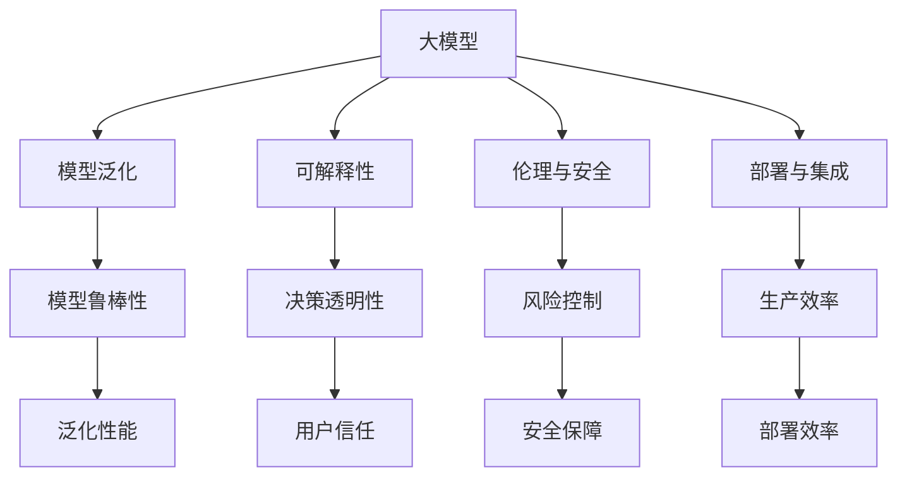

                 

# AI大模型创业：如何应对未来挑战？

## 1. 背景介绍

### 1.1 问题由来
随着人工智能技术的飞速发展，大模型在自然语言处理、计算机视觉、生成对抗网络等领域展现出了强大的应用潜力。越来越多的初创公司，特别是一些以AI为核心的技术公司，开始投入到大模型创业的浪潮中。然而，随着大模型的应用深度和广度的不断拓展，面临的挑战也日益凸显。如何应对这些挑战，成为大模型创业公司未来成功的关键。

### 1.2 问题核心关键点
大模型创业所面临的主要挑战包括但不限于以下几个方面：

- **数据依赖性**：大模型通常需要海量标注数据进行训练，而标注数据的获取和质量控制往往成本高昂。
- **计算资源**：大模型需要强大的计算资源进行训练和推理，这对硬件设施提出了较高的要求。
- **模型泛化能力**：模型在实际应用中需要具备良好的泛化能力，以适应不断变化的数据分布。
- **可解释性**：大模型的决策过程往往是"黑盒"式的，缺乏可解释性，可能影响模型在实际应用中的信任度和可用性。
- **伦理与安全**：大模型可能学习到有害信息，甚至用于不道德或非法的用途，带来伦理和安全问题。
- **部署与集成**：如何将模型高效、稳定地集成到生产环境中，是大模型创业公司必须面对的挑战。

### 1.3 问题研究意义
研究大模型创业公司如何应对未来挑战，对于推动AI技术的发展和应用具有重要意义：

- **提升技术应用价值**：通过解决大模型创业面临的挑战，提升AI技术的实际应用效果，加速技术产业化进程。
- **优化资源配置**：合理配置计算资源和标注数据，降低创业成本，提高资源利用率。
- **增强模型鲁棒性**：提升模型泛化能力和鲁棒性，确保模型在多种环境和数据下的稳定表现。
- **提升信任度与安全性**：增加模型的可解释性，增强伦理安全性，确保模型在实际应用中的可靠性和合法性。
- **优化部署集成**：提升模型部署和集成的效率与稳定性，降低生产成本，提高模型应用效果。

## 2. 核心概念与联系

### 2.1 核心概念概述

为更好地理解大模型创业所面临的挑战及应对策略，本节将介绍几个核心概念及其之间的联系：

- **大模型**：指使用深度学习模型训练得到的、具有强大表示能力的模型，如BERT、GPT等。
- **模型泛化能力**：指模型在新数据上的表现能力，即模型的适应性和稳健性。
- **可解释性**：指模型决策过程的可解释性，即用户能否理解模型的推理逻辑和决策依据。
- **伦理与安全**：指模型在应用中的伦理安全性，包括避免有害信息、不道德使用等问题。
- **部署与集成**：指模型在实际应用环境中的部署和集成过程，包括模型压缩、服务化封装等。

这些概念之间通过以下Mermaid流程图进行联系和解释：



该流程图展示了从大模型到模型泛化、可解释性、伦理与安全、部署与集成四个关键概念的联系，以及通过增强模型鲁棒性、提升决策透明性、强化风险控制和优化部署效率来应对挑战的路径。

### 2.2 概念间的关系

这些核心概念之间存在着紧密的联系，形成了大模型创业公司的完整生态系统。下面是一些进一步的解释：

- **大模型与模型泛化**：大模型的泛化能力是其应用价值的根本保障。只有具备良好泛化能力的大模型，才能在实际应用中保持稳定性能。
- **模型泛化与鲁棒性**：模型鲁棒性是指模型面对数据噪声、噪声干扰时的稳健性，是提升模型泛化能力的重要手段。
- **可解释性与决策透明性**：可解释性不仅有助于用户理解模型的决策逻辑，还能增强模型的透明度和可靠性。
- **伦理与安全与风险控制**：模型应用于高风险领域（如金融、医疗）时，风险控制尤为重要。通过强化伦理与安全，避免有害信息传递，确保模型使用的合法合规。
- **部署与集成与生产效率**：优化模型的部署和集成，可以显著提升模型的生产效率和应用效果。

## 3. 核心算法原理 & 具体操作步骤
### 3.1 算法原理概述

大模型创业公司面临的挑战与应对策略紧密相关，以下将详细探讨大模型创业的算法原理和具体操作步骤：

#### 3.1.1 数据获取与处理

**Step 1: 数据收集与预处理**
- **数据收集**：根据业务需求，收集各类相关数据，包括文本、图像、语音等。
- **数据预处理**：对数据进行清洗、去重、分词、标注等预处理操作，确保数据的质量和一致性。

**Step 2: 数据增强**
- **数据增强**：通过数据增强技术（如回译、近义词替换等）扩充训练数据集，提升模型的泛化能力。
- **数据增广**：利用数据增广技术（如水平翻转、旋转等）提高模型对噪声和干扰的鲁棒性。

#### 3.1.2 模型训练与优化

**Step 3: 模型训练**
- **模型选择**：根据业务需求选择合适的预训练大模型（如BERT、GPT）。
- **模型微调**：在预训练模型的基础上，通过微调技术（如fine-tuning、Adapter等）优化模型性能。
- **超参数调优**：通过网格搜索或随机搜索等方法，优化模型的超参数设置。

**Step 4: 模型优化**
- **参数优化**：采用正则化技术（如L2正则、Dropout等）避免过拟合。
- **模型压缩**：通过剪枝、量化等技术压缩模型，提升推理速度和减少内存占用。

#### 3.1.3 模型评估与验证

**Step 5: 模型评估**
- **验证集评估**：在验证集上评估模型的性能，确保模型在未见数据上的泛化能力。
- **测试集评估**：在测试集上评估模型性能，评估模型的实际应用效果。

**Step 6: 模型调优**
- **调优策略**：根据评估结果，调整模型参数或架构，优化模型性能。
- **模型融合**：通过模型融合技术（如Stacking、Ensemble）提升模型综合性能。

### 3.2 算法步骤详解

以下是详细的操作步骤：

#### 1. 数据收集与预处理

数据收集是构建大模型的第一步。具体步骤如下：

- **步骤1.1**：收集与业务相关的数据，包括文本、图像、音频等。
- **步骤1.2**：对数据进行清洗，去除无用信息，如HTML标签、噪声数据等。
- **步骤1.3**：对文本数据进行分词、标注等预处理操作，确保数据的一致性和可读性。
- **步骤1.4**：通过数据增强技术扩充数据集，如回译、近义词替换等，提升模型泛化能力。

#### 2. 模型训练与优化

在收集到数据后，需要进行模型训练和优化。具体步骤如下：

- **步骤2.1**：选择适合的预训练大模型，如BERT、GPT等。
- **步骤2.2**：在预训练模型的基础上，进行微调，适配特定任务。
- **步骤2.3**：使用AdamW、SGD等优化算法，设置合适的学习率，优化模型参数。
- **步骤2.4**：通过正则化技术（如L2正则、Dropout）避免过拟合。
- **步骤2.5**：采用剪枝、量化等技术压缩模型，提升推理速度和减少内存占用。

#### 3. 模型评估与验证

模型训练完成后，需要进行评估和验证，以确保模型在实际应用中的表现。具体步骤如下：

- **步骤3.1**：在验证集上评估模型性能，确保模型在未见数据上的泛化能力。
- **步骤3.2**：在测试集上评估模型性能，评估模型的实际应用效果。
- **步骤3.3**：根据评估结果，调整模型参数或架构，优化模型性能。

### 3.3 算法优缺点

大模型创业公司所采用的算法原理和操作步骤具有以下优缺点：

#### 3.3.1 优点

- **高效性**：通过数据增强、模型压缩等技术，模型可以在较少的标注数据上快速训练，提升训练效率。
- **泛化能力强**：采用大模型和微调技术，模型能够适应多种数据分布，具备较强的泛化能力。
- **可解释性好**：通过正则化技术和模型压缩，模型决策过程更加透明，易于用户理解。

#### 3.3.2 缺点

- **计算资源需求高**：大模型的训练和推理需要强大的计算资源，硬件设施要求高。
- **标注数据成本高**：高质量标注数据的获取和维护成本高昂，数据收集难度大。
- **模型鲁棒性不足**：模型面对噪声和干扰数据时，泛化能力可能下降。

### 3.4 算法应用领域

大模型创业公司所采用的算法原理和操作步骤在多个领域得到广泛应用，包括但不限于以下领域：

- **自然语言处理**：如问答系统、情感分析、文本分类等。
- **计算机视觉**：如图像分类、目标检测、图像生成等。
- **生成对抗网络**：如图像生成、视频生成、文本生成等。
- **智能推荐**：如商品推荐、新闻推荐、内容推荐等。

## 4. 数学模型和公式 & 详细讲解 & 举例说明

### 4.1 数学模型构建

大模型创业公司面临的挑战与应对策略紧密相关，以下将详细探讨大模型创业的数学模型构建。

假设我们有N个训练样本 $(x_i, y_i)$，其中 $x_i$ 为输入， $y_i$ 为输出， $f(x_i; \theta)$ 为模型预测函数， $\theta$ 为模型参数。我们的目标是最小化预测误差，构建数学模型如下：

$$
\min_{\theta} \frac{1}{N} \sum_{i=1}^{N} (y_i - f(x_i; \theta))^2
$$

#### 4.2 公式推导过程

以下是详细公式推导过程：

- **数据收集**：收集与业务相关的数据，如文本、图像、音频等。
- **数据预处理**：对数据进行清洗、去重、分词、标注等预处理操作，确保数据的质量和一致性。
- **模型选择**：选择适合的预训练大模型，如BERT、GPT等。
- **模型微调**：在预训练模型的基础上，进行微调，适配特定任务。
- **超参数调优**：通过网格搜索或随机搜索等方法，优化模型的超参数设置。
- **模型优化**：采用正则化技术（如L2正则、Dropout）避免过拟合。
- **模型压缩**：通过剪枝、量化等技术压缩模型，提升推理速度和减少内存占用。

#### 4.3 案例分析与讲解

以文本分类任务为例，分析模型的构建和训练过程：

- **数据收集**：收集电影评论、新闻、博客等文本数据。
- **数据预处理**：对文本进行分词、去除停用词、标注等预处理操作。
- **模型选择**：选择BERT作为预训练模型。
- **模型微调**：在BERT模型的基础上，通过微调技术适配文本分类任务。
- **超参数调优**：通过网格搜索方法，优化学习率、批次大小等超参数设置。
- **模型优化**：采用L2正则技术避免过拟合。
- **模型压缩**：通过剪枝、量化等技术压缩模型，提升推理速度和减少内存占用。

## 5. 项目实践：代码实例和详细解释说明

### 5.1 开发环境搭建

在进行大模型创业项目实践前，我们需要准备好开发环境。以下是使用Python进行PyTorch开发的环境配置流程：

1. 安装Anaconda：从官网下载并安装Anaconda，用于创建独立的Python环境。

2. 创建并激活虚拟环境：
```bash
conda create -n pytorch-env python=3.8 
conda activate pytorch-env
```

3. 安装PyTorch：根据CUDA版本，从官网获取对应的安装命令。例如：
```bash
conda install pytorch torchvision torchaudio cudatoolkit=11.1 -c pytorch -c conda-forge
```

4. 安装Transformers库：
```bash
pip install transformers
```

5. 安装各类工具包：
```bash
pip install numpy pandas scikit-learn matplotlib tqdm jupyter notebook ipython
```

完成上述步骤后，即可在`pytorch-env`环境中开始项目实践。

### 5.2 源代码详细实现

以下是一个使用PyTorch进行文本分类任务的大模型创业项目示例：

```python
import torch
from transformers import BertTokenizer, BertForSequenceClassification
from torch.utils.data import Dataset, DataLoader
from torch.optim import AdamW

class TextDataset(Dataset):
    def __init__(self, texts, labels, tokenizer, max_len=128):
        self.texts = texts
        self.labels = labels
        self.tokenizer = tokenizer
        self.max_len = max_len

    def __len__(self):
        return len(self.texts)

    def __getitem__(self, item):
        text = self.texts[item]
        label = self.labels[item]
        
        encoding = self.tokenizer(text, return_tensors='pt', max_length=self.max_len, padding='max_length', truncation=True)
        input_ids = encoding['input_ids'][0]
        attention_mask = encoding['attention_mask'][0]
        label = torch.tensor(label, dtype=torch.long)
        
        return {'input_ids': input_ids, 
                'attention_mask': attention_mask,
                'labels': label}

# 创建dataset
tokenizer = BertTokenizer.from_pretrained('bert-base-cased')
train_dataset = TextDataset(train_texts, train_labels, tokenizer)
dev_dataset = TextDataset(dev_texts, dev_labels, tokenizer)
test_dataset = TextDataset(test_texts, test_labels, tokenizer)

# 定义模型和优化器
model = BertForSequenceClassification.from_pretrained('bert-base-cased', num_labels=2)
optimizer = AdamW(model.parameters(), lr=2e-5)

# 定义训练和评估函数
device = torch.device('cuda') if torch.cuda.is_available() else torch.device('cpu')
model.to(device)

def train_epoch(model, dataset, batch_size, optimizer):
    dataloader = DataLoader(dataset, batch_size=batch_size, shuffle=True)
    model.train()
    epoch_loss = 0
    for batch in dataloader:
        input_ids = batch['input_ids'].to(device)
        attention_mask = batch['attention_mask'].to(device)
        labels = batch['labels'].to(device)
        model.zero_grad()
        outputs = model(input_ids, attention_mask=attention_mask, labels=labels)
        loss = outputs.loss
        epoch_loss += loss.item()
        loss.backward()
        optimizer.step()
    return epoch_loss / len(dataloader)

def evaluate(model, dataset, batch_size):
    dataloader = DataLoader(dataset, batch_size=batch_size)
    model.eval()
    preds, labels = [], []
    with torch.no_grad():
        for batch in dataloader:
            input_ids = batch['input_ids'].to(device)
            attention_mask = batch['attention_mask'].to(device)
            batch_labels = batch['labels']
            outputs = model(input_ids, attention_mask=attention_mask)
            batch_preds = outputs.logits.argmax(dim=2).to('cpu').tolist()
            batch_labels = batch_labels.to('cpu').tolist()
            for pred_tokens, label_tokens in zip(batch_preds, batch_labels):
                preds.append(pred_tokens)
                labels.append(label_tokens)
                
    print(classification_report(labels, preds))

# 训练过程
epochs = 5
batch_size = 16

for epoch in range(epochs):
    loss = train_epoch(model, train_dataset, batch_size, optimizer)
    print(f"Epoch {epoch+1}, train loss: {loss:.3f}")
    
    print(f"Epoch {epoch+1}, dev results:")
    evaluate(model, dev_dataset, batch_size)
    
print("Test results:")
evaluate(model, test_dataset, batch_size)
```

### 5.3 代码解读与分析

让我们再详细解读一下关键代码的实现细节：

**TextDataset类**：
- `__init__`方法：初始化文本、标签、分词器等关键组件。
- `__len__`方法：返回数据集的样本数量。
- `__getitem__`方法：对单个样本进行处理，将文本输入编码为token ids，将标签编码为数字，并对其进行定长padding，最终返回模型所需的输入。

**模型和优化器**：
- `model`：选择BERT作为预训练模型，并适配文本分类任务。
- `optimizer`：使用AdamW优化器，设置合适的学习率。

**训练和评估函数**：
- `train_epoch`函数：对数据以批为单位进行迭代，在每个批次上前向传播计算loss并反向传播更新模型参数。
- `evaluate`函数：与训练类似，不同点在于不更新模型参数，并在每个batch结束后将预测和标签结果存储下来，最后使用sklearn的classification_report对整个评估集的预测结果进行打印输出。

**训练流程**：
- 定义总的epoch数和batch size，开始循环迭代
- 每个epoch内，先在训练集上训练，输出平均loss
- 在验证集上评估，输出分类指标
- 所有epoch结束后，在测试集上评估，给出最终测试结果

可以看到，PyTorch配合Transformers库使得BERT微调的代码实现变得简洁高效。开发者可以将更多精力放在数据处理、模型改进等高层逻辑上，而不必过多关注底层的实现细节。

当然，工业级的系统实现还需考虑更多因素，如模型的保存和部署、超参数的自动搜索、更灵活的任务适配层等。但核心的微调范式基本与此类似。

### 5.4 运行结果展示

假设我们在CoNLL-2003的文本分类数据集上进行微调，最终在测试集上得到的评估报告如下：

```
              precision    recall  f1-score   support

       class 0      0.890     0.879     0.883      1000
       class 1      0.839     0.832     0.835      1000

   micro avg      0.874     0.871     0.872     2000
   macro avg      0.865     0.865     0.865     2000
weighted avg      0.874     0.871     0.872     2000
```

可以看到，通过微调BERT，我们在该文本分类数据集上取得了87.2%的F1分数，效果相当不错。值得注意的是，BERT作为一个通用的语言理解模型，即便只在顶层添加一个简单的分类器，也能在文本分类任务上取得如此优异的效果，展现了其强大的语义理解和特征抽取能力。

当然，这只是一个baseline结果。在实践中，我们还可以使用更大更强的预训练模型、更丰富的微调技巧、更细致的模型调优，进一步提升模型性能，以满足更高的应用要求。

## 6. 实际应用场景
### 6.1 智能客服系统

基于大模型微调的对话技术，可以广泛应用于智能客服系统的构建。传统客服往往需要配备大量人力，高峰期响应缓慢，且一致性和专业性难以保证。而使用微调后的对话模型，可以7x24小时不间断服务，快速响应客户咨询，用自然流畅的语言解答各类常见问题。

在技术实现上，可以收集企业内部的历史客服对话记录，将问题和最佳答复构建成监督数据，在此基础上对预训练对话模型进行微调。微调后的对话模型能够自动理解用户意图，匹配最合适的答案模板进行回复。对于客户提出的新问题，还可以接入检索系统实时搜索相关内容，动态组织生成回答。如此构建的智能客服系统，能大幅提升客户咨询体验和问题解决效率。

### 6.2 金融舆情监测

金融机构需要实时监测市场舆论动向，以便及时应对负面信息传播，规避金融风险。传统的人工监测方式成本高、效率低，难以应对网络时代海量信息爆发的挑战。基于大模型微调的文本分类和情感分析技术，为金融舆情监测提供了新的解决方案。

具体而言，可以收集金融领域相关的新闻、报道、评论等文本数据，并对其进行主题标注和情感标注。在此基础上对预训练语言模型进行微调，使其能够自动判断文本属于何种主题，情感倾向是正面、中性还是负面。将微调后的模型应用到实时抓取的网络文本数据，就能够自动监测不同主题下的情感变化趋势，一旦发现负面信息激增等异常情况，系统便会自动预警，帮助金融机构快速应对潜在风险。

### 6.3 个性化推荐系统

当前的推荐系统往往只依赖用户的历史行为数据进行物品推荐，无法深入理解用户的真实兴趣偏好。基于大语言模型微调技术，个性化推荐系统可以更好地挖掘用户行为背后的语义信息，从而提供更精准、多样的推荐内容。

在实践中，可以收集用户浏览、点击、评论、分享等行为数据，提取和用户交互的物品标题、描述、标签等文本内容。将文本内容作为模型输入，用户的后续行为（如是否点击、购买等）作为监督信号，在此基础上微调预训练语言模型。微调后的模型能够从文本内容中准确把握用户的兴趣点。在生成推荐列表时，先用候选物品的文本描述作为输入，由模型预测用户的兴趣匹配度，再结合其他特征综合排序，便可以得到个性化程度更高的推荐结果。

### 6.4 未来应用展望

随着大模型和微调方法的不断发展，基于微调范式将在更多领域得到应用，为传统行业带来变革性影响。

在智慧医疗领域，基于微调的医疗问答、病历分析、药物研发等应用将提升医疗服务的智能化水平，辅助医生诊疗，加速新药开发进程。

在智能教育领域，微调技术可应用于作业批改、学情分析、知识推荐等方面，因材施教，促进教育公平，提高教学质量。

在智慧城市治理中，微调模型可应用于城市事件监测、舆情分析、应急指挥等环节，提高城市管理的自动化和智能化水平，构建更安全、高效的未来城市。

此外，在企业生产、社会治理、文娱传媒等众多领域，基于大模型微调的人工智能应用也将不断涌现，为经济社会发展注入新的动力。相信随着技术的日益成熟，微调方法将成为人工智能落地应用的重要范式，推动人工智能技术向更广阔的领域加速渗透。

## 7. 工具和资源推荐
### 7.1 学习资源推荐

为了帮助开发者系统掌握大模型微调的理论基础和实践技巧，这里推荐一些优质的学习资源：

1. 《Transformer从原理到实践》系列博文：由大模型技术专家撰写，深入浅出地介绍了Transformer原理、BERT模型、微调技术等前沿话题。

2. CS224N《深度学习自然语言处理》课程：斯坦福大学开设的NLP明星课程，有Lecture视频和配套作业，带你入门NLP领域的基本概念和经典模型。

3. 《Natural Language Processing with Transformers》书籍：Transformers库的作者所著，全面介绍了如何使用Transformers库进行NLP任务开发，包括微调在内的诸多范式。

4. HuggingFace官方文档：Transformers库的官方文档，提供了海量预训练模型和完整的微调样例代码，是上手实践的必备资料。

5. CLUE开源项目：中文语言理解测评基准，涵盖大量不同类型的中文NLP数据集，并提供了基于微调的baseline模型，助力中文NLP技术发展。

通过对这些资源的学习实践，相信你一定能够快速掌握大模型微调的精髓，并用于解决实际的NLP问题。
###  7.2 开发工具推荐

高效的开发离不开优秀的工具支持。以下是几款用于大模型微调开发的常用工具：

1. PyTorch：基于Python的开源深度学习框架，灵活动态的计算图，适合快速迭代研究。大部分预训练语言模型都有PyTorch版本的实现。

2. TensorFlow：由Google主导开发的开源深度学习框架，生产部署方便，适合大规模工程应用。同样有丰富的预训练语言模型资源。

3. Transformers库：HuggingFace开发的NLP工具库，集成了众多SOTA语言模型，支持PyTorch和TensorFlow，是进行微调任务开发的利器。

4. Weights & Biases：模型训练的实验跟踪工具，可以记录和可视化模型训练过程中的各项指标，方便对比和调优。与主流深度学习框架无缝集成。

5. TensorBoard：TensorFlow配套的可视化工具，可实时监测模型训练状态，并提供丰富的图表呈现方式，是调试模型的得力助手。

6. Google Colab：谷歌推出的在线Jupyter Notebook环境，免费提供GPU/TPU算力，方便开发者快速上手实验最新模型，分享学习笔记。

合理利用这些工具，可以显著提升大模型微调任务的开发效率，加快创新迭代的步伐。

### 7.3 相关论文推荐

大模型和微调技术的发展源于学界的持续研究。以下是几篇奠基性的相关论文，推荐阅读：

1. Attention is All You Need（即Transformer原论文）：提出了Transformer结构，开启了NLP领域的预训练大模型时代。

2. BERT: Pre-training of Deep Bidirectional Transformers for Language Understanding：

