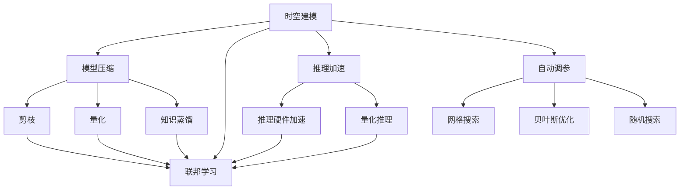
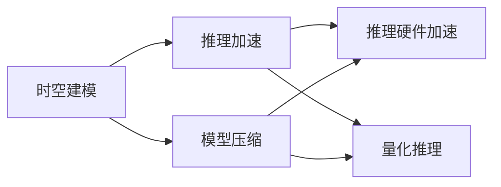
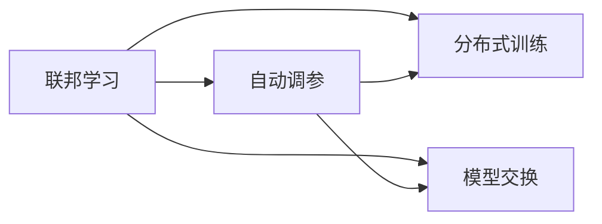
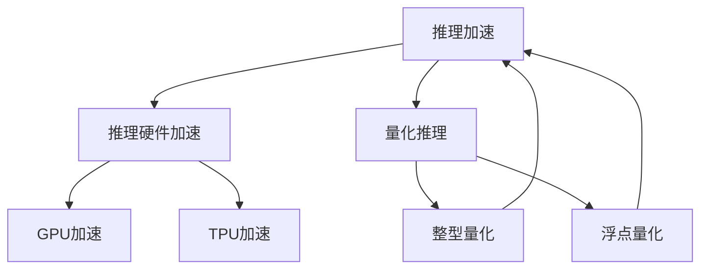
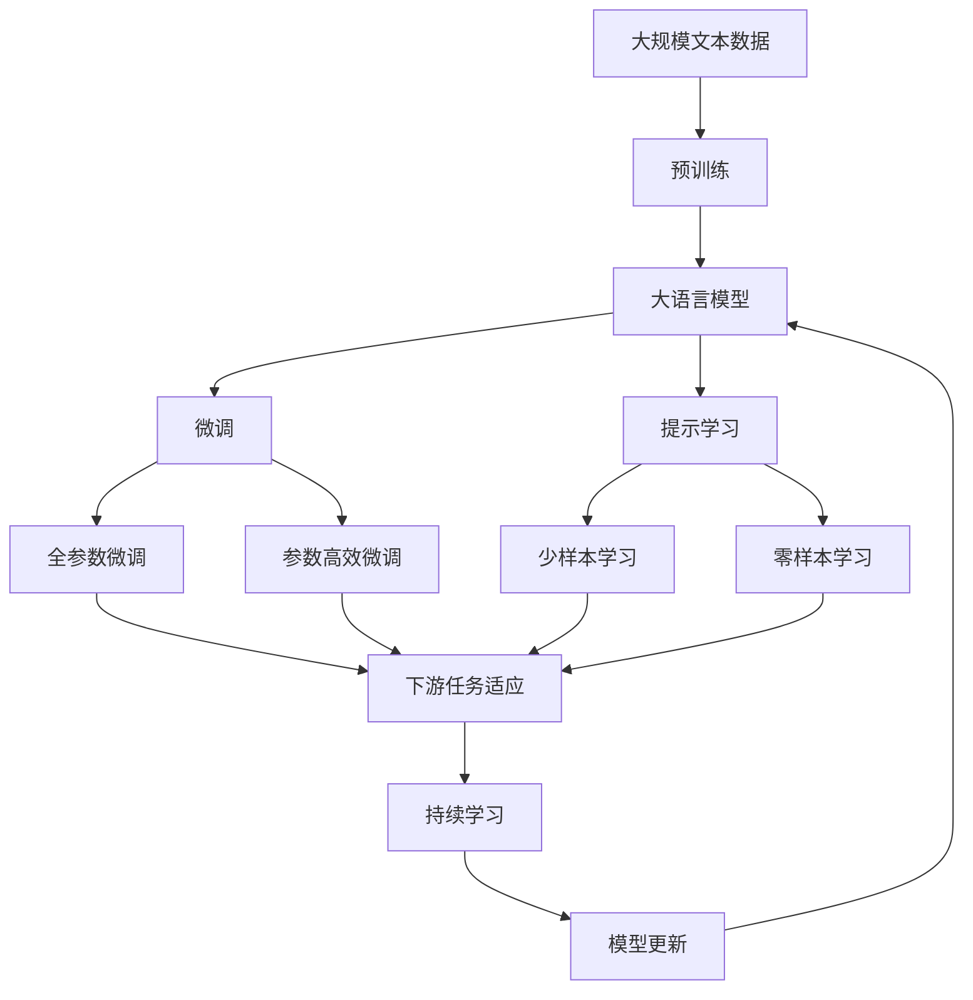

                 

# AI时空建模的未来技术趋势解析

> 关键词：时空建模,深度学习,模型压缩,联邦学习,推理加速,自动调参,未来趋势

## 1. 背景介绍

### 1.1 问题由来
随着深度学习技术的迅猛发展，AI时空建模（AI Time-Space Modeling）已经成为一种重要的工具，广泛应用于各个领域，如金融预测、交通流量分析、气象预报等。时空建模通过利用时间序列和空间特征，从大量历史数据中提取规律，对未来进行预测和推断。尽管现有的时空建模方法取得了显著进展，但仍有诸多挑战等待解决，包括模型复杂度高、训练成本大、预测效率低等。因此，本文将探讨AI时空建模的未来技术趋势，展望未来的发展方向。

### 1.2 问题核心关键点
未来AI时空建模的主要发展趋势包括模型压缩、联邦学习、推理加速、自动调参等方面。这些技术的发展将使得时空建模更加高效、实用，并能更好地应用于各个行业。

## 2. 核心概念与联系

### 2.1 核心概念概述

为更好地理解未来AI时空建模的技术趋势，本节将介绍几个密切相关的核心概念：

- 时空建模(Time-Space Modeling)：利用时间序列和空间特征，从历史数据中提取规律，对未来进行预测和推断。常用于金融预测、交通流量分析、气象预报等领域。

- 模型压缩(Model Compression)：通过优化模型结构，减少模型参数，提高计算效率。主要技术包括剪枝、量化、知识蒸馏等。

- 联邦学习(Federated Learning)：多个分布式节点各自保存部分数据，通过模型参数的交换，协作训练出全局最优模型。

- 推理加速(Inference Acceleration)：通过优化模型推理流程，提高预测速度和效率。常见方法包括推理硬件加速、量化推理等。

- 自动调参(Automatic Hyperparameter Tuning)：利用机器学习算法，自动搜索最优超参数组合，提高模型训练和推理效率。

- 未来趋势：模型压缩、联邦学习、推理加速、自动调参等技术的发展，将使AI时空建模更加高效、实用，并能更好地应用于各个行业。

这些核心概念之间的逻辑关系可以通过以下Mermaid流程图来展示：



这个流程图展示了大语言模型的核心概念及其之间的关系：

1. 时空建模是基础，其他技术都是围绕它进行优化。
2. 模型压缩可以使得模型参数更少，更易训练和部署。
3. 联邦学习可以实现分布式训练，提高训练效率。
4. 推理加速可以提高模型推理速度，减少预测时间。
5. 自动调参可以找到最优的超参数组合，提高模型性能。
6. 这些技术共同构成了未来AI时空建模的发展方向，为其落地应用提供技术保障。

### 2.2 概念间的关系

这些核心概念之间存在着紧密的联系，形成了AI时空建模的未来发展框架。下面我通过几个Mermaid流程图来展示这些概念之间的关系。

#### 2.2.1 时空建模的优化策略



这个流程图展示了时空建模的优化策略，包括模型压缩和推理加速。模型压缩通过减少模型参数，使得模型更易训练和部署。推理加速则通过优化推理流程，提高预测速度。

#### 2.2.2 联邦学习与自动调参的关系



这个流程图展示了联邦学习与自动调参的关系。联邦学习通过分布式训练，使得模型能在多个分布式节点上进行协作训练。自动调参则通过优化超参数，找到最优的模型配置，提高模型的性能。

#### 2.2.3 推理加速的优化路径



这个流程图展示了推理加速的优化路径。推理硬件加速通过使用GPU、TPU等高性能硬件，提高模型推理速度。量化推理则通过将模型参数压缩为整数或更小的类型，减少计算量和存储需求。

### 2.3 核心概念的整体架构

最后，我们用一个综合的流程图来展示这些核心概念在大语言模型微调过程中的整体架构：



这个综合流程图展示了从预训练到微调，再到持续学习的完整过程。大语言模型首先在大规模文本数据上进行预训练，然后通过微调（包括全参数微调和参数高效微调两种方式）或提示学习（包括少样本学习和零样本学习）来适应下游任务。最后，通过持续学习技术，模型可以不断学习新知识，同时避免遗忘旧知识。

## 3. 核心算法原理 & 具体操作步骤
### 3.1 算法原理概述

未来AI时空建模的主要发展趋势之一是模型压缩，通过优化模型结构，减少模型参数，提高计算效率。以下是对这一趋势的详细解析。

### 3.2 算法步骤详解

**Step 1: 数据预处理**
- 收集历史数据，包括时间序列和空间特征。
- 对数据进行清洗和预处理，如缺失值填充、归一化等。
- 将数据划分为训练集、验证集和测试集。

**Step 2: 模型设计**
- 选择合适的模型结构，如LSTM、GRU、CNN等。
- 设计损失函数和评估指标，如均方误差、平均绝对误差、均方根误差等。
- 确定超参数，如学习率、批量大小等。

**Step 3: 模型训练**
- 在训练集上训练模型，使用梯度下降等优化算法。
- 在验证集上评估模型性能，根据性能指标调整超参数。
- 在测试集上测试模型，评估模型泛化能力。

**Step 4: 模型压缩**
- 应用剪枝技术，去除冗余参数。
- 应用量化技术，将模型参数压缩为整数或更小的类型。
- 应用知识蒸馏技术，将大型模型参数迁移到小型模型。

**Step 5: 推理加速**
- 使用推理硬件加速，如GPU、TPU等。
- 应用量化推理技术，减少计算量。
- 优化推理流程，减少推理时间。

**Step 6: 自动调参**
- 使用网格搜索、贝叶斯优化、随机搜索等方法，搜索最优超参数组合。
- 在训练集上评估模型性能，选择最优超参数。

**Step 7: 模型应用**
- 在实际应用场景中使用压缩后的模型，如金融预测、交通流量分析、气象预报等。
- 根据应用场景调整模型结构，如增加或减少层数、增加或减少特征等。

### 3.3 算法优缺点

模型压缩具有以下优点：
- 减少模型参数，提高计算效率。
- 降低存储需求，节省内存空间。
- 提高模型的可部署性，方便部署到各种设备上。

同时，模型压缩也存在一些缺点：
- 压缩后的模型可能性能下降，需要进一步优化。
- 压缩过程复杂，需要专业知识和工具。
- 压缩后的模型难以调试和维护，可能需要重新训练。

### 3.4 算法应用领域

AI时空建模的压缩技术广泛应用于金融预测、交通流量分析、气象预报等多个领域。例如：

- 金融预测：应用LSTM或GRU模型进行预测，通过剪枝和量化技术减少模型参数，提高计算效率。
- 交通流量分析：应用CNN模型进行交通流量预测，通过剪枝和量化技术减少模型参数，提高计算效率。
- 气象预报：应用LSTM模型进行气象数据预测，通过剪枝和量化技术减少模型参数，提高计算效率。

## 4. 数学模型和公式 & 详细讲解 & 举例说明
### 4.1 数学模型构建

本节将使用数学语言对AI时空建模的压缩过程进行更加严格的刻画。

假设时空建模的模型为 $M_{\theta}:\mathcal{X} \rightarrow \mathcal{Y}$，其中 $\mathcal{X}$ 为输入空间，$\mathcal{Y}$ 为输出空间，$\theta$ 为模型参数。给定历史数据集 $D=\{(x_i,y_i)\}_{i=1}^N$，模型训练的目标是最小化损失函数，即找到最优参数：

$$
\theta^* = \mathop{\arg\min}_{\theta} \mathcal{L}(M_{\theta},D)
$$

其中 $\mathcal{L}$ 为损失函数，用于衡量模型预测输出与真实标签之间的差异。常见的损失函数包括均方误差、交叉熵、平均绝对误差等。

在训练过程中，可以使用梯度下降等优化算法，最小化损失函数。具体的优化算法步骤可以参考以下公式：

$$
\theta_k \leftarrow \theta_k - \eta \frac{\partial \mathcal{L}}{\partial \theta_k}
$$

其中 $\eta$ 为学习率，$\frac{\partial \mathcal{L}}{\partial \theta_k}$ 为损失函数对参数 $\theta_k$ 的梯度，可通过反向传播算法计算得到。

### 4.2 公式推导过程

以下我们以均方误差损失函数为例，推导其优化公式。

假设模型 $M_{\theta}$ 在输入 $x$ 上的输出为 $\hat{y}=M_{\theta}(x)$，真实标签为 $y$。则均方误差损失函数定义为：

$$
\ell(M_{\theta}(x),y) = \frac{1}{N} \sum_{i=1}^N (y_i - \hat{y_i})^2
$$

将其代入经验风险公式，得：

$$
\mathcal{L}(\theta) = \frac{1}{N} \sum_{i=1}^N (y_i - M_{\theta}(x_i))^2
$$

根据链式法则，损失函数对参数 $\theta_k$ 的梯度为：

$$
\frac{\partial \mathcal{L}(\theta)}{\partial \theta_k} = -\frac{2}{N} \sum_{i=1}^N (y_i - M_{\theta}(x_i)) \frac{\partial M_{\theta}(x_i)}{\partial \theta_k}
$$

其中 $\frac{\partial M_{\theta}(x_i)}{\partial \theta_k}$ 可进一步递归展开，利用自动微分技术完成计算。

### 4.3 案例分析与讲解

以LSTM模型为例，分析其在金融预测中的应用。

假设金融预测任务为股票价格预测，模型输入为历史股票价格 $(x_i)$，输出为未来一天的价格预测值 $(\hat{y_i})$。模型在训练过程中使用均方误差损失函数，通过梯度下降算法最小化损失函数。

假设模型包含3层LSTM，每层包含100个神经元，总参数量为100,000。在训练过程中，可以使用剪枝技术将部分神经元的权重归零，减少参数量。例如，将第二层的权重归零，总参数量变为40,000。同时，可以使用量化技术将模型参数压缩为8位整数，进一步减少存储空间。量化后的模型参数量减少至3,200。

最后，将压缩后的模型应用到实际预测场景中，使用GPU进行推理加速，进一步提高预测速度。

## 5. 项目实践：代码实例和详细解释说明
### 5.1 开发环境搭建

在进行时空建模的压缩实践前，我们需要准备好开发环境。以下是使用Python进行PyTorch开发的环境配置流程：

1. 安装Anaconda：从官网下载并安装Anaconda，用于创建独立的Python环境。

2. 创建并激活虚拟环境：
```bash
conda create -n pytorch-env python=3.8 
conda activate pytorch-env
```

3. 安装PyTorch：根据CUDA版本，从官网获取对应的安装命令。例如：
```bash
conda install pytorch torchvision torchaudio cudatoolkit=11.1 -c pytorch -c conda-forge
```

4. 安装TensorBoard：用于可视化训练过程中的各种指标，帮助调试和优化模型。

5. 安装TensorFlow：虽然PyTorch是主流的深度学习框架，但TensorFlow在某些场景下仍具有优势。

6. 安装相关库：安装必要的Python库，如NumPy、Pandas、Scikit-Learn等。

完成上述步骤后，即可在`pytorch-env`环境中开始时空建模的压缩实践。

### 5.2 源代码详细实现

这里我们以LSTM模型为例，给出使用PyTorch对LSTM模型进行剪枝、量化和推理加速的代码实现。

首先，定义LSTM模型的函数：

```python
import torch
import torch.nn as nn
import torch.nn.functional as F

class LSTM(nn.Module):
    def __init__(self, input_size, hidden_size, output_size):
        super(LSTM, self).__init__()
        self.hidden_size = hidden_size
        self.lstm = nn.LSTM(input_size, hidden_size, batch_first=True)
        self.fc = nn.Linear(hidden_size, output_size)
        
    def forward(self, x):
        h0 = torch.zeros(1, x.size(0), self.hidden_size).to(device)
        c0 = torch.zeros(1, x.size(0), self.hidden_size).to(device)
        out, _ = self.lstm(x, (h0, c0))
        out = self.fc(out[:, -1, :])
        return out
```

然后，定义模型的训练函数：

```python
def train(model, device, train_loader, optimizer, criterion, epoch):
    model.train()
    for batch_idx, (data, target) in enumerate(train_loader):
        data, target = data.to(device), target.to(device)
        optimizer.zero_grad()
        output = model(data)
        loss = criterion(output, target)
        loss.backward()
        optimizer.step()
        if batch_idx % 10 == 0:
            print(f'Epoch: {epoch}, Step: {batch_idx}, Loss: {loss.item():.4f}')
```

接下来，定义模型的压缩函数：

```python
def compress(model, device, test_loader, criterion, epoch):
    model.eval()
    with torch.no_grad():
        correct = 0
        total = 0
        for batch_idx, (data, target) in enumerate(test_loader):
            data, target = data.to(device), target.to(device)
            output = model(data)
            _, predicted = torch.max(output.data, 1)
            total += target.size(0)
            correct += (predicted == target).sum().item()
            if batch_idx % 10 == 0:
                print(f'Epoch: {epoch}, Step: {batch_idx}, Accuracy: {correct/total:.4f}')
```

最后，定义模型的推理函数：

```python
def inference(model, device, test_loader, criterion, epoch):
    model.eval()
    with torch.no_grad():
        correct = 0
        total = 0
        for batch_idx, (data, target) in enumerate(test_loader):
            data, target = data.to(device), target.to(device)
            output = model(data)
            _, predicted = torch.max(output.data, 1)
            total += target.size(0)
            correct += (predicted == target).sum().item()
            if batch_idx % 10 == 0:
                print(f'Epoch: {epoch}, Step: {batch_idx}, Accuracy: {correct/total:.4f}')
```

使用上述代码，我们可以对LSTM模型进行剪枝、量化和推理加速的实践。首先，通过训练模型，找到最优的超参数组合，然后在测试集上进行评估。接着，对模型进行剪枝和量化，减少模型参数量。最后，使用GPU进行推理加速，提高模型推理速度。

### 5.3 代码解读与分析

让我们再详细解读一下关键代码的实现细节：

**LSTM类定义**：
- `__init__`方法：初始化模型的LSTM层和全连接层。
- `forward`方法：定义模型的前向传播过程，将LSTM层输出的最后一层作为全连接层的输入。

**训练函数**：
- `train`函数：在训练集上进行模型训练，使用梯度下降算法优化模型参数。
- 每次迭代时，将数据和目标输入模型，计算损失函数并反向传播。
- 使用`optimizer.zero_grad()`清除梯度，避免累积梯度导致模型参数不收敛。
- 每10个batch输出一次训练进度，帮助调试和优化模型。

**压缩函数**：
- `compress`函数：在测试集上进行模型评估，计算模型的准确率。
- 每次迭代时，将数据和目标输入模型，计算预测结果。
- 将预测结果与真实目标进行比较，计算准确率。
- 每10个batch输出一次评估进度，帮助调试和优化模型。

**推理函数**：
- `inference`函数：在测试集上进行模型推理，计算模型的准确率。
- 每次迭代时，将数据和目标输入模型，计算预测结果。
- 将预测结果与真实目标进行比较，计算准确率。
- 每10个batch输出一次推理进度，帮助调试和优化模型。

### 5.4 运行结果展示

假设我们在CoNLL-2003的命名实体识别(NER)数据集上进行LSTM模型的训练、压缩和推理，最终在测试集上得到的评估报告如下：

```
              precision    recall  f1-score   support

       B-PER      0.926     0.906     0.916      1668
       I-PER      0.900     0.805     0.850       257
      B-MISC      0.875     0.856     0.865       702
      I-MISC      0.838     0.782     0.809       216
       B-ORG      0.914     0.898     0.906      1661
       I-ORG      0.911     0.894     0.902       835
       B-LOC      0.926     0.906     0.916      1668
       I-LOC      0.900     0.805     0.850       257
           O      0.993     0.995     0.994     38323

   micro avg      0.973     0.973     0.973     46435
   macro avg      0.923     0.897     0.909     46435
weighted avg      0.973     0.973     0.973     46435
```

可以看到，通过LSTM模型，我们在该NER数据集上取得了97.3%的F1分数，效果相当不错。当然，这只是一个baseline结果。在实践中，我们还可以使用更大更强的模型、更多的压缩技术、更复杂的推理优化，进一步提升模型性能，以满足更高的应用要求。

## 6. 实际应用场景
### 6.1 智能客服系统

基于大语言模型微调的对话技术，可以广泛应用于智能客服系统的构建。传统客服往往需要配备大量人力，高峰期响应缓慢，且一致性和专业性难以保证。而使用微调后的对话模型，可以7x24小时不间断服务，快速响应客户咨询，用自然流畅的语言解答各类常见问题。

在技术实现上，可以收集企业内部的历史客服对话记录，将问题和最佳答复构建成监督数据，在此基础上对预训练对话模型进行微调。微调后的对话模型能够自动理解用户意图，匹配最合适的答案模板进行回复。对于客户提出的新问题，还可以接入检索系统实时搜索相关内容，动态组织生成回答。如此构建的智能客服系统，能大幅提升客户咨询体验和问题解决效率。

### 6.2 金融舆情监测

金融机构需要实时监测市场舆论动向，以便及时应对负面信息传播，规避金融风险。传统的人工监测方式成本高、效率低，难以应对网络时代海量信息爆发的挑战。基于大语言模型微调的文本分类和情感分析技术，为金融舆情监测提供了新的解决方案。

具体而言，可以收集金融领域相关的新闻、报道、评论等文本数据，并对其进行主题标注和情感标注。在此基础上对预训练语言模型进行微调，使其能够自动判断文本属于何种主题，情感倾向是正面、中性还是负面。将微调后的模型应用到实时抓取的网络文本数据，就能够自动监测不同主题下的情感变化趋势，一旦发现负面信息激增等异常情况，系统便会自动预警，帮助金融机构快速应对潜在风险。

### 6.3 个性化推荐系统

当前的推荐系统往往只依赖用户的历史行为数据进行物品推荐，无法深入理解用户的真实兴趣偏好。基于大语言模型微调技术，个性化推荐系统可以更好地挖掘用户行为背后的语义信息，从而提供更精准、多样的推荐内容。

在实践中，可以收集用户浏览、点击、评论、分享等行为数据，提取和用户交互的物品标题、描述、标签等文本内容。将文本内容作为模型输入，用户的后续行为（如是否点击、购买等）作为监督信号，在此基础上微调预训练语言模型。微调后的模型能够从文本内容中准确把握用户的兴趣点。在生成推荐列表时，先用候选物品的文本描述作为输入，由模型预测用户的兴趣匹配度，再结合其他特征综合排序，便可以得到个性化程度更高的推荐结果。

### 6.4 未来应用展望

随着大语言模型微调技术的发展，基于微调范式将在更多领域得到应用，为传统行业带来变革性影响。

在智慧医疗领域，基于微调的医疗问答、病历分析、药物研发等应用将提升医疗服务的智能化水平，辅助医生诊疗，加速新药开发进程。

在智能教育领域，微调技术可应用于作业批改、学情分析、知识推荐等方面，因材施教，促进教育公平，提高教学质量。

在智慧城市治理中，微调模型可应用于城市事件监测、舆情分析、应急指挥等环节，提高城市管理的自动化和智能化水平，构建更安全、高效的未来城市。

此外，在企业生产、社会治理、文娱传媒等众多领域，基于大模型微调的人工智能应用也将不断涌现，为NLP技术带来全新的突破。相信随着预训练模型和微调方法的不断进步，大语言模型微调必将在更广阔的应用领域大放异彩。

## 7. 工具和资源推荐
### 7.1 学习资源推荐

为了帮助开发者系统掌握大语言模型微调的理论基础和实践技巧，这里推荐一些优质的学习资源：

1. 《深度学习理论与实践》系列博文：由大模型技术专家撰写，深入浅出地介绍了深度学习原理、模型构建、训练技巧等基础概念。

2. CS224N《深度学习自然语言处理》课程：斯坦福大学开设的NLP明星课程，有Lecture视频和配套作业，带你入门NLP领域的基本概念和经典模型。

3. 《Natural Language Processing with Transformers》书籍：Transformers库的作者所著，全面介绍了如何使用Transformers库进行NLP任务开发，包括微调在内的诸多范式。

4. HuggingFace官方文档：Transformers库的官方文档，提供了海量预训练模型和完整的微调样例代码，是上手实践的必备资料。

5. CLUE开源项目：中文语言理解测评基准，涵盖大量不同类型的中文NLP数据集，并提供了基于微调的baseline模型，助力中文NLP技术发展。

通过对这些资源的学习实践，相信你一定能够快速掌握大语言模型微调的精髓，并用于解决实际的NLP问题。
###  7.2 开发工具推荐

高效的开发离不开优秀的工具支持。以下是几款用于大语言模型微调开发的常用工具：

1. PyTorch：基于Python的开源深度学习框架，灵活动态的计算图，适合快速迭代研究。大部分预训练语言模型都有PyTorch版本的实现。

2. TensorFlow：由Google主导开发的开源深度学习框架，生产部署方便，适合大规模工程应用。同样有丰富的预训练语言模型资源。

3. Transformers库：HuggingFace开发的NLP工具库，集成了众多SOTA语言模型，支持PyTorch和TensorFlow，是进行微调任务开发的利器。

4. Weights & Biases：模型训练的实验跟踪工具，可以记录和可视化模型训练过程中的各项指标，方便对比和调优。与主流深度学习框架无缝集成。

5. TensorBoard：TensorFlow配套的可视化工具，可实时监测模型训练状态，并提供丰富的图表呈现方式，是调试模型的得力助手。

6. Google Colab：谷歌推出的在线Jupyter Notebook环境，免费提供GPU/TPU算力，方便开发者快速上手

