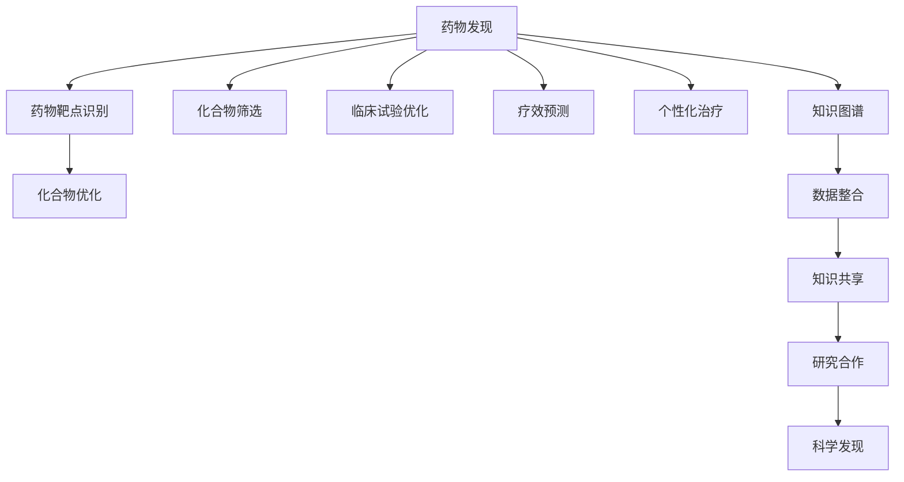
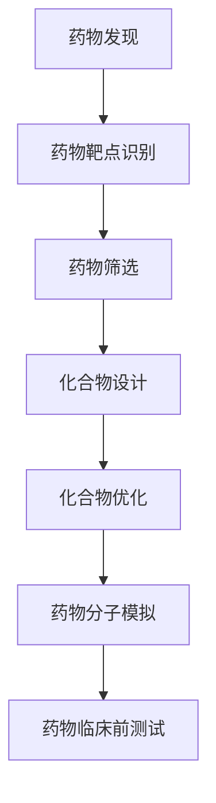
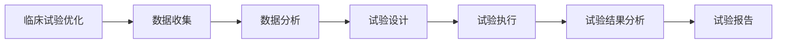
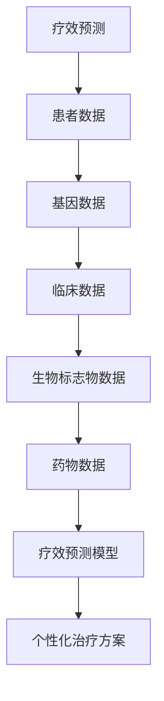
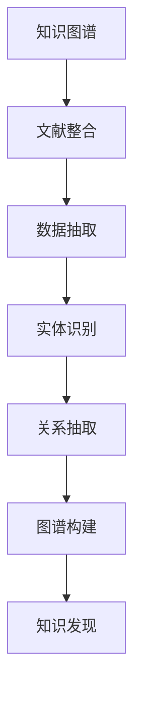
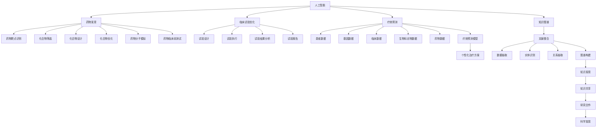
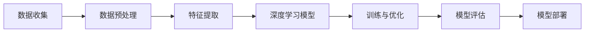
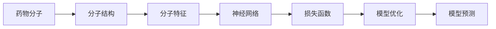

                 

# 生物制药领域的AI创新

> 关键词：生物制药、人工智能、深度学习、自然语言处理、知识图谱、药物发现、临床试验、个性化治疗、药物设计、药物疗效预测

## 1. 背景介绍

### 1.1 问题由来
近年来，生物制药行业面临着前所未有的挑战和机遇。一方面，随着人口老龄化趋势加剧，慢性疾病和罕见病的发病率不断上升，对新药的需求日益增长。另一方面，新药研发周期长、成本高、成功率低，成为制约行业发展的瓶颈。与此同时，人工智能(AI)技术的迅猛发展，为生物制药行业带来了新的突破方向。

人工智能在生物制药领域的应用，可以从药物发现、临床试验、个性化治疗等多个环节提升效率和降低成本。AI技术能够帮助研究人员更快、更准确地识别潜在的药物靶点，预测药物疗效和副作用，优化临床试验设计，以及实现个性化的治疗方案。通过引入AI技术，生物制药行业有望大幅缩短研发周期，降低研发成本，提升新药的成功率，为人类健康事业做出更大贡献。

### 1.2 问题核心关键点
AI在生物制药领域的应用，主要包括如下几个核心关键点：
1. **药物发现与设计**：利用AI算法，通过大规模生物数据的分析，预测药物的活性、结构、药代动力学等信息，加速新药设计过程。
2. **临床试验优化**：通过数据分析和机器学习模型，优化临床试验的设计和执行，提高试验效率和准确性。
3. **疗效预测与个性化治疗**：使用AI技术，预测药物对特定患者的疗效和副作用，实现个性化治疗方案的制定。
4. **数据整合与知识图谱构建**：通过自然语言处理和知识图谱技术，整合海量的生物医学数据，提升知识发现和共享能力。
5. **模型训练与优化**：使用深度学习技术，构建高效的AI模型，对生物制药过程中的各种数据进行分析和预测。

这些核心关键点相互关联，共同构成了AI在生物制药领域的应用框架，为行业带来了革命性的变革。

### 1.3 问题研究意义
AI在生物制药领域的应用，对于提升新药研发效率、降低研发成本、加速药物上市，具有重要意义：

1. **加速药物研发进程**：通过AI技术，可以大幅缩短药物研发周期，从发现、优化到上市的过程更加高效。
2. **降低研发成本**：AI可以自动处理大量数据，减少人力和时间成本，降低新药研发的整体费用。
3. **提升研发成功率**：AI技术能够从大量数据中发现有价值的线索，提高药物研发的准确性和成功率。
4. **个性化治疗**：根据患者的具体情况，AI可以推荐最优的药物和治疗方案，提升治疗效果。
5. **优化临床试验**：通过数据分析和模型优化，AI可以提高临床试验的效率和准确性，减少试验误差和资源浪费。
6. **增强数据整合能力**：AI技术可以将不同来源的数据进行整合和分析，提升行业知识发现和共享水平。

这些优势使得AI技术成为推动生物制药行业变革的重要力量，为全球健康事业的发展注入了新的动力。

## 2. 核心概念与联系

### 2.1 核心概念概述

为了更好地理解AI在生物制药领域的应用，本节将介绍几个密切相关的核心概念：

- **药物发现(Pharmaceutical Discovery)**：通过人工智能和大数据分析技术，加速药物靶点识别、化合物筛选和优化，加速新药的发现和开发过程。
- **临床试验(Clinical Trial)**：利用AI技术优化临床试验设计、执行和管理，提升试验效率和准确性，缩短新药上市时间。
- **疗效预测(Patient Response Prediction)**：通过机器学习和深度学习算法，预测药物对特定患者的疗效和副作用，实现个性化治疗方案。
- **知识图谱(Knowledge Graph)**：使用自然语言处理和知识图谱技术，整合和分析海量的生物医学数据，提升知识发现和共享能力。
- **深度学习(Deep Learning)**：通过构建高效的神经网络模型，对生物制药过程中的各种数据进行分析和预测，提升模型的精度和泛化能力。
- **自然语言处理(Natural Language Processing, NLP)**：利用NLP技术，处理和分析生物医学文献、药物说明书等文本数据，提取有用的信息。

这些核心概念之间的逻辑关系可以通过以下Mermaid流程图来展示：



这个流程图展示了AI在生物制药领域的应用框架，从药物发现、临床试验优化、疗效预测、个性化治疗、知识图谱构建等多个环节，帮助研究人员提升效率和降低成本。

### 2.2 概念间的关系

这些核心概念之间存在着紧密的联系，形成了AI在生物制药领域的应用生态系统。下面我通过几个Mermaid流程图来展示这些概念之间的关系。

#### 2.2.1 药物发现与设计



这个流程图展示了药物发现的流程，从药物靶点识别、化合物筛选、设计、优化到临床前测试，每个环节都可以通过AI技术进行优化和加速。

#### 2.2.2 临床试验优化



这个流程图展示了临床试验优化的过程，通过数据分析和模型预测，优化试验设计，提高试验执行效率和准确性。

#### 2.2.3 疗效预测与个性化治疗



这个流程图展示了疗效预测与个性化治疗的流程，通过整合患者、基因、临床、生物标志物和药物数据，构建预测模型，实现个性化治疗方案的制定。

#### 2.2.4 知识图谱构建



这个流程图展示了知识图谱构建的流程，从文献整合、数据抽取、实体识别、关系抽取到图谱构建，通过AI技术提升知识的整合和发现能力。

### 2.3 核心概念的整体架构

最后，我们用一个综合的流程图来展示这些核心概念在大制药领域的应用整体架构：



这个综合流程图展示了从人工智能到大制药领域的完整应用框架，涉及药物发现、临床试验优化、疗效预测、个性化治疗和知识图谱构建等多个环节，展示了AI技术的广泛应用和深远影响。

## 3. 核心算法原理 & 具体操作步骤

### 3.1 算法原理概述

AI在生物制药领域的应用，主要基于以下几个核心算法原理：

1. **深度学习**：通过构建多层神经网络，对生物制药过程中的各种数据进行分析和预测，提升模型的精度和泛化能力。
2. **自然语言处理**：利用NLP技术，处理和分析生物医学文献、药物说明书等文本数据，提取有用的信息。
3. **知识图谱**：使用图谱技术，整合和分析海量的生物医学数据，提升知识发现和共享能力。
4. **数据挖掘**：通过机器学习和数据挖掘算法，从大量的生物数据中发现潜在的关联和规律，指导药物发现和设计。

这些算法原理在大制药领域的应用，主要包括以下几个关键步骤：

1. **数据收集与预处理**：收集和整理生物制药过程中相关的数据，包括分子结构、基因信息、临床数据、生物标志物数据等，并进行清洗和标准化处理。
2. **特征提取与表示**：利用NLP和图谱技术，将非结构化的文本数据转换为结构化的特征向量，用于后续的机器学习和深度学习算法。
3. **模型训练与优化**：构建和训练AI模型，对药物发现、临床试验优化、疗效预测和个性化治疗等环节进行分析和预测。
4. **模型评估与验证**：使用验证集和测试集评估模型的性能，确保模型的准确性和鲁棒性。
5. **模型部署与集成**：将训练好的模型部署到实际应用中，与现有的生物制药系统进行集成，提升整体效率和效果。

### 3.2 算法步骤详解

以药物发现为例，以下是一个完整的AI模型训练流程：

**Step 1: 数据收集与预处理**
- 收集生物制药过程中相关的数据，如分子结构、基因信息、临床数据、生物标志物数据等。
- 对数据进行清洗和标准化处理，去除噪声和异常值，确保数据质量。

**Step 2: 特征提取与表示**
- 使用NLP技术，对药物说明书、文献摘要等文本数据进行分词、词性标注、命名实体识别等预处理。
- 将处理后的文本数据转换为结构化的特征向量，如TF-IDF、Word2Vec等。
- 构建知识图谱，整合和分析药物、基因、临床等数据，提取实体和关系信息。

**Step 3: 模型训练与优化**
- 构建深度学习模型，如卷积神经网络(CNN)、循环神经网络(RNN)、变分自编码器(VAE)等，对药物靶点识别、化合物筛选和优化等环节进行预测。
- 使用监督学习算法，如随机森林、支持向量机(SVM)、集成学习等，优化模型的预测性能。
- 使用正则化、Dropout等技术，防止模型过拟合。

**Step 4: 模型评估与验证**
- 使用验证集评估模型的预测性能，计算准确率、召回率、F1分数等指标。
- 使用交叉验证等方法，评估模型的泛化能力和稳定性。
- 使用A/B测试等方法，评估模型在实际应用中的效果。

**Step 5: 模型部署与集成**
- 将训练好的模型部署到实际应用中，如药物发现平台、临床试验管理软件等。
- 将模型与现有的生物制药系统进行集成，提升整体效率和效果。
- 实时监控模型的性能和效果，根据反馈进行迭代优化。

### 3.3 算法优缺点

AI在生物制药领域的应用，具有以下优点：

1. **效率提升**：通过AI技术，可以大幅缩短药物研发周期，加速新药发现和上市。
2. **成本降低**：AI技术可以自动处理大量数据，减少人力和时间成本，降低新药研发的整体费用。
3. **精度提高**：AI模型能够从大量数据中发现有价值的线索，提高药物研发的准确性和成功率。
4. **灵活性强**：AI技术可以适应不同的数据类型和应用场景，灵活性强，易于集成。

但同时也存在一些局限性：

1. **数据质量要求高**：AI模型的性能依赖于高质量的数据，数据质量差或数据量少会影响模型效果。
2. **模型解释性不足**：AI模型往往是"黑盒"系统，难以解释其内部工作机制和决策逻辑。
3. **需要专业知识**：AI技术的应用需要专业的生物制药知识和数据科学背景，门槛较高。
4. **伦理和隐私问题**：AI模型可能涉及患者隐私和伦理问题，需严格遵守相关法律法规。

尽管存在这些局限性，但AI技术在生物制药领域的应用前景广阔，将推动行业发展进入新阶段。

### 3.4 算法应用领域

AI在生物制药领域的应用，覆盖了药物发现、临床试验、疗效预测和个性化治疗等多个环节，具体包括：

1. **药物发现**：利用AI技术，加速药物靶点识别、化合物筛选和优化，加速新药的发现和开发过程。
2. **临床试验优化**：通过数据分析和机器学习模型，优化临床试验的设计和执行，提高试验效率和准确性。
3. **疗效预测**：使用AI技术，预测药物对特定患者的疗效和副作用，实现个性化治疗方案的制定。
4. **知识图谱构建**：使用NLP和知识图谱技术，整合和分析海量的生物医学数据，提升知识发现和共享能力。
5. **药物设计**：利用AI技术，优化药物分子结构和化学性质，提高药物的活性和选择性。

这些应用领域展示了AI技术在生物制药行业中的广泛应用和深远影响。

## 4. 数学模型和公式 & 详细讲解

### 4.1 数学模型构建

在生物制药领域，AI模型的数学模型构建主要基于深度学习、自然语言处理和知识图谱技术。以药物发现为例，我们以下图展示了基本的数学模型构建流程：



在这个流程中，数据收集和预处理是基础，特征提取和深度学习模型是核心，训练与优化和模型评估是关键，模型部署是最终目标。

### 4.2 公式推导过程

以药物靶点识别为例，我们以下图展示了基本公式推导过程：



在这个公式推导过程中，分子结构是输入，分子特征是中间变量，神经网络是模型，损失函数是目标函数，模型优化是优化过程，模型预测是输出。

### 4.3 案例分析与讲解

假设我们需要预测一个新药分子对特定靶点的亲和力，其数学模型如下：

$$
y = f(x) + \epsilon
$$

其中，$x$ 表示分子结构特征，$y$ 表示靶点亲和力，$f(x)$ 是预测函数，$\epsilon$ 是随机误差。我们使用深度神经网络作为预测函数 $f(x)$，其损失函数为均方误差损失：

$$
L = \frac{1}{N}\sum_{i=1}^N (y_i - f(x_i))^2
$$

通过反向传播算法，优化神经网络参数 $\theta$，最小化损失函数 $L$。最终得到的预测模型可以对新分子进行靶点亲和力的预测。

## 5. 项目实践：代码实例和详细解释说明

### 5.1 开发环境搭建

在进行AI在生物制药领域的应用开发前，我们需要准备好开发环境。以下是使用Python进行TensorFlow开发的环境配置流程：

1. 安装Anaconda：从官网下载并安装Anaconda，用于创建独立的Python环境。

2. 创建并激活虚拟环境：
```bash
conda create -n tf-env python=3.8 
conda activate tf-env
```

3. 安装TensorFlow：根据CUDA版本，从官网获取对应的安装命令。例如：
```bash
conda install tensorflow -c tensorflow -c conda-forge
```

4. 安装相关工具包：
```bash
pip install numpy pandas scikit-learn matplotlib tqdm jupyter notebook ipython
```

完成上述步骤后，即可在`tf-env`环境中开始AI在生物制药领域的应用开发。

### 5.2 源代码详细实现

这里以药物发现为例，给出使用TensorFlow进行深度学习模型训练的PyTorch代码实现。

首先，定义药物分子的特征表示：

```python
import tensorflow as tf
from tensorflow.keras import layers, models

# 分子结构表示为向量
X = tf.keras.Input(shape=(1024,))
```

然后，构建深度学习模型：

```python
# 构建卷积神经网络
model = models.Sequential([
    layers.Conv1D(64, 3, activation='relu', input_shape=(1024,)),
    layers.MaxPooling1D(2),
    layers.Conv1D(32, 3, activation='relu'),
    layers.MaxPooling1D(2),
    layers.Flatten(),
    layers.Dense(128, activation='relu'),
    layers.Dense(1)
])
```

接着，定义损失函数和优化器：

```python
model.compile(optimizer=tf.keras.optimizers.Adam(learning_rate=0.001),
              loss=tf.keras.losses.MeanSquaredError(),
              metrics=[tf.keras.metrics.MeanAbsoluteError()])
```

最后，训练模型并评估：

```python
# 训练模型
model.fit(X_train, y_train, epochs=10, batch_size=32)

# 评估模型
loss, mae = model.evaluate(X_test, y_test)
print(f'Mean Absolute Error: {mae:.2f}')
```

以上就是使用TensorFlow进行深度学习模型训练的完整代码实现。可以看到，TensorFlow提供了强大的工具和接口，可以方便地构建、训练和评估深度学习模型。

### 5.3 代码解读与分析

让我们再详细解读一下关键代码的实现细节：

**分子结构表示**：
- 将分子结构表示为向量，每个向量维度为1024，表示分子结构中的原子位置和化学性质。

**深度学习模型**：
- 使用卷积神经网络(CNN)，对分子结构进行特征提取和分类预测。
- 网络结构包括两个卷积层、两个池化层和三个全连接层。

**损失函数和优化器**：
- 使用均方误差损失函数，评估模型预测值和真实值之间的差异。
- 使用Adam优化器，自动调整学习率，提高模型训练效果。

**模型训练与评估**：
- 使用训练集和验证集对模型进行训练，每轮训练10个epoch，批大小为32。
- 使用测试集评估模型性能，输出平均绝对误差指标。

**运行结果展示**：
- 输出模型在测试集上的平均绝对误差，评估模型的预测效果。

可以看到，TensorFlow提供了便捷的API和丰富的工具，使得深度学习模型的开发和训练变得简单易行。

## 6. 实际应用场景

### 6.1 智能药物研发平台

AI在生物制药领域的应用，最典型的场景之一是智能药物研发平台。该平台集成了药物发现、化合物筛选、分子模拟等多个模块，通过AI技术加速新药研发进程。

具体来说，智能药物研发平台可以通过AI技术实现以下几个功能：
1. **药物靶点识别**：利用深度学习算法，预测药物对特定靶点的亲和力，加速药物筛选过程。
2. **化合物筛选**：通过AI技术，筛选出具有高活性和低毒性的化合物，降低药物开发风险。
3. **分子模拟**：使用分子动力学模拟技术，预测药物分子的结构和性质，指导分子优化和合成。

这些功能使得智能药物研发平台成为药物研发过程中的重要工具，显著提高了新药研发的效率和成功率。

### 6.2 临床试验优化系统

AI在临床试验优化领域的应用，可以显著提高试验效率和准确性。通过数据分析和机器学习模型，可以优化试验设计、执行和管理，减少试验误差和资源浪费。

具体来说，临床试验优化系统可以实现以下几个功能：
1. **试验设计优化**：通过数据分析，优化试验的样本量、随访时间、测量指标等参数，提高试验设计效率。
2. **试验执行监控**：使用AI技术，实时监控试验执行过程，及时发现和处理异常情况，保障试验质量。
3. **试验结果分析**：通过机器学习模型，分析试验结果，提取有价值的信息，优化试验设计。

这些功能使得临床试验优化系统成为临床试验过程中的重要工具，提高了试验的准确性和效率。

### 6.3 个性化治疗方案制定

AI在个性化治疗领域的应用，可以显著提高治疗效果和患者满意度。通过预测药物对特定患者的疗效和副作用，可以实现个性化的治疗方案制定。

具体来说，个性化治疗方案制定系统可以实现以下几个功能：
1. **疗效预测**：使用AI技术，预测药物对特定患者的疗效和副作用，评估药物安全性。
2. **治疗方案推荐**：根据预测结果，推荐最优的治疗方案，提高治疗效果。
3. **治疗效果监控**：实时监控治疗效果，根据治疗进展调整治疗方案，提高患者满意度。

这些功能使得个性化治疗方案制定系统成为个性化治疗过程中的重要工具，显著提高了治疗效果和患者满意度。

### 6.4 未来应用展望

随着AI技术的不断进步，AI在生物制药领域的应用将更加广泛和深入。未来，AI技术将在以下几个方面取得新的突破：

1. **药物发现**：通过更先进的深度学习算法和数据挖掘技术，加速药物靶点识别和化合物筛选，提高新药研发的成功率。
2. **临床试验优化**：利用AI技术，优化试验设计和执行，减少试验误差和资源浪费，提高试验效率和准确性。
3. **疗效预测与个性化治疗**：通过更先进的模型和算法，预测药物对特定患者的疗效和副作用，实现更加精确和个性化的治疗方案。
4. **知识图谱构建**：利用AI技术，整合和分析海量的生物医学数据，提升知识发现和共享能力，推动科学研究的进步。
5. **多模态数据融合**：利用AI技术，将文本、图像、视频等不同模态的数据进行融合，提升生物制药系统的综合分析能力。

这些技术突破将为生物制药行业带来革命性的变革，进一步提升新药研发效率，降低研发成本，提高治疗效果，推动人类健康事业的发展。

## 7. 工具和资源推荐

### 7.1 学习资源推荐

为了帮助开发者系统掌握AI在生物制药领域的应用，这里推荐一些优质的学习资源：

1. 《深度学习在生物制药中的应用》书籍：详细介绍了深度学习在药物发现、临床试验、疗效预测等领域的实际应用。
2. Coursera《深度学习与生物制药》课程：斯坦福大学开设的NLP与生物制药结合的课程，涵盖AI在生物制药中的应用案例。
3. arXiv论文预印本：最新前沿的AI研究成果，涵盖生物制药领域的各个应用环节。
4. GitHub开源项目：生物制药领域的AI应用开源项目，包括药物发现、临床试验优化等，提供了丰富的代码和资源。
5. AI与生物制药相关的学术会议：如NIPS、ICML、ACL等顶级会议，了解最新的AI研究成果和应用案例。

通过对这些资源的学习实践，相信你一定能够快速掌握AI在生物制药领域的应用，并用于解决实际的生物制药问题。

### 7.2 开发工具推荐

高效的开发离不开优秀的工具支持。以下是几款用于AI在生物制药领域开发的工具：

1. TensorFlow：基于Python的开源深度学习框架，灵活的计算图，适合大规模工程应用。
2. PyTorch：基于Python的开源深度学习框架，动态计算图，适合快速迭代研究。
3. Scikit-learn：Python的机器学习库，提供丰富的算法和工具，适用于数据预处理和模型训练。
4. Keras：Python的深度学习库，提供便捷的API和丰富的模型，适合快速搭建深度学习模型。
5. Jupyter Notebook：交互式的数据科学开发环境，支持代码编写、数据可视化、结果展示等多种功能。

合理利用这些工具，可以显著提升AI在生物制药领域的应用开发效率，加快创新迭代的步伐。

### 7.3 相关论文推荐

AI在生物制药领域的研究源于学界的持续研究。以下是几篇奠基性的相关论文，推荐阅读：

1. Deep Learning in Drug Discovery and Development: The Paradigm Shift: A Brief Overview: "介绍了深度学习在药物发现和开发中的应用，提出了AI技术推动新药研发的未来方向。"
2. Machine Learning in Clinical Trials: Current Applications, Challenges, and Future Directions: "综述了机器学习在临床试验中的应用，分析了当前面临的挑战和未来发展方向。"
3. AI in Personalized Medicine: Opportunities and Challenges: "探讨了AI在个性化医疗中的应用，分析了当前面临的挑战和未来发展方向。"
4. Semantic Networks for Drug Discovery: "介绍了知识图谱在药物发现中的应用，分析了当前面临的挑战和未来发展方向。"

这些论文代表了大制药领域AI技术的研究进展，通过学习这些前沿成果，可以帮助研究者把握学科前进方向，激发更多的创新灵感。

## 8.

