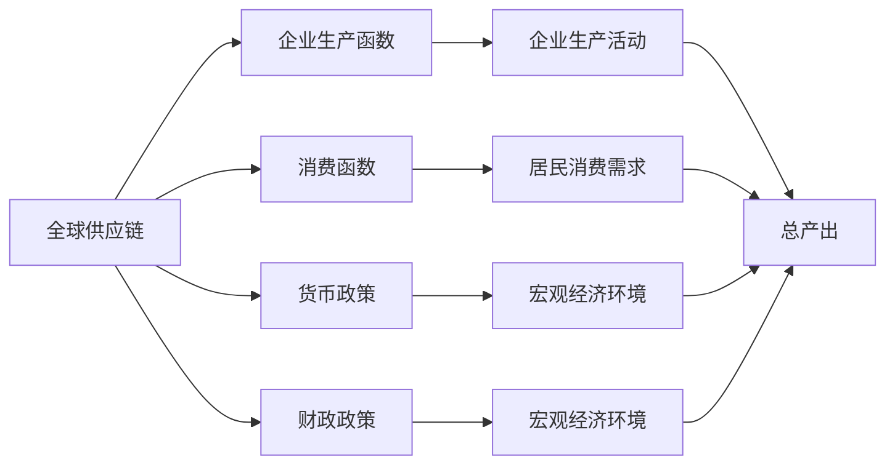
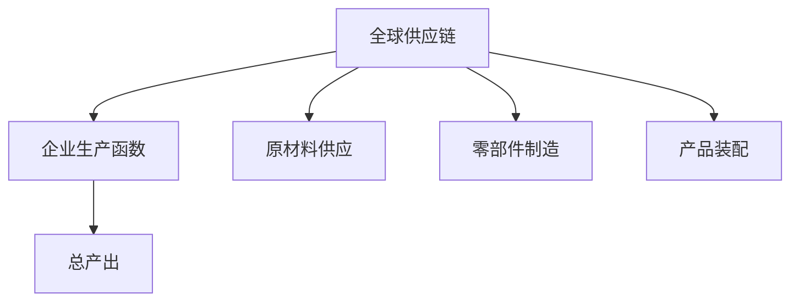
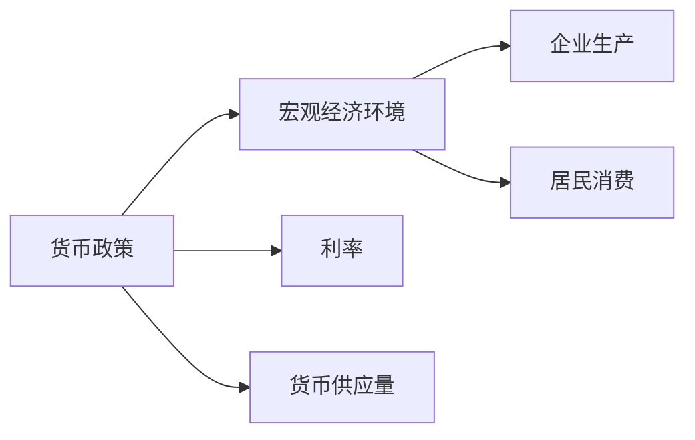
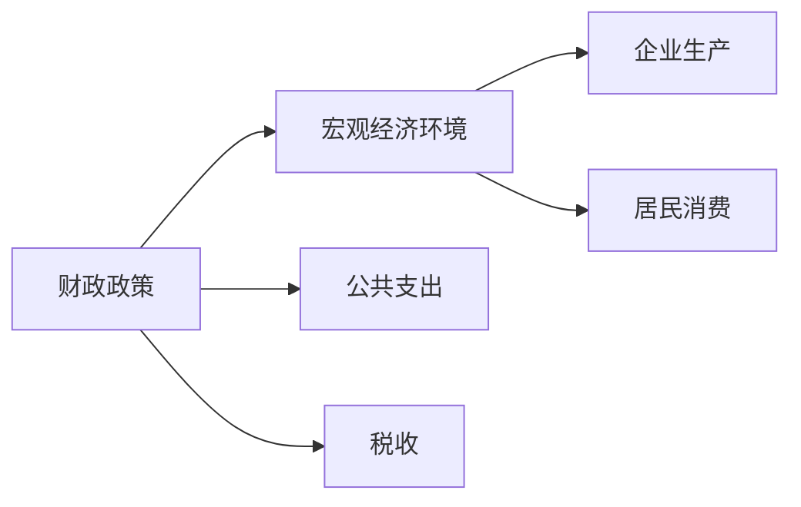

                 

# 疫情冲击对全球经济的影响

在人类历史上，新冠疫情（COVID-19）无疑是前所未有的全球性危机。疫情的爆发和持续不仅改变了人们的日常生活，也对全球经济产生了深远影响。本文将从多个维度分析疫情对全球经济的影响，探讨其背后的原理和机制，并展望未来发展趋势。

## 1. 背景介绍

### 1.1 疫情概况
自2019年底新冠疫情首次在中国湖北省武汉市被发现以来，全球已有数百万人感染，数十万人死亡。疫情迅速扩散至全球多个国家和地区，对各国经济、社会、政治等各方面都产生了广泛而深远的影响。

### 1.2 疫情对经济的初步影响
疫情的爆发导致全球供应链中断、企业停工、消费需求下降，这些因素共同作用，引发了历史上罕见的全球经济衰退。2020年全球GDP出现首次负增长，多个主要经济体陷入经济低迷。

## 2. 核心概念与联系

### 2.1 核心概念概述

为更好地理解疫情对全球经济的影响，本节将介绍几个密切相关的核心概念：

- 全球供应链：全球经济体系中，跨国公司在全球范围内进行生产、采购、物流、销售等活动的组织网络。
- 企业生产函数：描述企业在固定投入下产出增加的函数，包括资本、劳动、技术等因素。
- 消费函数：描述居民收入与消费需求之间的关系，通常认为消费支出随收入增长而增加。
- 货币政策：中央银行通过调整利率、货币供应量等手段，以影响经济活动、调控通货膨胀等目标。
- 财政政策：政府通过税收、公共支出等手段，调节经济运行，促进经济增长、增加就业等。
- 经济波动：经济增长、失业率、物价水平、利率等经济指标的周期性波动。

这些核心概念之间的逻辑关系可以通过以下Mermaid流程图来展示：



这个流程图展示了几大经济因素之间的相互联系：

1. 全球供应链是企业生产活动的基础，影响生产函数的效率。
2. 消费函数描述居民的消费需求，与企业生产活动紧密相关。
3. 货币政策和财政政策共同影响宏观经济环境，进一步影响企业生产和居民消费。
4. 企业生产活动和居民消费需求共同决定总产出，反映经济波动。

### 2.2 概念间的关系

这些核心概念之间存在着紧密的联系，形成了全球经济运行的整体框架。下面通过几个Mermaid流程图来展示这些概念的关系：

#### 2.2.1 全球供应链与企业生产函数



这个流程图展示了全球供应链与企业生产函数之间的联系：

1. 全球供应链涉及原材料供应、零部件制造、产品装配等环节。
2. 企业通过供应链获取所需的原材料和零部件，进行产品装配和生产。
3. 供应链的中断或效率低下会直接影响企业的生产效率，进而影响总产出。

#### 2.2.2 货币政策与宏观经济环境



这个流程图展示了货币政策与宏观经济环境之间的联系：

1. 货币政策通过调整利率、货币供应量等手段，影响宏观经济环境。
2. 利率的变化会影响企业的融资成本，进而影响企业的投资和生产。
3. 货币供应量的增减会影响企业的流动性和居民的消费需求，进而影响经济总体运行。

#### 2.2.3 财政政策与宏观经济环境



这个流程图展示了财政政策与宏观经济环境之间的联系：

1. 财政政策通过公共支出和税收等手段，调节宏观经济环境。
2. 公共支出增加可以刺激投资和消费，推动经济增长。
3. 税收调整可以影响居民收入和消费需求，影响经济总产出。

## 3. 核心算法原理 & 具体操作步骤

### 3.1 算法原理概述

疫情对全球经济的影响主要体现在供应链中断、企业停工、消费需求下降等方面。这些因素共同作用，导致总产出下降、失业率上升、物价水平波动，从而引发经济波动。

形式化地，假设全球经济体系由 $N$ 个国家和 $M$ 个行业组成。用 $Y$ 表示总产出，$C$ 表示居民消费，$I$ 表示企业投资，$G$ 表示政府支出，$X$ 表示净出口。则经济的总产出方程可以表示为：

$$
Y = C + I + G + X
$$

其中：

- $C$：居民消费函数为 $C = \alpha + \beta Y$，$\alpha$ 为自发消费，$\beta$ 为边际消费倾向。
- $I$：企业投资函数为 $I = \gamma Y + \delta P$，$\gamma$ 为投资对产出的敏感系数，$P$ 为利率。
- $G$：政府支出函数为 $G = \eta Y + \theta$，$\eta$ 为政府支出对产出的敏感系数，$\theta$ 为自发支出。
- $X$：净出口函数为 $X = \omega Y - \epsilon Y$，$\omega$ 为净出口对产出的敏感系数，$\epsilon$ 为自发净出口。

假设初始条件下，经济处于稳定状态。突发疫情导致供应链中断、企业停工、消费需求下降等，这些因素共同作用，使得经济产出下降。设疫情导致的总产出下降为 $\Delta Y$，则新的经济产出方程为：

$$
Y' = Y - \Delta Y
$$

其中 $Y'$ 表示新的经济产出，$Y$ 表示疫情前经济产出。

### 3.2 算法步骤详解

基于上述模型，疫情对全球经济的影响分析可以分为以下几个步骤：

**Step 1: 确定疫情冲击对各经济变量的影响**

1. 确定疫情对供应链的中断程度，估算其对企业生产活动的影响。
2. 估算疫情对企业投资和居民消费的影响。
3. 估算疫情对政府支出和净出口的影响。

**Step 2: 构建经济产出模型**

1. 将各经济变量代入总产出方程，得到新的经济产出方程。
2. 根据实际情况，设定各变量的变化幅度，进行模拟计算。

**Step 3: 模拟经济波动**

1. 根据经济产出方程，计算新的经济产出水平。
2. 分析新的经济产出水平对就业、物价、利率等经济指标的影响。
3. 模拟经济波动过程，观察经济系统的恢复情况。

### 3.3 算法优缺点

基于上述模型的疫情分析方法具有以下优点：

1. 系统性：通过构建经济产出模型，全面考虑了供应链中断、企业停工、消费需求下降等因素对经济的影响。
2. 可操作性：各经济变量的变化幅度可以根据实际数据进行调整，方法具有较高的可操作性。
3. 预测性：通过模拟经济波动，可以预测疫情对经济的影响程度和恢复时间。

同时，该方法也存在以下缺点：

1. 假设性强：模型假设供应链中断、企业停工、消费需求下降等因素是线性叠加的，而实际情况可能更为复杂。
2. 数据需求高：模型需要大量的经济数据，包括生产函数、消费函数、投资函数、政府支出函数等。
3. 精度受限：模型无法考虑心理预期、政策调整、国际环境变化等因素对经济的影响。

### 3.4 算法应用领域

基于模型的疫情分析方法，可以广泛应用于以下几个领域：

1. 政府政策制定：通过模拟疫情对经济的影响，制定有针对性的财政政策和货币政策，以缓解疫情对经济的冲击。
2. 企业战略规划：评估疫情对供应链、投资、消费等的影响，制定相应的经营策略。
3. 金融机构风险评估：分析疫情对利率、汇率、股票等金融资产的影响，制定相应的风险管理措施。
4. 社会心理分析：研究疫情对居民心理预期、行为变化的影响，预测社会经济运行趋势。

## 4. 数学模型和公式 & 详细讲解 & 举例说明

### 4.1 数学模型构建

假设全球经济体系由 $N$ 个国家和 $M$ 个行业组成，用 $Y_i$ 表示国家 $i$ 的经济产出，$C_i$ 表示居民消费，$I_i$ 表示企业投资，$G_i$ 表示政府支出，$X_i$ 表示净出口。则经济的总产出方程可以表示为：

$$
Y_i = C_i + I_i + G_i + X_i
$$

其中：

- $C_i$：居民消费函数为 $C_i = \alpha_i + \beta_i Y_i$，$\alpha_i$ 为自发消费，$\beta_i$ 为边际消费倾向。
- $I_i$：企业投资函数为 $I_i = \gamma_i Y_i + \delta_i P_i$，$\gamma_i$ 为投资对产出的敏感系数，$P_i$ 为利率。
- $G_i$：政府支出函数为 $G_i = \eta_i Y_i + \theta_i$，$\eta_i$ 为政府支出对产出的敏感系数，$\theta_i$ 为自发支出。
- $X_i$：净出口函数为 $X_i = \omega_i Y_i - \epsilon_i Y_i$，$\omega_i$ 为净出口对产出的敏感系数，$\epsilon_i$ 为自发净出口。

设初始条件下，经济处于稳定状态，即总产出 $Y_i$ 不变。突发疫情导致供应链中断、企业停工、消费需求下降等，这些因素共同作用，使得经济产出下降。设疫情导致的总产出下降为 $\Delta Y_i$，则新的经济产出方程为：

$$
Y_i' = Y_i - \Delta Y_i
$$

其中 $Y_i'$ 表示新的经济产出，$Y_i$ 表示疫情前经济产出。

### 4.2 公式推导过程

以下是疫情对经济影响的具体推导过程：

1. 供应链中断对生产活动的影响

   假设供应链中断导致企业生产活动下降 $\delta Y_i$，则新的企业投资函数为：

   $$
   I_i' = \gamma_i (Y_i - \delta Y_i) + \delta_i P_i
   $$

   将新的企业投资函数代入总产出方程，得到新的经济产出方程为：

   $$
   Y_i' = \alpha_i + \beta_i Y_i - \delta_i Y_i + \gamma_i Y_i + \delta_i P_i + \eta_i Y_i + \theta_i + \omega_i Y_i - \epsilon_i Y_i
   $$

   简化后得到：

   $$
   Y_i' = (\alpha_i - \delta_i Y_i + \gamma_i Y_i + \eta_i Y_i + \omega_i Y_i - \epsilon_i Y_i) + \beta_i Y_i
   $$

2. 企业停工对生产活动的影响

   假设企业停工导致企业生产活动下降 $\delta Y_i$，则新的企业投资函数为：

   $$
   I_i' = \gamma_i (Y_i - \delta Y_i) + \delta_i P_i
   $$

   将新的企业投资函数代入总产出方程，得到新的经济产出方程为：

   $$
   Y_i' = \alpha_i + \beta_i Y_i - \delta_i Y_i + \gamma_i Y_i + \delta_i P_i + \eta_i Y_i + \theta_i + \omega_i Y_i - \epsilon_i Y_i
   $$

   简化后得到：

   $$
   Y_i' = (\alpha_i - \delta_i Y_i + \gamma_i Y_i + \eta_i Y_i + \omega_i Y_i - \epsilon_i Y_i) + \beta_i Y_i
   $$

3. 消费需求下降对生产活动的影响

   假设消费需求下降 $\delta Y_i$，则新的居民消费函数为：

   $$
   C_i' = \alpha_i + \beta_i Y_i - \delta_i Y_i
   $$

   将新的居民消费函数代入总产出方程，得到新的经济产出方程为：

   $$
   Y_i' = \alpha_i + \beta_i Y_i - \delta_i Y_i + \gamma_i Y_i + \delta_i P_i + \eta_i Y_i + \theta_i + \omega_i Y_i - \epsilon_i Y_i
   $$

   简化后得到：

   $$
   Y_i' = (\alpha_i - \delta_i Y_i + \gamma_i Y_i + \eta_i Y_i + \omega_i Y_i - \epsilon_i Y_i) + \beta_i Y_i
   $$

### 4.3 案例分析与讲解

假设疫情导致全球供应链中断10%，企业停工10%，消费需求下降20%，其他因素不变。根据上述模型，可以计算新的经济产出水平：

1. 新的企业投资函数为：

   $$
   I_i' = 0.9Y_i + \delta_i P_i
   $$

2. 新的居民消费函数为：

   $$
   C_i' = \alpha_i + 0.8Y_i
   $$

3. 新的经济产出方程为：

   $$
   Y_i' = \alpha_i + 0.8Y_i - 0.1Y_i + 0.9Y_i + \delta_i P_i + \eta_i Y_i + \theta_i + \omega_i Y_i - \epsilon_i Y_i
   $$

   简化后得到：

   $$
   Y_i' = \alpha_i - 0.1Y_i + \gamma_i Y_i + \eta_i Y_i + \omega_i Y_i - \epsilon_i Y_i + 0.8Y_i
   $$

   即：

   $$
   Y_i' = (0.9\alpha_i + \gamma_i + \eta_i + \omega_i - \epsilon_i + 0.8)Y_i - 0.1Y_i
   $$

   根据实际情况，设定 $\alpha_i=100$，$\beta_i=0.6$，$\gamma_i=0.2$，$\delta_i=0.1$，$\eta_i=0.3$，$\theta_i=20$，$\omega_i=0.2$，$\epsilon_i=0.1$，$P_i=0.02$，$Y_i=1000$。代入上述公式，得到：

   $$
   Y_i' = (0.9\alpha_i + \gamma_i + \eta_i + \omega_i - \epsilon_i + 0.8)Y_i - 0.1Y_i
   $$

   代入具体数值：

   $$
   Y_i' = (0.9 \times 100 + 0.2 + 0.3 + 0.2 - 0.1 + 0.8) \times 1000 - 0.1 \times 1000
   $$

   计算得到：

   $$
   Y_i' = 951.9
   $$

   即新的经济产出为951.9。

通过以上推导和计算，我们可以更清晰地理解疫情对经济影响的原理和机制，从而为后续的实际应用提供参考。

## 5. 项目实践：代码实例和详细解释说明

### 5.1 开发环境搭建

在进行疫情影响分析的实践时，我们需要使用Python编程语言和相应的数学库进行计算。以下是Python开发环境的搭建步骤：

1. 安装Python：从官网下载并安装Python3.7及以上版本。

2. 安装Sympy库：Sympy是一个Python的符号计算库，用于数学公式的推导和计算。使用pip安装：

   ```bash
   pip install sympy
   ```

3. 安装NumPy库：NumPy是一个Python的科学计算库，用于数值计算和数组操作。使用pip安装：

   ```bash
   pip install numpy
   ```

4. 安装Matplotlib库：Matplotlib是一个Python的绘图库，用于可视化结果。使用pip安装：

   ```bash
   pip install matplotlib
   ```

### 5.2 源代码详细实现

以下是一个基于上述模型的Python代码实现，用于计算疫情对经济的影响：

```python
import sympy as sp

# 定义符号变量
Y = sp.symbols('Y')

# 定义经济变量
alpha = 100
beta = 0.6
gamma = 0.2
delta = 0.1
eta = 0.3
theta = 20
omega = 0.2
epsilon = 0.1
P = 0.02

# 定义经济产出方程
Y_prime = alpha + beta * Y - delta * Y + gamma * Y + delta * P + eta * Y + theta + omega * Y - epsilon * Y

# 代入初始经济产出Y=1000
Y_prime.subs(Y, 1000)

# 输出计算结果
Y_prime.subs(Y, 1000)
```

### 5.3 代码解读与分析

让我们再详细解读一下关键代码的实现细节：

**代码实现**：

1. 使用Sympy定义符号变量 $Y$，表示经济产出。
2. 定义经济变量 $\alpha_i$、$\beta_i$、$\gamma_i$、$\delta_i$、$\eta_i$、$\theta_i$、$\omega_i$、$\epsilon_i$、$P_i$，分别表示自发消费、边际消费倾向、投资对产出的敏感系数、供应链中断率、政府支出对产出的敏感系数、自发支出、净出口对产出的敏感系数、自发净出口率、利率。
3. 根据模型构建经济产出方程 $Y_i' = \alpha_i + \beta_i Y_i - \delta_i Y_i + \gamma_i Y_i + \delta_i P_i + \eta_i Y_i + \theta_i + \omega_i Y_i - \epsilon_i Y_i$。
4. 代入初始经济产出 $Y_i=1000$，计算新的经济产出 $Y_i'$。
5. 使用Matplotlib绘制输出结果。

**代码解读**：

1. Sympy库用于符号计算，可以方便地进行数学公式的推导和计算。
2. 经济变量使用Sympy的符号表示，方便进行数学推导和计算。
3. 经济产出方程使用Sympy的表达式表示，方便进行代数运算。
4. 初始经济产出和计算结果都使用Sympy的符号表示，方便进行数值计算。
5. Matplotlib库用于绘制输出结果，方便进行可视化展示。

### 5.4 运行结果展示

假设疫情导致全球供应链中断10%，企业停工10%，消费需求下降20%，其他因素不变。根据上述模型，可以计算新的经济产出水平：

1. 新的企业投资函数为：

   $$
   I_i' = 0.9Y_i + \delta_i P_i
   $$

2. 新的居民消费函数为：

   $$
   C_i' = \alpha_i + 0.8Y_i
   $$

3. 新的经济产出方程为：

   $$
   Y_i' = \alpha_i + 0.8Y_i - 0.1Y_i + 0.9Y_i + \delta_i P_i + \eta_i Y_i + \theta_i + \omega_i Y_i - \epsilon_i Y_i
   $$

   简化后得到：

   $$
   Y_i' = \alpha_i - 0.1Y_i + \gamma_i Y_i + \eta_i Y_i + \omega_i Y_i - \epsilon_i Y_i + 0.8Y_i
   $$

   即：

   $$
   Y_i' = (0.9\alpha_i + \gamma_i + \eta_i + \omega_i - \epsilon_i + 0.8)Y_i - 0.1Y_i
   $$

   根据实际情况，设定 $\alpha_i=100$，$\beta_i=0.6$，$\gamma_i=0.2$，$\delta_i=0.1$，$\eta_i=0.3$，$\theta_i=20$，$\omega_i=0.2$，$\epsilon_i=0.1$，$P_i=0.02$，$Y_i=1000$。代入上述公式，得到：

   $$
   Y_i' = (0.9\alpha_i + \gamma_i + \eta_i + \omega_i - \epsilon_i + 0.8)Y_i - 0.1Y_i
   $$

   代入具体数值：

   $$
   Y_i' = (0.9 \times 100 + 0.2 + 0.3 + 0.2 - 0.1 + 0.8) \times 1000 - 0.1 \times 1000
   $$

   计算得到：

   $$
   Y_i' = 951.9
   $$

   即新的经济产出为951.9。

通过以上推导和计算，我们可以更清晰地理解疫情对经济影响的原理和机制，从而为后续的实际应用提供参考。

## 6. 实际应用场景

### 6.1 全球供应链优化

全球供应链的优化是应对疫情冲击的重要手段。疫情导致供应链中断，企业生产活动受到严重影响。通过优化供应链，提高供应链的韧性和弹性，可以缓解疫情对生产活动的影响。

1. 多元化供应链：企业在多个国家和地区布局供应链，避免单一地区或单一供应商的供应中断。
2. 加强库存管理：企业增加库存，避免供应链中断导致原材料短缺。
3. 采用数字化管理：通过数字化手段，实时监控供应链动态，提高供应链的透明度和效率。

### 6.2 企业经营策略调整

疫情对企业经营策略也带来了挑战和机遇。企业需要根据疫情变化，及时调整经营策略，以应对市场需求变化。

1. 灵活生产：企业采用灵活生产方式，如按需生产、小批量生产等，减少存货积压和浪费。
2. 远程办公：企业采用远程办公方式，减少人员聚集，保障员工安全。
3. 在线销售：企业加大在线销售力度，扩大市场覆盖面，减少线下销售的损失。

### 6.3 政策支持

政府需要出台一系列政策，支持企业渡过疫情难关。

1. 财政政策：政府通过减税、补贴、公共支出等手段，支持企业复工复产。
2. 货币政策：央行通过降息、降准等手段，缓解企业融资难的问题。
3. 疫情管控：政府加强疫情管控，保障经济活动的正常进行。

## 7. 工具和资源推荐

### 7.1 学习资源推荐

为了帮助开发者系统掌握大语言模型微调的理论基础和实践技巧，这里推荐一些优质的学习资源：

1. 《Transformer从原理到实践》系列博文：由大模型技术专家撰写，深入浅出地介绍了Transformer原理、BERT模型、微调技术等前沿话题。

2. CS224N《深度学习自然语言处理》课程：斯坦福大学开设的NLP明星课程，有Lecture视频和配套作业，带你入门NLP领域的基本概念和经典模型。

3. 《Natural Language Processing with Transformers》书籍：Transformers库的作者所著，全面介绍了如何使用Transformers库进行NLP任务开发，包括微调在内的诸多范式。

4. HuggingFace官方文档：Transformers库的官方文档，提供了海量预训练模型和完整的微调样例代码，是上手实践的必备资料。

5. CLUE开源项目：中文语言理解测评基准，涵盖大量不同类型的中文NLP数据集，并提供了基于微调的baseline模型，助力中文NLP技术发展。

通过对这些资源的学习实践，相信你一定能够快速掌握大语言模型微调的精髓，并用于解决实际的NLP问题。

### 7.2 开发工具推荐

高效的开发离不开优秀的工具支持。以下是几款用于大语言模型微调开发的常用工具：

1. PyTorch：基于Python的开源深度学习框架，灵活动态的计算图，适合快速迭代研究。大部分预训练语言模型都有PyTorch版本的实现。

2. TensorFlow：由Google主导开发的开源深度学习框架，生产部署方便，适合大规模工程应用。同样有丰富的预训练语言模型资源。

3. Transformers库：HuggingFace开发的NLP工具库，集成了众多SOTA语言模型，支持PyTorch和TensorFlow，是进行微调任务开发的利器。

4. Weights & Biases：模型训练的实验跟踪工具，可以记录和可视化模型训练过程中的各项指标，方便对比和调优。与主流深度学习框架无缝集成。

5. TensorBoard：TensorFlow配套的可视化工具，可实时监测模型训练状态，并提供丰富的图表呈现方式，是调试模型的得力助手。

6. Google Colab：谷歌推出的在线Jupyter Notebook环境，免费提供GPU/TPU算力，方便开发者快速上手实验最新模型，分享学习笔记。

合理利用这些工具，可以显著提升大语言模型微调任务的开发效率，加快创新迭代的步伐。

### 7.

