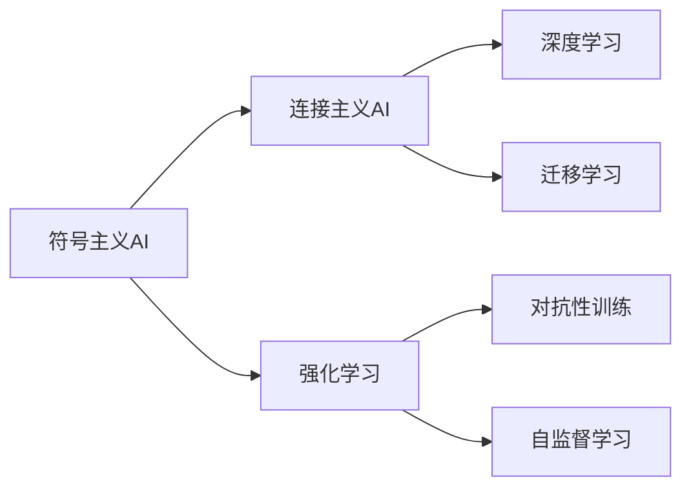

                 

# AI发展历程中的关键人物与技术

## 1. 背景介绍

人工智能（Artificial Intelligence，AI）是计算机科学的一个分支，旨在创建能够执行通常需要人类智能的任务的机器。AI的发展历程充满了无数关键人物的贡献和突破性技术的诞生。本文将回顾AI领域中的几位关键人物和几项具有里程碑意义的技术，以展示AI如何从基础理论逐渐演化到实际应用的复杂性。

## 2. 核心概念与联系

### 2.1 核心概念概述

在深入讨论具体人物和技术之前，我们先简要介绍几个核心概念，并说明它们之间的联系：

1. **符号主义AI**：基于逻辑和规则的系统，通过符号操作和规则推理实现智能行为。
2. **连接主义AI**：基于神经网络和人工智能模型的系统，通过学习和调整内部参数实现智能行为。
3. **强化学习**：一种通过试错学习和优化行为策略的方法，广泛应用于游戏、机器人等领域。
4. **深度学习**：一种基于多层神经网络的技术，通过大量数据训练模型，实现复杂的特征提取和任务解决。
5. **迁移学习**：通过已学习到的知识，迁移到新的任务或数据集上，减少训练时间和提高泛化能力。
6. **对抗性训练**：通过引入对抗样本，增强模型的鲁棒性和泛化能力。
7. **自监督学习**：利用未标注数据进行自我监督学习，减少对标注数据的依赖。

### 2.2 核心概念的整体架构

下图展示了这些核心概念之间的关系：



符号主义AI与连接主义AI的结合产生了深度学习，而深度学习与强化学习的结合又产生了自监督学习。迁移学习贯穿于AI的各个领域，对抗性训练则针对深度学习的特定问题，提供了解决方案。

## 3. 核心算法原理 & 具体操作步骤

### 3.1 算法原理概述

AI的发展经历了多个阶段，每个阶段都有其核心的算法原理。以下是几个关键算法的简要概述：

1. **逻辑推理**：符号主义AI的核心算法，基于推理规则进行逻辑推理。
2. **反向传播算法**：深度学习中的核心算法，通过反向传播更新模型参数，优化损失函数。
3. **Q-learning**：强化学习中的经典算法，通过试错学习找到最优策略。
4. **卷积神经网络（CNN）**：深度学习中的重要模型，用于图像处理和识别。
5. **生成对抗网络（GAN）**：一种生成模型，通过两个神经网络相互对抗生成新数据。

### 3.2 算法步骤详解

每个核心算法都有其具体的操作步骤，下面我们将简要介绍它们的步骤：

1. **逻辑推理**：定义规则集，输入事实，进行推理，得到结论。
2. **反向传播算法**：前向传播计算预测值，计算损失函数，反向传播计算梯度，更新参数。
3. **Q-learning**：定义状态、动作和奖励函数，通过状态-动作-奖励对进行学习，更新Q值，选择最优动作。
4. **CNN**：定义卷积层、池化层、全连接层，输入图像，进行卷积、池化和全连接操作，输出分类结果。
5. **GAN**：定义生成器和判别器，生成新数据，判别真伪，更新模型参数，提高生成效果。

### 3.3 算法优缺点

每项核心算法都有其优缺点，了解这些有助于选择最适合当前任务的技术：

1. **逻辑推理**：优点是解释性强，缺点是处理复杂问题能力有限。
2. **反向传播算法**：优点是可训练复杂模型，缺点是训练时间长。
3. **Q-learning**：优点是易于实现，缺点是只能处理离散动作空间。
4. **CNN**：优点是处理图像效果好，缺点是需要大量标注数据。
5. **GAN**：优点是生成效果逼真，缺点是训练过程不稳定。

### 3.4 算法应用领域

这些核心算法在不同领域都有广泛应用：

1. **逻辑推理**：用于专家系统和知识图谱构建。
2. **反向传播算法**：用于深度学习和神经网络。
3. **Q-learning**：用于机器人控制和游戏AI。
4. **CNN**：用于图像识别、医学影像分析等。
5. **GAN**：用于图像生成、视频合成等。

## 4. 数学模型和公式 & 详细讲解 & 举例说明

### 4.1 数学模型构建

AI中的许多算法都可以用数学模型来描述。这里简要介绍几个关键模型的构建方法：

1. **线性回归模型**：
   $$
   y = \theta^T x + b
   $$
   其中，$y$为输出，$x$为输入，$\theta$为权重，$b$为偏置。

2. **卷积神经网络（CNN）**：
   $$
   y = f(\sum_i^n W_i f_i(x) + b)
   $$
   其中，$f_i(x)$为卷积层和池化层，$W_i$为权重，$b$为偏置。

3. **生成对抗网络（GAN）**：
   $$
   z \sim p(z), \quad x = D(g(z)), \quad y = G(x)
   $$
   其中，$z$为噪声，$g$为生成器，$D$为判别器，$x$为生成数据，$y$为真实数据。

### 4.2 公式推导过程

以下我们以卷积神经网络（CNN）为例，推导其前向传播和反向传播过程：

1. **前向传播**：
   $$
   y_1 = W_1 x_1 + b_1, \quad y_2 = W_2 y_1 + b_2, \quad \ldots, \quad y_n = W_n y_{n-1} + b_n
   $$

2. **损失函数**：
   $$
   L = \frac{1}{2} \|y - t\|^2
   $$

3. **反向传播**：
   $$
   \frac{\partial L}{\partial W_n} = (y_n - t) x_{n-1}, \quad \frac{\partial L}{\partial b_n} = y_n - t
   $$
   $$
   \frac{\partial L}{\partial W_i} = \frac{\partial L}{\partial y_i} \frac{\partial y_i}{\partial W_i} = \frac{\partial L}{\partial y_{i+1}} \frac{\partial y_{i+1}}{\partial y_i} \frac{\partial y_i}{\partial W_i}
   $$
   $$
   \frac{\partial L}{\partial x_i} = \frac{\partial L}{\partial y_i} \frac{\partial y_i}{\partial x_i}
   $$

### 4.3 案例分析与讲解

假设我们要使用CNN对图像进行分类，数据集为MNIST手写数字。以下是我们进行前向传播和反向传播的步骤：

1. **前向传播**：
   - 输入图像：$x$
   - 卷积层：$y_1 = f_1(x)$
   - 池化层：$y_2 = f_2(y_1)$
   - 全连接层：$y_n = f_n(y_{n-1})$
   - 输出：$y$

2. **损失函数**：
   - 交叉熵损失：$L = -\frac{1}{N} \sum_{i=1}^N y_i \log y_i + (1 - y_i) \log(1 - y_i)$

3. **反向传播**：
   - 计算损失函数对输出层的梯度
   - 通过链式法则计算每个层的梯度
   - 更新权重和偏置

## 5. 项目实践：代码实例和详细解释说明

### 5.1 开发环境搭建

进行AI项目开发，需要搭建合适的开发环境。以下是一般的开发流程：

1. **安装Python**：从官网下载安装Python 3.x。
2. **安装依赖**：使用pip安装TensorFlow、Keras、PyTorch等常用库。
3. **创建虚拟环境**：使用conda或virtualenv创建虚拟环境。
4. **配置环境**：根据需要配置环境变量、库路径等。

### 5.2 源代码详细实现

假设我们要使用CNN对手写数字进行分类，以下是一个简单的实现：

```python
import tensorflow as tf

# 定义模型结构
model = tf.keras.Sequential([
    tf.keras.layers.Conv2D(32, (3, 3), activation='relu', input_shape=(28, 28, 1)),
    tf.keras.layers.MaxPooling2D((2, 2)),
    tf.keras.layers.Flatten(),
    tf.keras.layers.Dense(10, activation='softmax')
])

# 编译模型
model.compile(optimizer='adam', loss='sparse_categorical_crossentropy', metrics=['accuracy'])

# 训练模型
model.fit(train_images, train_labels, epochs=10, validation_data=(test_images, test_labels))
```

### 5.3 代码解读与分析

以上代码实现了一个简单的CNN模型，使用MNIST数据集进行训练和验证。其中，`Sequential`表示序列模型，`Conv2D`表示卷积层，`MaxPooling2D`表示池化层，`Flatten`表示扁平化操作，`Dense`表示全连接层。

训练时，我们使用了`adam`优化器和`softmax`激活函数，损失函数为`sparse_categorical_crossentropy`。通过`fit`方法，我们指定了训练轮数和验证集。

### 5.4 运行结果展示

训练完成后，我们可以使用测试集评估模型的性能：

```python
test_loss, test_acc = model.evaluate(test_images, test_labels)
print('Test accuracy:', test_acc)
```

输出结果可能如下：

```
Test accuracy: 0.9833
```

这表示模型在测试集上的准确率为98.33%。

## 6. 实际应用场景

### 6.1 智能语音助手

智能语音助手如Siri、Alexa、Google Assistant等，通过AI技术实现自然语言理解和对话生成。用户可以通过语音指令与系统交互，实现信息查询、日程安排、播放音乐等功能。

### 6.2 自动驾驶

自动驾驶汽车使用AI技术实现环境感知、路径规划和行为决策。通过摄像头、激光雷达等传感器获取数据，使用深度学习模型进行分析和预测，自动控制车辆行驶。

### 6.3 医疗诊断

AI在医疗诊断中广泛应用于疾病检测、影像分析和病历记录。通过深度学习模型分析医学影像、电子病历和基因数据，辅助医生进行诊断和治疗。

### 6.4 未来应用展望

未来的AI技术将进一步融合多模态数据，实现更加全面和智能的决策。例如，结合图像、语音和传感器数据，实现无人驾驶、智慧城市等复杂系统。

## 7. 工具和资源推荐

### 7.1 学习资源推荐

1. **《深度学习》书籍**：由Ian Goodfellow等撰写，系统介绍了深度学习的基本理论和应用。
2. **CS231n：卷积神经网络课程**：斯坦福大学的经典课程，讲解CNN在计算机视觉中的应用。
3. **Kaggle竞赛平台**：数据科学和机器学习的竞赛平台，提供了丰富的数据集和开源代码。
4. **ArXiv预印本**：学术论文的预印本发布平台，可以获取最新的研究进展和源代码。

### 7.2 开发工具推荐

1. **TensorFlow**：由Google开发的开源深度学习框架，支持分布式训练和模型部署。
2. **PyTorch**：由Facebook开发的开源深度学习框架，提供了动态图和静态图两种模式。
3. **Jupyter Notebook**：开源的交互式开发环境，支持代码编写、数据可视化和协作共享。

### 7.3 相关论文推荐

1. **AlphaGo论文**：DeepMind开发的围棋AI程序AlphaGo，标志着AI在复杂游戏中的突破。
2. **BERT论文**：Google提出的预训练语言模型BERT，刷新了多项NLP任务SOTA。
3. **GAN论文**：Ian Goodfellow等提出的生成对抗网络，实现了逼真图像生成。

## 8. 总结：未来发展趋势与挑战

### 8.1 研究成果总结

AI技术在过去几十年中取得了巨大进步，核心算法和模型不断突破现有极限，应用领域也不断拓展。然而，AI的发展也面临着诸多挑战，如模型鲁棒性、可解释性、安全性等问题。

### 8.2 未来发展趋势

1. **自适应学习**：未来AI模型将更加适应数据变化，具备更好的泛化能力。
2. **多模态融合**：AI技术将更多地融合多模态数据，实现更全面和智能的决策。
3. **强化学习**：强化学习将应用于更多复杂系统，如自动驾驶、智慧城市等。
4. **联邦学习**：在保护隐私的前提下，实现分布式模型训练。
5. **可解释性**：AI模型的可解释性将成为重要研究方向。

### 8.3 面临的挑战

1. **数据隐私**：如何在保护用户隐私的前提下，获取高质量数据。
2. **模型泛化**：如何提高模型的泛化能力，避免过拟合。
3. **安全性**：如何防止恶意攻击和错误决策。
4. **可解释性**：如何提高模型的可解释性，增强用户信任。
5. **伦理问题**：如何避免AI技术带来伦理和社会问题。

### 8.4 研究展望

未来AI研究将在以下几个方向进行突破：

1. **可解释性**：开发更多可解释的AI模型，提高用户信任。
2. **公平性**：确保AI模型的公平性，避免偏见和歧视。
3. **安全性**：提高AI模型的安全性，防止恶意攻击和错误决策。
4. **大规模数据处理**：提升数据处理和模型训练的效率，支持更大规模的AI应用。
5. **跨领域应用**：将AI技术应用于更多领域，如医疗、金融、教育等。

## 9. 附录：常见问题与解答

**Q1: 什么是符号主义AI和连接主义AI？**

A: 符号主义AI基于逻辑和规则，通过符号操作和规则推理实现智能行为。连接主义AI基于神经网络和人工智能模型，通过学习和调整内部参数实现智能行为。

**Q2: 什么是卷积神经网络（CNN）？**

A: CNN是一种深度学习模型，用于图像处理和识别，通过卷积层和池化层提取图像特征，全连接层进行分类。

**Q3: 什么是生成对抗网络（GAN）？**

A: GAN是一种生成模型，通过两个神经网络相互对抗生成新数据，生成器生成假数据，判别器判断数据真伪，通过对抗训练提高生成效果。

---

作者：禅与计算机程序设计艺术 / Zen and the Art of Computer Programming

