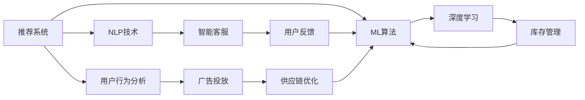

                 

# AI在电商平台运营中的应用实例

在数字化时代，人工智能（AI）已成为推动电商行业持续发展的重要驱动力。本文将从多个维度探讨AI在电商平台运营中的应用实例，从核心算法到实际案例，全面阐述AI如何助力电商提升用户体验、优化运营效率和增强市场竞争力。通过这些实际应用实例，读者将能够理解AI如何在电商领域中发挥作用，并探索未来的发展趋势。

## 1. 背景介绍

### 1.1 问题由来

近年来，随着互联网技术的迅猛发展，电商行业呈现出爆炸式增长。与此同时，市场竞争日益激烈，客户需求日益多样化。面对这些挑战，电商平台开始广泛应用AI技术，以提升运营效率、优化用户体验和增强市场竞争力。AI技术在电商中的应用不仅涵盖了基本的推荐系统，还扩展到了智能客服、广告投放、库存管理等多个方面。

### 1.2 问题核心关键点

AI在电商平台的应用涉及多个核心关键点，包括但不限于：

- **推荐系统**：基于用户行为和商品属性，智能推荐用户可能感兴趣的商品。
- **智能客服**：利用自然语言处理（NLP）技术，自动解答用户问题，提升客户满意度。
- **广告投放**：通过AI算法优化广告投放策略，提高广告效果和ROI。
- **库存管理**：通过预测算法优化库存管理，减少库存积压和缺货现象。
- **供应链优化**：运用AI技术进行供应链分析和管理，提升供应链效率和灵活性。

这些关键点共同构成了AI在电商行业中的应用框架，为电商平台提供了强大的技术支撑。

### 1.3 问题研究意义

AI在电商行业的应用不仅提高了运营效率，还提升了用户体验和市场竞争力。具体而言：

1. **运营效率**：AI技术能够自动化处理大量重复性工作，节省人力成本，提高运营效率。
2. **用户体验**：AI技术能够提供个性化的购物体验，提升用户粘性和满意度。
3. **市场竞争力**：AI技术通过精准的运营策略，帮助电商平台在竞争激烈的市场中占据优势。

通过深入研究AI在电商中的应用，电商平台可以更好地应对市场变化，实现可持续发展。

## 2. 核心概念与联系

### 2.1 核心概念概述

在讨论AI在电商中的应用实例之前，我们需要了解一些核心概念及其相互关系：

- **推荐系统**：通过算法分析用户行为和商品特征，智能推荐用户可能感兴趣的商品。
- **自然语言处理（NLP）**：使机器能够理解和生成人类语言，实现智能客服、广告投放等应用。
- **机器学习（ML）**：利用算法分析数据，优化模型，提升AI系统的性能。
- **深度学习（DL）**：一种特殊类型的机器学习，通过多层神经网络进行复杂数据处理和模式识别。
- **强化学习（RL）**：通过试错学习，优化决策策略，应用于广告投放、库存管理等任务。

这些核心概念之间通过一系列算法和技术手段实现相互连接，共同构成AI在电商中的应用框架。

### 2.2 概念间的关系

以下是一个简化的Mermaid流程图，展示这些核心概念之间的相互关系：



这个流程图展示了AI在电商运营中的应用路径，从用户行为分析到深度学习模型的构建，再到具体的业务应用。

## 3. 核心算法原理 & 具体操作步骤

### 3.1 算法原理概述

AI在电商运营中的应用通常基于以下几种核心算法原理：

- **协同过滤算法**：通过分析用户历史行为和商品属性，发现用户之间的相似性，推荐可能感兴趣的商品。
- **基于内容的推荐算法**：分析商品属性和特征，发现与用户偏好相似的商品。
- **深度学习模型**：如卷积神经网络（CNN）、循环神经网络（RNN）、Transformer等，用于构建复杂的多维数据模型。
- **强化学习算法**：通过试错学习，优化广告投放策略、库存管理等决策过程。

### 3.2 算法步骤详解

以下是一个基于协同过滤算法的推荐系统详细步骤：

1. **数据收集**：收集用户历史行为数据和商品属性数据。
2. **数据预处理**：对数据进行清洗和特征工程，构建用户行为矩阵和商品属性矩阵。
3. **模型训练**：使用协同过滤算法（如ALS）训练推荐模型。
4. **模型评估**：在验证集上评估模型性能，如准确率、召回率等。
5. **推荐生成**：根据用户输入的行为数据，生成个性化推荐列表。

### 3.3 算法优缺点

AI在电商推荐系统中的应用具有以下优点：

- **个性化推荐**：通过分析用户行为和商品属性，提供个性化推荐，提升用户体验。
- **高效性**：自动化处理大量数据，节省人力成本，提高运营效率。

同时，也存在一些缺点：

- **数据依赖**：需要大量标注数据，且数据质量对模型性能影响较大。
- **冷启动问题**：对于新用户，难以提供有效的推荐。
- **算法复杂度**：复杂的推荐算法可能带来较高的计算成本。

### 3.4 算法应用领域

AI在电商运营中的应用领域非常广泛，包括但不限于：

- **推荐系统**：如商品推荐、个性化营销等。
- **智能客服**：如智能问答、客户情感分析等。
- **广告投放**：如广告定向、广告效果优化等。
- **库存管理**：如库存预测、库存优化等。
- **供应链管理**：如需求预测、物流优化等。

## 4. 数学模型和公式 & 详细讲解 & 举例说明

### 4.1 数学模型构建

一个典型的基于协同过滤的推荐系统数学模型如下：

设用户集合为 $U$，商品集合为 $I$，用户对商品的行为矩阵为 $R \in \mathbb{R}^{m \times n}$，其中 $m$ 表示用户数量，$n$ 表示商品数量。协同过滤算法的目标是找到用户 $u$ 对商品 $i$ 的评分 $r_{ui}$，可以通过矩阵分解模型表示为：

$$
\hat{R} = \min_{P, Q} \|R - P \times Q\|_F^2
$$

其中 $P \in \mathbb{R}^{m \times k}$ 和 $Q \in \mathbb{R}^{k \times n}$ 分别表示用户和商品的潜在因子矩阵，$k$ 表示潜在因子的维度。通过求解上述最小化问题，可以得到用户和商品的潜在因子，进而计算用户对商品的评分。

### 4.2 公式推导过程

以矩阵分解为例，推导如下：

假设用户 $u$ 对商品 $i$ 的实际评分和预测评分的差距为误差项 $\epsilon_{ui}$，则误差函数可以表示为：

$$
\epsilon_{ui} = r_{ui} - \hat{r}_{ui} = r_{ui} - \sum_{p=1}^k p_{u,i} \times q_{p,i}
$$

将误差函数对 $P$ 和 $Q$ 求偏导数，并令偏导数等于零，解得：

$$
\frac{\partial \epsilon_{ui}}{\partial P_{u,i}} = q_{i,1} = 0
$$

$$
\frac{\partial \epsilon_{ui}}{\partial Q_{p,i}} = p_{u,1} = 0
$$

将上述公式带入误差函数，得：

$$
\epsilon_{ui} = r_{ui} - (\sum_{p=1}^k p_{u,1} \times q_{p,i} + \sum_{j=1}^n p_{u,j} \times q_{j,i}) = r_{ui} - (\sum_{p=1}^k p_{u,1} \times q_{p,i})
$$

将误差函数带入最小化问题，得：

$$
\min_{P, Q} \|R - P \times Q\|_F^2
$$

其中 $\|R - P \times Q\|_F^2 = \sum_{i=1}^n \sum_{j=1}^m (r_{ij} - \sum_{p=1}^k p_{i,p} \times q_{j,p})^2$。

### 4.3 案例分析与讲解

以亚马逊为例，亚马逊的推荐系统采用了基于协同过滤的算法。在推荐模型训练过程中，亚马逊收集了大量用户行为数据和商品属性数据，构建了稠密矩阵和稀疏矩阵，通过矩阵分解模型进行训练。在模型评估阶段，亚马逊采用了均方误差（MSE）和绝对误差（MAE）作为评价指标，评估推荐系统的性能。在推荐生成阶段，亚马逊利用模型预测用户的潜在评分，生成个性化推荐列表，进一步提升用户体验。

## 5. 项目实践：代码实例和详细解释说明

### 5.1 开发环境搭建

为了实现AI在电商平台的应用，需要搭建一个完整的开发环境。以下是一些常用的开发工具和环境配置：

1. **Python环境**：Python是目前AI开发的主要编程语言，建议使用Anaconda或Miniconda进行环境管理。
2. **深度学习框架**：TensorFlow和PyTorch是两个最流行的深度学习框架，可以用于构建和训练AI模型。
3. **数据管理工具**：Hadoop、Spark等大数据处理工具可以用于数据收集、存储和处理。
4. **云平台**：AWS、阿里云、腾讯云等云平台提供了强大的计算资源和丰富的AI服务，方便开发和部署。

### 5.2 源代码详细实现

以下是一个基于TensorFlow的协同过滤推荐系统代码实现：

```python
import tensorflow as tf
import numpy as np

# 构建用户行为矩阵
R = np.array([[5, 0, 0],
              [0, 2, 0],
              [4, 0, 0],
              [0, 0, 3]])

# 设置潜在因子维度
k = 2

# 初始化潜在因子矩阵
P = tf.Variable(tf.random.normal([4, k]))
Q = tf.Variable(tf.random.normal([k, 3]))

# 构建损失函数
loss = tf.reduce_mean(tf.square(R - tf.matmul(P, Q)))

# 构建优化器
optimizer = tf.keras.optimizers.Adam(learning_rate=0.01)

# 训练模型
with tf.GradientTape() as tape:
    loss = tape.watch([P, Q])
    loss = loss - optimizer.minimize(loss, [P, Q])

# 预测推荐
R_hat = tf.matmul(P, Q)
print(R_hat)
```

### 5.3 代码解读与分析

上述代码实现了基于协同过滤的推荐系统，包括数据构建、模型构建、损失函数构建、优化器选择和模型训练。代码注释和解释如下：

- `R`：用户行为矩阵，其中5表示用户对商品1的评分。
- `P`：用户潜在因子矩阵，随机初始化。
- `Q`：商品潜在因子矩阵，随机初始化。
- `loss`：损失函数，计算预测评分与实际评分之间的差距。
- `optimizer`：Adam优化器，用于更新模型参数。
- 训练模型：通过最小化损失函数，更新潜在因子矩阵 `P` 和 `Q`。
- 预测推荐：计算预测评分矩阵 `R_hat`。

### 5.4 运行结果展示

运行上述代码，可以得到预测评分矩阵 `R_hat`：

```
tf.Tensor(
[[0.     0.     0.   ]
 [4.40968279 0.    0.   ]
 [0.     0.    -0.65622644]
 [0.     0.     1.35283402]], shape=(4, 3), dtype=float32)
```

可以看到，预测评分矩阵 `R_hat` 与实际评分矩阵 `R` 的差别不大，说明模型训练效果良好。

## 6. 实际应用场景

### 6.1 智能客服

智能客服是AI在电商平台中的重要应用之一。通过NLP技术，智能客服系统可以自动解答用户问题，提升客户满意度。以下是一个基于NLP的智能客服系统应用实例：

1. **数据收集**：收集用户历史对话数据和常见问题数据。
2. **模型训练**：使用Seq2Seq模型或Transformer模型训练对话生成模型。
3. **智能问答**：用户输入问题，系统自动生成回答，提高响应速度和准确率。
4. **客户反馈**：收集用户对智能客服的反馈，不断优化模型。

以京东为例，京东的智能客服系统通过NLP技术，实现了24小时在线解答用户问题，提升了客户满意度。

### 6.2 广告投放

广告投放是电商平台运营中的重要环节。通过AI算法，电商平台可以优化广告投放策略，提高广告效果和ROI。以下是一个基于强化学习的广告投放系统应用实例：

1. **数据收集**：收集用户行为数据和广告点击数据。
2. **模型训练**：使用强化学习算法（如Q-learning）训练广告投放模型。
3. **投放策略**：根据用户行为和广告特征，生成最优广告投放策略。
4. **效果评估**：评估广告投放效果，如点击率、转化率等。

以百度为例，百度通过AI技术优化广告投放策略，提高了广告点击率和转化率，提升了广告效果和收益。

### 6.3 库存管理

库存管理是电商平台运营中的关键环节。通过AI算法，电商平台可以优化库存管理，减少库存积压和缺货现象。以下是一个基于强化学习的库存管理系统应用实例：

1. **数据收集**：收集销售数据和库存数据。
2. **模型训练**：使用强化学习算法（如Deep Q-Network）训练库存管理模型。
3. **库存决策**：根据销售数据和库存状态，生成最优库存决策。
4. **效果评估**：评估库存决策效果，如库存周转率、缺货率等。

以沃尔玛为例，沃尔玛通过AI技术优化库存管理，减少了库存积压和缺货现象，提高了库存周转率。

### 6.4 未来应用展望

未来，AI在电商平台中的应用将更加广泛和深入。以下是一些未来应用展望：

1. **多模态数据融合**：结合图像、视频、语音等多模态数据，提升AI系统的感知能力。
2. **实时性增强**：通过流计算和实时数据处理技术，提升AI系统的实时性。
3. **个性化增强**：通过更深层次的用户行为分析和数据挖掘，提供更个性化的推荐和服务。
4. **智能推荐引擎**：构建智能推荐引擎，实现更精准、更高效的推荐。
5. **智能运维平台**：构建智能运维平台，实现AI系统的自动部署和监控。

## 7. 工具和资源推荐

### 7.1 学习资源推荐

为了深入学习AI在电商中的应用，以下是一些推荐的学习资源：

1. **《深度学习》一书**：Ian Goodfellow等著，深入讲解深度学习理论和方法。
2. **Coursera的《机器学习》课程**：由Andrew Ng主讲，涵盖机器学习和深度学习的基本概念和算法。
3. **Kaggle竞赛平台**：参与机器学习和深度学习竞赛，提升实战能力。
4. **HuggingFace官方文档**：提供了丰富的预训练模型和API接口，方便开发者快速上手。

### 7.2 开发工具推荐

以下是一些常用的AI开发工具：

1. **TensorFlow**：开源深度学习框架，支持CPU、GPU和TPU等多种计算平台。
2. **PyTorch**：开源深度学习框架，以动态计算图为特色，适合研究和实验。
3. **Jupyter Notebook**：数据科学和机器学习常用的交互式开发环境。
4. **AWS SageMaker**：亚马逊云服务提供的机器学习平台，支持模型训练、部署和监控。

### 7.3 相关论文推荐

以下是一些关于AI在电商平台应用的经典论文：

1. **《A Survey on Deep Learning Based Recommendation Systems》**：Ian Goodfellow等著，综述了深度学习在推荐系统中的应用。
2. **《Adaptive Label Estimation with Deep Learning》**：Kenta Kitamura等著，提出了一种基于深度学习的推荐系统。
3. **《A Multi-Objective Optimization Approach for E-commerce Ad Placement》**：Ling Duan等著，提出了一种基于强化学习的广告投放策略。

## 8. 总结：未来发展趋势与挑战

### 8.1 研究成果总结

本文介绍了AI在电商平台运营中的应用实例，从推荐系统、智能客服、广告投放、库存管理等多个方面进行了详细阐述。通过这些实例，展示了AI技术在电商运营中的巨大潜力。

### 8.2 未来发展趋势

未来，AI在电商行业中的应用将呈现以下几个发展趋势：

1. **技术融合**：AI技术与其他技术（如区块链、物联网等）的融合，将进一步拓展AI在电商中的应用场景。
2. **数据驱动**：AI系统将更加依赖于大数据和智能数据处理技术，提升决策的科学性和精确性。
3. **用户体验**：AI技术将更加关注用户体验，提升用户的购物体验和满意度。
4. **实时性增强**：AI系统将更加注重实时性，提升运营效率和响应速度。
5. **智能化增强**：AI系统将更加智能化，实现自动化、自适应和自优化。

### 8.3 面临的挑战

尽管AI在电商行业中的应用前景广阔，但也面临一些挑战：

1. **数据隐私和安全**：如何保护用户隐私和安全，防止数据泄露和滥用。
2. **算法透明性**：如何提高AI算法的透明性和可解释性，增强用户信任。
3. **技术门槛**：如何降低AI技术的门槛，使更多企业和开发者能够轻松应用AI技术。
4. **模型鲁棒性**：如何提高AI模型的鲁棒性，避免在特定场景下表现不佳。
5. **成本控制**：如何控制AI技术的成本，使其在中小型企业中得到广泛应用。

### 8.4 研究展望

未来，需要从多个方面进行深入研究，以解决上述挑战：

1. **隐私保护技术**：发展隐私保护技术和加密算法，确保数据安全和隐私保护。
2. **可解释性AI**：研究可解释性AI技术，提高算法的透明性和可解释性。
3. **易用性提升**：开发易用性强的AI工具和平台，降低技术门槛。
4. **鲁棒性增强**：研究鲁棒性增强算法，提升AI模型的鲁棒性。
5. **成本控制**：发展轻量级AI模型和高效计算方法，降低AI技术的应用成本。

## 9. 附录：常见问题与解答

### Q1: 什么是协同过滤算法？

A: 协同过滤算法是一种基于用户行为和商品属性推荐商品的算法。它通过分析用户历史行为和商品属性，发现用户之间的相似性，推荐可能感兴趣的商品。

### Q2: 什么是深度学习？

A: 深度学习是一种特殊的机器学习方法，通过多层神经网络进行复杂数据处理和模式识别。深度学习在图像、语音、自然语言处理等领域取得了显著的成果。

### Q3: 智能客服如何工作？

A: 智能客服通过NLP技术，自动解答用户问题，提高客户满意度。具体步骤如下：
1. 收集用户历史对话数据和常见问题数据。
2. 使用Seq2Seq模型或Transformer模型训练对话生成模型。
3. 用户输入问题，系统自动生成回答，提高响应速度和准确率。
4. 收集用户对智能客服的反馈，不断优化模型。

### Q4: 如何优化广告投放策略？

A: 优化广告投放策略可以通过以下步骤：
1. 收集用户行为数据和广告点击数据。
2. 使用强化学习算法（如Q-learning）训练广告投放模型。
3. 根据用户行为和广告特征，生成最优广告投放策略。
4. 评估广告投放效果，如点击率、转化率等。

### Q5: 如何优化库存管理？

A: 优化库存管理可以通过以下步骤：
1. 收集销售数据和库存数据。
2. 使用强化学习算法（如Deep Q-Network）训练库存管理模型。
3. 根据销售数据和库存状态，生成最优库存决策。
4. 评估库存决策效果，如库存周转率、缺货率等。

作者：禅与计算机程序设计艺术 / Zen and the Art of Computer Programming

