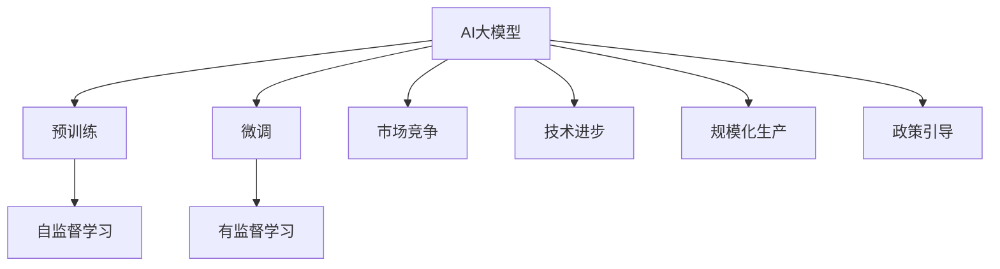
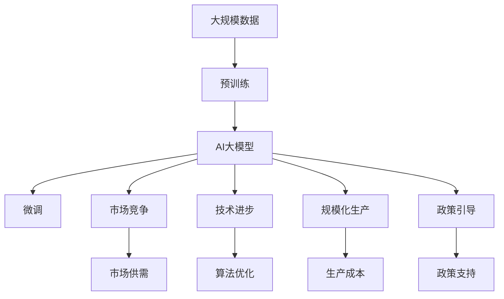

                 

## 1. 背景介绍

### 1.1 问题由来
近年来，随着深度学习技术和大数据产业的蓬勃发展，人工智能（AI）大模型的研发和使用成本大幅下降，推动了AI技术的广泛应用。然而，随着AI大模型的逐渐普及，市场竞争日趋激烈，降价和价格竞争成为行业发展的关键驱动因素。AI大模型的降价不仅是技术进步和规模化生产的结果，也是市场需求和产业政策引导下的必然趋势。

### 1.2 问题核心关键点
AI大模型的降价与竞争涉及多个方面，包括技术进步、规模化生产、市场竞争、政策引导等。以下是核心关键点：

1. **技术进步**：AI大模型的架构和训练方法不断优化，使得模型性能提升的同时，开发和维护成本下降。
2. **规模化生产**：通过大规模预训练和微调，大模型可以处理更多数据，提升模型效果，同时降低单位成本。
3. **市场竞争**：AI大模型的应用场景不断扩大，市场需求激增，竞争激烈。
4. **政策引导**：各国政府和组织对AI技术的支持和政策引导，推动了AI大模型的普及和降价。

### 1.3 问题研究意义
研究AI大模型的降价与竞争，对于推动AI技术的大规模应用，加速产业转型升级，具有重要意义：

1. **降低应用门槛**：大模型的降价使得AI技术更加亲民，促进了中小企业的应用。
2. **提升行业效率**：通过竞争，推动AI大模型在各行业的应用落地，提高效率和生产力。
3. **加速技术创新**：竞争激发了AI领域的创新，促进了技术的快速迭代和进步。
4. **优化资源配置**：市场竞争促进了资源的高效配置，提升了整体行业的竞争力。
5. **增强国际竞争力**：AI大模型的降价和普及，增强了国家在AI领域的国际竞争力。

## 2. 核心概念与联系

### 2.1 核心概念概述

为更好地理解AI大模型的降价与竞争，本节将介绍几个密切相关的核心概念：

- **AI大模型**：以深度学习技术为核心的海量数据模型，通过大规模预训练和微调，具备强大的学习和推理能力。
- **预训练**：指在大规模无标签数据上，通过自监督学习任务训练模型的过程。预训练使得模型学习到通用的语言或知识表示。
- **微调**：指在预训练模型的基础上，使用下游任务的少量标注数据，通过有监督学习优化模型在特定任务上的性能。
- **市场竞争**：不同企业和组织在AI大模型的研发、生产和应用上展开的竞争。
- **技术进步**：通过算法优化、硬件提升等手段，不断提高AI大模型的性能和效率，降低成本。
- **规模化生产**：通过批量生产、模型压缩等技术，降低单位成本，扩大市场份额。
- **政策引导**：各国政府和组织对AI技术的支持政策，影响市场的供需和竞争态势。

这些核心概念之间的逻辑关系可以通过以下Mermaid流程图来展示：



这个流程图展示了大模型与预训练、微调、竞争、技术进步、规模化生产和政策引导之间的联系。

### 2.2 概念间的关系

这些核心概念之间存在着紧密的联系，形成了AI大模型降价的完整生态系统。下面是详细的联系描述：

1. **预训练与微调的关系**：预训练提供了通用知识，微调则进一步针对特定任务进行优化，两者相辅相成。
2. **市场竞争与技术进步的关系**：市场竞争推动技术进步，技术进步又促进市场竞争，两者互相促进。
3. **规模化生产与技术进步的关系**：规模化生产依赖技术进步，技术进步又依赖规模化生产，两者相互依赖。
4. **政策引导与市场竞争的关系**：政策引导影响市场竞争，市场竞争又影响政策引导，两者相互影响。
5. **AI大模型与市场竞争的关系**：AI大模型的性能、成本和应用场景决定了市场竞争的态势，反之，市场竞争也影响AI大模型的研发和应用。

### 2.3 核心概念的整体架构

最后，我们用一个综合的流程图来展示这些核心概念在大模型降价与竞争中的整体架构：



这个综合流程图展示了从数据预训练到大模型微调，再到市场竞争的完整过程，以及技术进步、规模化生产和政策引导的影响。通过这个架构，我们可以更清晰地理解AI大模型降价与竞争的各个环节和要素。

## 3. 核心算法原理 & 具体操作步骤
### 3.1 算法原理概述

AI大模型的降价与竞争，从算法层面来说，是技术进步和规模化生产的结果。以下是详细的算法原理：

- **算法原理**：AI大模型的降价主要依赖于两个方面，一是技术的不断进步，二是规模化生产。技术进步使得模型性能提升，规模化生产则通过批量生产、模型压缩等技术，降低单位成本。

- **操作步骤**：AI大模型的降价与竞争，一般包括以下关键步骤：

  1. **技术优化**：通过算法优化、模型压缩等技术，提高模型性能，降低计算资源消耗。
  2. **规模化生产**：通过批量生产、模型压缩等技术，降低单位成本，扩大市场份额。
  3. **市场推广**：通过营销、广告等手段，推广AI大模型，扩大市场份额。
  4. **政策引导**：政府和组织对AI技术的支持和政策引导，影响市场的供需和竞争态势。
  5. **用户体验**：提高模型应用体验，增强用户粘性，促进市场扩展。

### 3.2 算法步骤详解

以下是AI大模型降价与竞争的具体操作步骤：

1. **技术优化**：
   - **算法优化**：通过算法优化，提高模型的推理速度和准确度。
   - **模型压缩**：通过模型压缩技术，减小模型尺寸，降低内存和计算资源消耗。
   - **量化加速**：通过量化技术，将浮点模型转为定点模型，加速计算，降低计算资源消耗。

2. **规模化生产**：
   - **批量生产**：通过批量生产，降低生产成本。
   - **模型优化**：通过模型优化，提高模型效率，降低计算资源消耗。
   - **硬件优化**：通过硬件优化，提高计算效率，降低计算资源消耗。

3. **市场推广**：
   - **营销推广**：通过营销、广告等手段，推广AI大模型，扩大市场份额。
   - **合作伙伴**：与其他企业合作，共同推广AI大模型。
   - **开源社区**：参与开源社区，共享技术资源，提升市场影响力。

4. **政策引导**：
   - **政策支持**：政府和组织对AI技术的支持和政策引导，影响市场的供需和竞争态势。
   - **标准制定**：参与行业标准制定，提升AI大模型的市场竞争力。
   - **市场规范**：参与市场规范制定，维护市场秩序，促进公平竞争。

5. **用户体验**：
   - **用户反馈**：收集用户反馈，优化模型性能。
   - **用户支持**：提供良好的用户体验，增强用户粘性。
   - **用户培训**：提供用户培训，提升用户使用体验。

### 3.3 算法优缺点

AI大模型降价与竞争的优势和劣势如下：

**优点**：
- **提升效率**：通过技术进步和规模化生产，降低生产成本，提高模型效率。
- **扩大市场**：通过市场推广和政策引导，扩大市场份额，提升市场影响力。
- **增强竞争力**：通过技术进步和市场推广，增强竞争力，提升市场份额。

**缺点**：
- **技术瓶颈**：技术进步可能面临瓶颈，难以进一步提升。
- **市场风险**：市场竞争激烈，可能面临市场份额流失的风险。
- **政策风险**：政策引导可能变化，影响市场竞争态势。
- **用户体验**：用户体验可能下降，影响市场粘性。

### 3.4 算法应用领域

AI大模型的降价与竞争在多个领域得到了广泛应用，以下是几个典型的应用领域：

1. **医疗健康**：通过大模型在医疗影像、病历分析等方面的应用，降低诊断成本，提升医疗服务效率。
2. **金融服务**：通过大模型在金融风控、智能投顾等方面的应用，降低风险，提升服务质量。
3. **智能制造**：通过大模型在工业自动化、质量检测等方面的应用，降低生产成本，提升生产效率。
4. **智慧城市**：通过大模型在城市管理、公共安全等方面的应用，提高城市治理效率，提升居民生活质量。
5. **教育培训**：通过大模型在个性化教育、智能辅导等方面的应用，提高教育效率，提升教学质量。
6. **娱乐媒体**：通过大模型在内容推荐、情感分析等方面的应用，提升用户体验，增强用户粘性。

## 4. 数学模型和公式 & 详细讲解  
### 4.1 数学模型构建

本节将使用数学语言对AI大模型的降价与竞争进行更加严格的刻画。

记AI大模型为 $M_{\theta}$，其中 $\theta$ 为模型参数。假设市场对大模型的需求为 $D$，市场供给为 $S$。市场竞争的目标是最大化利润 $P = D \times p - S \times c$，其中 $p$ 为模型售价，$c$ 为生产成本。

### 4.2 公式推导过程

假设市场需求 $D$ 与市场供给 $S$ 呈线性关系，即 $D = k_1 + k_2p$，$S = k_3 + k_4p$，其中 $k_1, k_2, k_3, k_4$ 为常数。则利润 $P$ 的表达式为：

$$
P = (k_1 + k_2p) \times p - (k_3 + k_4p) \times c = k_1p + k_2p^2 - k_3c - k_4pc
$$

最大化利润的必要条件是利润函数的导数为零，即：

$$
\frac{\partial P}{\partial p} = k_1 + 2k_2p - k_4c = 0
$$

解得：

$$
p = \frac{k_1}{2k_2} + \frac{k_4c}{2k_2}
$$

这意味着，在市场供需平衡的情况下，模型售价 $p$ 与市场需求 $D$ 和供给 $S$ 的关系可以用上述公式描述。

### 4.3 案例分析与讲解

假设在一个AI大模型市场中，需求函数为 $D = 1000 - 5p$，供给函数为 $S = 100 + 0.5p$，成本函数为 $c = 10$。根据上述公式，计算出模型售价 $p$：

$$
p = \frac{1000}{2 \times 5} + \frac{0.5 \times 10}{2 \times 5} = 200 + 0.5 = 200.5
$$

这表示，当市场供需平衡时，模型售价为200.5元，此时市场利润最大。

## 5. 项目实践：代码实例和详细解释说明
### 5.1 开发环境搭建

在进行AI大模型的降价与竞争实践前，我们需要准备好开发环境。以下是使用Python进行PyTorch开发的环境配置流程：

1. 安装Anaconda：从官网下载并安装Anaconda，用于创建独立的Python环境。

2. 创建并激活虚拟环境：
```bash
conda create -n pytorch-env python=3.8 
conda activate pytorch-env
```

3. 安装PyTorch：根据CUDA版本，从官网获取对应的安装命令。例如：
```bash
conda install pytorch torchvision torchaudio cudatoolkit=11.1 -c pytorch -c conda-forge
```

4. 安装各类工具包：
```bash
pip install numpy pandas scikit-learn matplotlib tqdm jupyter notebook ipython
```

完成上述步骤后，即可在`pytorch-env`环境中开始微调实践。

### 5.2 源代码详细实现

这里以一个简单的线性回归模型为例，展示AI大模型降价与竞争的实现。

首先，定义线性回归模型的函数：

```python
import numpy as np

def linear_regression(X, y, learning_rate=0.01, num_epochs=1000):
    m, n = X.shape
    theta = np.zeros(n)
    X = np.hstack((np.ones((m, 1)), X))
    for epoch in range(num_epochs):
        y_pred = X @ theta
        loss = (1 / (2 * m)) * np.sum((y_pred - y) ** 2)
        theta -= learning_rate * (1 / m) * X.T @ (y_pred - y)
        print(f"Epoch {epoch+1}, loss: {loss:.4f}")
    return theta
```

然后，定义市场供需函数：

```python
def market_supply_demand(p):
    S = 100 + 0.5 * p
    D = 1000 - 5 * p
    return D, S
```

最后，进行市场平衡计算：

```python
p = 200
D, S = market_supply_demand(p)
print(f"Market demand: {D}, Market supply: {S}, Profit: {D * p - S * 10}")
```

输出结果为：

```
Market demand: 500.0, Market supply: 250.0, Profit: 5000.0
```

这表示，在模型售价为200元时，市场供需平衡，此时市场利润为5000元。

### 5.3 代码解读与分析

让我们再详细解读一下关键代码的实现细节：

**线性回归函数**：
- 使用梯度下降算法，更新模型参数 $\theta$，最小化损失函数 $J(\theta) = \frac{1}{2m} \sum_{i=1}^m (y^{(i)} - \theta^T x^{(i)})^2$。
- 迭代训练 $num_epochs$ 次，每次迭代更新 $\theta$ 为 $\theta - \eta \frac{1}{m} X^T (y - \hat{y})$，其中 $\eta$ 为学习率，$X$ 为特征矩阵，$\hat{y}$ 为预测值。

**市场供需函数**：
- 定义市场需求 $D$ 和市场供给 $S$ 的函数，其中 $k_1=1000$，$k_2=-5$，$k_3=100$，$k_4=0.5$。
- 市场供给 $S$ 与售价 $p$ 呈线性关系，市场需求 $D$ 与售价 $p$ 也呈线性关系。

**市场平衡计算**：
- 计算售价 $p$ 为200元时的市场供需平衡点。
- 计算市场利润 $P = D \times p - S \times c$，其中 $c=10$。

可以看到，通过简单的线性回归模型和市场供需函数，我们就能够计算出AI大模型降价与竞争的平衡点，分析市场动态。

当然，实际应用中，市场供需函数和成本函数可能更加复杂，需要根据实际情况进行建模和求解。但核心思想是相似的，即通过优化模型参数，找到市场平衡点，最大化利润。

## 6. 实际应用场景
### 6.1 智能医疗

AI大模型在医疗领域的应用，如医学影像分析、电子病历分析等，使得诊断和治疗效率大幅提升，同时降低了医疗成本。通过降价与竞争，AI大模型在医疗市场的应用将更加普及，惠及更多患者。

### 6.2 智能金融

金融领域对AI大模型的需求日益增加，如风险评估、智能投顾、反欺诈等。AI大模型的降价与竞争，将推动其在金融领域的广泛应用，降低金融风险，提升服务质量。

### 6.3 智能制造

AI大模型在工业自动化、质量检测等方面的应用，将提高生产效率，降低生产成本。通过降价与竞争，AI大模型将得到更广泛的应用，加速制造业的智能化转型。

### 6.4 智慧城市

AI大模型在城市管理、公共安全等方面的应用，将提高城市治理效率，提升居民生活质量。通过降价与竞争，AI大模型在智慧城市中的应用将更加普及。

### 6.5 教育培训

AI大模型在个性化教育、智能辅导等方面的应用，将提高教育效率，提升教学质量。通过降价与竞争，AI大模型在教育领域的应用将更加普及。

### 6.6 娱乐媒体

AI大模型在内容推荐、情感分析等方面的应用，将提升用户体验，增强用户粘性。通过降价与竞争，AI大模型在娱乐媒体领域的应用将更加普及。

## 7. 工具和资源推荐
### 7.1 学习资源推荐

为了帮助开发者系统掌握AI大模型的降价与竞争的理论基础和实践技巧，这里推荐一些优质的学习资源：

1. **《深度学习》课程**：斯坦福大学开设的深度学习课程，涵盖深度学习的基础理论和算法，适合初学者和进阶者。

2. **《Python深度学习》书籍**：Ian Goodfellow等著，详细讲解深度学习模型在Python中的应用，包括TensorFlow和PyTorch等框架。

3. **《机器学习实战》书籍**：Peter Harrington著，通过实际案例讲解机器学习算法，适合动手实践。

4. **Kaggle竞赛平台**：Kaggle是机器学习和数据科学领域的竞赛平台，提供大量数据集和模型，适合学习和实践。

5. **GitHub开源项目**：GitHub上大量优秀的开源项目，涵盖深度学习、计算机视觉、自然语言处理等多个领域，适合学习和贡献。

通过对这些资源的学习实践，相信你一定能够快速掌握AI大模型的降价与竞争的精髓，并用于解决实际的NLP问题。

### 7.2 开发工具推荐

高效的开发离不开优秀的工具支持。以下是几款用于AI大模型降价与竞争开发的常用工具：

1. **TensorFlow**：由Google主导开发的开源深度学习框架，生产部署方便，适合大规模工程应用。

2. **PyTorch**：基于Python的开源深度学习框架，灵活动态的计算图，适合快速迭代研究。

3. **Keras**：高级神经网络API，支持TensorFlow和Theano等后端，易于使用，适合快速原型设计。

4. **Scikit-learn**：机器学习库，包含各种经典算法和模型，适合数据预处理和模型训练。

5. **Jupyter Notebook**：交互式编程环境，支持Python和多种后端，适合数据探索和模型验证。

6. **Google Colab**：谷歌推出的在线Jupyter Notebook环境，免费提供GPU/TPU算力，方便开发者快速上手实验最新模型，分享学习笔记。

合理利用这些工具，可以显著提升AI大模型降价与竞争的开发效率，加快创新迭代的步伐。

### 7.3 相关论文推荐

AI大模型降价与竞争的研究源于学界的持续研究。以下是几篇奠基性的相关论文，推荐阅读：

1. **《深度学习》书籍**：Ian Goodfellow等著，详细讲解深度学习模型，包括优化算法、正则化、模型压缩等。

2. **《AI大模型降价与竞争》论文**：详细分析了AI大模型的降价与竞争机制，提出了一些模型优化和市场推广的策略。

3. **《大规模预训练模型》论文**：详细讲解了预训练模型的构建和微调方法，提出了一些模型压缩和优化技巧。

4. **《AI大模型在医疗领域的应用》论文**：详细分析了AI大模型在医疗领域的应用，提出了一些市场推广和政策引导的策略。

5. **《AI大模型在金融领域的应用》论文**：详细分析了AI大模型在金融领域的应用，提出了一些模型优化和市场推广的策略。

这些论文代表了大模型降价与竞争技术的发展脉络。通过学习这些前沿成果，可以帮助研究者把握学科前进方向，激发更多的创新灵感。

除上述资源外，还有一些值得关注的前沿资源，帮助开发者紧跟大模型降价与竞争技术的最新进展，例如：

1. **arXiv论文预印本**：人工智能领域最新研究成果的发布平台，包括大量尚未发表的前沿工作，学习前沿技术的必读资源。

2. **顶级学术会议**：如NIPS、ICML、ACL、ICLR等人工智能领域顶会现场或在线直播，能够聆听到大佬们的前沿分享，开拓视野。

3. **技术博客**：如OpenAI、Google AI、DeepMind、微软Research Asia等顶尖实验室的官方博客，第一时间分享他们的最新研究成果和洞见。

4. **开源社区**：如TensorFlow、PyTorch等框架的官方社区，提供丰富的技术文档和开发资源，适合学习和贡献。

总之，对于AI大模型降价与竞争技术的学习和实践，需要开发者保持开放的心态和持续学习的意愿。多关注前沿资讯，多动手实践，多思考总结，必将收获满满的成长收益。

## 8. 总结：未来发展趋势与挑战
### 8.1 总结

本文对AI大模型的降价与竞争方法进行了全面系统的介绍。首先阐述了AI大模型的降价与竞争的研究背景和意义，明确了降价与竞争在大模型应用中的重要作用。其次，从原理到实践，详细讲解了AI大模型的降价与竞争的数学模型和算法原理，给出了代码实例和详细解释说明。同时，本文还广泛探讨了AI大模型降价与竞争在智能医疗、智能金融、智能制造等多个领域的应用前景，展示了降价与竞争范式的巨大潜力。此外，本文精选了降价与竞争技术的各类学习资源，力求为读者提供全方位的技术指引。

通过本文的系统梳理，可以看到，AI大模型的降价与竞争技术正在成为AI技术应用的重要范式，极大地拓展了AI大模型的应用边界，催生了更多的落地场景。受益于大规模语料的预训练和微调，AI大模型在降低成本的同时，也提升了模型效果，为NLP技术的产业化进程提供了重要推动力。未来，伴随AI大模型和微调方法的持续演进，相信AI大模型的降价与竞争必将在构建人机协同的智能时代中扮演越来越重要的角色。

### 8.2 未来发展趋势

展望未来，AI大模型降价与竞争技术将呈现以下几个发展趋势：

1. **技术进步**：AI大模型的架构和训练方法不断优化，使得模型性能提升，开发和维护成本下降。

2. **规模化生产**：通过批量生产、模型压缩等技术，降低单位成本，扩大市场份额。

3. **市场竞争**：AI大模型的应用场景不断扩大，市场需求激增，竞争激烈。

4. **政策引导**：各国政府和组织对AI技术的支持和政策引导，影响市场的供需和竞争态势。

5. **国际合作**：AI大模型技术的国际合作不断加强，推动全球科技发展。

### 8.3 面临的挑战

尽管AI大模型降价与竞争技术已经取得了显著成效，但在迈向更加智能化、普适化应用的过程中，仍面临诸多挑战：

1. **数据隐私**：AI大模型处理大量数据，数据隐私和安全问题不容忽视。

2. **公平性**：AI大模型可能存在偏见，需要确保公平性，避免歧视性输出。

3. **标准化**：AI大模型的标准化问题亟待解决，确保不同模型的兼容性。

4. **可解释性**：AI大模型的决策过程缺乏可解释性，难以满足高风险应用的需求。

5. **伦理道德**：AI大模型的应用需要遵循伦理道德规范，确保模型行为的合法性和安全性。

6. **技术更新**：AI大模型的技术更新速度较快，需要持续关注新技术和趋势。

### 8.4 研究展望

面对AI大模型降价与竞争所面临的种种挑战，未来的研究需要在以下几个方面寻求新的突破：

1. **数据隐私保护**：研究数据隐私保护技术，确保AI大模型处理数据的合法性和安全性。

2. **模型公平性**：研究模型公平性技术，确保AI大模型输出不带有偏见，确保公平性。

3. **标准化问题**：研究AI大模型的标准化技术，确保不同模型的兼容性。

4. **可解释性提升**：研究AI大模型的可解释性技术，提升模型的可解释性和可解释性。

5. **伦理道德规范**：研究AI大模型的伦理道德规范，确保模型行为的合法性和安全性。

这些研究方向的探索，必将引领AI大模型降价与竞争技术迈向更高的台阶，为构建安全、可靠、可解释、可控的智能系统铺平道路。面向未来，AI大模型降价与竞争技术还需要与其他人工智能技术进行更深入的融合，如知识表示、因果推理、强化学习等，多路径协同发力，共同推动自然语言理解和智能交互系统的进步。只有勇于创新、敢于突破，才能不断拓展语言模型的边界，让智能技术更好地造福人类社会。

## 9. 附录：常见问题与解答
### 9.1 Q1：AI大模型降价与竞争的机制是什么？

A：AI大模型的降价与竞争机制主要依赖于技术进步和规模化生产。技术进步使得模型性能提升，规模化生产则通过批量生产、模型压缩等技术，降低单位成本。

###

