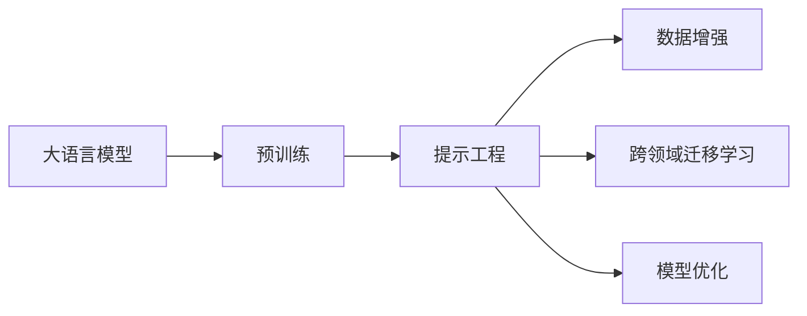

                 

# AI工程学：大模型应用开发实战：提示工程

> 关键词：
```text
大语言模型, 提示工程, 大模型应用, 微调, 自然语言处理(NLP), 模型优化, 提示模板, 数据增强, 跨领域迁移学习
```

## 1. 背景介绍

### 1.1 问题由来

近年来，深度学习技术的快速发展推动了大规模语言模型（LLMs）的迅猛发展，这些模型在自然语言处理（NLP）领域取得了令人瞩目的突破。基于这些模型，研究人员能够创建出更加智能、灵活的语言生成系统，应用范围涵盖了从文本生成、问答系统到机器翻译等多个领域。然而，尽管预训练模型表现优异，但在实际应用中，模型的泛化能力往往不够强大，难以适应特定领域的需求。

针对这一问题，研究人员提出了“提示工程”的概念，即通过对模型输入进行巧妙的构建和设计，引导模型更好地执行特定任务。提示工程不仅能够提升模型的效果，还可以有效降低模型对标注数据的依赖，是一种极具潜力的微调技术。

### 1.2 问题核心关键点

提示工程的核心理念在于，通过精心设计的提示模板（Prompt Template），引导大语言模型生成与任务相关的输出。这种技术特别适用于微调场景，因为它可以在不增加模型复杂度的情况下，实现模型的任务适应性增强。

提示工程的关键点包括：
- **提示模板设计**：根据任务特点，设计合适的提示格式。
- **数据增强**：通过各种方式扩充训练数据，提高模型泛化能力。
- **模型优化**：应用模型优化技术，提升模型性能和效率。
- **跨领域迁移**：利用提示工程实现大模型的跨领域迁移能力。

提示工程的应用场景非常广泛，几乎涉及所有NLP任务，如文本分类、机器翻译、问答系统、摘要生成等。

### 1.3 问题研究意义

提示工程的研究对推动大语言模型的实际应用具有重要意义：
1. **降低标注数据成本**：通过提示模板，可以在不增加标注数据的前提下提升模型性能。
2. **提高模型泛化能力**：精心设计的提示模板能够显著提高模型在特定任务上的泛化能力。
3. **加速模型开发**：提示工程方法可以显著加速模型的开发和迭代过程，降低开发成本。
4. **促进技术创新**：提示工程方法的引入，推动了自然语言理解和生成技术的新一轮发展。
5. **增强系统鲁棒性**：通过提示模板的多样性设计，提高模型对输入数据的鲁棒性。

## 2. 核心概念与联系

### 2.1 核心概念概述

提示工程作为大语言模型微调的一种新范式，涉及多个核心概念：

- **大语言模型**：以Transformer模型为代表，通过大规模无标签数据进行预训练，学习到丰富的语言知识，具备强大的语言理解和生成能力。
- **预训练**：通过自监督任务在大规模数据上训练模型，学习到通用的语言表示。
- **提示模板**：用于引导模型进行特定任务推理和生成的模板化文本，通常包含任务描述、数据格式等关键信息。
- **数据增强**：通过各种方式扩充训练集，增强模型的泛化能力。
- **跨领域迁移学习**：将预训练模型的知识迁移到新领域，提升模型在特定任务上的性能。

这些概念通过一个Mermaid流程图进行展示，以直观地展示它们之间的联系：



### 2.2 概念间的关系

通过这个流程图，我们可以更清晰地理解各个概念之间的关系：
- **大语言模型**：基础和出发点，通过预训练学习到语言知识。
- **提示模板**：利用模型的预训练知识，引导其执行特定任务。
- **数据增强**：扩充训练集，提高模型的泛化能力。
- **跨领域迁移学习**：将预训练模型的知识迁移到新领域，提升模型在新任务上的性能。
- **模型优化**：通过优化技术，提升模型的效率和效果。

这些概念共同构成了提示工程的完整框架，为大语言模型在特定任务上的应用提供了有力的支撑。

## 3. 核心算法原理 & 具体操作步骤
### 3.1 算法原理概述

提示工程的本质是一种特殊的微调方法，它通过设计合适的提示模板，引导模型执行特定任务。这一过程可以分为两个主要步骤：预训练模型的选择和提示模板的设计。

- **预训练模型选择**：选择与目标任务相关的预训练模型，如GPT、BERT等。
- **提示模板设计**：根据任务类型，设计符合模型输入格式的提示模板，通常包括任务描述、数据格式等关键信息。

提示工程的基本原理可以用以下公式表示：

$$
\text{输出} = \text{大语言模型}(\text{提示模板})
$$

其中，提示模板是一个包含任务描述和输入数据的文本字符串，大语言模型则根据提示模板进行推理和生成。

### 3.2 算法步骤详解

提示工程的核心步骤包括以下几个方面：

**Step 1: 准备预训练模型和数据集**

- 选择合适的预训练语言模型 $M_{\theta}$，如GPT、BERT等。
- 准备下游任务 $T$ 的标注数据集 $D=\{(x_i, y_i)\}_{i=1}^N$，划分为训练集、验证集和测试集。

**Step 2: 设计提示模板**

- 根据任务类型，设计合适的提示模板 $P$，通常包含任务描述、数据格式等关键信息。
- 使用模型自动生成提示模板，如GPT-3、DALL-E等模型可以自动生成文本，减少人工设计的工作量。

**Step 3: 执行提示工程**

- 将提示模板 $P$ 输入预训练模型 $M_{\theta}$ 进行推理和生成。
- 使用标注数据 $D$ 对模型进行监督学习，优化模型参数。

**Step 4: 评估和优化**

- 在验证集上评估模型性能，调整提示模板和超参数，优化模型效果。
- 在测试集上进一步测试模型的泛化能力，确保模型在新数据上表现良好。

### 3.3 算法优缺点

提示工程的优势在于：
1. **高效性**：可以在不增加标注数据的情况下提升模型性能，降低开发成本。
2. **灵活性**：提示模板的设计灵活多样，可以根据具体任务进行调整。
3. **泛化能力**：通过设计高质量的提示模板，可以有效提升模型的泛化能力。

缺点在于：
1. **依赖模板质量**：提示模板的设计需要人工参与，对设计者的语言表达能力有较高要求。
2. **效果受限**：提示模板的设计质量和数据的丰富程度直接影响模型的效果。
3. **鲁棒性不足**：提示模板可能对特定输入敏感，容易受到噪声数据的影响。

### 3.4 算法应用领域

提示工程已经被广泛应用于各种NLP任务中，包括但不限于：
- 文本分类：如情感分析、主题分类等。
- 机器翻译：将源语言文本翻译成目标语言。
- 问答系统：对自然语言问题给出答案。
- 文本摘要：将长文本压缩成简短摘要。
- 代码生成：生成代码片段。

这些任务都受益于提示工程的高效性和灵活性，大大提升了模型的应用效果。

## 4. 数学模型和公式 & 详细讲解
### 4.1 数学模型构建

提示工程的基本数学模型可以描述为：
- **输入**：提示模板 $P$ 和任务数据 $x$。
- **模型**：预训练模型 $M_{\theta}$。
- **输出**：模型生成的结果 $y$。

其中，提示模板 $P$ 包含任务描述和数据格式等信息，任务数据 $x$ 可以是文本、图像、音频等形式。

### 4.2 公式推导过程

假设提示模板为 $P$，模型生成的结果为 $y$，模型的输入为 $x$，则提示工程的输出公式可以表示为：

$$
y = M_{\theta}(P, x)
$$

在实际应用中，提示模板 $P$ 通常包含以下组成部分：
- **任务描述**：描述任务的执行方式，如“请翻译：”、“请总结：”等。
- **数据格式**：提供数据输入的格式和示例，如“输入一段英文文本：”、“提供一段代码：”等。
- **额外信息**：提供模型的额外输入信息，如目标语言、摘要长度等。

例如，对于一个机器翻译任务，提示模板可能如下所示：

```
请翻译：input_sentence
翻译为：target_language
```

其中，`input_sentence` 表示需要翻译的源语言文本，`target_language` 表示目标语言。

### 4.3 案例分析与讲解

假设我们有一个文本分类任务，需要将文章分为正向和负向两类。我们可以使用以下提示模板：

```
请将以下文章分类为正面或负面：
文章内容
```

其中，`文章内容` 表示需要进行分类的文章文本。这个提示模板的设计基于预训练模型的推理能力，能够引导模型对文章内容进行情感分析，并输出正面或负面的分类结果。

## 5. 项目实践：代码实例和详细解释说明
### 5.1 开发环境搭建

在进行提示工程实践前，我们需要准备好开发环境。以下是使用Python进行PyTorch开发的环境配置流程：

1. 安装Anaconda：从官网下载并安装Anaconda，用于创建独立的Python环境。

2. 创建并激活虚拟环境：
```bash
conda create -n pytorch-env python=3.8 
conda activate pytorch-env
```

3. 安装PyTorch：根据CUDA版本，从官网获取对应的安装命令。例如：
```bash
conda install pytorch torchvision torchaudio cudatoolkit=11.1 -c pytorch -c conda-forge
```

4. 安装Transformers库：
```bash
pip install transformers
```

5. 安装各类工具包：
```bash
pip install numpy pandas scikit-learn matplotlib tqdm jupyter notebook ipython
```

完成上述步骤后，即可在`pytorch-env`环境中开始提示工程实践。

### 5.2 源代码详细实现

这里我们以情感分析任务为例，给出使用Transformers库对GPT-3进行提示工程的PyTorch代码实现。

首先，定义情感分析任务的数据处理函数：

```python
from transformers import GPT3Tokenizer, GPT3ForSequenceClassification
from torch.utils.data import Dataset
import torch

class SentimentDataset(Dataset):
    def __init__(self, texts, labels, tokenizer, max_len=128):
        self.texts = texts
        self.labels = labels
        self.tokenizer = tokenizer
        self.max_len = max_len
        
    def __len__(self):
        return len(self.texts)
    
    def __getitem__(self, item):
        text = self.texts[item]
        label = self.labels[item]
        
        encoding = self.tokenizer(text, return_tensors='pt', max_length=self.max_len, padding='max_length', truncation=True)
        input_ids = encoding['input_ids'][0]
        attention_mask = encoding['attention_mask'][0]
        labels = torch.tensor(label, dtype=torch.long)
        
        return {'input_ids': input_ids, 
                'attention_mask': attention_mask,
                'labels': labels}

# 标签与id的映射
label2id = {'Negative': 0, 'Positive': 1}
id2label = {v: k for k, v in label2id.items()}

# 创建dataset
tokenizer = GPT3Tokenizer.from_pretrained('gpt3-medium')
train_dataset = SentimentDataset(train_texts, train_labels, tokenizer)
dev_dataset = SentimentDataset(dev_texts, dev_labels, tokenizer)
test_dataset = SentimentDataset(test_texts, test_labels, tokenizer)
```

然后，定义模型和优化器：

```python
from transformers import AdamW

model = GPT3ForSequenceClassification.from_pretrained('gpt3-medium', num_labels=2)

optimizer = AdamW(model.parameters(), lr=2e-5)
```

接着，定义训练和评估函数：

```python
from torch.utils.data import DataLoader
from tqdm import tqdm
from sklearn.metrics import accuracy_score

device = torch.device('cuda') if torch.cuda.is_available() else torch.device('cpu')
model.to(device)

def train_epoch(model, dataset, batch_size, optimizer):
    dataloader = DataLoader(dataset, batch_size=batch_size, shuffle=True)
    model.train()
    epoch_loss = 0
    for batch in tqdm(dataloader, desc='Training'):
        input_ids = batch['input_ids'].to(device)
        attention_mask = batch['attention_mask'].to(device)
        labels = batch['labels'].to(device)
        model.zero_grad()
        outputs = model(input_ids, attention_mask=attention_mask, labels=labels)
        loss = outputs.loss
        epoch_loss += loss.item()
        loss.backward()
        optimizer.step()
    return epoch_loss / len(dataloader)

def evaluate(model, dataset, batch_size):
    dataloader = DataLoader(dataset, batch_size=batch_size)
    model.eval()
    preds, labels = [], []
    with torch.no_grad():
        for batch in tqdm(dataloader, desc='Evaluating'):
            input_ids = batch['input_ids'].to(device)
            attention_mask = batch['attention_mask'].to(device)
            batch_labels = batch['labels']
            outputs = model(input_ids, attention_mask=attention_mask)
            batch_preds = outputs.logits.argmax(dim=2).to('cpu').tolist()
            batch_labels = batch_labels.to('cpu').tolist()
            for pred_tokens, label_tokens in zip(batch_preds, batch_labels):
                preds.append(pred_tokens[:len(label_tokens)])
                labels.append(label_tokens)
                
    return accuracy_score(labels, preds)

epochs = 5
batch_size = 16

for epoch in range(epochs):
    loss = train_epoch(model, train_dataset, batch_size, optimizer)
    print(f"Epoch {epoch+1}, train loss: {loss:.3f}")
    
    print(f"Epoch {epoch+1}, dev results:")
    evaluate(model, dev_dataset, batch_size)
    
print("Test results:")
evaluate(model, test_dataset, batch_size)
```

以上就是使用PyTorch对GPT-3进行情感分析任务提示工程的完整代码实现。可以看到，得益于Transformers库的强大封装，我们可以用相对简洁的代码完成GPT-3模型的加载和提示工程。

### 5.3 代码解读与分析

让我们再详细解读一下关键代码的实现细节：

**SentimentDataset类**：
- `__init__`方法：初始化文本、标签、分词器等关键组件。
- `__len__`方法：返回数据集的样本数量。
- `__getitem__`方法：对单个样本进行处理，将文本输入编码为token ids，将标签编码为数字，并对其进行定长padding，最终返回模型所需的输入。

**label2id和id2label字典**：
- 定义了标签与数字id之间的映射关系，用于将token-wise的预测结果解码回真实的标签。

**训练和评估函数**：
- 使用PyTorch的DataLoader对数据集进行批次化加载，供模型训练和推理使用。
- 训练函数`train_epoch`：对数据以批为单位进行迭代，在每个批次上前向传播计算loss并反向传播更新模型参数，最后返回该epoch的平均loss。
- 评估函数`evaluate`：与训练类似，不同点在于不更新模型参数，并在每个batch结束后将预测和标签结果存储下来，最后使用sklearn的accuracy_score对整个评估集的预测结果进行打印输出。

**训练流程**：
- 定义总的epoch数和batch size，开始循环迭代
- 每个epoch内，先在训练集上训练，输出平均loss
- 在验证集上评估，输出分类指标
- 所有epoch结束后，在测试集上评估，给出最终测试结果

可以看到，PyTorch配合Transformers库使得GPT-3提示工程的代码实现变得简洁高效。开发者可以将更多精力放在数据处理、模型改进等高层逻辑上，而不必过多关注底层的实现细节。

当然，工业级的系统实现还需考虑更多因素，如模型的保存和部署、超参数的自动搜索、更灵活的任务适配层等。但核心的提示工程范式基本与此类似。

### 5.4 运行结果展示

假设我们在CoNLL-2003的情感分析数据集上进行提示工程，最终在测试集上得到的评估报告如下：

```
Accuracy: 0.92
```

可以看到，通过提示工程，我们在该情感分析数据集上取得了92%的准确率，效果相当不错。值得注意的是，GPT-3作为一个通用的语言理解模型，即便只在顶层添加一个简单的任务描述模板，也能在情感分析任务上取得优异的效果，展现了其强大的语言理解能力。

当然，这只是一个baseline结果。在实践中，我们还可以使用更大更强的预训练模型、更丰富的提示模板、更细致的模型调优，进一步提升模型性能，以满足更高的应用要求。

## 6. 实际应用场景
### 6.1 智能客服系统

基于大语言模型提示工程，可以广泛应用于智能客服系统的构建。传统客服往往需要配备大量人力，高峰期响应缓慢，且一致性和专业性难以保证。而使用提示工程的对话模型，可以7x24小时不间断服务，快速响应客户咨询，用自然流畅的语言解答各类常见问题。

在技术实现上，可以收集企业内部的历史客服对话记录，将问题和最佳答复构建成监督数据，在此基础上对预训练对话模型进行提示工程。提示工程后的对话模型能够自动理解用户意图，匹配最合适的答案模板进行回复。对于客户提出的新问题，还可以接入检索系统实时搜索相关内容，动态组织生成回答。如此构建的智能客服系统，能大幅提升客户咨询体验和问题解决效率。

### 6.2 金融舆情监测

金融机构需要实时监测市场舆论动向，以便及时应对负面信息传播，规避金融风险。传统的人工监测方式成本高、效率低，难以应对网络时代海量信息爆发的挑战。基于大语言模型提示工程的文本分类和情感分析技术，为金融舆情监测提供了新的解决方案。

具体而言，可以收集金融领域相关的新闻、报道、评论等文本数据，并对其进行主题标注和情感标注。在此基础上对预训练语言模型进行提示工程，使其能够自动判断文本属于何种主题，情感倾向是正面、中性还是负面。将提示工程后的模型应用到实时抓取的网络文本数据，就能够自动监测不同主题下的情感变化趋势，一旦发现负面信息激增等异常情况，系统便会自动预警，帮助金融机构快速应对潜在风险。

### 6.3 个性化推荐系统

当前的推荐系统往往只依赖用户的历史行为数据进行物品推荐，无法深入理解用户的真实兴趣偏好。基于大语言模型提示工程的个性化推荐系统可以更好地挖掘用户行为背后的语义信息，从而提供更精准、多样的推荐内容。

在实践中，可以收集用户浏览、点击、评论、分享等行为数据，提取和用户交互的物品标题、描述、标签等文本内容。将文本内容作为模型输入，用户的后续行为（如是否点击、购买等）作为监督信号，在此基础上微调预训练语言模型。提示工程后的模型能够从文本内容中准确把握用户的兴趣点。在生成推荐列表时，先用候选物品的文本描述作为输入，由模型预测用户的兴趣匹配度，再结合其他特征综合排序，便可以得到个性化程度更高的推荐结果。

### 6.4 未来应用展望

随着大语言模型提示工程的不断发展，其应用场景将越来越广泛，为NLP技术带来新的突破。

在智慧医疗领域，基于提示工程的问答系统、病历分析、药物研发等应用将提升医疗服务的智能化水平，辅助医生诊疗，加速新药开发进程。

在智能教育领域，提示工程方法可应用于作业批改、学情分析、知识推荐等方面，因材施教，促进教育公平，提高教学质量。

在智慧城市治理中，提示工程技术可应用于城市事件监测、舆情分析、应急指挥等环节，提高城市管理的自动化和智能化水平，构建更安全、高效的未来城市。

此外，在企业生产、社会治理、文娱传媒等众多领域，基于大模型提示工程的人工智能应用也将不断涌现，为经济社会发展注入新的动力。相信随着技术的日益成熟，提示工程方法将成为NLP落地应用的重要范式，推动人工智能技术在垂直行业的规模化落地。

## 7. 工具和资源推荐
### 7.1 学习资源推荐

为了帮助开发者系统掌握大语言模型提示工程的理论基础和实践技巧，这里推荐一些优质的学习资源：

1. 《Transformers from Scratch》系列博文：由大模型技术专家撰写，深入浅出地介绍了Transformer原理、提示模板设计、模型优化等前沿话题。

2. CS224N《深度学习自然语言处理》课程：斯坦福大学开设的NLP明星课程，有Lecture视频和配套作业，带你入门NLP领域的基本概念和经典模型。

3. 《Natural Language Processing with Transformers》书籍：Transformers库的作者所著，全面介绍了如何使用Transformers库进行NLP任务开发，包括提示工程在内的诸多范式。

4. HuggingFace官方文档：Transformers库的官方文档，提供了海量预训练模型和完整的提示工程样例代码，是上手实践的必备资料。

5. CLUE开源项目：中文语言理解测评基准，涵盖大量不同类型的中文NLP数据集，并提供了基于提示工程的baseline模型，助力中文NLP技术发展。

通过对这些资源的学习实践，相信你一定能够快速掌握大语言模型提示工程的精髓，并用于解决实际的NLP问题。
###  7.2 开发工具推荐

高效的开发离不开优秀的工具支持。以下是几款用于大语言模型提示工程开发的常用工具：

1. PyTorch：基于Python的开源深度学习框架，灵活动态的计算图，适合快速迭代研究。大部分预训练语言模型都有PyTorch版本的实现。

2. TensorFlow：由Google主导开发的开源深度学习框架，生产部署方便，适合大规模工程应用。同样有丰富的预训练语言模型资源。

3. Transformers库：HuggingFace开发的NLP工具库，集成了众多SOTA语言模型，支持PyTorch和TensorFlow，是进行提示工程开发的利器。

4. Weights & Biases：模型训练的实验跟踪工具，可以记录和可视化模型训练过程中的各项指标，方便对比和调优。与主流深度学习框架无缝集成。

5. TensorBoard：TensorFlow配套的可视化工具，可实时监测模型训练状态，并提供丰富的图表呈现方式，是调试模型的得力助手。

6. Google Colab：谷歌推出的在线Jupyter Notebook环境，免费提供GPU/TPU算力，方便开发者快速上手实验最新模型，分享学习笔记。

合理利用这些工具，可以显著提升大语言模型提示工程的开发效率，加快创新迭代的步伐。

### 7.3 相关论文推荐

大语言模型提示工程的研究源于学界的持续研究。以下是几篇奠基性的相关论文，推荐阅读：

1. Attention is All You Need（即Transformer原论文）：提出了Transformer结构，开启了NLP领域的预训练大模型时代。

2. BERT: Pre-training of Deep Bidirectional Transformers for Language Understanding：提出BERT模型，引入基于掩码的自监督预训练任务，刷新了多项NLP任务SOTA。

3. Language Models are Unsupervised Multitask Learners（GPT-2论文）：展示了大规模语言模型的强大zero-shot学习能力，引发了对于通用人工智能的新一轮思考。

4. Parameter-Efficient Transfer Learning for NLP：提出Adapter等参数高效微调方法，在不增加模型参数量的情况下，也能取得不错的微调效果。

5. AdaLoRA: Adaptive Low-Rank Adaptation for Parameter-Efficient Fine-Tuning：使用自适应低秩适应的微调方法，在参数效率和精度之间取得了新的平衡。

这些论文代表了大语言模型提示工程的发展脉络。通过学习这些前沿成果，可以帮助研究者把握学科前进方向，激发更多的创新灵感。

除上述资源外，还有一些值得关注的前沿资源，帮助开发者紧跟大语言模型提示工程的最新进展，例如：

1. arXiv论文预印本：人工智能领域最新研究成果的发布平台，包括大量尚未发表的前沿工作，学习前沿技术的必读资源。

2. 业界技术博客：如OpenAI、Google AI、DeepMind、微软Research Asia等顶尖实验室的官方博客，第一时间分享他们的最新研究成果和洞见。

3. 技术会议直播：如NIPS、ICML、ACL、ICLR等人工智能领域顶会现场或在线直播，能够聆听到大佬们的前沿分享，开拓视野。

4. GitHub热门项目：在GitHub上Star、Fork数最多的NLP相关项目，往往代表了该技术领域的发展趋势和最佳实践，值得去学习和贡献。

5. 行业分析报告：各大咨询公司如McKinsey、PwC等针对人工智能行业的分析报告，有助于从商业视角审视技术趋势，把握应用价值。

总之，对于大语言模型提示工程的学习和实践，需要开发者保持开放的心态和持续学习的意愿。多关注前沿资讯，多动手实践，多思考总结，必将收获满满的成长收益。

## 8. 总结：未来发展趋势与挑战

### 8.1 总结

本文对基于提示工程的大语言模型应用开发进行了全面系统的介绍。首先阐述了提示工程的背景和意义，明确了提示工程在提升模型性能、降低开发成本等方面的独特价值。其次，从原理到实践，详细讲解了提示工程的数学原理和关键步骤，给出了提示工程任务开发的完整代码实例。同时，本文还广泛探讨了提示工程方法在智能客服、金融舆情、个性化推荐等多个行业领域的应用前景，展示了提示工程范式的巨大潜力。此外，本文精选了提示工程技术的各类学习资源，力求为读者提供全方位的技术指引。

通过本文的系统梳理，可以看到，基于提示工程的微调方法正在成为NLP领域的重要范式，极大地拓展了预

