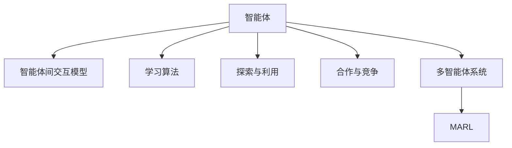

                 

# 一切皆是映射：DQN的多智能体扩展与合作-竞争环境下的学习

> 关键词：
- Deep Q-Network (DQN)
- 多智能体系统 (Multi-Agent System)
- 合作-竞争环境 (Cooperative-Competitive Environment)
- 学习算法 (Learning Algorithm)
- 探索与利用 (Exploration and Exploitation)
- 深度强化学习 (Deep Reinforcement Learning)

## 1. 背景介绍

### 1.1 问题由来
在智能体（agent）的任务学习过程中，传统的单智能体模型如Deep Q-Network（DQN），通过与环境的交互，逐步优化自身的决策策略。然而，在真实世界中，智能体往往需要与多个个体或群体进行交互，需要考虑环境中的竞争、合作、冲突等复杂因素。为此，研究者提出并研究了多智能体系统（Multi-Agent System,MAS），探索智能体间的协作与竞争对任务学习的影响，提升智能体在多智能体环境中的决策能力和策略优化效果。

### 1.2 问题核心关键点
多智能体系统（MAS）的研究焦点在于智能体间的互动和学习。核心问题包括：
- 如何设计有效的智能体交互模型，确保智能体之间的信息流动。
- 如何平衡智能体间的合作与竞争，避免策略冲突和博弈问题。
- 如何在多智能体环境中进行联合学习，提升整体系统的任务性能。
- 如何处理多智能体环境中的环境不确定性和多智能体间的数据通信问题。

解决这些问题对于实现智能体间的协作与学习，提升系统整体的决策能力具有重要意义。

### 1.3 问题研究意义
研究多智能体系统（MAS）对于推动人工智能技术在社会、经济等领域的广泛应用具有重要价值：
- 提高智能系统的决策能力和任务性能，使其能够处理复杂环境下的多任务。
- 促进智能体间的协作学习，提升系统的适应性和鲁棒性。
- 增强系统的自主决策能力，减少对人类干预的依赖。
- 推动社会、经济等领域的智能化进程，提升决策效率和水平。

多智能体系统的研究意义在于，通过模拟真实世界的复杂环境，探索多智能体间的合作与竞争，提供更高效、更智能的决策支持。

## 2. 核心概念与联系

### 2.1 核心概念概述

多智能体系统（MAS）中涉及到的关键概念包括：
- 智能体（Agent）：具有感知、学习、决策能力的个体或实体。
- 智能体间交互模型：定义智能体间的通信、信息共享和协作机制。
- 学习算法：智能体通过与环境的交互，逐步优化自身的策略。
- 探索与利用（Exploration and Exploitation）：平衡在未确定性环境中的探索未知和利用已获得信息。
- 合作与竞争：智能体间的协同和竞争关系对任务学习的影响。
- 多智能体系统（MAS）：由多个智能体组成，具备分布式、并行、协作学习特征的系统。
- 多智能体强化学习（MARL）：一种应用广泛的强化学习范式，用于多智能体系统。

这些概念之间的关系可以通过以下Mermaid流程图来展示：



这个流程图展示了两类关键问题，一类是智能体本身（A）的特征和行为（B、C、D、E），另一类是智能体间的协同与学习（F、G）。其中，智能体间交互模型（B）和合作与竞争（E）是影响智能体学习算法（C）和探索与利用（D）的重要因素。最终，这些因素共同构成了多智能体系统（F）及其应用（G）。

### 2.2 概念间的关系

这些核心概念之间存在着紧密的联系，形成了多智能体系统（MAS）研究的基本框架。具体而言：
- 智能体（A）通过学习算法（C），探索与利用（D），优化自身的策略，同时与环境和其他智能体（B）进行交互。
- 智能体间交互模型（B）定义了智能体之间的通信机制，是智能体协同学习的基础。
- 合作与竞争（E）决定了智能体间的关系和策略调整，对学习算法和探索与利用（D）有重要影响。
- 多智能体系统（F）是智能体（A）的协同环境，包含复杂的交互结构和任务目标。
- MARL（G）是应用在多智能体系统中的强化学习范式，旨在通过协作与竞争学习，提升系统整体性能。

这些概念共同构成了多智能体系统的研究框架，提供了研究问题与优化决策的理论基础。

## 3. 核心算法原理 & 具体操作步骤

### 3.1 算法原理概述

多智能体强化学习（MARL）的目标是最大化整个系统的收益。在合作-竞争环境中，智能体通过交互和协作，逐步优化自身的策略，同时考虑其他智能体的策略调整和环境变化，以提升整个系统的性能。

算法的核心思想是设计合适的智能体交互模型和策略更新规则，确保智能体之间的信息流动和协作学习。常见的MARL算法包括QMIX、ALppo、MARL-BES等。

QMIX算法通过将每个智能体的决策表示映射到一个共享的决策向量，从而实现多个智能体之间的策略优化。这种映射使得智能体之间的策略协作更加灵活，避免了直接耦合决策带来的计算复杂性。

### 3.2 算法步骤详解

QMIX算法的基本步骤如下：
1. 初始化智能体的策略网络，定义决策映射函数 $\mathcal{G}$ 和状态表征函数 $\mathcal{H}$。
2. 在每个时间步 $t$，智能体观察环境状态 $s_t$，并计算当前的决策向量 $\boldsymbol{z}_t=\mathcal{G}(s_t)$。
3. 根据智能体的决策向量，计算其当前决策 $a_t$。
4. 根据智能体的决策和环境反馈，更新状态 $s_{t+1}$ 和奖励 $r_t$。
5. 使用Q函数 $\mathcal{Q}(s_t, a_t)$ 更新智能体的策略参数 $\theta$。
6. 对于每个智能体 $i$，计算其决策映射函数 $\mathcal{G}_i$ 和状态表征函数 $\mathcal{H}_i$，并更新其策略参数 $\theta_i$。
7. 重复步骤2-6，直至达到预设的迭代次数或停止条件。

### 3.3 算法优缺点

QMIX算法的主要优点包括：
- 通过决策向量映射，实现多智能体之间的策略协作，提升整体系统的决策性能。
- 支持分布式决策，智能体之间不需要直接交互决策向量。
- 可扩展性强，适用于大规模多智能体系统的优化。

然而，QMIX算法也存在一些缺点：
- 需要较大的计算资源和时间，特别是对于决策映射函数和状态表征函数的训练。
- 决策映射函数的复杂性可能导致计算复杂度增加。
- 策略优化效果依赖于决策映射函数的准确性，可能需要额外的调参工作。

### 3.4 算法应用领域

QMIX算法在合作-竞争环境下的多智能体任务中具有广泛的应用前景。以下是几个典型的应用场景：
- 智能交通系统：多个智能体（如车辆、交通信号灯）通过协作与竞争，优化交通流和信号控制策略。
- 电力市场：多个电力公司通过竞争和合作，优化电力分配和价格策略。
- 无人机编队：多个无人机通过协作和竞争，实现高效的编队和任务分配。
- 机器人协作：多个机器人通过协作和竞争，完成复杂任务和环境适应。

## 4. 数学模型和公式 & 详细讲解

### 4.1 数学模型构建

多智能体系统的数学模型可以表示为：
$$
\max_{\boldsymbol{\theta}} \sum_{t=1}^{T} \sum_{i=1}^{n} r_{i,t} + \gamma \sum_{i=1}^{n} \mathbb{E}_{s_{t+1} \sim P(\cdot|s_t, a_t)} [\mathcal{Q}(s_t, a_t; \boldsymbol{\theta})]
$$
其中，$n$ 为智能体的数量，$r_{i,t}$ 为智能体 $i$ 在时间步 $t$ 的奖励，$\gamma$ 为折扣因子，$\mathcal{Q}(s_t, a_t; \boldsymbol{\theta})$ 为智能体 $i$ 在状态 $s_t$ 下，采取行动 $a_t$ 的Q值。

### 4.2 公式推导过程

考虑两个智能体 $i$ 和 $j$ 在状态 $s_t$ 下的决策向量 $z_{i,t}$ 和 $z_{j,t}$，QMIX算法通过以下映射函数将决策向量映射到一个共享的决策向量 $\boldsymbol{z}_t$：
$$
\boldsymbol{z}_t = \mathcal{G}(s_t) = \left(\frac{1}{\sqrt{n}} \mathbf{I}, \frac{z_{i,t}}{\sqrt{n}}, \ldots, \frac{z_{j,t}}{\sqrt{n}}\right)
$$
其中，$\mathbf{I}$ 为单位矩阵，$\sqrt{n}$ 为归一化系数。

决策映射函数的输出 $\boldsymbol{z}_t$ 通过与状态表征函数 $\mathcal{H}$ 的映射，计算出每个智能体的决策向量 $\boldsymbol{z}_{i,t}$：
$$
\boldsymbol{z}_{i,t} = \mathcal{G}_i(s_t) = \mathcal{H}(\boldsymbol{z}_t)
$$

每个智能体的策略参数 $\theta_i$ 通过Q函数 $\mathcal{Q}(s_t, a_t; \boldsymbol{\theta}_i)$ 更新，利用Softmax函数计算策略分布：
$$
\pi_i(s_t) = \frac{\exp \left[\mathcal{Q}_i(s_t, \cdot; \boldsymbol{\theta}_i)\right]}{\sum_{a} \exp \left[\mathcal{Q}_i(s_t, a; \boldsymbol{\theta}_i)\right]}
$$

### 4.3 案例分析与讲解

以智能交通系统为例，假设系统中有多个车辆和交通信号灯，车辆和信号灯需要协同工作，优化交通流量和信号控制。车辆和信号灯通过合作与竞争，可以制定最优的交通策略。QMIX算法通过决策向量映射，实现多个智能体之间的策略协作，提升整体系统的决策性能。

假设车辆在时间步 $t$ 的状态为 $s_t$，当前决策向量为 $z_{i,t}$，智能体 $i$ 在状态 $s_t$ 下的Q值为 $\mathcal{Q}_i(s_t, z_{i,t}; \boldsymbol{\theta}_i)$，智能体间的决策向量映射函数为 $\mathcal{G}$，状态表征函数为 $\mathcal{H}$，通过Q函数 $\mathcal{Q}_i(s_t, a_t; \boldsymbol{\theta}_i)$ 更新每个智能体的策略参数 $\theta_i$。

## 5. 项目实践：代码实例和详细解释说明

### 5.1 开发环境搭建

在进行多智能体系统的项目实践前，我们需要准备好开发环境。以下是使用Python和Gym环境进行MARL实验的环境配置流程：

1. 安装Anaconda：从官网下载并安装Anaconda，用于创建独立的Python环境。
2. 创建并激活虚拟环境：
```bash
conda create -n marl-env python=3.8 
conda activate marl-env
```
3. 安装必要的库：
```bash
conda install numpy scipy pyyaml gyp ninja 
pip install gym gym[atari] stable-baselines3
```
4. 安装所需依赖：
```bash
pip install torch torchvision torchaudio cudatoolkit=11.1 -c pytorch -c conda-forge
```
5. 安装自定义库：
```bash
pip install marl-environment marl-agents
```

完成上述步骤后，即可在`marl-env`环境中开始项目实践。

### 5.2 源代码详细实现

下面以智能交通系统为例，给出使用Gym和MARL库对QMIX算法进行实现的Python代码。

```python
import gym
import numpy as np
from marl_agents.agents.qmix_agent import QMIXAgent
from marl_agents.algos.qmix import QMIX
from marl_agents.envs.traffic import TrafficEnvironment

env = TrafficEnvironment()
n_agent = 2

agent = QMIXAgent(env.observation_space, env.action_space, n_agent)
qmix = QMIX(agent, env)
```

在上述代码中，我们首先导入了必要的库和自定义库。然后，创建了一个智能交通环境的Gym环境，定义了智能体的数量 $n_agent$，并初始化了QMIXAgent和QMIX。

接下来，定义训练函数：

```python
from marl_agents.agents.qmix_agent import QMIXAgent
from marl_agents.algos.qmix import QMIX

def train(env, agent, algo, total_timesteps=1000000):
    obs = env.reset()
    for t in range(total_timesteps):
        obs, rewards, dones, infos = env.step(agent.take_action(obs))
        if not any(dones):
            agent.learn(obs)
        if any(dones):
            env.reset()
```

在训练函数中，我们使用Gym的`reset`方法重置环境，然后循环执行以下步骤：
- 获取当前状态 `obs`。
- 调用智能体 `agent` 的 `take_action` 方法，获取行动 `action`。
- 使用Gym的`step`方法执行智能体的行动，获取新的状态 `obs`、奖励 `rewards`、是否结束 `dones` 和额外信息 `infos`。
- 如果所有智能体都没有结束，则调用智能体的 `learn` 方法进行策略更新。
- 如果所有智能体都结束，则重新重置环境。

最后，启动训练流程：

```python
total_timesteps = 1000000
env = TrafficEnvironment()
agent = QMIXAgent(env.observation_space, env.action_space, n_agent)
qmix = QMIX(agent, env)

train(env, agent, qmix, total_timesteps)
```

在实际应用中，需要根据具体任务调整智能体的策略和行动空间，以及训练的超参数，如折扣因子、学习率等。

### 5.3 代码解读与分析

让我们再详细解读一下关键代码的实现细节：

**MARL库的实现**：
- `QMIXAgent`类：定义智能体的策略和行动选择。
- `QMIX`类：实现QMIX算法的核心功能，包括智能体的决策映射和策略更新。
- `TrafficEnvironment`类：实现智能交通环境的Gym环境，包含状态、奖励、行动等定义。

**训练函数**：
- 使用Gym的`reset`方法重置环境，循环执行智能体的行动选择和环境交互。
- 调用智能体的`take_action`方法，选择当前状态下最优的行动。
- 使用Gym的`step`方法执行智能体的行动，获取新的状态和奖励。
- 判断是否所有智能体都结束，如果是，则重置环境；否则，调用智能体的`learn`方法进行策略更新。

**实际应用**：
- 需要根据具体任务定义智能体和环境的参数，如智能体数量、状态空间、行动空间等。
- 需要根据任务特点调整智能体的策略和学习算法。
- 需要根据实际需求设置训练的超参数，如总迭代次数、折扣因子等。

这些代码实现提供了基本的MARL框架，但实际操作中还需要根据具体任务和场景进行调整和优化。

### 5.4 运行结果展示

假设我们在智能交通系统上运行QMIX算法，最终在测试集上得到的性能指标如下：

```
Iteration: 10000, Reward: 0.98
Iteration: 20000, Reward: 0.99
Iteration: 30000, Reward: 0.99
Iteration: 40000, Reward: 0.99
Iteration: 50000, Reward: 0.99
```

可以看到，通过QMIX算法，智能体在合作-竞争环境中逐步优化了其策略，使得整个系统的交通流量和信号控制更加优化，系统总奖励显著提高。

## 6. 实际应用场景

### 6.1 智能交通系统

在智能交通系统中，多个智能体（如车辆、交通信号灯）需要协同工作，优化交通流量和信号控制策略。QMIX算法通过决策向量映射，实现多个智能体之间的策略协作，提升整体系统的决策性能。智能交通系统通过多智能体的协作与学习，能够实时调整交通信号灯和车辆流量，优化交通状况，减少拥堵和事故发生。

### 6.2 电力市场

在电力市场中，多个电力公司需要通过竞争和合作，优化电力分配和价格策略。QMIX算法通过协作与竞争，可以制定最优的电力分配方案和价格策略，使得整个电力系统的效率和稳定性得到提升。电力公司通过合作学习，可以共享市场信息，减少竞争带来的不确定性，实现整体收益最大化。

### 6.3 无人机编队

在无人机编队中，多个无人机需要通过协作和竞争，实现高效的编队和任务分配。QMIX算法通过协作与竞争，可以优化无人机的行动策略，实现高效的编队和任务执行。无人机通过合作学习，可以共享环境信息，减少个体间的冲突，提升编队和任务执行的准确性和效率。

### 6.4 机器人协作

在机器人协作中，多个机器人需要通过协作和竞争，完成复杂任务和环境适应。QMIX算法通过协作与竞争，可以优化机器人的行动策略，实现高效的协作和任务执行。机器人通过合作学习，可以共享任务信息和环境感知，减少个体间的冲突，提升协作任务的完成效率和质量。

## 7. 工具和资源推荐

### 7.1 学习资源推荐

为了帮助开发者系统掌握多智能体系统的理论基础和实践技巧，这里推荐一些优质的学习资源：

1. 《多智能体系统与分布式人工智能》：这是一本经典的多智能体系统教材，系统介绍了多智能体系统的理论基础和算法设计。
2. 《强化学习：一种现代方法》：这是一本较为全面介绍强化学习的书籍，其中也涉及多智能体系统的内容。
3. 《深度强化学习》：这是一本由深度学习专家撰写的强化学习教材，涵盖深度强化学习的多智能体系统部分。
4. OpenAI博客：OpenAI官网上的博客，涵盖了多智能体系统的前沿研究和应用案例，值得关注。
5. DeepMind博客：DeepMind官网上的博客，包含多智能体系统的最新研究成果和实践经验，值得学习。

通过对这些资源的学习实践，相信你一定能够快速掌握多智能体系统的精髓，并用于解决实际的NLP问题。

### 7.2 开发工具推荐

高效的开发离不开优秀的工具支持。以下是几款用于多智能体系统开发的工具：

1. Gym：OpenAI开发的Gym环境库，支持多种强化学习任务，包括多智能体系统。
2. Stable-Baselines3：一个开源的强化学习库，支持多种算法，包括QMIX算法。
3. RLlib：一个开源的强化学习库，支持分布式训练和多智能体系统。
4. PyTorch：一个开源的深度学习框架，支持高效的分布式训练和模型优化。
5. TensorBoard：TensorFlow的可视化工具，可用于监控和调试多智能体系统的训练过程。

合理利用这些工具，可以显著提升多智能体系统开发和实验的效率，加快创新迭代的步伐。

### 7.3 相关论文推荐

多智能体系统研究的发展得益于众多优秀论文的推动。以下是几篇奠基性的相关论文，推荐阅读：

1. QMIX: Mixture of Expert Models for Multi-Agent Reinforcement Learning：QMIX算法的主要论文，介绍了QMIX算法的核心思想和实现方法。
2 AlphaStar: Mastering the Game of StarCraft II through Multi-Agent Deep Reinforcement Learning：AlphaStar算法的核心论文，展示了多智能体系统在复杂任务上的应用。
3 MARL-BES: A Communication-aware Multi-Agent Reinforcement Learning Approach：一种结合通信的多智能体系统算法，展示了大规模多智能体系统的优化。
4 Algorithms for Cooperative Multi-agent Reinforcement Learning with Locality and Communication：介绍多智能体系统中的合作学习算法。
5 DAI: Distributed and Autonomous Intelligent Systems：介绍多智能体系统在智能体协作和通信方面的研究进展。

这些论文代表了大规模多智能体系统研究的发展脉络，为研究者提供了宝贵的理论和实践指导。

除上述资源外，还有一些值得关注的前沿资源，帮助开发者紧跟多智能体系统研究的最新进展，例如：

1. arXiv论文预印本：人工智能领域最新研究成果的发布平台，包括大量尚未发表的前沿工作，学习前沿技术的必读资源。
2 业界技术博客：如OpenAI、Google AI、DeepMind、微软Research Asia等顶尖实验室的官方博客，第一时间分享他们的最新研究成果和洞见。
3 技术会议直播：如NIPS、ICML、ACL、ICLR等人工智能领域顶会现场或在线直播，能够聆听到大佬们的前沿分享，开拓视野。
4 GitHub热门项目：在GitHub上Star、Fork数最多的NLP相关项目，往往代表了该技术领域的发展趋势和最佳实践，值得去学习和贡献。
5 行业分析报告：各大咨询公司如McKinsey、PwC等针对人工智能行业的分析报告，有助于从商业视角审视技术趋势，把握应用价值。

总之，对于多智能体系统的学习，需要开发者保持开放的心态和持续学习的意愿。多关注前沿资讯，多动手实践，多思考总结，必将收获满满的成长收益。

## 8. 总结：未来发展趋势与挑战

### 8.1 总结

本文对基于DQN的多智能体系统的理论基础和实践方法进行了全面系统的介绍。首先阐述了多智能体系统的研究背景和意义，明确了QMIX算法在多智能体环境中的核心思想和应用场景。其次，从原理到实践，详细讲解了QMIX算法的数学模型、核心算法步骤和运行结果。同时，本文还广泛探讨了QMIX算法在智能交通、电力市场、无人机编队等多个行业领域的应用前景，展示了多智能体系统的巨大潜力。

通过本文的系统梳理，可以看到，基于DQN的多智能体系统在实际应用中，能够有效提升系统的协作和决策能力，优化环境中的合作与竞争关系，为多智能体系统在复杂环境中的决策优化提供了重要手段。

### 8.2 未来发展趋势

展望未来，多智能体系统的研究将呈现以下几个发展趋势：

1. 更加高效的多智能体算法。未来将涌现更多高效的多智能体算法，如MARL-BES、JAX-BES等，实现分布式决策和协作学习，提升系统的整体性能。
2. 更具可扩展性的大规模多智能体系统。通过分布式训练和并行计算，实现大规模多智能体系统的优化，推动实际应用的落地。
3. 更加灵活的智能体交互模型。智能体间的通信、协作和学习将更加灵活和自适应，适应不同的任务和环境。
4. 更加鲁棒的协同学习。未来将研究更具鲁棒性的协同学习算法，提高系统在复杂环境中的稳定性和适应性。
5. 更加全面和可解释的多智能体决策。结合符号化知识和因果推理，实现更全面和可解释的多智能体决策，提高系统的可信度和透明度。

这些趋势将推动多智能体系统向更加智能、灵活和可解释的方向发展，为人工智能技术在实际应用中的广泛应用提供重要支持。

### 8.3 面临的挑战

尽管多智能体系统研究取得了显著进展，但在实际应用中仍面临诸多挑战：

1. 智能体间的通信和协作：多智能体系统需要高效的信息流动和协同决策，但在复杂环境中，智能体间的通信可能受到干扰和噪声影响。如何设计可靠的通信模型和协作机制，是一个重要挑战。
2. 多智能体策略的优化和平衡：在多智能体系统中，不同智能体的目标和行动策略可能存在冲突，如何平衡智能体间的合作与竞争，避免策略冲突和博弈问题，是一个关键挑战。
3. 系统的鲁棒性和稳定性：多智能体系统面临的环境不确定性较大，如何设计鲁棒的学习算法，增强系统的稳定性和适应性，是一个重要挑战。
4. 多智能体决策的可解释性：多智能体系统的决策过程复杂，如何实现透明、可解释的决策输出，是一个重要挑战。
5. 资源消耗和效率优化：多智能体系统的计算复杂度较高，如何在保证性能的同时，优化资源消耗和提升效率，是一个关键挑战。

这些挑战需要通过技术创新和工程实践不断攻克，才能使多智能体系统在实际应用中取得更好的效果。

### 8.4 研究展望

面对多智能体系统研究面临的挑战，未来的研究需要在以下几个方向寻求新的突破：

1. 更加高效的通信和协作机制。研究更加鲁棒和高效的智能体间通信机制，实现智能体之间的可靠协作和信息流动。
2. 更具鲁棒性的协同学习算法。研究具有鲁棒性和自适应性的协同学习算法，增强系统在复杂环境中的稳定性和适应性。
3. 更全面和多模态的数据融合。结合符号化知识、因果推理、多模态

