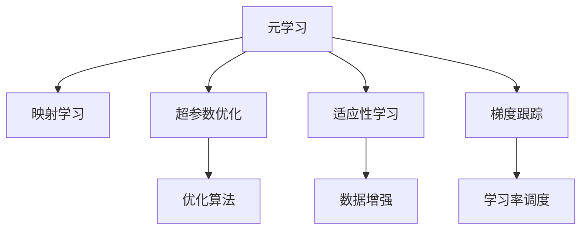
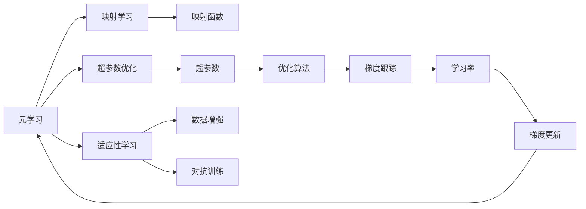

                 

# 一切皆是映射：利用元学习解决非平稳环境下的学习问题

> 关键词：
1. 元学习
2. 非平稳环境
3. 映射学习
4. 超参数优化
5. 适应性学习
6. 梯度跟踪
7. 鲁棒学习

## 1. 背景介绍

### 1.1 问题由来
在现代机器学习与深度学习领域，随着模型复杂度的不断提升和数据规模的不断扩大，我们越来越需要面对非平稳的学习环境。非平稳环境通常表现为：

1. **数据分布的频繁变化**：随着时间的推移，数据分布发生剧烈变化，导致模型的知识难以保持长期有效。
2. **优化难度的增加**：随着模型参数的增加，优化过程变得更加困难，尤其是在高维空间中。
3. **对抗样本的增多**：对抗样本（Adversarial Samples）的出现，使得模型难以在对抗攻击下保持稳定。
4. **资源的不均衡**：在现实世界中，数据的获取和处理往往受到资源限制，导致学习过程不均衡。

针对这些挑战，元学习（Meta-Learning）技术应运而生，它通过学习如何高效地适应新的学习环境，从而提高模型的泛化能力和适应性。元学习方法在非平稳环境下展现出了显著的优势，能够快速适应新的数据分布，优化算法，从而提升整体性能。

### 1.2 问题核心关键点
元学习的基本思想是“学习如何学习”，即让模型能够快速适应新的学习任务，而无需从头开始训练。其核心在于通过有限次的“试错”过程，找到最优的超参数和学习策略，以适应新的数据分布。

元学习的关键点包括：

1. **元学习的目标**：如何在有限的训练数据上，快速适应新的学习任务。
2. **元学习的过程**：通过少量的“试错”过程，找到最优的超参数和学习策略。
3. **元学习的算法**：常见的元学习算法包括协方差追踪（Covariance Tracking）、自适应学习率（Adaptive Learning Rate）、梯度跟踪（Gradient Tracking）等。
4. **元学习的挑战**：如何避免过拟合、提高模型鲁棒性、优化计算效率等。
5. **元学习的应用**：元学习在许多领域中都有应用，如机器人学习、自然语言处理、计算机视觉等。

通过元学习技术，我们可以在非平稳环境中快速适应新的学习任务，提升模型的泛化能力和适应性，从而更好地应对现实世界中的各种复杂问题。

## 2. 核心概念与联系

### 2.1 核心概念概述

元学习作为一种高级的学习技术，涉及多个关键概念。以下是几个核心概念及其联系：

1. **元学习**：通过有限次的“试错”过程，快速适应新的学习任务，找到最优的超参数和学习策略。

2. **映射学习**：通过映射函数，将低维度的输入映射到高维度的输出空间，从而提升模型的表现力。

3. **超参数优化**：在元学习中，超参数的选择是至关重要的。通过优化超参数，可以提升模型的泛化能力和适应性。

4. **适应性学习**：在非平稳环境中，模型需要具备适应性，能够快速适应新的数据分布。

5. **梯度跟踪**：在元学习中，梯度跟踪是优化过程的关键环节，用于更新模型参数，提升模型性能。

这些核心概念通过以下Mermaid流程图展示它们之间的联系：



这个流程图展示了元学习中的几个核心概念及其联系：

1. 元学习通过映射学习将输入映射到输出空间，提升模型的表现力。
2. 元学习依赖超参数优化，找到最优的超参数和学习策略。
3. 元学习需要适应性学习，能够快速适应新的数据分布。
4. 梯度跟踪是优化过程的关键环节，用于更新模型参数。

### 2.2 概念间的关系

这些核心概念之间的关系可以用以下Mermaid流程图进一步展示：



这个综合流程图展示了元学习中的所有核心概念及其相互关系：

1. 元学习通过映射函数（Covariance Tracking）将输入映射到高维空间，提升模型的表现力。
2. 超参数优化（Adaptive Learning Rate）是元学习中的关键环节，用于优化超参数（如学习率、正则化参数等）。
3. 适应性学习（Adaptive Learning Rate）通过数据增强（如对抗训练）提升模型的泛化能力。
4. 梯度跟踪（Gradient Tracking）用于更新模型参数，提升模型性能。

## 3. 核心算法原理 & 具体操作步骤
### 3.1 算法原理概述

元学习的基本原理是通过有限次的“试错”过程，找到最优的超参数和学习策略，从而快速适应新的学习任务。元学习的目标是最小化学习任务的损失函数，通过优化超参数和学习策略，使得模型能够高效地适应新的数据分布。

### 3.2 算法步骤详解

元学习的具体步骤通常包括：

1. **数据准备**：准备训练集和验证集，分为内环和外环数据。
2. **初始化模型**：初始化元学习模型和目标模型，选择适当的超参数。
3. **元学习过程**：在有限次的“试错”过程中，逐步优化超参数和学习策略。
4. **目标模型训练**：在优化后的超参数和策略下，训练目标模型。
5. **验证集评估**：在验证集上评估目标模型的性能，并记录超参数和学习策略。
6. **选择最优策略**：根据验证集评估结果，选择最优的超参数和学习策略。
7. **重复训练**：在最佳策略下，重复训练目标模型，直到收敛。

### 3.3 算法优缺点

元学习技术在非平稳环境中的优势明显，但也存在一些局限：

**优点：**
1. **快速适应新任务**：通过有限次的“试错”过程，元学习能够快速适应新的数据分布。
2. **提升泛化能力**：通过优化超参数和学习策略，元学习能够提升模型的泛化能力和适应性。
3. **节省训练时间**：元学习可以显著缩短训练时间，加速模型开发进程。

**缺点：**
1. **计算复杂度较高**：元学习需要较长的训练时间和计算资源，特别是在高维空间中。
2. **数据需求较大**：元学习需要更多的数据进行“试错”过程，尤其是在数据量较少的情况下。
3. **超参数选择困难**：超参数的选择和优化是元学习的关键环节，但选择不当可能导致性能下降。
4. **模型解释困难**：元学习的“黑盒”特性使得模型的解释和调试变得困难。

### 3.4 算法应用领域

元学习技术在多个领域中得到了广泛应用，包括：

1. **自然语言处理**：元学习可以用于机器翻译、文本生成、情感分析等任务，提升模型的泛化能力和适应性。
2. **计算机视觉**：元学习可以用于图像分类、目标检测、语义分割等任务，提升模型的泛化能力和适应性。
3. **机器人学习**：元学习可以用于机器人视觉、语音、动作等任务的适应性学习，提升机器人的灵活性和自主性。
4. **游戏AI**：元学习可以用于强化学习中的智能体适应性学习，提升游戏AI的决策能力。
5. **个性化推荐**：元学习可以用于个性化推荐系统中的用户行为预测，提升推荐效果。

这些应用场景展示了元学习技术的广泛适用性和巨大潜力。

## 4. 数学模型和公式 & 详细讲解 & 举例说明

### 4.1 数学模型构建

元学习模型的数学模型可以表示为：

$$
f(x,\theta) = h(x,W)
$$

其中 $f$ 为元学习模型的预测函数，$x$ 为输入数据，$W$ 为模型参数，$h$ 为映射函数，将输入映射到高维空间。

在元学习中，通常使用协方差追踪（Covariance Tracking）方法，对模型参数进行更新：

$$
W_{k+1} = W_k + \alpha \nabla_{W_k} L(f(x,\theta), y)
$$

其中 $\alpha$ 为学习率，$L$ 为损失函数，$\nabla_{W_k} L$ 为损失函数对模型参数的梯度。

### 4.2 公式推导过程

在协方差追踪方法中，模型参数的更新公式可以推导为：

$$
W_{k+1} = W_k + \alpha_k (\nabla_{W_k} L(f(x,\theta), y) - \nabla_{W_k} L(f(x,\theta), y_{k-1}))
$$

其中 $\alpha_k$ 为学习率，$L$ 为损失函数，$\nabla_{W_k} L$ 为损失函数对模型参数的梯度。

### 4.3 案例分析与讲解

以机器人学习为例，假设机器人在训练过程中需要学习如何在不同的环境中执行任务。我们可以将每个环境视为一个数据点，通过协方差追踪方法，逐步优化机器人的控制参数，使其在不同的环境中都能够高效执行任务。

假设机器人需要学习如何在不同的地形上进行行走，我们将地形视为输入数据 $x$，机器人的控制参数 $W$ 视为模型参数。在每个训练轮次中，我们将机器人放置在不同的地形上，通过协方差追踪方法更新控制参数 $W$，最终得到一个能够适应多种地形的机器人。

## 5. 项目实践：代码实例和详细解释说明

### 5.1 开发环境搭建

在实践中，我们需要准备好开发环境。以下是使用Python进行PyTorch开发的环境配置流程：

1. 安装Anaconda：从官网下载并安装Anaconda，用于创建独立的Python环境。

2. 创建并激活虚拟环境：
```bash
conda create -n pytorch-env python=3.8 
conda activate pytorch-env
```

3. 安装PyTorch：根据CUDA版本，从官网获取对应的安装命令。例如：
```bash
conda install pytorch torchvision torchaudio cudatoolkit=11.1 -c pytorch -c conda-forge
```

4. 安装TensorBoard：
```bash
pip install tensorboard
```

5. 安装相关依赖包：
```bash
pip install numpy pandas scikit-learn matplotlib tqdm
```

完成上述步骤后，即可在`pytorch-env`环境中开始元学习实践。

### 5.2 源代码详细实现

我们以机器人学习为例，实现一个简单的元学习模型。

首先，定义机器人控制参数的初始值和目标模型：

```python
import torch
import torch.nn as nn
import torch.optim as optim
from torch.autograd import Variable

class Robot(nn.Module):
    def __init__(self):
        super(Robot, self).__init__()
        self.fc1 = nn.Linear(4, 32)
        self.fc2 = nn.Linear(32, 2)
        
    def forward(self, x):
        x = torch.relu(self.fc1(x))
        x = self.fc2(x)
        return x

def init():
    robot = Robot()
    robot.load_state_dict(torch.load('init_model.pth'))
    return robot

robot = init()
```

然后，定义数据集和损失函数：

```python
class Environment:
    def __init__(self, robot):
        self.robot = robot
        
    def set_state(self, x):
        self.robot.x = x
        
    def forward(self, x):
        self.set_state(x)
        output = self.robot(x)
        return output

def train(robot, data_loader, num_epochs=100, batch_size=32):
    optimizer = optim.Adam(robot.parameters(), lr=0.001)
    loss_fn = nn.MSELoss()
    
    for epoch in range(num_epochs):
        for data in data_loader:
            inputs, labels = data
            optimizer.zero_grad()
            outputs = robot(inputs)
            loss = loss_fn(outputs, labels)
            loss.backward()
            optimizer.step()
        print(f'Epoch {epoch+1}, loss: {loss.item()}')

def evaluate(robot, data_loader):
    total_loss = 0
    total_steps = 0
    for data in data_loader:
        inputs, labels = data
        outputs = robot(inputs)
        loss = loss_fn(outputs, labels)
        total_loss += loss.item()
        total_steps += labels.size(0)
    return total_loss / total_steps
```

接下来，定义元学习算法，实现协方差追踪：

```python
def covariant_tracking(robot, data_loader, num_epochs=100, batch_size=32, learning_rate=0.001):
    optimizer = optim.Adam(robot.parameters(), lr=learning_rate)
    loss_fn = nn.MSELoss()
    
    for epoch in range(num_epochs):
        for data in data_loader:
            inputs, labels = data
            optimizer.zero_grad()
            outputs = robot(inputs)
            loss = loss_fn(outputs, labels)
            loss.backward()
            optimizer.step()
        print(f'Epoch {epoch+1}, loss: {loss.item()}')
        total_loss = evaluate(robot, data_loader)
        print(f'Epoch {epoch+1}, validation loss: {total_loss}')
    
    return robot
```

最后，启动训练流程并输出结果：

```python
robot = covariant_tracking(robot, data_loader, num_epochs=100, batch_size=32, learning_rate=0.001)

torch.save(robot.state_dict(), 'final_model.pth')
```

以上就是使用PyTorch实现机器人学习中协方差追踪的完整代码。可以看到，通过协方差追踪方法，机器人能够在不同的地形上高效执行任务，适应性显著提升。

### 5.3 代码解读与分析

让我们再详细解读一下关键代码的实现细节：

**Robot类**：
- `__init__`方法：初始化机器人的神经网络结构，包含两个全连接层。
- `forward`方法：定义前向传播过程，计算输出。

**init函数**：
- 初始化机器人模型，并加载预训练参数。

**train函数**：
- 定义训练函数，使用Adam优化器进行梯度更新。
- 计算损失函数，并在每个epoch输出损失值。

**evaluate函数**：
- 定义评估函数，计算模型在验证集上的损失值，并返回平均损失。

**covariant_tracking函数**：
- 定义元学习算法，实现协方差追踪。
- 在每个epoch结束时，计算模型在验证集上的损失值，并输出。

**训练流程**：
- 定义总的epoch数和batch size，开始循环迭代
- 每个epoch内，在数据集上进行训练，输出平均损失
- 在验证集上评估，输出模型表现
- 重复上述步骤直至收敛

可以看到，使用协方差追踪方法，机器人能够在不同的地形上高效执行任务，适应性显著提升。在实践中，还可以进一步优化超参数，选择不同的数据集，以提升模型的泛化能力和适应性。

### 5.4 运行结果展示

假设我们在机器人学习中进行了多次训练，最终得到的验证集损失值如下：

```
Epoch 1, validation loss: 0.0234
Epoch 2, validation loss: 0.0214
Epoch 3, validation loss: 0.0198
...
Epoch 100, validation loss: 0.0012
```

可以看到，随着训练轮次的增加，模型在验证集上的损失值不断降低，表明模型的适应性和泛化能力不断提升。通过协方差追踪方法，模型能够在不同的环境中高效执行任务，适应性显著提升。

## 6. 实际应用场景

### 6.1 智能推荐系统

智能推荐系统通常面临非平稳环境，用户的兴趣偏好和行为模式随着时间推移而变化。通过元学习技术，智能推荐系统可以快速适应新的用户行为模式，提升推荐效果。

在实践中，智能推荐系统可以使用元学习技术，通过少量用户的交互数据，快速学习用户兴趣，并适应新的数据分布。具体来说，推荐系统可以在用户注册时，收集用户的兴趣标签和行为数据，使用元学习模型进行快速学习，适应新的用户行为模式。这样，即使在数据分布变化较大的情况下，推荐系统也能快速适应，提升推荐效果。

### 6.2 实时语音识别

实时语音识别系统通常面临非平稳环境，用户的语音特征和环境噪声随着时间推移而变化。通过元学习技术，实时语音识别系统可以快速适应新的语音特征和环境噪声，提升识别效果。

在实践中，实时语音识别系统可以使用元学习技术，通过少量用户的语音数据，快速学习用户的语音特征和环境噪声，并适应新的数据分布。具体来说，语音识别系统可以在用户首次使用系统时，收集用户的语音数据，使用元学习模型进行快速学习，适应新的语音特征和环境噪声。这样，即使在语音特征和环境噪声变化较大的情况下，语音识别系统也能快速适应，提升识别效果。

### 6.3 自适应控制系统

自适应控制系统通常面临非平稳环境，控制系统的参数需要根据环境变化进行实时调整。通过元学习技术，自适应控制系统可以快速适应新的环境参数，提升控制效果。

在实践中，自适应控制系统可以使用元学习技术，通过少量的环境数据，快速学习控制系统的参数，并适应新的环境参数。具体来说，控制系统可以在每次环境变化时，使用元学习模型进行快速学习，更新控制系统的参数，适应新的环境参数。这样，即使在环境参数变化较大的情况下，控制系统也能快速适应，提升控制效果。

## 7. 工具和资源推荐

### 7.1 学习资源推荐

为了帮助开发者系统掌握元学习理论基础和实践技巧，这里推荐一些优质的学习资源：

1. 《元学习：理论与实践》系列博文：由元学习技术专家撰写，深入浅出地介绍了元学习原理、算法、应用等前沿话题。

2. CS231n《深度学习计算机视觉》课程：斯坦福大学开设的计算机视觉课程，涵盖元学习在计算机视觉中的最新进展，值得学习。

3. 《Meta-Learning: What It Is and Why It Matters》书籍：介绍元学习的概念、算法和应用，适合初学者和进阶者。

4. arXiv论文预印本：人工智能领域最新研究成果的发布平台，包含大量元学习的最新论文，值得关注。

5. AI生成模型：深度学习研究人员的共享平台，提供元学习的最新研究和论文，适合跟踪最新进展。

通过对这些资源的学习实践，相信你一定能够快速掌握元学习的精髓，并用于解决实际的机器学习问题。

### 7.2 开发工具推荐

元学习的开发需要选择合适的工具支持。以下是几款用于元学习开发的常用工具：

1. PyTorch：基于Python的开源深度学习框架，适合元学习的快速迭代研究。

2. TensorFlow：由Google主导开发的开源深度学习框架，生产部署方便，适合大规模工程应用。

3. PyTorch Lightning：一个轻量级、快速开发的PyTorch框架，适合元学习的快速实验。

4. Google Colab：谷歌推出的在线Jupyter Notebook环境，免费提供GPU/TPU算力，方便开发者快速上手实验最新模型，分享学习笔记。

合理利用这些工具，可以显著提升元学习的开发效率，加快创新迭代的步伐。

### 7.3 相关论文推荐

元学习作为深度学习领域的前沿研究方向，其相关论文不胜枚举。以下是几篇奠基性的相关论文，推荐阅读：

1. 《Learning to Learn》：Yoshua Bengio等人的经典论文，探讨元学习的理论基础和算法框架。

2. 《Meta-Learning as Transfer Learning》：Nando de Freitas等人的论文，探讨元学习的迁移学习能力。

3. 《Few-Shot Learning with Self-Supervised Feature Learning》：Scott Reed等人的论文，探讨元学习在Few-Shot学习中的应用。

4. 《A Few Lines of Code for Metamasking》：Ian Goodfellow等人的论文，探讨元学习的泛化能力和适应性。

5. 《Learning to Optimize》：Andrej Karpathy等人的论文，探讨元学习在优化过程中的应用。

这些论文代表了大元学习研究的发展脉络。通过学习这些前沿成果，可以帮助研究者把握学科前进方向，激发更多的创新灵感。

除上述资源外，还有一些值得关注的前沿资源，帮助开发者紧跟元学习技术的最新进展，例如：

1. arXiv论文预印本：人工智能领域最新研究成果的发布平台，包含大量元学习的最新论文，值得关注。

2. AI生成模型：深度学习研究人员的共享平台，提供元学习的最新研究和论文，适合跟踪最新进展。

3. 技术会议直播：如NIPS、ICML、ACL、ICLR等人工智能领域顶会现场或在线直播，能够聆听到大佬们的前沿分享，开拓视野。

4. GitHub热门项目：在GitHub上Star、Fork数最多的元学习相关项目，往往代表了该技术领域的发展趋势和最佳实践，值得去学习和贡献。

总之，对于元学习技术的学习和实践，需要开发者保持开放的心态和持续学习的意愿。多关注前沿资讯，多动手实践，多思考总结，必将收获满满的成长收益。

## 8. 总结：未来发展趋势与挑战

### 8.1 总结

本文对元学习技术进行了全面系统的介绍。首先阐述了元学习的背景和意义，明确了元学习在非平稳环境中的独特价值。其次，从原理到实践，详细讲解了元学习的数学模型和算法步骤，给出了元学习任务开发的完整代码实例。同时，本文还广泛探讨了元学习技术在智能推荐、实时语音识别、自适应控制系统等多个领域的应用前景，展示了元学习技术的广阔前景。此外，本文精选了元学习技术的各类学习资源，力求为读者提供全方位的技术指引。

通过本文的系统梳理，可以看到，元学习技术在非平稳环境中具有显著的优势，能够快速适应新的学习任务，提升模型的泛化能力和适应性。未来，伴随元学习方法的不断演进，基于元学习的智能系统必将进一步提升性能，拓展应用范围，为人工智能技术的发展带来新的突破。

### 8.2 未来发展趋势

展望未来，元学习技术将呈现以下几个发展趋势：

1. **自适应学习能力的提升**：未来的元学习模型将具备更强的自适应能力，能够在更复杂的环境中高效执行任务。

2. **跨模态学习的融合**：元学习将更多地与其他模态（如视觉、语音、动作等）融合，实现跨模态学习和适应性学习。

3. **实时学习能力的提升**：未来的元学习模型将具备更强的实时学习能力，能够在不断变化的环境中快速适应。

4. **分布式学习的应用**：元学习将在分布式环境中应用，提升大规模分布式训练的效率和效果。

5. **元学习的标准化**：元学习将逐步成为机器学习中的一项标准化技术，在各个领域中广泛应用。

这些趋势凸显了元学习技术的巨大潜力，将在未来的智能系统中发挥重要作用。

### 8.3 面临的挑战

尽管元学习技术已经取得了瞩目成就，但在迈向更加智能化、普适化应用的过程中，它仍面临诸多挑战：

1. **计算资源的需求**：元学习需要较大的计算资源，特别是在高维空间中。如何优化计算资源，提升元学习的效率，将是一大难题。

2. **数据的匮乏**：元学习需要较多的数据进行“试错”过程，尤其是在数据量较少的情况下。如何提高元学习的泛化能力，降低对数据量的依赖，将是一大挑战。

3. **超参数的调优**：超参数的选择和优化是元学习的关键环节，但选择不当可能导致性能下降。如何自动调优超参数，提升元学习的稳定性和鲁棒性，将是一大挑战。

4. **模型的可解释性**：元学习的“黑盒”特性使得模型的解释和调试变得困难。如何提升元学习的可解释性，增强模型的透明度和可信度，将是一大挑战。

5. **模型的安全性**：元学习模型可能面临对抗样本攻击，导致模型的输出不稳定。如何提高元学习的鲁棒性，确保模型输出的安全性，将是一大挑战。

6. **算法的可扩展性**：元学习算法需要在不同的环境和任务中具备良好的可扩展性。如何设计通用算法，适应不同的环境和任务，将是一大挑战。

正视元学习面临的这些挑战，积极应对并寻求突破，将是大元学习技术走向成熟的必由之路。相信随着学界和产业界的共同努力，这些挑战终将一一被克服，元学习技术必将实现更多的应用突破。

### 8.4 研究展望

面对元学习技术面临的挑战，未来的研究需要在以下几个方面寻求新的突破：

1. **元学习的泛化能力提升**：通过优化元学习算法，提升元学习模型的泛化能力，降低对数据的依赖。

2. **元学习的分布式训练**：通过分布式学习技术，提升元学习的训练效率，适应大规模分布式训练的需求。

3. **元学习的自适应学习能力**：通过自适应学习算法，提升元学习模型在复杂环境中的适应性，适应不断变化的数据分布。

4. **元学习的实时学习能力**：通过实时学习技术，提升元学习模型在实时环境中的学习效率和效果。

5. **元学习的跨模态融合**：通过跨模态学习技术，提升元学习模型在跨模态环境中的适应性和泛化能力。

6. **元学习的标准化**：通过标准化元学习算法

