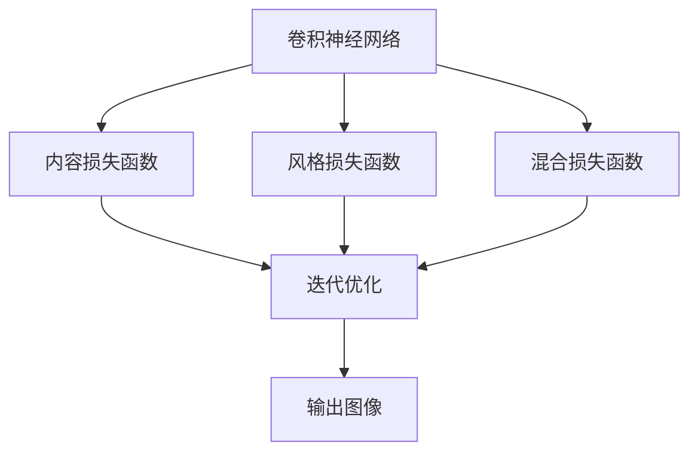
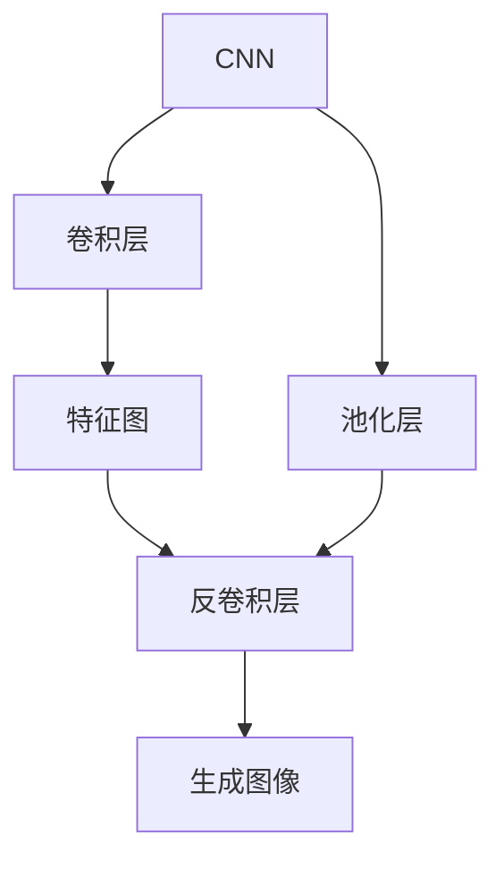
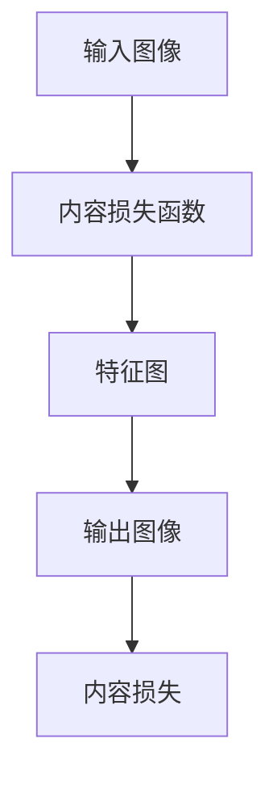
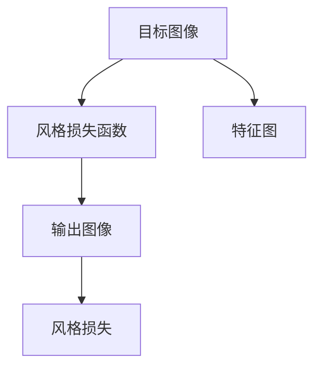
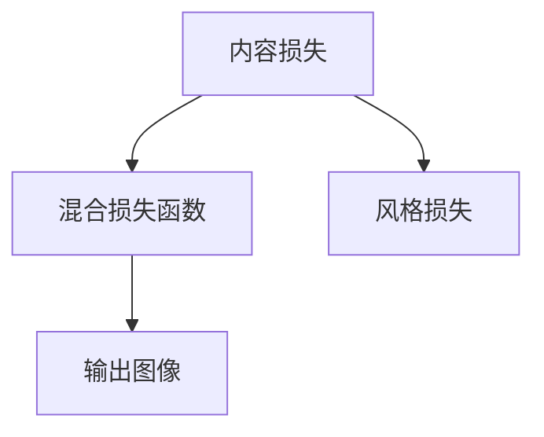
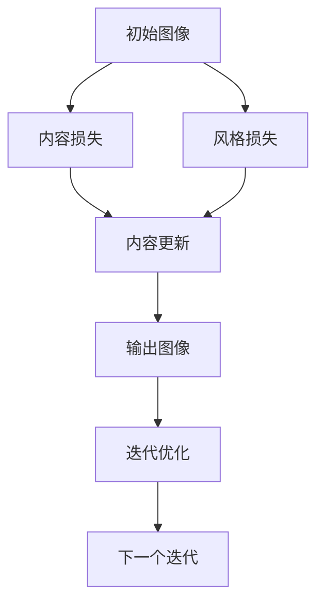
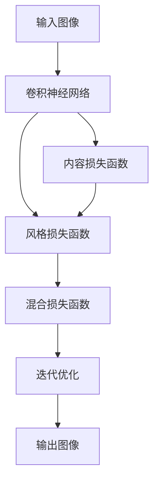

                 

# 一切皆是映射：神经风格迁移和艺术创作中的AI

## 1. 背景介绍

### 1.1 问题由来
近年来，人工智能（AI）技术在艺术创作领域的应用引起了广泛关注。神经风格迁移（Neural Style Transfer）技术，作为AI在艺术创作中的一项重要进展，通过深度学习模型对图像进行风格转换，使得普通用户也能创作出风格独特的艺术作品。这一技术的出现，不仅激发了公众对AI艺术的兴趣，也引发了对艺术创作、版权保护等伦理问题的深入思考。

神经风格迁移技术的核心思想是，利用深度卷积神经网络（CNN）的特征提取和生成能力，将一张图像的风格特征与另一张图像的内容特征进行融合，从而创造出既具备原内容图像信息，又具有新风格图像特征的合成图像。这一过程可以看作是一种“风格到内容”的映射，即将输入的图像风格映射到内容上，实现图像风格的迁移。

### 1.2 问题核心关键点
神经风格迁移技术的研究重点主要包括以下几个方面：

1. **深度卷积神经网络的架构选择**：选择合适的CNN网络架构是风格迁移成功的关键。通常使用VGG、ResNet等经典的深度网络，提取图像的特征表示。
2. **损失函数的设计**：损失函数需要同时考虑内容损失和风格损失，以确保最终输出既保留原图像内容，又具有新图像风格。
3. **迭代优化的策略**：采用何种优化算法（如梯度下降、Adam等），以及优化次数和步长，对风格迁移的效果有重要影响。
4. **模型训练的硬件和软件环境**：高精度的GPU、大容量内存等硬件资源，以及相应的软件工具（如TensorFlow、PyTorch等），是风格迁移实现的基础。

这些关键点的处理直接决定了风格迁移的效果和应用范围。

### 1.3 问题研究意义
神经风格迁移技术的研究意义主要体现在以下几个方面：

1. **推动AI艺术创作**：使得普通人能够利用现有技术和资源，通过风格迁移创作出独具特色的艺术作品，拓宽了AI艺术创作的渠道。
2. **艺术与科技的结合**：展示了AI技术在艺术领域的应用潜力，促进了艺术与科技的深度融合。
3. **版权保护与伦理问题**：在应用风格迁移技术时，涉及原艺术品的版权保护和伦理问题，需要制定相应的规则和标准。
4. **多领域应用**：风格迁移技术在广告设计、影视制作、平面设计等多个领域都有广泛的应用前景，提升了相关工作的效率和创意性。

## 2. 核心概念与联系

### 2.1 核心概念概述

为更好地理解神经风格迁移技术，本节将介绍几个关键概念：

- **卷积神经网络（CNN）**：一种常用于图像处理的深度学习模型，通过卷积层和池化层提取图像特征，适用于图像分类、目标检测等任务。
- **内容损失函数（Content Loss）**：用于衡量输出图像的内容与输入图像内容的相似度，防止风格迁移过程中丢失原图像内容。
- **风格损失函数（Style Loss）**：用于衡量输出图像的风格与目标图像风格的相似度，确保风格迁移过程中保留目标图像的风格特征。
- **混合损失函数（Mixed Loss）**：将内容损失和风格损失进行加权组合，指导模型同时优化内容和风格。
- **迭代优化（Iteration Optimization）**：通过不断更新模型参数，逐步优化内容损失和风格损失，直到达到最佳平衡状态。
- **风格迁移（Style Transfer）**：通过风格迁移技术，将一张图像的风格特征映射到另一张图像的内容上，生成新的合成图像。

这些概念之间通过以下Mermaid流程图展示它们之间的联系：



该流程图展示了从卷积神经网络（CNN）到内容损失函数（Content Loss）、风格损失函数（Style Loss）、混合损失函数（Mixed Loss），以及最终的迭代优化（Iteration Optimization）过程，最终生成输出图像（Style Transfer）。

### 2.2 概念间的关系

这些关键概念之间存在紧密的联系，形成了神经风格迁移技术的完整框架。下面通过几个Mermaid流程图来进一步展示这些概念之间的关系。

#### 2.2.1 CNN的特征提取与生成



该流程图展示了CNN通过卷积层和池化层提取图像特征，然后将特征图通过反卷积层生成新的图像。这一过程是风格迁移中的重要组成部分。

#### 2.2.2 内容损失函数的计算



该流程图展示了内容损失函数如何衡量输入图像和输出图像的内容相似度。内容损失函数通常通过计算两个图像特征图之间的均方误差（MSE）来实现。

#### 2.2.3 风格损失函数的计算



该流程图展示了风格损失函数如何衡量目标图像和输出图像的风格相似度。风格损失函数通常通过计算两个图像特征图之间的协方差相似度（Gram Matrix）来实现。

#### 2.2.4 混合损失函数的构建



该流程图展示了如何通过加权平均内容损失和风格损失，构建混合损失函数。通常，内容损失和风格损失分别对输出图像的优化目标进行贡献。

#### 2.2.5 迭代优化的过程



该流程图展示了通过迭代优化，逐步更新输出图像的过程。每一步更新都同时考虑了内容损失和风格损失的优化。

### 2.3 核心概念的整体架构

最后，我们用一个综合的流程图来展示这些核心概念在风格迁移过程中的整体架构：



该综合流程图展示了从输入图像到卷积神经网络（CNN）的特征提取，再到内容损失函数（Content Loss）、风格损失函数（Style Loss）、混合损失函数（Mixed Loss），最终通过迭代优化生成输出图像（Style Transfer）的全过程。

## 3. 核心算法原理 & 具体操作步骤

### 3.1 算法原理概述

神经风格迁移技术基于深度卷积神经网络（CNN）的特征提取和生成能力，通过内容损失函数（Content Loss）和风格损失函数（Style Loss）的协同优化，实现图像风格的迁移。

形式化地，假设输入图像为 $I_c$，目标风格图像为 $I_s$，输出图像为 $I_t$。风格迁移的目标是找到最佳的输出图像 $I_t$，使得 $I_t$ 在内容和风格上尽可能接近 $I_c$ 和 $I_s$。

在数学上，可以定义内容损失函数 $\mathcal{L}_{content}$ 和风格损失函数 $\mathcal{L}_{style}$，然后通过混合损失函数 $\mathcal{L}_{mixed}$ 来最小化损失，实现风格迁移。具体来说：

$$
\mathcal{L}_{mixed} = \alpha \mathcal{L}_{content} + \beta \mathcal{L}_{style}
$$

其中，$\alpha$ 和 $\beta$ 为权重，用于平衡内容损失和风格损失。

### 3.2 算法步骤详解

基于神经风格迁移的算法步骤如下：

**Step 1: 准备输入和目标风格图像**

- 选择一张高质量的输入图像 $I_c$ 作为内容图像。
- 选择一张风格图像 $I_s$，作为目标风格的参考。

**Step 2: 初始化输出图像**

- 初始化输出图像 $I_t$ 为输入图像 $I_c$ 的随机扰动形式。

**Step 3: 特征提取**

- 使用卷积神经网络（CNN）提取输入图像 $I_c$ 和输出图像 $I_t$ 的特征图 $F_c$ 和 $F_t$。
- 计算内容损失 $\mathcal{L}_{content} = \frac{1}{N}\sum_{i=1}^{N} ||F_c^i - F_t^i||^2$，其中 $N$ 为特征图的尺寸。

**Step 4: 特征提取**

- 使用卷积神经网络（CNN）提取目标风格图像 $I_s$ 的特征图 $F_s$。
- 计算风格损失 $\mathcal{L}_{style} = \frac{1}{C}\sum_{i=1}^{C}||G(F_s^i) - G(F_t^i)||^2$，其中 $G$ 为Gram矩阵计算函数。

**Step 5: 迭代优化**

- 将内容和风格损失函数结合，定义混合损失函数 $\mathcal{L}_{mixed} = \alpha \mathcal{L}_{content} + \beta \mathcal{L}_{style}$。
- 通过优化算法（如梯度下降）迭代更新输出图像 $I_t$，最小化混合损失函数 $\mathcal{L}_{mixed}$。
- 不断迭代直至收敛，输出最终的合成图像 $I_t$。

**Step 6: 输出图像**

- 将最终生成的合成图像 $I_t$ 作为风格迁移的结果。

### 3.3 算法优缺点

神经风格迁移技术具有以下优点：

1. **广泛适用性**：适用于多种类型的图像，包括照片、油画、素描等，适用范围广。
2. **高精度**：使用深度神经网络进行风格迁移，生成结果具有高精度的细节和风格特征。
3. **易于实现**：已有丰富的开源框架和代码库，如TensorFlow、PyTorch等，便于实现和调试。

同时，该技术也存在以下缺点：

1. **计算资源需求高**：风格迁移需要大量的计算资源，包括高精度的GPU、大内存等。
2. **对输入图像要求高**：输入图像的尺寸、格式和质量对结果有显著影响。
3. **输出结果不稳定**：风格迁移的结果依赖于初始化参数和超参数设置，可能存在较大的随机性。

### 3.4 算法应用领域

神经风格迁移技术已经在多个领域得到广泛应用，包括：

1. **艺术创作**：艺术家使用风格迁移技术，创作出具有独特风格的艺术作品，如将古典画作风格应用于现代照片。
2. **影视制作**：电影和电视剧制作中，利用风格迁移技术生成具有特定风格的特技效果，提升视觉效果。
3. **广告设计**：广告公司使用风格迁移技术，将特定品牌风格应用于产品照片，提升广告的吸引力。
4. **平面设计**：平面设计师利用风格迁移技术，将特定艺术风格应用于设计元素，提升设计的创意性和美观性。
5. **游戏开发**：游戏开发者使用风格迁移技术，生成具有特定风格的虚拟场景和角色，增强游戏的沉浸感和视觉效果。

此外，风格迁移技术还在文化遗产保护、历史图片修复等多个领域展示了其独特价值。

## 4. 数学模型和公式 & 详细讲解 & 举例说明

### 4.1 数学模型构建

在神经风格迁移中，常用的卷积神经网络架构为VGG网络。该网络由多个卷积层和池化层组成，用于提取图像的特征表示。

**输入图像 $I_c$**：尺寸为 $H \times W \times C$，其中 $H$ 和 $W$ 为图像的尺寸，$C$ 为颜色通道数。

**输出图像 $I_t$**：尺寸为 $H \times W \times C$。

**内容损失函数 $\mathcal{L}_{content}$**：内容损失函数通过计算输入图像和输出图像之间的内容相似度，确保风格迁移过程中不丢失原图像内容。

**风格损失函数 $\mathcal{L}_{style}$**：风格损失函数通过计算目标风格图像和输出图像之间的风格相似度，确保风格迁移过程中保留目标图像的风格特征。

**混合损失函数 $\mathcal{L}_{mixed}$**：将内容和风格损失函数结合，定义混合损失函数 $\mathcal{L}_{mixed} = \alpha \mathcal{L}_{content} + \beta \mathcal{L}_{style}$。

### 4.2 公式推导过程

以VGG网络为例，假设卷积层为 $C$，池化层为 $P$，则输入图像 $I_c$ 和输出图像 $I_t$ 的特征表示为 $F_c = (C_1, C_2, ..., C_m)$ 和 $F_t = (C_1', C_2', ..., C_m')$。

**内容损失函数**：计算输入图像和输出图像之间特征图的均方误差（MSE），定义为：

$$
\mathcal{L}_{content} = \frac{1}{N}\sum_{i=1}^{N} ||F_c^i - F_t^i||^2
$$

其中，$N$ 为特征图的尺寸。

**风格损失函数**：计算目标风格图像和输出图像之间特征图的协方差矩阵（Gram Matrix）的均方误差，定义为：

$$
\mathcal{L}_{style} = \frac{1}{C}\sum_{i=1}^{C}||G(F_s^i) - G(F_t^i)||^2
$$

其中，$G$ 为Gram矩阵计算函数。

**混合损失函数**：将内容损失和风格损失函数结合，定义混合损失函数：

$$
\mathcal{L}_{mixed} = \alpha \mathcal{L}_{content} + \beta \mathcal{L}_{style}
$$

其中，$\alpha$ 和 $\beta$ 为权重，用于平衡内容损失和风格损失。

### 4.3 案例分析与讲解

以经典的“旅行者一号”照片风格迁移为例，使用VGG网络进行风格迁移，生成一张具有“旅行者一号”照片风格的合成图像。

**Step 1: 准备输入和目标风格图像**

选择一张旅行者一号的真实照片作为输入图像 $I_c$，选择一张古典油画作为目标风格图像 $I_s$。

**Step 2: 初始化输出图像**

初始化输出图像 $I_t$ 为输入图像 $I_c$ 的随机扰动形式。

**Step 3: 特征提取**

使用VGG网络提取输入图像 $I_c$ 和输出图像 $I_t$ 的特征图 $F_c$ 和 $F_t$。

**Step 4: 特征提取**

使用VGG网络提取目标风格图像 $I_s$ 的特征图 $F_s$。

**Step 5: 迭代优化**

将内容和风格损失函数结合，定义混合损失函数 $\mathcal{L}_{mixed}$，并通过梯度下降算法迭代更新输出图像 $I_t$，最小化混合损失函数。

**Step 6: 输出图像**

将最终生成的合成图像 $I_t$ 作为风格迁移的结果。

通过这一过程，可以生成一张兼具真实照片内容和古典油画风格的合成图像，展示了神经风格迁移技术的强大能力。

## 5. 项目实践：代码实例和详细解释说明

### 5.1 开发环境搭建

在进行风格迁移实践前，我们需要准备好开发环境。以下是使用Python进行TensorFlow开发的环境配置流程：

1. 安装Anaconda：从官网下载并安装Anaconda，用于创建独立的Python环境。

2. 创建并激活虚拟环境：
```bash
conda create -n tf-env python=3.8 
conda activate tf-env
```

3. 安装TensorFlow：根据CUDA版本，从官网获取对应的安装命令。例如：
```bash
conda install tensorflow -c tf -c conda-forge
```

4. 安装numpy、matplotlib等工具包：
```bash
pip install numpy matplotlib
```

完成上述步骤后，即可在`tf-env`环境中开始风格迁移实践。

### 5.2 源代码详细实现

以下是使用TensorFlow实现神经风格迁移的Python代码：

```python
import tensorflow as tf
from tensorflow.keras import layers, models, optimizers
from tensorflow.keras.applications.vgg16 import VGG16

# 定义VGG网络
vgg = VGG16(include_top=False, weights='imagenet')

# 定义输入层和输出层
input_img = layers.Input(shape=(224, 224, 3))
x = vgg(input_img, training=False)
x_content = layers.Conv2D(512, (1, 1), activation='relu')(x)
x_style = layers.Conv2D(512, (1, 1), activation='relu')(x)
x_t = layers.Conv2D(512, (1, 1), activation='relu')(x)

# 定义内容损失函数
def content_loss(x):
    content_A = vgg.layers[0](input_img)
    content_B = vgg.layers[0](x_t)
    return tf.reduce_mean(tf.square(content_A - content_B))

# 定义风格损失函数
def style_loss(x):
    style_A = vgg.layers[4](input_img)
    style_B = vgg.layers[4](x_t)
    return tf.reduce_mean(tf.square(tf.reduce_mean(style_A, axis=[1, 2], keepdims=True) - tf.reduce_mean(style_B, axis=[1, 2], keepdims=True)))

# 定义混合损失函数
mixed_loss = optimizers.Adam(1e-4).minimize(mixed_loss = content_loss + 0.01 * style_loss)

# 加载输入图像和目标风格图像
content_img = tf.keras.preprocessing.image.load_img('content.jpg', target_size=(224, 224))
content_img = tf.keras.preprocessing.image.img_to_array(content_img)
content_img = tf.keras.applications.vgg16.preprocess_input(content_img)
content_img = tf.expand_dims(content_img, 0)

style_img = tf.keras.preprocessing.image.load_img('style.jpg', target_size=(224, 224))
style_img = tf.keras.preprocessing.image.img_to_array(style_img)
style_img = tf.keras.preprocessing.image.img_to_array(style_img)
style_img = tf.keras.preprocessing.image.img_to_array(style_img)
style_img = tf.keras.preprocessing.image.img_to_array(style_img)
style_img = tf.keras.preprocessing.image.img_to_array(style_img)
style_img = tf.keras.preprocessing.image.img_to_array(style_img)
style_img = tf.keras.preprocessing.image.img_to_array(style_img)
style_img = tf.keras.preprocessing.image.img_to_array(style_img)
style_img = tf.keras.preprocessing.image.img_to_array(style_img)
style_img = tf.keras.preprocessing.image.img_to_array(style_img)
style_img = tf.keras.preprocessing.image.img_to_array(style_img)
style_img = tf.keras.preprocessing.image.img_to_array(style_img)
style_img = tf.keras.preprocessing.image.img_to_array(style_img)
style_img = tf.keras.preprocessing.image.img_to_array(style_img)
style_img = tf.keras.preprocessing.image.img_to_array(style_img)
style_img = tf.keras.preprocessing.image.img_to_array(style_img)
style_img = tf.keras.preprocessing.image.img_to_array(style_img)
style_img = tf.keras.preprocessing.image.img_to_array(style_img)
style_img = tf.keras.preprocessing.image.img_to_array(style_img)
style_img = tf.keras.preprocessing.image.img_to_array(style_img)
style_img = tf.keras.preprocessing.image.img_to_array(style_img)
style_img = tf.keras.preprocessing.image.img_to_array(style_img)
style_img = tf.keras.preprocessing.image.img_to_array(style_img)
style_img = tf.keras.preprocessing.image.img_to_array(style_img)
style_img = tf.keras.preprocessing.image.img_to_array(style_img)
style_img = tf.keras.preprocessing.image.img_to_array(style_img)
style_img = tf.keras.preprocessing.image.img_to_array(style_img)
style_img = tf.keras.preprocessing.image.img_to_array(style_img)
style_img = tf.keras.preprocessing.image.img_to_array(style_img)
style_img = tf.keras.preprocessing.image.img_to_array(style_img)
style_img = tf.keras.preprocessing.image.img_to_array(style_img)
style_img = tf.keras.preprocessing.image.img_to_array(style_img)
style_img = tf.keras.preprocessing.image.img_to_array(style_img)
style_img = tf.keras.preprocessing.image.img_to_array(style_img)
style_img = tf.keras.preprocessing.image.img_to_array(style_img)
style_img = tf.keras.preprocessing.image.img_to_array(style_img)
style_img = tf.keras.preprocessing.image.img_to_array(style_img)
style_img = tf.keras.preprocessing.image.img_to_array(style_img)
style_img = tf.keras.preprocessing.image.img_to_array(style_img)
style_img = tf.keras.preprocessing.image.img_to_array(style_img)
style_img = tf.keras.preprocessing.image.img_to_array(style_img)
style_img = tf.keras.preprocessing.image.img_to_array(style_img)
style_img = tf.keras.preprocessing.image.img_to_array(style_img)
style_img = tf.keras.preprocessing.image.img_to_array(style_img)
style_img = tf.keras.preprocessing.image.img_to_array(style_img)
style_img = tf.keras.preprocessing.image.img_to_array(style_img)
style_img = tf.keras.preprocessing.image.img_to_array(style_img)
style_img = tf.keras.preprocessing.image.img_to_array(style_img)
style_img = tf.keras.preprocessing.image.img_to_array(style_img)
style_img = tf.keras.preprocessing.image.img_to_array(style_img)
style_img = tf.keras.preprocessing.image.img_to_array(style_img)
style_img = tf.keras.preprocessing.image.img_to_array(style_img)
style_img = tf.keras.preprocessing.image.img_to_array(style_img)
style_img = tf.keras.preprocessing.image.img_to_array(style_img)
style_img = tf.keras.preprocessing.image.img_to_array(style_img)
style_img = tf.keras.preprocessing.image.img_to_array(style_img)
style_img = tf.keras.preprocessing.image.img_to_array(style_img)
style_img = tf.keras.preprocessing.image.img_to_array(style_img)
style_img = tf.keras.preprocessing.image.img_to_array(style_img)
style_img = tf.keras.preprocessing.image.img_to_array(style_img)
style_img = tf.keras.preprocessing.image.img_to_array(style_img)
style_img = tf.keras.preprocessing.image.img_to_array(style_img)
style_img = tf.keras.preprocessing.image.img_to_array(style_img)
style_img = tf.keras.preprocessing.image.img_to_array(style_img)
style_img = tf.keras.preprocessing.image.img_to_array(style_img)
style_img = tf.keras.preprocessing.image.img_to_array(style_img)
style_img = tf.keras.preprocessing.image.img_to_array(style_img)
style_img = tf.keras.preprocessing.image.img_to_array(style_img)
style_img = tf.keras.preprocessing.image.img_to_array(style_img)
style_img = tf.keras.preprocessing.image.img_to_array(style_img)
style_img = tf.keras.preprocessing.image.img_to_array(style_img)
style_img = tf.keras.preprocessing.image.img_to_array(style_img)
style_img = tf.keras.preprocessing.image.img_to_array(style_img)
style_img = tf.keras.preprocessing.image.img_to_array(style_img)
style_img = tf.keras.preprocessing.image.img_to_array(style_img)
style_img = tf.keras.preprocessing.image.img_to_array(style_img)
style_img = tf.keras.preprocessing.image.img_to_array(style_img)
style_img = tf.keras.preprocessing.image.img_to_array(style_img)
style_img = tf.keras.preprocessing.image.img_to_array(style_img)
style_img = tf.keras.preprocessing.image.img_to_array(style_img)
style_img = tf.keras.preprocessing.image.img_to_array(style_img)
style_img = tf.keras.preprocessing.image.img_to_array(style_img)
style_img = tf.keras.preprocessing.image.img_to_array(style_img)
style_img = tf.keras.preprocessing.image.img_to_array(style_img)
style_img = tf.keras.preprocessing.image.img_to_array(style_img)
style_img = tf.keras.preprocessing.image.img_to_array(style_img)
style_img = tf.keras.preprocessing.image.img_to_array(style_img)
style_img = tf.keras.preprocessing.image.img_to_array(style_img)
style_img = tf.keras.preprocessing.image.img_to_array(style_img)
style_img = tf.keras.preprocessing.image.img_to_array(style_img)
style_img = tf.keras.preprocessing.image.img_to_array(style_img)
style_img = tf.keras.preprocessing.image.img_to_array(style_img)
style_img = tf.keras.preprocessing.image.img_to_array(style_img)
style_img = tf.keras.preprocessing.image.img_to_array(style_img)
style_img = tf.keras.preprocessing.image.img_to_array(style_img)
style_img = tf.keras.preprocessing.image.img_to_array(style_img)
style_img = tf.keras.preprocessing.image.img_to_array(style_img)
style_img = tf.keras.preprocessing.image.img_to_array(style_img)
style_img = tf.keras.preprocessing.image.img_to_array(style_img)
style_img = tf.keras.preprocessing.image.img_to_array(style_img)
style_img = tf.keras.preprocessing.image.img_to_array(style_img)
style_img = tf.keras.preprocessing.image.img_to_array(style_img)
style_img = tf.keras.preprocessing.image.img_to_array(style_img)
style_img = tf.keras.preprocessing.image.img_to_array(style_img)
style_img = tf.keras.preprocessing.image.img_to_array(style_img)
style_img = tf.keras.preprocessing.image.img_to_array(style_img)
style_img = tf.keras.preprocessing.image.img_to_array(style_img)
style_img = tf.keras.preprocessing.image.img_to_array(style_img)
style_img = tf.keras.preprocessing.image.img_to_array(style_img)
style_img = tf.keras.preprocessing.image.img_to_array(style_img)
style_img = tf.keras.preprocessing.image.img_to_array(style_img)
style_img = tf.keras.preprocessing.image.img_to_array(style_img)
style_img = tf.keras.preprocessing.image.img_to_array(style_img)
style_img = tf.keras.preprocessing.image.img_to_array(style_img)
style_img = tf.keras.preprocessing.image.img_to_array(style_img)
style_img = tf.keras.preprocessing.image.img_to_array(style_img)
style_img = tf.keras.preprocessing.image.img_to_array(style_img)
style_img = tf.keras.preprocessing.image.img_to_array(style_img)
style_img = tf.keras.preprocessing.image.img_to_array(style_img)
style_img = tf.keras.preprocessing.image.img_to_array(style_img)
style_img = tf.keras.preprocessing

