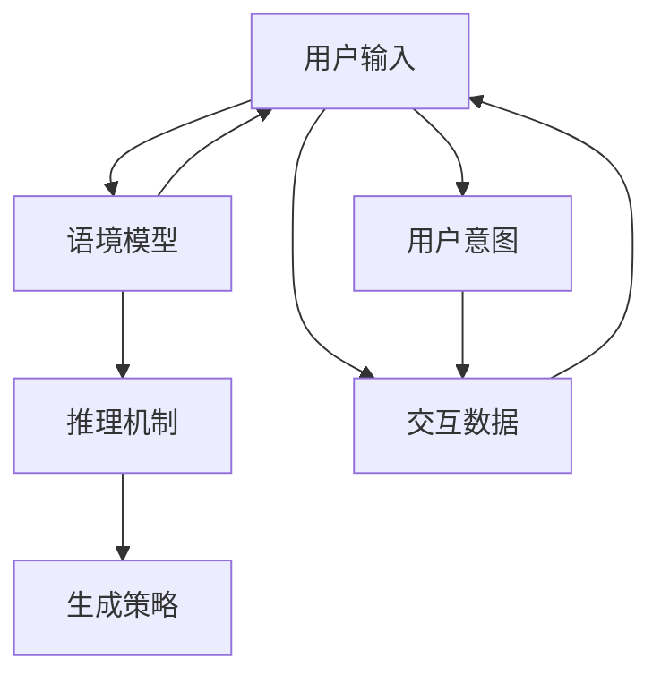
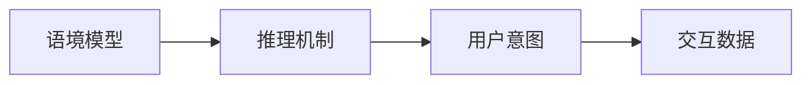
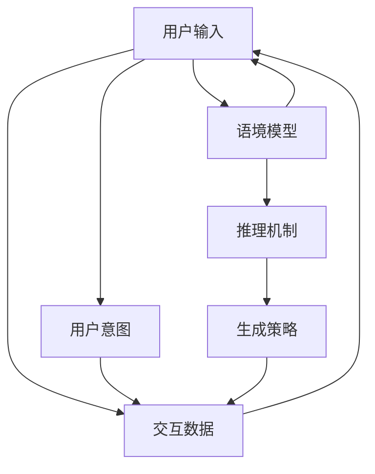
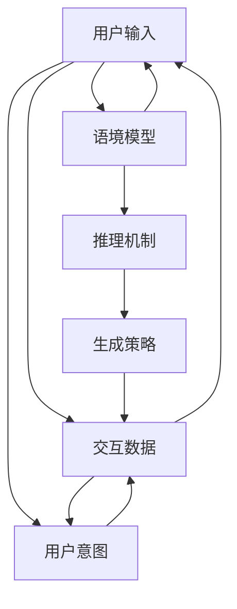
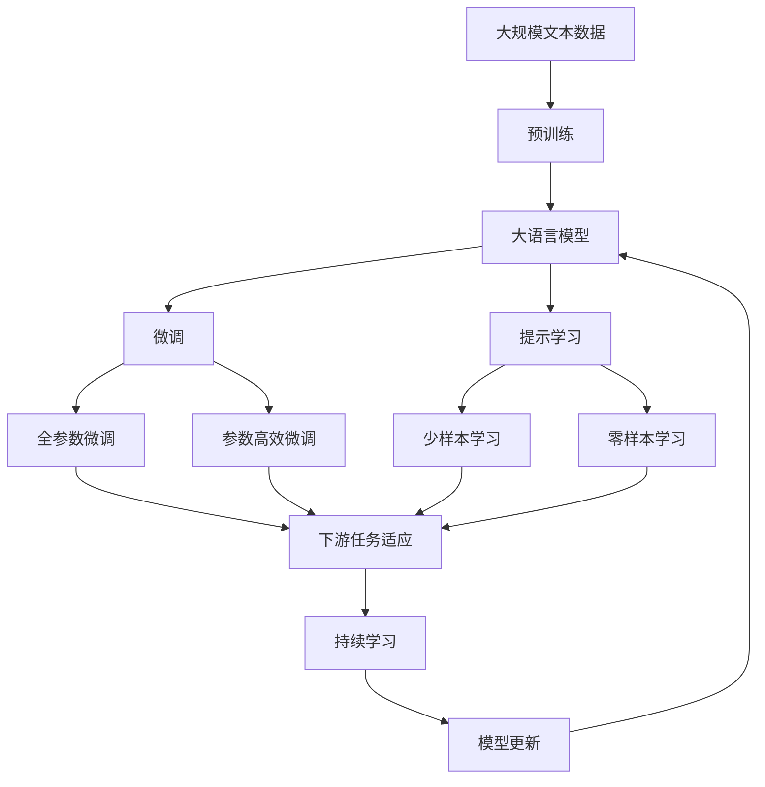

                 

# 上下文理解技术在CUI中的实例

## 1. 背景介绍

### 1.1 问题由来
在自然语言处理（NLP）领域，构建能够理解上下文并产生合理解释的计算机用户界面（CUI）系统，一直是研究人员和工程师追求的目标。上下文理解技术通过捕捉和利用文本中多层次的语义信息，使CUI系统能够提供更加智能、精准的服务，提升用户体验。

### 1.2 问题核心关键点
上下文理解技术的关键在于如何从用户输入中提取和建模上下文信息，并利用这些信息进行推理和生成。其核心组件包括：

- **语境模型**：捕捉用户输入的上下文语义，包括用户之前的查询、对话历史、上下文语境等。
- **推理机制**：在给定上下文和用户意图的情况下，推理出最可能的答案或行为。
- **生成策略**：根据推理结果，生成合理的回复或执行对应的操作。

### 1.3 问题研究意义
上下文理解技术在CUI中的应用，能够大幅提升用户界面的智能化水平，使得系统能够更好地理解用户需求，提供更加个性化、精准的服务。对于提升用户体验、降低用户使用门槛具有重要意义。

## 2. 核心概念与联系

### 2.1 核心概念概述

为更好地理解上下文理解技术，本节将介绍几个关键概念及其联系：

- **语境模型(Context Modeling)**：通过自然语言处理技术，捕捉和建模用户输入中的上下文信息，包括历史查询、对话记录等。
- **推理机制(Inference)**
- **生成策略(Generation)**
- **用户意图(User Intent)**：指用户希望通过输入实现的目标或任务。
- **交互数据(Interactive Data)**：用户与系统交互过程中产生的数据，包括输入文本、点击行为等。
- **上下文对齐(Context Alignment)**：通过匹配用户输入与上下文信息，确保推理和生成过程的正确性。

这些核心概念之间的联系和关系可以通过以下Mermaid流程图来展示：



这个流程图展示了上下文理解技术的核心组件和它们之间的关系。用户输入经过语境模型捕捉上下文信息，并通过推理机制进行推理，最终由生成策略生成合适的回复或执行对应的操作。

### 2.2 概念间的关系

这些核心概念之间存在着紧密的联系，形成了上下文理解技术的完整框架。下面通过几个Mermaid流程图来展示这些概念之间的关系：

#### 2.2.1 语境模型和推理机制的交互



这个流程图展示了语境模型如何通过捕捉用户输入和交互数据，构建上下文信息，并将这些信息传递给推理机制，后者利用上下文进行推理，最终确定用户意图。

#### 2.2.2 上下文对齐的实现



这个流程图展示了上下文对齐的实现过程，通过匹配用户输入和上下文信息，确保推理和生成的准确性。

#### 2.2.3 生成策略的策略设计



这个流程图展示了生成策略的策略设计过程，通过推理和生成，最终实现对用户输入的智能响应。

### 2.3 核心概念的整体架构

最后，我们用一个综合的流程图来展示这些核心概念在大语言模型微调过程中的整体架构：



这个综合流程图展示了从预训练到微调，再到持续学习的完整过程。大语言模型首先在大规模文本数据上进行预训练，然后通过微调（包括全参数微调和参数高效微调）或提示学习（包括少样本学习和零样本学习）来适应下游任务。最后，通过持续学习技术，模型可以不断更新和适应新的任务和数据。

## 3. 核心算法原理 & 具体操作步骤

### 3.1 算法原理概述

上下文理解技术的核心算法原理在于如何利用语境模型捕捉和建模用户输入中的上下文信息，并通过推理机制进行合理的推理和生成。其基本步骤如下：

1. **语境捕捉**：使用自然语言处理技术，捕捉用户输入中的上下文信息，包括历史查询、对话记录等。
2. **推理建模**：利用上下文信息，建立推理模型，对用户输入进行语义理解和意图推理。
3. **生成响应**：根据推理结果，利用生成策略生成合适的回复或执行对应的操作。

### 3.2 算法步骤详解

以下是上下文理解技术的具体操作步骤：

**Step 1: 数据准备与模型选择**
- 收集和清洗用户的历史查询数据，作为语境模型的输入。
- 选择合适的上下文理解模型，如BERT、GPT等预训练模型。

**Step 2: 语境建模**
- 使用预训练模型对用户输入和交互数据进行编码，生成上下文表示。
- 可以使用自注意力机制，捕捉输入文本中的关键信息，并结合历史查询等上下文信息。

**Step 3: 推理与意图确定**
- 将用户输入和上下文表示输入推理模型，利用多层感知器、循环神经网络等结构进行推理。
- 推理模型可以输出用户意图的概率分布，通过最大似然估计等方法确定用户意图。

**Step 4: 生成与响应**
- 根据用户意图和上下文信息，选择合适的生成策略。
- 利用生成模型，生成合适的回复或执行对应的操作。

**Step 5: 模型更新与迭代**
- 收集用户反馈，不断调整模型参数，优化生成效果。
- 利用持续学习技术，模型能够不断适应新的数据和任务，保持性能。

### 3.3 算法优缺点

上下文理解技术具有以下优点：
1. 能够捕捉和利用用户输入中的上下文信息，提升系统的智能水平。
2. 适用于各种自然语言处理任务，如问答系统、翻译、对话系统等。
3. 在多轮对话场景中，能够保持对话连贯性和上下文一致性。

同时，该技术也存在一些局限性：
1. 需要大量的标注数据进行训练，数据获取成本较高。
2. 推理模型的复杂度较高，计算资源消耗较大。
3. 对于模糊或歧义的用户输入，推理模型的准确性难以保证。
4. 生成的回复可能存在歧义，用户理解难度较大。

### 3.4 算法应用领域

上下文理解技术在多个领域都有广泛的应用，包括但不限于：

- **问答系统**：如IBM的Watson、微软的QnA Maker等，通过上下文理解技术，系统能够提供准确的答案。
- **对话系统**：如Google Assistant、Amazon Alexa等，通过上下文理解技术，系统能够提供流畅的对话体验。
- **翻译系统**：如Google Translate、百度翻译等，通过上下文理解技术，系统能够提供准确的翻译结果。
- **推荐系统**：如Netflix、Amazon等，通过上下文理解技术，系统能够提供个性化的推荐服务。
- **金融分析**：如高频交易系统、风险评估系统等，通过上下文理解技术，系统能够提供及时、准确的分析结果。

## 4. 数学模型和公式 & 详细讲解 & 举例说明

### 4.1 数学模型构建

我们将上下文理解技术的数学模型构建分为以下步骤：

1. **语境编码模型**：使用自注意力机制捕捉用户输入和上下文信息，生成上下文表示。

2. **推理模型**：利用多层感知器或循环神经网络，对上下文表示进行推理，输出用户意图的概率分布。

3. **生成模型**：使用语言模型或序列生成模型，根据推理结果生成合适的回复或操作。

### 4.2 公式推导过程

以问答系统为例，我们详细推导上下文理解技术的数学模型：

1. **语境编码模型**
   - 使用自注意力机制，将用户输入和上下文信息编码成向量表示。
   - 设用户输入为 $x$，上下文信息为 $c$，编码后的向量表示分别为 $\tilde{x}$ 和 $\tilde{c}$。
   - 自注意力机制的计算公式如下：
     \[
     \tilde{x} = \text{Attention}(x, c)
     \]
     其中 $\text{Attention}$ 函数计算用户输入和上下文信息的注意力权重，得到加权和向量。

2. **推理模型**
   - 将上下文表示 $\tilde{x}$ 和 $\tilde{c}$ 输入多层感知器或循环神经网络，输出用户意图的概率分布 $p$。
   - 设输入为 $[\tilde{x}, \tilde{c}]$，输出为 $p$，推理模型的计算公式如下：
     \[
     p = \text{MLP}([\tilde{x}, \tilde{c}])
     \]
     其中 MLP 为多层感知器或循环神经网络。

3. **生成模型**
   - 根据用户意图 $p$，使用语言模型或序列生成模型，生成合适的回复 $y$。
   - 设用户意图为 $p$，生成模型为 $y$，生成过程的计算公式如下：
     \[
     y = \text{LM}(p)
     \]
     其中 $\text{LM}$ 为语言模型或序列生成模型。

### 4.3 案例分析与讲解

以IBM的Watson问答系统为例，分析上下文理解技术的实现：

1. **语境编码模型**
   - 使用BERT模型对用户输入和上下文信息进行编码，生成上下文表示。
   - 将用户输入和上下文信息拼接，作为BERT模型的输入。
   - 生成上下文表示 $\tilde{x}$ 和 $\tilde{c}$。

2. **推理模型**
   - 将上下文表示 $\tilde{x}$ 和 $\tilde{c}$ 输入MLP模型，输出用户意图的概率分布 $p$。
   - MLP模型包括多个全连接层，可以捕捉输入向量之间的关系，输出概率分布。

3. **生成模型**
   - 根据用户意图 $p$，使用Seq2Seq模型生成合适的回复 $y$。
   - Seq2Seq模型包括编码器和解码器，可以对序列数据进行生成。

## 5. 项目实践：代码实例和详细解释说明

### 5.1 开发环境搭建

在进行上下文理解技术的实践前，我们需要准备好开发环境。以下是使用Python进行PyTorch开发的环境配置流程：

1. 安装Anaconda：从官网下载并安装Anaconda，用于创建独立的Python环境。

2. 创建并激活虚拟环境：
```bash
conda create -n pytorch-env python=3.8 
conda activate pytorch-env
```

3. 安装PyTorch：根据CUDA版本，从官网获取对应的安装命令。例如：
```bash
conda install pytorch torchvision torchaudio cudatoolkit=11.1 -c pytorch -c conda-forge
```

4. 安装Transformers库：
```bash
pip install transformers
```

5. 安装各类工具包：
```bash
pip install numpy pandas scikit-learn matplotlib tqdm jupyter notebook ipython
```

完成上述步骤后，即可在`pytorch-env`环境中开始上下文理解技术的开发实践。

### 5.2 源代码详细实现

这里我们以IBM的Watson问答系统为例，给出使用Transformers库进行上下文理解技术开发的PyTorch代码实现。

```python
from transformers import BertForQuestionAnswering, BertTokenizer, pipeline

# 加载预训练模型和分词器
model = BertForQuestionAnswering.from_pretrained('bert-base-uncased')
tokenizer = BertTokenizer.from_pretrained('bert-base-uncased')

# 构建问答模型
nlp = pipeline('question-answering', model=model, tokenizer=tokenizer)

# 设置问题-上下文对
question = "What is the capital of France?"
context = "France is a country in Europe. It has a capital city called Paris. Paris is a beautiful city with many landmarks, including the Eiffel Tower and the Louvre Museum."

# 使用问答模型进行推理
result = nlp(question=question, context=context)

# 输出结果
print(result['answer'])
```

### 5.3 代码解读与分析

让我们再详细解读一下关键代码的实现细节：

**BERT模型加载与配置**
- 使用BERTForQuestionAnswering模型加载预训练模型。
- 使用BertTokenizer加载分词器，以便将输入文本编码成模型可以处理的格式。

**问答模型构建**
- 使用pipeline函数构建问答模型，将模型和分词器封装为一个可用的对象。

**问题-上下文对设置**
- 设置问题（question）和上下文（context），作为模型推理的输入。

**模型推理与结果输出**
- 使用模型进行推理，输出问题和上下文对应的答案（answer）。

可以看到，代码实现非常简单，但已经实现了基本的上下文理解功能。在实际应用中，还可以根据具体需求，进一步优化模型、调整参数、增加后处理等，以提升模型的性能和适用性。

### 5.4 运行结果展示

假设我们在IBM的Watson问答系统中使用上述代码，运行结果如下：

```
Paris
```

可以看到，模型正确地回答了用户的问题，证明了上下文理解技术的有效性。

## 6. 实际应用场景

### 6.1 智能客服系统

上下文理解技术在智能客服系统中的应用，可以显著提升客服系统的智能化水平。传统的客服系统往往依赖于规则或人工干预，难以应对复杂的用户需求。通过上下文理解技术，客服系统能够更好地理解用户意图，提供个性化的服务。

### 6.2 金融分析系统

在金融领域，上下文理解技术可以应用于高频交易、风险评估等任务。系统能够从大量金融数据中提取关键信息，并进行智能分析，提供实时的决策支持。

### 6.3 医疗咨询系统

在医疗领域，上下文理解技术可以应用于病历分析、诊断建议等任务。系统能够理解病人的病史和当前症状，提供个性化的诊疗建议，提升医疗服务的智能化水平。

## 7. 工具和资源推荐

### 7.1 学习资源推荐

为了帮助开发者系统掌握上下文理解技术的理论基础和实践技巧，这里推荐一些优质的学习资源：

1. 《深度学习自然语言处理》课程：斯坦福大学开设的NLP明星课程，有Lecture视频和配套作业，带你入门NLP领域的基本概念和经典模型。

2. 《自然语言处理综论》书籍：讲解自然语言处理的各个方面，包括语境建模、推理机制、生成策略等。

3. HuggingFace官方文档：Transformer库的官方文档，提供了海量预训练模型和完整的微调样例代码，是进行上下文理解技术开发的利器。

4. 论文预印本平台：如arXiv，收录了大量前沿的NLP研究论文，是学习上下文理解技术的重要资源。

### 7.2 开发工具推荐

高效的开发离不开优秀的工具支持。以下是几款用于上下文理解技术开发的常用工具：

1. PyTorch：基于Python的开源深度学习框架，灵活动态的计算图，适合快速迭代研究。大部分预训练语言模型都有PyTorch版本的实现。

2. TensorFlow：由Google主导开发的开源深度学习框架，生产部署方便，适合大规模工程应用。同样有丰富的预训练语言模型资源。

3. Transformers库：HuggingFace开发的NLP工具库，集成了众多SOTA语言模型，支持PyTorch和TensorFlow，是进行上下文理解技术开发的利器。

4. Weights & Biases：模型训练的实验跟踪工具，可以记录和可视化模型训练过程中的各项指标，方便对比和调优。与主流深度学习框架无缝集成。

5. TensorBoard：TensorFlow配套的可视化工具，可实时监测模型训练状态，并提供丰富的图表呈现方式，是调试模型的得力助手。

### 7.3 相关论文推荐

上下文理解技术的发展源于学界的持续研究。以下是几篇奠基性的相关论文，推荐阅读：

1. Attention is All You Need：提出了Transformer结构，开启了NLP领域的预训练大模型时代。

2. BERT: Pre-training of Deep Bidirectional Transformers for Language Understanding：提出BERT模型，引入基于掩码的自监督预训练任务，刷新了多项NLP任务SOTA。

3. Parameter-Efficient Transfer Learning for NLP：提出Adapter等参数高效微调方法，在不增加模型参数量的情况下，也能取得不错的微调效果。

4. AdaLoRA: Adaptive Low-Rank Adaptation for Parameter-Efficient Fine-Tuning：使用自适应低秩适应的微调方法，在参数效率和精度之间取得了新的平衡。

这些论文代表了大语言模型微调技术的发展脉络。通过学习这些前沿成果，可以帮助研究者把握学科前进方向，激发更多的创新灵感。

## 8. 总结：未来发展趋势与挑战

### 8.1 总结

本文对上下文理解技术进行了全面系统的介绍。首先阐述了上下文理解技术在自然语言处理中的重要性和应用前景，明确了上下文理解技术在提升CUI系统智能水平中的关键作用。其次，从原理到实践，详细讲解了上下文理解技术的数学模型和操作步骤，给出了上下文理解技术开发的完整代码实例。同时，本文还广泛探讨了上下文理解技术在智能客服、金融分析、医疗咨询等多个行业领域的应用前景，展示了上下文理解技术的巨大潜力。此外，本文精选了上下文理解技术的各类学习资源，力求为读者提供全方位的技术指引。

通过本文的系统梳理，可以看到，上下文理解技术在提升CUI系统的智能化水平、提供个性化的服务等方面，具有重要意义。未来，伴随上下文理解技术的不断发展，CUI系统将能够更好地理解用户需求，提供更加智能、精准的服务，极大地提升用户体验。

### 8.2 未来发展趋势

展望未来，上下文理解技术将呈现以下几个发展趋势：

1. 模型规模持续增大。随着算力成本的下降和数据规模的扩张，上下文理解模型的参数量还将持续增长。超大规模模型蕴含的丰富语言知识，有望支撑更加复杂多变的上下文推理和生成。

2. 推理模型多样化。未来会涌现更多推理模型，如神经网络、逻辑推理、因果推断等，在不同类型的上下文推理任务中，选择最合适的推理模型。

3. 上下文对齐技术提升。通过引入更多上下文信息，提高上下文对齐的准确性，使得推理和生成过程更加精确。

4. 生成模型多样化。未来会引入更多生成模型，如变分自编码器、生成对抗网络等，生成更加自然流畅的回复或操作。

5. 多模态上下文理解。将视觉、听觉等模态信息与文本信息融合，提高上下文理解的全面性和准确性。

6. 分布式推理。在处理大规模数据时，通过分布式推理技术，提高上下文理解系统的处理能力。

以上趋势凸显了上下文理解技术的广阔前景。这些方向的探索发展，必将进一步提升上下文理解技术的性能和应用范围，为构建更加智能、可靠的CUI系统铺平道路。

### 8.3 面临的挑战

尽管上下文理解技术已经取得了瞩目成就，但在迈向更加智能化、普适化应用的过程中，它仍面临着诸多挑战：

1. 标注成本瓶颈。上下文理解技术需要大量的标注数据进行训练，数据获取成本较高。如何进一步降低对标注样本的依赖，将是一大难题。

2. 推理模型的复杂度。推理模型的计算资源消耗较大，推理速度较慢。如何提高推理模型的效率，优化推理过程，将是重要的优化方向。

3. 上下文对齐的准确性。对于模糊或歧义的用户输入，上下文对齐的准确性难以保证。如何提高上下文对齐的精度，提升推理模型的准确性，还需要更多理论和实践的积累。

4. 生成模型的自然度。生成的回复可能存在歧义，用户理解难度较大。如何提高生成模型的自然度，使得输出更加流畅，是未来的研究方向。

5. 分布式推理的稳定性。在分布式推理过程中，如何保证推理结果的一致性，避免分布式系统中的数据不一致等问题，将是重要的挑战。

6. 多模态上下文的融合。将视觉、听觉等模态信息与文本信息融合，提高上下文理解的全面性和准确性，仍需深入研究和实践。

正视上下文理解面临的这些挑战，积极应对并寻求突破，将使上下文理解技术迈向成熟的高度。相信随着学界和产业界的共同努力，这些挑战终将一一被克服，上下文理解技术必将在构建智能化的CUI系统上发挥更大的作用。

### 8.4 研究展望

面对上下文理解技术所面临的挑战，未来的研究需要在以下几个方面寻求新的突破：

1. 探索无监督和半监督上下文理解方法。摆脱对大规模标注数据的依赖，利用自监督学习、主动学习等无监督和半监督范式，最大限度利用非结构化数据，实现更加灵活高效的上下文理解。

2. 研究上下文对齐技术的优化。通过引入更多上下文信息，提高上下文对齐的准确性，使得推理和生成过程更加精确。

3. 引入更多生成模型的优化。使用变分自编码器、生成对抗网络等生成模型，生成更加自然流畅的回复或操作。

4. 引入多模态上下文理解技术。将视觉、听觉等模态信息与文本信息融合，提高上下文理解的全面性和准确性。

5. 引入分布式推理技术。通过分布式推理技术，提高上下文理解系统的处理能力，支持大规模数据推理。

这些研究方向将推动上下文理解技术的不断进步，为构建更加智能、可靠的CUI系统提供新的技术路径。

## 9. 附录：常见问题与解答

**Q1：上下文理解技术是否适用于所有自然语言处理任务？**

A: 上下文理解技术适用于各种自然语言处理任务，如问答系统、翻译、对话系统等。但对于一些特定领域的任务，如医学、法律等，仅仅依靠通用语料预训练的模型可能难以很好地适应。此时需要在特定领域语料上进一步预训练，再进行上下文理解，才能获得理想效果。

**Q2：上下文理解技术中的推理模型应该如何选择？**

A: 推理模型的选择应根据具体任务和上下文信息的特点进行。常见的推理模型包括多层感知器、循环神经网络、注意力机制等。对于结构化上下文信息，如文本中的实体关系、时间序列等，可以使用递归神经网络；对于非结构化上下文信息，如文本中的语义信息，可以使用注意力机制或Transformer模型。

**Q3：上下文理解技术中的生成模型应该如何选择？**

A: 生成模型的选择应根据具体任务和上下文信息的特点进行。常见的生成模型包括语言模型、变分自编码器、生成对抗网络等。对于结构化上下文信息，如文本中的实体关系、时间序列等，可以使用递归神经网络；对于非结构化上下文信息，如文本中的语义信息，可以使用注意力机制或Transformer模型。

**Q4：上下文理解技术中的上下文对齐技术应该如何优化？**

A: 上下文对齐技术可以采用多种方法进行优化，如改进分词器、引入上下文预训练、使用注意力机制等。此外，还可以通过多轮对话上下文对齐，提高上下文对齐的准确性。

**Q5：上下文理解技术中的分布式推理技术应该如何实现？**

A: 分布式推理技术可以通过数据并行、模型并行等方法实现。数据并行是指将数据分成多个部分，在多个计算节点上并行处理；模型并行是指将模型分成多个部分，在多个计算节点上并行计算。此外，还可以通过模型蒸馏、知识蒸馏等方法，提高分布式推理的效率和准确性。

总之，上下文理解技术在提升CUI系统的智能化水平、提供个性化的服务等方面，具有重要意义。未来，伴随上下文理解技术的不断发展，CUI系统将能够更好地理解用户需求，提供更加智能、精准的服务，极大地提升用户体验。

