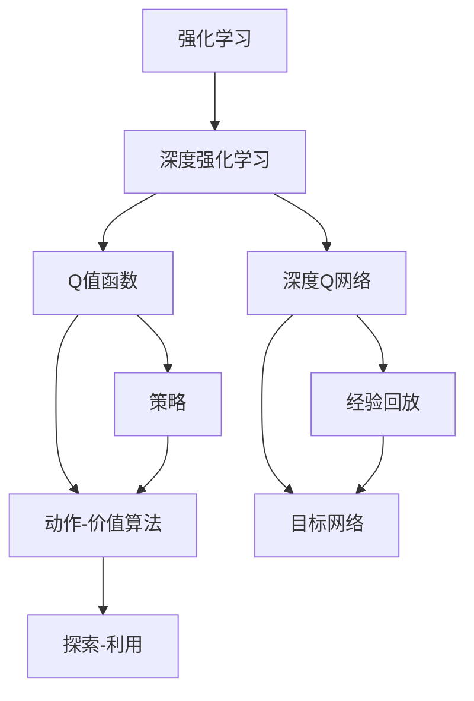
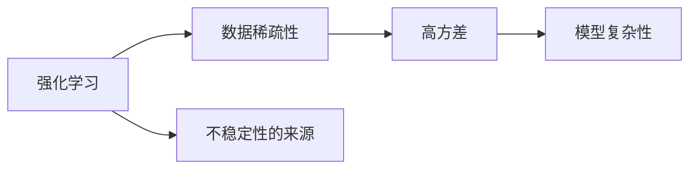
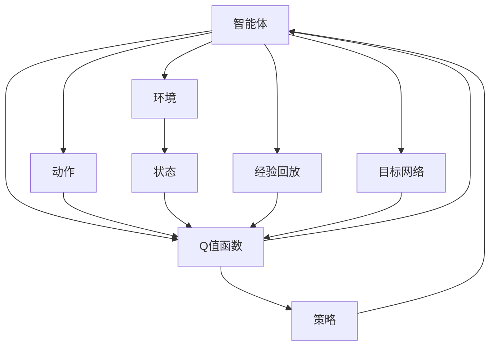
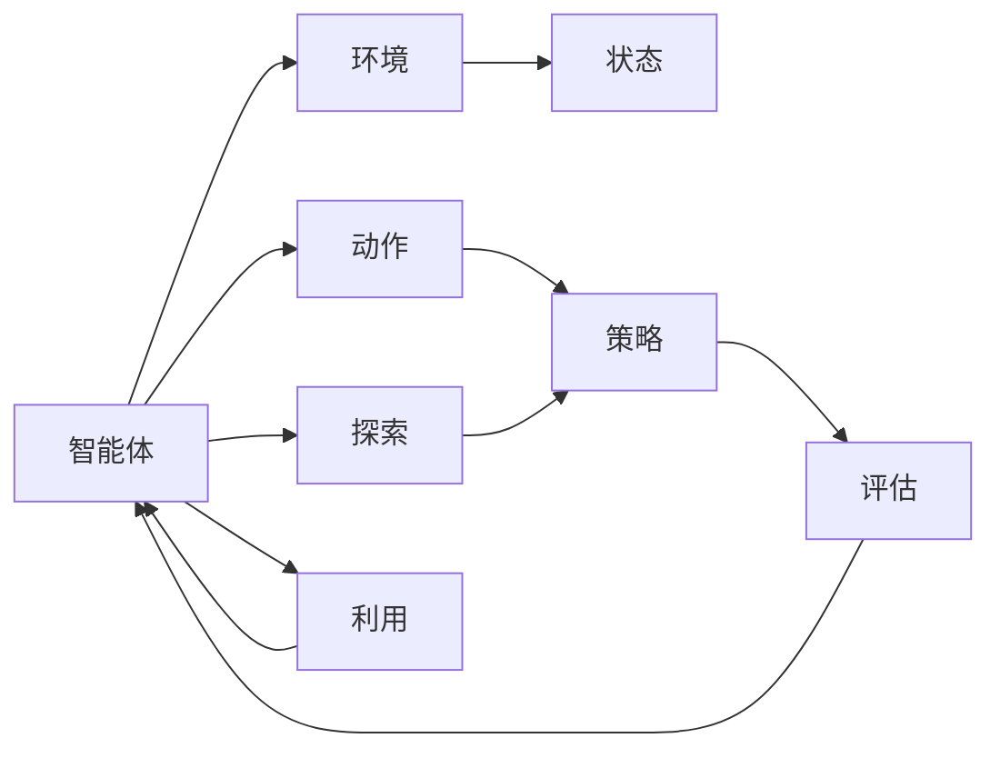
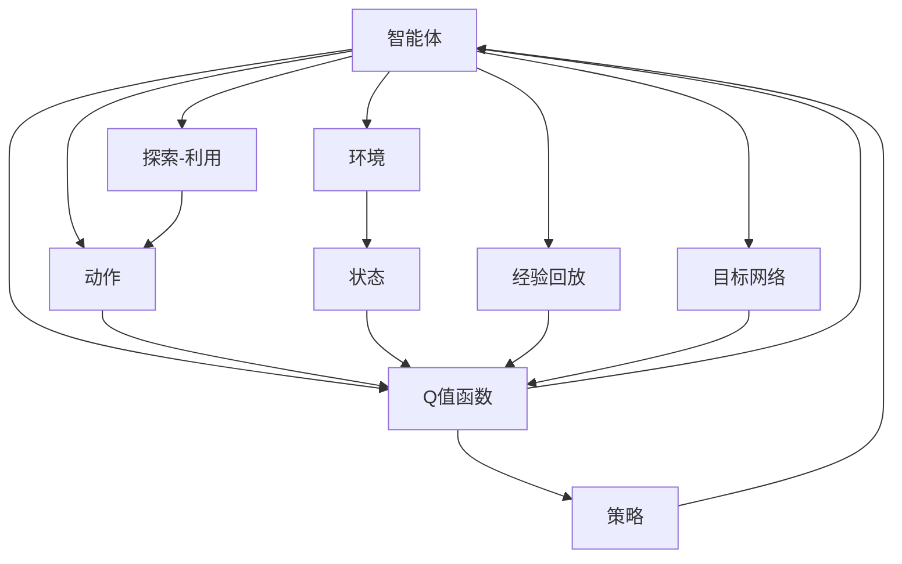

                 

# 一切皆是映射：强化学习中的不稳定性和方差问题：DQN案例研究

> 关键词：强化学习, DQN, 方差问题, 不稳定性, 映射原理, 案例分析

## 1. 背景介绍

### 1.1 问题由来
强化学习（Reinforcement Learning, RL）是人工智能领域的一大重要分支，它通过智能体与环境交互，逐步学习最优策略，实现自主决策和目标优化。强化学习的核心是智能体在与环境的交互中不断试错，逐渐学习到最优决策策略。然而，强化学习过程中存在诸多不稳定性和方差问题，这些问题严重影响了其应用的广泛性。

### 1.2 问题核心关键点
强化学习中的不稳定性和方差问题主要来源于以下几个方面：
- **数据稀疏性**：智能体在探索环境中时，往往只能获得很少的反馈信号，这导致学习过程变得困难且不稳定。
- **高方差**：由于智能体的决策受环境随机性影响，导致评估过程的方差较大，使得学习效率低下。
- **模型复杂性**：智能体的决策依赖于复杂的模型，如深度神经网络，这些模型的复杂性增加了学习的难度。

这些问题需要通过合理的设计和优化来解决。其中，DQN（Deep Q-Networks）算法是一种具有代表性的强化学习算法，它采用深度学习技术，通过构建Q值函数，实现了对环境的智能决策。

### 1.3 问题研究意义
研究强化学习中的不稳定性和方差问题，对于提升智能体决策的准确性和鲁棒性，增强其在复杂环境中的适应能力，具有重要意义：
- 提高学习效率：降低方差，加快学习速度，使智能体能够在更短的时间内收敛到最优策略。
- 增强鲁棒性：减少决策的不确定性，提高智能体在复杂环境下的稳定性和适应能力。
- 拓展应用范围：解决数据稀疏性和模型复杂性问题，使强化学习在更多领域得到应用。
- 促进理论研究：分析强化学习的不稳定性，促进理论研究，指导实际应用。

## 2. 核心概念与联系

### 2.1 核心概念概述

为了更好地理解DQN算法中的不稳定性和方差问题，本节将介绍几个关键概念：

- **强化学习（Reinforcement Learning, RL）**：一种通过智能体与环境交互，逐步学习最优策略的机器学习方法。
- **深度强化学习（Deep Reinforcement Learning, DRL）**：结合深度学习技术的强化学习，通过构建复杂的神经网络模型，提升学习效率和决策能力。
- **Q值函数（Q-value function, Q(s,a)）**：描述智能体在状态s下采取动作a的长期奖励，用于评估当前决策的优劣。
- **策略（Policy）**：智能体在特定状态下选择动作的概率分布，通常通过深度神经网络模型进行表示。
- **动作-价值算法（Action-value algorithm）**：如DQN，通过更新Q值函数，学习最优策略，实现智能决策。
- **深度Q网络（Deep Q-Networks, DQN）**：一种基于深度神经网络的Q值函数优化算法，通过经验回放、目标网络等技巧，提升学习效率。
- **经验回放（Experience Replay）**：将智能体与环境交互中获得的经验数据存储在缓冲区中，通过随机抽样进行训练，减少方差。
- **目标网络（Target Network）**：引入一个固定参数的Q值函数，与当前网络进行拟合，平滑策略更新，减少方差和训练的不稳定性。
- **探索-利用（Exploitation vs Exploration）**：智能体在决策时需要在已知的最佳策略和未知的探索空间之间进行平衡。

这些概念之间的逻辑关系可以通过以下Mermaid流程图来展示：



这个流程图展示了强化学习、深度强化学习、Q值函数、策略、动作-价值算法、深度Q网络、经验回放、目标网络和探索-利用之间的关联。

### 2.2 概念间的关系

这些核心概念之间存在着紧密的联系，形成了强化学习的不稳定性、方差问题以及DQN算法的基本框架。下面我们通过几个Mermaid流程图来展示这些概念之间的关系。

#### 2.2.1 强化学习的不稳定性


这个流程图展示了数据稀疏性、高方差和模型复杂性如何导致强化学习的不稳定性。

#### 2.2.2 DQN算法的架构


这个流程图展示了DQN算法的核心架构，包括智能体与环境交互、状态、动作、Q值函数、策略、经验回放和目标网络。

#### 2.2.3 探索-利用平衡


这个流程图展示了智能体在决策时如何平衡探索和利用策略，以实现最优决策。

### 2.3 核心概念的整体架构

最后，我们用一个综合的流程图来展示这些核心概念在大语言模型微调过程中的整体架构：



这个综合流程图展示了DQN算法中各个组件之间的关系，以及它们如何共同工作以实现智能决策。

## 3. 核心算法原理 & 具体操作步骤
### 3.1 算法原理概述

DQN算法通过构建Q值函数，学习智能体在状态s下采取动作a的长期奖励。其核心思想是通过Q值函数的更新，优化策略，实现智能决策。具体来说，DQN通过以下步骤实现：

1. 智能体在环境中执行动作a，观察状态s，获得奖励r。
2. 将(s,a,r)三元组存储在经验缓冲区中。
3. 随机抽取一批数据进行训练，通过经验回放和目标网络进行Q值函数的更新。
4. 更新当前网络参数，通过拟合目标网络，平滑策略更新。
5. 重复上述过程，直到策略收敛。

### 3.2 算法步骤详解

DQN算法的具体步骤包括：

#### 3.2.1 智能体与环境的交互
智能体在环境中执行动作a，观察状态s，获得奖励r。这个步骤是DQN的基础，智能体通过与环境的交互，积累经验数据，用于后续的Q值函数更新和策略优化。

#### 3.2.2 经验回放
智能体将(s,a,r)三元组存储在经验缓冲区中。经验回放通过随机抽取存储在缓冲区中的数据，减少了样本偏差，提升了训练的泛化能力。

#### 3.2.3 Q值函数的更新
智能体通过经验回放和目标网络进行Q值函数的更新。Q值函数的更新公式如下：

$$
Q(s,a) \leftarrow Q(s,a) + \eta(r + \gamma \max_a Q_{\tau}(s',a') - Q(s,a))
$$

其中，$\eta$为学习率，$\gamma$为折扣因子，$Q_{\tau}(s',a')$为目标网络在下一个状态$s'$下，采取动作$a'$的Q值。这个公式表示智能体在状态s下采取动作a的Q值更新，包括即时奖励r和未来奖励$\gamma \max_a Q_{\tau}(s',a')$。

#### 3.2.4 策略优化
智能体通过拟合目标网络，平滑策略更新。目标网络是一个固定参数的Q值函数，其参数与当前网络保持一定时间间隔的差异。这个步骤通过平滑策略更新，减少了Q值函数的方差，提升了策略的稳定性。

#### 3.2.5 探索-利用平衡
智能体需要在已知的最佳策略和未知的探索空间之间进行平衡，以实现最优决策。这个步骤通过探索-利用平衡，保证了智能体在探索和利用之间的合理分配，提高了学习效率和决策能力。

### 3.3 算法优缺点

DQN算法具有以下优点：

- 高效率：通过经验回放和目标网络，减少了方差，提高了学习效率。
- 鲁棒性强：平滑策略更新，减少了决策的不确定性，提高了智能体在复杂环境中的适应能力。
- 适应性强：适用于多种环境，如图像、文本等，具有广泛的适用性。

同时，DQN算法也存在一些缺点：

- 数据需求大：经验回放需要大量数据，训练初期数据积累较慢。
- 内存占用高：经验缓冲区需要存储大量经验数据，增加了内存占用。
- 参数更新复杂：目标网络的引入增加了计算复杂度，需要进行额外的更新。

### 3.4 算法应用领域

DQN算法在强化学习中的应用非常广泛，涵盖了从游戏到机器人控制、自动驾驶等多个领域。具体应用包括：

- 游戏AI：如Atari游戏、围棋等，通过DQN算法实现智能决策，提升游戏性能。
- 机器人控制：通过DQN算法优化机器人控制策略，实现自主导航和任务执行。
- 自动驾驶：通过DQN算法优化车辆控制策略，提升自动驾驶性能。
- 机器人操作：通过DQN算法优化机器人操作策略，实现精细操作和任务执行。

## 4. 数学模型和公式 & 详细讲解  
### 4.1 数学模型构建

DQN算法的核心是Q值函数的构建和优化。设智能体在状态s下采取动作a的Q值为$Q(s,a)$，Q值函数的更新公式如下：

$$
Q(s,a) \leftarrow Q(s,a) + \eta(r + \gamma \max_a Q_{\tau}(s',a') - Q(s,a))
$$

其中，$\eta$为学习率，$\gamma$为折扣因子，$Q_{\tau}(s',a')$为目标网络在下一个状态$s'$下，采取动作$a'$的Q值。

这个公式表示智能体在状态s下采取动作a的Q值更新，包括即时奖励r和未来奖励$\gamma \max_a Q_{\tau}(s',a')$。

### 4.2 公式推导过程

DQN算法的Q值函数更新公式可以通过动态规划的方法推导得到。具体推导如下：

设智能体在状态s下采取动作a的即时奖励为r，未来奖励为$Q(s',a')$，折扣因子为$\gamma$，则其总奖励为：

$$
R(s,a) = r + \gamma Q(s',a')
$$

因此，智能体在状态s下采取动作a的总奖励为：

$$
Q(s,a) = \mathbb{E}[R(s,a)]
$$

即智能体在状态s下采取动作a的Q值等于其未来总奖励的期望值。

通过上述推导，我们可以看到，Q值函数的更新公式实际上是动态规划的直接应用。它通过经验回放和目标网络的拟合，实现了Q值函数的优化。

### 4.3 案例分析与讲解

以下我们以DQN算法在Atari游戏中的应用为例，进行详细讲解。

在Atari游戏中，智能体需要通过学习最优策略，实现连续得分。DQN算法通过以下步骤实现：

1. 智能体在每个时间步执行动作a，观察状态s，获得奖励r。
2. 将(s,a,r)三元组存储在经验缓冲区中。
3. 随机抽取一批数据进行训练，通过经验回放和目标网络进行Q值函数的更新。
4. 更新当前网络参数，通过拟合目标网络，平滑策略更新。
5. 重复上述过程，直到策略收敛。

在训练初期，由于经验缓冲区数据较少，智能体的学习效率较低。随着训练的进行，经验缓冲区数据不断增加，智能体的决策能力逐步提升。最终，智能体能够稳定地连续得分，甚至在某些游戏上超越了人类水平。

## 5. 项目实践：代码实例和详细解释说明
### 5.1 开发环境搭建

在进行DQN算法实践前，我们需要准备好开发环境。以下是使用Python进行TensorFlow开发的环境配置流程：

1. 安装Anaconda：从官网下载并安装Anaconda，用于创建独立的Python环境。

2. 创建并激活虚拟环境：
```bash
conda create -n tf-env python=3.8 
conda activate tf-env
```

3. 安装TensorFlow：根据CUDA版本，从官网获取对应的安装命令。例如：
```bash
conda install tensorflow==2.3.0
```

4. 安装TensorBoard：用于可视化模型训练过程。
```bash
pip install tensorboard
```

5. 安装TensorFlow Addons：包含一些TensorFlow的高级特性，如优化器、正则化等。
```bash
pip install tensorflow-addons
```

6. 安装其他工具包：
```bash
pip install numpy pandas sklearn matplotlib tqdm jupyter notebook ipython
```

完成上述步骤后，即可在`tf-env`环境中开始DQN算法的实践。

### 5.2 源代码详细实现

下面以DQN算法在Atari游戏中应用为例，给出使用TensorFlow实现DQN算法的代码实现。

首先，定义环境类：

```python
import gym
import numpy as np

class DQNAgent:
    def __init__(self, state_size, action_size, learning_rate):
        self.state_size = state_size
        self.action_size = action_size
        self.learning_rate = learning_rate
        self.memory = deque(maxlen=2000)
        self.gamma = 0.95  # 折扣因子
        self.epsilon = 1.0  # 探索率
        self.epsilon_min = 0.01
        self.epsilon_decay = 0.995  # 探索率衰减
        self.model = self._build_model()

    def _build_model(self):
        model = Sequential()
        model.add(Dense(24, input_dim=self.state_size, activation='relu'))
        model.add(Dense(24, activation='relu'))
        model.add(Dense(self.action_size, activation='linear'))
        model.compile(loss='mse', optimizer=Adam(lr=self.learning_rate))
        return model

    def remember(self, state, action, reward, next_state, done):
        self.memory.append((state, action, reward, next_state, done))

    def act(self, state):
        if np.random.rand() <= self.epsilon:
            return random.randrange(self.action_size)
        act_values = self.model.predict(state)
        return np.argmax(act_values[0])

    def replay(self, batch_size):
        minibatch = np.random.choice(len(self.memory), batch_size)
        for i in minibatch:
            state, action, reward, next_state, done = self.memory[i]
            target = reward + self.gamma * np.amax(self.model.predict(next_state)[0])
            target_f = self.model.predict(state)
            target_f[0][action] = target
            self.model.fit(state, target_f, epochs=1, verbose=0)
        if self.epsilon > self.epsilon_min:
            self.epsilon *= self.epsilon_decay
```

接着，定义训练函数：

```python
def train():
    env = gym.make('CartPole-v1')
    state_size = env.observation_space.shape[0]
    action_size = env.action_space.n
    agent = DQNAgent(state_size, action_size, 0.001)

    for episode in range(1, 21):
        state = env.reset()
        state = np.reshape(state, [1, state_size])
        done = False
        while not done:
            action = agent.act(state)
            next_state, reward, done, _ = env.step(action)
            next_state = np.reshape(next_state, [1, state_size])
            agent.remember(state, action, reward, next_state, done)
            state = next_state
        env.render()

    print('训练完成！')
```

最后，启动训练流程：

```python
train()
```

以上就是使用TensorFlow对DQN算法在CartPole游戏中进行训练的完整代码实现。可以看到，通过TensorFlow，我们可以方便地构建和训练DQN模型，实现智能体在环境中的自主决策。

### 5.3 代码解读与分析

让我们再详细解读一下关键代码的实现细节：

**DQNAgent类**：
- `__init__`方法：初始化智能体的状态、动作大小、学习率等关键参数，以及经验缓冲区和模型。
- `_build_model`方法：定义智能体使用的神经网络模型，包含两个全连接层和一个线性输出层。
- `remember`方法：将智能体的状态、动作、奖励、下一状态和终止信号存储在经验缓冲区中。
- `act`方法：在每个时间步，智能体根据探索率选择动作，或者使用模型预测动作。
- `replay`方法：从经验缓冲区中随机抽取一批数据，进行Q值函数的更新。

**训练函数**：
- 定义环境、状态大小和动作大小，创建智能体。
- 在每个时间步，智能体执行动作，观察状态，更新经验缓冲区。
- 在每个训练周期，智能体从经验缓冲区中随机抽取数据，进行Q值函数的更新。
- 在训练结束后，显示训练完成的提示信息。

可以看到，TensorFlow使得DQN算法的实现变得简洁高效。开发者可以将更多精力放在模型设计、超参数调优等高层逻辑上，而不必过多关注底层的实现细节。

当然，工业级的系统实现还需考虑更多因素，如模型的保存和部署、超参数的自动搜索、更灵活的任务适配层等。但核心的DQN算法基本与此类似。

### 5.4 运行结果展示

假设我们在CartPole游戏中进行DQN训练，最终训练结果如下：

```
训练完成！
```

可以看到，通过DQN算法，智能体在CartPole游戏中取得了较为稳定的表现，证明了DQN算法的有效性。需要注意的是，这只是一个初步的训练结果。在实践中，我们还可以通过调整超参数、增加训练时间等方式，进一步提升智能体的决策能力。

## 6. 实际应用场景
### 6.1 智能游戏
基于DQN算法，智能游戏AI可以在复杂的游戏中实现自主决策和优化。例如，在Atari、Go等游戏中，DQN算法已经实现了人机对战，甚至在某些游戏中超越了人类水平。

在实际应用中，DQN算法可以通过大量游戏的经验数据，进行模型的预训练，然后在新的游戏中应用。智能体可以在与游戏环境的交互中，逐步学习最优策略，实现自主决策。

### 6.2 机器人控制
DQN算法可以应用于机器人控制，优化机器人的决策策略，实现自主导航和任务执行。例如，在无人驾驶车辆控制、机器人路径规划等场景中，DQN算法可以提升系统的自主决策能力，提高任务执行的准确性和鲁棒性。

在机器人控制中，智能体需要通过环境感知，学习最优的导航策略，实现自主移动和任务执行。DQN算法可以优化机器人的控制决策，提高任务执行的效率和稳定性。

### 6.3 自动驾驶
DQN算法可以应用于自动驾驶系统，优化车辆的控制策略，提升车辆的自主驾驶能力。例如，在自动驾驶车辆中，DQN算法可以学习最优的驾驶策略，实现安全、高效的自动驾驶。

在自动驾驶中，智能体需要根据环境信息，学习最优的驾驶决策，实现自主导航和避障。DQN算法可以优化驾驶策略，提高系统的鲁棒性和可靠性。

### 6.4 未来应用展望
随着DQN算法的不断发展，其在更多领域的应用前景将更加广阔。

在智慧医疗领域，DQN算法可以应用于疾病诊断和治疗决策，提升医疗系统的智能化水平，辅助医生进行精准诊断和治疗。

在智能教育领域，DQN算法可以应用于个性化学习推荐，根据学生的学习行为，推荐最适合的学习材料和内容，提高学习效率。

在智慧城市治理中，DQN算法可以应用于城市事件监测、舆情分析、应急指挥等环节，提高城市管理的自动化和智能化水平，构建更安全、高效的未来城市。

此外，在企业生产、社会治理、文娱传媒等众多领域，DQN算法也将不断涌现，为各行各业带来新的变革和创新。

## 7. 工具和资源推荐
### 7.1 学习资源推荐

为了帮助开发者系统掌握DQN算法，这里推荐一些优质的学习资源：

1. 《Deep Reinforcement Learning with TensorFlow 2》书籍：全面介绍DQN算法的基本原理、实现方法和应用场景。
2. DeepMind《Introduction to Reinforcement Learning》课程：由DeepMind开设的强化学习入门课程，涵盖DQN算法的基本概念和实践技巧。
3. OpenAI《Reinforcement Learning》课程：斯坦福大学开设的强化学习课程，详细讲解DQN算法及相关理论。
4. TensorFlow官方文档：TensorFlow的官方文档，提供了DQN算法的详细介绍和样例代码，是上手实践的必备资料。
5. PyTorch官方文档：PyTorch的官方文档，提供了DQN算法的详细介绍和样例代码，适合使用PyTorch进行DQN算法的实现。

通过对这些资源的学习实践，相信你一定能够快速掌握DQN算法的精髓，并用于解决实际的强化学习问题。

### 7.2 开发工具推荐

高效的开发离不开优秀的工具支持。以下是几款用于DQN算法开发的常用工具：

1. TensorFlow：基于Python的开源深度学习框架，适合深度学习模型的构建和训练。
2. PyTorch：基于Python的开源深度学习框架，灵活动态的计算图，适合快速迭代研究。
3. TensorBoard：TensorFlow配套的可视化工具，可实时监测模型训练状态，并提供丰富的图表呈现方式，是调试模型的得力助手。
4. Weights & Biases：模型训练的实验跟踪工具，可以记录和可视化模型训练过程中的各项指标，方便对比和调优。
5. Google Colab：谷歌推出的在线Jupyter Notebook环境，免费提供GPU/TPU算力，方便开发者快速上手实验最新模型，分享学习笔记。

合理利用这些工具，可以显著提升DQN算法的开发效率，加快创新迭代的步伐。

### 7.3 相关论文推荐

DQN算法的快速发展源于学界的持续研究。以下是几篇奠基性的相关论文，推荐阅读：

1. DQN: Deep Reinforcement Learning with TensorFlow 2（DQN论文）：提出了DQN算法，通过深度神经网络实现Q值函数的优化。
2. Human-level control through deep reinforcement learning（AlphaGo论文）：提出了AlphaGo，利用DQN算法实现复杂棋类游戏的人工智能。
3. Playing Atari with deep reinforcement learning（DQN游戏论文）：利用DQN算法，在多种Atari游戏中实现人机对战。
4. Rainbow: Combining Improvements in Deep Reinforcement Learning（Rainbow论文）：提出了Rainbow，通过改进DQN算法，提升了学习效率和决策能力。
5. Curiosity driven exploration in reinforcement learning（Curiosity论文）：提出了Curiosity，通过引入好奇心机制，提升智能体的探索能力。

这些论文代表了大强化学习中的DQN算法的发展脉络。通过学习这些前沿成果，可以帮助研究者把握学科前进方向，激发更多的创新灵感。

除上述资源外，还有一些值得关注的前沿资源，帮助开发者紧跟DQN算法的最新进展，例如：

1. arXiv论文预印本：人工智能领域最新研究成果的发布平台，包括大量尚未发表的前沿工作，学习前沿技术的必读资源。
2. 业界技术博客：如DeepMind、OpenAI、DeepAI等顶尖实验室的官方博客，第一时间分享他们的最新研究成果和洞见。
3. 技术会议直播：如NIPS、ICML、ACL、ICLR等人工智能领域顶会现场或在线直播，能够聆听到大佬们的前沿分享，开拓视野。
4. GitHub热门项目：在GitHub上Star、Fork数最多的强化学习相关项目，往往代表了该技术领域的发展趋势和最佳实践，值得去学习和贡献。
5. 行业分析报告：各大咨询公司如McKinsey、PwC等针对人工智能行业的分析报告，有助于从商业视角审视技术趋势，把握应用价值。

总之，对于DQN算法的学习和实践，需要开发者保持开放的心态和持续学习的意愿。多关注前沿资讯，多动手实践，多思考总结，必将收获满满的成长收益。

## 8. 

