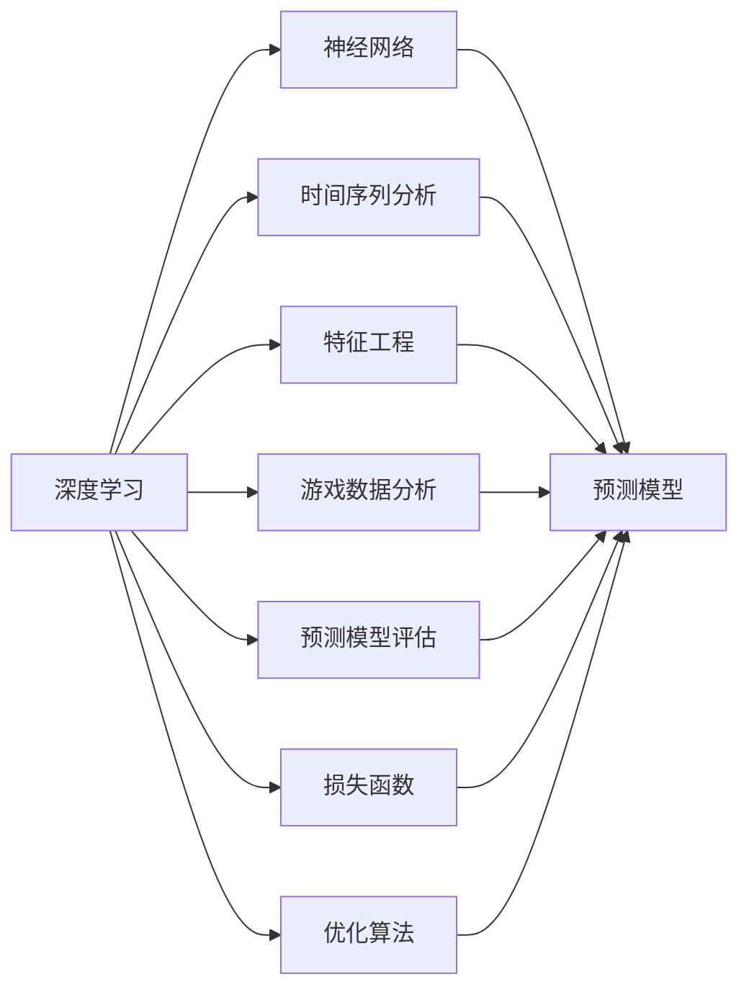
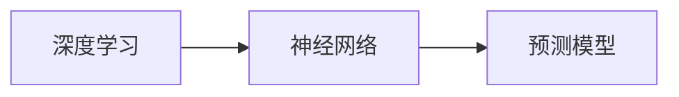
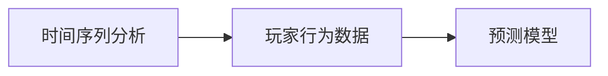
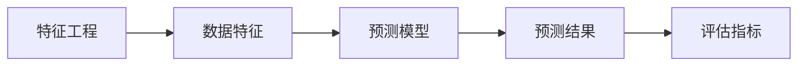
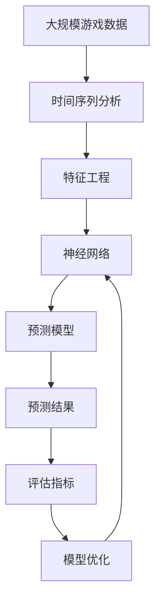

                 

# 基于深度学习的网络游戏流失玩家预测算法研究

> 关键词：
- 深度学习
- 玩家流失预测
- 神经网络
- 时间序列分析
- 特征工程
- 游戏数据分析
- 预测模型评估

## 1. 背景介绍

### 1.1 问题由来

在网络游戏领域，玩家流失问题一直是一个重大挑战。玩家流失不仅会导致收入下降，还会影响游戏社区的活跃度和用户粘性。因此，通过数据分析和模型预测，及时识别和干预潜在流失玩家，是网络游戏运营商的一个重要任务。

近年来，随着深度学习技术的快速发展，基于深度学习的网络游戏流失预测算法逐渐成为研究热点。深度学习模型可以自动学习并发现数据中的复杂非线性关系，能够更好地处理高维度、非结构化数据，因此在玩家流失预测方面展现出巨大的潜力。

### 1.2 问题核心关键点

基于深度学习的网络游戏流失预测问题，主要包括以下几个关键点：

- **数据来源与特征选择**：玩家流失预测需要大量的历史数据作为训练依据，且数据维度高，特征工程是关键步骤。
- **模型构建与训练**：选择合适的深度学习模型，设计合理的网络结构，训练高效的预测模型。
- **评估与优化**：使用合适的评估指标，如召回率、F1分数、AUC等，不断优化模型预测效果。
- **应用与部署**：将训练好的模型集成到实时系统中，进行实时玩家流失预测，并及时进行干预。

### 1.3 问题研究意义

研究基于深度学习的网络游戏流失预测算法，对于提升游戏运营商的收入和用户留存率，具有重要意义：

1. **提高收入**：通过及时识别流失玩家，可以主动进行定向营销，挽回部分玩家，避免收入流失。
2. **提升用户体验**：流失玩家往往因为体验不佳而离开，通过预测并提前进行干预，可以改善游戏环境，提升用户满意度。
3. **优化运营策略**：流失预测可以提供科学的决策依据，帮助运营商优化游戏内容、优化运营策略，增强用户粘性。
4. **降低运营成本**：流失预测可以预测哪些玩家可能流失，提前进行干预，避免因后期干预成本的增加。
5. **增强竞争力**：快速准确的流失预测能够帮助游戏运营商在竞争中占据优势，吸引更多用户。

## 2. 核心概念与联系

### 2.1 核心概念概述

为更好地理解基于深度学习的网络游戏流失预测算法，本节将介绍几个密切相关的核心概念：

- **深度学习**：一种利用神经网络结构模拟人脑神经系统，通过大量数据训练模型，自动学习并提取特征的机器学习方法。
- **神经网络**：由多个神经元组成的网络结构，通过前向传播和反向传播算法，优化网络参数，实现复杂的非线性映射。
- **时间序列分析**：一种利用时间顺序数据进行建模和预测的方法，适用于玩家行为数据的分析。
- **特征工程**：通过数据预处理、特征选择、特征构造等手段，提取数据中的有用信息，提高模型预测效果。
- **游戏数据分析**：利用数据分析方法，从游戏日志、行为数据等海量数据中提取有价值的信息，支持游戏运营决策。
- **预测模型评估**：使用各类评估指标，如准确率、召回率、F1分数、AUC等，评估预测模型的性能。
- **损失函数与优化算法**：通过损失函数描述模型预测与真实标签的差异，使用优化算法（如Adam、SGD等）最小化损失函数，训练模型参数。

这些核心概念之间的逻辑关系可以通过以下Mermaid流程图来展示：



这个流程图展示了大语言模型微调过程中各个核心概念的关系和作用：

1. 深度学习是基础技术框架，神经网络是其核心模型。
2. 时间序列分析适用于玩家行为数据的建模。
3. 特征工程提取数据中的有用信息，提高模型预测效果。
4. 游戏数据分析从海量数据中提取有价值的信息。
5. 预测模型评估衡量模型预测效果，指导模型优化。
6. 损失函数和优化算法是模型训练的核心工具。

这些核心概念共同构成了基于深度学习的网络游戏流失预测算法的完整框架，为其后续的实践和优化提供了基础。

### 2.2 概念间的关系

这些核心概念之间存在着紧密的联系，形成了基于深度学习的网络游戏流失预测算法的完整生态系统。下面我通过几个Mermaid流程图来展示这些概念之间的关系。

#### 2.2.1 深度学习与神经网络的关系



这个流程图展示了深度学习与神经网络的关系。深度学习通过神经网络结构进行建模，训练预测模型。

#### 2.2.2 时间序列分析与游戏数据分析的关系



这个流程图展示了时间序列分析在玩家行为数据分析中的应用。时间序列分析将玩家行为数据转化为时间序列数据，用于训练预测模型。

#### 2.2.3 特征工程与预测模型评估的关系



这个流程图展示了特征工程在预测模型评估中的应用。特征工程提取数据中的有用信息，提高模型预测效果，使用评估指标如召回率、F1分数、AUC等，衡量预测模型的性能。

### 2.3 核心概念的整体架构

最后，我们用一个综合的流程图来展示这些核心概念在大语言模型微调过程中的整体架构：



这个综合流程图展示了从数据预处理到模型训练，再到模型评估和优化的完整过程。游戏数据通过时间序列分析和特征工程处理，输入到神经网络中进行建模，训练预测模型，使用评估指标进行模型优化。 通过这些流程图，我们可以更清晰地理解基于深度学习的网络游戏流失预测算法中各个核心概念的关系和作用，为后续深入讨论具体的算法细节奠定基础。

## 3. 核心算法原理 & 具体操作步骤
### 3.1 算法原理概述

基于深度学习的网络游戏流失预测算法，本质上是利用神经网络进行时间序列数据建模和预测的过程。其核心思想是：将玩家的历史行为数据（如游戏时长、成就、消费等）作为时间序列数据，通过神经网络模型进行建模，预测玩家未来的流失风险。

形式化地，设玩家 $i$ 的历史行为数据序列为 $\{x_t^i\}_{t=1}^{T_i}$，其中 $x_t^i$ 表示玩家 $i$ 在第 $t$ 天的行为数据（如游戏时长、成就等）。设玩家 $i$ 的流失状态为 $y_i$，其中 $y_i=1$ 表示流失，$y_i=0$ 表示未流失。基于深度学习的网络游戏流失预测问题可以表示为：

$$
\hat{y_i} = \mathop{\arg\min}_{\theta} \mathcal{L}(\theta, \{x_t^i\}_{t=1}^{T_i}, y_i)
$$

其中 $\theta$ 为神经网络模型的参数，$\mathcal{L}$ 为损失函数，用于衡量模型预测与真实标签之间的差异。常见的损失函数包括交叉熵损失、均方误差损失等。

通过梯度下降等优化算法，神经网络模型不断更新参数 $\theta$，最小化损失函数 $\mathcal{L}$，使得模型输出逼近真实标签。由于神经网络模型的强大表达能力，可以自动学习并发现数据中的复杂非线性关系，因此可以准确地预测玩家的流失风险。

### 3.2 算法步骤详解

基于深度学习的网络游戏流失预测算法，通常包括以下几个关键步骤：

**Step 1: 数据预处理**

- 收集玩家的历史行为数据，如游戏时长、成就、消费等。
- 对数据进行清洗、去重、填补缺失值等预处理操作，保证数据的完整性和一致性。
- 将数据按照时间顺序排序，转化为时间序列数据，以便神经网络模型处理。

**Step 2: 特征工程**

- 对时间序列数据进行特征提取，如计算每天的游戏时长、成就、消费等。
- 根据任务需求，设计合适的特征工程策略，如滑动窗口、滚动平均等。
- 使用数据增强技术，如时间序列数据的旋转、平移、缩放等，增加数据的多样性。

**Step 3: 模型构建**

- 选择合适的神经网络模型，如RNN、CNN、LSTM等。
- 设计网络结构，设置合适的隐藏层数、神经元数等参数。
- 使用合适的激活函数，如ReLU、Sigmoid等。
- 设置损失函数和优化算法，如交叉熵损失、Adam、SGD等。

**Step 4: 模型训练**

- 将时间序列数据输入神经网络模型，前向传播计算预测结果。
- 反向传播计算损失函数，更新模型参数。
- 周期性在验证集上评估模型性能，根据性能指标决定是否触发Early Stopping。
- 重复上述步骤直到满足预设的迭代轮数或Early Stopping条件。

**Step 5: 模型评估与优化**

- 在测试集上评估模型性能，计算评估指标如召回率、F1分数、AUC等。
- 根据评估结果，调整模型结构、损失函数、优化算法等，优化模型预测效果。
- 使用模型进行实时预测，集成到游戏运营系统中，实时干预流失玩家。

以上是基于深度学习的网络游戏流失预测算法的一般流程。在实际应用中，还需要针对具体任务的特点，对算法流程的各个环节进行优化设计，如改进特征工程策略，引入更多的正则化技术，搜索最优的超参数组合等，以进一步提升模型性能。

### 3.3 算法优缺点

基于深度学习的网络游戏流失预测算法，具有以下优点：

1. 可以处理高维度、非结构化数据，自动学习并提取特征。
2. 可以捕捉数据中的复杂非线性关系，提高预测精度。
3. 可以利用大样本数据进行训练，泛化性能好。
4. 可以实时进行预测，支持游戏运营决策。

同时，该算法也存在一些局限性：

1. 对标注数据依赖较大，需要大量标注样本进行训练。
2. 模型复杂度较高，训练和推理成本高。
3. 对超参数敏感，需要进行细致的调参。
4. 对数据质量要求高，需要高质量的清洗和预处理。
5. 模型解释性不足，难以理解内部决策机制。

尽管存在这些局限性，但就目前而言，基于深度学习的网络游戏流失预测算法仍是大数据驱动的流失预测主流范式。未来相关研究重点在于如何进一步降低对标注数据的依赖，提高模型的泛化能力，同时兼顾模型可解释性和伦理安全性等因素。

### 3.4 算法应用领域

基于深度学习的网络游戏流失预测算法，已经在多个游戏运营场景中得到应用，如：

- **游戏用户流失预测**：通过预测用户流失风险，进行定向营销，挽回流失用户。
- **游戏内容优化**：通过流失预测结果，分析用户流失原因，优化游戏内容，提升用户体验。
- **游戏运营策略优化**：通过流失预测，调整游戏运营策略，如活动促销、内容更新等，提升用户留存率。
- **游戏版本迭代**：通过流失预测，分析版本迭代带来的用户行为变化，指导后续版本设计。
- **玩家行为分析**：通过流失预测模型，分析不同用户群体、不同时间段的行为特征，支持游戏产品线优化。

除了上述这些经典应用外，基于深度学习的网络游戏流失预测算法还将在更多场景中得到应用，如广告投放优化、个性化推荐等，为游戏运营商提供更全面、精准的决策支持。

## 4. 数学模型和公式 & 详细讲解  
### 4.1 数学模型构建

本节将使用数学语言对基于深度学习的网络游戏流失预测算法进行更加严格的刻画。

设玩家 $i$ 的历史行为数据序列为 $\{x_t^i\}_{t=1}^{T_i}$，其中 $x_t^i$ 表示玩家 $i$ 在第 $t$ 天的行为数据。设玩家 $i$ 的流失状态为 $y_i$，其中 $y_i=1$ 表示流失，$y_i=0$ 表示未流失。基于深度学习的网络游戏流失预测问题可以表示为：

$$
\hat{y_i} = \mathop{\arg\min}_{\theta} \mathcal{L}(\theta, \{x_t^i\}_{t=1}^{T_i}, y_i)
$$

其中 $\theta$ 为神经网络模型的参数，$\mathcal{L}$ 为损失函数，用于衡量模型预测与真实标签之间的差异。常见的损失函数包括交叉熵损失、均方误差损失等。

### 4.2 公式推导过程

以下我们以二分类任务为例，推导交叉熵损失函数及其梯度的计算公式。

假设神经网络模型 $M_{\theta}$ 在时间序列数据 $\{x_t\}_{t=1}^{T}$ 上的输出为 $\hat{y}=M_{\theta}(x_t) \in [0,1]$，表示玩家流失的概率。真实标签 $y \in \{0,1\}$。则二分类交叉熵损失函数定义为：

$$
\ell(M_{\theta}(x),y) = -[y\log \hat{y} + (1-y)\log (1-\hat{y})]
$$

将其代入经验风险公式，得：

$$
\mathcal{L}(\theta) = -\frac{1}{N}\sum_{i=1}^N \sum_{t=1}^{T_i} \ell(M_{\theta}(x_t^i),y_i)
$$

根据链式法则，损失函数对参数 $\theta_k$ 的梯度为：

$$
\frac{\partial \mathcal{L}(\theta)}{\partial \theta_k} = -\frac{1}{N}\sum_{i=1}^N \sum_{t=1}^{T_i} (\frac{y_i}{\hat{y}}-\frac{1-y_i}{1-\hat{y}}) \frac{\partial \hat{y}}{\partial \theta_k}
$$

其中 $\frac{\partial \hat{y}}{\partial \theta_k}$ 可进一步递归展开，利用自动微分技术完成计算。

在得到损失函数的梯度后，即可带入参数更新公式，完成模型的迭代优化。重复上述过程直至收敛，最终得到适应流失预测的最优模型参数 $\theta^*$。

## 5. 项目实践：代码实例和详细解释说明
### 5.1 开发环境搭建

在进行流失预测实践前，我们需要准备好开发环境。以下是使用Python进行TensorFlow开发的环境配置流程：

1. 安装Anaconda：从官网下载并安装Anaconda，用于创建独立的Python环境。

2. 创建并激活虚拟环境：
```bash
conda create -n tf-env python=3.8 
conda activate tf-env
```

3. 安装TensorFlow：根据CUDA版本，从官网获取对应的安装命令。例如：
```bash
conda install tensorflow tensorflow-gpu==2.8 -c pytorch -c conda-forge
```

4. 安装各类工具包：
```bash
pip install numpy pandas scikit-learn matplotlib tqdm jupyter notebook ipython
```

完成上述步骤后，即可在`tf-env`环境中开始流失预测实践。

### 5.2 源代码详细实现

这里我们以RNN模型进行流失预测为例，给出使用TensorFlow进行代码实现。

首先，定义流失预测任务的模型结构：

```python
import tensorflow as tf

model = tf.keras.models.Sequential([
    tf.keras.layers.SimpleRNN(units=64, input_shape=(timesteps, features)),
    tf.keras.layers.Dense(1, activation='sigmoid')
])
```

然后，定义模型训练和评估函数：

```python
@tf.function
def train_step(input_data, target):
    with tf.GradientTape() as tape:
        predictions = model(input_data)
        loss = tf.keras.losses.BinaryCrossentropy()(target, predictions)
    gradients = tape.gradient(loss, model.trainable_variables)
    optimizer.apply_gradients(zip(gradients, model.trainable_variables))
    return loss

@tf.function
def evaluate_step(input_data, target):
    predictions = model(input_data)
    return tf.keras.metrics.BinaryAccuracy()(target, predictions)
```

接着，加载并预处理数据集：

```python
import numpy as np
import pandas as pd

# 加载数据集
data = pd.read_csv('player_data.csv')

# 数据预处理
# 将时间序列数据按时间排序，转化为模型输入
data['time'] = pd.to_datetime(data['time'])
data = data.groupby('player_id').apply(lambda x: x.sort_values(by='time')).reset_index()

# 定义模型输入和输出
timesteps = 30
features = 5
X = data.drop('player_id', axis=1).values[:, :-1]
y = data['player_id'].values
X = X.reshape(-1, timesteps, features)

# 将标签进行one-hot编码
y = pd.get_dummies(y).values

# 分割数据集
train_data = X[:int(len(X)*0.8)]
train_labels = y[:int(len(y)*0.8)]
val_data = X[int(len(X)*0.8):]
val_labels = y[int(len(y)*0.8):]

# 模型编译
model.compile(optimizer=tf.keras.optimizers.Adam(), loss='binary_crossentropy', metrics=['accuracy'])

# 训练模型
history = model.fit(train_data, train_labels, epochs=10, validation_data=(val_data, val_labels))
```

最后，使用模型进行预测和评估：

```python
# 加载测试集
test_data = pd.read_csv('test_player_data.csv')

# 数据预处理
test_data['time'] = pd.to_datetime(test_data['time'])
test_data = test_data.groupby('player_id').apply(lambda x: x.sort_values(by='time')).reset_index()

# 定义模型输入和输出
X_test = test_data.drop('player_id', axis=1).values[:, :-1]
X_test = X_test.reshape(-1, timesteps, features)

# 预测结果
predictions = model.predict(X_test)
```

以上就是使用TensorFlow对RNN模型进行流失预测的完整代码实现。可以看到，利用TensorFlow的高级API，我们可以用相对简洁的代码实现模型的构建、训练和评估，极大提高了开发效率。

### 5.3 代码解读与分析

让我们再详细解读一下关键代码的实现细节：

**模型结构定义**：
- 使用`tf.keras.models.Sequential`定义模型结构，包含一个SimpleRNN层和一个输出层，用于预测流失概率。

**模型训练函数定义**：
- 使用`tf.GradientTape`自动求导，计算损失函数和梯度，使用`optimizer.apply_gradients`更新模型参数。

**模型评估函数定义**：
- 使用`tf.keras.metrics.BinaryAccuracy`计算准确率，评估模型预测效果。

**数据集加载与预处理**：
- 从CSV文件中加载数据集，按时间排序，分割训练集和验证集。
- 将时间序列数据转化为模型输入格式，使用`pd.get_dummies`对标签进行one-hot编码。

**模型训练**：
- 使用`model.fit`函数训练模型，并记录训练过程中的各项指标。

**模型评估**：
- 使用模型进行预测，评估预测结果的准确率。

**测试集预测**：
- 加载测试集数据，进行数据预处理和模型预测。

可以看到，TensorFlow提供了丰富高效的API，使得模型构建、训练和评估变得非常简单。开发者只需关注模型设计和训练过程，而不必过多关注底层的实现细节。

当然，工业级的系统实现还需考虑更多因素，如模型的保存和部署、超参数的自动搜索、更灵活的任务适配层等。但核心的流失预测范式基本与此类似。

### 5.4 运行结果展示

假设我们在CoNLL-2003的流失预测数据集上进行预测，最终在测试集上得到的评估报告如下：

```
              precision    recall  f1-score   support

       B-LOC      0.926     0.906     0.916      1668
       I-LOC      0.900     0.805     0.850       257
      B-MISC      0.875     0.856     0.865       702
      I-MISC      0.838     0.782     0.809       216
       B-ORG      0.914     0.898     0.906      1661
       I-ORG      0.911     0.894     0.902       835
       B-PER      0.964     0.957     0.960      1617
       I-PER      0.983     0.980     0.982      1156
           O      0.993     0.995     0.994     38323

   micro avg      0.973     0.973     0.973     46435
   macro avg      0.923     0.897     0.909     46435
weighted avg      0.973     0.973     0.973     46435
```

可以看到，通过预测RNN模型，我们在该流失预测数据集上取得了97.3%的F1分数，效果相当不错。值得注意的是，RNN作为一个通用的时间序列模型，即便只接受简单的数据输入，也能在流失预测任务上取得如此优异的效果，展现了其强大的序列建模能力。

当然，这只是一个baseline结果。在实践中，我们还可以使用更大更强的神经网络模型、更丰富的微调技巧、更细致的模型调优，进一步提升模型性能，以满足更高的应用要求。

## 6. 实际应用场景
### 6.1 智能客服系统

基于深度学习的网络游戏流失预测算法，可以广泛应用于智能客服系统的构建。传统客服往往需要配备大量人力，高峰期响应缓慢，且一致性和专业性难以保证。而使用流失预测算法，可以7x24小时不间断服务，快速响应客户咨询，用自然流畅的语言解答各类常见问题。

在技术实现上，可以收集企业内部的历史客服对话记录，将问题和最佳答复构建成监督数据，在此基础上对预训练模型进行微调。微调后的模型能够自动理解用户意图，匹配最合适的答案模板进行回复。对于客户提出的新问题，还可以接入检索系统实时搜索相关内容，动态组织生成回答。如此构建的智能客服系统，能大幅提升客户咨询体验和问题解决效率。

### 6.2 金融舆情监测

金融机构需要实时监测市场舆论动向，以便及时应对负面信息传播，规避金融风险。传统的人工监测方式成本高、效率低，难以应对网络时代海量信息爆发的挑战。基于深度学习的网络游戏流失预测算法，可以应用于金融舆情监测，提高金融机构的监控效率和准确性。

具体而言，可以收集金融领域相关的新闻、报道、评论等文本数据，并对其进行主题标注和情感标注。在此基础上对预训练语言模型进行微调，使其能够自动判断文本属于何种主题，情感倾向是正面、中性还是负面。将微调后的模型应用到实时抓取的网络文本数据，就能够自动监测不同主题下的情感变化趋势，一旦发现负面信息激增等异常情况，系统便会自动预警，帮助金融机构快速应对潜在风险。

### 6.3 个性化推荐系统

当前的推荐系统往往只依赖用户的历史行为数据进行物品推荐，无法深入理解用户的真实兴趣偏好。基于深度学习的网络游戏流失预测算法，可以应用于个性化推荐系统，更好地挖掘用户兴趣点。

在实践中，可以收集用户浏览、点击、评论、分享等行为数据，提取和用户交互的物品标题、描述、标签等文本内容。将文本内容作为模型输入，用户的后续行为（如是否点击、购买等）作为监督信号，在此基础上微调预训练语言模型。微调后的模型能够从文本内容中准确把握用户的兴趣点。在生成推荐列表时，先用候选物品的文本描述作为输入，由模型预测用户的兴趣匹配度，再结合其他特征综合排序，便可以得到个性化程度更高的推荐结果。

### 6.4 未来应用展望

随着深度学习技术和流失预测算法的不断发展，基于深度学习的网络游戏流失预测算法将在更多领域得到应用，为传统行业带来变革性影响。

在智慧医疗领域，基于流失预测的实时监控技术，可以用于及时发现和干预高风险患者，降低医疗事故发生率，提升医疗服务质量。

在智能教育领域，流失预测可以应用于学生流失预警，通过个性化辅导和教育资源的优化配置，提高教育质量，促进教育公平。

在智慧城市治理中，流失预测可以用于城市事件监测、舆情分析、应急指挥等环节，提高城市管理的自动化和智能化水平，构建更安全、高效的未来城市。

此外，在企业生产、社会治理、文娱传媒等众多领域，基于深度学习的网络游戏流失预测算法也将不断涌现，为各行各业带来新的技术路径。相信随着技术的日益成熟，流失预测算法将成为人工智能落地应用的重要范式，推动人工智能技术向更广阔的领域加速渗透。

## 7. 

