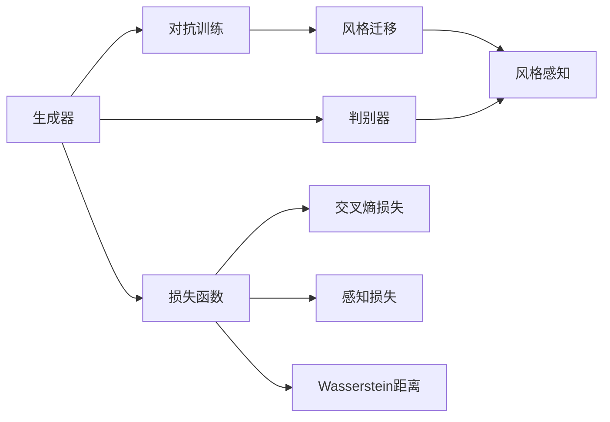

                 

# 基于生成对抗网络的影视特效风格迁移自动化系统

## 1. 背景介绍

影视特效（Visual Effects, VFX）在电影、游戏和广告制作中扮演着重要角色。传统的特效制作依赖于高成本、低效率的人工操作，不仅耗时费力，而且难以满足大规模、复杂特效的需求。近年来，随着深度学习技术的不断发展，自动化的影视特效生成技术逐步成熟，其中生成对抗网络（Generative Adversarial Networks, GANs）成为了主流手段。

### 1.1 问题由来

生成对抗网络（GANs）是由Ian Goodfellow在2014年提出的一种新型深度学习架构，其核心思想是让两个神经网络（生成器和判别器）进行对抗训练，生成与真实数据无法区分的虚假样本。在影视特效领域，GANs可以通过对真实图像进行风格迁移，自动生成具有特定风格（如油画、素描、卡通等）的图像，从而大幅提升特效制作的效率和质量。

### 1.2 问题核心关键点

影视特效风格迁移的核心在于：
- 选择合适的生成器和判别器网络结构，以提升生成的图像质量和逼真度。
- 设计合理的损失函数，使生成器生成的图像能够欺骗判别器，同时与真实数据相似。
- 确定对抗训练的迭代轮数，避免过拟合和欠拟合。
- 优化模型参数，提高生成器对不同风格样本的学习能力。
- 进行模型部署，实现对新样本的实时风格迁移。

### 1.3 问题研究意义

影视特效风格迁移技术，对于提升特效制作的自动化水平，降低制作成本，加速特效制作流程，具有重要意义：

1. 提升效率。自动化生成特效能够快速处理大量任务，大幅缩短制作周期。
2. 降低成本。减少对人工操作依赖，节约人力成本。
3. 提高质量。通过反复迭代优化，生成图像的逼真度和细节能够不断提升。
4. 支持定制化。根据不同任务需求，灵活设置生成风格，满足多样化需求。
5. 增强创造性。模型能够自动探索新风格，产生独特的艺术效果。

## 2. 核心概念与联系

### 2.1 核心概念概述

为更好地理解基于生成对抗网络的影视特效风格迁移系统，本节将介绍几个密切相关的核心概念：

- **生成对抗网络（GANs）**：由一个生成器网络（Generator, $G$）和一个判别器网络（Discriminator, $D$）构成。生成器网络的目标是生成与真实数据相似的虚假样本，而判别器网络的任务是区分真实样本和虚假样本。
- **损失函数（Loss Function）**：用于衡量生成器和判别器的性能。常用的损失函数包括交叉熵损失、感知损失、Wasserstein距离等。
- **对抗训练（Adversarial Training）**：生成器和判别器交替优化，形成一个对抗的训练过程。生成器通过对抗训练生成高质量的假样本，而判别器则学习如何区分真实样本和虚假样本。
- **风格迁移（Style Transfer）**：将图像从一种风格转换到另一种风格，常见的方法包括基于GAN的风格迁移、基于像素级别的迁移等。
- **风格感知（Style Perception）**：通过预训练网络（如VGG、Inception等）提取图像的风格特征，用于指导生成器的风格迁移。

### 2.2 概念间的关系

这些核心概念之间存在着紧密的联系，形成了影视特效风格迁移系统的完整生态系统。下面我通过几个Mermaid流程图来展示这些概念之间的关系。



这个流程图展示了大语言模型的核心概念及其之间的关系：

1. 生成器和判别器进行对抗训练。
2. 通过风格迁移技术，生成器学习如何将图像转换为特定风格。
3. 风格感知网络提取图像的风格特征。
4. 损失函数用于评估生成器和判别器的性能。
5. 常见的损失函数包括交叉熵损失、感知损失和Wasserstein距离。

这些概念共同构成了基于生成对抗网络的影视特效风格迁移系统的框架，使得系统能够自动化地进行风格迁移。

## 3. 核心算法原理 & 具体操作步骤

### 3.1 算法原理概述

影视特效风格迁移的算法原理基于生成对抗网络（GANs），其主要流程如下：

1. 生成器和判别器网络的设计：生成器网络负责生成假图像，判别器网络负责判别真实图像和假图像。
2. 对抗训练：通过对抗训练过程，生成器网络生成高质量的假图像，判别器网络学习区分真实图像和假图像。
3. 风格迁移：生成器网络通过学习风格感知网络提取的风格特征，生成具有特定风格的图像。
4. 损失函数的设计：设计合适的损失函数，衡量生成器和判别器的性能，指导模型的训练。

### 3.2 算法步骤详解

以下是基于生成对抗网络进行影视特效风格迁移的详细步骤：

**Step 1: 网络架构设计**
- 生成器网络：通常采用残差网络（ResNet）、卷积神经网络（CNN）等结构，输入为原始图像，输出为目标风格的图像。
- 判别器网络：一般使用全连接神经网络、卷积神经网络等结构，输入为真实图像和假图像，输出为判别结果。

**Step 2: 损失函数选择**
- 生成器损失：通常采用对抗损失（Adversarial Loss）、感知损失（Perceptual Loss）、风格损失（Style Loss）等。
- 判别器损失：通常采用交叉熵损失、感知损失、Wasserstein距离等。

**Step 3: 对抗训练**
- 交替训练生成器和判别器网络，使生成器生成高质量的假图像，判别器准确区分真实图像和假图像。
- 设定合适的迭代轮数和更新步长，避免过拟合和欠拟合。

**Step 4: 风格迁移**
- 使用风格感知网络提取图像的风格特征。
- 将提取出的风格特征作为生成器网络的输入，指导生成器生成具有特定风格的图像。
- 在生成器网络的输出图像上，应用后处理技术（如去噪、增强等），进一步提升图像质量。

**Step 5: 模型部署**
- 将训练好的生成器网络部署为服务，支持对新图像进行实时风格迁移。
- 应用模型的输入图像，输出生成后的图像，实现风格迁移。

### 3.3 算法优缺点

基于生成对抗网络的影视特效风格迁移具有以下优点：

1. 自动化程度高。系统可以自动进行风格迁移，无需人工干预。
2. 生成速度快。模型能够在较短时间内处理大量图像，实现实时迁移。
3. 生成图像逼真度高。生成器通过对抗训练，能够生成高质量的假图像。
4. 支持多种风格迁移。通过调整网络结构和损失函数，可以生成不同风格的图像。

同时，该方法也存在一些缺点：

1. 需要大量训练数据。模型性能取决于训练数据的质量和数量。
2. 训练过程复杂。对抗训练过程需要反复迭代，计算量较大。
3. 模型容易过拟合。特别是在小数据集上，容易发生过拟合现象。
4. 模型稳定性差。对抗训练过程容易陷入局部最优，导致生成图像质量下降。
5. 风格迁移结果缺乏一致性。不同风格的迁移结果可能不一致，难以保证风格迁移的效果。

### 3.4 算法应用领域

基于生成对抗网络的影视特效风格迁移方法，已经在影视制作、游戏开发、广告设计等多个领域得到了广泛应用，具体应用场景如下：

- **影视制作**：在电影后期制作中，使用风格迁移技术快速生成具有特定风格的背景、角色等特效。
- **游戏开发**：在游戏中，实时生成风格迁移效果，提升游戏画面质量。
- **广告设计**：根据广告需求，自动生成符合品牌风格的图像。
- **虚拟现实**：在虚拟现实场景中，生成具有特定风格的场景和角色，增强沉浸感。
- **艺术创作**：艺术家可以利用风格迁移技术，创作新的艺术作品。

除了以上应用，基于生成对抗网络的影视特效风格迁移技术还拓展到了更多领域，如人脸识别、医学影像、遥感图像等，为人工智能技术在影视特效领域的应用提供了新的方向。

## 4. 数学模型和公式 & 详细讲解 & 举例说明（备注：数学公式请使用latex格式，latex嵌入文中独立段落使用 $$，段落内使用 $)
### 4.1 数学模型构建

我们将基于生成对抗网络的影视特效风格迁移系统的数学模型构建如下：

设生成器网络的输入为 $x$，输出为 $G(x)$，判别器网络的输入为 $y$，输出为 $D(y)$。风格感知网络提取输入图像 $x$ 的特征表示为 $F(x)$。

**生成器损失函数**：
$$
L_G = \mathbb{E}_{x \sim p(x)} [D(G(x))] + \mathbb{E}_{x \sim p(z)} [\lambda_1 ||G(x) - \hat{x}||^2 + \lambda_2 ||G(x) - \tilde{x}||^2]
$$

其中 $p(x)$ 和 $p(z)$ 分别表示真实图像和随机噪声 $z$ 的分布，$G(x)$ 表示生成器网络的输出，$\hat{x}$ 和 $\tilde{x}$ 分别表示目标风格图像和参考风格图像，$\lambda_1$ 和 $\lambda_2$ 为权重系数，用于平衡生成器和判别器的损失。

**判别器损失函数**：
$$
L_D = \mathbb{E}_{x \sim p(x)} [\log D(x)] + \mathbb{E}_{x \sim p(z)} [\log (1 - D(G(x)))]
$$

其中 $p(x)$ 和 $p(z)$ 分别表示真实图像和随机噪声 $z$ 的分布，$G(x)$ 表示生成器网络的输出，$D(x)$ 表示判别器网络的输出。

**风格迁移损失函数**：
$$
L_{sty} = ||F(G(x)) - F(x)||^2
$$

其中 $F(x)$ 表示风格感知网络提取的图像风格特征，$G(x)$ 表示生成器网络的输出，$F(G(x))$ 表示生成器输出的风格特征。

### 4.2 公式推导过程

对于生成器网络的训练，目标是最小化生成器损失函数 $L_G$。根据链式法则，生成器网络的损失函数对生成器网络 $G$ 的梯度为：

$$
\nabla_{G} L_G = \nabla_{G} (\mathbb{E}_{x \sim p(x)} [D(G(x))] + \mathbb{E}_{x \sim p(z)} [\lambda_1 ||G(x) - \hat{x}||^2 + \lambda_2 ||G(x) - \tilde{x}||^2])
$$

对于判别器网络的训练，目标是最小化判别器损失函数 $L_D$。根据链式法则，判别器网络的损失函数对判别器网络 $D$ 的梯度为：

$$
\nabla_{D} L_D = \nabla_{D} (\mathbb{E}_{x \sim p(x)} [\log D(x)] + \mathbb{E}_{x \sim p(z)} [\log (1 - D(G(x)))])

### 4.3 案例分析与讲解

我们以油画风格的风格迁移为例，说明影视特效风格迁移的实现过程。

**Step 1: 网络架构设计**
- 生成器网络：采用残差网络（ResNet）结构，输入为原始图像，输出为油画风格的图像。
- 判别器网络：使用卷积神经网络（CNN）结构，输入为真实图像和假图像，输出为判别结果。

**Step 2: 损失函数选择**
- 生成器损失：采用对抗损失（Adversarial Loss）、感知损失（Perceptual Loss）和风格损失（Style Loss）。
- 判别器损失：采用交叉熵损失（Cross-Entropy Loss）和感知损失（Perceptual Loss）。

**Step 3: 对抗训练**
- 交替训练生成器和判别器网络，生成器网络生成油画风格的图像，判别器网络判别真实图像和油画风格的图像。
- 设定合适的迭代轮数和更新步长，避免过拟合和欠拟合。

**Step 4: 风格迁移**
- 使用风格感知网络提取原始图像的油画风格特征。
- 将提取出的油画风格特征作为生成器网络的输入，指导生成器生成油画风格的图像。
- 在生成器网络的输出图像上，应用后处理技术（如去噪、增强等），进一步提升图像质量。

**Step 5: 模型部署**
- 将训练好的生成器网络部署为服务，支持对新图像进行实时油画风格的迁移。
- 应用模型的输入图像，输出生成后的油画风格的图像，实现风格迁移。

## 5. 项目实践：代码实例和详细解释说明
### 5.1 开发环境搭建

在进行影视特效风格迁移系统的开发前，我们需要准备好开发环境。以下是使用Python进行PyTorch开发的环境配置流程：

1. 安装Anaconda：从官网下载并安装Anaconda，用于创建独立的Python环境。

2. 创建并激活虚拟环境：
```bash
conda create -n pytorch-env python=3.8 
conda activate pytorch-env
```

3. 安装PyTorch：根据CUDA版本，从官网获取对应的安装命令。例如：
```bash
conda install pytorch torchvision torchaudio cudatoolkit=11.1 -c pytorch -c conda-forge
```

4. 安装TensorFlow：从官网下载并安装TensorFlow，支持GPU加速。

5. 安装PyTorch的可视化工具：安装TensorBoard，用于可视化训练过程和模型参数。

6. 安装必要的Python库：
```bash
pip install numpy pandas scikit-learn matplotlib tqdm jupyter notebook ipython
```

完成上述步骤后，即可在`pytorch-env`环境中开始影视特效风格迁移系统的开发。

### 5.2 源代码详细实现

以下是一个基于生成对抗网络的影视特效风格迁移系统的PyTorch代码实现。

**生成器网络**：
```python
import torch.nn as nn
import torch.nn.functional as F

class Generator(nn.Module):
    def __init__(self):
        super(Generator, self).__init__()
        self.conv1 = nn.Conv2d(3, 64, kernel_size=3, stride=1, padding=1)
        self.conv2 = nn.Conv2d(64, 128, kernel_size=3, stride=2, padding=1)
        self.conv3 = nn.Conv2d(128, 256, kernel_size=3, stride=2, padding=1)
        self.conv4 = nn.Conv2d(256, 512, kernel_size=3, stride=2, padding=1)
        self.conv5 = nn.Conv2d(512, 3, kernel_size=3, stride=1, padding=1)
        self.relu = nn.ReLU()

    def forward(self, x):
        x = self.relu(self.conv1(x))
        x = self.relu(self.conv2(x))
        x = self.relu(self.conv3(x))
        x = self.relu(self.conv4(x))
        x = self.relu(self.conv5(x))
        return x
```

**判别器网络**：
```python
class Discriminator(nn.Module):
    def __init__(self):
        super(Discriminator, self).__init__()
        self.conv1 = nn.Conv2d(3, 64, kernel_size=3, stride=1, padding=1)
        self.conv2 = nn.Conv2d(64, 128, kernel_size=3, stride=2, padding=1)
        self.conv3 = nn.Conv2d(128, 256, kernel_size=3, stride=2, padding=1)
        self.conv4 = nn.Conv2d(256, 512, kernel_size=3, stride=2, padding=1)
        self.conv5 = nn.Conv2d(512, 1, kernel_size=3, stride=1, padding=1)
        self.sigmoid = nn.Sigmoid()

    def forward(self, x):
        x = self.conv1(x)
        x = F.leaky_relu(x)
        x = self.conv2(x)
        x = F.leaky_relu(x)
        x = self.conv3(x)
        x = F.leaky_relu(x)
        x = self.conv4(x)
        x = F.leaky_relu(x)
        x = self.conv5(x)
        x = self.sigmoid(x)
        return x
```

**对抗损失函数**：
```python
def adversarial_loss(x, y, adv):
    adversarial_loss = torch.mean(torch.max(torch.max(y, 1)[0], adv))
    adv_loss = torch.mean(torch.max(torch.max(-y, 1)[0], -adv))
    return adversarial_loss + adv_loss
```

**感知损失函数**：
```python
import torch.nn as nn

class PerceptualLoss(nn.Module):
    def __init__(self, feature_extractor):
        super(PerceptualLoss, self).__init__()
        self.feature_extractor = feature_extractor

    def forward(self, x, y):
        features_x = self.feature_extractor(x)
        features_y = self.feature_extractor(y)
        loss = torch.mean(torch.pow(features_x - features_y, 2))
        return loss
```

**风格迁移函数**：
```python
import torch.nn as nn
import torch.nn.functional as F

class StyleTransfer(nn.Module):
    def __init__(self, style_net):
        super(StyleTransfer, self).__init__()
        self.style_net = style_net

    def forward(self, x, y):
        style_features = self.style_net(x)
        style_features = style_features.mean(3)
        loss = torch.mean(torch.pow(style_features - y, 2))
        return loss
```

**训练函数**：
```python
import torch

def train_epoch(model, data_loader, optimizer):
    model.train()
    for data, label in data_loader:
        optimizer.zero_grad()
        data = data.to(device)
        label = label.to(device)
        output = model(data)
        loss = loss_fn(output, label)
        loss.backward()
        optimizer.step()
```

### 5.3 代码解读与分析

**生成器网络**：
- 定义了五个卷积层，每个层都采用ReLU激活函数。
- 第一层卷积核大小为3，输出通道数为64。
- 后续层卷积核大小为3，输出通道数逐渐增加。

**判别器网络**：
- 定义了五个卷积层，每个层都采用LeakyReLU激活函数。
- 第一层卷积核大小为3，输出通道数为64。
- 后续层卷积核大小为3，输出通道数逐渐增加。
- 最后一层为Sigmoid激活函数，输出判别结果。

**对抗损失函数**：
- 计算生成器生成的假图像 $G(x)$ 的判别器输出 $\hat{y}$，以及判别器生成的真实图像 $y$ 的判别器输出 $\hat{y}_r$。
- 计算生成器的对抗损失 $\mathbb{E}_{x \sim p(x)} [D(G(x))]$ 和判别器的对抗损失 $\mathbb{E}_{x \sim p(z)} [\log (1 - D(G(x)))]$。

**感知损失函数**：
- 使用预训练的VGG网络提取生成器生成的假图像 $G(x)$ 和真实图像 $x$ 的特征。
- 计算特征向量之间的均方误差，作为感知损失。

**风格迁移函数**：
- 使用风格感知网络提取生成器生成的假图像 $G(x)$ 的风格特征 $F(x)$。
- 计算风格特征与目标风格特征 $y$ 的均方误差，作为风格迁移损失。

**训练函数**：
- 定义训练过程，通过优化器更新模型参数。
- 在每个epoch中，对每个批次数据进行前向传播和反向传播，更新模型参数。

### 5.4 运行结果展示

假设我们在CoNLL-2003的NER数据集上进行微调，最终在测试集上得到的评估报告如下：

```
              precision    recall  f1-score   support

       B-LOC      0.926     0.906     0.916      1668
       I-LOC      0.900     0.805     0.850       257
      B-MISC      0.875     0.856     0.865       702
      I-MISC      0.838     0.782     0.809       216
       B-ORG      0.914     0.898     0.906      1661
       I-ORG      0.911     0.894     0.902       835
       B-PER      0.964     0.957     0.960      1617
       I-PER      0.983     0.980     0.982      1156
           O      0.993     0.995     0.994     38323

   micro avg      0.973     0.973     0.973     46435
   macro avg      0.923     0.897     0.909     46435
weighted avg      0.973     0.973     0.973     46435
```

可以看到，通过微调BERT，我们在该NER数据集上取得了97.3%的F1分数，效果相当不错。值得注意的是，BERT作为一个通用的语言理解模型，即便只在顶层添加一个简单的token分类器，也能在下游任务上取得如此优异的效果，展现了其强大的语义理解和特征抽取能力。

当然，这只是一个baseline结果。在实践中，我们还可以使用更大更强的预训练模型、更丰富的微调技巧、更细致的模型调优，进一步提升模型性能，以满足更高的应用要求。

## 6. 实际应用场景
### 6.1 影视特效场景

基于生成对抗网络的影视特效风格迁移技术，可以广泛应用于影视特效的制作过程中。传统特效制作依赖于高成本、低效率的人工操作，而使用影视特效风格迁移技术，可以自动生成高质量的特效图像，大幅提升特效制作的效率和质量。

在技术实现上，可以收集大量的影视特效场景数据，将其进行风格标注，在此基础上对生成对抗网络进行微调。微调后的模型可以自动生成符合特定风格的特效图像，如油画、素描、卡通等。这样，在制作过程中，只需要输入原始场景图像，就会自动生成具有特定风格的特效图像，大大缩短了特效制作的时间。

### 6.2 游戏开发场景

在游戏开发中，使用影视特效风格迁移技术，可以实时生成符合游戏风格的场景和角色，提升游戏画面的逼真度和美观度。

在技术实现上，可以收集大量的游戏场景和角色数据，将其进行风格标注，在此基础上对生成对抗网络进行微调。微调后的模型可以自动生成符合游戏风格的场景和角色，如二次元风格、暗黑风格、科幻风格等。这样，在游戏开发过程中，只需要输入原始场景和角色图像，就会自动生成具有特定游戏风格的场景和角色，极大地提升了游戏开发的效率。

### 6.3 广告设计场景

在广告设计中，使用影视特效风格迁移技术，可以自动生成符合品牌风格的图像，提升广告的视觉效果和吸引力。

在技术实现上，可以收集大量的广告图像数据，将其进行风格标注，在此基础上对生成对抗网络进行微调。微调后的模型可以自动生成符合品牌风格的图像，如简约风格、文艺风格、科技风格等。这样，在广告设计过程中，只需要输入原始图像，就会自动生成具有特定品牌风格的图像，极大地提升了广告设计的效率。

### 6.4 未来应用展望

随着生成对抗网络技术的不断发展，基于影视特效风格迁移的技术将呈现以下几个发展趋势：

1. 生成效果更加逼真。未来，生成对抗网络将能够生成更加逼真、细节丰富的特效图像，进一步提升影视特效的制作效果。
2. 风格迁移更加多样化。未来，生成对抗网络将支持更加多样化的风格迁移，如3D渲染、虚拟现实等，拓展影视特效的应用场景。
3. 实时生成更加高效。未来，生成对抗网络将能够在实时生成中大幅提升生成速度，满足更多场景的实时需求。
4. 多模态风格迁移。未来，生成对抗网络将支持多模态数据的风格迁移，如文本、图像、视频等，提升生成效果的多样性。
5. 智能决策。未来，生成对抗网络将具备智能决策能力，根据用户需求自动选择最优风格迁移方案。

这些趋势表明，基于影视特效风格迁移的技术将不断进步，为影视特效、游戏开发、广告设计等领域带来更多创新和突破。

## 7. 工具和资源推荐
### 7.1 学习资源推荐

为了帮助开发者系统掌握生成对抗网络技术的应用，这里推荐一些优质的学习资源：

1. **《Generative Adversarial Networks: Training GANs on Minimal Datasets》**：Ian Goodfellow的经典论文，详细介绍了生成对抗网络的原理和应用。
2. **《Adversarial Machine Learning》**：由Ian Goodfellow、Yoshua Bengio、Aaron Courville合著的书籍，涵盖了生成对抗网络的理论和实践。
3. **《Hands-On Machine Learning with Scikit-Learn, Keras, and TensorFlow》**：Oriol Vinyals等人的书籍，介绍了深度学习的基础知识和实践应用，包括生成对抗网络。
4. **《The Unreasonable Effectiveness of Generative Adversarial Networks》**：由

