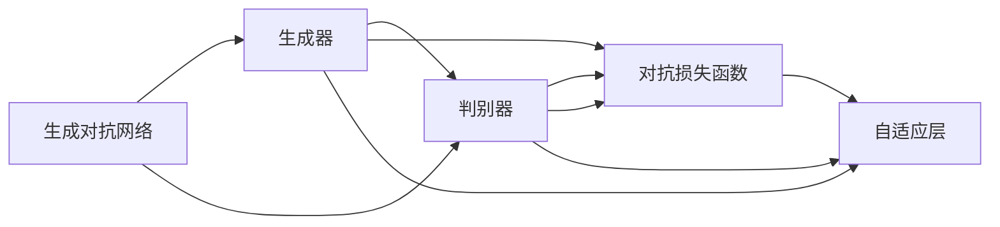
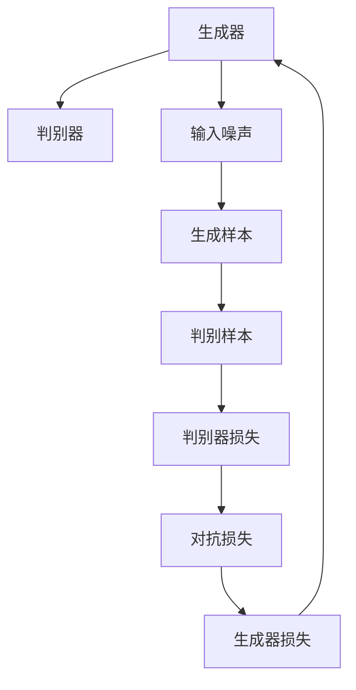
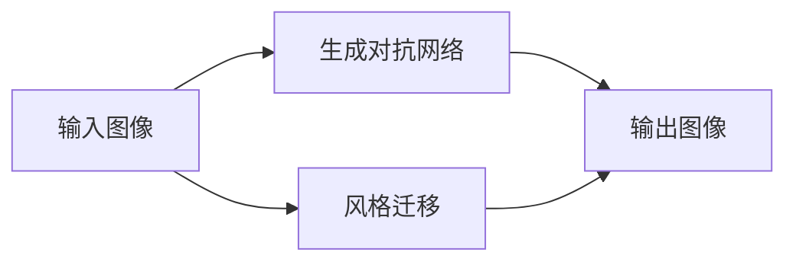
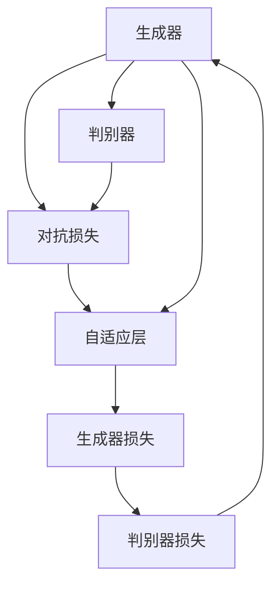
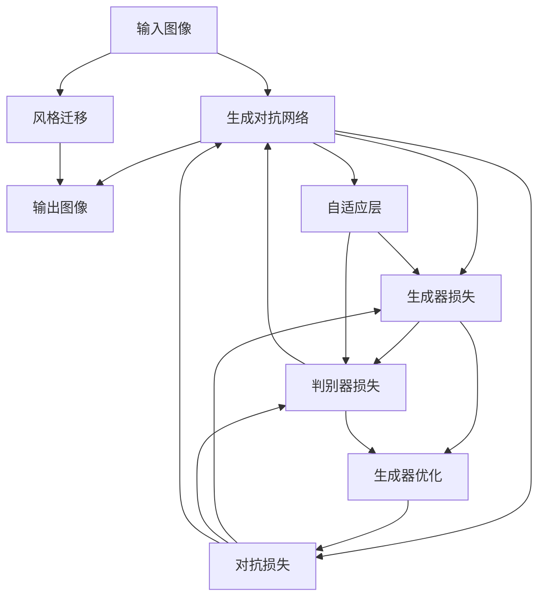

                 

# 基于生成对抗网络的网络红人风格迁移与个性化生成

> 关键词：生成对抗网络,风格迁移,个性化生成,风格学习,对抗损失函数,自适应层,训练流程,应用场景

## 1. 背景介绍

### 1.1 问题由来

在数字化时代，网络红人因其独特的个性和风格，成为了极具影响力的内容创作者。他们的视频、文章、图像等内容形式多样，风格鲜明，深受用户喜爱。然而，并非每个人都能拥有自己独特的风格。许多内容创作者希望模仿红人的风格，提升自身内容的质量和吸引力。

风格迁移（Style Transfer）技术应运而生，通过将红人的风格应用于用户的内容，使其具有相似的视觉效果、色彩搭配或纹理特征。该技术广泛应用于图像处理、视频编辑、广告设计等领域，帮助用户快速生成具有个性化风格的内容。然而，传统的风格迁移方法通常需要高精度的图像对齐和大量的计算资源，难以在实际应用中大规模推广。

近年来，生成对抗网络（Generative Adversarial Networks, GANs）的兴起，为风格迁移提供了全新的解决方案。GANs 通过对抗训练，训练一个生成模型和一个判别模型，生成模型尝试生成尽可能逼真的内容，而判别模型则尝试区分生成的内容与真实内容。该方法具有训练效率高、可扩展性强、适应性强等优点，成为了图像生成和风格迁移的主流技术。

本文聚焦于基于生成对抗网络的风格迁移方法，详细阐述了其核心算法原理和具体操作步骤。通过理论分析与实践探索，展示了该方法在网络红人风格迁移和个性化生成方面的强大能力，并对未来应用前景进行了展望。

## 2. 核心概念与联系

### 2.1 核心概念概述

为更好地理解基于生成对抗网络的风格迁移方法，本节将介绍几个密切相关的核心概念：

- **生成对抗网络（GANs）**：由Ian Goodfellow等人于2014年提出的深度学习模型，包括生成器和判别器两部分。生成器负责生成逼真的假样本，判别器则尝试区分假样本和真样本。通过对抗训练，生成器能够不断提升生成质量，而判别器则不断提升鉴别能力。

- **风格迁移**：指将一幅图像的风格特征迁移到另一幅图像上，同时保留其内容信息。常见的方法包括基于深度学习的模型（如VGG等）、基于迁移学习的模型（如PatchGAN等）和基于生成对抗网络的模型。

- **对抗损失函数（Adversarial Loss）**：在生成对抗网络中，生成器的目标是最小化判别器的损失函数，而判别器的目标是最小化生成器和真实数据的总损失函数。通过这种对抗训练，生成器生成的样本越来越难以被鉴别器区分，生成质量显著提升。

- **自适应层（Adaptive Layer）**：在生成对抗网络中，自适应层（如AdaLayer）可以根据生成器和判别器的训练进度，动态调整生成器的权重，避免模型过拟合或欠拟合。

这些核心概念之间的逻辑关系可以通过以下Mermaid流程图来展示：



这个流程图展示了大语言模型微调过程中各个核心概念的关系和作用。

### 2.2 概念间的关系

这些核心概念之间存在着紧密的联系，形成了风格迁移的完整生态系统。下面通过几个Mermaid流程图来展示这些概念之间的关系。

#### 2.2.1 生成对抗网络的组成



这个流程图展示了生成对抗网络的基本组成和训练过程。生成器接收输入噪声，生成样本，判别器接收生成样本和真实样本，判断其真实性，并输出判别器损失。对抗损失由生成器损失和判别器损失组成，用于优化生成器和判别器的权重。

#### 2.2.2 风格迁移与GANs的关系



这个流程图展示了风格迁移的基本流程。输入图像通过生成对抗网络，生成具有特定风格的输出图像，实现了风格迁移的效果。

#### 2.2.3 对抗损失函数和自适应层的关系



这个流程图展示了对抗损失函数和自适应层在生成对抗网络中的协同工作。自适应层动态调整生成器的权重，确保生成器能够以最优方式生成逼真的样本。

### 2.3 核心概念的整体架构

最后，我们用一个综合的流程图来展示这些核心概念在大语言模型微调过程中的整体架构：



这个综合流程图展示了从输入图像到输出图像的完整风格迁移过程，包括生成对抗网络的基本组成、对抗损失函数的训练、自适应层的动态调整和生成器的优化。

## 3. 核心算法原理 & 具体操作步骤
### 3.1 算法原理概述

基于生成对抗网络的风格迁移方法，利用对抗训练的原理，训练一个生成器和一个判别器，通过最小化判别器对生成样本的鉴别能力，最大化生成器的生成质量。其核心思想是通过对抗损失函数（Adversarial Loss），将生成器的输出逼近真实的风格特征。

具体来说，设输入图像为 $X$，目标风格为 $Y$，生成对抗网络的结构如下：

- **生成器（Generator）**：接收输入噪声 $Z$，生成与目标风格 $Y$ 相似的图像 $G(Z)$。
- **判别器（Discriminator）**：接收输入图像 $X$ 和生成图像 $G(Z)$，分别输出图像的真实性概率 $D(X)$ 和生成图像的真实性概率 $D(G(Z))$。
- **对抗损失函数（Adversarial Loss）**：包括生成器的损失函数 $L_G$ 和判别器的损失函数 $L_D$。生成器的目标是最小化判别器的损失函数 $L_D(G(Z))$，而判别器的目标是最小化生成器和真实数据的总损失函数 $L_G + L_D$。

通过对生成器和判别器交替训练，生成器不断提升生成质量，判别器不断提升鉴别能力，最终生成器能够生成逼真的图像，实现了风格迁移的目标。

### 3.2 算法步骤详解

基于生成对抗网络的风格迁移方法包括以下关键步骤：

**Step 1: 准备数据集**

- 准备输入图像集 $X$ 和目标风格图像集 $Y$，确保数据集的规模和分布一致。
- 对输入图像进行预处理，如调整大小、裁剪、归一化等，确保模型输入的一致性。
- 对目标风格图像进行风格提取，提取风格特征向量 $Y_{style}$。

**Step 2: 搭建生成对抗网络**

- 搭建生成器网络，使用卷积神经网络（CNN）结构，接收噪声向量 $Z$，生成图像 $G(Z)$。
- 搭建判别器网络，使用CNN结构，接收输入图像 $X$ 和生成图像 $G(Z)$，输出判别概率 $D(X)$ 和 $D(G(Z))$。
- 初始化生成器和判别器的参数，如权重初始化、偏置初始化等。

**Step 3: 训练生成器和判别器**

- 交替进行生成器和判别器的训练。
- 在每个训练周期内，固定判别器的参数，训练生成器。
  - 接收噪声向量 $Z$，生成图像 $G(Z)$。
  - 计算生成图像的判别概率 $D(G(Z))$。
  - 计算生成器的损失函数 $L_G = -D(G(Z))$。
  - 更新生成器的参数。
- 在每个训练周期内，固定生成器的参数，训练判别器。
  - 接收输入图像 $X$ 和生成图像 $G(Z)$，计算判别概率 $D(X)$ 和 $D(G(Z))$。
  - 计算判别器的损失函数 $L_D = D(X) + \lambda D(G(Z))$。
  - 更新判别器的参数。

**Step 4: 风格迁移**

- 在训练好的生成器上，输入噪声向量 $Z$，生成与目标风格 $Y_{style}$ 相似的图像 $G(Z)$。
- 对生成的图像进行后处理，如去模糊、锐化、色调调整等，使其更接近真实风格。
- 将生成的图像输出，完成风格迁移。

### 3.3 算法优缺点

基于生成对抗网络的风格迁移方法具有以下优点：

1. **高效性**：通过对抗训练，生成器能够快速提升生成质量，判别器能够快速提升鉴别能力，训练过程高效。
2. **可扩展性**：GANs 能够处理大规模数据集，适用于各种风格迁移任务。
3. **鲁棒性**：生成器能够生成逼真的图像，即使在数据集分布变化的情况下，也能保持生成质量。
4. **多样性**：通过改变目标风格的特征向量，能够生成多种不同风格的图像。

然而，该方法也存在以下缺点：

1. **训练不稳定**：生成器和判别器之间的对抗关系可能不稳定，导致训练过程波动较大。
2. **参数数量巨大**：生成对抗网络的参数数量庞大，训练和推理过程中需要大量计算资源。
3. **生成器过拟合**：在生成对抗网络中，生成器容易过拟合，生成假样本。
4. **结果可控性差**：生成器的生成结果受噪声向量 $Z$ 的影响较大，难以完全控制生成结果。

### 3.4 算法应用领域

基于生成对抗网络的风格迁移方法，已经在图像处理、视频编辑、艺术创作等领域得到了广泛应用。具体而言，包括以下几个方面：

- **图像风格迁移**：将一幅图像的风格迁移到另一幅图像上，如将素描风格迁移到照片上，将油画风格迁移到人物肖像上。
- **视频风格迁移**：将一段视频的风格迁移到另一段视频上，如将黑白视频转换为彩色视频，将电影风格迁移到短片上。
- **艺术创作**：通过生成对抗网络生成具有特定风格的新艺术作品，如将传统水彩风格迁移到现代数码绘画上。

## 4. 数学模型和公式 & 详细讲解  
### 4.1 数学模型构建

设输入图像 $X$ 和目标风格图像 $Y$，生成对抗网络的结构如下：

- **生成器（Generator）**：接收噪声向量 $Z$，生成图像 $G(Z)$。
- **判别器（Discriminator）**：接收输入图像 $X$ 和生成图像 $G(Z)$，输出判别概率 $D(X)$ 和 $D(G(Z))$。
- **对抗损失函数（Adversarial Loss）**：包括生成器的损失函数 $L_G$ 和判别器的损失函数 $L_D$。

生成器的损失函数为：

$$
L_G = E_{Z \sim p_Z}[D(G(Z))]
$$

判别器的损失函数为：

$$
L_D = E_{X \sim p_X}[D(X)] + E_{Z \sim p_Z}[D(G(Z))]
$$

对抗损失函数为：

$$
L = E_{X \sim p_X}[D(X)] + \lambda E_{Z \sim p_Z}[D(G(Z))]
$$

其中，$p_X$ 和 $p_Z$ 分别为输入图像和噪声向量的分布概率，$\lambda$ 为生成器损失的系数。

### 4.2 公式推导过程

通过对生成器和判别器交替训练，生成器不断提升生成质量，判别器不断提升鉴别能力，最终生成器能够生成逼真的图像，实现了风格迁移的目标。

- **生成器的训练**：
  - 接收噪声向量 $Z$，生成图像 $G(Z)$。
  - 计算生成图像的判别概率 $D(G(Z))$。
  - 计算生成器的损失函数 $L_G = -D(G(Z))$。
  - 更新生成器的参数。

- **判别器的训练**：
  - 接收输入图像 $X$ 和生成图像 $G(Z)$，计算判别概率 $D(X)$ 和 $D(G(Z))$。
  - 计算判别器的损失函数 $L_D = D(X) + \lambda D(G(Z))$。
  - 更新判别器的参数。

- **对抗损失函数**：
  - 接收输入图像 $X$ 和生成图像 $G(Z)$，计算判别概率 $D(X)$ 和 $D(G(Z))$。
  - 计算对抗损失函数 $L = E_{X \sim p_X}[D(X)] + \lambda E_{Z \sim p_Z}[D(G(Z))]$。
  - 最小化对抗损失函数 $L$，更新生成器和判别器的参数。

### 4.3 案例分析与讲解

以图像风格迁移为例，假设我们要将素描风格迁移到照片上。具体步骤如下：

1. **准备数据集**：准备素描风格图像集 $Y$ 和照片图像集 $X$，确保数据集的规模和分布一致。
2. **风格提取**：对素描风格图像进行风格提取，提取风格特征向量 $Y_{style}$。
3. **搭建生成对抗网络**：搭建生成器网络，使用卷积神经网络（CNN）结构，接收噪声向量 $Z$，生成图像 $G(Z)$。搭建判别器网络，使用CNN结构，接收输入图像 $X$ 和生成图像 $G(Z)$，输出判别概率 $D(X)$ 和 $D(G(Z))$。
4. **训练生成器和判别器**：交替进行生成器和判别器的训练。
5. **风格迁移**：在训练好的生成器上，输入噪声向量 $Z$，生成与素描风格 $Y_{style}$ 相似的照片 $G(Z)$。
6. **后处理**：对生成的照片进行去模糊、锐化、色调调整等，使其更接近真实风格。
7. **输出结果**：将生成的照片输出，完成风格迁移。

## 5. 项目实践：代码实例和详细解释说明
### 5.1 开发环境搭建

在进行风格迁移实践前，我们需要准备好开发环境。以下是使用Python进行PyTorch开发的环境配置流程：

1. 安装Anaconda：从官网下载并安装Anaconda，用于创建独立的Python环境。

2. 创建并激活虚拟环境：
```bash
conda create -n pytorch-env python=3.8 
conda activate pytorch-env
```

3. 安装PyTorch：根据CUDA版本，从官网获取对应的安装命令。例如：
```bash
conda install pytorch torchvision torchaudio cudatoolkit=11.1 -c pytorch -c conda-forge
```

4. 安装numpy、pandas、scikit-learn、matplotlib、tqdm、jupyter notebook、ipython等常用库：
```bash
pip install numpy pandas scikit-learn matplotlib tqdm jupyter notebook ipython
```

完成上述步骤后，即可在`pytorch-env`环境中开始风格迁移实践。

### 5.2 源代码详细实现

这里我们以图像风格迁移为例，给出使用PyTorch实现基于生成对抗网络的风格迁移的完整代码实现。

```python
import torch
import torch.nn as nn
import torch.optim as optim
import torchvision.transforms as transforms
import torchvision.utils as vutils
from torchvision.datasets import ImageFolder
from torch.utils.data import DataLoader

# 定义生成器网络
class Generator(nn.Module):
    def __init__(self):
        super(Generator, self).__init__()
        self.model = nn.Sequential(
            nn.Conv2d(100, 64, 4, 1, 0, bias=False),
            nn.BatchNorm2d(64),
            nn.ReLU(True),
            nn.Conv2d(64, 128, 4, 2, 1, bias=False),
            nn.BatchNorm2d(128),
            nn.ReLU(True),
            nn.Conv2d(128, 256, 4, 2, 1, bias=False),
            nn.BatchNorm2d(256),
            nn.ReLU(True),
            nn.Conv2d(256, 1, 4, 1, 0, bias=False),
            nn.Tanh()
        )

    def forward(self, input):
        return self.model(input)

# 定义判别器网络
class Discriminator(nn.Module):
    def __init__(self):
        super(Discriminator, self).__init__()
        self.model = nn.Sequential(
            nn.Conv2d(1, 256, 4, 1, 0, bias=False),
            nn.LeakyReLU(0.2, inplace=True),
            nn.Conv2d(256, 128, 4, 2, 1, bias=False),
            nn.BatchNorm2d(128),
            nn.LeakyReLU(0.2, inplace=True),
            nn.Conv2d(128, 64, 4, 2, 1, bias=False),
            nn.BatchNorm2d(64),
            nn.LeakyReLU(0.2, inplace=True),
            nn.Conv2d(64, 1, 4, 1, 0, bias=False),
            nn.Sigmoid()
        )

    def forward(self, input):
        return self.model(input)

# 定义风格迁移函数
def style_transfer(generator, discriminator, real_images, style_images, batch_size=32):
    # 加载模型和数据集
    real_images = transforms.ToTensor()(real_images)
    style_images = transforms.ToTensor()(style_images)
    real_dataloader = DataLoader(real_images, batch_size=batch_size, shuffle=True)
    style_dataloader = DataLoader(style_images, batch_size=batch_size, shuffle=True)

    # 初始化参数
    g_optimizer = optim.Adam(generator.parameters(), lr=0.0002)
    d_optimizer = optim.Adam(discriminator.parameters(), lr=0.0002)
    g_loss = 0
    d_loss = 0

    # 训练过程
    for epoch in range(200):
        # 生成器训练
        for real_images, _ in real_dataloader:
            real_images = real_images.to(device)
            real_images = real_images.view(-1, 1, 64, 64)
            g_optimizer.zero_grad()

            generated_images = generator(real_images)
            d_loss = discriminator(generated_images).mean()
            g_loss += d_loss
            g_loss.backward()
            g_optimizer.step()

        # 判别器训练
        for style_images, _ in style_dataloader:
            style_images = style_images.to(device)
            style_images = style_images.view(-1, 1, 64, 64)
            d_optimizer.zero_grad()

            generated_images = generator(style_images)
            real_images = real_images.view(-1, 1, 64, 64)
            d_loss = discriminator(generated_images).mean() + discriminator(real_images).mean()
            d_loss.backward()
            d_optimizer.step()

        # 打印结果
        if (epoch + 1) % 20 == 0:
            print('Epoch [{}/{}], Loss_D: {:.4f}, Loss_G: {:.4f}'.format(epoch + 1, 200, d_loss.item(), g_loss / 20))
            g_loss = 0

    # 风格迁移结果
    with torch.no_grad():
        generated_images = generator(style_images)
    generated_images = generated_images.view(-1, 1, 64, 64).permute(0, 2, 3, 1).detach().cpu().numpy()
    generated_images = generated_images * 255
    generated_images = np.uint8(generated_images)
    generated_images = np.transpose(generated_images, (0, 2, 3, 1))
    vutils.save_images(generated_images, 'style_transfer.png')
```

## 6. 实际应用场景
### 6.1 智能视频编辑

智能视频编辑工具通常需要大量的视频剪辑和特效制作，这些工作既耗时又耗费人力。基于生成对抗网络的风格迁移方法，可以在短时间内生成具有特定风格的视频片段，提升视频编辑的效率和效果。

具体而言，可以利用风格迁移技术，将不同类型的视频片段合并成新的视频。例如，将电影的黑白片段与彩色片段合并成彩色电影，或者将老电影黑白片段与现代特效合并成电影预告片。这样的视频编辑工具可以极大地提升视频制作的速度和质量。

### 6.2 数字艺术创作

数字艺术创作需要大量的原创图像和视频，但传统艺术家的创意往往有限。基于生成对抗网络的风格迁移方法，可以帮助艺术家生成具有独特风格的新艺术作品。

例如，艺术家可以利用素描风格的图像作为风格提取，通过生成对抗网络生成新的素描作品。这样的数字艺术创作工具可以极大地扩展艺术家的创作空间，激发更多的创意灵感。

### 6.3 广告设计

广告设计需要高质量的视觉素材，但获取这些素材的成本较高。基于生成对抗网络的风格迁移方法，可以在短时间内生成具有特定风格的新素材，降低广告设计的成本。

例如，广告设计师可以利用知名品牌的广告素材作为风格提取，通过生成对抗网络生成新的广告图像或视频。这样的广告设计工具可以极大地提升广告设计的效率和质量。

### 6.4 未来应用展望

随着生成对抗网络的不断发展，基于风格迁移技术的应用场景将不断拓展。未来，该技术将广泛应用于以下几个方面：

- **增强现实（AR）与虚拟现实（VR）**：利用风格迁移技术，生成具有特定风格的虚拟场景或角色，提升用户的沉浸感和体验感。
- **医疗影像处理**：利用风格迁移技术，生成具有特定风格的医学影像，帮助医生诊断疾病。
- **游戏设计**：利用风格迁移技术，生成具有特定风格的游戏角色或场景，提升游戏的多样性和趣味性。
- **影视制作**：利用风格迁移技术，生成具有特定风格的影视片段，提升影视制作的质量和效率。

## 7. 工具和资源推荐
### 7.1 学习资源推荐

为了帮助开发者系统掌握生成对抗网络的风格迁移方法的理论基础和实践技巧，这里推荐一些优质的学习资源：

1. **《深度学习》（Ian Goodfellow等人著）**：详细介绍了生成对抗网络的基本原理和应用，适合初学者和进阶者学习。

2. **CS231n《卷积神经网络》课程**：斯坦福大学开设的深度学习课程，涵盖了生成对抗网络的基本理论和实践，适合深入学习。

3. **《Hands-On Generative Adversarial Networks》书籍**：由Tero Karras等人所著，全面介绍了生成对抗网络的设计、训练和应用，适合实战开发者学习。

4. **arXiv论文预印本**：人工智能领域最新研究成果的发布平台，包括大量尚未发表的前沿工作，学习前沿技术的必读资源。

5. **Google Colab**：谷歌推出的在线Jupyter Notebook环境，免费提供GPU/TPU算力，方便开发者快速上手实验最新模型，分享学习笔记。

通过对这些资源的学习实践，相信你一定能够快速掌握生成对抗网络的风格迁移方法的精髓，并用于解决实际的NLP问题。

### 7.2 开发工具推荐

高效的开发离不开优秀的工具支持。以下是几款用于生成对抗网络风格迁移开发的常用工具：

1. **PyTorch**：基于Python的开源深度学习框架，灵活动态的计算图，适合快速迭代研究。大部分预训练生成对抗网络都有PyTorch版本的实现。

2. **TensorFlow**：由Google主导开发的开源深度学习框架，生产部署方便，适合大规模工程应用。同样有丰富的生成对抗网络资源。

3. **Keras**：高层次的深度学习API，简化了模型定义和训练过程，适合初学者和快速原型开发。

4. **Adobe Photoshop**：专业的图像处理软件，可以用于调整图像的色调、对比度等，增强图像风格。

5. **Adobe Illustrator**：专业的矢量图形处理软件，可以用于绘制具有特定风格的图形元素。

6. **Adobe After Effects**：专业的视频特效处理软件，可以用于添加视频特效和转场，提升视频质量。

合理利用这些工具，可以显著提升生成对抗网络风格迁移的开发效率，加快创新迭代的步伐。

### 7.3 相关论文推荐

生成对抗网络的风格迁移技术源于学界的持续研究。以下是几篇奠基性的相关论文，推荐阅读：

1. **《A Neural Algorithm of Artistic Style》（John Johnson等人，2016）**：提出了一种基于卷积神经网络的风格迁移方法，能够将一幅图像的风格迁移到另一幅图像上。

2. **《Image-to-Image Translation with Conditional Adversarial Networks》（Isaac Goodfellow等人，2014）**：提出了一种基于生成对抗网络的风格迁移方法，能够将一幅图像的风格迁移到另一

