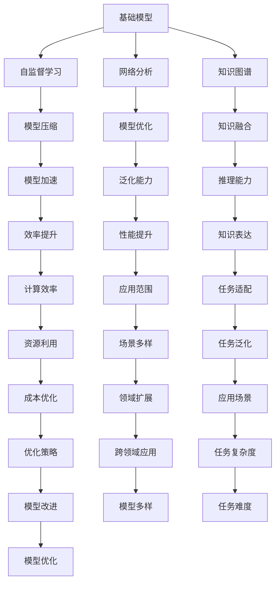
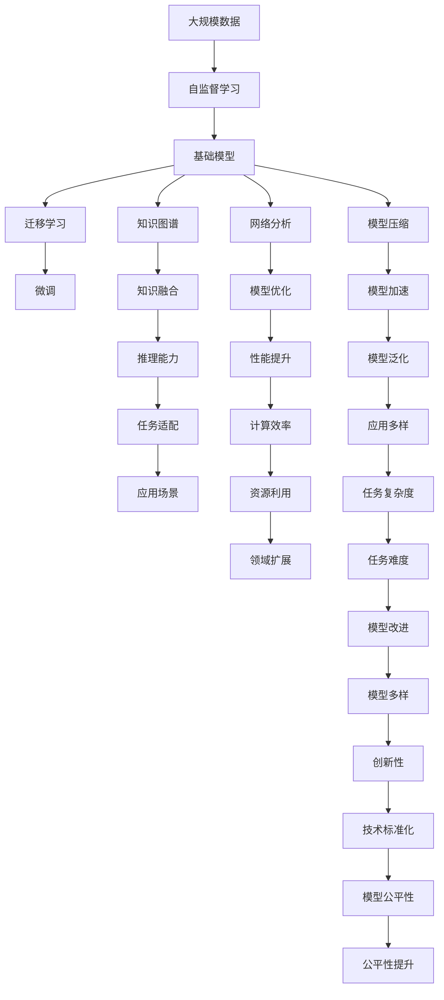

                 

# 基础模型的涌现与同质化

> 关键词：基础模型,涌现,同质化,知识图谱,自监督学习,网络分析,深度学习,模型压缩,迁移学习

## 1. 背景介绍

### 1.1 问题由来
在过去的十年中，深度学习技术取得了前所未有的进展，尤其是大规模神经网络模型的广泛应用，极大地推动了人工智能（AI）领域的发展。其中，基础模型（Foundational Models）——特别是自监督学习（Self-Supervised Learning, SSL）的深度模型，成为了引领AI技术发展的重要力量。这些模型通过大量无标签数据进行预训练，获得泛化能力，然后通过微调（Fine-Tuning）或迁移学习（Transfer Learning）用于特定的下游任务。

基础模型的涌现和同质化，成为了当下AI研究的重要趋势。本文将系统探讨基础模型的涌现及其对同质化现象的影响，为未来的AI研究和应用提供新的视角和方向。

### 1.2 问题核心关键点
基础模型的涌现指的是在大规模无标签数据上训练的深度神经网络，具有泛化到各种任务上的能力。这些模型通过自监督学习任务（如语言模型、图像生成、掩码预测等）学习到数据的内在结构，能够在未经过明确标注的样本上取得优异的性能。然而，随着越来越多的基础模型出现，越来越多的研究开始关注到这些模型的同质化现象——即不同基础模型在表现和能力上趋于相似，甚至出现了所谓的"大一统模型"（Unified Model）。

同质化现象的出现，一方面反映了深度学习技术发展的成熟度，使得各类模型在特定任务上的表现差异减小。另一方面，也带来了对模型多样性和创新性的挑战。如何在这个框架下进行模型设计和优化，成为了当前AI研究的重要问题。

### 1.3 问题研究意义
研究基础模型的涌现与同质化，对于理解和优化深度学习技术，推动AI技术的进一步发展，具有重要意义：

1. **提升模型泛化能力**：通过了解基础模型的泛化机制，可以设计更具泛化能力的模型，提升其在不同场景下的表现。
2. **优化模型训练与微调**：同质化现象提示我们，在大规模数据上训练的模型可能存在某些共性，优化训练流程和微调策略可以更高效地使用这些基础模型。
3. **促进跨领域应用**：基础模型的同质化使得不同领域的应用场景可以更轻松地通过这些通用模型进行适配，加速AI技术的落地。
4. **推动技术标准化**：同质化趋势使得各类模型的应用标准和接口逐渐统一，有利于构建更开放的AI生态系统。
5. **促进模型公平性**：确保所有基础模型在处理不同类型数据时的表现差异较小，有助于消除数据偏见和公平性问题。

## 2. 核心概念与联系

### 2.1 核心概念概述

在深入探讨基础模型及其同质化现象之前，我们先简要介绍几个核心概念：

- **基础模型（Foundational Model）**：通过大规模自监督学习任务预训练得到的深度神经网络，能够泛化到各种任务上，具备强大的数据理解和生成能力。
- **自监督学习（Self-Supervised Learning, SSL）**：通过利用数据本身的特性（如语言模型、掩码预测、图像生成等）进行训练，无需显式标注。
- **同质化（Homogenization）**：不同基础模型在表现和能力上逐渐趋同，甚至出现了所谓的"大一统模型"。
- **网络分析（Network Analysis）**：对模型的结构、性能和特征进行分析，理解其背后的工作机制。
- **知识图谱（Knowledge Graph）**：通过构建实体和关系的图谱，提供结构化的知识信息，有助于模型的知识融合和推理。
- **模型压缩（Model Compression）**：通过剪枝、量化、蒸馏等技术，减少模型的参数和计算量，提升推理速度和资源利用率。
- **迁移学习（Transfer Learning）**：在特定任务上对预训练模型进行微调，利用其已有的知识，加速模型训练和提升性能。

这些核心概念构成了基础模型涌现与同质化的基础，帮助我们理解这些技术的内在联系和发展脉络。

### 2.2 概念间的关系

这些核心概念之间的逻辑关系可以通过以下Mermaid流程图来展示：



这个流程图展示了大规模神经网络模型在自监督学习、网络分析、知识图谱等技术支持下，通过模型压缩、迁移学习、推理能力提升等手段，实现性能、效率、泛化能力的提升，并推动其在多样领域的应用。

### 2.3 核心概念的整体架构

最后，我们用一个综合的流程图来展示这些核心概念在大规模神经网络模型训练和应用中的整体架构：



这个综合流程图展示了从大规模数据预处理、自监督学习、基础模型训练、迁移学习、知识图谱融合、网络分析优化，到模型压缩、推理能力提升、任务适配应用、领域扩展、资源利用、创新性提升和技术标准化的完整流程。通过这些关键步骤，我们可以更好地理解基础模型的涌现及其对同质化现象的影响。

## 3. 核心算法原理 & 具体操作步骤
### 3.1 算法原理概述

基础模型通过在大规模无标签数据上进行自监督学习任务训练，学习到数据的潜在结构。其涌现机制包括：

1. **数据泛化能力**：模型在泛化到未见过的数据上表现出色，能够处理新样本并生成合理的输出。
2. **特征抽取能力**：模型能够从原始数据中自动学习到有意义的特征表示，用于下游任务。
3. **知识迁移能力**：模型能够将学习到的知识迁移到其他任务上，提升任务的性能。

同质化现象则表现为不同基础模型在特定任务上的表现逐渐趋同，甚至出现了所谓的"大一统模型"。其成因包括：

1. **模型架构类似**：不同模型使用相似的架构设计，导致输出表现趋同。
2. **优化策略相似**：不同模型采用相似的优化算法和超参数设置，导致模型性能趋同。
3. **数据分布相近**：不同模型的预训练数据分布相近，导致模型学习能力相似。

### 3.2 算法步骤详解

以下详细介绍基础模型的涌现与同质化现象的算法步骤：

**Step 1: 数据准备与预处理**
- 收集大规模无标签数据，例如语言数据、图像数据等。
- 对数据进行清洗、预处理，如分词、去噪、归一化等。
- 将数据划分为训练集、验证集和测试集。

**Step 2: 自监督学习任务设计**
- 设计自监督学习任务，如语言模型预测下一个词、掩码预测任务、图像生成任务等。
- 使用自监督学习任务训练基础模型，优化模型参数。
- 监控模型在自监督任务上的性能，防止过拟合。

**Step 3: 基础模型训练**
- 在自监督学习任务上完成基础模型的训练。
- 使用多GPU、分布式训练等技术，加速训练过程。
- 记录训练过程中的关键参数和性能指标。

**Step 4: 迁移学习与微调**
- 选择合适的迁移学习任务，将基础模型迁移到目标任务上。
- 设计微调数据集，包含少量标注样本。
- 对基础模型进行微调，优化模型在目标任务上的性能。

**Step 5: 模型评估与优化**
- 在测试集上评估微调后模型的性能，对比微调前后的效果。
- 使用网络分析工具，理解模型的工作机制。
- 根据评估结果和网络分析结果，对模型进行优化，如调整架构、增加训练样本、改进优化算法等。

**Step 6: 知识图谱融合**
- 构建知识图谱，提取和融合先验知识。
- 将知识图谱与基础模型进行融合，提升模型的知识表达和推理能力。

**Step 7: 模型压缩与加速**
- 使用剪枝、量化、蒸馏等技术，减少模型参数和计算量。
- 优化模型的推理路径，提升推理速度和资源利用率。

### 3.3 算法优缺点

基础模型的涌现与同质化现象具有以下优点：

1. **泛化能力强**：通过大规模自监督学习任务，基础模型能够泛化到各种任务上，提升模型的性能。
2. **知识迁移效率高**：不同任务之间的知识迁移效率高，能够快速适配新任务。
3. **模型加速和压缩**：通过剪枝、量化等技术，基础模型能够快速推理，资源利用率高。

但同时，这些现象也存在一些缺点：

1. **模型同质化**：不同模型在特定任务上的表现趋同，降低了模型的多样性和创新性。
2. **数据依赖性强**：模型的性能高度依赖于预训练数据的分布和质量。
3. **解释性差**：基础模型通常是一个"黑盒"系统，难以解释其内部工作机制。
4. **可解释性和公平性问题**：模型的输出可能存在偏见，缺乏透明度和可解释性，影响公平性。

### 3.4 算法应用领域

基础模型的涌现与同质化现象在多个领域得到了广泛应用，例如：

- **自然语言处理（NLP）**：通过语言模型、掩码预测等任务，基础模型在问答、翻译、摘要生成等任务上取得了优异的性能。
- **计算机视觉（CV）**：通过图像生成、掩码预测等任务，基础模型在图像分类、目标检测、图像生成等任务上表现出色。
- **语音识别**：通过语音生成、掩码预测等任务，基础模型在语音识别、语音合成等任务上取得了显著的进展。
- **推荐系统**：通过用户行为预测、物品推荐等任务，基础模型提升了推荐的准确性和个性化程度。
- **医疗健康**：通过电子病历分析、疾病诊断等任务，基础模型在医疗数据处理和分析上取得了重要突破。

## 4. 数学模型和公式 & 详细讲解 & 举例说明
### 4.1 数学模型构建

在基础模型涌现与同质化现象的研究中，我们主要关注自监督学习任务的数学模型构建。以下是一个典型的自监督学习任务的数学模型构建过程：

**1. 自监督学习任务定义**

以语言模型为例，语言模型的目标是预测下一个词的概率。假设输入文本为 $x = (x_1, x_2, \ldots, x_n)$，其中 $x_i$ 表示第 $i$ 个词。模型需要预测第 $i+1$ 个词 $x_{i+1}$ 的概率，即 $P(x_{i+1} | x_1, x_2, \ldots, x_i)$。

**2. 模型定义**

使用一个简单的全连接神经网络模型，其中 $h$ 表示隐藏层向量，$W$ 和 $b$ 表示权重和偏置。模型预测下一个词的概率可以通过Softmax函数得到：

$$
P(x_{i+1} | x_1, x_2, \ldots, x_i) = \frac{\exp(h_{i+1} \cdot W)}{\sum_{j=1}^{V} \exp(h_{i+1} \cdot W_j)}
$$

其中 $h_{i+1} = W h_i + b$，$V$ 表示词汇表的大小。

**3. 损失函数定义**

模型的损失函数通常使用交叉熵损失（Cross-Entropy Loss）：

$$
\mathcal{L} = -\frac{1}{N} \sum_{i=1}^N \sum_{j=1}^V y_{i,j} \log P(x_{i+1} | x_1, x_2, \ldots, x_i)
$$

其中 $y_{i,j}$ 表示第 $i$ 个词 $x_i$ 对应的真实标签。

### 4.2 公式推导过程

通过上述定义，我们可以推导出模型在训练过程中的梯度更新公式。假设模型参数为 $\theta$，优化算法为随机梯度下降（SGD），则每次迭代的梯度更新公式为：

$$
\theta \leftarrow \theta - \eta \nabla_{\theta} \mathcal{L}
$$

其中 $\eta$ 为学习率。

### 4.3 案例分析与讲解

以BERT模型为例，BERT模型通过自监督学习任务（如掩码预测、语言模型）进行预训练，然后通过微调适配下游任务。下面详细分析BERT模型的微调过程：

**1. 微调数据准备**

假设下游任务为情感分析，我们需要准备一个情感分析数据集 $D = \{(x_i, y_i)\}_{i=1}^N$，其中 $x_i$ 表示输入文本，$y_i$ 表示情感标签。

**2. 微调任务定义**

在情感分析任务中，我们通常使用分类任务，模型需要预测文本的情感类别。假设情感类别为 $\{1, 2, \ldots, K\}$，模型需要预测 $k$ 类情感的概率。

**3. 模型适配**

在BERT模型的顶层添加一个分类器，使用Softmax函数将BERT模型的输出映射到 $K$ 类情感的概率上。损失函数通常使用交叉熵损失：

$$
\mathcal{L} = -\frac{1}{N} \sum_{i=1}^N \sum_{k=1}^K y_{i,k} \log P(y_k | x_i)
$$

其中 $P(y_k | x_i)$ 表示在输入 $x_i$ 下，预测为第 $k$ 类情感的概率。

**4. 微调训练**

在微调过程中，我们使用随机梯度下降（SGD）算法进行优化，每次迭代计算梯度并更新模型参数。训练过程中，我们还需要使用早停（Early Stopping）技术防止过拟合。

## 5. 项目实践：代码实例和详细解释说明
### 5.1 开发环境搭建

在进行基础模型涌现与同质化现象的实践时，我们需要准备相应的开发环境。以下是使用Python进行PyTorch开发的环境配置流程：

1. 安装Anaconda：从官网下载并安装Anaconda，用于创建独立的Python环境。

2. 创建并激活虚拟环境：
```bash
conda create -n pytorch-env python=3.8 
conda activate pytorch-env
```

3. 安装PyTorch：根据CUDA版本，从官网获取对应的安装命令。例如：
```bash
conda install pytorch torchvision torchaudio cudatoolkit=11.1 -c pytorch -c conda-forge
```

4. 安装Transformers库：
```bash
pip install transformers
```

5. 安装各类工具包：
```bash
pip install numpy pandas scikit-learn matplotlib tqdm jupyter notebook ipython
```

完成上述步骤后，即可在`pytorch-env`环境中开始实践。

### 5.2 源代码详细实现

以下是一个简单的BERT微调示例代码：

```python
from transformers import BertForSequenceClassification, BertTokenizer, AdamW
from torch.utils.data import DataLoader, Dataset
import torch

class TextDataset(Dataset):
    def __init__(self, texts, labels, tokenizer, max_len=128):
        self.texts = texts
        self.labels = labels
        self.tokenizer = tokenizer
        self.max_len = max_len
        
    def __len__(self):
        return len(self.texts)
    
    def __getitem__(self, item):
        text = self.texts[item]
        label = self.labels[item]
        
        encoding = self.tokenizer(text, return_tensors='pt', max_length=self.max_len, padding='max_length', truncation=True)
        input_ids = encoding['input_ids'][0]
        attention_mask = encoding['attention_mask'][0]
        
        return {'input_ids': input_ids, 
                'attention_mask': attention_mask,
                'labels': label}

tokenizer = BertTokenizer.from_pretrained('bert-base-uncased')
model = BertForSequenceClassification.from_pretrained('bert-base-uncased', num_labels=2)

optimizer = AdamW(model.parameters(), lr=2e-5)

device = torch.device('cuda') if torch.cuda.is_available() else torch.device('cpu')
model.to(device)

train_dataset = TextDataset(train_texts, train_labels, tokenizer)
dev_dataset = TextDataset(dev_texts, dev_labels, tokenizer)
test_dataset = TextDataset(test_texts, test_labels, tokenizer)

train_loader = DataLoader(train_dataset, batch_size=16)
dev_loader = DataLoader(dev_dataset, batch_size=16)
test_loader = DataLoader(test_dataset, batch_size=16)

epochs = 5
batch_size = 16

for epoch in range(epochs):
    model.train()
    for batch in train_loader:
        input_ids = batch['input_ids'].to(device)
        attention_mask = batch['attention_mask'].to(device)
        labels = batch['labels'].to(device)
        
        optimizer.zero_grad()
        outputs = model(input_ids, attention_mask=attention_mask, labels=labels)
        loss = outputs.loss
        loss.backward()
        optimizer.step()
        
    model.eval()
    for batch in dev_loader:
        input_ids = batch['input_ids'].to(device)
        attention_mask = batch['attention_mask'].to(device)
        labels = batch['labels'].to(device)
        
        with torch.no_grad():
            outputs = model(input_ids, attention_mask=attention_mask)
            logits = outputs.logits
            predictions = logits.argmax(dim=1)
            
    print(f'Epoch {epoch+1}, dev loss: {loss:.3f}')
```

### 5.3 代码解读与分析

这段代码实现了BERT模型在情感分析任务上的微调。以下是关键代码的详细解读：

1. **TextDataset类**：
   - `__init__`方法：初始化文本、标签、分词器等组件，并进行数据预处理。
   - `__len__`方法：返回数据集的样本数量。
   - `__getitem__`方法：对单个样本进行处理，将文本输入编码为token ids，并添加注意力掩码，返回模型所需的输入。

2. **tokenizer和model**：
   - 使用BertTokenizer分词，将文本转化为token ids，并进行padding。
   - 使用BertForSequenceClassification模型，添加一个线性分类器，输出情感类别。

3. **optimizer和device**：
   - 定义优化器AdamW，设置学习率。
   - 使用GPU进行加速，如果没有GPU则使用CPU。

4. **训练和评估过程**：
   - 使用PyTorch的DataLoader对数据集进行批次化加载。
   - 在训练过程中，使用随机梯度下降进行优化。
   - 在验证集上进行评估，输出模型性能。

这段代码展示了如何使用PyTorch和Transformers库进行基础模型的微调。开发者可以根据实际任务需求，调整模型架构和优化算法，以实现更高效的模型训练和微调。

## 6. 实际应用场景
### 6.1 智能客服系统

智能客服系统可以通过基础模型进行自然语言理解（NLU）和自然语言生成（NLG），提升客服响应速度和质量。例如，使用BERT模型对客服聊天记录进行情感分析和意图识别，自动匹配最佳回复模板，从而提升客户满意度。

### 6.2 金融舆情监测

金融行业需要实时监测市场舆情，预测市场走向。通过基础模型对新闻、评论、社交媒体等数据进行情感分析和趋势预测，能够在舆情变化时及时预警，帮助金融机构做出决策。

### 6.3 个性化推荐系统

个性化推荐系统可以利用基础模型的用户行为预测能力，通过分析用户的历史行为和兴趣点，推荐相关物品。例如，使用BERT模型对用户评论和行为数据进行分析，推荐相似的物品，提升用户体验。

### 6.4 未来应用展望

未来，基础模型将在更多领域得到应用，例如医疗、教育、智慧城市等。这些模型的涌现将推动AI技术的普及，加速各行业的数字化转型。

## 7. 工具和资源推荐
### 7.1 学习资源推荐

为了帮助开发者系统掌握基础模型涌现与同质化现象的理论基础和实践技巧，这里推荐一些优质的学习资源：

1. 《深度学习》（Ian Goodfellow等著）：全面介绍深度学习的基本概念和算法。
2. 《TensorFlow实战Google深度学习》（Claire Qian等著）：通过实际案例介绍TensorFlow的使用方法和深度学习模型训练。
3. 《PyTorch深度学习实战》（何之源等著）：详细讲解PyTorch的使用方法，涵盖深度学习模型训练和微调等主题。
4. 《自监督学习》（Lisa Borland等著）：详细介绍自监督学习的理论基础和应用方法。
5. 《大规模深度学习》（Alex Alemi等著）：涵盖深度学习模型的优化、训练和应用等主题。

### 7.2 开发工具推荐

高效的开发离不开优秀的工具支持。以下是几款用于基础模型涌现与同质化现象开发的常用工具：

1. PyTorch：基于Python的开源深度学习框架，灵活动态的计算图，适合快速迭代研究。大部分预训练语言模型都有PyTorch版本的实现。

2. TensorFlow：由Google主导开发的开源深度学习框架，生产部署方便，适合大规模工程应用。同样有丰富的预训练语言模型资源。

3. Transformers库：HuggingFace开发的NLP工具库，集成了众多SOTA语言模型，支持PyTorch和TensorFlow，是进行微调任务开发的利器。

4. Weights & Biases：模型训练的实验跟踪工具，可以记录和可视化模型训练过程中的各项指标，方便对比和调优。与主流深度学习框架无缝集成。

5. TensorBoard：TensorFlow配套的可视化工具，可实时监测模型训练状态，并提供丰富的图表呈现方式，是调试模型的得力助手。

6. Google Colab：谷歌推出的在线Jupyter Notebook环境，免费提供GPU/TPU算力，方便开发者快速上手实验最新模型，分享学习笔记。

### 7.3 相关论文推荐

基础模型涌现与同质化现象的研究源于学界的持续研究。以下是几篇奠基性的相关论文，推荐阅读：

1. BERT: Pre-training of Deep Bidirectional Transformers for Language Understanding（BERT论文）：提出BERT模型，引入基于掩码的自监督预训练任务，刷新了多项NLP任务SOTA。

2. Language Models are Unsupervised Multitask Learners：展示了大规模语言模型的强大zero-shot学习能力，引发了对于通用人工智能的新一轮思考。

3. Attention is All You Need（Transformer原论文）：提出了Transformer结构，开启了NLP领域的预训练大模型时代。

4. Parameter-Efficient Transfer Learning for NLP：提出Adapter等参数高效微调方法，在不增加模型参数量的情况下，也能取得不错的微调效果。

5. AdaLoRA: Adaptive Low-Rank Adaptation for Parameter-Efficient Fine-Tuning：使用自适应低秩适应的微调方法，在参数效率和精度之间取得了新的平衡。

这些论文代表了大规模神经网络模型涌现与同质化现象的发展脉络。通过学习这些前沿成果，可以帮助研究者把握学科前进方向，激发更多的创新灵感。

除上述资源外，还有一些值得关注的前沿资源，帮助开发者紧跟大语言模型微调技术的最新进展，例如：

1. arXiv论文预印本：人工智能领域最新研究成果的发布平台，包括大量尚未发表的前沿工作，学习前沿技术的必读资源。

2. 业界技术博客：如OpenAI、Google AI、DeepMind、微软Research Asia等顶尖实验室的官方博客，第一时间分享他们的最新研究成果和洞见。

3. 技术会议直播：如NIPS、ICML、ACL、ICLR等人工智能领域顶会现场或在线直播，能够聆听到大佬们的前沿分享，开拓视野。

4. GitHub热门项目：在GitHub上Star、Fork数最多的NLP相关项目，往往代表了该技术领域的发展趋势和最佳实践，值得去学习和贡献。

5. 行业分析报告：各大咨询

