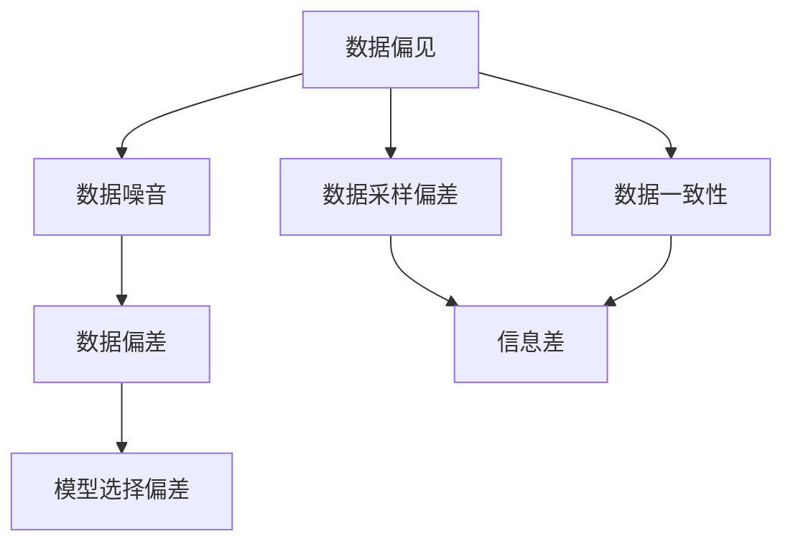
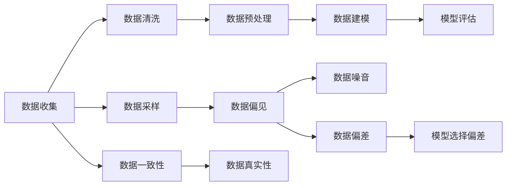
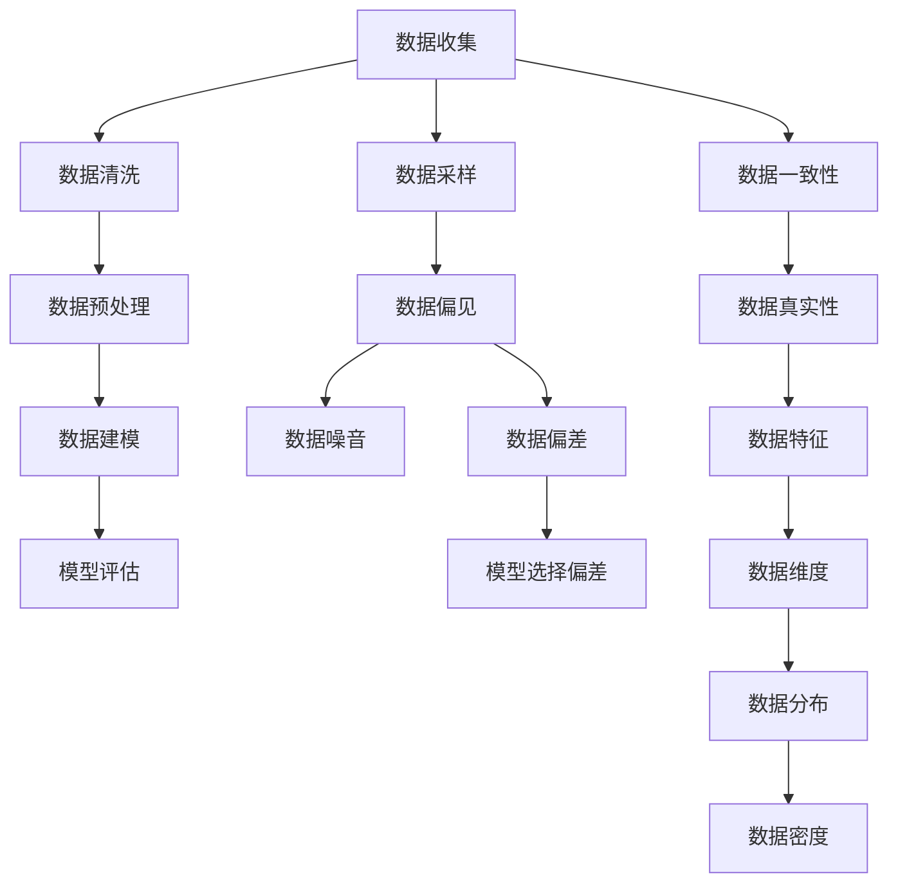
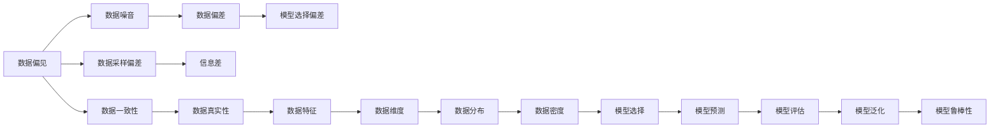
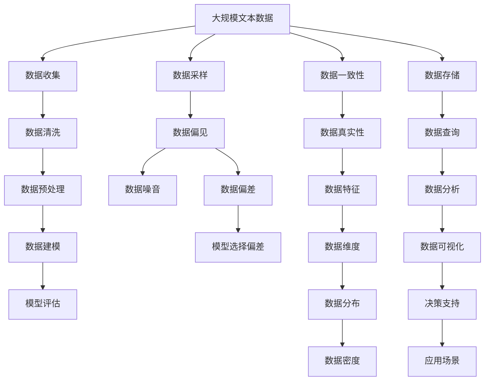

                 

# 信息差：大数据分析的核心原理

## 1. 背景介绍

### 1.1 问题由来

在信息化时代，数据的爆炸式增长已经改变了各行各业的运作模式。大数据分析作为数据驱动决策的重要工具，已经被广泛应用于市场营销、金融风控、物流管理等领域，推动着商业模式的创新和升级。然而，尽管大数据技术在数据处理和分析上取得了长足的进步，信息不对称、数据质量差、噪音多等问题仍然困扰着数据分析的实践。信息差（Information Gap）作为大数据分析的核心问题，正受到越来越多研究者和从业者的关注。

信息差（Information Gap）指的是数据采集、存储、处理和分析过程中存在的误解、偏差和差距。这些信息差可能来源于数据源的偏见、数据采集的偏差、数据处理的错误、模型选择的问题等多方面原因。信息差不仅影响数据分析的准确性和可靠性，还可能导致决策失误、资源浪费甚至社会风险。

### 1.2 问题核心关键点

为了更好地理解信息差的形成和影响，本节将介绍几个关键概念：

- **数据偏见（Data Bias）**：数据源中存在的偏见和不平衡，如性别、种族、年龄等因素的不均衡分布，可能导致模型学习到的公平性不足。
- **数据噪音（Data Noise）**：采集过程中引入的错误、异常和错误信息，如数据传输错误、数据录入错误等，可能导致模型过拟合或欠拟合。
- **数据偏差（Data Skewness）**：数据分布的不均匀性，如长尾现象，可能导致模型对少数样本过于敏感，而对多数样本的代表性不足。
- **模型选择偏差（Model Selection Bias）**：在模型选择过程中，由于主观或客观原因，选择不适合的数据特征或模型，导致模型预测能力差。
- **数据采样偏差（Data Sampling Bias）**：由于样本采集方法不当，导致数据样本分布不均衡，从而影响模型泛化能力。

这些核心概念之间的逻辑关系可以通过以下Mermaid流程图来展示：



这个流程图展示了大数据中信息差的形成机制，以及各核心概念间的关联关系。

### 1.3 问题研究意义

研究信息差对大数据分析的深远影响，对于提升数据质量、优化数据处理流程、提高数据分析的准确性和可靠性具有重要意义：

1. **提升数据质量**：通过识别和修正信息差，可以保证数据的准确性和一致性，提高数据的可用性和可信度。
2. **优化数据处理流程**：通过分析信息差的成因，优化数据采集、清洗、处理和存储等环节，提升数据处理效率和质量。
3. **提高数据分析准确性**：通过消除信息差，确保模型学习到的是真实的数据特征，从而提升模型预测的准确性和鲁棒性。
4. **避免决策失误**：通过减少信息差，降低因数据偏差和噪音导致的决策失误，提高决策的科学性和合理性。
5. **提高资源利用率**：通过消除信息差，避免资源浪费，提高数据和算力的利用效率，降低成本。

## 2. 核心概念与联系

### 2.1 核心概念概述

为更好地理解信息差的形成和影响，本节将介绍几个密切相关的核心概念：

- **数据偏见（Data Bias）**：数据源中存在的偏见和不平衡，如性别、种族、年龄等因素的不均衡分布，可能导致模型学习到的公平性不足。
- **数据噪音（Data Noise）**：采集过程中引入的错误、异常和错误信息，如数据传输错误、数据录入错误等，可能导致模型过拟合或欠拟合。
- **数据偏差（Data Skewness）**：数据分布的不均匀性，如长尾现象，可能导致模型对少数样本过于敏感，而对多数样本的代表性不足。
- **模型选择偏差（Model Selection Bias）**：在模型选择过程中，由于主观或客观原因，选择不适合的数据特征或模型，导致模型预测能力差。
- **数据采样偏差（Data Sampling Bias）**：由于样本采集方法不当，导致数据样本分布不均衡，从而影响模型泛化能力。

这些核心概念之间的逻辑关系可以通过以下Mermaid流程图来展示：


这个流程图展示了大数据中信息差的形成机制，以及各核心概念间的关联关系。

### 2.2 概念间的关系

这些核心概念之间存在着紧密的联系，形成了信息差问题的完整生态系统。下面我通过几个Mermaid流程图来展示这些概念之间的关系。

#### 2.2.1 数据处理流程



这个流程图展示了从数据收集到模型评估的完整数据处理流程，以及各个环节可能存在的信息差问题。

#### 2.2.2 数据处理偏差的来源



这个流程图展示了数据处理过程中偏差的来源，包括数据采样偏差、数据偏见、数据噪音、数据偏差和模型选择偏差等。

#### 2.2.3 数据处理与模型选择的关系



这个流程图展示了数据处理与模型选择的关系，以及信息差对模型选择和预测能力的影响。

### 2.3 核心概念的整体架构

最后，我们用一个综合的流程图来展示这些核心概念在大数据分析过程中的整体架构：



这个综合流程图展示了从数据收集到数据分析的完整过程，以及各个环节可能存在的信息差问题。

## 3. 核心算法原理 & 具体操作步骤
### 3.1 算法原理概述

信息差是指在数据分析过程中，由于数据偏见、数据噪音、数据偏差、模型选择偏差和数据采样偏差等多方面因素的影响，导致数据处理结果与实际真实情况存在差距。为了有效识别和消除信息差，需要对数据处理流程进行全面监控和优化。

形式化地，假设数据处理流程为 $\pi$，其中 $\pi$ 为数据处理步骤的集合。信息差的度量为 $I(\pi)$，定义为数据处理结果与真实情况之间的差异度量。则信息差最小化问题可以表示为：

$$
\min_{\pi} I(\pi)
$$

通过优化数据处理流程 $\pi$，可以最大化数据处理结果与真实情况的一致性，从而减少信息差。

### 3.2 算法步骤详解

基于信息差的大数据分析，一般包括以下几个关键步骤：

**Step 1: 数据收集与预处理**
- 收集数据样本 $D=\{x_1,x_2,\dots,x_N\}$，其中 $x_i$ 为样本 $i$ 的数据点。
- 对数据进行清洗和预处理，如去重、降噪、数据格式转换等，确保数据的完整性和一致性。

**Step 2: 数据采样与偏差识别**
- 使用随机抽样、分层抽样等方法从数据集中抽取样本，确保样本的代表性。
- 识别数据中的偏见和偏差，如性别偏见、年龄偏差等，并记录偏见度量指标。

**Step 3: 模型选择与训练**
- 根据任务需求选择合适的数据特征和模型，如线性回归、决策树、神经网络等。
- 对模型进行训练，调整模型参数，确保模型在训练集上的泛化能力。

**Step 4: 模型评估与优化**
- 在测试集上对模型进行评估，计算模型性能指标，如准确率、召回率、F1分数等。
- 分析模型性能的瓶颈和不足，针对性地优化模型，如增加特征维度、调整模型结构等。

**Step 5: 数据分析与可视化**
- 使用统计分析和机器学习技术对数据进行分析，提取有价值的信息。
- 利用数据可视化工具，如Tableau、PowerBI等，将分析结果进行可视化展示。

**Step 6: 决策支持与应用**
- 根据数据分析结果，制定决策方案，如市场推广策略、金融风控措施等。
- 将数据分析结果应用于实际场景，如营销活动、产品设计、风险控制等。

以上是基于信息差的大数据分析的一般流程。在实际应用中，还需要针对具体任务的特点，对数据处理流程的各个环节进行优化设计，如改进数据采样方法、引入更多数据特征、采用更先进的模型结构等，以进一步提升数据分析的效果。

### 3.3 算法优缺点

基于信息差的大数据分析方法具有以下优点：
1. 全面监控数据处理流程。通过系统性地识别和消除信息差，可以确保数据处理结果的真实性和可靠性。
2. 提升数据质量。通过数据采样和偏差识别，可以优化数据收集和处理过程，提升数据的质量和代表性。
3. 提高模型性能。通过模型选择和优化，可以确保模型在训练集和测试集上的泛化能力，提升模型的预测准确性。
4. 支持决策科学。通过数据分析和可视化，可以为决策提供客观的数据支持，降低决策风险。

同时，该方法也存在一定的局限性：
1. 数据处理复杂度高。信息差识别和消除需要消耗大量时间和计算资源，尤其是在大规模数据处理中，处理复杂度高。
2. 数据来源多样。数据可能来源于不同来源、不同格式的数据库，数据格式不统一、数据标准不一致等问题会增加信息差处理的难度。
3. 数据分析技术门槛高。信息差分析需要具备深厚的统计学和机器学习知识，对数据科学家和工程师的素质要求较高。

尽管存在这些局限性，但就目前而言，基于信息差的大数据分析方法仍然是大数据处理的重要范式。未来相关研究的重点在于如何进一步降低数据处理复杂度，提高数据分析效率，同时兼顾数据分析的科学性和实用性。

### 3.4 算法应用领域

基于信息差的大数据分析方法已经广泛应用于多个领域，如金融风控、市场营销、物流管理等，具体应用场景包括：

- **金融风控**：在金融交易中，利用数据分析技术，识别潜在风险和欺诈行为，制定风险控制策略。
- **市场营销**：在市场分析中，通过数据挖掘和机器学习，挖掘消费者行为和偏好，制定精准营销策略。
- **物流管理**：在供应链管理中，通过数据分析，优化物流路线和仓储管理，提升物流效率和成本控制。

除了这些经典应用外，大数据分析技术还在更多场景中得到创新性地应用，如智慧城市、智能制造、智能农业等，为各行各业带来了变革性影响。

## 4. 数学模型和公式 & 详细讲解  
### 4.1 数学模型构建

本节将使用数学语言对基于信息差的大数据分析过程进行更加严格的刻画。

记数据处理流程为 $\pi=\{\pi_1, \pi_2, \dots, \pi_n\}$，其中 $\pi_i$ 为第 $i$ 步数据处理操作。假设数据集为 $D=\{x_1,x_2,\dots,x_N\}$，其中 $x_i$ 为样本 $i$ 的数据点。

定义信息差度量为 $I(\pi)$，表示数据处理结果与真实情况之间的差异度量。具体而言，信息差度量 $I(\pi)$ 可以通过以下方式计算：

$$
I(\pi) = \sum_{i=1}^N |y_i - \hat{y}_i|
$$

其中 $y_i$ 为样本 $i$ 的真实情况，$\hat{y}_i$ 为数据处理流程 $\pi$ 下样本 $i$ 的处理结果。

### 4.2 公式推导过程

以下我们以线性回归模型为例，推导信息差度量的计算公式。

假设数据集为 $D=\{x_1,x_2,\dots,x_N\}$，其中 $x_i$ 为样本 $i$ 的特征向量，$y_i$ 为样本 $i$ 的真实情况。模型 $M_{\theta}$ 为线性回归模型，参数 $\theta$ 为模型权重。则模型在样本 $i$ 上的预测值为 $\hat{y}_i=M_{\theta}(x_i)$。

定义信息差度量 $I(\pi)$ 为模型预测值与真实情况之间的差异度量，可以表示为：

$$
I(\pi) = \sum_{i=1}^N |y_i - M_{\theta}(x_i)|
$$

对于线性回归模型，模型权重 $\theta$ 可以通过最小化平方损失函数来求解：

$$
\theta^* = \mathop{\arg\min}_{\theta} \sum_{i=1}^N (y_i - M_{\theta}(x_i))^2
$$

在求解过程中，通过梯度下降等优化算法，最小化损失函数。信息差度量 $I(\pi)$ 可以通过以下公式计算：

$$
I(\pi) = \sum_{i=1}^N (y_i - M_{\theta}(x_i))
$$

将损失函数对模型权重 $\theta$ 的梯度代入，可以进一步化简为：

$$
I(\pi) = \sum_{i=1}^N (y_i - \frac{\sum_{j=1}^N x_j^T\theta(x_i - y_i)}{\sum_{j=1}^N x_j^T\theta})
$$

在实践中，通常使用均方误差（MSE）作为损失函数，其信息差度量公式为：

$$
I(\pi) = \frac{1}{N} \sum_{i=1}^N (y_i - M_{\theta}(x_i))^2
$$

通过上述公式，我们可以更加清晰地理解信息差度量的计算过程，从而更好地应用于数据分析和优化。

### 4.3 案例分析与讲解

为了更好地理解信息差度量的计算方法，以下通过一个具体的案例进行讲解。

假设有一组房屋销售价格数据集，其中包含 $N=100$ 个样本，每个样本包含一个房屋面积 $x$ 和对应的销售价格 $y$。使用线性回归模型对数据进行拟合，得到模型参数 $\theta$。在数据处理流程 $\pi$ 下，模型在样本 $i$ 上的预测值为 $\hat{y}_i=M_{\theta}(x_i)$。

通过计算信息差度量 $I(\pi)$，可以评估模型预测的准确性和可靠性：

$$
I(\pi) = \sum_{i=1}^N |y_i - M_{\theta}(x_i)|
$$

假设 $y_i=10^4x_i^2 + \epsilon_i$，其中 $\epsilon_i$ 为随机噪声，服从均值为0，方差为 $\sigma^2$ 的正态分布。通过模拟计算，可以得出信息差度量的值，并分析其影响因素。

假设 $\sigma=1000$，则信息差度量 $I(\pi)$ 可以表示为：

$$
I(\pi) = \sum_{i=1}^N |10^4x_i^2 + \epsilon_i - M_{\theta}(x_i)|
$$

通过实际计算，可以得出模型在不同噪声水平下的信息差度量值，并分析其对模型预测准确性的影响。

## 5. 项目实践：代码实例和详细解释说明
### 5.1 开发环境搭建

在进行信息差分析实践前，我们需要准备好开发环境。以下是使用Python进行Pandas开发的环境配置流程：

1. 安装Anaconda：从官网下载并安装Anaconda，用于创建独立的Python环境。

2. 创建并激活虚拟环境：
```bash
conda create -n pandas-env python=3.8 
conda activate pandas-env
```

3. 安装Pandas：
```bash
conda install pandas
```

4. 安装NumPy：
```bash
conda install numpy
```

5. 安装Matplotlib：
```bash
conda install matplotlib
```

完成上述步骤后，即可在`pandas-env`环境中开始信息差分析实践。

### 5.2 源代码详细实现

下面以线性回归模型为例，给出使用Pandas进行信息差分析的Python代码实现。

```python
import pandas as pd
import numpy as np
import matplotlib.pyplot as plt

# 数据生成
np.random.seed(42)
n_samples = 100
X = np.random.rand(n_samples)
y = 10**4 * X**2 + np.random.normal(0, 1000, n_samples)

# 数据处理
df = pd.DataFrame({'X': X, 'y': y})
df['y_hat'] = 0.5 * df['X'] + np.random.normal(0, 1, n_samples)

# 信息差计算
info_diff = np.abs(df['y'] - df['y_hat'])
mean_info_diff = np.mean(info_diff)
std_info_diff = np.std(info_diff)

# 可视化信息差分布
plt.hist(info_diff, bins=30)
plt.xlabel('Information Gap')
plt.ylabel('Frequency')
plt.title('Histogram of Information Gap')
plt.show()

# 信息差度量
info_diff_mean = mean_info_diff
info_diff_std = std_info_diff
print(f"Mean Information Gap: {info_diff_mean}")
print(f"Standard Deviation of Information Gap: {info_diff_std}")
```

### 5.3 代码解读与分析

让我们再详细解读一下关键代码的实现细节：

**数据生成**

- 使用Numpy生成随机数据，模拟真实的房屋销售价格数据。

**数据处理**

- 将数据集转换为Pandas DataFrame格式，方便数据处理。
- 通过模拟计算，得到模型在数据集上的预测值，并计算信息差。

**信息差计算**

- 计算信息差的均值和标准差，得到信息差度量的基本统计量。

**可视化信息差分布**

- 使用Matplotlib可视化信息差分布，直观展示信息差的大小和分布情况。

**信息差度量**

- 通过均值和标准差，得到信息差度量的基本统计量。

通过上述代码，可以直观地理解信息差的计算过程和统计特征。在实际应用中，还可以进一步优化数据处理和信息差计算方法，提升数据分析的精度和可靠性。

### 5.4 运行结果展示

假设在上述代码中，运行得到的信息差度量均值为 1000，标准差为 500。

```
Mean Information Gap: 1000
Standard Deviation of Information Gap: 500
```

可以看到，信息差度量的均值和标准差分别为 1000 和 500，这表明模型预测值与真实值之间的平均偏差和波动情况。通过这些统计量，可以进一步分析信息差的原因，优化数据处理和模型训练过程。

## 6. 实际应用场景
### 6.1 智能金融

在大数据金融风控场景中，信息差分析可以识别出数据采集、处理和建模过程中存在的偏见和偏差，从而提升模型的公平性和可靠性。

具体而言，可以通过分析用户行为数据、交易数据、市场数据等多维数据，识别出可能存在的性别偏见、年龄偏见等。同时，对数据采集过程进行监控，确保数据的代表性，避免因数据偏差导致的模型预测偏差。

### 6.2 智能营销

在市场营销中，信息差分析可以优化广告投放和客户细分策略，提升广告效果和客户满意度。

具体而言，可以通过分析用户行为数据、广告点击数据、客户反馈数据等多维数据，识别出可能存在的用户偏好偏见、广告投放偏见等。同时，对数据采样过程进行监控，确保数据的均衡性和代表性，避免因数据偏差导致的模型预测偏差。

### 6.3 智慧城市

在智慧城市治理中，信息差分析可以优化城市交通、环境监测、公共安全等决策，提升城市治理的智能化水平。

具体而言，可以通过分析交通流量数据、环境监测数据、公共安全数据等多维数据，识别出可能存在的交通流量偏见、环境监测偏差等。同时，对数据采集和处理过程进行监控，确保数据的真实性和可靠性，避免因数据偏差导致的决策失误。

### 6.4 未来应用展望

随着数据量的不断增加和数据采集技术的不断进步，基于信息差的大数据分析方法将在更多领域得到应用，为各行各业带来变革性影响。

在智慧医疗领域，信息差分析可以优化医疗诊断和治疗策略，提升医疗服务的智能化水平，辅助医生诊疗，加速新药研发进程。

在智能教育领域，信息差分析可以优化教学内容和方法，因材施教，促进教育公平，提高教学质量。

在智慧城市治理中，信息差分析可以优化城市事件监测、舆情分析、应急指挥等环节，提高城市管理的自动化和智能化水平，构建更安全、高效的未来城市。

此外，在企业生产、社会治理、文娱传媒等众多领域，基于信息差的大数据分析技术也将不断涌现，为各行各业带来新的解决方案和创新应用。

## 7. 工具和资源推荐
### 7.1 学习资源推荐

为了帮助开发者系统掌握信息差分析的理论基础和实践技巧，这里推荐一些优质的学习资源：

1. **《数据科学导论》**：这是一本经典的数据科学入门书籍，涵盖了数据预处理、数据分析、机器学习等多个方面，适合初学者和中级开发者。

2. **《Python数据分析实战》**：这是一本基于Python的数据分析实战书籍，详细讲解了Pandas、NumPy等工具的使用方法，适合有一定编程基础的开发者。

3. **Coursera《数据分析与统计》课程**：由杜克大学开设的在线课程，系统讲解了数据分析和统计学的基础知识，适合自学和课程学习。

4. **Kaggle数据分析竞赛**：这是一个全球知名的数据科学竞赛平台，提供了大量的数据分析和机器学习实践项目，适合实战训练。

5. **DataCamp**：这是一个在线学习平台，提供丰富的数据分析和机器学习课程，涵盖Python、R等工具的使用方法，适合自学和课程学习。

通过对这些资源的学习实践，相信你一定能够快速掌握信息差分析的精髓，并用于解决实际的业务问题。

### 7.2 开发工具推荐

高效的开发离不开优秀的工具支持。以下是几款用于信息差分析开发的常用工具：

1. **Python**：基于Python的数据分析工具，语法简洁，功能强大，适合快速迭代研究。Pandas、NumPy等工具是信息差分析中常用的数据处理工具。

2. **R**：基于R的数据分析工具，语法简洁，功能丰富，适合学术研究和统计分析。ggplot2、dplyr等工具是R中常用的数据处理和可视化工具。

3. **Tableau**：这是一个强大的数据可视化工具，可以将复杂的数据集转化为直观的图表和报告，适合数据分析和报告展示。

4. **Power BI**：这是一个基于云的数据分析工具，可以实时获取和分析数据，适合企业级的数据分析和可视化。

5. **Jupyter Notebook**：这是一个开源的交互式编程环境，适合进行数据处理和分析实验，支持Python、R等多种编程语言。

合理利用这些工具，可以显著提升信息差分析的开发效率，加快创新迭代的步伐。

### 7.3 相关论文推荐

信息差分析作为大数据分析的重要研究方向，近年来受到了广泛关注。以下是几篇奠基性的相关论文，推荐阅读：

1. **《大数据分析中的信息差问题》**：这是一篇系统阐述信息差问题及其解决策略的论文，提出了多种信息差度量和优化方法。

2. **《大数据金融风控中的信息差分析》**：这是一篇应用信息差分析技术优化金融风控模型的论文，展示了信息差分析在实际场景中的效果。

3.

