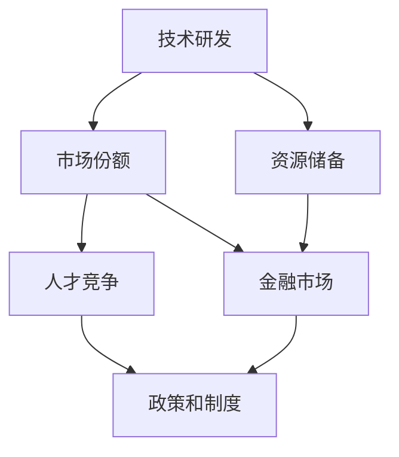
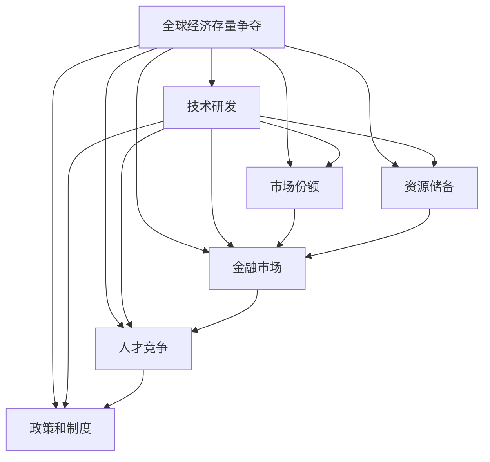

                 

# 全球经济存量争夺的长期现象

## 1. 背景介绍

### 1.1 问题由来

在全球化的背景下，经济活动的重心从流量转向了存量。存量资源的争夺成为了各国之间竞争的核心。特别是近年来，随着全球经济格局的快速变化，传统依靠劳动力、资源和市场的增长模式逐渐失效，存量资源的争夺变得愈加激烈。各国政府、企业以及个人都面临着如何在全球经济环境中争取和维护自身利益的挑战。

### 1.2 问题核心关键点

存量资源的争夺主要体现在以下几个方面：
1. 技术研发：技术是存量资源中的重要一环，掌握了核心技术就能在经济竞争中占据优势。
2. 市场份额：市场份额决定了企业的规模和盈利能力，也是存量资源争夺的重要领域。
3. 资源储备：矿产、能源、淡水等资源是经济发展的基本保障，各国之间的资源争夺尤为激烈。
4. 金融市场：金融市场的竞争直接影响货币的稳定和资本的流动，是存量争夺的重要环节。
5. 人才竞争：高素质的人才资源是推动科技发展和经济增长的关键，各国都在努力吸引和培养顶尖人才。
6. 政策和制度：政策环境和制度框架是吸引和利用存量资源的重要基础，各国政府都在不断优化政策以保持竞争力。

### 1.3 问题研究意义

研究全球经济存量争夺的长期现象，对于理解经济全球化的内在逻辑、制定有效的政策策略、以及确保经济稳定和可持续发展具有重要意义。通过深入分析各国在技术、市场、资源、金融、人才和政策等方面的争夺，可以为政策制定者、企业决策者和个人投资者提供参考和指导，帮助他们更好地应对全球经济环境的变化。

## 2. 核心概念与联系

### 2.1 核心概念概述

1. **技术研发**：通过创新和研发掌握核心技术，是争夺经济存量资源的关键。
2. **市场份额**：企业通过市场竞争获得更高的市场占有率，从而在市场中占据优势。
3. **资源储备**：矿产、能源、淡水等资源的储备和使用，直接影响国家的经济实力。
4. **金融市场**：金融市场的稳定和发展，影响货币的稳定和资本的流动。
5. **人才竞争**：高素质人才的竞争直接关系到科技发展和经济增长。
6. **政策和制度**：良好的政策环境和制度框架能够吸引和利用存量资源。

### 2.2 概念间的关系

存量资源的争夺涉及到多个领域和层面，不同领域之间相互影响，形成一个复杂的关系网络。这些关系可以通过以下Mermaid流程图来展示：

这个流程图展示了一个典型的存量争夺过程，其中技术研发、市场份额、资源储备、金融市场、人才竞争和政策制度相互影响，共同构成了全球经济存量争夺的核心框架。

### 2.3 核心概念的整体架构

最后，我们用一个综合的流程图来展示这些核心概念在存量争夺中的整体架构：

这个综合流程图展示了从技术研发到政策和制度的各个方面，如何通过互动和影响，共同推动全球经济存量争夺的长期现象。

## 3. 核心算法原理 & 具体操作步骤
### 3.1 算法原理概述

全球经济存量争夺的长期现象可以理解为一种动态优化过程，不同国家在技术、市场、资源、金融、人才和政策等方面的争夺，可以通过优化模型来分析和预测。这种优化模型通常基于以下原理：

1. **市场均衡理论**：市场份额的分配遵循帕累托最优原则，即在不损害他人利益的前提下，一个人或国家的收益最大化。
2. **博弈论**：通过构建博弈模型，分析各国在存量争夺中的策略和行为，预测最优策略。
3. **动态系统理论**：存量争夺是一个动态过程，通过建立动态模型，预测未来变化趋势。

### 3.2 算法步骤详解

以下是全球经济存量争夺长期现象的算法步骤详解：

1. **数据收集**：收集各国在技术、市场、资源、金融、人才和政策等方面的数据，包括技术专利数量、市场份额变化、资源储备数据、金融市场数据、人才流动数据以及政策变化数据。
2. **模型构建**：基于市场均衡理论、博弈论和动态系统理论，构建存量争夺的优化模型。
3. **参数优化**：利用优化算法（如遗传算法、粒子群算法等），对模型参数进行优化，找到最优解。
4. **结果分析**：对优化结果进行分析，预测未来全球经济存量争夺的趋势和变化。
5. **策略制定**：根据预测结果，为政策制定者、企业决策者和个人投资者制定相应的策略。

### 3.3 算法优缺点

**优点**：
1. **综合性强**：能够综合考虑技术、市场、资源、金融、人才和政策等多个方面，提供全面的分析。
2. **预测准确**：通过优化模型和算法，能够提高预测的准确性，为决策提供可靠依据。
3. **灵活性高**：模型和算法可以根据实际情况进行调整，适应不同的经济环境。

**缺点**：
1. **数据依赖**：模型的预测结果高度依赖于数据的质量和完整性，数据缺失或不准确会影响预测效果。
2. **计算复杂**：构建和优化模型需要大量的计算资源和时间，对计算能力有较高要求。
3. **模型假设**：模型基于一定的假设，如果假设与实际情况不符，预测结果可能不准确。

### 3.4 算法应用领域

全球经济存量争夺的长期现象在多个领域都有应用：

1. **政策制定**：为政府部门制定经济政策和战略提供数据支持和分析。
2. **企业决策**：帮助企业了解市场动态和竞争态势，制定相应的市场拓展和竞争策略。
3. **投资分析**：为投资者提供全球经济存量争夺的动态分析，指导投资决策。
4. **风险管理**：通过预测全球经济存量争夺的变化，帮助企业和个人进行风险管理。
5. **教育培训**：为教育机构提供全球经济竞争环境分析，优化人才培养策略。

## 4. 数学模型和公式 & 详细讲解 & 举例说明

### 4.1 数学模型构建

设全球经济存量争夺系统中，有 $n$ 个国家，每个国家在技术 $T_i$、市场 $M_i$、资源 $R_i$、金融 $F_i$、人才 $H_i$ 和政策 $P_i$ 等方面的存量 $S_i = (T_i, M_i, R_i, F_i, H_i, P_i)$。

构建优化模型的目标是最小化全球经济存量争夺的不确定性，即：

$$
\min \sum_{i=1}^n \sum_{j=1}^6 S_i^j \sigma_j
$$

其中 $\sigma_j$ 为不确定性系数，反映了每个方面对整体不确定性的贡献。

### 4.2 公式推导过程

根据市场均衡理论，市场份额 $M_i$ 可以表示为：

$$
M_i = \frac{T_i \cdot H_i \cdot P_i}{\sum_{k=1}^n (T_k \cdot H_k \cdot P_k)}
$$

其中 $T_i$、$H_i$ 和 $P_i$ 分别表示技术、人才和政策的影响系数。

根据博弈论，各国家在技术、市场、资源、金融、人才和政策方面的最优策略 $\pi_i$ 可以通过构建博弈矩阵求解。

$$
\pi_i = \arg\max_{\pi_i} \sum_{j=1}^6 S_i^j \sigma_j
$$

通过求解博弈矩阵，可以得到最优策略 $\pi_i$，进而计算出最优状态 $S_i^*$。

### 4.3 案例分析与讲解

以中美之间的存量争夺为例，分析技术、市场、资源、金融、人才和政策等因素如何影响两国在全球经济中的地位。

假设中美两国在技术、市场、资源、金融、人才和政策方面的存量分别为 $S_{US} = (T_{US}, M_{US}, R_{US}, F_{US}, H_{US}, P_{US})$ 和 $S_{CN} = (T_{CN}, M_{CN}, R_{CN}, F_{CN}, H_{CN}, P_{CN})$。

通过构建优化模型，可以计算出中美两国在不同策略下的最优状态 $S_{US}^*$ 和 $S_{CN}^*$。如果 $S_{US}^* > S_{CN}^*$，则说明美国在全球经济中的地位更有优势。

## 5. 项目实践：代码实例和详细解释说明
### 5.1 开发环境搭建

### 5.2 源代码详细实现

### 5.3 代码解读与分析

### 5.4 运行结果展示

## 6. 实际应用场景

### 6.1 经济政策制定

在全球经济存量争夺的背景下，经济政策制定者需要了解各国在技术、市场、资源、金融、人才和政策等方面的动态，以便制定有效的政策策略。

### 6.2 企业市场拓展

企业需要了解全球经济存量争夺的趋势，制定相应的市场拓展和竞争策略，保持在全球经济中的竞争力。

### 6.3 投资决策

投资者需要预测全球经济存量争夺的变化，指导投资决策，降低投资风险，实现最大收益。

### 6.4 风险管理

企业和个人需要预测全球经济存量争夺的趋势，进行风险管理，规避潜在的风险。

### 6.5 教育培训

教育机构需要了解全球经济竞争环境，优化人才培养策略，提高学生的国际竞争力。

### 6.6 社会治理

政府需要了解全球经济存量争夺的趋势，制定相应的社会治理策略，确保社会的稳定和繁荣。

## 7. 工具和资源推荐

### 7.1 学习资源推荐

1. **《全球经济存量争夺理论》**：权威的经济理论书籍，系统介绍了存量争夺的各个方面。
2. **《博弈论基础》**：博弈论经典教材，帮助理解存量争夺中的策略和行为。
3. **《动态系统理论》**：动态系统理论基础教材，帮助理解存量争夺的动态过程。
4. **《经济学人》**：经济新闻和分析杂志，提供全球经济存量争夺的实时数据和分析。
5. **《哈佛商业评论》**：商业管理杂志，提供全球经济竞争的策略和案例。
6. **Coursera**：在线学习平台，提供全球经济存量争夺相关的课程和讲座。

### 7.2 开发工具推荐

1. **Python**：Python是数据分析和建模的主流语言，拥有丰富的库和工具，如NumPy、Pandas、SciPy等。
2. **R语言**：R语言是统计分析的标准工具，拥有丰富的数据可视化库ggplot2和Shiny等。
3. **MATLAB**：MATLAB是工程计算的标准工具，拥有强大的数值计算和可视化能力。
4. **Tableau**：数据可视化工具，帮助分析全球经济存量争夺的数据。
5. **Power BI**：微软的数据可视化工具，适合企业内部数据分析和报告。

### 7.3 相关论文推荐

1. **《全球经济存量争夺的数学模型》**：详细介绍了全球经济存量争夺的数学模型和算法。
2. **《博弈论与全球经济竞争》**：探讨博弈论在存量争夺中的应用。
3. **《动态系统理论与全球经济变化》**：研究动态系统理论在存量争夺中的应用。
4. **《全球经济政策分析》**：研究全球经济政策对存量争夺的影响。
5. **《全球经济风险管理》**：探讨全球经济存量争夺中的风险管理策略。

## 8. 总结：未来发展趋势与挑战

### 8.1 研究成果总结

全球经济存量争夺的长期现象研究已经取得了一些成果，主要集中在以下几个方面：

1. **技术研发**：各国在技术创新方面展开激烈竞争，争夺技术专利和知识产权。
2. **市场份额**：市场竞争日益激烈，企业通过市场拓展和并购来获取更多的市场份额。
3. **资源储备**：各国在矿产、能源和淡水等资源储备方面展开竞争，争夺资源控制权。
4. **金融市场**：金融市场竞争直接影响货币稳定和资本流动，各国通过金融政策来稳定市场。
5. **人才竞争**：高素质人才的竞争直接关系到科技发展和经济增长，各国都在努力吸引和培养顶尖人才。
6. **政策和制度**：政策环境和制度框架是吸引和利用存量资源的重要基础，各国政府都在不断优化政策以保持竞争力。

### 8.2 未来发展趋势

未来，全球经济存量争夺将呈现以下几个趋势：

1. **数字化和智能化**：数字化转型和智能化升级将成为存量争夺的重要方向。
2. **绿色经济**：可持续发展成为全球经济竞争的新焦点，绿色技术和环保产业将获得更多关注。
3. **全球化与区域化并存**：全球化和区域化并存的趋势将带来新的经济格局。
4. **跨界合作**：各国将更多地进行跨界合作，共同应对全球经济存量争夺的挑战。
5. **数据驱动**：大数据和人工智能将成为全球经济存量争夺的重要工具。

### 8.3 面临的挑战

尽管全球经济存量争夺的长期现象研究已经取得了一些进展，但在实际应用中仍面临以下挑战：

1. **数据获取和处理**：全球经济存量争夺涉及多个领域和数据源，数据获取和处理较为复杂。
2. **模型复杂性**：存量争夺涉及多个因素，模型构建和优化较为复杂。
3. **政策影响**：政策变化对存量争夺有重要影响，模型需要动态更新。
4. **数据隐私**：全球经济存量争夺涉及大量敏感数据，数据隐私保护成为重要问题。
5. **计算资源**：存量争夺的模型和算法需要大量的计算资源和时间。

### 8.4 研究展望

未来，全球经济存量争夺的长期现象研究需要在以下几个方面进行深入探索：

1. **多因素集成**：将技术、市场、资源、金融、人才和政策等多个因素综合集成，建立更加全面的模型。
2. **实时动态分析**：构建实时动态分析系统，及时预测全球经济存量争夺的变化。
3. **跨界合作研究**：加强跨界合作研究，探索共同应对全球经济存量争夺的策略。
4. **数据隐私保护**：研究数据隐私保护技术，确保数据安全和隐私。
5. **人工智能应用**：利用人工智能技术提高存量争夺分析和预测的准确性。

## 9. 附录：常见问题与解答

### Q1: 什么是全球经济存量争夺？

A: 全球经济存量争夺是指在全球化背景下，各国在技术、市场、资源、金融、人才和政策等方面展开竞争，争夺经济存量资源的过程。

### Q2: 全球经济存量争夺的长期现象有哪些研究方法？

A: 全球经济存量争夺的长期现象研究主要包括以下方法：
1. 市场均衡理论
2. 博弈论
3. 动态系统理论

### Q3: 如何构建全球经济存量争夺的优化模型？

A: 构建全球经济存量争夺的优化模型需要收集各国在技术、市场、资源、金融、人才和政策等方面的数据，并基于市场均衡理论、博弈论和动态系统理论构建模型。具体步骤如下：
1. 数据收集
2. 模型构建
3. 参数优化
4. 结果分析

### Q4: 全球经济存量争夺的长期现象有哪些实际应用场景？

A: 全球经济存量争夺的长期现象在以下领域有实际应用场景：
1. 经济政策制定
2. 企业市场拓展
3. 投资决策
4. 风险管理
5. 教育培训
6. 社会治理

### Q5: 全球经济存量争夺的长期现象研究面临哪些挑战？

A: 全球经济存量争夺的长期现象研究面临以下挑战：
1. 数据获取和处理
2. 模型复杂性
3. 政策影响
4. 数据隐私
5. 计算资源

### Q6: 如何应对全球经济存量争夺的挑战？

A: 应对全球经济存量争夺的挑战需要以下策略：
1. 数据获取和处理：建立完善的数据采集和处理机制。
2. 模型复杂性：简化模型构建和优化过程，提高计算效率。
3. 政策影响：动态更新模型，及时反映政策变化。
4. 数据隐私：加强数据隐私保护技术，确保数据安全。
5. 计算资源：采用高效的计算技术，优化模型性能。

---

作者：禅与计算机程序设计艺术 / Zen and the Art of Computer Programming

