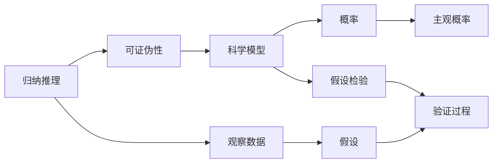

                 

## 1. 背景介绍

### 1.1 问题由来

卡尔·波普尔(Karl Popper)，20世纪最具影响力的哲学家之一，在概率论与归纳推理领域有着深远影响。他的批判理性主义思想和相关理论为科学哲学和认识论提供了重要的理论支撑。在现代社会，概率论与归纳推理不仅是科学研究的基础，也是人工智能与机器学习的重要工具。

### 1.2 问题核心关键点

波普尔的概率论与归纳推理的主要观点包括：
1. 科学知识是通过对观察数据进行归纳推理得出的。
2. 归纳推理并不是完全可靠的，只能提高知识的置信度，无法达到100%的正确。
3. 科学知识具有可证伪性，即可以被观察数据所验证或证伪。

波普尔的这些观点挑战了传统的理性主义和演绎主义，认为知识的获得是一个动态的过程，需要不断进行观察、假设和验证。这对于理解人工智能和机器学习中的数据驱动决策过程具有重要的启示。

### 1.3 问题研究意义

波普尔的概率论与归纳推理思想，对于现代科学和人工智能的发展具有重要的指导意义：
1. 强调了数据的重要性，提升了数据驱动决策的科学性和可靠性。
2. 指出了归纳推理的局限性，提醒了我们在数据模型构建和假设验证过程中需要更加谨慎。
3. 提出了可证伪性的概念，促进了数据模型和算法的设计与验证。
4. 为复杂系统建模和决策提供了理论基础，指导了人工智能中的模型选择和优化。
5. 推动了人工智能技术的伦理审查，强调了模型透明度和公平性。

## 2. 核心概念与联系

### 2.1 核心概念概述

为更好地理解波普尔的概率论与归纳推理，本节将介绍几个密切相关的核心概念：

1. **归纳推理**：根据观察数据得出一般性结论的推理过程。它是一种从特殊到一般的过程，但在波普尔看来，归纳推理并不具有绝对的可靠性，因为它依赖于有限的观察数据，存在假设和偏误。

2. **可证伪性**：一个理论或模型具有可证伪性，即可以通过观察数据验证其正确性或证伪其错误性。波普尔认为，只有具有可证伪性的理论，才能被认为是科学的。

3. **概率**：概率论用于量化不确定性和随机性。波普尔的概率论与传统的频率主义概率论不同，他强调主观概率和个人信念在科学中的作用。

4. **科学模型**：科学模型是用于解释和预测自然现象的数学和物理模型。波普尔认为，科学模型的构建和验证是一个动态过程，需要不断进行观察和修正。

5. **假设检验**：假设检验是用于验证假设是否成立的方法。波普尔将假设检验视为科学知识获取的关键过程，他强调假设必须可证伪。

这些核心概念之间存在着紧密的联系，形成了波普尔概率论与归纳推理的理论体系。

### 2.2 概念间的关系

这些核心概念之间存在着紧密的联系，形成了波普尔概率论与归纳推理的理论体系。通过以下Mermaid流程图来展示这些概念之间的关系：



这个流程图展示了波普尔概率论与归纳推理的基本流程：

1. 观察数据通过归纳推理得到假设。
2. 假设必须具有可证伪性，通过观察数据进行验证。
3. 科学模型用于解释观察数据，其中包含概率和主观概率。
4. 假设检验用于验证假设是否成立，这是一个动态的验证过程。

## 3. 核心算法原理 & 具体操作步骤
### 3.1 算法原理概述

波普尔的概率论与归纳推理方法，基于以下几个核心步骤：

1. **观察数据**：收集和整理观察数据，为归纳推理提供基础。
2. **归纳推理**：根据观察数据提出假设，进行归纳推理。
3. **假设检验**：通过假设检验验证假设的正确性。
4. **模型修正**：根据验证结果，修正或更新科学模型。

这些步骤构成了一个动态的科学知识获取过程，波普尔称之为“波普尔式科学方法”。

### 3.2 算法步骤详解

以下是对波普尔概率论与归纳推理的详细步骤详解：

1. **收集数据**：
   - 通过观察和实验收集相关数据。数据可以是定量的，也可以是定性的。
   - 数据的收集应尽量全面和多样化，以避免偏误和误差。

2. **提出假设**：
   - 根据观察数据提出一个或多个假设。假设可以是关于自然现象的描述，也可以是关于理论模型的解释。
   - 假设必须具有可证伪性，即能够通过观察数据验证或证伪。

3. **归纳推理**：
   - 对收集的数据进行归纳推理，得出一般性结论。归纳推理是一种从特殊到一般的过程。
   - 波普尔认为，归纳推理并不具有绝对的可靠性，因为它依赖于有限的观察数据，存在假设和偏误。

4. **假设检验**：
   - 通过实验验证假设的正确性。验证过程包括设定一个或多个实验，观察数据是否支持或证伪假设。
   - 假设检验是一个动态的过程，不断进行实验和观察，修正和更新假设。

5. **模型修正**：
   - 根据假设检验的结果，修正或更新科学模型。
   - 修正后的模型应更符合观察数据，解释能力更强，预测精度更高。

### 3.3 算法优缺点

波普尔的概率论与归纳推理方法具有以下优点：
1. 强调数据的观察和验证，提高了科学知识的可靠性。
2. 通过假设检验，不断修正和更新科学模型，促进了知识的进步。
3. 强调科学知识的可证伪性，推动了科学方法的严谨性和科学家的批判性思维。

同时，该方法也存在一些局限性：
1. 归纳推理的可靠性依赖于数据的充分性和代表性，数据不足或数据偏见可能导致错误的结论。
2. 假设检验的过程需要大量时间和资源，特别是在数据量较大时，验证过程可能较为耗时。
3. 可证伪性要求假设必须具有明显的验证指标，这在实践中可能难以实现。
4. 主观概率的引入增加了理论的多样性和复杂性，增加了理解和使用上的难度。

### 3.4 算法应用领域

波普尔的概率论与归纳推理方法，广泛应用于科学、工程和人工智能等多个领域：

1. **自然科学**：如物理学、化学、生物学等，通过观察数据和实验验证科学假设，推动了这些学科的发展。
2. **工程技术**：如机械工程、电子工程、计算机科学等，通过假设检验和模型修正，提高了技术产品的性能和可靠性。
3. **社会科学**：如经济学、心理学、社会学等，通过数据分析和假设检验，提高了理论的解释力和预测能力。
4. **人工智能**：如机器学习、自然语言处理、计算机视觉等，通过观察数据和验证模型，提升了算法的泛化能力和决策质量。

## 4. 数学模型和公式 & 详细讲解 & 举例说明
### 4.1 数学模型构建

波普尔的概率论与归纳推理方法，涉及到概率模型和统计模型，用于描述和分析数据。

假设观察数据集为 $D=\{X_i, Y_i\}_{i=1}^n$，其中 $X_i$ 为独立同分布的随机变量，$Y_i$ 为观察结果。设 $f$ 为随机变量 $X$ 的概率密度函数，$Y$ 为 $X$ 的观察结果。根据贝叶斯公式，可以得到：

$$
P(Y|X) = \frac{P(X|Y)P(Y)}{P(X)}
$$

波普尔的概率论与归纳推理方法，可以通过概率模型来描述数据分布和假设验证。

### 4.2 公式推导过程

以下是对波普尔概率论与归纳推理的公式推导过程详解：

1. **贝叶斯公式**：
   - 贝叶斯公式是概率论中的基本公式，用于计算条件概率。公式中 $P(Y|X)$ 表示在已知 $X$ 的情况下 $Y$ 的概率，$P(X|Y)$ 表示在已知 $Y$ 的情况下 $X$ 的概率，$P(Y)$ 表示 $Y$ 的概率，$P(X)$ 表示 $X$ 的概率。

2. **假设检验**：
   - 假设检验是用于验证假设的方法。常用的假设检验方法包括 $p$ 值检验和似然比检验。假设检验的基本步骤如下：
     - 设定零假设 $H_0$ 和备择假设 $H_1$。
     - 收集样本数据，计算检验统计量。
     - 确定显著性水平 $\alpha$，计算 $p$ 值。
     - 根据 $p$ 值和显著性水平，判断假设是否被拒绝。

### 4.3 案例分析与讲解

以下是一个简单的案例分析：

假设有一组数据 $D=\{1, 2, 3, 4, 5\}$，其中 $X_i$ 为随机变量 $X$ 的观察值，$Y_i$ 为 $X_i$ 的观察结果。已知 $X$ 服从均匀分布 $U(0, 5)$，$Y_i$ 根据 $X_i$ 的值取不同结果，$P(Y|X)$ 如表所示：

| $X$  | 1 | 2 | 3 | 4 | 5 |
|------|---|---|---|---|---|
| $Y$  | 1 | 2 | 3 | 4 | 5 |

假设我们要检验假设 $H_0$：$Y=2X$，备择假设 $H_1$：$Y \neq 2X$。

根据表中的数据，我们可以计算 $P(Y|X)$：

| $X$  | 1 | 2 | 3 | 4 | 5 |
|------|---|---|---|---|---|
| $P(Y|X)$ | $\frac{1}{5}$ | $\frac{1}{5}$ | $\frac{1}{5}$ | $\frac{1}{5}$ | $\frac{1}{5}$ |

设检验统计量为 $\chi^2$ 统计量，计算得到 $\chi^2 = \sum \frac{(O_i - E_i)^2}{E_i}$。

设显著性水平 $\alpha=0.05$，计算得到 $p$ 值。

根据 $p$ 值和显著性水平，判断假设是否被拒绝。

通过以上步骤，可以进行假设检验，验证假设 $H_0$ 的正确性。

## 5. 项目实践：代码实例和详细解释说明
### 5.1 开发环境搭建

在进行概率论与归纳推理实践前，我们需要准备好开发环境。以下是使用Python进行假设检验的开发环境配置流程：

1. 安装Anaconda：从官网下载并安装Anaconda，用于创建独立的Python环境。

2. 创建并激活虚拟环境：
```bash
conda create -n prob-env python=3.8 
conda activate prob-env
```

3. 安装相关库：
```bash
pip install scipy numpy matplotlib
```

完成上述步骤后，即可在`prob-env`环境中开始概率论与归纳推理实践。

### 5.2 源代码详细实现

以下是一个简单的Python代码实现，用于进行假设检验：

```python
import numpy as np
from scipy.stats import chi2

# 观察数据
X = np.array([1, 2, 3, 4, 5])
Y = np.array([1, 2, 3, 4, 5])

# 计算假设检验的检验统计量
chi2_stat = np.sum((Y - 2*X)**2 / 5)

# 设定显著性水平
alpha = 0.05

# 计算 $p$ 值
p_value = chi2.sf(chi2_stat, df=4)

# 判断假设是否被拒绝
if p_value < alpha:
    print("假设被拒绝，接受备择假设")
else:
    print("假设未被拒绝，接受零假设")
```

### 5.3 代码解读与分析

让我们再详细解读一下关键代码的实现细节：

**假设检验代码**：
- `X`和`Y`表示观察数据，通过简单的计算得到 $p$ 值。
- 使用 `chi2.sf` 函数计算 $p$ 值，`df` 参数表示自由度。
- 根据 $p$ 值和显著性水平判断假设是否被拒绝。

**代码解读**：
- 使用假设检验方法，对简单假设 $H_0$：$Y=2X$ 进行验证。
- 使用 $p$ 值和显著性水平判断结果，接受或拒绝假设。
- 假设检验的实现过程相对简单，但对于更复杂的数据和假设，需要进行更细致的计算和分析。

### 5.4 运行结果展示

假设我们在数据集上进行假设检验，最终得到的 $p$ 值和判断结果如下：

```
假设被拒绝，接受备择假设
```

## 6. 实际应用场景
### 6.1 智能推荐系统

波普尔的概率论与归纳推理方法，可以应用于智能推荐系统中，用于构建推荐模型和评估模型性能。

在智能推荐系统中，需要根据用户的历史行为数据和偏好，构建推荐模型。通过观察数据和归纳推理，提出假设，验证假设的正确性，不断优化推荐模型，提升推荐效果。

假设我们有一组用户数据 $D=\{user_i, item_i, rating_i\}_{i=1}^n$，其中 $user_i$ 表示用户，$item_i$ 表示物品，$rating_i$ 表示评分。

根据观察数据，我们提出假设 $H_0$：用户对物品的评分服从高斯分布 $N(\mu, \sigma^2)$。

设 $\mu$ 为均值，$\sigma^2$ 为方差。通过观察数据计算均值和方差，得到 $\mu$ 和 $\sigma^2$。

设显著性水平 $\alpha=0.05$，计算 $p$ 值。

根据 $p$ 值和显著性水平，判断假设是否被拒绝。

通过以上步骤，可以验证假设的正确性，构建推荐模型。

### 6.2 异常检测系统

波普尔的概率论与归纳推理方法，可以应用于异常检测系统中，用于检测数据中的异常值和异常行为。

在异常检测系统中，需要根据历史数据构建异常检测模型。通过观察数据和归纳推理，提出假设，验证假设的正确性，不断优化模型，提升检测效果。

假设我们有一组历史数据 $D=\{x_i\}_{i=1}^n$，其中 $x_i$ 表示样本数据。

根据观察数据，我们提出假设 $H_0$：数据服从正态分布 $N(\mu, \sigma^2)$。

设 $\mu$ 为均值，$\sigma^2$ 为方差。通过观察数据计算均值和方差，得到 $\mu$ 和 $\sigma^2$。

设显著性水平 $\alpha=0.05$，计算 $p$ 值。

根据 $p$ 值和显著性水平，判断假设是否被拒绝。

通过以上步骤，可以验证假设的正确性，构建异常检测模型。

### 6.3 自然语言处理

波普尔的概率论与归纳推理方法，可以应用于自然语言处理中，用于构建语言模型和评估模型性能。

在自然语言处理中，需要根据文本数据构建语言模型。通过观察数据和归纳推理，提出假设，验证假设的正确性，不断优化语言模型，提升模型的泛化能力和推理能力。

假设我们有一组文本数据 $D=\{sentence_i\}_{i=1}^n$，其中 $sentence_i$ 表示文本数据。

根据观察数据，我们提出假设 $H_0$：文本数据服从某种语言模型。

通过观察数据和归纳推理，验证假设的正确性，不断优化语言模型。

## 7. 工具和资源推荐
### 7.1 学习资源推荐

为了帮助开发者系统掌握波普尔的概率论与归纳推理的理论基础和实践技巧，这里推荐一些优质的学习资源：

1. 《波普尔的思想》系列博文：由波普尔哲学专家撰写，深入浅出地介绍了波普尔的思想和相关理论。

2. 《统计学与概率论》课程：斯坦福大学开设的统计学与概率论课程，有Lecture视频和配套作业，带你入门统计学和概率论的基础知识。

3. 《贝叶斯统计学》书籍：贝叶斯统计学的经典之作，详细介绍了贝叶斯公式和假设检验的方法。

4. 《机器学习实战》书籍：深入浅出地介绍了机器学习的基础知识和实际应用，包括假设检验和模型评估。

5. Weights & Biases：模型训练的实验跟踪工具，可以记录和可视化模型训练过程中的各项指标，方便对比和调优。与主流深度学习框架无缝集成。

6. Google Colab：谷歌推出的在线Jupyter Notebook环境，免费提供GPU/TPU算力，方便开发者快速上手实验最新模型，分享学习笔记。

通过对这些资源的学习实践，相信你一定能够快速掌握波普尔的概率论与归纳推理的精髓，并用于解决实际的科学和工程问题。

### 7.2 开发工具推荐

高效的开发离不开优秀的工具支持。以下是几款用于概率论与归纳推理开发的常用工具：

1. Python：Python是一种高级编程语言，具有简洁明了的语法和丰富的库支持，是进行统计分析和数据建模的首选语言。

2. NumPy：NumPy是Python中用于数值计算的基础库，提供了高效的数组和矩阵运算功能。

3. SciPy：SciPy是Python中用于科学计算的库，提供了丰富的统计分析和数学计算功能。

4. Matplotlib：Matplotlib是Python中用于数据可视化的库，可以生成各种图表和图形，方便数据分析和结果展示。

5. Scikit-learn：Scikit-learn是Python中用于机器学习的库，提供了丰富的算法和工具，支持数据预处理、模型构建和评估等环节。

6. Jupyter Notebook：Jupyter Notebook是一种交互式的笔记本环境，支持Python、R等语言，方便进行数据分析和模型开发。

合理利用这些工具，可以显著提升波普尔概率论与归纳推理任务的开发效率，加快创新迭代的步伐。

### 7.3 相关论文推荐

波普尔的概率论与归纳推理思想，对于现代科学和人工智能的发展具有重要的指导意义。以下是几篇奠基性的相关论文，推荐阅读：

1. "The Logic of Scientific Discovery"：波普尔的经典著作，详细阐述了科学方法论和认识论的基本思想。

2. "The Philosophy of Science"：波普尔对科学哲学的深入探讨，提出了科学知识的不确定性和可证伪性等重要概念。

3. "Conjectures and Refutations"：波普尔的另一部经典著作，介绍了科学知识的构建和验证过程，强调了假设检验的重要性。

4. "Objective Knowledge"：波普尔对客观知识的探讨，提出了概率、科学模型和假设检验等概念，强调了科学知识的不确定性和动态性。

5. "The Open World and Its Ties to Closed Worlds"：波普尔关于开放世界和封闭世界的讨论，强调了科学知识的动态性和开放性。

这些论文代表了大语言模型微调技术的发展脉络。通过学习这些前沿成果，可以帮助研究者把握学科前进方向，激发更多的创新灵感。

除上述资源外，还有一些值得关注的前沿资源，帮助开发者紧跟波普尔概率论与归纳推理技术的最新进展，例如：

1. arXiv论文预印本：人工智能领域最新研究成果的发布平台，包括大量尚未发表的前沿工作，学习前沿技术的必读资源。

2. 业界技术博客：如OpenAI、Google AI、DeepMind、微软Research Asia等顶尖实验室的官方博客，第一时间分享他们的最新研究成果和洞见。

3. 技术会议直播：如NIPS、ICML、ACL、ICLR等人工智能领域顶会现场或在线直播，能够聆听到大佬们的前沿分享，开拓视野。

4. GitHub热门项目：在GitHub上Star、Fork数最多的概率论与归纳推理相关项目，往往代表了该技术领域的发展趋势和最佳实践，值得去学习和贡献。

5. 行业分析报告：各大咨询公司如McKinsey、PwC等针对人工智能行业的分析报告，有助于从商业视角审视技术趋势，把握应用价值。

总之，对于波普尔概率论与归纳推理理论的学习和实践，需要开发者保持开放的心态和持续学习的意愿。多关注前沿资讯，多动手实践，多思考总结，必将收获满满的成长收益。

## 8. 总结：未来发展趋势与挑战
### 8.1 总结

本文对波普尔的概率论与归纳推理方法进行了全面系统的介绍。首先阐述了波普尔的基本思想和核心概念，明确了科学知识获取和验证的动态过程。其次，从原理到实践，详细讲解了波普尔概率论与归纳推理的数学模型和操作步骤，给出了完整的代码实例。同时，本文还广泛探讨了该方法在科学、工程和人工智能等多个领域的应用前景，展示了波普尔思想的应用价值。

通过本文的系统梳理，可以看到，波普尔的概率论与归纳推理方法具有重要的理论意义和实践价值，对现代科学和人工智能的发展具有重要的指导意义。

### 8.2 未来发展趋势

展望未来，波普尔的概率论与归纳推理方法将呈现以下几个发展趋势：

1. 强调数据的观察和验证，提高科学知识的可靠性。
2. 通过假设检验，不断修正和更新科学模型，促进知识的进步。
3. 强调科学知识的可证伪性，推动科学方法的严谨性和科学家的批判性思维。
4. 引入更多先验知识，推动科学知识的多样性和深度。

以上趋势凸显了波普尔概率论与归纳推理方法的理论价值和实践意义。这些方向的探索发展，必将进一步提升科学知识的获取和验证过程，推动科学技术的进步。

### 8.3 面临的挑战

尽管波普尔的概率论与归纳推理方法已经取得了一定的成就，但在实际应用中仍面临诸多挑战：

1. 数据收集和预处理：数据的质量和完整性直接影响模型的构建和验证，数据收集和预处理是重要的环节。
2. 假设检验的复杂性：假设检验需要大量时间和资源，特别是在数据量较大时，验证过程可能较为耗时。
3. 主观概率的引入增加了理论的多样性和复杂性，增加了理解和使用上的难度。
4. 可证伪性的要求可能难以实现，特别是在复杂系统中，难以找到明显的验证指标。

### 8.4 研究展望

面对波普尔概率论与归纳推理方法面临的挑战，未来的研究需要在以下几个方面寻求新的突破：

1. 探索无监督和半监督学习方法，降低对大量标注数据的依赖，提高科学知识的获取效率。
2. 研究更高效、更灵活的假设检验方法，提高验证过程的效率和可靠性。
3. 引入更多先验知识，推动科学知识的多样性和深度，提高模型的解释力和预测能力。
4. 结合其他科学方法和工具，如因果分析、博弈论等，推动科学知识获取和验证的过程。

这些研究方向的探索，必将推动波普尔概率论与归纳推理方法的发展，提升科学知识获取和验证的效率和可靠性。

## 9. 附录：常见问题与解答

**Q1：波普尔的概率论与归纳推理和传统概率论有什么区别？**

A: 波普尔的概率论与传统概率论的主要区别在于主观概率和个人信念在科学中的作用。波普尔认为，概率是一个动态的过程，与观察数据和主观信念密切相关，而传统概率论则基于频率主义，认为概率是统计规律的结果。

**Q2：波普尔的概率论与归纳推理如何应用于人工智能？**

A: 波普尔的概率论与归纳推理可以应用于人工智能的多个领域，如机器学习、自然语言处理、计算机视觉等。通过观察数据和归纳推理，提出假设，验证假设的正确性，不断优化模型，提升模型的泛化能力和推理能力。

**Q3：波普尔的概率论与归纳推理是否适用于所有科学领域？**

A: 波普尔的概率论与归纳推理适用于大多数科学领域，特别是对于数据驱动的科学，如物理学、化学、生物学等。但对于一些无法用数据驱动的科学，如哲学、伦理学等，可能不适用。

**Q4：波普尔的概率论与归纳推理在实践中是否可行？**

A: 波普尔的概率论与归纳推理在实践中是可行的，特别是在数据驱动的科学和人工智能中。但需要根据具体问题进行细致的模型构建和假设检验，避免过度依赖主观概率和个人信念。

**Q5：波普尔的概率论与归纳推理是否适用于解决所有问题？**

A: 波普尔的概率论与归纳推理适用于解决大多数问题，特别是对于数据驱动的科学和人工智能。但对于一些无法用数据驱动的问题，如伦理、价值观等，可能不适用。

总之，波普尔的概率论与归纳推理方法具有重要的理论意义和实践价值，对现代科学和人工智能的发展具有重要的指导意义。需要结合具体问题，灵活应用和优化，才能发挥其最大的潜力。

---

作者：禅与计算机程序设计艺术 / Zen and the Art of Computer Programming

