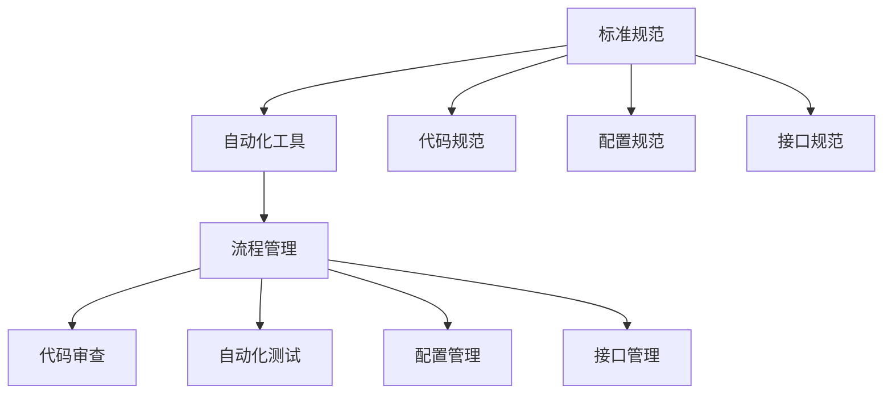

                 

# 国内头部玩家的规控架构现状

## 1. 背景介绍

近年来，随着互联网技术的飞速发展，各种新型架构技术层出不穷。其中，规控（规范控制）架构成为了众多头部玩家争相探索和实践的重要方向。规控架构通过定义标准规范，利用自动化工具和流程管理，保障系统的高效、安全、可扩展性。本文将重点探讨国内头部玩家的规控架构现状，分析其优势和挑战，为相关领域的开发者提供有益的参考。

## 2. 核心概念与联系

### 2.1 核心概念概述

在规控架构中，涉及的核心概念主要包括：

- **规控架构**：利用自动化工具和流程管理，确保系统设计和开发符合预定义的规范和标准，以提高系统质量和可扩展性。
- **标准规范**：预定义的一套规则和约定，包括代码规范、配置规范、接口规范等，用于指导系统开发和运维。
- **自动化工具**：支持自动化测试、代码审查、配置管理等功能的工具，保障规范的严格执行。
- **流程管理**：通过预定义的流程，确保系统开发和运维的各个环节按规范执行，减少人为错误。

### 2.2 概念间的关系

规控架构通过定义标准规范和自动化工具，利用流程管理，实现了系统开发的规范化和自动化。标准化是规控架构的基础，工具是实现规范化的手段，流程管理则是确保规范和工具有效执行的关键。三者相互依存，共同构成了一个完整的规控架构体系。

以下是Mermaid流程图，展示规控架构的核心组件及其相互关系：



## 3. 核心算法原理 & 具体操作步骤

### 3.1 算法原理概述

规控架构的原理基于两个关键点：标准化和自动化。标准化是规控架构的基石，通过定义一套统一的规范，确保系统各组件按标准进行设计和开发。自动化则是执行规范的保障，通过使用自动化工具和流程管理，减少人为错误，提高系统质量和开发效率。

### 3.2 算法步骤详解

规控架构的实施主要包括以下几个关键步骤：

1. **定义标准规范**：根据系统的需求和架构特点，定义一套标准化规范，涵盖代码规范、配置规范、接口规范等。
2. **选择工具和工具链**：选择适合的工具和工具链，支持自动化测试、代码审查、配置管理等功能。
3. **实施规范和自动化**：将定义好的规范和工具应用到系统开发和运维的各个环节，通过流程管理确保规范和工具的有效执行。
4. **持续优化和改进**：根据实际运行情况，持续优化和改进规范和工具，不断提升系统的质量和可扩展性。

### 3.3 算法优缺点

**优点**：

- **提高系统质量**：通过标准化和自动化，规控架构能够有效减少人为错误，提高系统的稳定性和可靠性。
- **提升开发效率**：自动化工具和流程管理可以显著降低开发和运维的复杂度，提高开发效率。
- **增强系统可扩展性**：规范化的设计和开发流程，便于系统扩展和维护。

**缺点**：

- **实施成本高**：规控架构的实施需要投入大量的时间和资源，特别是在规范和工具的选择上。
- **灵活性受限**：过于严格的规范和流程，可能限制团队的创新和灵活性。

### 3.4 算法应用领域

规控架构已经在多个领域得到广泛应用，例如：

- **软件开发**：通过代码规范和自动化测试，提高代码质量和开发效率。
- **运维管理**：通过配置管理和接口管理，确保系统稳定运行和接口一致性。
- **架构设计**：通过接口规范和流程管理，指导系统架构设计和开发。
- **安全保障**：通过安全规范和自动化工具，提升系统的安全性。

## 4. 数学模型和公式 & 详细讲解 & 举例说明

### 4.1 数学模型构建

规控架构的实施过程中，涉及到多个数学模型和公式。下面以软件开发为例，展示规控架构的数学模型构建：

- **代码质量评估模型**：
  $$
  Q = \sum_{i=1}^{N} W_i \times S_i
  $$
  其中，$Q$表示代码质量，$W_i$表示第$i$个指标的权重，$S_i$表示第$i$个指标的评分。

- **自动化测试覆盖率模型**：
  $$
  C = \sum_{i=1}^{M} W_i \times T_i
  $$
  其中，$C$表示自动化测试覆盖率，$W_i$表示第$i$个测试用例的权重，$T_i$表示第$i$个测试用例的覆盖率。

### 4.2 公式推导过程

**代码质量评估模型推导**：

1. 定义代码质量指标：选择适当的代码质量指标，如代码复杂度、可读性、可维护性等。
2. 计算每个指标的权重：根据指标的重要性，赋予不同的权重。
3. 计算代码质量分数：将每个指标的评分与权重相乘，求和得到代码质量评估模型。

**自动化测试覆盖率模型推导**：

1. 定义测试用例：根据系统需求，设计覆盖不同场景的测试用例。
2. 计算测试用例权重：根据测试用例的覆盖范围和重要程度，赋予不同的权重。
3. 计算自动化测试覆盖率：将每个测试用例的覆盖率与权重相乘，求和得到自动化测试覆盖率模型。

### 4.3 案例分析与讲解

假设某软件开发团队，采用规控架构实施代码质量和自动化测试。其代码质量评估模型为：

- 代码复杂度：权重0.4，评分7.5。
- 可读性：权重0.3，评分8.2。
- 可维护性：权重0.3，评分7.8。

根据公式计算得到代码质量分数：
$$
Q = 0.4 \times 7.5 + 0.3 \times 8.2 + 0.3 \times 7.8 = 8.27
$$

自动化测试覆盖率模型为：

- 模块覆盖率：权重0.4，覆盖率80%。
- 接口覆盖率：权重0.4，覆盖率90%。
- 异常覆盖率：权重0.2，覆盖率70%。

根据公式计算得到自动化测试覆盖率：
$$
C = 0.4 \times 80 + 0.4 \times 90 + 0.2 \times 70 = 86
$$

通过这些计算，团队可以清晰地了解代码质量情况和自动化测试的覆盖范围，从而进行针对性的改进。

## 5. 项目实践：代码实例和详细解释说明

### 5.1 开发环境搭建

要进行规控架构的实施，首先需要搭建相应的开发环境。以下是一个典型的开发环境搭建流程：

1. **选择编程语言和框架**：根据系统需求，选择适合的编程语言和框架。
2. **安装必要的工具链**：安装编译器、版本控制、持续集成等工具。
3. **配置开发环境**：配置开发环境，包括IDE、编辑器、调试器等。
4. **部署测试环境**：搭建测试环境，包括测试用例、测试数据、测试工具等。

### 5.2 源代码详细实现

以软件开发为例，展示代码质量评估模型的实现：

```python
import pandas as pd

# 定义代码质量评估模型
def calculate_code_quality(quality_indicators):
    # 计算每个指标的权重和评分
    weighted_scores = []
    for indicator in quality_indicators:
        weighted_scores.append(indicator['weight'] * indicator['score'])
    
    # 计算总质量分数
    total_quality = sum(weighted_scores)
    return total_quality

# 定义代码质量指标
quality_indicators = [
    {'name': '代码复杂度', 'weight': 0.4, 'score': 7.5},
    {'name': '可读性', 'weight': 0.3, 'score': 8.2},
    {'name': '可维护性', 'weight': 0.3, 'score': 7.8}
]

# 计算代码质量分数
code_quality = calculate_code_quality(quality_indicators)
print('代码质量分数：', code_quality)
```

### 5.3 代码解读与分析

上述代码展示了如何通过简单的函数实现代码质量评估模型的计算。首先，定义了一个函数`calculate_code_quality`，用于计算每个指标的加权分数。然后，定义了三个代码质量指标，包括代码复杂度、可读性和可维护性，并为每个指标赋予不同的权重和评分。最后，调用`calculate_code_quality`函数，计算出代码质量分数。

### 5.4 运行结果展示

假设上述代码的输出结果为：

```
代码质量分数： 8.27
```

这意味着当前代码的质量得分为8.27分，根据评分标准，得分越高，表示代码质量越好。

## 6. 实际应用场景

### 6.1 智能运维系统

智能运维系统通过规控架构，实现了对系统各个环节的规范化管理。通过定义统一的标准规范和自动化工具，运维系统能够自动化地检测和修复问题，保障系统的稳定运行。例如，在监控系统中，规范接口调用和日志记录，确保数据的准确性和一致性。在故障诊断中，利用自动化工具分析异常数据，及时定位问题。

### 6.2 数据治理平台

数据治理平台利用规控架构，实现了对数据的规范化管理和分析。通过定义数据标准规范，保障数据的质量和一致性。利用自动化工具进行数据清洗和标注，提高数据处理的效率和准确性。在数据治理中，规范数据采集、存储、处理和使用的各个环节，确保数据的安全和合规。

### 6.3 金融风控系统

金融风控系统通过规控架构，实现了对业务流程和模型的规范化管理。通过定义统一的标准规范和自动化工具，风控系统能够自动化地进行风险评估和模型训练，保障系统的稳定性和可靠性。在风险评估中，规范数据采集和模型训练的各个环节，确保风险评估的准确性和一致性。

### 6.4 未来应用展望

未来，规控架构将在更多领域得到应用，为系统的高效、安全、可扩展性提供保障。随着技术的发展和应用场景的拓展，规控架构也将不断演进，引入更多先进的技术和方法，提升系统的性能和质量。

## 7. 工具和资源推荐

### 7.1 学习资源推荐

为了帮助开发者系统掌握规控架构的理论基础和实践技巧，这里推荐一些优质的学习资源：

1. **《软件开发规范与实践》**：介绍软件开发中常见规范和最佳实践，帮助开发者提升代码质量。
2. **《运维自动化最佳实践》**：介绍运维自动化中的规范和工具，帮助运维人员提升系统稳定性。
3. **《数据治理实战》**：介绍数据治理中的规范和自动化工具，帮助数据科学家提升数据质量。
4. **《金融风控自动化》**：介绍金融风控中的规范和自动化方法，帮助风控人员提升模型准确性。
5. **《云计算架构设计》**：介绍云架构中的规范和工具，帮助云架构师提升系统可扩展性。

### 7.2 开发工具推荐

高效的开发离不开优秀的工具支持。以下是几款用于规控架构开发的常用工具：

1. **GitLab**：提供持续集成、持续部署(CI/CD)和代码审查等功能的平台，支持规范化开发和自动化测试。
2. **Jenkins**：开源的自动化构建工具，支持多种编程语言和框架，支持持续集成和自动化测试。
3. **Docker**：开源的容器化平台，支持自动化部署和管理，保障系统稳定性和可扩展性。
4. **Ansible**：自动化运维工具，支持自动化配置管理，保障系统配置一致性。
5. **Prometheus**：开源的监控系统，支持自动化监控和告警，保障系统运行稳定。

### 7.3 相关论文推荐

规控架构的研究源于学界的持续探索。以下是几篇奠基性的相关论文，推荐阅读：

1. **《软件开发的规范与实践》**：探讨软件开发中的规范和最佳实践，提出基于规范的软件开发方法。
2. **《运维自动化的挑战与解决方案》**：介绍运维自动化中的规范和工具，提出基于规范的运维自动化方法。
3. **《数据治理的规范与实践》**：介绍数据治理中的规范和自动化工具，提出基于规范的数据治理方法。
4. **《金融风控自动化的实现与挑战》**：介绍金融风控中的规范和自动化方法，提出基于规范的金融风控自动化方法。
5. **《云计算架构设计的规范与实践》**：介绍云架构中的规范和工具，提出基于规范的云架构设计方法。

## 8. 总结：未来发展趋势与挑战

### 8.1 总结

本文对规控架构进行了全面系统的介绍，涵盖了其理论基础和实践技巧。规控架构通过定义标准规范和自动化工具，利用流程管理，实现了系统开发的规范化和自动化。它已经在软件开发、智能运维、数据治理、金融风控等多个领域得到广泛应用，取得了显著的效果。未来，规控架构将继续演进，引入更多先进的技术和方法，提升系统的性能和质量。

### 8.2 未来发展趋势

展望未来，规控架构将呈现以下几个发展趋势：

1. **规范和工具的智能化**：利用人工智能和大数据技术，实现规范和工具的智能化和自适应，提高系统灵活性和自动化水平。
2. **跨领域的规范体系**：构建跨领域的规范体系，实现不同领域之间的规范互操作性，提升系统普适性。
3. **云原生架构的适配**：将规控架构与云原生架构结合，实现无缝的云上部署和管理，提升系统可扩展性和灵活性。
4. **DevOps的深度融合**：将规控架构与DevOps理念深度融合，实现持续集成、持续交付和持续运维，提升开发和运维效率。
5. **安全性和合规性的强化**：在规范体系中引入安全性和合规性要求，保障系统的安全性和合规性。

### 8.3 面临的挑战

尽管规控架构在多个领域取得了显著成果，但在实际应用中，仍面临诸多挑战：

1. **规范的制定与执行**：规范的制定需要考虑系统的多样性和复杂性，执行需要各团队之间的协同配合，具有一定的难度。
2. **工具的选择与集成**：选择合适的工具和集成工具链，需要花费大量时间和资源，特别是在复杂的系统中。
3. **人机协作的提升**：规范的制定和执行需要各团队之间的紧密协作，提升团队协作能力是关键。
4. **系统复杂性的管理**：随着系统的复杂性增加，规控架构的维护和管理难度也会增加，需要不断优化和改进。
5. **技术演进的影响**：新技术的快速演进，可能对现有规范和工具产生冲击，需要持续跟踪和改进。

### 8.4 研究展望

面对规控架构面临的挑战，未来的研究需要在以下几个方面寻求新的突破：

1. **智能规范与工具**：开发智能化的规范制定和工具选择方法，减少规范和工具的制定与执行难度。
2. **跨领域规范体系**：构建跨领域的规范体系，提高不同领域之间的规范互操作性。
3. **云原生架构的适配**：将规控架构与云原生架构结合，实现无缝的云上部署和管理。
4. **DevOps的深度融合**：将规控架构与DevOps理念深度融合，实现持续集成、持续交付和持续运维。
5. **安全性和合规性的强化**：在规范体系中引入安全性和合规性要求，保障系统的安全性和合规性。

这些研究方向的探索，将引领规控架构技术迈向更高的台阶，为构建高效、安全、可扩展的系统提供新的动力。面向未来，规控架构需要在规范制定、工具选择、系统管理、技术演进等方面持续优化和改进，方能保持其竞争力和创新力。

## 9. 附录：常见问题与解答

**Q1：规控架构是否适用于所有系统？**

A: 规控架构适用于大多数系统，特别是需要高度规范化和自动化的系统。对于流程简单、任务明确的小型系统，规控架构的必要性相对较低。

**Q2：实施规控架构需要投入多少资源？**

A: 规控架构的实施需要投入大量时间和资源，包括规范的制定、工具的选择和集成、流程的优化等。具体投入量取决于系统的复杂性和规模，建议有计划地进行资源分配。

**Q3：如何选择合适的规范和工具？**

A: 选择合适的规范和工具需要综合考虑系统的需求和特点。可以参考已有的最佳实践和开源工具，结合实际需求进行选择和定制。

**Q4：规控架构的实施过程中需要注意哪些问题？**

A: 规控架构的实施过程中需要注意规范的一致性和可执行性、工具的可靠性和可扩展性、流程的科学性和可操作性等。建议制定详细的实施计划，逐步推进规范和工具的实施。

**Q5：规控架构的持续改进和优化有哪些方法？**

A: 规控架构的持续改进和优化主要通过以下方法实现：

- **定期审查和评估**：定期对规范和工具进行审查和评估，发现问题并进行改进。
- **数据驱动的优化**：利用数据分析和监控结果，发现瓶颈并进行优化。
- **团队协作与反馈**：建立团队协作机制，收集反馈并进行改进。
- **技术跟踪与演进**：跟踪新技术的发展，及时引入和改进规范和工具。

---

作者：禅与计算机程序设计艺术 / Zen and the Art of Computer Programming

