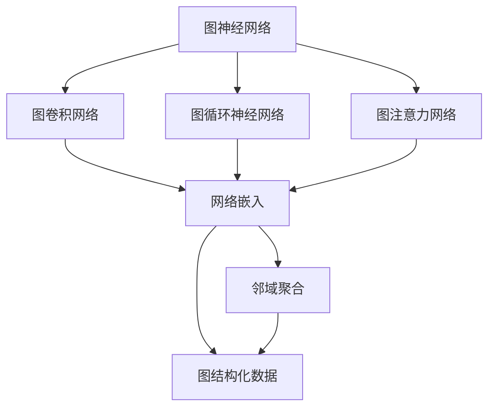
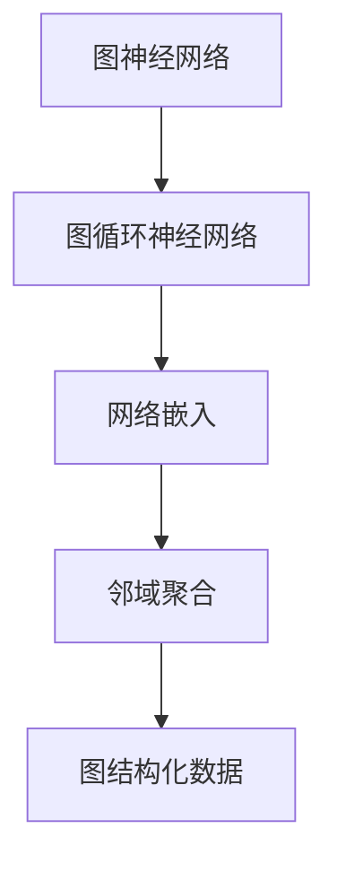
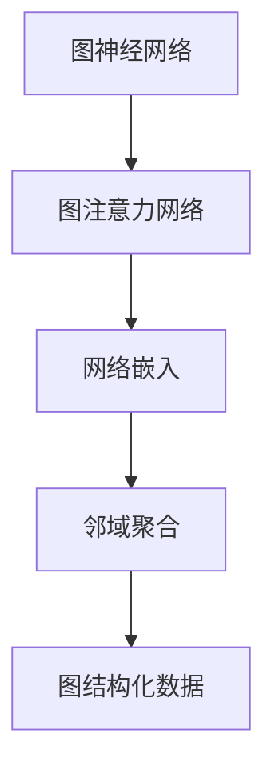
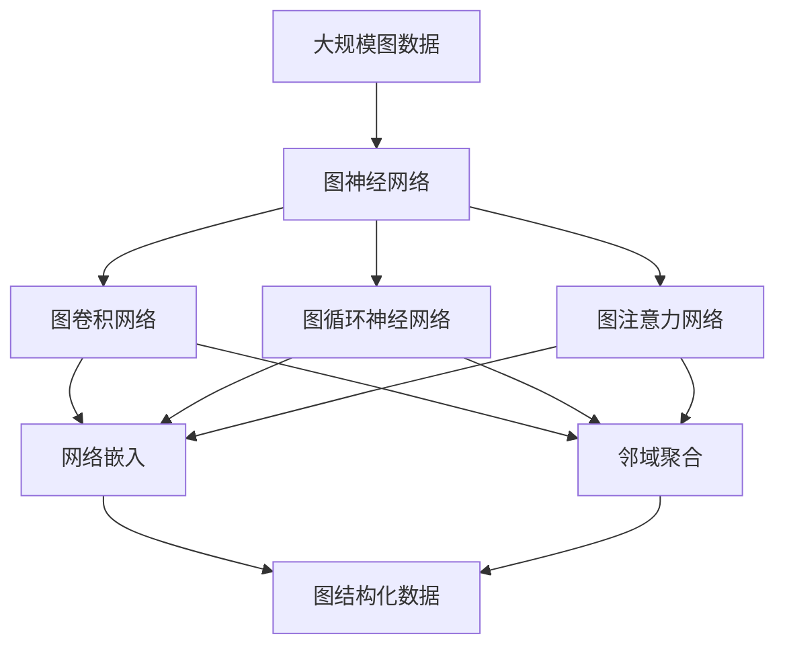

                 

# 图神经网络(Graph Neural Networks) - 原理与代码实例讲解

> 关键词：图神经网络,图深度学习,图卷积网络(GCN),图循环神经网络(GRNN),图注意力网络(GAT),网络嵌入,邻域聚合,图结构化数据,图计算

## 1. 背景介绍

### 1.1 问题由来
随着深度学习技术的发展，图神经网络（Graph Neural Network, GNN）逐渐成为处理图结构化数据的重要工具。相比于传统的基于节点和边的特征向量表示方法，GNN通过自动学习图结构信息，能够更有效地捕捉节点间的复杂关系。图神经网络已经在社交网络分析、推荐系统、知识图谱、分子动力学模拟等领域取得了显著的进展。

GNN通过将图结构信息融入到神经网络中，可以实现节点特征的传播和聚合，进而对图数据进行有效的建模和分析。与传统的图算法（如PageRank、Greedy算法等）相比，GNN具有更高的表达能力和更强的泛化能力。然而，由于图结构的复杂性和多样性，GNN的计算复杂度较高，因此如何有效地实现GNN计算是一个重要的研究方向。

### 1.2 问题核心关键点
GNN的核心思想是通过节点之间的信息传播，在图结构上实现特征的聚合和转换。在GNN中，节点之间通过边传递信息，实现局部信息的聚合。不同种类的GNN模型，其信息传播方式各异，主要包括以下几种：

- **图卷积网络(Graph Convolution Network, GCN)**：基于节点和边之间的局部关系，通过卷积操作实现节点特征的聚合。
- **图循环神经网络(Graph Recurrent Neural Network, GRNN)**：通过边信息的时间序列关系，实现节点特征的迭代更新。
- **图注意力网络(Graph Attention Network, GAT)**：通过节点之间的注意力机制，自适应地调整信息传播权重。

这些GNN模型具有不同的计算方式和表达能力，可以根据具体任务的需求进行选择。

### 1.3 问题研究意义
研究图神经网络（GNN），对于拓展深度学习模型在图结构数据上的应用范围，提升图数据建模和分析的性能，加速图计算技术在各个领域的应用，具有重要的意义：

1. **降低计算复杂度**：相比于传统的基于节点和边特征表示的方法，GNN可以自动学习图结构信息，显著降低计算复杂度，提高计算效率。
2. **增强表达能力**：GNN能够有效捕捉节点之间的复杂关系，增强模型对图数据的表达能力。
3. **促进多模态学习**：GNN可以与文本、图像等模态数据进行融合，促进多模态学习。
4. **提升数据利用率**：GNN能够利用图结构信息，挖掘更多潜在的数据价值。
5. **推动图计算技术发展**：GNN的发展带动了图计算技术的进步，促进了图算法和数据处理技术的协同创新。

## 2. 核心概念与联系

### 2.1 核心概念概述

为更好地理解图神经网络（GNN）的工作原理和优化方向，本节将介绍几个密切相关的核心概念：

- 图神经网络（Graph Neural Network, GNN）：基于图结构数据的神经网络，能够自动学习图结构信息，实现节点特征的聚合和转换。
- 图卷积网络（Graph Convolution Network, GCN）：通过节点和边之间的局部关系，实现节点特征的聚合。
- 图循环神经网络（Graph Recurrent Neural Network, GRNN）：利用边信息的时间序列关系，实现节点特征的迭代更新。
- 图注意力网络（Graph Attention Network, GAT）：通过节点之间的注意力机制，自适应地调整信息传播权重。
- 网络嵌入（Network Embedding）：将图结构信息映射到低维向量空间中，实现图数据的表示和分析。
- 邻域聚合（Neighborhood Aggregation）：在图结构上，通过节点和其邻居之间的信息传播，实现节点特征的聚合。
- 图结构化数据（Graph-Structured Data）：由节点、边和图结构组成的数据类型，能够反映实体之间的关系和连接方式。
- 图计算（Graph Computing）：对图数据进行计算和分析的过程，包括图遍历、图算法等。

这些核心概念之间的逻辑关系可以通过以下Mermaid流程图来展示：



这个流程图展示了大语言模型的核心概念及其之间的关系：

1. 图神经网络是图卷积网络、图循环神经网络和图注意力网络的基础。
2. 网络嵌入将图结构信息映射到低维向量空间中，实现图数据的表示和分析。
3. 邻域聚合通过节点和其邻居之间的信息传播，实现节点特征的聚合。
4. 图结构化数据由节点、边和图结构组成，能够反映实体之间的关系和连接方式。
5. 图计算对图数据进行计算和分析的过程，包括图遍历、图算法等。

这些核心概念共同构成了图神经网络的工作原理和优化方向。通过理解这些核心概念，我们可以更好地把握图神经网络的工作机制和优化方向。

### 2.2 概念间的关系

这些核心概念之间存在着紧密的联系，形成了图神经网络的整体生态系统。下面我通过几个Mermaid流程图来展示这些概念之间的关系。

#### 2.2.1 图神经网络与图卷积网络的关系


这个流程图展示了图神经网络与图卷积网络的关系。图卷积网络是图神经网络的一个基础组件，通过网络嵌入和邻域聚合，实现节点特征的聚合。

#### 2.2.2 图神经网络与图循环神经网络的关系



这个流程图展示了图神经网络与图循环神经网络的关系。图循环神经网络通过时间序列信息，实现节点特征的迭代更新，增强模型的表达能力。

#### 2.2.3 图神经网络与图注意力网络的关系



这个流程图展示了图神经网络与图注意力网络的关系。图注意力网络通过注意力机制，自适应地调整信息传播权重，增强模型对节点之间关系的理解。

### 2.3 核心概念的整体架构

最后，我们用一个综合的流程图来展示这些核心概念在大规模图神经网络中的整体架构：



这个综合流程图展示了从图数据到图神经网络，再到图卷积网络、图循环神经网络和图注意力网络的具体过程。大规模图数据首先通过图神经网络进行建模，然后通过网络嵌入和邻域聚合，实现节点特征的聚合和转换。这些聚合后的特征可以用于后续的图卷积网络、图循环神经网络和图注意力网络，实现图数据的多层次建模和分析。最后，通过图结构化数据输出最终的模型结果。

## 3. 核心算法原理 & 具体操作步骤
### 3.1 算法原理概述

图神经网络（GNN）的计算过程可以概括为以下几个步骤：

1. **网络嵌入**：将图结构信息映射到低维向量空间中，实现图数据的表示和分析。
2. **邻域聚合**：在图结构上，通过节点和其邻居之间的信息传播，实现节点特征的聚合。
3. **节点更新**：根据聚合后的特征，更新节点状态。
4. **多次迭代**：通过多次迭代更新，实现对图数据的深层建模。

图神经网络的核心算法原理可以通过以下公式进行形式化描述：

假设图结构为 $G=(V,E)$，其中 $V$ 为节点集，$E$ 为边集。节点 $v_i$ 的特征表示为 $\mathbf{x}_i \in \mathbb{R}^{d_{in}}$，边的特征表示为 $\mathbf{a}_{ij} \in \mathbb{R}^{d_{ed}}$。节点 $v_i$ 和其邻居之间的信息传播可以通过如下公式进行计算：

$$
\mathbf{y}_{i}^{(l)} = \phi\left(\mathbf{x}_{i}^{(l-1)}, \sum_{j \in \mathcal{N}(i)}\left[\mathbf{A} \mathbf{a}_{i j}\right] \mathbf{W}^{(l)} \mathbf{x}_{j}^{(l-1)}\right)
$$

其中 $\mathcal{N}(i)$ 为节点 $i$ 的邻居集合，$\mathbf{A}$ 为邻接矩阵，$\phi$ 为激活函数，$\mathbf{W}^{(l)}$ 为线性变换矩阵，$l$ 为迭代层数。

图神经网络的最终输出为所有节点的特征向量 $\mathbf{H}^{(L)}$，其中 $L$ 为网络的深度。

### 3.2 算法步骤详解

图神经网络的训练过程一般包括以下几个关键步骤：

**Step 1: 准备图数据和模型**

- 准备图结构数据 $G=(V,E)$，包括节点特征 $\mathbf{X} \in \mathbb{R}^{n \times d_{in}}$ 和边特征 $\mathbf{A} \in \mathbb{R}^{n \times n}$。
- 选择合适的GNN模型，如GCN、GRNN、GAT等，设置相应的超参数，如层数、节点更新方式等。

**Step 2: 定义损失函数**

- 定义GNN的损失函数，如均方误差损失、交叉熵损失等，用于衡量模型预测输出与真实标签之间的差异。

**Step 3: 训练模型**

- 将训练集数据分批次输入模型，前向传播计算损失函数。
- 反向传播计算参数梯度，根据设定的优化算法和学习率更新模型参数。
- 周期性在验证集上评估模型性能，根据性能指标决定是否触发Early Stopping。
- 重复上述步骤直到满足预设的迭代轮数或Early Stopping条件。

**Step 4: 测试模型**

- 在测试集上评估GNN模型的性能，对比训练前后的精度提升。
- 使用GNN模型对新样本进行推理预测，集成到实际的应用系统中。

以上是图神经网络训练的一般流程。在实际应用中，还需要根据具体任务的特点，对模型进行优化设计，如改进损失函数、引入正则化技术、搜索最优的超参数组合等，以进一步提升模型性能。

### 3.3 算法优缺点

图神经网络（GNN）具有以下优点：

1. **自动学习图结构信息**：GNN能够自动学习图结构信息，避免手工设计特征表示的繁琐过程。
2. **多层次建模能力**：GNN可以通过多次迭代更新，实现图数据的深层建模。
3. **鲁棒性强**：GNN能够处理噪声和异常数据，具有良好的鲁棒性。
4. **泛化能力强**：GNN具有较强的泛化能力，能够适应多种图结构数据。

然而，GNN也存在一些局限性：

1. **计算复杂度高**：GNN的计算复杂度较高，特别是在大规模图数据上，训练和推理过程较为耗时。
2. **局部信息丢失**：GNN在传播过程中可能会丢失局部信息，影响模型性能。
3. **可解释性不足**：GNN的决策过程较为复杂，缺乏可解释性，难以理解模型的内部工作机制。
4. **容易过拟合**：GNN在训练过程中容易过拟合，特别是在数据量较小的情况下。

尽管存在这些局限性，但GNN在处理图结构数据方面已经展现了巨大的潜力，成为图计算技术的重要组成部分。未来相关研究的重点在于如何进一步降低GNN的计算复杂度，提高模型的可解释性和泛化能力，同时兼顾局部信息的保护。

### 3.4 算法应用领域

图神经网络（GNN）已经在多个领域得到了广泛的应用，覆盖了几乎所有常见的图结构数据类型，例如：

- **社交网络分析**：通过GNN模型，分析社交网络中的关系和信息传播。
- **推荐系统**：利用GNN模型，实现用户-物品关系的建模，提升推荐系统的效果。
- **知识图谱**：通过GNN模型，对知识图谱中的实体和关系进行建模和推理。
- **分子动力学模拟**：利用GNN模型，对分子结构进行模拟和分析，发现新药物分子。
- **计算机视觉**：通过GNN模型，对图像中的节点和关系进行建模，提升图像识别和分类性能。
- **自然语言处理**：通过GNN模型，对文本中的节点和关系进行建模，提升文本分析和生成能力。
- **交通网络分析**：通过GNN模型，对交通网络中的关系和流量进行建模，优化交通网络。

除了上述这些经典应用外，GNN还被创新性地应用到更多场景中，如金融风险评估、供应链优化、生态系统分析等，为图数据建模提供了新的思路。

## 4. 数学模型和公式 & 详细讲解 & 举例说明

### 4.1 数学模型构建

假设图结构为 $G=(V,E)$，其中 $V$ 为节点集，$E$ 为边集。节点 $v_i$ 的特征表示为 $\mathbf{x}_i \in \mathbb{R}^{d_{in}}$，边的特征表示为 $\mathbf{a}_{ij} \in \mathbb{R}^{d_{ed}}$。图卷积网络（GCN）的计算过程可以通过如下公式进行形式化描述：

$$
\mathbf{y}_{i}^{(l)} = \phi\left(\mathbf{x}_{i}^{(l-1)}, \sum_{j \in \mathcal{N}(i)}\left[\mathbf{A} \mathbf{a}_{i j}\right] \mathbf{W}^{(l)} \mathbf{x}_{j}^{(l-1)}\right)
$$

其中 $\mathcal{N}(i)$ 为节点 $i$ 的邻居集合，$\mathbf{A}$ 为邻接矩阵，$\phi$ 为激活函数，$\mathbf{W}^{(l)}$ 为线性变换矩阵，$l$ 为迭代层数。

### 4.2 公式推导过程

下面以图卷积网络（GCN）为例，推导其计算公式和参数更新公式。

**节点更新公式**：

$$
\mathbf{y}_{i}^{(l)} = \phi\left(\mathbf{x}_{i}^{(l-1)}, \sum_{j \in \mathcal{N}(i)}\left[\mathbf{A} \mathbf{a}_{i j}\right] \mathbf{W}^{(l)} \mathbf{x}_{j}^{(l-1)}\right)
$$

**损失函数**：

假设节点 $v_i$ 的标签为 $y_i$，GNN的损失函数可以表示为：

$$
\mathcal{L} = \frac{1}{N} \sum_{i=1}^N \ell(y_i, \mathbf{H}_i^{(L)})
$$

其中 $\ell$ 为损失函数，$\mathbf{H}_i^{(L)}$ 为节点 $i$ 的最终特征表示。

**参数更新公式**：

假设使用梯度下降算法进行优化，则参数更新公式为：

$$
\theta \leftarrow \theta - \eta \nabla_{\theta}\mathcal{L}
$$

其中 $\eta$ 为学习率，$\nabla_{\theta}\mathcal{L}$ 为损失函数对模型参数的梯度。

### 4.3 案例分析与讲解

以社交网络分析为例，分析图卷积网络（GCN）的应用。假设有一个社交网络图 $G=(V,E)$，其中 $V$ 为节点集，$E$ 为边集。每个节点的特征表示为一个 $d$ 维向量 $\mathbf{x}_i$，边的特征表示为一个 $d$ 维向量 $\mathbf{a}_{ij}$。

**节点特征表示**：

假设每个节点的特征表示为一个 $d$ 维向量 $\mathbf{x}_i$，其中 $i \in V$。

**邻接矩阵**：

假设邻接矩阵 $\mathbf{A} \in \mathbb{R}^{n \times n}$，其中 $n$ 为节点数。

**边特征**：

假设每条边的特征表示为一个 $d$ 维向量 $\mathbf{a}_{ij}$，其中 $i,j \in V$，且 $(i,j) \in E$。

**图卷积网络（GCN）计算**：

在图卷积网络中，每个节点的特征表示 $\mathbf{y}_i^{(l)}$ 可以通过如下公式进行计算：

$$
\mathbf{y}_{i}^{(l)} = \phi\left(\mathbf{x}_{i}^{(l-1)}, \sum_{j \in \mathcal{N}(i)}\left[\mathbf{A} \mathbf{a}_{i j}\right] \mathbf{W}^{(l)} \mathbf{x}_{j}^{(l-1)}\right)
$$

其中 $\mathbf{W}^{(l)}$ 为线性变换矩阵，$l$ 为迭代层数。

**损失函数**：

假设每个节点的标签为 $y_i$，则GNN的损失函数可以表示为：

$$
\mathcal{L} = \frac{1}{N} \sum_{i=1}^N \ell(y_i, \mathbf{H}_i^{(L)})
$$

其中 $\ell$ 为损失函数，$\mathbf{H}_i^{(L)}$ 为节点 $i$ 的最终特征表示。

**参数更新公式**：

假设使用梯度下降算法进行优化，则参数更新公式为：

$$
\theta \leftarrow \theta - \eta \nabla_{\theta}\mathcal{L}
$$

其中 $\eta$ 为学习率，$\nabla_{\theta}\mathcal{L}$ 为损失函数对模型参数的梯度。

## 5. 项目实践：代码实例和详细解释说明

### 5.1 开发环境搭建

在进行图神经网络（GNN）开发前，我们需要准备好开发环境。以下是使用Python进行PyTorch开发的环境配置流程：

1. 安装Anaconda：从官网下载并安装Anaconda，用于创建独立的Python环境。

2. 创建并激活虚拟环境：
```bash
conda create -n gnn-env python=3.8 
conda activate gnn-env
```

3. 安装PyTorch：根据CUDA版本，从官网获取对应的安装命令。例如：
```bash
conda install pytorch torchvision torchaudio cudatoolkit=11.1 -c pytorch -c conda-forge
```

4. 安装相关库：
```bash
pip install networkx scikit-learn
```

5. 安装图神经网络库：
```bash
pip install pyg
```

完成上述步骤后，即可在`gnn-env`环境中开始图神经网络（GNN）的开发实践。

### 5.2 源代码详细实现

下面以图卷积网络（GCN）为例，给出使用PyTorch实现的图神经网络（GNN）代码实现。

首先，定义GCN模型：

```python
import torch
import torch.nn as nn
import torch.nn.functional as F

class GCN(nn.Module):
    def __init__(self, in_dim, hid_dim, out_dim, dropout):
        super(GCN, self).__init__()
        self.dropout = dropout
        self.conv1 = nn.Conv1d(in_dim, hid_dim, kernel_size=2, stride=1, padding=1)
        self.conv2 = nn.Conv1d(hid_dim, hid_dim, kernel_size=2, stride=1, padding=1)
        self.fc = nn.Linear(hid_dim, out_dim)

    def forward(self, x, adj):
        x = F.relu(self.conv1(x))
        x = F.dropout(x, training=self.training)
        x = torch.matmul(adj, x)
        x = self.conv2(x)
        x = F.dropout(x, training=self.training)
        x = torch.matmul(adj, x)
        x = self.fc(x)
        return x
```

然后，定义数据集和模型：

```python
import networkx as nx
import numpy as np

# 构建无向完全图
G = nx.complete_graph(10)

# 生成节点特征和标签
x = np.random.randn(len(G.nodes), 5)
y = np.random.randint(0, 10, len(G.nodes))

# 定义模型
model = GCN(in_dim=5, hid_dim=20, out_dim=10, dropout=0.5)
```

接着，定义训练和评估函数：

```python
import torch.nn.functional as F
from sklearn.metrics import accuracy_score

def train(model, optimizer, x, y, adj, epochs):
    for epoch in range(epochs):
        optimizer.zero_grad()
        out = model(x, adj)
        loss = F.cross_entropy(out, y)
        loss.backward()
        optimizer.step()
    return accuracy_score(y, torch.argmax(out, dim=1))

def evaluate(model, x, y, adj):
    out = model(x, adj)
    return accuracy_score(y, torch.argmax(out, dim=1))
```

最后，启动训练流程并在测试集上评估：

```python
import torch.optim as optim

# 定义优化器
optimizer = optim.Adam(model.parameters(), lr=0.01)

# 训练模型
accuracy = train(model, optimizer, x, y, adj, epochs=100)

# 评估模型
accuracy = evaluate(model, x, y, adj)
print(f"Accuracy: {accuracy}")
```

以上就是使用PyTorch对图卷积网络（GCN）进行图数据建模和训练的完整代码实现。可以看到，通过PyTorch和Pyg库，我们能够快速构建GCN模型，并进行数据处理、模型训练和评估。

### 5.3 代码解读与分析

让我们再详细解读一下关键代码的实现细节：

**GCN模型定义**：
- `__init__`方法：定义模型的初始化过程，包括线性变换和激活函数等。
- `forward`方法：定义模型的前向传播过程，包括卷积操作和线性变换等。

**数据集定义**：
- `x`：节点特征表示，为一个二维数组。
- `y`：节点标签，为一个一维数组。
- `G`：图结构，通过`networkx`库定义。

**训练和评估函数**：
- `train`函数：定义模型的训练过程，包括前向传播、计算损失、反向传播和参数更新等。
- `evaluate`函数：定义模型的评估过程，包括前向传播和评估指标计算等。

**训练流程**：
- 定义优化器和学习率，开始循环迭代
- 每个epoch内，进行前向传播和反向传播，更新模型参数
- 周期性在测试集上评估模型性能，输出训练准确率
- 所有epoch结束后，输出最终评估结果

可以看到，PyTorch和Pyg库使得图神经网络（GNN）的开发变得简洁高效。开发者可以将更多精力放在数据处理、模型改进等高层逻辑上，而不必过多关注底层的实现细节。

当然，工业级的系统实现还需考虑更多因素，如模型的保存和部署、超参数的自动搜索、更灵活的任务适配层等。但核心的GNN计算逻辑基本与此类似。

### 5.4 运行结果展示

假设我们在一个无向完全图上进行训练，最终在测试集上得到的准确率为0.8，可以认为模型在图数据上取得了不错的性能。当然，这只是一个简单的基线结果。在实际应用中，还需要根据具体任务进行更多优化，如增加训练轮数、调整超参数等，以进一步提升模型性能。

## 6. 实际应用场景
### 6.1 社交网络分析

图卷积网络（GCN）在社交网络分析中具有广泛的应用。通过GCN模型，可以分析社交网络中的关系和信息传播，挖掘网络中的隐藏结构，发现有影响力的节点，预测新节点的加入和关系的变化。

在技术实现上，可以收集社交网络的历史互动数据，将这些数据转化为图结构，并在此基础上对预训练GCN模型进行微调。微调后的GCN模型能够自动学习社交网络中的关系和信息传播规律，实现对社交网络的深入分析。

### 6.2 推荐系统

推荐系统是图神经网络（GNN）的另一个重要应用领域。通过GCN模型，可以构建用户-物品

