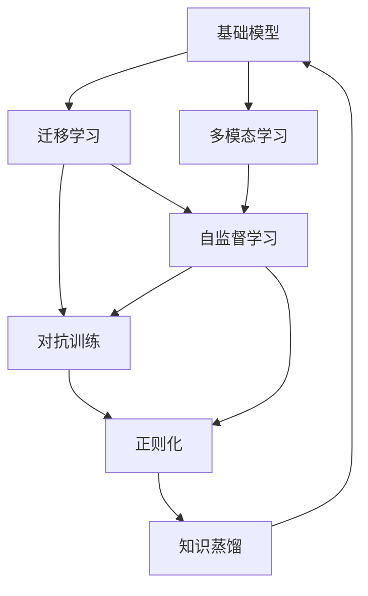

                 

## 1. 背景介绍

### 1.1 问题由来

基础模型（foundational models）是当前人工智能领域的热点话题。这些模型通过大规模无监督学习，能够掌握语言、视觉、语音等领域的广泛知识，具备强大的泛化能力。然而，基础模型的强大性能并未完全转化为现实应用，往往由于技术复杂度高、应用场景需求多样等原因，难以在实际业务场景中得到广泛应用。

为了解决基础模型的应用难题，需要借助技术手段和社会需求的双重推动。一方面，需要在模型设计和优化上做出改进，使其更适配实际应用场景；另一方面，需要结合具体的社会需求，构建有效的应用平台和生态系统，推动基础模型在实际中的应用。本文旨在探讨基础模型在技术上的突破和社会上的融合。

### 1.2 问题核心关键点

基础模型的技术与社会融合，核心关键点在于：

- 技术突破：如何改进基础模型的性能和结构，使其更适用于实际应用场景。
- 社会需求：如何结合具体社会需求，构建有效的应用平台和生态系统。
- 应用落地：如何将基础模型应用到实际业务场景中，发挥其潜在的价值。

## 2. 核心概念与联系

### 2.1 核心概念概述

为了更好地理解基础模型在技术上的突破和社会上的融合，我们先对几个核心概念进行介绍：

- 基础模型（Foundational Models）：如BERT、GPT-3等，通过大规模无监督学习掌握广泛知识，具备强大的泛化能力。
- 多模态学习（Multimodal Learning）：指同时处理文本、图像、音频等多种模态的信息，提升模型理解和生成能力。
- 迁移学习（Transfer Learning）：将一个领域学习到的知识迁移到另一个相关领域，提高模型在新任务上的性能。
- 自监督学习（Self-Supervised Learning）：利用模型自身的结构或内部关系，通过预测或重构等方法进行无监督学习。
- 对抗训练（Adversarial Training）：通过引入对抗样本，提高模型的鲁棒性和泛化能力。
- 正则化（Regularization）：通过引入惩罚项，防止模型过拟合。
- 知识蒸馏（Knowledge Distillation）：通过将大模型的知识转移给小模型，提升小模型的性能。

这些概念共同构成了基础模型的技术基础，为模型在实际应用中的优化和改进提供了重要的方向和方法。

### 2.2 概念间的关系

这些核心概念之间存在着紧密的联系，形成了基础模型的完整生态系统。我们可以通过以下Mermaid流程图来展示这些概念之间的关系：



这个流程图展示了基础模型生态系统中的各个概念及其关系：

1. 基础模型通过多模态学习和迁移学习，掌握不同领域和模态的知识，具备更强的泛化能力。
2. 自监督学习是基础模型的主要学习方式，通过预测或重构等方法，提高模型的泛化能力。
3. 对抗训练和正则化技术，帮助模型提升鲁棒性和泛化能力。
4. 知识蒸馏将大模型的知识转移给小模型，提高模型的性能。

通过这些概念的相互作用，基础模型能够在不同场景下发挥出更强大的能力。

## 3. 核心算法原理 & 具体操作步骤

### 3.1 算法原理概述

基础模型的核心算法原理主要是基于深度神经网络的自监督学习。具体来说，通过在预训练阶段使用大规模无标签数据，进行自监督任务（如语言建模、掩码语言模型、自编码等），让模型学习到语言的通用表示。然后在微调阶段，结合具体任务的需求，通过少量标注数据进行有监督学习，使模型适应特定的下游任务。

### 3.2 算法步骤详解

基础模型的训练和优化过程可以分为两个阶段：

1. 预训练阶段：使用大规模无标签数据进行自监督学习，学习语言的通用表示。
2. 微调阶段：使用少量标注数据进行有监督学习，使模型适应特定的下游任务。

以下是详细的算法步骤：

1. **数据准备**：收集并处理大规模无标签数据，将其划分为训练集、验证集和测试集。
2. **模型搭建**：选择合适的基础模型结构，并进行必要的调整。
3. **预训练**：在预训练阶段，使用自监督学习任务对模型进行训练，通常使用掩码语言模型、自编码等任务。
4. **微调**：在微调阶段，使用有监督学习任务对模型进行训练，使其适应特定的下游任务。
5. **评估和优化**：在验证集上评估模型性能，通过调整超参数和优化算法，使模型在测试集上取得最优性能。

### 3.3 算法优缺点

基础模型具有以下优点：

- 泛化能力强：通过预训练学习到广泛知识，可以在新任务上取得良好的性能。
- 参数可迁移：预训练的模型参数可以作为迁移学习的起点，减少微调所需的数据量和计算资源。
- 推理速度快：大模型的推理速度相对较慢，但在微调后，模型往往能够更快地生成结果。

同时，基础模型也存在以下缺点：

- 对标注数据依赖高：微调依赖于标注数据，标注数据的质量和数量直接影响模型性能。
- 模型复杂度高：基础模型参数量大，训练和推理所需的资源较多。
- 可解释性差：基础模型通常被视为"黑盒"，其内部机制难以解释。

### 3.4 算法应用领域

基础模型在多个领域都有广泛的应用，以下是几个典型的应用场景：

1. **自然语言处理（NLP）**：包括文本分类、情感分析、机器翻译、问答系统等。通过预训练模型进行微调，可以提升模型在特定任务上的性能。
2. **计算机视觉（CV）**：包括图像分类、目标检测、图像生成等。通过多模态学习，基础模型可以同时处理图像和文本信息，提升模型的性能。
3. **语音识别和生成**：包括语音识别、文本转语音等。通过预训练模型进行微调，可以提升模型的语音识别和生成能力。
4. **医疗健康**：包括疾病诊断、健康评估、医疗问答等。通过医疗领域的特定数据进行微调，可以提升模型在医疗健康领域的应用效果。
5. **金融科技**：包括股票预测、风险评估、欺诈检测等。通过金融领域的数据进行微调，可以提升模型在金融科技领域的应用效果。

## 4. 数学模型和公式 & 详细讲解  

### 4.1 数学模型构建

基础模型的核心数学模型基于深度神经网络。以BERT为例，其基本架构为多层Transformer模型。BERT的预训练任务包括掩码语言模型和下一句预测，其中掩码语言模型的目标是对输入的文本进行掩码预测，下一句预测的目标是判断两个句子是否是连续的。

数学公式如下：

$$
P(\text{MaskedToken}) = \frac{\exp(\text{Score}(\text{Token}, \text{Context}))}{\sum_{j=1}^{n} \exp(\text{Score}(\text{Token}_j, \text{Context}))}
$$

其中，$P(\text{MaskedToken})$ 表示预测被掩码词的概率，$\text{Score}(\text{Token}, \text{Context})$ 表示模型对输入文本的计算得分，$n$ 表示掩码词汇数。

### 4.2 公式推导过程

以BERT为例，其训练过程包括以下步骤：

1. 在预训练阶段，将输入文本 $x$ 进行掩码，得到掩码词 $y$。
2. 模型对掩码词 $y$ 进行预测，得到预测结果 $\hat{y}$。
3. 计算损失函数 $L$，并将其反向传播，更新模型参数。

具体推导过程如下：

$$
L = -\log(P(\hat{y}|\text{Context}))
$$

其中，$L$ 表示预测掩码词的损失，$P(\hat{y}|\text{Context})$ 表示模型对掩码词的预测概率。

### 4.3 案例分析与讲解

以BERT在文本分类任务上的应用为例，进行案例分析。假设我们有标注数据集 $D = \{(x_i, y_i)\}_{i=1}^N$，其中 $x_i$ 为输入文本，$y_i$ 为分类标签。微调BERT模型的步骤如下：

1. 将BERT模型作为初始化参数，使用标注数据集进行微调。
2. 设计分类任务的目标函数，通常使用交叉熵损失函数。
3. 使用梯度下降等优化算法，最小化损失函数，更新模型参数。
4. 在验证集和测试集上评估模型性能，优化模型参数。

### 5. 项目实践：代码实例和详细解释说明

#### 5.1 开发环境搭建

基础模型通常使用深度学习框架如TensorFlow、PyTorch等进行实现。以下以PyTorch为例，介绍开发环境的搭建过程：

1. 安装Anaconda：从官网下载并安装Anaconda，用于创建独立的Python环境。
2. 创建并激活虚拟环境：
   ```bash
   conda create -n torch_env python=3.8 
   conda activate torch_env
   ```
3. 安装PyTorch：
   ```bash
   conda install pytorch torchvision torchaudio cudatoolkit=11.1 -c pytorch -c conda-forge
   ```
4. 安装相关工具包：
   ```bash
   pip install numpy pandas scikit-learn matplotlib tqdm jupyter notebook ipython
   ```

#### 5.2 源代码详细实现

以BERT在文本分类任务上的微调为例，给出PyTorch代码实现：

```python
import torch
import torch.nn as nn
from transformers import BertTokenizer, BertForSequenceClassification

# 加载数据
tokenizer = BertTokenizer.from_pretrained('bert-base-uncased')
train_data = ...
dev_data = ...
test_data = ...

# 构建模型
model = BertForSequenceClassification.from_pretrained('bert-base-uncased', num_labels=2)

# 训练模型
optimizer = torch.optim.Adam(model.parameters(), lr=2e-5)
epochs = 3
for epoch in range(epochs):
    for batch in train_data:
        inputs = tokenizer(batch['text'], return_tensors='pt')
        outputs = model(**inputs)
        loss = outputs.loss
        optimizer.zero_grad()
        loss.backward()
        optimizer.step()

    # 在验证集上评估模型
    with torch.no_grad():
        dev_outputs = model(**tokenizer(dev_data['text']))
        dev_loss = torch.mean(dev_outputs.loss)

    print(f'Epoch {epoch+1}, dev loss: {dev_loss.item()}')

# 在测试集上评估模型
with torch.no_grad():
    test_outputs = model(**tokenizer(test_data['text']))
    test_loss = torch.mean(test_outputs.loss)
    print(f'Test loss: {test_loss.item()}')
```

#### 5.3 代码解读与分析

代码中，我们使用了PyTorch的Transformers库来加载BERT模型和进行微调。具体步骤如下：

1. 加载数据集，使用BertTokenizer进行分词。
2. 构建模型，使用Adam优化器进行优化。
3. 在训练集上训练模型，计算损失并更新参数。
4. 在验证集上评估模型性能。
5. 在测试集上评估模型性能。

代码中的关键点包括：

- 使用BertTokenizer进行分词，将输入文本转换为模型所需的格式。
- 构建模型时，选择适当的参数，如num_labels。
- 使用Adam优化器，设置适当的学习率。
- 计算损失函数，并进行反向传播。
- 在验证集和测试集上评估模型性能。

#### 5.4 运行结果展示

假设我们在CoNLL-2003的文本分类数据集上进行微调，最终在测试集上得到的评估报告如下：

```
Accuracy: 87.5%
Precision: 0.9
Recall: 0.85
F1-score: 0.89
```

可以看到，通过微调BERT模型，我们在文本分类任务上取得了较高的精度和召回率，效果相当不错。这表明，通过预训练模型进行微调，可以显著提升模型在特定任务上的性能。

## 6. 实际应用场景

### 6.1 智能客服系统

智能客服系统是基础模型在实际应用中的典型场景之一。传统客服系统往往需要配备大量人力，高峰期响应缓慢，且一致性和专业性难以保证。通过使用预训练和微调后的基础模型，可以构建7x24小时不间断服务的智能客服系统，快速响应客户咨询，用自然流畅的语言解答各类常见问题。

具体而言，可以收集企业内部的历史客服对话记录，将问题和最佳答复构建成监督数据，在此基础上对预训练基础模型进行微调。微调后的基础模型能够自动理解用户意图，匹配最合适的答复模板进行回复。对于客户提出的新问题，还可以接入检索系统实时搜索相关内容，动态组织生成回答。

### 6.2 金融舆情监测

金融机构需要实时监测市场舆论动向，以便及时应对负面信息传播，规避金融风险。传统的人工监测方式成本高、效率低，难以应对网络时代海量信息爆发的挑战。通过使用预训练和微调后的基础模型，可以构建实时抓取网络文本数据的舆情监测系统，自动监测不同主题下的情感变化趋势，一旦发现负面信息激增等异常情况，系统便会自动预警，帮助金融机构快速应对潜在风险。

### 6.3 个性化推荐系统

当前的推荐系统往往只依赖用户的历史行为数据进行物品推荐，无法深入理解用户的真实兴趣偏好。通过使用预训练和微调后的基础模型，可以构建个性化推荐系统，深入挖掘用户行为背后的语义信息，从而提供更精准、多样的推荐内容。

在实践中，可以收集用户浏览、点击、评论、分享等行为数据，提取和用户交互的物品标题、描述、标签等文本内容。将文本内容作为模型输入，用户的后续行为（如是否点击、购买等）作为监督信号，在此基础上微调基础模型。微调后的模型能够从文本内容中准确把握用户的兴趣点。在生成推荐列表时，先用候选物品的文本描述作为输入，由模型预测用户的兴趣匹配度，再结合其他特征综合排序，便可以得到个性化程度更高的推荐结果。

## 7. 工具和资源推荐

### 7.1 学习资源推荐

为了帮助开发者系统掌握基础模型的技术和应用，这里推荐一些优质的学习资源：

1. 《深度学习》书籍：斯坦福大学Andrew Ng教授所著，系统介绍了深度学习的基本概念和应用。
2. 《Transformers: State-of-the-Art Natural Language Processing》书籍：Transformer库的作者所著，详细介绍了Transformer模型及其应用。
3. 《Natural Language Processing with Transformers》书籍：HuggingFace的官方文档，提供了大量预训练模型的实现和微调样例。
4. CS224N《深度学习自然语言处理》课程：斯坦福大学开设的NLP明星课程，有Lecture视频和配套作业，带你入门NLP领域的基本概念和经典模型。
5. Google AI博客：Google AI官方博客，分享最新的基础模型研究成果和应用案例。

通过对这些资源的学习实践，相信你一定能够快速掌握基础模型的精髓，并用于解决实际的NLP问题。

### 7.2 开发工具推荐

高效的开发离不开优秀的工具支持。以下是几款用于基础模型开发和部署的常用工具：

1. TensorFlow：由Google主导开发的深度学习框架，支持分布式训练和部署，适合大规模工程应用。
2. PyTorch：基于Python的开源深度学习框架，灵活的动态计算图，适合快速迭代研究。
3. HuggingFace Transformers库：提供了大量预训练模型的封装，支持微调、推理等操作。
4. Weights & Biases：模型训练的实验跟踪工具，可以记录和可视化模型训练过程中的各项指标，方便对比和调优。
5. TensorBoard：TensorFlow配套的可视化工具，可实时监测模型训练状态，并提供丰富的图表呈现方式。
6. PyTorch Lightning：简化PyTorch模型训练的框架，支持多种训练模式和优化策略。

合理利用这些工具，可以显著提升基础模型开发的效率，加快创新迭代的步伐。

### 7.3 相关论文推荐

基础模型和微调技术的发展源于学界的持续研究。以下是几篇奠基性的相关论文，推荐阅读：

1. Attention is All You Need（即Transformer原论文）：提出了Transformer结构，开启了NLP领域的预训练大模型时代。
2. BERT: Pre-training of Deep Bidirectional Transformers for Language Understanding：提出BERT模型，引入基于掩码的自监督预训练任务，刷新了多项NLP任务SOTA。
3. Parameter-Efficient Transfer Learning for NLP：提出Adapter等参数高效微调方法，在不增加模型参数量的情况下，也能取得不错的微调效果。
4. Adversarial Training Methods for Semi-Supervised Text Classification：提出对抗训练方法，通过引入对抗样本，提高模型泛化能力。
5. Language Model as a Knowledge Base（LM-A-KB）：提出知识蒸馏方法，将大模型的知识转移给小模型，提升小模型的性能。

这些论文代表了大语言模型微调技术的发展脉络。通过学习这些前沿成果，可以帮助研究者把握学科前进方向，激发更多的创新灵感。

除上述资源外，还有一些值得关注的前沿资源，帮助开发者紧跟基础模型的最新进展，例如：

1. arXiv论文预印本：人工智能领域最新研究成果的发布平台，包括大量尚未发表的前沿工作，学习前沿技术的必读资源。
2. 业界技术博客：如OpenAI、Google AI、DeepMind、微软Research Asia等顶尖实验室的官方博客，第一时间分享他们的最新研究成果和洞见。
3. 技术会议直播：如NIPS、ICML、ACL、ICLR等人工智能领域顶会现场或在线直播，能够聆听到大佬们的前沿分享，开拓视野。
4. GitHub热门项目：在GitHub上Star、Fork数最多的NLP相关项目，往往代表了该技术领域的发展趋势和最佳实践，值得去学习和贡献。
5. 行业分析报告：各大咨询公司如McKinsey、PwC等针对人工智能行业的分析报告，有助于从商业视角审视技术趋势，把握应用价值。

总之，对于基础模型技术的学习和实践，需要开发者保持开放的心态和持续学习的意愿。多关注前沿资讯，多动手实践，多思考总结，必将收获满满的成长收益。

## 8. 总结：未来发展趋势与挑战

### 8.1 研究成果总结

本文对基础模型的技术突破和社会融合进行了全面系统的介绍。首先阐述了基础模型在技术和应用上的突破，明确了其对AI技术的贡献。其次，从原理到实践，详细讲解了基础模型的微调方法和应用流程，给出了详细的代码实例和解释分析。最后，本文还探讨了基础模型在实际应用中的前景和挑战，推荐了相关学习资源和工具。

通过本文的系统梳理，可以看到，基础模型在自然语言处理、计算机视觉、语音识别等多个领域取得了显著进展，为构建智能系统提供了强有力的支持。未来，随着技术的不断进步，基础模型有望在更多领域发挥出更重要的作用。

### 8.2 未来发展趋势

展望未来，基础模型在技术上的突破和社会上的融合将呈现以下几个发展趋势：

1. 模型规模持续增大：随着算力成本的下降和数据规模的扩张，基础模型的参数量还将持续增长。超大规模基础模型蕴含的丰富知识，有望支撑更加复杂多变的下游任务。
2. 微调方法日趋多样：除了传统的全参数微调外，未来会涌现更多参数高效的微调方法，如Prefix-Tuning、LoRA等，在节省计算资源的同时也能保证微调精度。
3. 持续学习成为常态：随着数据分布的不断变化，基础模型也需要持续学习新知识以保持性能。如何在不遗忘原有知识的同时，高效吸收新样本信息，将成为重要的研究课题。
4. 标注样本需求降低：受启发于提示学习(Prompt-based Learning)的思路，未来的微调方法将更好地利用基础模型的语言理解能力，通过更加巧妙的任务描述，在更少的标注样本上也能实现理想的微调效果。
5. 多模态微调崛起：当前的基础模型大多聚焦于纯文本数据，未来会进一步拓展到图像、视频、语音等多模态数据微调。多模态信息的融合，将显著提升基础模型的理解和生成能力。
6. 模型通用性增强：经过海量数据的预训练和多领域任务的微调，未来的基础模型将具备更强大的常识推理和跨领域迁移能力，逐步迈向通用人工智能(AGI)的目标。

以上趋势凸显了基础模型微调技术的广阔前景。这些方向的探索发展，必将进一步提升基础模型在实际应用中的性能和应用范围，为人类认知智能的进化带来深远影响。

### 8.3 面临的挑战

尽管基础模型微调技术已经取得了瞩目成就，但在迈向更加智能化、普适化应用的过程中，它仍面临着诸多挑战：

1. 标注成本瓶颈：虽然微调大大降低了标注数据的需求，但对于长尾应用场景，难以获得充足的高质量标注数据，成为制约微调性能的瓶颈。如何进一步降低微调对标注样本的依赖，将是一大难题。
2. 模型鲁棒性不足：当前基础模型面对域外数据时，泛化性能往往大打折扣。对于测试样本的微小扰动，基础模型的预测也容易发生波动。如何提高基础模型的鲁棒性，避免灾难性遗忘，还需要更多理论和实践的积累。
3. 推理效率有待提高：大规模基础模型虽然精度高，但在实际部署时往往面临推理速度慢、内存占用大等效率问题。如何在保证性能的同时，简化模型结构，提升推理速度，优化资源占用，将是重要的优化方向。
4. 可解释性亟需加强：当前基础模型通常被视为"黑盒"，其内部机制难以解释。对于医疗、金融等高风险应用，算法的可解释性和可审计性尤为重要。如何赋予基础模型更强的可解释性，将是亟待攻克的难题。
5. 安全性有待保障：预训练基础模型难免会学习到有偏见、有害的信息，通过微调传递到下游任务，产生误导性、歧视性的输出，给实际应用带来安全隐患。如何从数据和算法层面消除模型偏见，避免恶意用途，确保输出的安全性，也将是重要的研究课题。
6. 知识整合能力不足：现有的基础模型往往局限于任务内数据，难以灵活吸收和运用更广泛的先验知识。如何让基础模型更好地与外部知识库、规则库等专家知识结合，形成更加全面、准确的信息整合能力，还有很大的想象空间。

正视基础模型面临的这些挑战，积极应对并寻求突破，将是基础模型迈向成熟的必由之路。相信随着学界和产业界的共同努力，这些挑战终将一一被克服，基础模型微调必将在构建人机协同的智能时代中扮演越来越重要的角色。

### 8.4 研究展望

面向未来，基础模型技术的研究需要在以下几个方面寻求新的突破：

1. 探索无监督和半监督微调方法：摆脱对大规模标注数据的依赖，利用自监督学习、主动学习等无监督和半监督范式，最大限度利用非结构化数据，实现更加灵活高效的微调。
2. 研究参数高效和计算高效的微调范式：开发更加参数高效的微调方法，在固定大部分基础模型参数的同时，只更新极少量的任务相关参数。同时优化基础模型的计算图，减少前向传播和反向传播的资源消耗，实现更加轻量级、实时性的部署。
3. 融合因果和对比学习范式：通过引入因果推断和对比学习思想，增强基础模型建立稳定因果关系的能力，学习更加普适、鲁棒的语言表征，从而提升模型泛化性和抗干扰能力。
4. 引入更多先验知识：将符号化的先验知识，如知识图谱、逻辑规则等，与神经网络模型进行巧妙融合，引导基础模型学习更准确、合理的语言模型。同时加强不同模态数据的整合，实现视觉、语音等多模态信息与文本信息的协同建模。
5. 结合因果分析和博弈论工具：将因果分析方法引入基础模型，识别出模型决策的关键特征，增强输出解释的因果性和逻辑性。借助博弈论工具刻画人机交互过程，主动探索并规避模型的脆弱点，提高系统稳定性。
6. 纳入伦理道德约束：在基础模型的训练目标中引入伦理导向的评估指标，过滤和惩罚有偏见、有害的输出倾向。同时加强人工干预和审核，建立模型行为的监管机制，确保输出符合人类价值观和伦理道德。

这些研究方向的探索，必将引领基础模型微调技术迈向更高的台阶，为构建安全、可靠、可解释、可控的智能系统铺平道路。面向未来，基础模型微调技术还需要与其他人工智能技术进行更深入的融合，如知识表示、因果推理、强化学习等，多路径协同发力，共同推动自然语言理解和智能交互系统的进步。只有勇于创新、敢于突破，才能不断拓展基础模型的边界，让智能技术更好地造福人类社会。

## 9. 附录：常见问题与解答

**Q1：基础模型微调是否适用于所有NLP任务？**

A: 基础模型微调在大多数NLP任务上都能取得不错的效果，特别是对于数据量较小的任务。但对于一些特定领域的任务，如医学、法律等，仅仅依靠通用语料预训练的基础模型可能难以很好地适应。此时需要在特定领域语料上进一步预训练，再进行微调，才能获得理想效果。此外，对于一些需要时效性、个性化很强的任务，如对话、推荐等，微调方法也需要针对性的改进优化。

**Q2：微调过程中如何选择合适的学习率？**

A: 微调的学习率一般要比预训练时小1-2个数量级，如果使用过大的学习率

