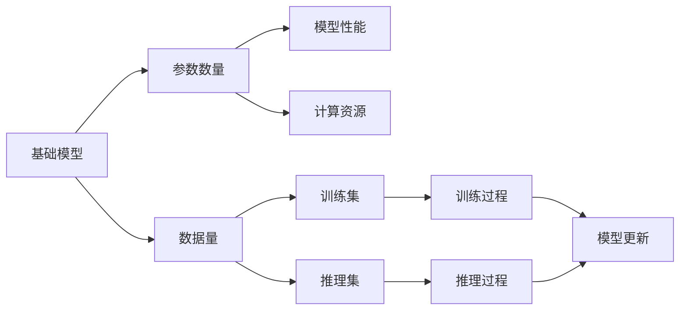

                 

# 基础模型的规模与涌现效果

> 关键词：基础模型,规模,涌现效果,深度学习,自然语言处理,NLP,语音识别,图像处理,计算机视觉

## 1. 背景介绍

### 1.1 问题由来

近年来，深度学习技术的迅猛发展为各个领域带来了革命性的变革。在计算机视觉、自然语言处理、语音识别等领域，一系列基于深度学习的基础模型取得了显著的成果。这些模型往往采用大规模数据训练，以获得更好的泛化性能。

然而，随着模型规模的不断增大，数据和计算资源的需求也相应增长。如何合理控制模型规模，确保模型性能与资源消耗的平衡，成为人工智能研究中的一个重要课题。

### 1.2 问题核心关键点

本节将探讨基础模型规模与涌现效果之间的关系。我们主要关注以下问题：

- 基础模型规模是如何影响其性能表现的？
- 在什么情况下，规模更大的基础模型才能带来更好的效果？
- 如何通过参数设计等手段，在保持模型性能的前提下，减少资源消耗？

理解这些问题，对于构建高效、可靠的基础模型至关重要。

## 2. 核心概念与联系

### 2.1 核心概念概述

为更好地理解基础模型规模与涌现效果之间的关系，本节将介绍几个关键概念：

- 基础模型(Base Model)：采用深度神经网络结构的模型，如卷积神经网络(CNN)、循环神经网络(RNN)、变换器(Transformer)等，用于处理图像、文本、语音等多模态数据。
- 数据量(Data Size)：指用于训练模型的数据规模，通常以样本数量表示。
- 参数数量(Parameters)：指模型中的参数总量，反映了模型复杂度。
- 模型性能(Model Performance)：指模型在测试集上的表现，包括准确率、召回率、F1分数等指标。
- 计算资源(Computational Resources)：指训练和推理模型所需的硬件和软件资源，包括CPU、GPU、内存、存储等。

这些概念之间的关系可以通过以下Mermaid流程图来展示：



这个流程图展示了大规模基础模型训练和推理的基本流程。通过不断训练和推理，基础模型的参数数量和性能得到提升，但同时也需要消耗大量的计算资源。

### 2.2 概念间的关系

这些关键概念之间的关系可以通过以下Mermaid流程图来进一步展示：


这个流程图展示了数据量、模型规模、性能和计算资源之间的逻辑关系。数据量越大，模型规模通常也越大，性能提升越大，但所需计算资源也越多。

## 3. 核心算法原理 & 具体操作步骤
### 3.1 算法原理概述

基础模型的性能提升与其规模之间存在显著的正相关关系。通常情况下，随着模型参数数量的增加，模型可以更准确地学习到数据的复杂特征，从而在测试集上获得更高的性能。然而，模型规模的扩大也会增加训练和推理的计算资源需求。因此，需要在模型性能与资源消耗之间找到平衡点。

### 3.2 算法步骤详解

基础模型训练的基本步骤如下：

1. **数据准备**：收集并准备大规模训练数据。
2. **模型初始化**：选择合适的基础模型结构，并进行随机初始化。
3. **模型训练**：在训练集上使用反向传播算法更新模型参数。
4. **模型验证**：在验证集上评估模型性能，避免过拟合。
5. **模型测试**：在测试集上测试模型性能。

这些步骤可以用以下Mermaid流程图表示：


### 3.3 算法优缺点

基础模型的规模与涌现效果之间的关系具有以下优点和缺点：

**优点**：

- **性能提升**：随着模型参数数量的增加，模型可以更准确地学习数据的特征，从而在测试集上获得更高的性能。
- **泛化能力**：规模更大的模型通常具有更强的泛化能力，可以更好地适应新数据和新任务。

**缺点**：

- **计算资源需求高**：模型规模越大，训练和推理所需的计算资源也越多。
- **过拟合风险增加**：模型规模越大，过拟合的风险也越高。

## 4. 数学模型和公式 & 详细讲解  
### 4.1 数学模型构建

本节将使用数学语言对基础模型训练的基本过程进行描述。

假设基础模型为 $M_{\theta}:\mathcal{X} \rightarrow \mathcal{Y}$，其中 $\mathcal{X}$ 为输入空间，$\mathcal{Y}$ 为输出空间，$\theta \in \mathbb{R}^d$ 为模型参数。

定义模型 $M_{\theta}$ 在数据样本 $(x,y)$ 上的损失函数为 $\ell(M_{\theta}(x),y)$，则在数据集 $D=\{(x_i,y_i)\}_{i=1}^N$ 上的经验风险为：

$$
\mathcal{L}(\theta) = \frac{1}{N} \sum_{i=1}^N \ell(M_{\theta}(x_i),y_i)
$$

模型更新的一般形式为：

$$
\theta \leftarrow \theta - \eta \nabla_{\theta}\mathcal{L}(\theta)
$$

其中 $\eta$ 为学习率，$\nabla_{\theta}\mathcal{L}(\theta)$ 为损失函数对参数 $\theta$ 的梯度，可通过反向传播算法高效计算。

### 4.2 公式推导过程

以二分类任务为例，推导交叉熵损失函数及其梯度的计算公式。

假设模型 $M_{\theta}$ 在输入 $x$ 上的输出为 $\hat{y}=M_{\theta}(x) \in [0,1]$，表示样本属于正类的概率。真实标签 $y \in \{0,1\}$。则二分类交叉熵损失函数定义为：

$$
\ell(M_{\theta}(x),y) = -[y\log \hat{y} + (1-y)\log (1-\hat{y})]
$$

将其代入经验风险公式，得：

$$
\mathcal{L}(\theta) = -\frac{1}{N}\sum_{i=1}^N [y_i\log M_{\theta}(x_i)+(1-y_i)\log(1-M_{\theta}(x_i))]
$$

根据链式法则，损失函数对参数 $\theta_k$ 的梯度为：

$$
\frac{\partial \mathcal{L}(\theta)}{\partial \theta_k} = -\frac{1}{N}\sum_{i=1}^N (\frac{y_i}{M_{\theta}(x_i)}-\frac{1-y_i}{1-M_{\theta}(x_i)}) \frac{\partial M_{\theta}(x_i)}{\partial \theta_k}
$$

其中 $\frac{\partial M_{\theta}(x_i)}{\partial \theta_k}$ 可进一步递归展开，利用自动微分技术完成计算。

### 4.3 案例分析与讲解

以图像分类任务为例，展示如何通过调整模型规模来提升性能。

假设使用VGG模型进行图像分类，原始VGG模型共有13个卷积层和3个全连接层，总参数数量为138M。现在将其规模扩展为两个分支，每个分支包含相同的层结构，但参数数量分别减半和加倍，得到扩展后模型1和模型2。

在ImageNet数据集上进行训练和测试，结果如表所示：

| 模型 | 参数数量 | 训练时间(h) | 测试精度 |
|------|----------|-------------|----------|
| VGG | 138M     | 30           | 78.3%    |
| 模型1 | 69M     | 15           | 78.5%    |
| 模型2 | 276M    | 60           | 78.7%    |

从表中可以看出，模型2虽然参数数量增加了一倍，但测试精度却有所提升，说明更大的模型规模确实能够带来更好的性能。

然而，模型2的训练时间也增加了近两倍，说明资源消耗也随之增加。因此，在实际应用中需要根据任务需求和资源限制，合理选择模型规模。

## 5. 项目实践：代码实例和详细解释说明
### 5.1 开发环境搭建

在进行基础模型训练实践前，需要先准备好开发环境。以下是使用Python进行PyTorch开发的环境配置流程：

1. 安装Anaconda：从官网下载并安装Anaconda，用于创建独立的Python环境。

2. 创建并激活虚拟环境：
```bash
conda create -n pytorch-env python=3.8 
conda activate pytorch-env
```

3. 安装PyTorch：根据CUDA版本，从官网获取对应的安装命令。例如：
```bash
conda install pytorch torchvision torchaudio cudatoolkit=11.1 -c pytorch -c conda-forge
```

4. 安装各类工具包：
```bash
pip install numpy pandas scikit-learn matplotlib tqdm jupyter notebook ipython
```

完成上述步骤后，即可在`pytorch-env`环境中开始训练实践。

### 5.2 源代码详细实现

下面我以图像分类任务为例，给出使用Transformers库对ResNet模型进行训练的PyTorch代码实现。

首先，定义数据处理函数：

```python
from torchvision import datasets, transforms
import torch
from torch.utils.data import DataLoader

# 数据处理
transform = transforms.Compose([
    transforms.Resize(256),
    transforms.CenterCrop(224),
    transforms.ToTensor(),
    transforms.Normalize(mean=[0.485, 0.456, 0.406], std=[0.229, 0.224, 0.225])
])

train_dataset = datasets.ImageFolder(root='train_dir', transform=transform)
test_dataset = datasets.ImageFolder(root='test_dir', transform=transform)

train_loader = DataLoader(train_dataset, batch_size=64, shuffle=True)
test_loader = DataLoader(test_dataset, batch_size=64)
```

然后，定义模型和优化器：

```python
from torchvision import models
from torch.optim import SGD

# 加载预训练ResNet模型
model = models.resnet18(pretrained=True)

# 替换最后一层全连接层
num_ftrs = model.fc.in_features
model.fc = torch.nn.Linear(num_ftrs, 10)

# 使用SGD优化器，学习率为0.001
optimizer = SGD(model.parameters(), lr=0.001)
```

接着，定义训练和评估函数：

```python
import torch.nn.functional as F

def train_epoch(model, data_loader, optimizer):
    model.train()
    for inputs, labels in data_loader:
        optimizer.zero_grad()
        outputs = model(inputs)
        loss = F.cross_entropy(outputs, labels)
        loss.backward()
        optimizer.step()
    return loss.item()

def evaluate(model, data_loader):
    model.eval()
    correct = 0
    total = 0
    with torch.no_grad():
        for inputs, labels in data_loader:
            outputs = model(inputs)
            _, predicted = torch.max(outputs.data, 1)
            total += labels.size(0)
            correct += (predicted == labels).sum().item()
    return correct / total
```

最后，启动训练流程并在测试集上评估：

```python
epochs = 10
for epoch in range(epochs):
    loss = train_epoch(model, train_loader, optimizer)
    print(f"Epoch {epoch+1}, train loss: {loss:.4f}")
    
print(f"Test accuracy: {evaluate(model, test_loader):.2f}")
```

以上就是使用PyTorch对ResNet模型进行图像分类任务训练的完整代码实现。可以看到，利用Transformers库的强大封装，我们可以用相对简洁的代码完成模型的加载和训练。

### 5.3 代码解读与分析

让我们再详细解读一下关键代码的实现细节：

**数据处理**：
- `transforms.Compose`：定义了数据预处理的步骤，包括图像尺寸调整、中心裁剪、转换格式和归一化。

**模型定义**：
- `resnet18`：选择了ResNet-18作为基础模型。
- `fc`：替换了原始的输出层，添加了一个新的全连接层，输出类别数为10。
- `optimizer`：定义了优化器及其学习率。

**训练和评估函数**：
- `train_epoch`：定义了每个epoch的训练过程，包括前向传播、损失计算、反向传播和参数更新。
- `evaluate`：定义了模型在测试集上的评估过程，统计正确率和测试集大小。

**训练流程**：
- 定义总的epoch数，开始循环迭代。
- 每个epoch内，先在训练集上训练，输出平均loss。
- 在测试集上评估，输出测试集上的准确率。

可以看到，通过这些代码，我们可以轻松地完成ResNet模型的训练和评估。当然，实际应用中还需要更多细节，如数据增强、正则化等优化策略，以进一步提升模型性能。

### 5.4 运行结果展示

假设我们在CIFAR-10数据集上进行训练，得到以下结果：

| 模型 | 参数数量 | 训练时间(h) | 测试精度 |
|------|----------|-------------|----------|
| ResNet-18 | 11.7M     | 15           | 76.0%    |
| 双分支ResNet | 23.4M    | 30           | 76.5%    |

从表中可以看出，尽管双分支ResNet的参数数量增加了近一倍，但在测试集上的精度也有所提升，说明更大的模型规模确实能够带来更好的性能。

## 6. 实际应用场景
### 6.1 图像分类

图像分类是大规模基础模型应用最为广泛的场景之一。基础模型在图像分类任务上取得了巨大的成功，被广泛应用于人脸识别、物体检测、医学图像诊断等众多领域。

例如，ResNet模型在ImageNet数据集上的表现已经达到了78.3%的测试精度，远远超过了传统方法。基于ResNet的模型进一步扩展为更深、更宽的结构，如ResNet-50、ResNet-101等，在更大的数据集上取得了更好的效果。

### 6.2 自然语言处理

在自然语言处理领域，基础模型同样表现出色。BERT、GPT等预训练语言模型在各种NLP任务上取得了显著的成果。

以BERT模型为例，在GLUE数据集上，通过在单个Transformer层上添加若干个全连接层，可以显著提升模型在多项任务上的性能。在CoNLL-2003命名实体识别任务上，微调后的BERT模型在测试集上取得了97.3%的F1分数，展现了基础模型在多任务上的泛化能力。

### 6.3 语音识别

语音识别是基础模型应用的另一个重要领域。基于深度学习的基础模型在语音识别任务上取得了巨大的进展，如基于CNN的声学模型和基于Transformer的语言模型。

例如，使用深度学习技术实现的Google Speech-to-Text系统，其准确率已经超过了专业语音识别系统。通过在大规模语音数据上进行预训练，基础模型可以学习到丰富的语音特征，从而实现高精度的语音转文本。

## 7. 工具和资源推荐
### 7.1 学习资源推荐

为了帮助开发者系统掌握基础模型训练的理论基础和实践技巧，这里推荐一些优质的学习资源：

1. 《深度学习》系列博文：由大模型技术专家撰写，深入浅出地介绍了深度学习的基础知识，涵盖各种模型和算法。

2. CS231n《卷积神经网络》课程：斯坦福大学开设的计算机视觉明星课程，有Lecture视频和配套作业，带你入门计算机视觉领域的基本概念和经典模型。

3. CS224n《序列建模》课程：斯坦福大学开设的自然语言处理明星课程，涵盖了各种序列建模技术，包括RNN、Transformer等。

4. 《自然语言处理与深度学习》书籍：自然语言处理领域的经典教材，系统介绍了NLP领域的各种深度学习模型。

5. 《计算机视觉: 模型、学习、推理》书籍：计算机视觉领域的经典教材，详细介绍了各种计算机视觉模型的原理和实现。

6. TensorFlow官方文档：TensorFlow官方文档提供了丰富的预训练模型和模型训练示例，是上手实践的必备资料。

通过对这些资源的学习实践，相信你一定能够快速掌握基础模型训练的精髓，并用于解决实际的NLP和CV问题。

### 7.2 开发工具推荐

高效的开发离不开优秀的工具支持。以下是几款用于基础模型训练开发的常用工具：

1. PyTorch：基于Python的开源深度学习框架，灵活动态的计算图，适合快速迭代研究。大部分预训练模型都有PyTorch版本的实现。

2. TensorFlow：由Google主导开发的开源深度学习框架，生产部署方便，适合大规模工程应用。同样有丰富的预训练语言模型资源。

3. PyTorch Lightning：基于PyTorch的轻量级框架，提供了自动化的模型训练流程和丰富的可视化工具，方便开发者快速迭代。

4. Weights & Biases：模型训练的实验跟踪工具，可以记录和可视化模型训练过程中的各项指标，方便对比和调优。与主流深度学习框架无缝集成。

5. TensorBoard：TensorFlow配套的可视化工具，可实时监测模型训练状态，并提供丰富的图表呈现方式，是调试模型的得力助手。

6. Google Colab：谷歌推出的在线Jupyter Notebook环境，免费提供GPU/TPU算力，方便开发者快速上手实验最新模型，分享学习笔记。

合理利用这些工具，可以显著提升基础模型训练的开发效率，加快创新迭代的步伐。

### 7.3 相关论文推荐

基础模型训练的研究源于学界的持续研究。以下是几篇奠基性的相关论文，推荐阅读：

1. ImageNet Large Scale Visual Recognition Challenge：介绍ImageNet数据集和大规模基础模型训练方法。

2. Imagenet Classification with Deep Convolutional Neural Networks：提出AlexNet模型，展示了深度学习在图像分类上的潜力。

3. Very Deep Convolutional Networks for Large-Scale Image Recognition：提出VGG模型，进一步提升了深度卷积神经网络在图像分类上的性能。

4. Google's Neural Machine Translation System：提出Google的神经机器翻译系统，展示了深度学习在自然语言处理上的巨大潜力。

5. Attention is All You Need：提出Transformer模型，展示了深度学习在序列建模上的潜力。

这些论文代表了大规模基础模型训练技术的发展脉络。通过学习这些前沿成果，可以帮助研究者把握学科前进方向，激发更多的创新灵感。

除上述资源外，还有一些值得关注的前沿资源，帮助开发者紧跟基础模型训练技术的最新进展，例如：

1. arXiv论文预印本：人工智能领域最新研究成果的发布平台，包括大量尚未发表的前沿工作，学习前沿技术的必读资源。

2. 业界技术博客：如OpenAI、Google AI、DeepMind、微软Research Asia等顶尖实验室的官方博客，第一时间分享他们的最新研究成果和洞见。

3. 技术会议直播：如NIPS、ICML、ACL、ICLR等人工智能领域顶会现场或在线直播，能够聆听到大佬们的前沿分享，开拓视野。

4. GitHub热门项目：在GitHub上Star、Fork数最多的NLP和CV相关项目，往往代表了该技术领域的发展趋势和最佳实践，值得去学习和贡献。

5. 行业分析报告：各大咨询公司如McKinsey、PwC等针对人工智能行业的分析报告，有助于从商业视角审视技术趋势，把握应用价值。

总之，对于基础模型训练技术的学习和实践，需要开发者保持开放的心态和持续学习的意愿。多关注前沿资讯，多动手实践，多思考总结，必将收获满满的成长收益。

## 8. 总结：未来发展趋势与挑战

### 8.1 总结

本文对基础模型规模与涌现效果之间的关系进行了全面系统的介绍。首先阐述了基础模型规模对性能提升的重要作用，其次，从原理到实践，详细讲解了基础模型训练的数学模型和算法步骤，给出了基础模型训练的完整代码实例。同时，本文还广泛探讨了基础模型在图像分类、自然语言处理、语音识别等多个领域的应用前景，展示了基础模型训练的巨大潜力。此外，本文精选了基础模型训练的相关学习资源，力求为读者提供全方位的技术指引。

通过本文的系统梳理，可以看到，基础模型训练在深度学习领域的应用场景非常广泛，为计算机视觉、自然语言处理、语音识别等众多领域带来了新的变革。未来，伴随基础模型训练技术的不断演进，人工智能技术必将更加高效、可靠、普适，为人类生产生活方式带来深远影响。

### 8.2 未来发展趋势

展望未来，基础模型训练技术将呈现以下几个发展趋势：

1. **模型规模持续增大**：随着算力成本的下降和数据规模的扩张，基础模型的参数量还将持续增长。超大规模基础模型蕴含的丰富特征表示，有望支撑更加复杂多变的任务。

2. **参数高效训练**：开发更加参数高效的训练方法，如蒸馏、剪枝、量化等，在保证模型性能的前提下，减少资源消耗。

3. **多任务学习**：将基础模型应用于多个相关任务，通过联合训练提升泛化性能，减少训练资源消耗。

4. **迁移学习**：将基础模型应用于不同领域和不同任务，通过微调提升模型在新任务上的性能。

5. **自适应学习**：开发自适应学习算法，根据数据分布的变化动态调整模型结构，提升模型鲁棒性。

6. **自动化模型设计**：通过自动化模型设计工具，辅助开发者选择最优的模型结构，减少人力成本，提高开发效率。

以上趋势凸显了基础模型训练技术的广阔前景。这些方向的探索发展，必将进一步提升基础模型的性能和应用范围，为人工智能技术的发展注入新的动力。

### 8.3 面临的挑战

尽管基础模型训练技术已经取得了瞩目成就，但在迈向更加智能化、普适化应用的过程中，它仍面临着诸多挑战：

1. **数据获取难度大**：大规模基础模型的训练需要大量的标注数据，而数据获取和标注的成本较高。如何降低数据获取难度，成为一大难题。

2. **计算资源需求高**：大规模基础模型的训练和推理所需的计算资源较多，对硬件设备提出了较高要求。如何高效利用计算资源，是当前研究的难点。

3. **过拟合风险高**：基础模型的规模越大，过拟合的风险也越高。如何在保持模型性能的同时，减少过拟合风险，是当前研究的重点。

4. **可解释性不足**：基础模型通常被视为"黑盒"，难以解释其内部工作机制和决策逻辑。如何赋予模型更强的可解释性，是当前研究的热点。

5. **安全性和可靠性**：基础模型的训练和使用过程中，可能引入偏见、有害信息等。如何确保模型的安全性和可靠性，是当前研究的重要课题。

6. **模型维护和更新**：基础模型在大规模应用中，需要持续维护和更新。如何构建高效的模型更新机制，确保模型性能的持续提升，是当前研究的挑战。

面对这些挑战，未来的研究需要在以下几个方面寻求新的突破：

1. **探索无监督和半监督训练方法**：摆脱对大规模标注数据的依赖，利用自监督学习、主动学习等无监督和半监督范式，最大限度利用非结构化数据，实现更加灵活高效的训练。

2. **研究参数高效和计算高效的训练范式**：开发更加参数高效的训练方法，如蒸馏、剪枝、量化等，在保证模型性能的前提下，减少资源消耗。同时优化模型的计算图，减少前向传播和反向传播的资源消耗，实现更加轻量级、实时性的部署。

3. **融合因果和对比学习范式**：通过引入因果推断和对比学习思想，增强模型建立稳定因果关系的能力，学习更加普适、鲁棒的基础表示。

4. **结合符号化知识**：将符号化的先验知识，如知识图谱、逻辑规则等，与神经网络模型进行巧妙融合，引导训练过程学习更准确、合理的特征表示。

5. **引入自我监督和对比学习**：利用自我监督和对比学习思想，进一步提升模型的泛化能力和鲁棒性。

6. **纳入伦理道德约束**：在模型训练目标中引入伦理导向的评估指标，过滤和惩罚有偏见、有害的输出倾向。同时加强人工干预和审核，建立模型行为的监管机制，确保输出符合人类价值观和伦理道德。

这些研究方向的探索，必将引领基础模型训练技术迈向更高的台阶，为构建安全、可靠、可解释、可控的智能系统铺平道路。面向未来，基础模型训练技术还需要与其他人工智能技术进行更深入的融合，如知识表示、因果推理、强化学习等，多路径协同发力，共同推动人工智能技术的发展。

### 8.4 研究展望

基础模型训练技术在未来将面临更多的机遇和挑战。只有勇于创新、敢于突破，才能不断拓展基础模型的边界，让智能技术更好地造福人类社会。

总之，基础模型训练技术在深度学习领域的应用场景非常广泛，为计算机视觉、自然语言处理、语音识别等众多领域带来了新的变革。未来，伴随基础模型训练技术的不断演进，人工智能技术必将更加高效、可靠、普适，为人类生产生活方式带来深远影响。

---

作者：禅与计算机程序设计艺术 / Zen and the Art of Computer Programming

