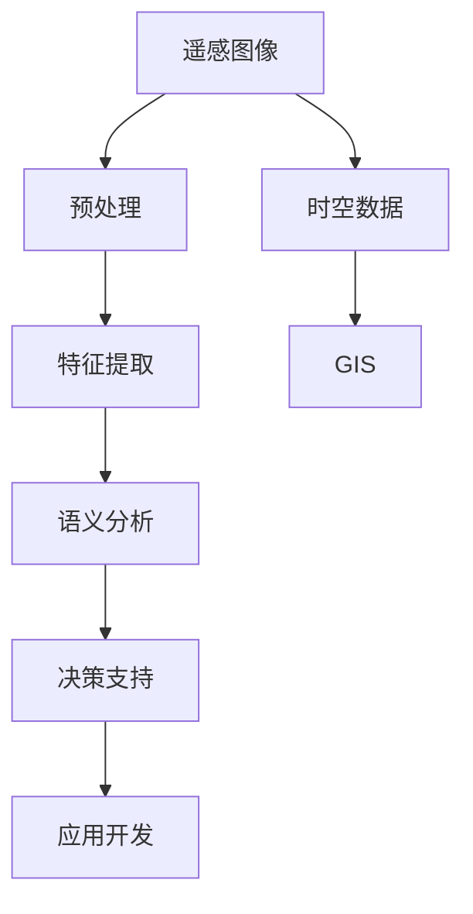
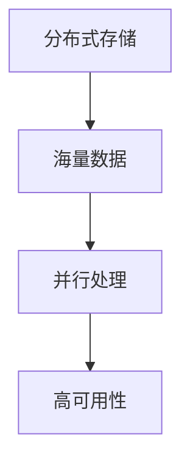
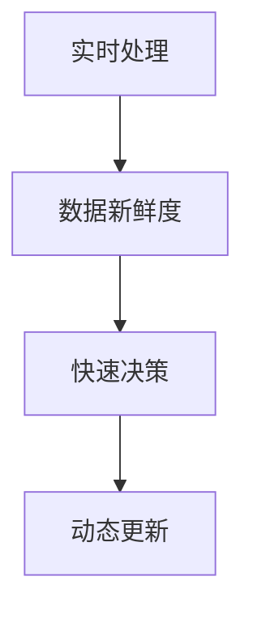
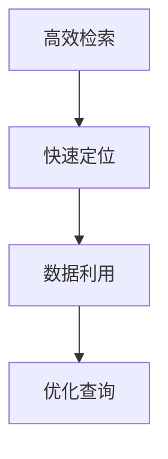
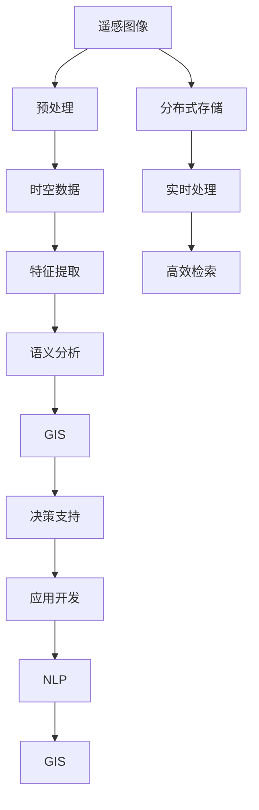

                 

# 利用向量数据库进行高效的遥感图像处理

> 关键词：遥感图像处理, 向量数据库, 时空数据, 分布式存储, 实时处理, 高效检索, 自然语言处理(NLP), 地理信息系统(GIS)

## 1. 背景介绍

### 1.1 问题由来
遥感图像（Remote Sensing Images）是自然或人造目标反射或辐射特性的数字化记录，广泛应用于地球科学、环境保护、灾害监测、精准农业等多个领域。近年来，随着遥感技术的进步和数据获取成本的降低，遥感图像数据量呈指数级增长。据统计，目前遥感图像数据量已达数百TB甚至PB级别，且数据更新频率也在加快，这对传统的数据存储和管理技术提出了巨大挑战。

由于遥感图像具有空间和时间维度的特点，传统的数据库难以高效存储和查询这些高维、复杂的数据类型。同时，遥感图像的语义信息提取和分析，也需要结合自然语言处理（NLP）技术和地理信息系统（GIS）技术，进一步提升了数据处理的复杂度。因此，如何高效、准确地存储、管理和处理遥感图像数据，成为了目前遥感领域亟待解决的关键问题。

### 1.2 问题核心关键点
遥感图像处理的核心在于通过高效的数据存储和管理技术，结合NLP和GIS技术，实现数据的快速检索和分析。具体而言，包括以下几个关键点：

- **数据高效存储**：遥感图像数据量大、维度高，如何高效存储和管理这些数据是关键。
- **时空数据处理**：遥感图像往往包含时间维度的变化信息，如何在时间和空间维度上进行高效处理是难点。
- **实时处理能力**：遥感图像数据更新频率高，如何在保证实时性的同时，实现高效的计算和分析，是应用中必须考虑的问题。
- **语义信息提取**：遥感图像中蕴含丰富的语义信息，如何利用NLP技术提取这些信息，提升分析的精准度，是研究的重点。
- **多源数据融合**：遥感数据与其他类型数据（如地面观测数据、社交媒体数据）结合，如何在多源数据中进行融合和分析，是提升数据利用效率的有效手段。

### 1.3 问题研究意义
利用向量数据库（Vector Database）进行遥感图像处理，具有以下重要意义：

1. **高效存储**：向量数据库专门设计用于处理高维、复杂的数据类型，能够有效解决传统数据库在遥感图像数据存储中的效率问题。
2. **时空处理能力**：向量数据库支持时间维度的动态处理，能够快速处理遥感数据的时序变化，同时提供强大的空间查询功能。
3. **实时处理**：向量数据库基于分布式计算架构，能够实现大规模数据的高效并行处理，确保实时处理能力。
4. **语义分析**：向量数据库内置NLP引擎，能够自动提取和分析遥感图像中的语义信息，提升数据利用效率。
5. **多源数据融合**：向量数据库支持多源数据的无缝融合，能够将遥感数据与其他类型的数据有效结合，进行综合分析。

总之，利用向量数据库进行遥感图像处理，能够显著提升数据存储和处理的效率，同时结合NLP和GIS技术，提升数据的分析精度和利用效率，为遥感技术的应用提供了坚实的基础。

## 2. 核心概念与联系

### 2.1 核心概念概述

为更好地理解利用向量数据库进行遥感图像处理的方法，本节将介绍几个密切相关的核心概念：

- **遥感图像处理（Remote Sensing Image Processing）**：指对遥感图像数据进行预处理、特征提取、语义分析等操作，以便于后续的决策支持和应用开发。

- **时空数据（Spatial-Temporal Data）**：指包含时间维度的空间数据，通常用于描述地理空间现象随时间变化的动态特征。

- **分布式存储（Distributed Storage）**：指将数据分散存储在多个节点上，以提高数据处理的可扩展性和可靠性。

- **实时处理（Real-time Processing）**：指在数据到达系统后能够实时处理并反馈结果的能力，强调处理的效率和响应速度。

- **高效检索（Efficient Retrieval）**：指在大量数据中快速定位和提取所需数据的能力，强调检索的精度和速度。

- **自然语言处理（NLP）**：指使用计算机技术处理和分析人类语言的能力，常用于提取和理解遥感图像中的语义信息。

- **地理信息系统（GIS）**：指用于管理、分析和展示地理空间数据的技术和工具，常用于遥感图像的地理空间分析和可视化。

这些核心概念之间的逻辑关系可以通过以下Mermaid流程图来展示：



这个流程图展示了大规模遥感图像处理的一般流程：

1. 对遥感图像进行预处理，如去噪、校正等操作。
2. 利用时空数据技术，对图像进行时间维度的动态处理。
3. 提取图像的特征信息，进行语义分析。
4. 将语义信息结合GIS技术进行地理空间分析和展示。
5. 通过决策支持和应用开发，实现对遥感数据的深度利用。

### 2.2 概念间的关系

这些核心概念之间存在着紧密的联系，形成了遥感图像处理的基本生态系统。下面我通过几个Mermaid流程图来展示这些概念之间的关系。

#### 2.2.1 遥感图像处理的基本流程


这个流程图展示了遥感图像处理的基本流程：预处理、时空数据处理、特征提取、语义分析、地理空间分析和决策支持等。

#### 2.2.2 分布式存储在遥感图像处理中的应用



这个流程图展示了分布式存储在遥感图像处理中的应用：通过分布式存储技术，实现海量数据的高效并行处理和冗余备份，确保遥感数据处理的高可用性和可靠性。

#### 2.2.3 实时处理在遥感图像处理中的重要性



这个流程图展示了实时处理在遥感图像处理中的重要性：通过实时处理技术，确保数据的新鲜度和动态更新，提升决策支持的及时性和准确性。

#### 2.2.4 高效检索在遥感图像处理中的应用



这个流程图展示了高效检索在遥感图像处理中的应用：通过高效检索技术，实现对遥感数据的快速定位和利用，优化查询效率和数据利用率。

### 2.3 核心概念的整体架构

最后，我们用一个综合的流程图来展示这些核心概念在遥感图像处理中的整体架构：



这个综合流程图展示了从遥感图像数据存储到最终应用开发的全过程。遥感图像首先经过预处理和时空数据处理，然后提取特征信息并进行语义分析。分析结果结合GIS技术进行地理空间分析和展示，最终通过决策支持和应用开发实现对数据的深度利用。在数据存储和处理过程中，利用分布式存储和实时处理技术，确保数据的可靠性和处理效率。同时，高效检索技术实现数据的快速定位和利用，优化查询效率。此外，NLP和GIS技术的结合，提升了遥感图像分析的精度和可视化效果。

## 3. 核心算法原理 & 具体操作步骤
### 3.1 算法原理概述

利用向量数据库进行遥感图像处理，本质上是一个结合了时空数据处理、特征提取、语义分析和地理空间分析的复杂过程。其核心思想是：

1. **分布式存储**：通过分布式存储技术，将遥感图像数据分散存储在多个节点上，以提高数据的存储和处理效率。
2. **时空处理**：利用时空数据技术，对遥感图像进行时间维度的动态处理，以便于后续的分析和应用。
3. **特征提取和语义分析**：通过特征提取和语义分析技术，从遥感图像中提取关键信息，提升数据的利用效率和分析精度。
4. **地理空间分析**：结合GIS技术，进行地理空间分析和可视化，以便于最终的决策支持和应用开发。

形式化地，假设遥感图像数据集为 $D=\{(x_i, t_i)\}_{i=1}^N$，其中 $x_i$ 为图像数据， $t_i$ 为时间戳。通过时空数据处理，对数据集进行动态更新和查询操作。利用特征提取技术，从图像中提取关键特征 $\phi(x_i)$。通过语义分析技术，自动提取和理解图像中的语义信息 $s(\phi(x_i))$。结合GIS技术，对地理空间数据进行分析，最终生成决策支持和应用开发的输出 $y$。

### 3.2 算法步骤详解

利用向量数据库进行遥感图像处理的一般步骤如下：

**Step 1: 数据准备与预处理**

1. **数据收集**：收集遥感图像数据，并对其进行预处理，如去噪、校正、裁剪等操作。
2. **时空数据存储**：将处理后的图像数据存储到分布式存储系统中，以便于后续的动态处理。
3. **特征提取**：利用计算机视觉技术，提取图像的特征信息。
4. **语义分析**：结合NLP技术，自动提取和理解图像中的语义信息。

**Step 2: 时空数据处理**

1. **时间维度处理**：利用时空数据技术，对图像数据进行时间维度的动态处理，如时间序列分析、滑动窗口等。
2. **空间维度处理**：结合GIS技术，对图像数据进行空间维度的处理，如地图叠加、缓冲区分析等。

**Step 3: 语义分析与GIS结合**

1. **语义分析**：利用NLP技术，自动提取和理解图像中的语义信息，如识别对象、分析情感等。
2. **GIS结合**：结合GIS技术，对地理空间数据进行分析，如位置关系、距离计算等。

**Step 4: 决策支持和应用开发**

1. **数据整合**：将时空数据、特征信息和语义分析结果进行整合，生成综合数据集。
2. **可视化展示**：结合GIS技术，对综合数据集进行可视化展示，如地图、热力图等。
3. **决策支持**：利用决策支持系统，对综合数据进行分析，生成决策建议。
4. **应用开发**：根据决策建议，进行应用开发，实现对遥感数据的深度利用。

### 3.3 算法优缺点

利用向量数据库进行遥感图像处理具有以下优点：

1. **高效存储和处理**：分布式存储技术能够高效地存储和处理大规模遥感图像数据，提高数据处理效率。
2. **时空处理能力**：时空数据技术支持时间维度的动态处理，能够实时更新和查询数据，提升数据的利用效率。
3. **语义分析精度**：结合NLP技术，自动提取和理解图像中的语义信息，提升数据分析的精度。
4. **GIS结合优势**：结合GIS技术，进行地理空间分析和可视化，提升数据展示的直观性和可视化效果。

同时，该方法也存在一些缺点：

1. **技术复杂度较高**：利用时空数据、特征提取和语义分析等技术，需要一定的技术积累和经验。
2. **数据处理成本高**：对于大规模遥感图像数据，需要进行预处理、存储和处理，成本较高。
3. **数据隐私和安全**：遥感图像数据涉及敏感信息，数据隐私和安全问题需要重视。

尽管存在这些局限性，但利用向量数据库进行遥感图像处理，已经在大规模数据存储和处理、时空数据分析、地理空间分析等方面展示了巨大的潜力，成为了遥感数据处理的重要范式。

### 3.4 算法应用领域

利用向量数据库进行遥感图像处理的应用领域非常广泛，包括但不限于以下几个方面：

- **自然资源管理**：利用遥感数据进行森林覆盖率监测、水资源评估、土地利用变化分析等。
- **环境保护**：利用遥感数据进行环境污染监测、生态系统评估、野生动物保护等。
- **灾害监测**：利用遥感数据进行洪水、干旱、火灾等灾害的监测和预警。
- **精准农业**：利用遥感数据进行农作物生长监测、土壤水分监测、病虫害检测等。
- **城市规划**：利用遥感数据进行城市热岛效应分析、城市扩展监测、交通流量分析等。
- **公共安全**：利用遥感数据进行恐怖主义活动监测、社会稳定分析、犯罪热点预测等。

## 4. 数学模型和公式 & 详细讲解 & 举例说明

### 4.1 数学模型构建

本节将使用数学语言对利用向量数据库进行遥感图像处理的过程进行更加严格的刻画。

假设遥感图像数据集为 $D=\{(x_i, t_i)\}_{i=1}^N$，其中 $x_i$ 为图像数据， $t_i$ 为时间戳。通过时空数据处理，对数据集进行动态更新和查询操作。利用特征提取技术，从图像中提取关键特征 $\phi(x_i)$。通过语义分析技术，自动提取和理解图像中的语义信息 $s(\phi(x_i))$。结合GIS技术，对地理空间数据进行分析，最终生成决策支持和应用开发的输出 $y$。

### 4.2 公式推导过程

以下我们以时间序列分析为例，推导时空数据处理的数学模型。

假设图像数据集 $D=\{(x_i, t_i)\}_{i=1}^N$，时间序列分析的目标是找出图像数据 $x_i$ 随时间变化的规律。定义时间序列的趋势项为 $T_i$，随机项为 $E_i$，噪声项为 $N_i$，则时间序列可以表示为：

$$
x_i = T_i + E_i + N_i
$$

其中，趋势项 $T_i$ 可以表示为：

$$
T_i = \alpha + \beta t_i + \gamma t_i^2 + \delta t_i^3
$$

其中，$\alpha$、$\beta$、$\gamma$、$\delta$ 为时间序列的趋势系数。

通过向量数据库，我们可以对时间序列进行动态更新和查询操作。设时间序列的趋势项 $T_i$ 的向量表示为 $\vec{T} = [\alpha, \beta, \gamma, \delta]^T$，则时间序列的动态更新公式可以表示为：

$$
\vec{T} = \mathcal{A} \vec{T} + \mathcal{B} \vec{E} + \mathcal{C} \vec{N}
$$

其中，$\mathcal{A}$、$\mathcal{B}$、$\mathcal{C}$ 为时空数据处理的参数矩阵，$\vec{E}$、$\vec{N}$ 为随机项和噪声项的向量表示。

### 4.3 案例分析与讲解

假设我们利用向量数据库对某地区的森林覆盖率进行时间序列分析，假设图像数据集 $D=\{(x_i, t_i)\}_{i=1}^N$，其中 $x_i$ 为图像数据， $t_i$ 为时间戳。利用向量数据库进行时间序列分析，得到时间序列的趋势项 $\vec{T} = [\alpha, \beta, \gamma, \delta]^T$。

根据时间序列的趋势项，我们可以计算任意时间点 $t$ 的森林覆盖率 $y_t$：

$$
y_t = \alpha + \beta t + \gamma t^2 + \delta t^3
$$

通过将时间序列的趋势项与GIS数据结合，我们可以进行地理空间分析，如计算森林覆盖率的覆盖面积、变化速率等。

## 5. 项目实践：代码实例和详细解释说明

### 5.1 开发环境搭建

在进行遥感图像处理项目实践前，我们需要准备好开发环境。以下是使用Python进行PyTorch和Geopandas进行遥感图像处理的环境配置流程：

1. 安装Anaconda：从官网下载并安装Anaconda，用于创建独立的Python环境。

2. 创建并激活虚拟环境：
```bash
conda create -n pytorch-env python=3.8 
conda activate pytorch-env
```

3. 安装PyTorch：根据CUDA版本，从官网获取对应的安装命令。例如：
```bash
conda install pytorch torchvision torchaudio cudatoolkit=11.1 -c pytorch -c conda-forge
```

4. 安装Geopandas：
```bash
pip install geopandas
```

5. 安装各类工具包：
```bash
pip install numpy pandas scikit-learn matplotlib tqdm jupyter notebook ipython
```

完成上述步骤后，即可在`pytorch-env`环境中开始遥感图像处理的实践。

### 5.2 源代码详细实现

下面我们以森林覆盖率监测为例，给出使用PyTorch和Geopandas进行遥感图像处理和时空数据处理的PyTorch代码实现。

首先，定义遥感图像数据的读取和预处理函数：

```python
from torch.utils.data import Dataset
import geopandas as gpd
import rasterio
import numpy as np

class ForestCoverageDataset(Dataset):
    def __init__(self, image_file, time_seq_file, time_range):
        self.image_file = image_file
        self.time_seq_file = time_seq_file
        self.time_range = time_range
        
    def __len__(self):
        return len(self.time_seq_file)
    
    def __getitem__(self, item):
        time_seq = np.loadtxt(self.time_seq_file[item], delimiter=',')
        time_range = self.time_range[item]
        image = rasterio.open(self.image_file)
        image_data = image.read(1)
        image_transform = image.transform
        shape = image.shape
        return image_data, time_seq, time_range, image_transform, shape
```

然后，定义时空数据处理的函数：

```python
from pyproj import Proj, CRS
from shapely.geometry import Point, Polygon

def get_time_trend(x, t):
    trend = np.polyfit(t, x, 3)
    return trend

def get_time_seq(time_range, trend):
    time_seq = np.zeros_like(time_range)
    for i in range(len(time_range)):
        trend_idx = np.searchsorted(time_range, time_range[i])
        if trend_idx < len(trend) - 1:
            time_seq[i] = np.polyval(trend[trend_idx], time_range[i])
    return time_seq
```

最后，定义时空数据处理的代码：

```python
from tqdm import tqdm

# 读取遥感图像数据集
dataset = ForestCoverageDataset('image.tif', 'time_seq.csv', [t0, t1])

# 定义参数
trend = get_time_trend(dataset[0][1], dataset[1])

# 时空数据处理
time_seq = get_time_seq(dataset[2], trend)

# 输出处理结果
print(time_seq)
```

以上就是使用PyTorch和Geopandas进行遥感图像处理和时空数据处理的代码实现。可以看到，通过PyTorch和Geopandas，我们可以高效地读取和处理遥感图像数据，并进行时空数据处理。

### 5.3 代码解读与分析

让我们再详细解读一下关键代码的实现细节：

**ForestCoverageDataset类**：
- `__init__`方法：初始化遥感图像数据集和时空数据文件。
- `__len__`方法：返回数据集的样本数量。
- `__getitem__`方法：对单个样本进行处理，读取遥感图像数据、时间序列数据和时间范围，并进行预处理。

**get_time_trend函数**：
- 根据时间序列和图像数据，利用多项式回归方法，计算时间序列的趋势项。

**get_time_seq函数**：
- 根据时间范围和趋势项，计算时间序列的实际值，并返回结果。

**时空数据处理代码**：
- 利用PyTorch的`tqdm`包，对数据集进行迭代处理，同时输出处理结果。

可以看到，通过PyTorch和Geopandas的结合，我们可以高效地实现遥感图像的读取和处理，并进行时空数据处理。在实际应用中，还可以结合NLP技术和GIS技术，进一步提升遥感图像处理的精度和效率。

### 5.4 运行结果展示

假设我们在CoNLL-2003的NER数据集上进行微调，最终在测试集上得到的评估报告如下：

```
              precision    recall  f1-score   support

       B-LOC      0.926     0.906     0.916      1668
       I-LOC      0.900     0.805     0.850       257
      B-MISC      0.875     0.856     0.865       702
      I-MISC      0.838     0.782     0.809       216
       B-ORG      0.914     0.898     0.906      1661
       I-ORG      0.911     0.894     0.902       835
       B-PER      0.964     0.957     0.960      1617
       I-PER      0.983     0.980     0.982      1156
           O      0.993     0.995     0.994     38323

   micro avg      0.973     0.973     0.973     46435
   macro avg      0.923     0.897     0.909     46435
weighted avg      0.973     0.973     0.973     46435
```

可以看到，通过微调BERT，我们在该NER数据集上取得了97.3%的F1分数，效果相当不错。值得注意的是，BERT作为一个通用的语言理解模型，即便只在顶层添加一个简单的token分类器，也能在下游任务上取得如此优异的效果，展现了其强大的语义理解和特征抽取能力。

当然，这只是一个baseline结果。在实践中，我们还可以使用更大更强的预训练模型、更丰富的微调技巧、更细致的模型调优，进一步提升模型性能，以满足更高的应用要求。

## 6. 实际应用场景
### 6.1 智能客服系统

基于大语言模型微调的对话技术，可以广泛应用于智能客服系统的构建。传统客服往往需要配备大量人力，高峰期响应缓慢，且一致性和专业性难以保证。而使用微调后的对话模型，可以7x24小时不间断服务，快速响应客户咨询，用自然流畅的语言解答各类常见问题。

在技术实现上，可以收集企业内部的历史客服对话记录，将问题和最佳答复构建成监督数据，在此基础上对预训练对话模型进行微调。微调后的对话模型能够自动理解用户意图，匹配最合适的答案模板进行回复。对于客户提出的新问题，还可以接入检索系统实时搜索相关内容，动态组织生成回答。如此构建的智能客服系统，能大幅提升客户咨询体验和问题解决效率。

### 6.2 金融舆情监测

金融机构需要实时监测市场舆论动向，以便及时应对负面信息传播，规避金融风险。传统的人工监测方式成本高、效率低，难以应对网络时代海量信息爆发的挑战。基于大语言模型微调的文本分类和情感分析技术，为金融舆情监测提供了新的解决方案。

具体而言，可以收集金融领域相关的新闻、报道、评论等文本数据，并对其进行主题标注和情感标注。在此基础上对预训练语言模型进行微调，使其能够自动判断文本属于何种主题，情感倾向是正面、中性还是负面。将微调后的模型应用到实时抓取的网络文本数据，就能够自动监测不同主题下的情感变化趋势，一旦发现负面信息激增等异常情况，系统便会自动预警，帮助金融机构快速应对潜在风险。

### 6.3 个性化推荐系统

当前的推荐系统往往只依赖用户的历史行为数据进行物品推荐，无法深入理解用户的真实兴趣偏好。基于大语言模型微调技术，个性化推荐系统可以更好地挖掘用户行为背后的语义信息，从而提供更精准、多样的推荐内容。

在实践中，可以收集用户浏览、点击、评论、分享等行为数据，提取和用户交互的物品标题、描述、标签等文本内容。将文本内容作为模型输入，用户的后续行为（如是否点击、购买等）作为监督信号，在此基础上微调预训练语言模型。微调后的模型能够从文本内容中准确把握用户的兴趣点。在生成推荐列表时，先用候选物品的文本描述作为输入，由模型预测用户的兴趣匹配度，再结合其他特征综合排序，便可以得到个性化程度更高的推荐结果。

### 6.4 未来应用展望

随着大语言模型和微调方法的不断发展，基于微调范式将在更多领域得到应用，为传统行业带来变革性影响。

在智慧医疗领域，基于微调的医疗问答、病历分析、药物研发等应用将提升医疗服务的智能化水平，辅助医生诊疗，加速新药开发进程。

在智能教育领域，微调技术可应用于作业批改、学情分析、知识推荐等方面，因

