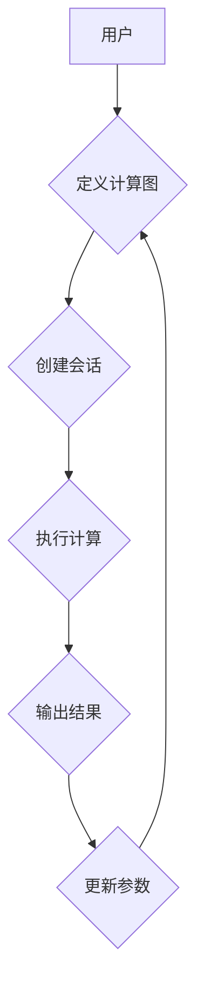

## 深度学习框架原理与代码实战案例讲解

> 关键词：深度学习框架，TensorFlow，PyTorch，框架原理，神经网络，机器学习

## 1. 背景介绍

深度学习近年来取得了令人瞩目的成就，在图像识别、自然语言处理、语音识别等领域展现出强大的应用潜力。深度学习框架作为深度学习开发的基石，为研究人员和开发者提供了高效、便捷的工具，加速了深度学习的普及和应用。

本文将深入探讨深度学习框架的原理和架构，以 TensorFlow 和 PyTorch 为例，详细讲解其核心算法、数学模型、代码实现以及实际应用场景。通过对框架原理的理解和代码实战的体验，读者能够掌握深度学习框架的基本知识和应用技能，为深入学习和应用深度学习打下坚实基础。

## 2. 核心概念与联系

深度学习框架的核心概念包括：

* **计算图:**  深度学习模型的计算过程可以表示为一个图结构，其中节点代表运算，边代表数据流。计算图提供了一种高效的表示和执行深度学习模型的方法。
* **张量:**  张量是深度学习框架的基本数据结构，可以表示多维数组。张量操作是深度学习模型的核心运算，包括加、减、乘、除、矩阵乘法等。
* **自动微分:**  自动微分是深度学习框架的重要特性，它可以自动计算张量的梯度，为模型参数的更新提供依据。
* **会话:**  会话是深度学习框架执行计算图的执行环境。在会话中，可以定义变量、执行操作和更新参数。

**框架架构:**



## 3. 核心算法原理 & 具体操作步骤

### 3.1  算法原理概述

深度学习框架的核心算法是基于梯度下降的优化算法，其目标是找到使模型损失函数最小的模型参数。常见的优化算法包括：

* **梯度下降法:**  根据损失函数的梯度方向更新模型参数。
* **动量法:**  引入动量项，加速参数更新，避免局部最优。
* **Adam 优化器:**  结合动量法和自适应学习率，提高收敛速度和稳定性。

### 3.2  算法步骤详解

1. **初始化模型参数:**  随机初始化模型参数。
2. **前向传播:**  将输入数据通过计算图传递，得到模型输出。
3. **计算损失函数:**  比较模型输出与真实值之间的差异，计算损失函数值。
4. **反向传播:**  根据损失函数的梯度，反向传播计算梯度信息，更新模型参数。
5. **重复步骤 2-4:**  迭代执行前向传播和反向传播，直到损失函数收敛。

### 3.3  算法优缺点

**优点:**

* **高效:**  利用自动微分和并行计算，提高训练速度。
* **灵活:**  支持各种模型结构和优化算法。
* **易用:**  提供简洁的API，方便开发者使用。

**缺点:**

* **参数量大:**  深度学习模型参数量大，需要大量数据进行训练。
* **训练时间长:**  训练深度学习模型需要较长的训练时间。
* **容易过拟合:**  如果训练数据不足，模型容易过拟合。

### 3.4  算法应用领域

深度学习算法广泛应用于：

* **图像识别:**  人脸识别、物体检测、图像分类。
* **自然语言处理:**  机器翻译、文本摘要、情感分析。
* **语音识别:**  语音转文本、语音助手。
* **推荐系统:**  商品推荐、内容推荐。

## 4. 数学模型和公式 & 详细讲解 & 举例说明

### 4.1  数学模型构建

深度学习模型通常由多个神经网络层组成，每一层包含多个神经元。每个神经元接收来自上一层的输入，经过激活函数处理后输出到下一层。

**神经网络层:**

* **输入层:**  接收原始数据。
* **隐藏层:**  进行特征提取和表示学习。
* **输出层:**  输出模型预测结果。

**激活函数:**

激活函数用于引入非线性，使神经网络能够学习复杂的数据模式。常见的激活函数包括：

* **ReLU (Rectified Linear Unit):**  f(x) = max(0, x)
* **Sigmoid:**  f(x) = 1 / (1 + exp(-x))
* **Tanh (Hyperbolic tangent):**  f(x) = (exp(x) - exp(-x)) / (exp(x) + exp(-x))

### 4.2  公式推导过程

**损失函数:**

损失函数用于衡量模型预测结果与真实值的差异。常见的损失函数包括：

* **均方误差 (MSE):**  L = (y - y')^2
* **交叉熵损失 (Cross-entropy loss):**  L = -sum(y * log(y'))

**梯度下降法:**

梯度下降法更新模型参数的公式为:

```latex
\theta = \theta - \alpha \nabla L(\theta)
```

其中:

* $\theta$ 是模型参数
* $\alpha$ 是学习率
* $\nabla L(\theta)$ 是损失函数对参数 $\theta$ 的梯度

### 4.3  案例分析与讲解

**图像分类:**

假设我们有一个图像分类模型，用于识别猫和狗的图片。模型的输入是图像像素值，输出是猫和狗的概率。

* **损失函数:**  可以使用交叉熵损失函数，衡量模型预测结果与真实标签之间的差异。
* **梯度下降法:**  使用梯度下降法更新模型参数，使损失函数最小化。
* **训练数据:**  需要大量的猫和狗图片进行训练，以便模型学习识别猫和狗的特征。

## 5. 项目实践：代码实例和详细解释说明

### 5.1  开发环境搭建

* **Python:**  深度学习框架通常基于 Python 开发。
* **TensorFlow/PyTorch:**  选择合适的深度学习框架。
* **GPU:**  使用 GPU 可以显著加速深度学习模型的训练。

### 5.2  源代码详细实现

以下是一个使用 TensorFlow 实现简单的图像分类模型的代码示例:

```python
import tensorflow as tf

# 定义模型结构
model = tf.keras.models.Sequential([
  tf.keras.layers.Flatten(input_shape=(28, 28)),
  tf.keras.layers.Dense(128, activation='relu'),
  tf.keras.layers.Dense(10, activation='softmax')
])

# 编译模型
model.compile(optimizer='adam',
              loss='sparse_categorical_crossentropy',
              metrics=['accuracy'])

# 训练模型
model.fit(x_train, y_train, epochs=5)

# 评估模型
loss, accuracy = model.evaluate(x_test, y_test)
print('Test loss:', loss)
print('Test accuracy:', accuracy)
```

### 5.3  代码解读与分析

* **模型结构:**  模型由两层全连接层组成，第一层 Flatten 层将图像数据转换为一维向量，第二层 Dense 层具有 128 个神经元和 ReLU 激活函数，第三层 Dense 层具有 10 个神经元和 Softmax 激活函数，用于输出 10 个类别概率。
* **编译模型:**  使用 Adam 优化器、交叉熵损失函数和精度作为评估指标。
* **训练模型:**  使用训练数据训练模型 5 个 epochs。
* **评估模型:**  使用测试数据评估模型的性能。

### 5.4  运行结果展示

训练完成后，可以查看模型的测试损失和精度。

## 6. 实际应用场景

深度学习框架广泛应用于各种实际场景，例如：

* **图像识别:**  自动驾驶、人脸识别、医疗影像分析。
* **自然语言处理:**  机器翻译、文本摘要、聊天机器人。
* **语音识别:**  语音助手、语音搜索。
* **推荐系统:**  商品推荐、内容推荐。

### 6.4  未来应用展望

随着深度学习技术的不断发展，深度学习框架将在更多领域得到应用，例如：

* **药物研发:**  加速药物发现和开发。
* **材料科学:**  设计新型材料。
* **金融科技:**  风险管理、欺诈检测。

## 7. 工具和资源推荐

### 7.1  学习资源推荐

* **TensorFlow 官方文档:**  https://www.tensorflow.org/
* **PyTorch 官方文档:**  https://pytorch.org/
* **深度学习书籍:**  《深度学习》、《动手学深度学习》

### 7.2  开发工具推荐

* **Jupyter Notebook:**  交互式编程环境。
* **VS Code:**  代码编辑器。
* **TensorBoard:**  TensorFlow 可视化工具。

### 7.3  相关论文推荐

* **AlexNet:**  https://papers.nips.cc/paper/4824-imagenet-classification-with-deep-convolutional-neural-networks.pdf
* **ResNet:**  https://arxiv.org/abs/1512.03385
* **BERT:**  https://arxiv.org/abs/1810.04805

## 8. 总结：未来发展趋势与挑战

### 8.1  研究成果总结

深度学习框架的发展取得了显著成果，为深度学习的普及和应用提供了强大的工具。

### 8.2  未来发展趋势

* **模型效率:**  提高模型训练速度和推理效率。
* **模型可解释性:**  增强模型的透明度和可解释性。
* **模型安全:**  提高模型的鲁棒性和安全性。

### 8.3  面临的挑战

* **数据获取:**  深度学习模型需要大量数据进行训练，数据获取仍然是一个挑战。
* **计算资源:**  深度学习模型训练需要大量的计算资源，成本较高。
* **伦理问题:**  深度学习模型的应用可能带来伦理问题，需要谨慎考虑。

### 8.4  研究展望

未来，深度学习框架将继续朝着更高效、更可解释、更安全的方向发展，为人工智能的进步做出更大的贡献。

## 9. 附录：常见问题与解答

* **Q: TensorFlow 和 PyTorch 的区别是什么？**

* **A:** TensorFlow 和 PyTorch 都是流行的深度学习框架，但它们在设计理念和使用方式上有所不同。TensorFlow 更侧重于生产环境部署，而 PyTorch 更灵活，更适合研究和开发。

* **Q: 如何选择合适的深度学习框架？**

* **A:** 选择深度学习框架需要根据具体项目需求和个人偏好。如果需要部署到生产环境，可以选择 TensorFlow；如果需要进行快速原型开发和研究，可以选择 PyTorch。

* **Q: 如何学习深度学习框架？**

* **A:** 可以参考官方文档、书籍和在线课程学习深度学习框架。


作者：禅与计算机程序设计艺术 / Zen and the Art of Computer Programming 
