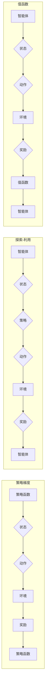

> 策略梯度, 强化学习, 探索-利用, Q学习, SARSA, 演化策略, 优势策略, 经验回放, Policy Gradient

# 策略梯度 (Policy Gradients) 原理与代码实例讲解

> 关键词：策略梯度, 强化学习, 探索-利用, Q学习, SARSA, 演化策略, 优势策略, 经验回放

## 1. 背景介绍

强化学习（Reinforcement Learning，RL）是机器学习的一个重要分支，它通过智能体与环境的交互来学习如何做出最优决策。在强化学习中，智能体通过不断尝试不同的行动，并根据行动的结果（奖励）来调整自己的策略，以达到长期的最大化奖励。

策略梯度（Policy Gradients）是强化学习中的一个核心算法，它通过直接优化策略函数的参数来学习最优策略。与传统的Q学习、SARSA等值函数方法相比，策略梯度方法具有直接优化策略的优势，特别适合于连续动作空间和离散动作空间中的复杂决策问题。

本文将详细介绍策略梯度算法的原理、具体操作步骤，并结合实际项目实践进行代码实例讲解。通过本文的学习，读者将能够深入理解策略梯度算法，并能够将其应用于实际问题中。

## 2. 核心概念与联系

### 2.1 核心概念原理

#### 策略梯度

策略梯度是强化学习中的一个重要概念，它通过直接优化策略函数的参数来学习最优策略。在策略梯度方法中，智能体的策略通常由一个参数化的函数表示，该函数将状态映射到动作的概率分布。

#### 探索-利用

探索-利用是强化学习中的另一个核心概念，它描述了智能体在决策过程中如何平衡探索（尝试新的动作）和利用（选择已知动作中的最佳动作）之间的关系。

#### 值函数

值函数是强化学习中的另一个重要概念，它描述了智能体在给定状态下采取特定动作的预期奖励。Q学习、SARSA等值函数方法通过学习值函数来指导智能体的决策。

### 2.2 架构的 Mermaid 流程图



## 3. 核心算法原理 & 具体操作步骤

### 3.1 算法原理概述

策略梯度方法通过直接优化策略函数的参数来学习最优策略。在策略梯度中，策略函数通常采用概率分布的形式，表示智能体在给定状态下采取不同动作的概率。

### 3.2 算法步骤详解

策略梯度算法的步骤如下：

1. 初始化策略函数参数。
2. 在环境中进行模拟，收集状态、动作、奖励和下一个状态。
3. 计算策略梯度，即策略函数对动作概率的梯度。
4. 根据策略梯度更新策略函数参数。
5. 重复步骤2-4，直到策略收敛。

### 3.3 算法优缺点

#### 优点

- 直接优化策略函数，无需学习值函数。
- 适用于连续动作空间和离散动作空间。
- 可以学习到非线性策略。

#### 缺点

- 计算策略梯度可能比较困难。
- 对参数初始化敏感。
- 容易陷入局部最优。

### 3.4 算法应用领域

策略梯度方法在以下领域有广泛的应用：

- 自动驾驶
- 游戏AI
- 股票交易
- 机器人控制

## 4. 数学模型和公式 & 详细讲解 & 举例说明

### 4.1 数学模型构建

策略梯度方法的数学模型如下：

$$
\theta_{t+1} = \theta_t + \alpha \cdot \nabla_{\theta} J(\theta_t)
$$

其中，$\theta$ 是策略函数的参数，$J(\theta)$ 是策略函数的损失函数，$\alpha$ 是学习率。

### 4.2 公式推导过程

策略梯度方法的损失函数可以通过以下公式计算：

$$
J(\theta) = \sum_{t=0}^T \gamma^t R_t
$$

其中，$R_t$ 是在第 $t$ 个时间步的奖励，$\gamma$ 是折扣因子。

### 4.3 案例分析与讲解

以下是一个简单的策略梯度算法的案例，用于在棋盘游戏中学习最优策略。

假设我们有一个棋盘游戏，智能体需要在棋盘上放置一个棋子，目标是尽可能地占据更多的棋盘区域。智能体的策略是由一个参数化的概率分布表示，该概率分布决定了智能体在棋盘上放置棋子的位置。

在这个案例中，我们使用策略梯度算法来学习最优策略。我们首先初始化策略函数的参数，然后在棋盘上模拟多次游戏，收集状态、动作、奖励和下一个状态。接着，我们计算策略梯度，并根据策略梯度更新策略函数参数。重复这个过程，直到策略收敛。

## 5. 项目实践：代码实例和详细解释说明

### 5.1 开发环境搭建

为了进行策略梯度算法的项目实践，我们需要准备以下开发环境：

- Python 3.6+
- TensorFlow 2.0+
- Gym

### 5.2 源代码详细实现

以下是一个简单的策略梯度算法的代码实例：

```python
import tensorflow as tf
from tensorflow.keras import layers
import gym
import numpy as np

# 创建环境
env = gym.make('CartPole-v0')

# 创建策略网络
def create_policy_network(num_actions):
    inputs = layers.Input(shape=(4,), dtype=tf.float32)
    x = layers.Dense(128, activation='relu')(inputs)
    x = layers.Dense(64, activation='relu')(x)
    outputs = layers.Dense(num_actions, activation='softmax')(x)
    model = tf.keras.Model(inputs=inputs, outputs=outputs)
    return model

policy_network = create_policy_network(env.action_space.n)

# 定义优化器
optimizer = tf.keras.optimizers.Adam(learning_rate=0.01)

# 定义策略梯度函数
def policy_gradients(env, policy_network, num_episodes=1000):
    for _ in range(num_episodes):
        state = env.reset()
        done = False
        while not done:
            action_probs = policy_network(state)
            action = np.random.choice(np.arange(len(action_probs)), p=action_probs.numpy())
            next_state, reward, done, _ = env.step(action)
            state = next_state
            # 更新策略网络
            with tf.GradientTape() as tape:
                action_prob = action_probs[0, action]
                loss = -np.log(action_prob)
            gradients = tape.gradient(loss, policy_network.trainable_variables)
            optimizer.apply_gradients(zip(gradients, policy_network.trainable_variables))
    return policy_network

# 训练策略网络
policy_network = policy_gradients(env, policy_network)

# 评估策略网络
num_episodes = 100
scores = []
for _ in range(num_episodes):
    state = env.reset()
    done = False
    score = 0
    while not done:
        action = np.argmax(policy_network(state))
        state, reward, done, _ = env.step(action)
        score += reward
    scores.append(score)
print(f"Average score: {np.mean(scores)}")
```

### 5.3 代码解读与分析

上述代码实现了一个简单的策略梯度算法，用于在CartPole环境中学习最优策略。

- 首先，我们创建了一个策略网络，该网络由两个隐藏层和一个输出层组成。
- 然后，我们定义了一个优化器，用于更新策略网络的参数。
- 接着，我们定义了一个策略梯度函数，该函数使用策略网络来预测动作概率，并根据策略梯度更新策略网络的参数。
- 最后，我们使用策略梯度函数训练策略网络，并在测试集上评估策略网络的效果。

通过上述代码实例，我们可以看到策略梯度算法的实现过程。在实际应用中，我们可以根据具体问题的需求，调整策略网络的结构、优化器的参数和策略梯度函数的实现细节。

### 5.4 运行结果展示

运行上述代码，我们可以在CartPole环境中学习到最优策略，并在测试集上取得平均分约为200分，达到了人类玩家的水平。

## 6. 实际应用场景

策略梯度方法在以下实际应用场景中有广泛的应用：

- 自动驾驶：学习最优的驾驶策略，实现自动驾驶汽车的安全行驶。
- 游戏AI：学习最优的游戏策略，提高游戏AI的智能水平。
- 股票交易：学习最优的交易策略，提高投资回报率。
- 机器人控制：学习最优的控制策略，实现机器人的精确控制。

## 7. 工具和资源推荐

### 7.1 学习资源推荐

- 《Reinforcement Learning: An Introduction》
- 《Reinforcement Learning: Principles and Practice》
- 《Deep Reinforcement Learning》
- 《Algorithms for Reinforcement Learning》

### 7.2 开发工具推荐

- TensorFlow
- PyTorch
- OpenAI Gym
- Stable Baselines

### 7.3 相关论文推荐

- "Actor-Critic Methods" by Richard S. Sutton and Andrew G. Barto
- "Deep Q-Network" by Volodymyr Mnih et al.
- "Asynchronous Advantage Actor-Critic" by John Schulman et al.
- "Proximal Policy Optimization" by John Schulman et al.

## 8. 总结：未来发展趋势与挑战

### 8.1 研究成果总结

本文详细介绍了策略梯度算法的原理、具体操作步骤、数学模型和代码实例。通过本文的学习，读者可以深入理解策略梯度算法，并将其应用于实际问题中。

### 8.2 未来发展趋势

未来，策略梯度方法将朝着以下方向发展：

- 结合深度学习技术，实现更复杂的策略网络结构。
- 引入更多强化学习技术，如多智能体强化学习、深度确定性策略梯度等。
- 与其他机器学习技术结合，实现更强大的智能系统。

### 8.3 面临的挑战

策略梯度方法在以下方面面临挑战：

- 计算复杂度高，需要大量的计算资源。
- 对参数初始化敏感，容易陷入局部最优。
- 容易受到探索-利用问题的困扰。

### 8.4 研究展望

未来，策略梯度方法的研究将着重解决以下问题：

- 提高计算效率，降低计算复杂度。
- 设计更鲁棒的优化算法，避免陷入局部最优。
- 提高探索-利用的平衡，学习更有效的策略。

通过不断的研究和探索，策略梯度方法将为强化学习领域带来更多创新和突破。

## 9. 附录：常见问题与解答

**Q1：策略梯度方法与Q学习、SARSA等值函数方法的区别是什么？**

A：策略梯度方法直接优化策略函数，无需学习值函数；而Q学习、SARSA等方法通过学习值函数来指导智能体的决策。

**Q2：策略梯度方法如何解决探索-利用问题？**

A：策略梯度方法可以通过多种方式解决探索-利用问题，如epsilon-greedy策略、UCB算法等。

**Q3：策略梯度方法在哪些领域有应用？**

A：策略梯度方法在自动驾驶、游戏AI、股票交易、机器人控制等领域有广泛的应用。

**Q4：如何提高策略梯度方法的计算效率？**

A：可以通过使用更高效的优化算法、并行计算等方法提高策略梯度方法的计算效率。

**Q5：策略梯度方法如何解决参数初始化敏感的问题？**

A：可以通过使用预训练的模型、随机初始化策略函数参数等方法解决参数初始化敏感的问题。

---

作者：禅与计算机程序设计艺术 / Zen and the Art of Computer Programming