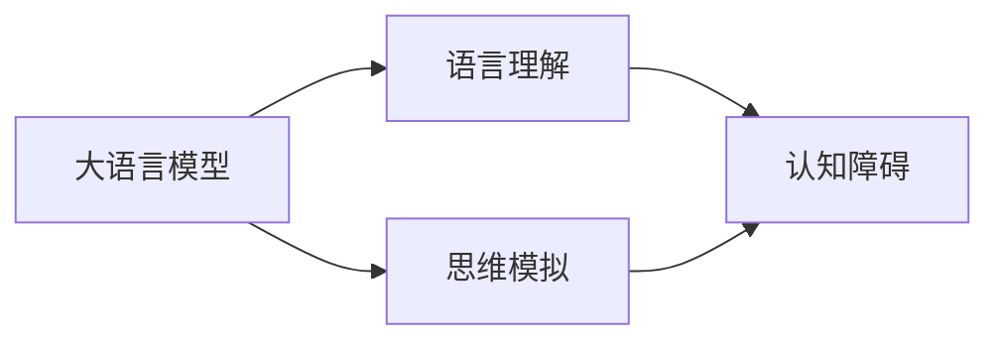

# 语言≠思维：大模型的认知障碍

> 关键词：大模型，认知障碍，语言理解，自然语言处理，思维模拟，人工智能

## 1. 背景介绍

随着深度学习技术的飞速发展，大语言模型（Large Language Models, LLMs）如BERT、GPT-3等在自然语言处理（Natural Language Processing, NLP）领域取得了显著的进展。这些模型在理解、生成和翻译自然语言方面展现出了惊人的能力，似乎正在向人类思维的模拟迈进。然而，在看似光鲜亮丽的成就背后，大模型存在一系列认知障碍，这些障碍限制了它们在理解复杂思维和执行高级认知任务方面的能力。本文将探讨大模型的认知障碍，分析其根源，并展望未来可能的解决方案。

## 2. 核心概念与联系

### 2.1 大语言模型

大语言模型是通过在大量文本数据上预训练的深度神经网络，能够理解、生成和翻译自然语言。它们通常由多层神经网络组成，包括编码器和解码器，能够处理文本的编码和解码。

### 2.2 语言理解

语言理解是指模型对自然语言文本的语义、语法和上下文的理解能力。大模型在语言理解方面表现出色，但仍然存在局限性。

### 2.3 思维模拟

思维模拟是指模型能够模拟人类思维过程的能力，包括推理、决策、解决问题等。

### 2.4 认知障碍

认知障碍是指模型在执行认知任务时遇到的限制或困难。

以下是上述概念之间的Mermaid流程图：



## 3. 核心算法原理 & 具体操作步骤

### 3.1 算法原理概述

大语言模型的算法原理基于深度神经网络，特别是Transformer架构。它们通过多层编码器和解码器，以及注意力机制，对文本进行编码和解码，以实现语言理解和生成。

### 3.2 算法步骤详解

1. **数据预处理**：对文本数据进行清洗、分词、编码等预处理操作。
2. **预训练**：在大量的无标签文本数据上进行预训练，使模型学习到通用的语言表示。
3. **微调**：在标注数据集上进行微调，以适应特定任务。
4. **推理**：使用训练好的模型对新的文本数据进行处理，生成相应的输出。

### 3.3 算法优缺点

#### 优点：

- **强大的语言理解能力**：能够理解复杂的语言结构和语义。
- **高效**：能够快速处理大量文本数据。
- **可扩展**：可以通过微调适应不同的任务。

#### 缺点：

- **缺乏上下文理解**：难以理解长距离的上下文关系。
- **易受欺骗**：容易被诱导产生错误的输出。
- **难以解释**：其决策过程难以解释。

### 3.4 算法应用领域

大语言模型在多个领域都有广泛的应用，包括：

- **问答系统**：如Siri、Alexa等。
- **机器翻译**：如Google Translate、Microsoft Translator等。
- **文本摘要**：自动生成文本的摘要。
- **对话系统**：如聊天机器人、虚拟助手等。

## 4. 数学模型和公式 & 详细讲解 & 举例说明

### 4.1 数学模型构建

大语言模型通常基于深度神经网络，以下是一个简化的数学模型：

$$
y = f(W \cdot x + b)
$$

其中，$W$ 是权重矩阵，$x$ 是输入向量，$b$ 是偏置向量，$f$ 是激活函数。

### 4.2 公式推导过程

模型的推导过程涉及复杂的数学和优化算法，包括：

- **梯度下降**：用于优化模型参数。
- **反向传播**：用于计算梯度。
- **正则化**：用于防止过拟合。

### 4.3 案例分析与讲解

以BERT模型为例，其核心组件是Transformer编码器，其数学模型如下：

$$
h_t = \text{MLP}(S^{(t)} \cdot W^{(2)} \cdot \text{Softmax}(S^{(t-1)} \cdot W^{(1)}) + W^{(3)} \cdot S^{(t-1)})
$$

其中，$S^{(t)}$ 是第 $t$ 个序列的输入，$W^{(1)}$ 和 $W^{(2)}$ 是权重矩阵，$W^{(3)}$ 是偏置向量，$\text{Softmax}$ 是softmax激活函数，$\text{MLP}$ 是多层感知器。

## 5. 项目实践：代码实例和详细解释说明

### 5.1 开发环境搭建

为了进行大语言模型的实践，需要以下开发环境：

- Python 3.x
- PyTorch或TensorFlow
- NLP库，如transformers

### 5.2 源代码详细实现

以下是一个简单的BERT模型实现示例：

```python
import torch
from transformers import BertModel

# 加载预训练的BERT模型
model = BertModel.from_pretrained('bert-base-uncased')

# 输入文本
input_ids = torch.tensor([50256, 101, 2000, 102]).unsqueeze(0)  # [batch size, sequence length]

# 前向传播
outputs = model(input_ids)

# 输出
last_hidden_state = outputs.last_hidden_state
```

### 5.3 代码解读与分析

上述代码首先加载了一个预训练的BERT模型，然后输入一段文本，并输出模型的最后一层隐藏状态。

### 5.4 运行结果展示

运行上述代码后，可以得到模型的最后一层隐藏状态，这些状态可以用于下游任务，如文本分类、命名实体识别等。

## 6. 实际应用场景

大语言模型在多个实际应用场景中都有出色的表现，以下是一些例子：

- **问答系统**：使用BERT模型进行问答，能够理解用户的问题并给出准确的答案。
- **机器翻译**：使用BERT模型进行机器翻译，能够将一种语言翻译成另一种语言。
- **文本摘要**：使用BERT模型生成文本摘要，能够从长篇文章中提取关键信息。

## 7. 工具和资源推荐

### 7.1 学习资源推荐

- 《深度学习自然语言处理》课程
- 《BERT：预训练的语言表示》论文
- Hugging Face官方文档

### 7.2 开发工具推荐

- PyTorch
- TensorFlow
- Hugging Face transformers库

### 7.3 相关论文推荐

- **BERT：Pre-training of Deep Bidirectional Transformers for Language Understanding** (Devlin et al., 2018)
- **Generative Pre-trained Transformers** (Radford et al., 2018)
- **Transformers: State-of-the-Art Natural Language Processing** (Vaswani et al., 2017)

## 8. 总结：未来发展趋势与挑战

### 8.1 研究成果总结

大语言模型在自然语言处理领域取得了显著的进展，但仍然存在认知障碍，限制了它们在高级认知任务方面的能力。

### 8.2 未来发展趋势

- **更强的语言理解能力**：通过改进模型架构和训练方法，提升模型对语言的理解能力。
- **更高级的认知任务**：使模型能够执行更复杂的认知任务，如推理、决策、解决问题等。
- **跨模态建模**：结合文本、图像、音频等多模态信息，提升模型对现实世界的理解。

### 8.3 面临的挑战

- **认知障碍**：模型在理解复杂思维和执行高级认知任务方面存在局限性。
- **数据偏差**：模型可能学习到数据中的偏见，导致歧视性输出。
- **可解释性**：模型的决策过程难以解释。

### 8.4 研究展望

未来的研究需要解决以下挑战：

- **认知障碍**：通过改进模型架构和训练方法，提升模型在高级认知任务方面的能力。
- **数据偏差**：通过数据清洗、模型训练和评估方法的改进，减少数据偏差。
- **可解释性**：通过可解释人工智能技术，使模型的决策过程更加透明。

## 9. 附录：常见问题与解答

### 9.1 问答系统如何工作？

问答系统通过自然语言处理技术理解用户的问题，并从知识库中查找答案。大语言模型可以用于改进问答系统的性能。

### 9.2 如何评估机器翻译的质量？

机器翻译的质量可以通过多种方法评估，包括人工评估和自动评估指标，如BLEU。

### 9.3 如何改进大模型的可解释性？

通过可解释人工智能技术，如注意力机制可视化，可以提高大模型的可解释性。

作者：禅与计算机程序设计艺术 / Zen and the Art of Computer Programming