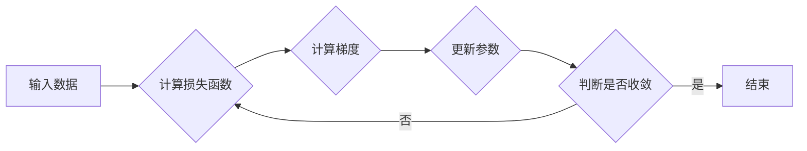
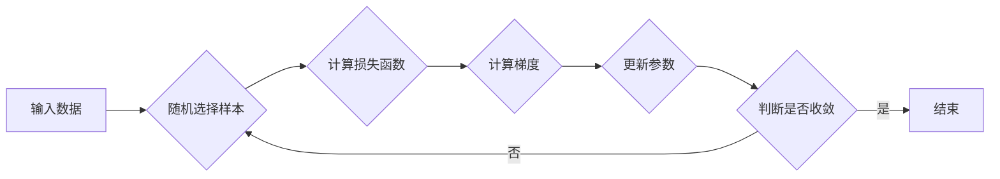

## 随机梯度下降SGD原理与代码实例讲解

> 关键词：随机梯度下降、SGD、梯度下降、机器学习、深度学习、优化算法、线性回归、代码实例

## 1. 背景介绍

在机器学习领域，模型训练的核心是找到最优的模型参数，使得模型在给定数据上表现最佳。而梯度下降算法作为一种经典的优化算法，在机器学习的训练过程中扮演着至关重要的角色。其中，随机梯度下降（Stochastic Gradient Descent，简称SGD）作为梯度下降算法的一种变体，因其效率高、易于实现等特点，在深度学习领域得到了广泛应用。

本文将深入探讨随机梯度下降算法的原理、步骤、优缺点以及应用场景，并通过代码实例讲解其具体实现过程。

## 2. 核心概念与联系

### 2.1 梯度下降算法

梯度下降算法是一种迭代优化算法，其核心思想是通过不断调整模型参数，使得模型的损失函数值逐渐减小，最终达到最小值。

**流程图：**



### 2.2 随机梯度下降算法

随机梯度下降算法与梯度下降算法的主要区别在于，它在计算梯度时，不再使用整个训练数据集，而是随机选择一个样本进行计算。这种随机采样策略使得SGD算法的计算效率更高，并且能够避免梯度更新过平滑，从而更容易跳出局部最优解。

**流程图：**



## 3. 核心算法原理 & 具体操作步骤

### 3.1 算法原理概述

随机梯度下降算法的核心思想是利用梯度下降法不断迭代更新模型参数，以最小化损失函数。

**具体步骤：**

1. **初始化模型参数:** 随机初始化模型参数。
2. **随机选择样本:** 从训练数据集中随机选择一个样本。
3. **计算损失函数:** 使用当前模型参数计算该样本的损失函数值。
4. **计算梯度:** 计算损失函数对模型参数的梯度。
5. **更新参数:** 根据梯度方向和学习率，更新模型参数。
6. **重复步骤2-5:** 重复上述步骤，直到模型参数收敛或达到最大迭代次数。

### 3.2 算法步骤详解

1. **初始化模型参数:** 

   模型参数的初始化方式对算法收敛速度和最终结果有重要影响。常用的初始化方法包括随机初始化、Xavier初始化和He初始化等。

2. **随机选择样本:** 

   从训练数据集中随机选择一个样本，称为 mini-batch。 mini-batch 的大小会影响算法的性能和收敛速度。较小的 mini-batch 可以提高算法的鲁棒性，但会增加计算时间；较大的 mini-batch 可以加速收敛速度，但可能会导致算法陷入局部最优解。

3. **计算损失函数:** 

   使用当前模型参数计算 mini-batch 样本的损失函数值。损失函数衡量模型预测结果与真实值的差距。常用的损失函数包括均方误差（MSE）、交叉熵损失等。

4. **计算梯度:** 

   计算损失函数对模型参数的梯度。梯度表示损失函数变化的方向和幅度。

5. **更新参数:** 

   根据梯度方向和学习率，更新模型参数。学习率控制着参数更新的步长。过大的学习率会导致参数更新过快，难以收敛；过小的学习率会导致参数更新过慢，训练时间过长。

### 3.3 算法优缺点

**优点:**

* **效率高:** SGD算法每次只使用一个样本进行梯度计算，因此计算效率比梯度下降算法高。
* **易于实现:** SGD算法的实现相对简单，易于理解和调试。
* **避免局部最优:** SGD算法的随机性可以帮助算法跳出局部最优解，找到全局最优解。

**缺点:**

* **震荡性:** SGD算法的更新过程可能会出现震荡现象，导致训练过程不稳定。
* **收敛速度慢:** SGD算法的收敛速度可能比其他优化算法慢。

### 3.4 算法应用领域

随机梯度下降算法广泛应用于机器学习和深度学习领域，例如：

* **线性回归:** 用于训练线性回归模型，预测连续值。
* **逻辑回归:** 用于训练逻辑回归模型，预测分类结果。
* **神经网络:** 用于训练深度神经网络，解决图像识别、自然语言处理等复杂问题。

## 4. 数学模型和公式 & 详细讲解 & 举例说明

### 4.1 数学模型构建

假设我们有一个模型 $f(x; \theta)$，其中 $x$ 是输入数据，$\theta$ 是模型参数。我们的目标是找到最优参数 $\theta$，使得模型在给定训练数据上的损失函数值最小。

损失函数通常定义为预测值与真实值的差距，例如均方误差：

$$
L(\theta) = \frac{1}{N} \sum_{i=1}^{N} (f(x_i; \theta) - y_i)^2
$$

其中 $N$ 是训练数据的大小，$x_i$ 是第 $i$ 个样本的输入数据，$y_i$ 是第 $i$ 个样本的真实值。

### 4.2 公式推导过程

随机梯度下降算法的目标是通过迭代更新参数 $\theta$，使得损失函数 $L(\theta)$ 最小化。

更新规则为：

$$
\theta = \theta - \eta \nabla L(\theta)
$$

其中 $\eta$ 是学习率，$\nabla L(\theta)$ 是损失函数 $L(\theta)$ 对参数 $\theta$ 的梯度。

梯度表示损失函数变化的方向和幅度，更新规则将参数沿着梯度负方向更新，以减小损失函数值。

### 4.3 案例分析与讲解

假设我们有一个简单的线性回归模型，目标是预测房价。

模型表达式为：

$$
f(x; \theta) = \theta_0 + \theta_1 x
$$

其中 $x$ 是房屋面积，$\theta_0$ 和 $\theta_1$ 是模型参数。

损失函数为均方误差：

$$
L(\theta) = \frac{1}{N} \sum_{i=1}^{N} (f(x_i; \theta) - y_i)^2
$$

其中 $y_i$ 是第 $i$ 个房屋的真实房价。

我们可以使用随机梯度下降算法迭代更新参数 $\theta_0$ 和 $\theta_1$，以找到最优的模型参数。

## 5. 项目实践：代码实例和详细解释说明

### 5.1 开发环境搭建

本示例使用 Python 语言和 TensorFlow 库进行实现。

**依赖库:**

```
pip install tensorflow
```

### 5.2 源代码详细实现

```python
import tensorflow as tf

# 定义模型
model = tf.keras.models.Sequential([
  tf.keras.layers.Dense(units=1, input_shape=[1])
])

# 定义损失函数和优化器
model.compile(loss='mean_squared_error', optimizer=tf.keras.optimizers.SGD(learning_rate=0.01))

# 生成训练数据
x_train = tf.random.normal(shape=(100, 1))
y_train = 2 * x_train + 1 + tf.random.normal(shape=(100, 1), mean=0, stddev=0.1)

# 训练模型
model.fit(x_train, y_train, epochs=100)

# 预测结果
predictions = model.predict(x_train)

# 打印预测结果
print(predictions)
```

### 5.3 代码解读与分析

1. **定义模型:** 使用 TensorFlow 的 Keras API 定义一个简单的线性回归模型，包含一个全连接层。

2. **定义损失函数和优化器:** 使用均方误差作为损失函数，使用随机梯度下降优化器进行训练。学习率设置为 0.01。

3. **生成训练数据:** 生成 100 个随机样本，并根据线性关系生成对应的目标值。

4. **训练模型:** 使用 `model.fit()` 方法训练模型，训练 100 个 epochs。

5. **预测结果:** 使用训练好的模型预测训练数据。

6. **打印预测结果:** 打印模型预测的结果。

### 5.4 运行结果展示

运行代码后，会输出模型预测的结果，这些结果应该与真实值相近。

## 6. 实际应用场景

随机梯度下降算法在机器学习和深度学习领域有着广泛的应用场景，例如：

* **图像识别:** 用于训练卷积神经网络，识别图像中的物体、场景等。
* **自然语言处理:** 用于训练循环神经网络，进行文本分类、机器翻译、情感分析等任务。
* **推荐系统:** 用于训练协同过滤模型，推荐用户可能感兴趣的商品、电影等。

### 6.4 未来应用展望

随着机器学习和深度学习技术的不断发展，随机梯度下降算法在未来将继续发挥重要作用，并应用于更多新的领域，例如：

* **自动驾驶:** 用于训练强化学习模型，控制自动驾驶车辆。
* **医疗诊断:** 用于训练深度学习模型，辅助医生进行疾病诊断。
* **药物研发:** 用于训练机器学习模型，预测药物的有效性。

## 7. 工具和资源推荐

### 7.1 学习资源推荐

* **书籍:**
    * 《深度学习》 - Ian Goodfellow, Yoshua Bengio, Aaron Courville
    * 《机器学习》 - Tom Mitchell
* **在线课程:**
    * Coursera: Machine Learning by Andrew Ng
    * Udacity: Deep Learning Nanodegree
* **博客:**
    * Towards Data Science
    * Machine Learning Mastery

### 7.2 开发工具推荐

* **Python:** 作为机器学习和深度学习的常用编程语言。
* **TensorFlow:** 开源深度学习框架。
* **PyTorch:** 开源深度学习框架。
* **Keras:** TensorFlow 的高层API，简化模型构建。

### 7.3 相关论文推荐

* **Stochastic Gradient Descent: A Comprehensive Review** - Bottou, L. (2010)
* **On the Convergence of Stochastic Gradient Descent** - Shalev-Shwartz, S., & Zhang, S. (2011)

## 8. 总结：未来发展趋势与挑战

### 8.1 研究成果总结

随机梯度下降算法作为一种经典的优化算法，在机器学习和深度学习领域取得了显著的成果。其高效、易于实现的特点使其成为训练深度神经网络的常用方法。

### 8.2 未来发展趋势

未来，随机梯度下降算法的研究将继续朝着以下方向发展：

* **加速算法:** 研究更快的随机梯度下降变体，例如 mini-batch SGD、Momentum SGD、Adam 等。
* **提高鲁棒性:** 研究更鲁棒的随机梯度下降算法，能够更好地应对噪声数据和非凸损失函数。
* **应用于新领域:** 将随机梯度下降算法应用于更多新的领域，例如自动驾驶、医疗诊断等。

### 8.3 面临的挑战

随机梯度下降算法也面临着一些挑战：

* **局部最优:** 随机梯度下降算法容易陷入局部最优解，难以找到全局最优解。
* **参数选择:** 学习率和 mini-batch 大小的选择对算法性能有重要影响，需要进行仔细的调优。
* **稀疏数据:** 对于