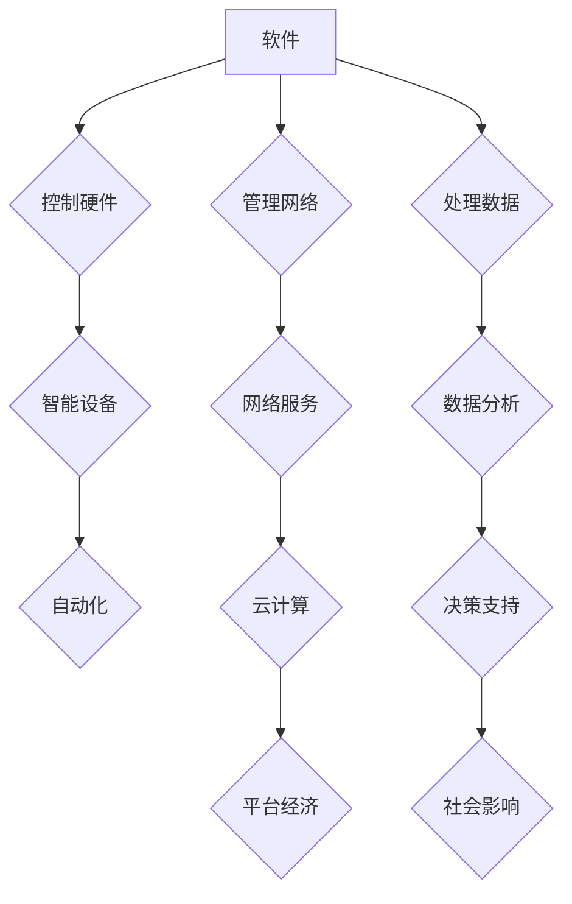

## 马克·安德森的“软件正在吞噬世界”

> 关键词：软件吞噬世界，软件定义一切，数字化转型，人工智能，自动化，云计算，平台经济

### 1. 背景介绍

2016年，著名科技评论家马克·安德森在一次演讲中提出了著名的“软件正在吞噬世界”的观点。这个观点迅速引发了广泛的讨论和思考，也成为了近年来科技发展的一个重要趋势。安德森认为，软件正在以一种无处不在的方式渗透到我们生活的方方面面，从交通工具到医疗设备，从金融系统到娱乐平台，几乎所有领域都受到软件的深刻影响。

这种软件化的趋势并非偶然，它源于一系列技术变革的推动。首先，计算能力的飞速发展使得软件能够处理越来越复杂的任务。其次，互联网的普及和连接性增强了软件的传播和应用范围。最后，人工智能和机器学习技术的进步赋予了软件更强的智能化和自主性。

### 2. 核心概念与联系

**软件吞噬世界**的核心概念在于软件正在成为一种基础设施，它不再仅仅是应用软件，而是渗透到硬件、网络、数据等各个层面，最终控制和影响着整个系统。

**软件定义一切 (Software Defined Everything)** 是这个概念的延伸，它强调软件在未来将定义和控制一切设备、系统和服务。

**软件吞噬世界**的趋势可以从以下几个方面来理解：

* **平台经济的兴起:**  像亚马逊、谷歌、苹果等平台巨头通过软件平台连接用户和服务，控制着大量的资源和数据，从而影响着整个经济体系。
* **云计算的普及:** 云计算将计算资源和软件服务抽象化，使得软件更加灵活、可扩展和易于访问，推动了软件的广泛应用。
* **物联网的快速发展:** 物联网将各种设备连接到网络，通过软件进行数据采集、分析和控制，使得软件能够渗透到现实世界中。
* **人工智能的爆发:** 人工智能赋予软件更强的智能化和自主性，使得软件能够完成更复杂的任务，并对人类社会产生更深远的影响。

**Mermaid 流程图:**



### 3. 核心算法原理 & 具体操作步骤

**3.1 算法原理概述**

软件吞噬世界的核心算法原理主要包括：

* **机器学习算法:** 用于从数据中学习模式和规律，从而实现智能化决策和预测。
* **深度学习算法:**  一种更高级的机器学习算法，能够处理更复杂的数据结构和模式。
* **自然语言处理算法:** 用于理解和处理人类语言，例如文本分析、机器翻译和语音识别。
* **计算机视觉算法:** 用于理解和处理图像和视频数据，例如图像识别、物体检测和视频分析。

**3.2 算法步骤详解**

以机器学习算法为例，其基本步骤包括：

1. **数据收集和预处理:** 收集相关数据并进行清洗、转换和特征提取。
2. **模型选择:** 根据任务需求选择合适的机器学习模型。
3. **模型训练:** 使用训练数据训练模型，调整模型参数以达到最佳性能。
4. **模型评估:** 使用测试数据评估模型的性能，例如准确率、召回率和F1-score。
5. **模型部署:** 将训练好的模型部署到实际应用场景中。

**3.3 算法优缺点**

**优点:**

* **自动化:**  可以自动完成许多重复性任务，提高效率。
* **智能化:**  可以根据数据学习和改进，实现智能决策和预测。
* **个性化:**  可以根据用户数据提供个性化的服务和体验。

**缺点:**

* **数据依赖:**  算法性能依赖于数据质量和数量。
* **黑盒效应:**  一些算法的决策过程难以理解，缺乏透明度。
* **伦理问题:**  算法可能存在偏见和歧视，需要谨慎使用。

**3.4 算法应用领域**

机器学习算法广泛应用于各个领域，例如：

* **医疗保健:** 疾病诊断、药物研发、个性化治疗。
* **金融服务:** 风险评估、欺诈检测、投资决策。
* **电商:** 商品推荐、用户画像、精准营销。
* **交通运输:** 自动驾驶、交通流量预测、物流优化。

### 4. 数学模型和公式 & 详细讲解 & 举例说明

**4.1 数学模型构建**

机器学习算法通常基于数学模型，例如线性回归、逻辑回归、支持向量机等。这些模型通过数学公式来描述数据之间的关系，并根据训练数据进行参数估计。

**4.2 公式推导过程**

以线性回归为例，其目标是找到一条直线来拟合数据点，该直线可以用以下公式表示：

$$y = wx + b$$

其中，$y$ 是预测值，$x$ 是输入特征，$w$ 是权重系数，$b$ 是偏置项。

线性回归的目标函数是最小化预测值与真实值的误差，可以使用最小二乘法来求解权重系数和偏置项。

**4.3 案例分析与讲解**

假设我们有一组数据，其中 $x$ 是房屋面积，$y$ 是房屋价格。我们可以使用线性回归模型来预测房屋价格。

通过训练数据，我们可以得到模型参数 $w$ 和 $b$。然后，我们可以使用这个模型来预测新房屋的价格。例如，如果新房屋面积为 $100$ 平方米，我们可以使用以下公式进行预测：

$$y = w * 100 + b$$

### 5. 项目实践：代码实例和详细解释说明

**5.1 开发环境搭建**

可以使用 Python 语言和相关的机器学习库，例如 scikit-learn，来实现机器学习算法。

**5.2 源代码详细实现**

```python
from sklearn.linear_model import LinearRegression
import numpy as np

# 生成示例数据
X = np.array([[100], [150], [200], [250]])
y = np.array([150000, 200000, 250000, 300000])

# 创建线性回归模型
model = LinearRegression()

# 训练模型
model.fit(X, y)

# 获取模型参数
w = model.coef_[0]
b = model.intercept_

# 使用模型预测新数据
new_house_area = 180
predicted_price = w * new_house_area + b

# 打印预测结果
print(f"预测价格: {predicted_price}")
```

**5.3 代码解读与分析**

这段代码首先生成了一些示例数据，然后创建了一个线性回归模型。接着，使用训练数据训练模型，并获取模型参数 $w$ 和 $b$。最后，使用模型参数预测新房屋的价格。

**5.4 运行结果展示**

运行这段代码后，会输出预测价格的值。

### 6. 实际应用场景

**6.1 智能家居**

软件可以控制智能家居设备，例如灯光、空调、摄像头等，实现自动化控制和个性化体验。

**6.2 自动驾驶**

软件可以处理传感器数据，进行路径规划和决策控制，实现自动驾驶功能。

**6.3 个性化推荐**

软件可以根据用户的行为数据，推荐个性化的商品、服务和内容。

**6.4 医疗诊断**

软件可以辅助医生进行疾病诊断，例如分析医学影像数据、预测患者风险等。

**6.5 金融风险管理**

软件可以分析金融数据，识别潜在的风险，并进行风险控制。

**6.6 未来应用展望**

随着技术的不断发展，软件将渗透到更多领域，例如教育、娱乐、艺术等，并带来更多创新和变革。

### 7. 工具和资源推荐

**7.1 学习资源推荐**

* **在线课程:** Coursera、edX、Udacity 等平台提供丰富的机器学习和人工智能课程。
* **书籍:** 《深度学习》、《机器学习实战》等书籍是学习机器学习和人工智能的经典教材。
* **开源项目:** TensorFlow、PyTorch 等开源项目提供了丰富的机器学习工具和资源。

**7.2 开发工具推荐**

* **Python:**  机器学习和人工智能开发的常用语言。
* **Jupyter Notebook:**  交互式编程环境，方便机器学习算法的开发和调试。
* **scikit-learn:**  Python 机器学习库，提供各种机器学习算法和工具。

**7.3 相关论文推荐**

* **《ImageNet Classification with Deep Convolutional Neural Networks》**
* **《Attention Is All You Need》**
* **《BERT: Pre-training of Deep Bidirectional Transformers for Language Understanding》**

### 8. 总结：未来发展趋势与挑战

**8.1 研究成果总结**

近年来，机器学习和人工智能取得了显著进展，在各个领域都取得了突破性应用。

**8.2 未来发展趋势**

* **模型更加强大:**  模型规模和能力将继续提升，能够处理更复杂的任务。
* **应用更加广泛:**  人工智能将应用到更多领域，例如医疗、教育、金融等。
* **伦理问题更加突出:**  人工智能的伦理问题将更加突出，需要加强研究和监管。

**8.3 面临的挑战**

* **数据获取和隐私保护:**  人工智能算法依赖于大量数据，如何获取高质量数据并保护用户隐私是一个挑战。
* **算法解释性和可信度:**  一些人工智能算法的决策过程难以理解，需要提高算法的解释性和可信度。
* **公平性和偏见:**  人工智能算法可能存在偏见，需要确保算法的公平性和公正性。

**8.4 研究展望**

未来，人工智能研究将更加注重模型的可解释性、公平性和安全性，并探索人工智能与人类更加和谐的合作模式。

### 9. 附录：常见问题与解答

**常见问题:**

* **什么是软件吞噬世界？**

软件吞噬世界是指软件正在以一种无处不在的方式渗透到我们生活的方方面面，控制和影响着整个系统。

* **软件吞噬世界有哪些影响？**

软件吞噬世界将带来许多影响，例如平台经济的兴起、云计算的普及、物联网的快速发展、人工智能的爆发等。

* **如何应对软件吞噬世界的挑战？**

我们需要加强对人工智能技术的理解和监管，并培养更多的人才，以应对软件吞噬世界的挑战。


作者：禅与计算机程序设计艺术 / Zen and the Art of Computer Programming 
