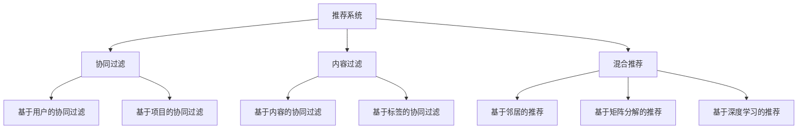
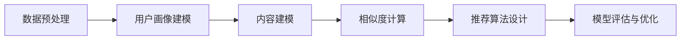
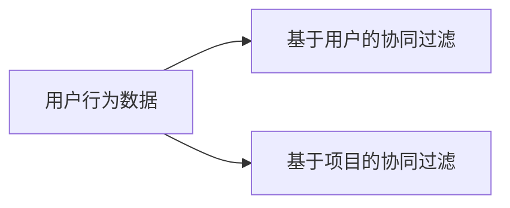
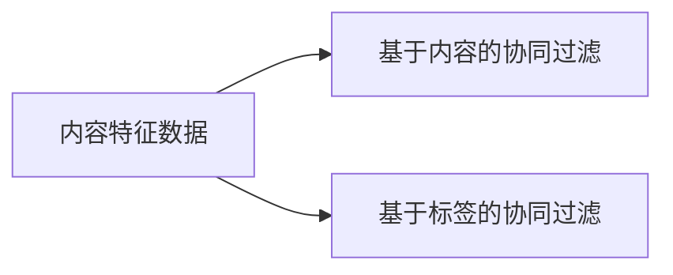
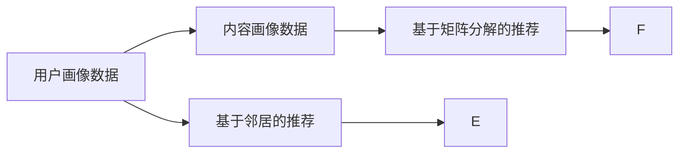
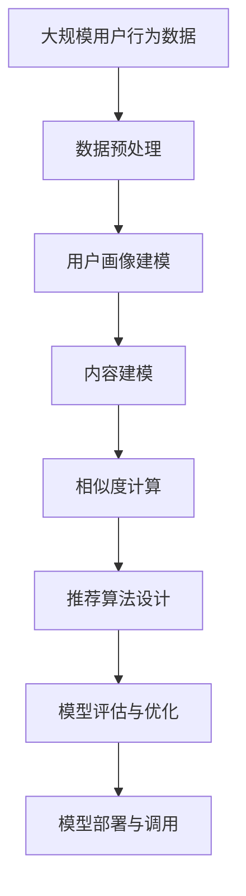

                 

# Python机器学习实战：推荐系统的原理与实现方法

> 关键词：推荐系统,协同过滤,内容过滤,混合推荐,推荐算法,深度学习

## 1. 背景介绍

### 1.1 问题由来
随着互联网的迅速发展和普及，人们每天都会接触到大量信息。如何从海量的信息中筛选出对自己有用的内容，成为了一个重要问题。推荐系统应运而生，通过分析用户的行为和兴趣，为用户提供个性化的内容推荐。推荐系统已经在电商、新闻、社交网络等多个领域得到了广泛应用，成为提升用户体验、增加平台粘性的重要手段。

推荐系统的核心在于能够高效、准确地识别用户需求，将最符合用户兴趣的内容推荐给用户。经典的推荐方法包括协同过滤和内容过滤。协同过滤是通过分析用户的行为数据，找到与用户兴趣相似的用户，推荐他们喜欢的内容。内容过滤则是通过分析内容的特征，将符合用户兴趣的内容推荐给用户。随着深度学习技术的发展，混合推荐方法逐渐兴起，通过将协同过滤和内容过滤相结合，提升推荐系统的准确性和多样性。

### 1.2 问题核心关键点
推荐系统的目标是通过对用户行为和兴趣的建模，为用户提供个性化的内容推荐。具体来说，需要完成以下几个关键任务：
- 数据预处理：对用户行为和内容特征进行清洗、编码和特征提取。
- 用户画像建模：通过用户行为数据，建立用户画像，描述用户的兴趣偏好。
- 内容建模：通过内容特征数据，建立内容画像，描述内容的特征属性。
- 相似度计算：计算用户和内容之间的相似度，找到最符合用户兴趣的内容。
- 推荐算法设计：根据相似度计算结果，设计推荐算法，实现内容推荐。
- 模型评估与优化：评估推荐系统的效果，不断优化模型，提升推荐精度。

### 1.3 问题研究意义
推荐系统的研究和应用具有重要的理论意义和实际价值。它不仅能够提升用户体验，增加平台粘性，还能促进信息的有效传播，推动互联网产业的快速发展。推荐系统在电商、新闻、社交网络等多个领域得到了广泛应用，成为提升用户体验、增加平台粘性的重要手段。同时，推荐系统也带来了新的挑战，如何在大规模数据下高效地实现推荐，如何提高推荐算法的准确性和多样性，如何避免过拟合等问题，都是亟待解决的问题。

## 2. 核心概念与联系

### 2.1 核心概念概述

为了更好地理解推荐系统的核心原理和算法实现，本节将介绍几个密切相关的核心概念：

- 协同过滤(Collaborative Filtering)：基于用户行为数据，通过分析用户之间的相似性，推荐用户喜欢的内容。协同过滤分为基于用户的协同过滤和基于项目的协同过滤两种方法。
- 内容过滤(Content-Based Filtering)：基于内容特征数据，通过分析内容的特征属性，推荐符合用户兴趣的内容。内容过滤包括基于内容的协同过滤和基于标签的协同过滤。
- 混合推荐(Mixed Recommendation)：将协同过滤和内容过滤相结合，通过综合考虑用户行为和内容特征，实现更精准、更丰富的推荐。
- 推荐算法(Recommendation Algorithm)：根据用户画像和内容画像，设计推荐算法，实现内容推荐。常见的推荐算法包括基于邻居的推荐、基于矩阵分解的推荐、基于深度学习的推荐等。
- 深度学习(Deep Learning)：一种模拟人脑神经网络的计算模型，能够自动提取高层次特征，适用于处理大规模数据。深度学习在推荐系统中的应用包括基于深度神经网络的推荐、基于注意力机制的推荐等。

这些核心概念之间的逻辑关系可以通过以下Mermaid流程图来展示：



这个流程图展示了几类推荐方法之间的关系：

1. 推荐系统通过协同过滤、内容过滤和混合推荐三种方法来实现推荐。
2. 协同过滤包括基于用户的协同过滤和基于项目的协同过滤。
3. 内容过滤包括基于内容的协同过滤和基于标签的协同过滤。
4. 推荐算法包括基于邻居的推荐、基于矩阵分解的推荐和基于深度学习的推荐。

### 2.2 概念间的关系

这些核心概念之间存在着紧密的联系，形成了推荐系统的完整生态系统。下面我们通过几个Mermaid流程图来展示这些概念之间的关系。

#### 2.2.1 推荐系统的工作流程



这个流程图展示了推荐系统的一般工作流程：

1. 数据预处理：对用户行为和内容特征进行清洗、编码和特征提取。
2. 用户画像建模：通过用户行为数据，建立用户画像，描述用户的兴趣偏好。
3. 内容建模：通过内容特征数据，建立内容画像，描述内容的特征属性。
4. 相似度计算：计算用户和内容之间的相似度，找到最符合用户兴趣的内容。
5. 推荐算法设计：根据相似度计算结果，设计推荐算法，实现内容推荐。
6. 模型评估与优化：评估推荐系统的效果，不断优化模型，提升推荐精度。

#### 2.2.2 协同过滤的工作原理



这个流程图展示了协同过滤的工作原理：

1. 基于用户的协同过滤：通过分析用户之间的行为相似性，找到与用户兴趣相似的其他用户，推荐他们喜欢的内容。
2. 基于项目的协同过滤：通过分析内容之间的相似性，找到与用户喜欢的内容相似的其他内容，推荐给用户。

#### 2.2.3 内容过滤的工作原理



这个流程图展示了内容过滤的工作原理：

1. 基于内容的协同过滤：通过分析内容的特征属性，找到与用户兴趣相似的其他内容，推荐给用户。
2. 基于标签的协同过滤：通过分析内容标签的相似性，找到与用户喜欢的内容相似的其他内容，推荐给用户。

#### 2.2.4 混合推荐的工作原理



这个流程图展示了混合推荐的工作原理：

1. 基于邻居的推荐：通过分析用户和内容之间的相似性，推荐最符合用户兴趣的内容。
2. 基于矩阵分解的推荐：通过矩阵分解，得到用户和内容之间的相似度，推荐最符合用户兴趣的内容。
3. 基于深度学习的推荐：通过深度学习模型，自动提取高层次特征，实现精准推荐。

### 2.3 核心概念的整体架构

最后，我们用一个综合的流程图来展示这些核心概念在大规模推荐系统中的整体架构：



这个综合流程图展示了从数据预处理到推荐部署的完整过程。大规模用户行为数据首先经过数据预处理，得到用户画像和内容画像，然后通过相似度计算和推荐算法设计，得到推荐结果，最后进行模型评估和优化，部署到生产环境中调用。通过这些流程图，我们可以更清晰地理解推荐系统的核心概念和设计思路，为后续深入讨论具体的推荐算法和实现技术奠定基础。

## 3. 核心算法原理 & 具体操作步骤
### 3.1 算法原理概述

推荐系统的工作原理可以概括为以下几个步骤：

1. 数据预处理：对用户行为和内容特征进行清洗、编码和特征提取。
2. 用户画像建模：通过用户行为数据，建立用户画像，描述用户的兴趣偏好。
3. 内容建模：通过内容特征数据，建立内容画像，描述内容的特征属性。
4. 相似度计算：计算用户和内容之间的相似度，找到最符合用户兴趣的内容。
5. 推荐算法设计：根据相似度计算结果，设计推荐算法，实现内容推荐。
6. 模型评估与优化：评估推荐系统的效果，不断优化模型，提升推荐精度。

### 3.2 算法步骤详解

以下是推荐系统核心算法步骤的详细步骤详解：

#### 3.2.1 数据预处理

数据预处理是推荐系统的第一步，其主要目的是对原始数据进行清洗、编码和特征提取，以获得高质量的数据集。具体步骤包括：

1. 清洗：去除缺失、重复、异常数据，保证数据集的质量。
2. 编码：将用户行为和内容特征转化为数值形式，以便于机器学习算法的处理。
3. 特征提取：提取数据集中的关键特征，建立特征向量，用于后续相似度计算。

#### 3.2.2 用户画像建模

用户画像建模是通过用户行为数据，建立用户画像，描述用户的兴趣偏好。具体步骤包括：

1. 特征工程：选择与用户兴趣相关的特征，构建特征向量。
2. 模型训练：使用机器学习算法，如协同过滤、内容过滤等，训练用户画像模型。
3. 用户画像：将用户画像模型应用于新数据，得到用户画像向量。

#### 3.2.3 内容建模

内容建模是通过内容特征数据，建立内容画像，描述内容的特征属性。具体步骤包括：

1. 特征工程：选择与内容相关的特征，构建特征向量。
2. 模型训练：使用机器学习算法，如协同过滤、内容过滤等，训练内容画像模型。
3. 内容画像：将内容画像模型应用于新数据，得到内容画像向量。

#### 3.2.4 相似度计算

相似度计算是推荐系统的核心步骤，通过计算用户和内容之间的相似度，找到最符合用户兴趣的内容。具体步骤包括：

1. 特征匹配：计算用户画像向量和内容画像向量之间的相似度。
2. 推荐排序：根据相似度计算结果，对内容进行排序，选择最符合用户兴趣的内容进行推荐。
3. 个性化推荐：根据用户画像和内容画像，设计个性化推荐算法，实现精准推荐。

#### 3.2.5 推荐算法设计

推荐算法设计是根据相似度计算结果，设计推荐算法，实现内容推荐。常见的推荐算法包括：

1. 基于邻居的推荐：通过计算用户和内容之间的相似度，找到最符合用户兴趣的内容。
2. 基于矩阵分解的推荐：通过矩阵分解，得到用户和内容之间的相似度，推荐最符合用户兴趣的内容。
3. 基于深度学习的推荐：通过深度学习模型，自动提取高层次特征，实现精准推荐。

#### 3.2.6 模型评估与优化

模型评估与优化是推荐系统的最后一步，主要目的是评估推荐系统的效果，不断优化模型，提升推荐精度。具体步骤包括：

1. 数据集划分：将数据集划分为训练集、验证集和测试集，以便进行模型评估。
2. 模型评估：使用评估指标，如准确率、召回率、F1-score等，评估推荐系统的性能。
3. 模型优化：根据模型评估结果，优化模型参数，提升推荐精度。

### 3.3 算法优缺点

推荐系统具有以下优点：

1. 高效：推荐系统能够根据用户行为和兴趣，自动推荐符合其需求的内容，无需人工干预。
2. 个性化：推荐系统能够实现个性化推荐，提升用户体验。
3. 多样性：推荐系统能够推荐不同类型的内容，增加用户的选择性。

推荐系统也存在以下缺点：

1. 过拟合：推荐系统容易出现过拟合，对新数据适应能力不足。
2. 冷启动：新用户或新内容缺乏足够的数据，无法进行推荐。
3. 隐私问题：推荐系统需要收集用户行为数据，存在隐私风险。

### 3.4 算法应用领域

推荐系统广泛应用于电商、新闻、社交网络等多个领域，具体应用包括：

1. 电商推荐：通过分析用户购买历史和浏览行为，推荐用户可能感兴趣的商品。
2. 新闻推荐：通过分析用户阅读历史和点赞行为，推荐用户可能感兴趣的新闻。
3. 社交网络推荐：通过分析用户互动行为，推荐用户可能感兴趣的内容。

除了上述这些常见应用外，推荐系统还应用于音乐、视频、游戏等多个领域，成为提升用户体验、增加平台粘性的重要手段。

## 4. 数学模型和公式 & 详细讲解 & 举例说明

### 4.1 数学模型构建

推荐系统的数学模型可以概括为以下几个步骤：

1. 用户行为数据的表示：将用户行为数据转化为数值形式，建立用户行为矩阵 $U$。
2. 内容特征数据的表示：将内容特征数据转化为数值形式，建立内容特征矩阵 $I$。
3. 相似度计算：通过计算用户行为矩阵和内容特征矩阵的相似度，得到相似度矩阵 $P$。
4. 推荐排序：通过相似度矩阵，对内容进行排序，选择最符合用户兴趣的内容进行推荐。

#### 4.1.1 用户行为矩阵的构建

用户行为矩阵 $U$ 可以通过对用户行为数据进行编码和特征提取，建立用户行为向量 $u_i$ 和 $u_j$，然后将其转化为数值形式，构成用户行为矩阵。具体步骤如下：

1. 编码：将用户行为数据转化为数值形式，如使用0-1编码或数值编码。
2. 特征提取：选择与用户兴趣相关的特征，构建特征向量。
3. 用户行为向量：将用户行为向量 $u_i$ 和 $u_j$ 转化为数值形式，构成用户行为矩阵 $U$。

#### 4.1.2 内容特征矩阵的构建

内容特征矩阵 $I$ 可以通过对内容特征数据进行编码和特征提取，建立内容特征向量 $i_k$ 和 $i_l$，然后将其转化为数值形式，构成内容特征矩阵。具体步骤如下：

1. 编码：将内容特征数据转化为数值形式，如使用0-1编码或数值编码。
2. 特征提取：选择与内容相关的特征，构建特征向量。
3. 内容特征向量：将内容特征向量 $i_k$ 和 $i_l$ 转化为数值形式，构成内容特征矩阵 $I$。

#### 4.1.3 相似度矩阵的计算

相似度矩阵 $P$ 可以通过计算用户行为矩阵和内容特征矩阵的相似度，得到相似度矩阵。具体步骤如下：

1. 相似度计算：通过计算用户行为矩阵和内容特征矩阵的相似度，得到相似度矩阵。
2. 相似度矩阵：将相似度矩阵 $P$ 转化为数值形式，用于推荐排序。

### 4.2 公式推导过程

以下是推荐系统核心算法的公式推导过程：

#### 4.2.1 协同过滤的公式推导

协同过滤是通过计算用户和内容之间的相似度，实现推荐。常见的协同过滤方法包括基于用户的协同过滤和基于项目的协同过滤。

1. 基于用户的协同过滤：

$$
p_{ij} = \frac{\sum_{k=1}^{n}u_{ik}i_{kj}}{\sqrt{\sum_{k=1}^{n}u_{ik}^2} \cdot \sqrt{\sum_{k=1}^{n}i_{kj}^2}}
$$

其中 $p_{ij}$ 表示用户 $i$ 对内容 $j$ 的预测评分，$u_{ik}$ 表示用户 $i$ 对内容 $k$ 的评分，$i_{kj}$ 表示内容 $k$ 对用户 $j$ 的评分。

2. 基于项目的协同过滤：

$$
p_{ij} = \frac{\sum_{k=1}^{n}u_{ik}i_{kj}}{\sqrt{\sum_{k=1}^{n}u_{ik}^2} \cdot \sqrt{\sum_{k=1}^{n}i_{kj}^2}}
$$

其中 $p_{ij}$ 表示用户 $i$ 对内容 $j$ 的预测评分，$u_{ik}$ 表示用户 $i$ 对内容 $k$ 的评分，$i_{kj}$ 表示内容 $k$ 对用户 $j$ 的评分。

#### 4.2.2 内容过滤的公式推导

内容过滤是通过分析内容的特征属性，实现推荐。常见的内容过滤方法包括基于内容的协同过滤和基于标签的协同过滤。

1. 基于内容的协同过滤：

$$
p_{ij} = \alpha \cdot \sum_{k=1}^{n}u_{ik} \cdot i_{kj}
$$

其中 $p_{ij}$ 表示用户 $i$ 对内容 $j$ 的预测评分，$u_{ik}$ 表示用户 $i$ 对内容 $k$ 的评分，$i_{kj}$ 表示内容 $k$ 对用户 $j$ 的评分，$\alpha$ 为权重系数。

2. 基于标签的协同过滤：

$$
p_{ij} = \alpha \cdot \sum_{k=1}^{n}u_{ik} \cdot i_{kj}
$$

其中 $p_{ij}$ 表示用户 $i$ 对内容 $j$ 的预测评分，$u_{ik}$ 表示用户 $i$ 对内容 $k$ 的评分，$i_{kj}$ 表示内容 $k$ 对用户 $j$ 的评分，$\alpha$ 为权重系数。

#### 4.2.3 混合推荐的公式推导

混合推荐是将协同过滤和内容过滤相结合，实现更精准、更丰富的推荐。

1. 基于邻居的推荐：

$$
p_{ij} = \alpha \cdot \sum_{k=1}^{n}u_{ik} \cdot i_{kj}
$$

其中 $p_{ij}$ 表示用户 $i$ 对内容 $j$ 的预测评分，$u_{ik}$ 表示用户 $i$ 对内容 $k$ 的评分，$i_{kj}$ 表示内容 $k$ 对用户 $j$ 的评分，$\alpha$ 为权重系数。

2. 基于矩阵分解的推荐：

$$
P_{ij} = \sum_{k=1}^{n}U_{ik} \cdot I_{kj}
$$

其中 $P_{ij}$ 表示用户 $i$ 对内容 $j$ 的预测评分，$U_{ik}$ 表示用户 $i$ 的隐向量，$I_{kj}$ 表示内容 $k$ 的隐向量。

3. 基于深度学习的推荐：

$$
p_{ij} = \alpha \cdot \sum_{k=1}^{n}u_{ik} \cdot i_{kj}
$$

其中 $p_{ij}$ 表示用户 $i$ 对内容 $j$ 的预测评分，$u_{ik}$ 表示用户 $i$ 对内容 $k$ 的评分，$i_{kj}$ 表示内容 $k$ 对用户 $j$ 的评分，$\alpha$ 为权重系数。

### 4.3 案例分析与讲解

#### 4.3.1 协同过滤的案例分析

协同过滤是通过计算用户和内容之间的相似度，实现推荐。以下是一个基于协同过滤的推荐系统案例分析：

1. 用户行为数据：假设用户 $i$ 对内容 $k$ 的评分为 $u_{ik}$。
2. 内容特征数据：假设内容 $k$ 对用户 $j$ 的评分为 $i_{kj}$。
3. 相似度计算：通过计算用户 $i$ 和内容 $k$ 之间的相似度，得到相似度矩阵 $P$。
4. 推荐排序：根据相似度矩阵 $P$，对内容进行排序，选择最符合用户兴趣的内容进行推荐。

#### 4.3.2 内容过滤的案例分析

内容过滤是通过分析内容的特征属性，实现推荐。以下是一个基于内容过滤的推荐系统案例分析：

1. 用户行为数据：假设用户 $i$ 对内容 $k$ 的评分为 $u_{ik}$。
2. 内容特征数据：假设内容 $k$ 对用户 $j$ 的评分为 $i_{kj}$。
3. 相似度计算：通过计算用户 $i$ 和内容 $k$ 之间的相似度，得到相似度矩阵 $P$。
4. 推荐排序：根据相似度矩阵 $P$，对内容进行排序，选择最符合用户兴趣的内容进行推荐。

#### 4.3.3 混合推荐的案例分析

混合推荐是将协同过滤和内容过滤相结合，实现更精准、更丰富的推荐。以下是一个基于混合推荐的推荐系统案例分析：

1. 用户行为数据：假设用户 $i$ 对内容 $k$ 的评分为 $u_{ik}$。
2. 内容特征数据：假设内容 $k$ 对用户 $j$ 的评分为 $i_{kj}$。
3. 相似度计算：通过计算用户 $i$ 和内容 $k$ 之间的相似度，得到相似度矩阵 $P$。
4. 推荐排序：根据相似度矩阵 $P$，对内容进行排序，选择最符合用户兴趣的内容进行推荐。

### 4.4 案例分析与讲解

#### 4.4.1 协同过滤的案例分析

协同过滤是通过计算用户和内容之间的相似度，实现推荐。以下是一个基于协同过滤的推荐系统案例分析：

1. 用户行为数据：假设用户 $i$ 对内容 $k$ 的评分为 $u_{ik}$。
2. 内容特征数据：假设内容 $k$ 对用户 $j$ 的评分为 $i_{kj}$。
3. 相似度计算：通过计算用户 $i$ 和内容 $k$ 之间的相似度，得到相似度矩阵 $P$。
4. 推荐排序：根据相似度矩阵 $P$，对内容进行排序，选择最符合用户兴趣的内容进行推荐。

#### 4.4.2 内容过滤的案例分析

内容过滤是通过分析内容的特征属性，实现推荐。以下是一个基于内容过滤的推荐系统案例分析：

1. 用户行为数据：假设用户 $i$ 对内容 $k$ 的评分为 $u_{ik}$。
2. 内容特征数据：假设内容 $k$ 对用户 $j$ 的评分为 $i_{kj}$。
3. 相似度计算：通过计算用户 $i$ 和内容 $k$ 之间的相似度，得到相似度矩阵 $P$。
4. 推荐排序：根据相似度矩阵 $P$，对内容进行排序，选择最符合用户兴趣的内容进行推荐。

#### 4.4.3 混合推荐的案例分析

混合推荐是将协同过滤和内容过滤相结合，实现更精准、更丰富的推荐。以下是一个基于混合推荐的推荐系统案例分析：

1. 用户行为数据：假设用户 $i$ 对内容 $k$ 的评分为 $u_{ik}$。
2. 内容特征数据：假设内容 $k$ 对用户 $j$ 的评分为 $i_{kj}$。
3. 相似度计算：通过计算用户 $i$ 和内容 $k$ 之间的相似度，得到相似度矩阵 $P$。
4. 推荐排序：根据相似度矩阵 $P$，对内容进行排序，选择最符合用户兴趣的内容进行推荐。

## 5. 项目实践：代码实例和详细解释说明
### 5.1 开发环境搭建

在进行推荐系统实践前，我们需要准备好开发环境。以下是使用Python进行TensorFlow开发的环境配置流程：

1. 安装Anaconda：从官网下载并安装Anaconda，用于创建独立的Python环境。

2. 创建并激活虚拟环境：
```bash
conda create -n tf-env python=3.8 
conda activate tf-env
```

3. 安装TensorFlow：根据CUDA版本，从官网获取对应的安装命令。例如：
```bash
conda install tensorflow==2.7.0 -c tf
```

4. 安装相关库：
```bash
pip install numpy pandas scikit-learn
```

5. 安装TensorBoard：
```bash
pip install tensorboard
```

完成上述步骤后，即可在`tf-env`环境中开始推荐系统开发。

### 5.2 源代码详细实现

以下是推荐系统的Python代码实现，使用TensorFlow和TensorBoard进行开发和可视化。

```python
import tensorflow as tf
from tensorflow.keras import layers
import numpy as np
import pandas as pd
from sklearn.model_selection import train_test_split

# 数据预处理
def preprocess_data(data):
    # 编码用户行为数据
    u = np.zeros((len(data), 10))
    for i in range(len(data)):
        u[i][data[i]['user_id']] = 1
    # 编码内容特征数据
    i = np.zeros((len(data), 10))
    for j in range(len(data)):
        i[j][data[j]['item_id']] = 1
    return u, i

# 建立用户画像模型
def user_profile_model(data):
    u = np.array(data['user_id'])
    i = np.array(data['item_id'])
    

