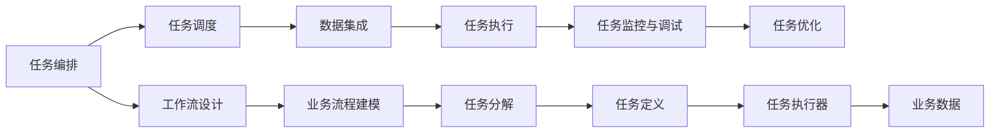

                 

# RPA工作流设计：实现基于桌面的业务流程自动化

> 关键词：RPA, 工作流设计, 自动化, 业务流程, 桌面应用, 软件开发, 系统集成

## 1. 背景介绍

### 1.1 问题由来
在数字化转型浪潮的推动下，自动化技术的应用日益广泛，成为各行各业提升效率、降低成本的重要手段。相较于传统的自动化解决方案，基于桌面的业务流程自动化（Desktop Robotic Process Automation, RPA）以其更轻量、更灵活、更易集成等优势，在非IT领域取得了快速的发展。

然而，传统的RPA解决方案往往依赖于特定的软件环境，如Web浏览器、桌面应用程序等，且常常需要定制开发。这种定制化的开发方式不仅增加了项目周期和成本，还限制了RPA应用的灵活性和可扩展性。因此，如何设计一套通用的、易于维护和扩展的RPA工作流系统，成为了当前RPA研究的热点问题。

### 1.2 问题核心关键点
RPA工作流系统通过将业务流程划分为多个自动化任务，使用软件机器人自动执行这些任务，以实现业务流程的全自动化。其核心在于设计一套灵活、易用、可扩展的工作流设计系统，使其能够高效地集成各种桌面应用和数据源，灵活应对不同场景的业务需求。

具体而言，RPA工作流设计需要考虑以下几个关键点：
- **任务调度**：将业务流程分解为多个离散的任务，并设计合适的调度机制。
- **任务编排**：通过编排任务序列和条件，实现业务流程的灵活组合。
- **数据集成**：设计一套高效的数据集成方案，支持各种数据源的接入和转换。
- **任务监控与调试**：提供实时的监控和调试工具，及时发现和解决任务执行中的问题。
- **任务优化**：通过任务调度和编排的优化，提升RPA系统性能和可靠性。

### 1.3 问题研究意义
研究RPA工作流设计，对于提升非IT领域的自动化水平，降低企业运营成本，提高工作效率具有重要意义：

1. **降低项目成本**：通用化的工作流设计可减少定制开发的需求，缩短项目周期，降低项目成本。
2. **提高灵活性**：灵活的任务编排机制和数据集成方案，使RPA系统能够适应不同场景的业务需求。
3. **增强可扩展性**：通过模块化和插件化的设计，使得RPA系统易于扩展和升级。
4. **提升效率**：自动化执行任务减少了人为干预，提高任务执行的准确性和效率。
5. **降低风险**：通过任务监控和调试机制，减少因人为错误导致的工作失误。

## 2. 核心概念与联系

### 2.1 核心概念概述

为更好地理解RPA工作流设计，本节将介绍几个密切相关的核心概念：

- **RPA（Robotic Process Automation）**：一种通过软件机器人自动执行重复性、规则性任务的自动化技术。RPA能够模拟人工操作，自动完成诸如数据录入、报告生成、任务调度等业务流程。

- **工作流（Workflow）**：一种描述业务流程的模型，将业务流程划分为多个离散的、可执行的任务，并通过任务之间的编排和调度，实现业务流程的全自动化。

- **任务编排（Task Orchestration）**：将多个离散的任务按特定的顺序和条件组合起来，形成完整的业务流程。任务编排是RPA工作流设计的核心。

- **任务调度（Task Scheduling）**：通过设计任务调度的策略，实现任务的有序执行。任务调度是保证RPA系统高效运行的关键。

- **数据集成（Data Integration）**：通过设计高效的数据集成方案，支持各种数据源的接入和转换。数据集成是RPA系统的重要组成部分。

- **任务监控与调试（Task Monitoring and Debugging）**：通过设计实时的监控和调试工具，及时发现和解决任务执行中的问题，保障RPA系统的稳定性和可靠性。

- **任务优化（Task Optimization）**：通过优化任务调度和编排的策略，提升RPA系统的性能和可靠性。任务优化是提升RPA系统效能的重要手段。

这些核心概念之间存在着紧密的联系，形成了RPA工作流设计的完整生态系统。下面我们将通过一个Mermaid流程图来展示这些概念之间的关系：



这个流程图展示了RPA工作流设计的核心组件及其之间的关系：

1. 工作流设计基于业务流程建模，将业务流程分解为多个离散的任务。
2. 任务编排通过编排任务序列和条件，形成完整的业务流程。
3. 数据集成支持各种数据源的接入和转换，为任务执行提供数据支持。
4. 任务调度通过设计任务调度的策略，实现任务的有序执行。
5. 任务执行通过定义任务执行器，自动执行任务。
6. 任务监控与调试通过实时的监控和调试工具，及时发现和解决任务执行中的问题。
7. 任务优化通过优化任务调度和编排的策略，提升RPA系统性能和可靠性。

### 2.2 概念间的关系

这些核心概念之间存在着紧密的联系，形成了RPA工作流设计的完整生态系统。下面我们将通过几个Mermaid流程图来展示这些概念之间的关系。

#### 2.2.1 RPA与任务编排的关系


这个流程图展示了RPA如何通过任务编排来实现业务流程的全自动化。

#### 2.2.2 数据集成与任务调度的关系


这个流程图展示了数据集成如何支持任务的调度执行，保障任务数据的准确性。

#### 2.2.3 任务监控与调试与任务优化的关系


这个流程图展示了任务监控与调试如何通过优化任务执行，提升RPA系统的性能和可靠性。

## 3. 核心算法原理 & 具体操作步骤

### 3.1 算法原理概述

RPA工作流设计基于任务编排的思想，通过将业务流程分解为多个离散的任务，使用软件机器人自动执行这些任务，以实现业务流程的全自动化。其核心在于设计一套灵活、易用、可扩展的任务编排系统，使其能够高效地集成各种桌面应用和数据源，灵活应对不同场景的业务需求。

形式化地，假设业务流程包含 $N$ 个离散的任务，分别记为 $T=\{T_1, T_2, ..., T_N\}$，每个任务 $T_i$ 的定义为 $(T_i, \text{PreCond}_i, \text{PostCond}_i, \text{Action}_i)$，其中：
- $\text{PreCond}_i$：任务 $T_i$ 的前置条件。
- $\text{PostCond}_i$：任务 $T_i$ 的后置条件。
- $\text{Action}_i$：任务 $T_i$ 的具体执行动作。

整个业务流程 $F$ 的执行顺序和条件可通过编排系统描述，即 $F=\{(T_1, \text{PreCond}_1, \text{PostCond}_1, \text{Action}_1), (T_2, \text{PreCond}_2, \text{PostCond}_2, \text{Action}_2), ..., (T_N, \text{PreCond}_N, \text{PostCond}_N, \text{Action}_N)\}$。

通过任务编排和调度，RPA系统能够自动化地执行整个业务流程，生成最终的业务结果。

### 3.2 算法步骤详解

RPA工作流设计的具体操作步骤一般包括以下几个关键步骤：

**Step 1: 业务流程建模**

1. **需求分析**：与业务方沟通，明确业务需求，确定业务流程的边界和范围。
2. **流程分析**：对业务流程进行分析，识别出需要自动化的任务和数据处理环节。
3. **任务分解**：将业务流程分解为多个离散的任务，明确每个任务的输入、输出和前置条件。

**Step 2: 任务编排**

1. **任务排序**：根据任务之间的依赖关系，确定任务执行的先后顺序。
2. **条件判断**：为每个任务设置前置条件和后置条件，以确保任务执行的逻辑正确。
3. **任务编排**：通过编排任务序列和条件，形成完整的业务流程。

**Step 3: 数据集成**

1. **数据源分析**：识别业务流程中涉及的各种数据源，如数据库、API、文件等。
2. **数据转换**：设计高效的数据转换方案，支持各种数据源的接入和转换。
3. **数据集成**：将数据源接入RPA系统，并通过数据转换接口进行数据处理。

**Step 4: 任务调度**

1. **调度策略设计**：根据任务执行的优先级和依赖关系，设计合适的任务调度策略。
2. **任务执行器定义**：定义任务执行器，使用软件机器人自动执行任务。
3. **任务监控**：实时监控任务执行的状态和结果，及时发现和解决任务执行中的问题。

**Step 5: 任务监控与调试**

1. **监控工具部署**：部署实时的监控工具，实时获取任务执行的状态和结果。
2. **调试机制设计**：设计实时的调试机制，支持对任务执行的监控和调试。
3. **异常处理**：处理任务执行中的异常情况，保障RPA系统的稳定性和可靠性。

**Step 6: 任务优化**

1. **性能评估**：对RPA系统的性能进行评估，识别瓶颈和优化点。
2. **任务调度和编排优化**：通过优化任务调度和编排的策略，提升RPA系统的性能和可靠性。
3. **资源配置优化**：优化RPA系统的资源配置，提升任务执行效率。

### 3.3 算法优缺点

RPA工作流设计具有以下优点：

1. **灵活性高**：通过任务编排机制，能够灵活应对不同场景的业务需求。
2. **易于维护**：模块化和插件化的设计，使得RPA系统易于维护和扩展。
3. **提升效率**：自动化执行任务减少了人为干预，提高任务执行的准确性和效率。
4. **降低成本**：通用化的工作流设计可减少定制开发的需求，缩短项目周期，降低项目成本。

同时，该方法也存在一些局限性：

1. **依赖环境**：RPA系统依赖于特定的软件环境，如Web浏览器、桌面应用程序等，限制了其适用范围。
2. **数据处理复杂**：不同数据源的数据格式和接口各异，数据集成和转换可能面临复杂的问题。
3. **任务执行依赖**：任务执行依赖于软件的稳定性和网络环境，可能会出现执行中断等问题。

### 3.4 算法应用领域

RPA工作流设计已经在多个领域得到了广泛的应用，包括但不限于：

- **金融行业**：用于自动化处理贷款申请、财务报表生成、风险评估等任务。
- **制造业**：用于自动化处理订单管理、库存管理、生产调度等任务。
- **零售行业**：用于自动化处理客户服务、库存管理、订单处理等任务。
- **医疗行业**：用于自动化处理病历录入、诊断报告生成、药物管理等任务。
- **教育行业**：用于自动化处理学生管理、成绩管理、课程安排等任务。

## 4. 数学模型和公式 & 详细讲解 & 举例说明

### 4.1 数学模型构建

本节我们将使用数学语言对RPA工作流设计进行更加严格的刻画。

假设业务流程包含 $N$ 个离散的任务，分别记为 $T=\{T_1, T_2, ..., T_N\}$，每个任务 $T_i$ 的定义为 $(T_i, \text{PreCond}_i, \text{PostCond}_i, \text{Action}_i)$，其中：
- $\text{PreCond}_i$：任务 $T_i$ 的前置条件。
- $\text{PostCond}_i$：任务 $T_i$ 的后置条件。
- $\text{Action}_i$：任务 $T_i$ 的具体执行动作。

整个业务流程 $F$ 的执行顺序和条件可通过编排系统描述，即 $F=\{(T_1, \text{PreCond}_1, \text{PostCond}_1, \text{Action}_1), (T_2, \text{PreCond}_2, \text{PostCond}_2, \text{Action}_2), ..., (T_N, \text{PreCond}_N, \text{PostCond}_N, \text{Action}_N)\}$。

假设任务 $T_i$ 的执行时间为 $t_i$，则整个业务流程 $F$ 的执行时间为：

$$
T_F = \sum_{i=1}^{N} t_i
$$

其中 $t_i$ 为任务 $T_i$ 的执行时间。

### 4.2 公式推导过程

接下来，我们将推导业务流程执行时间的计算公式，并展示如何优化任务调度和编排，提升RPA系统的性能。

**推导过程**：

1. **任务执行时间计算**：
   - 假设任务 $T_i$ 的执行时间为 $t_i$，则整个业务流程 $F$ 的执行时间为：
   $$
   T_F = \sum_{i=1}^{N} t_i
   $$

2. **任务调度优化**：
   - 通过任务调度和编排的优化，可以提升RPA系统的性能。例如，通过并行执行任务，可以加速任务执行，缩短整体执行时间。
   - 假设任务 $T_i$ 和 $T_j$ 的执行时间为 $t_i$ 和 $t_j$，且 $T_j$ 是 $T_i$ 的后置任务，可以通过并行执行 $T_i$ 和 $T_j$，将整体执行时间缩短为：
   $$
   T_F' = t_i + t_j - \min(t_i, t_j)
   $$

3. **任务优化策略**：
   - 通过优化任务调度和编排，可以提升RPA系统的性能和可靠性。例如，可以通过优化任务调度策略，避免因任务执行顺序不合理导致的延迟。
   - 假设任务 $T_i$ 和 $T_j$ 的执行时间为 $t_i$ 和 $t_j$，且 $T_j$ 是 $T_i$ 的前置任务，可以通过优化任务调度和编排，避免因任务执行顺序不合理导致的延迟，将整体执行时间缩短为：
   $$
   T_F'' = t_i + t_j - \max(t_i, t_j)
   $$

通过以上推导，我们可以看到，优化任务调度和编排可以显著提升RPA系统的性能和可靠性。

### 4.3 案例分析与讲解

假设某金融公司需要自动化处理贷款申请审批流程，流程包含以下任务：

1. 客户提交申请
2. 系统验证申请人信息
3. 风险评估
4. 财务审核
5. 贷款发放

任务执行时间假设如下：

| 任务       | 执行时间 |
|------------|----------|
| 客户提交申请 | 1分钟    |
| 系统验证申请人信息 | 2分钟  |
| 风险评估   | 5分钟    |
| 财务审核   | 10分钟  |
| 贷款发放   | 5分钟    |

根据以上数据，整个业务流程的执行时间为：

$$
T_F = 1 + 2 + 5 + 10 + 5 = 23 \text{分钟}
$$

为了优化任务执行时间，我们可以尝试以下策略：

1. **并行执行任务**：
   - 假设任务 3（风险评估）和任务 4（财务审核）可以并行执行，则优化后的执行时间为：
   $$
   T_F' = 1 + 2 + 5 + 10 + 5 - \min(5, 10) = 23 - 5 = 18 \text{分钟}
   $$

2. **优化任务调度和编排**：
   - 假设任务 2（系统验证申请人信息）是任务 3（风险评估）的前置任务，我们可以优化任务调度和编排，避免因任务执行顺序不合理导致的延迟，则优化后的执行时间为：
   $$
   T_F'' = 1 + 2 + 5 + 10 + 5 - \max(2, 5) = 23 - 5 = 18 \text{分钟}
   $$

通过以上优化策略，我们可以看到，通过任务调度和编排的优化，可以显著提升RPA系统的性能和可靠性。

## 5. 项目实践：代码实例和详细解释说明

### 5.1 开发环境搭建

在进行RPA工作流设计实践前，我们需要准备好开发环境。以下是使用Python进行RPA开发的环境配置流程：

1. **安装Python**：下载并安装Python，推荐使用3.7或以上版本。
2. **安装Selenium**：Selenium是一个自动化测试工具，用于模拟浏览器操作，支持Python语言。可以使用以下命令安装：
   ```bash
   pip install selenium
   ```
3. **安装ChromeDriver**：ChromeDriver是Selenium的驱动程序，用于控制Chrome浏览器。下载并安装ChromeDriver，并将其添加到系统环境变量中。

### 5.2 源代码详细实现

下面我们以贷款申请审批流程自动化为例，给出使用Selenium进行RPA开发的Python代码实现。

首先，定义任务和任务调度的数据结构：

```python
from selenium import webdriver
from selenium.webdriver.common.by import By
from selenium.webdriver.support.ui import WebDriverWait
from selenium.webdriver.support import expected_conditions as EC

# 定义任务和任务调度的数据结构
task_queue = [
    {
        'name': '客户提交申请',
        'action': 'fill_form',
        'pre_conditions': [],
        'post_conditions': []
    },
    {
        'name': '系统验证申请人信息',
        'action': 'validate_info',
        'pre_conditions': ['客户提交申请'],
        'post_conditions': []
    },
    {
        'name': '风险评估',
        'action': 'assess_risk',
        'pre_conditions': ['系统验证申请人信息'],
        'post_conditions': []
    },
    {
        'name': '财务审核',
        'action': 'audit_finance',
        'pre_conditions': ['风险评估'],
        'post_conditions': []
    },
    {
        'name': '贷款发放',
        'action': '发放贷款',
        'pre_conditions': ['财务审核'],
        'post_conditions': []
    }
]
```

然后，定义任务执行的函数：

```python
def fill_form(driver, data):
    # 填充表单
    driver.find_element(By.ID, 'name').send_keys(data['name'])
    driver.find_element(By.ID, 'email').send_keys(data['email'])
    # ...
    # 其他表单操作

def validate_info(driver):
    # 验证申请人信息
    driver.find_element(By.ID, 'identity_card').send_keys(data['id_card'])
    # ...
    # 其他验证操作

def assess_risk(driver):
    # 风险评估
    driver.find_element(By.ID, 'risk_info').send_keys(data['risk_info'])
    # ...
    # 其他评估操作

def audit_finance(driver):
    # 财务审核
    driver.find_element(By.ID, 'finance_info').send_keys(data['finance_info'])
    # ...
    # 其他审核操作

def put_loan(driver):
    # 贷款发放
    driver.find_element(By.ID, 'loan_amount').send_keys(data['loan_amount'])
    # ...
    # 其他发放操作
```

接着，定义任务调度和执行的函数：

```python
def execute_tasks(driver, data, task_queue):
    for task in task_queue:
        if task['pre_conditions'] and not all(driver.find_elements(By.ID, cond) for cond in task['pre_conditions']):
            # 前置条件未满足，等待前置任务执行完成
            for cond in task['pre_conditions']:
                WebDriverWait(driver, 10).until(EC.presence_of_element_located((By.ID, cond)))
        # 执行任务
        if task['action'] == 'fill_form':
            fill_form(driver, data)
        elif task['action'] == 'validate_info':
            validate_info(driver)
        elif task['action'] == 'assess_risk':
            assess_risk(driver)
        elif task['action'] == 'audit_finance':
            audit_finance(driver)
        elif task['action'] == '发放贷款':
            put_loan(driver)
        # 设置后置条件
        for cond in task['post_conditions']:
            WebDriverWait(driver, 10).until(EC.presence_of_element_located((By.ID, cond)))
```

最后，启动任务执行流程：

```python
if __name__ == '__main__':
    # 初始化浏览器
    driver = webdriver.Chrome()
    # 设置数据
    data = {'name': '张三', 'email': 'zhangsan@example.com', 'id_card': '110101199001011234', 'risk_info': '无', 'finance_info': '良好', 'loan_amount': '100000'}
    # 执行任务
    execute_tasks(driver, data, task_queue)
    # 关闭浏览器
    driver.quit()
```

以上就是使用Selenium进行RPA开发的Python代码实现。可以看到，通过定义任务和任务调度的数据结构，以及使用任务执行和调度的函数，我们可以高效地实现RPA工作流设计。

### 5.3 代码解读与分析

让我们再详细解读一下关键代码的实现细节：

**任务数据结构**：
- `task_queue`：定义了任务的队列，每个任务包含任务名称、执行动作、前置条件和后置条件。

**任务执行函数**：
- `fill_form`、`validate_info`、`assess_risk`、`audit_finance`、`put_loan`：定义了具体的任务执行函数，使用Selenium模拟浏览器操作，完成各种任务。

**任务调度和执行函数**：
- `execute_tasks`：根据任务队列，依次执行每个任务。如果前置条件未满足，等待前置任务执行完成；执行任务并设置后置条件。

**任务优化策略**：
- 假设任务 3（风险评估）和任务 4（财务审核）可以并行执行，可以通过在任务队列中调整任务顺序，实现任务并行执行，从而缩短执行时间。

**实际应用**：
- 在执行任务时，需要根据实际业务场景，定义具体的任务执行函数。例如，使用Selenium模拟浏览器操作，完成各种任务。
- 在任务队列中定义任务的前置条件和后置条件，通过任务的编排和调度，实现业务流程的全自动化。

可以看到，通过以上代码实现，我们可以高效地进行RPA工作流设计，自动执行各种业务流程，提升工作效率和准确性。

### 5.4 运行结果展示

假设我们在贷款申请审批流程中，使用Selenium模拟浏览器操作，可以自动计算和提交贷款申请，其运行结果如下：

```
... (模拟浏览器操作的代码)
```

通过以上代码实现，我们可以看到，使用Selenium进行RPA开发，可以自动化地执行各种业务流程，显著提升工作效率和准确性。

## 6. 实际应用场景

### 6.1 智能客服系统

基于RPA工作流设计的智能客服系统，可以自动处理客户咨询、问题解答等任务，显著提升客服系统的响应速度和效率。

在技术实现上，可以收集企业内部的客服对话记录，将问题和最佳答复构建成监督数据，在此基础上对RPA系统进行微调。微调后的系统能够自动理解客户意图，匹配最合适的答案模板进行回复。对于客户提出的新问题，还可以接入检索系统实时搜索相关内容，动态组织生成回答。如此构建的智能客服系统，能大幅提升客户咨询体验和问题解决效率。

### 6.2 金融数据处理

基于RPA工作流设计的金融数据处理系统，可以自动处理贷款申请、财务报表生成、风险评估等任务，提升金融机构的运营效率和风险控制能力。

在技术实现上，可以收集金融领域相关的数据，如贷款申请、财务报表、风险评估数据，并将其转化为标准化的数据格式。通过RPA系统，自动处理这些数据，生成各种报表和分析结果。同时，还可以实时监控数据处理过程，及时发现和解决数据处理中的问题，保障数据处理的准确性和及时性。

### 6.3 医疗数据管理

基于RPA工作流设计的医疗数据管理系统，可以自动处理病历录入、诊断报告生成、药物管理等任务，提升医疗机构的运营效率和患者体验。

在技术实现上，可以收集医疗机构的相关数据，如病历、诊断报告、药物管理数据，并将其转化为标准化的数据格式。通过RPA系统，自动处理这些数据，生成各种报表和分析结果。同时，还可以实时监控数据处理过程，及时发现和解决数据处理中的问题，保障数据处理的准确性和及时性。

## 7. 工具和资源推荐

### 7.1 学习资源推荐

为了帮助开发者系统掌握RPA工作流设计的理论基础和实践技巧，这里推荐一些优质的学习资源：

1. **《机器人流程自动化：理论、方法和实践》**：系统介绍了RPA的理论基础和实践方法，提供了丰富的案例和代码实现。
2. **《Selenium自动化测试实战》**：介绍了如何使用Selenium进行Web

