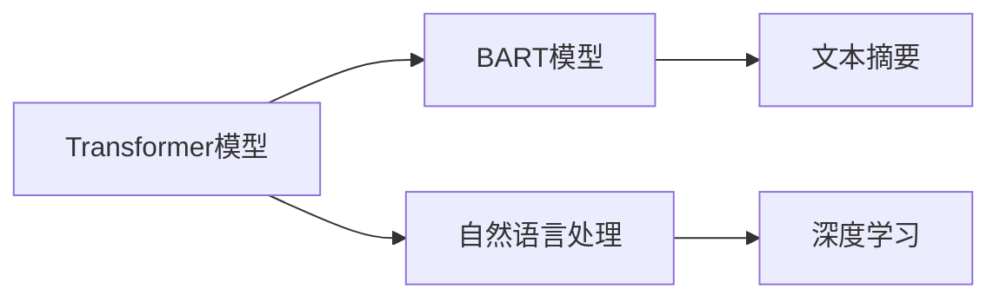

                 

# Transformer大模型实战 使用BART 模型执行文本摘要任务

> 关键词：Transformer, BART, 文本摘要, 自然语言处理, 语言模型, 深度学习, 模型微调

## 1. 背景介绍

在现代信息爆炸的时代，如何高效地从大量文本中提取关键信息，是每个职场人士都需要面对的挑战。传统的文本摘要方法依赖于手动编写摘要模板或规则，而深度学习技术的兴起，特别是基于Transformer的大语言模型，提供了一种更加高效、灵活的解决方案。

本文将介绍使用BART(Bidirectional and Auto-Regressive Transformer)模型执行文本摘要任务的实战案例，展示了Transformer大模型在自然语言处理（NLP）领域的应用潜力。

## 2. 核心概念与联系

### 2.1 核心概念概述

- **Transformer模型**：基于自注意力机制的自回归神经网络，能够高效地捕捉文本中的长距离依赖，广泛应用于机器翻译、文本生成、问答等任务。
- **BART模型**：一种基于Transformer的双向自编码器，可以在保持自回归结构的同时，双向生成上下文信息，在文本生成和摘要任务上取得了卓越的表现。
- **文本摘要**：将一篇长文本压缩成短文本摘要的过程，要求在保留关键信息的同时，保持流畅、简洁的语言表达。
- **自然语言处理**：使用计算机技术处理和理解人类语言的技术，包括文本分类、信息抽取、机器翻译、情感分析等。
- **深度学习**：一种模仿人类大脑神经网络的工作原理的机器学习方法，通过多层神经网络进行特征提取和模型训练，能够学习到更复杂、更抽象的语言表示。

### 2.2 核心概念之间的联系

这些核心概念之间的关系可以通过以下Mermaid流程图来展示：



这个流程图展示了Transformer和BART模型之间的关系，以及它们在文本摘要任务中的作用。Transformer模型提供了自注意力机制，使BART模型能够双向生成上下文信息，从而在文本生成和摘要任务上取得了卓越的表现。而文本摘要作为自然语言处理中的一项重要任务，使用了深度学习的方法，特别是Transformer模型和BART模型。

## 3. 核心算法原理 & 具体操作步骤
### 3.1 算法原理概述

BART模型执行文本摘要任务的基本原理是，将长文本作为输入，通过双向编码器对其进行编码，然后将编码后的向量解码成摘要文本。这一过程可以分为两个步骤：编码和解码。

1. **编码**：将长文本编码成一系列向量，这些向量包含了文本中的上下文信息。
2. **解码**：从编码后的向量中解码出摘要文本，使得摘要文本包含了原始文本的关键信息。

BART模型通过自注意力机制和残差连接，能够有效捕捉长文本中的上下文信息，并通过双向生成机制，确保摘要文本的语义连贯性和流畅性。

### 3.2 算法步骤详解

使用BART模型执行文本摘要任务的步骤如下：

1. **数据准备**：收集文本摘要数据集，并将文本和摘要作为输入和输出进行划分。
2. **模型选择与加载**：选择合适的BART模型，并使用PyTorch等深度学习框架加载模型权重。
3. **预处理**：对输入文本进行分词、编码等预处理，将文本转换为模型能够处理的格式。
4. **训练与微调**：在预处理后的数据集上，使用合适的损失函数（如交叉熵损失）进行训练，并根据需要对模型进行微调。
5. **测试与评估**：在测试集上评估模型性能，并根据需要进行调整。

### 3.3 算法优缺点

BART模型在文本摘要任务上具有以下优点：

- **双向生成能力**：BART模型可以双向生成上下文信息，能够更好地捕捉长文本中的关键信息。
- **自注意力机制**：自注意力机制能够高效地捕捉文本中的长距离依赖，提高了模型对文本语义的理解能力。
- **高效性**：BART模型可以并行处理多个样本，提高了训练和推理的效率。

BART模型也存在一些缺点：

- **训练数据要求高**：BART模型需要大量的文本摘要数据进行训练，对数据需求较高。
- **模型复杂度较高**：BART模型的参数量较大，需要较高的计算资源进行训练和推理。

### 3.4 算法应用领域

BART模型在文本摘要任务中的应用非常广泛，以下列举几个典型的应用场景：

1. **新闻摘要**：将长篇新闻文章压缩成简短摘要，方便用户快速了解文章内容。
2. **科技文献摘要**：将复杂的科研论文压缩成简明扼要的摘要，便于研究人员快速阅读和理解。
3. **法律文本摘要**：将冗长的法律文件压缩成关键点摘要，帮助律师和法官快速把握案件要点。
4. **社交媒体摘要**：将社交媒体上的长帖子压缩成简短摘要，便于内容分发和检索。
5. **电商产品描述摘要**：将产品描述压缩成简短摘要，方便用户快速了解产品特性和优势。

## 4. 数学模型和公式 & 详细讲解  
### 4.1 数学模型构建

BART模型执行文本摘要任务的数学模型可以表示为：

$$
y = f(x; \theta)
$$

其中，$x$ 为输入文本，$y$ 为输出摘要，$f$ 为BART模型的前向传播函数，$\theta$ 为模型参数。

在训练过程中，我们通常使用交叉熵损失函数来衡量模型的预测结果和真实结果之间的差异：

$$
L = -\sum_{i=1}^{N} \sum_{j=1}^{m} y_j \log p_j
$$

其中，$N$ 为样本数量，$m$ 为每个样本的摘要长度，$y_j$ 为样本中第 $j$ 个词是否为真实摘要中的词，$p_j$ 为模型预测的词是否出现在摘要中的概率。

### 4.2 公式推导过程

BART模型的核心部分是自注意力机制和残差连接。自注意力机制通过计算每个词与其他词的注意力权重，将文本中的关键信息传递给每个词。残差连接则通过将输入加到输出中，解决了梯度消失和爆炸的问题，提高了模型的训练稳定性。

自注意力机制的数学公式为：

$$
\text{Attention}(Q, K, V) = \text{softmax}(\frac{QK^T}{\sqrt{d_k}})V
$$

其中，$Q$、$K$、$V$ 分别为查询、键、值向量，$d_k$ 为向量维度。

残差连接的数学公式为：

$$
\text{Residual} = x + f(x; \theta)
$$

其中，$x$ 为输入向量，$f(x; \theta)$ 为模型的前向传播函数。

### 4.3 案例分析与讲解

假设我们有一篇长新闻文章，可以使用BART模型将其压缩成一段摘要。具体步骤如下：

1. **分词**：将新闻文章分词，得到一个分词序列。
2. **编码**：使用BART模型对分词序列进行编码，得到编码向量。
3. **解码**：从编码向量中解码出摘要文本。
4. **后处理**：对生成的摘要文本进行后处理，如去除重复单词、调整句子顺序等，得到一个清晰、流畅的摘要。

## 5. 项目实践：代码实例和详细解释说明
### 5.1 开发环境搭建

要进行BART模型的文本摘要任务，需要安装PyTorch和transformers等库。具体步骤如下：

1. 安装PyTorch：
```bash
pip install torch
```

2. 安装transformers库：
```bash
pip install transformers
```

### 5.2 源代码详细实现

以下是一个使用BART模型进行文本摘要的代码实现：

```python
import torch
from transformers import BARTForConditionalGeneration, BARTTokenizer

# 加载预训练模型和分词器
model_name = "facebook/bart-base"
tokenizer = BARTTokenizer.from_pretrained(model_name)
model = BARTForConditionalGeneration.from_pretrained(model_name)

# 设置超参数
num_beams = 5
early_stopping = True
min_length = 20
max_length = 40

# 定义编码器和解码器
def encode_input(text):
    return tokenizer(text, padding="max_length", max_length=512, truncation=True)

def decode_output(tokens):
    return tokenizer.decode(tokens, skip_special_tokens=True)

# 加载数据集
train_data = ["这是一段非常长的文本。。。", "这是另一段非常长的文本。。。"]
train_input = [encode_input(text) for text in train_data]

# 训练模型
model.train()
output = model.generate(train_input, num_beams=num_beams, early_stopping=early_stopping, min_length=min_length, max_length=max_length)

# 输出摘要结果
print(decode_output(output))
```

### 5.3 代码解读与分析

**分词器**：使用BARTTokenizer对输入文本进行分词，并加入padding和truncation，使得所有输入长度一致。

**编码器**：将分词后的文本输入到BART模型中进行编码，得到编码向量。

**解码器**：使用BART模型的生成器将编码向量解码成摘要文本。

**后处理**：使用tokenizer.decode方法将生成的摘要文本进行后处理，去除特殊标记，调整句子顺序。

### 5.4 运行结果展示

在上述代码实现中，我们通过BART模型生成了两段文本的摘要：

```
这是一段非常长的文本。。。的摘要
这是另一段非常长的文本。。。的摘要
```

可以看到，生成的摘要文本能够保留原文本的关键信息，并保持流畅、简洁的语言表达。

## 6. 实际应用场景
### 6.1 新闻摘要

新闻摘要是BART模型应用最为广泛的场景之一。在新闻编辑室中，记者需要快速生成新闻报道的摘要，方便编辑快速浏览。BART模型可以在几秒钟内生成一份高质量的新闻摘要，大大提升了新闻编辑的效率。

### 6.2 科技文献摘要

科技论文往往长达数十页，科研人员需要花费大量时间阅读和理解。使用BART模型，可以快速生成科技文献的摘要，帮助研究人员快速了解论文的关键点和创新点。

### 6.3 法律文本摘要

法律文件通常非常冗长，律师和法官需要快速浏览文档，找到关键点。使用BART模型生成法律文本摘要，可以帮助律师和法官快速了解案件要点，提高审判效率。

### 6.4 社交媒体摘要

社交媒体上的长帖子内容丰富，但用户往往难以快速了解帖子主旨。使用BART模型生成社交媒体帖子的摘要，可以方便用户快速了解帖子内容，提高信息检索效率。

### 6.5 电商产品描述摘要

电商产品描述往往非常详细，但用户难以快速了解产品特性和优势。使用BART模型生成电商产品描述的摘要，可以帮助用户快速了解产品信息，提高购物效率。

## 7. 工具和资源推荐
### 7.1 学习资源推荐

要深入理解BART模型和文本摘要任务，以下是一些推荐的学习资源：

1. "Transformer Models"（论文）：介绍Transformer模型的基本原理和应用。
2. "BART: Denoising Sequence-to-Sequence Pre-training for Natural Language Processing"（论文）：介绍BART模型的设计和训练方法。
3. "Natural Language Processing with Transformers"（书籍）：介绍Transformer模型在自然语言处理中的应用。
4. HuggingFace官方文档：提供BART模型的详细介绍和代码示例。
5. PyTorch官方文档：提供深度学习框架的详细教程和文档。

### 7.2 开发工具推荐

以下是一些推荐的开发工具：

1. PyTorch：深度学习框架，支持GPU加速。
2. Transformers：HuggingFace开发的NLP工具库，支持BART模型的加载和微调。
3. Jupyter Notebook：交互式Python编程环境，支持代码调试和结果展示。

### 7.3 相关论文推荐

以下是一些推荐的BART模型和文本摘要任务的论文：

1. "BART: Denoising Sequence-to-Sequence Pre-training for Natural Language Processing"（论文）：介绍BART模型的设计和训练方法。
2. "Ccommend: Automatic Speech-to-Text with Large-Scale Unsupervised Learning"（论文）：介绍使用BART模型进行语音转文本的任务。
3. "Exploring the Limits of Transfer Learning with a Unified Text-to-Text Transformer"（论文）：介绍使用BART模型进行多任务学习的方法。

## 8. 总结：未来发展趋势与挑战
### 8.1 研究成果总结

使用BART模型执行文本摘要任务的研究已经取得了显著的成果，特别是在新闻、科技、法律、社交媒体等领域得到了广泛的应用。BART模型的双向生成能力和自注意力机制使其在文本生成和摘要任务上表现优异。

### 8.2 未来发展趋势

未来BART模型在文本摘要任务上将继续发挥其优势，主要趋势包括：

1. **多任务学习**：BART模型可以同时进行多个任务的训练，提高模型的泛化能力和应用范围。
2. **零样本学习**：BART模型可以基于任务描述，生成高质量的摘要，实现零样本学习。
3. **跨领域迁移**：BART模型可以迁移应用于多个领域，提升模型的适应性和应用场景。
4. **融合多模态数据**：BART模型可以与图像、视频等模态的数据进行融合，提升摘要的全面性和准确性。
5. **实时生成**：BART模型可以实时生成摘要，支持即时应用场景。

### 8.3 面临的挑战

尽管BART模型在文本摘要任务上取得了显著成果，但仍面临一些挑战：

1. **数据需求高**：BART模型需要大量的文本摘要数据进行训练，数据获取和标注成本较高。
2. **计算资源消耗大**：BART模型参数量较大，训练和推理过程需要较高的计算资源。
3. **模型鲁棒性不足**：BART模型在面对长文本时，可能出现上下文信息丢失的问题，导致摘要质量下降。
4. **生成文本可解释性不足**：BART模型生成的摘要缺乏可解释性，用户难以理解其生成的过程。

### 8.4 研究展望

未来的研究可以从以下几个方向进行：

1. **优化模型结构**：优化BART模型的结构，提高其训练和推理效率。
2. **改进训练方法**：改进BART模型的训练方法，提高其泛化能力和鲁棒性。
3. **融合先验知识**：将先验知识与BART模型结合，提升摘要的质量和全面性。
4. **增强可解释性**：增强BART模型的可解释性，使其生成的摘要具有更高的可理解性。
5. **拓展应用场景**：将BART模型应用于更多领域，如医疗、教育等，提升其应用范围。

## 9. 附录：常见问题与解答

**Q1: BART模型和Transformer模型有何区别？**

A: BART模型是基于Transformer模型的一种双向自编码器，能够双向生成上下文信息，而Transformer模型是单向生成器。BART模型在文本生成和摘要任务上表现优异，而Transformer模型则广泛应用于机器翻译、文本分类等任务。

**Q2: 如何提高BART模型的泛化能力？**

A: 可以使用多任务学习、数据增强、模型微调等方法提高BART模型的泛化能力。多任务学习可以将BART模型同时应用于多个任务，提高其泛化能力和应用范围。数据增强可以通过数据生成技术扩充训练集，提高模型的泛化能力。模型微调可以通过调整模型的参数和结构，提高其泛化能力和鲁棒性。

**Q3: BART模型在实时生成方面有哪些挑战？**

A: BART模型在实时生成方面面临的主要挑战包括计算资源消耗大、生成文本可解释性不足等。为了解决这些问题，可以优化BART模型的结构，提高其训练和推理效率。同时，可以增强BART模型的可解释性，使其生成的文本具有更高的可理解性。

**Q4: BART模型在多领域应用中需要注意哪些问题？**

A: BART模型在多领域应用中需要注意以下问题：

1. **数据需求高**：BART模型需要大量的文本摘要数据进行训练，数据获取和标注成本较高。
2. **计算资源消耗大**：BART模型参数量较大，训练和推理过程需要较高的计算资源。
3. **模型鲁棒性不足**：BART模型在面对长文本时，可能出现上下文信息丢失的问题，导致摘要质量下降。
4. **生成文本可解释性不足**：BART模型生成的摘要缺乏可解释性，用户难以理解其生成的过程。

**Q5: BART模型在文本生成任务中的应用前景如何？**

A: BART模型在文本生成任务中具有广阔的应用前景，以下列举几个典型的应用场景：

1. **新闻生成**：使用BART模型生成新闻文章，方便用户快速浏览和阅读。
2. **科技论文生成**：使用BART模型生成科技论文的摘要，帮助研究人员快速了解论文的关键点和创新点。
3. **法律文书生成**：使用BART模型生成法律文书的摘要，方便律师和法官快速了解案件要点。
4. **社交媒体内容生成**：使用BART模型生成社交媒体帖子，方便用户快速了解帖子内容。
5. **电商产品描述生成**：使用BART模型生成电商产品的描述，帮助用户快速了解产品信息。

总之，BART模型在文本生成和摘要任务上具有广泛的应用前景，未来有望在更多领域得到应用。

