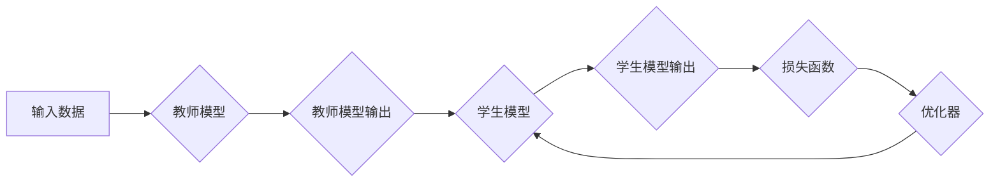

## 知识蒸馏如何助力模型的持续学习

> 关键词：知识蒸馏、模型压缩、持续学习、迁移学习、深度学习

## 1. 背景介绍

在深度学习领域，模型规模的不断扩大带来了强大的性能提升，但也带来了训练成本高、部署资源消耗大等问题。同时，随着数据和任务的多样化，模型需要具备持续学习的能力，即在新的数据和任务上不断提升性能，而不需重新训练整个模型。知识蒸馏 (Knowledge Distillation) 作为一种模型压缩和迁移学习技术，为解决这些问题提供了新的思路。

知识蒸馏的核心思想是将一个大型模型 (教师模型) 的知识“蒸馏”到一个小型模型 (学生模型) 中。教师模型通常经过充分训练，拥有丰富的知识和表达能力，而学生模型则更轻量级，更容易部署和更新。通过知识蒸馏，学生模型可以继承教师模型的知识，从而在较小的规模下获得接近教师模型的性能。

## 2. 核心概念与联系

知识蒸馏的核心概念是将教师模型的知识以一种可学习的形式传递给学生模型。这种知识可以包括：

* **特征表示:** 教师模型对输入数据的特征表示能力。
* **决策边界:** 教师模型在不同输入数据上的分类或预测决策边界。
* **参数值:** 教师模型的参数值，但通常不会直接复制，而是通过优化学生模型的参数来逼近教师模型的知识。

**知识蒸馏流程图:**



## 3. 核心算法原理 & 具体操作步骤

### 3.1  算法原理概述

知识蒸馏算法的基本原理是通过最小化教师模型输出和学生模型输出之间的差异来训练学生模型。这种差异通常用交叉熵损失函数来衡量。

### 3.2  算法步骤详解

1. **训练教师模型:** 首先，需要训练一个大型的教师模型，使其在目标任务上达到较高的性能。
2. **生成教师模型输出:** 使用教师模型对训练数据进行预测，得到教师模型的输出。
3. **训练学生模型:** 使用学生模型对训练数据进行预测，并计算学生模型输出与教师模型输出之间的交叉熵损失。
4. **优化学生模型参数:** 使用优化器（例如Adam）更新学生模型的参数，以最小化损失函数。
5. **重复步骤3和4:** 重复上述步骤，直到学生模型的性能达到预期的水平。

### 3.3  算法优缺点

**优点:**

* **模型压缩:** 可以将大型模型的知识压缩到小型模型中，降低模型的存储和计算成本。
* **性能提升:** 学生模型可以继承教师模型的知识，在较小的规模下获得接近教师模型的性能。
* **迁移学习:** 可以将教师模型在特定任务上的知识迁移到新的任务中，提高模型的泛化能力。

**缺点:**

* **教师模型依赖:** 学生模型的性能依赖于教师模型的质量和训练数据。
* **训练复杂度:** 训练学生模型需要使用教师模型的输出作为监督信号，增加了训练的复杂度。
* **知识丢失:** 在知识蒸馏过程中，可能会丢失一些教师模型的知识。

### 3.4  算法应用领域

知识蒸馏技术在以下领域具有广泛的应用:

* **移动设备:** 将大型模型压缩到移动设备上，实现高效的深度学习推理。
* **嵌入式系统:** 将深度学习模型部署到资源受限的嵌入式系统中。
* **边缘计算:** 将深度学习模型部署到边缘设备上，实现实时数据处理和决策。
* **医疗诊断:** 将医学图像分析模型压缩到移动设备上，方便医生进行远程诊断。
* **自然语言处理:** 将语言模型压缩到小型设备上，实现高效的文本生成和理解。

## 4. 数学模型和公式 & 详细讲解 & 举例说明

### 4.1  数学模型构建

知识蒸馏的目标是训练一个学生模型，使其输出与教师模型输出尽可能接近。可以使用交叉熵损失函数来衡量这种接近程度。

假设教师模型的输出为 $T$, 学生模型的输出为 $S$, 则交叉熵损失函数可以表示为:

$$
L_{KD} = -\sum_{i=1}^{N} \left[ T_i \log S_i + (1-T_i) \log (1-S_i) \right]
$$

其中 $N$ 是样本数量。

### 4.2  公式推导过程

交叉熵损失函数的推导过程如下:

1. **定义交叉熵:** 交叉熵是衡量两个概率分布之间的差异的指标。
2. **应用于分类问题:** 在分类问题中，教师模型和学生模型的输出都是概率分布，表示每个类别的预测概率。
3. **最小化损失:** 训练目标是最小化教师模型输出和学生模型输出之间的交叉熵差异。

### 4.3  案例分析与讲解

假设我们有一个图像分类任务，教师模型是一个大型的ResNet模型，学生模型是一个小型MobileNet模型。

在训练过程中，教师模型对图像进行分类，得到每个类别的预测概率分布 $T$. 学生模型也对图像进行分类，得到每个类别的预测概率分布 $S$. 

然后，使用交叉熵损失函数 $L_{KD}$ 计算教师模型输出和学生模型输出之间的差异。通过优化学生模型的参数，最小化损失函数，使得学生模型的输出 $S$ 尽可能接近教师模型的输出 $T$.

## 5. 项目实践：代码实例和详细解释说明

### 5.1  开发环境搭建

* Python 3.6+
* PyTorch 1.0+
* CUDA 10.0+ (可选，用于GPU加速)

### 5.2  源代码详细实现

```python
import torch
import torch.nn as nn
import torch.optim as optim

# 定义教师模型和学生模型
class TeacherModel(nn.Module):
    #...

class StudentModel(nn.Module):
    #...

# 实例化教师模型和学生模型
teacher_model = TeacherModel()
student_model = StudentModel()

# 定义损失函数和优化器
criterion = nn.CrossEntropyLoss()
optimizer = optim.Adam(student_model.parameters(), lr=0.001)

# 训练循环
for epoch in range(num_epochs):
    for inputs, labels in train_loader:
        # 前向传播
        teacher_outputs = teacher_model(inputs)
        student_outputs = student_model(inputs)

        # 计算损失
        teacher_loss = criterion(teacher_outputs, labels)
        student_loss = criterion(student_outputs, teacher_outputs)

        # 反向传播
        optimizer.zero_grad()
        student_loss.backward()
        optimizer.step()

        # 打印训练进度
        print(f'Epoch [{epoch+1}/{num_epochs}], Loss: {student_loss.item():.4f}')
```

### 5.3  代码解读与分析

* **模型定义:** 代码中定义了教师模型和学生模型，可以根据实际任务选择合适的模型架构。
* **损失函数:** 使用交叉熵损失函数来衡量教师模型输出和学生模型输出之间的差异。
* **优化器:** 使用Adam优化器来更新学生模型的参数。
* **训练循环:** 训练循环中，首先使用教师模型对输入数据进行预测，然后使用学生模型对输入数据进行预测，并计算损失。最后，使用优化器更新学生模型的参数。

### 5.4  运行结果展示

训练完成后，可以评估学生模型在测试集上的性能，并与教师模型的性能进行比较。

## 6. 实际应用场景

知识蒸馏技术在实际应用场景中具有广泛的应用前景:

### 6.1  移动设备应用

将大型模型压缩到移动设备上，实现高效的深度学习推理。例如，可以将图像识别模型压缩到手机上，实现实时图像识别功能。

### 6.2  嵌入式系统应用

将深度学习模型部署到资源受限的嵌入式系统中。例如，可以将语音识别模型压缩到智能音箱上，实现语音控制功能。

### 6.3  边缘计算应用

将深度学习模型部署到边缘设备上，实现实时数据处理和决策。例如，可以将视频分析模型部署到监控摄像头上，实现实时视频监控和报警。

### 6.4  未来应用展望

随着人工智能技术的不断发展，知识蒸馏技术将有更广泛的应用场景:

* **个性化学习:** 根据用户的学习习惯和需求，生成个性化的知识蒸馏模型。
* **联邦学习:** 在隐私保护的前提下，利用知识蒸馏技术进行模型训练和更新。
* **自动机器学习:** 利用知识蒸馏技术自动生成高效的深度学习模型。

## 7. 工具和资源推荐

### 7.1  学习资源推荐

* **论文:**
    * Hinton, G., Vinyals, O., & Dean, J. (2015). Distilling the knowledge in a neural network. arXiv preprint arXiv:1503.02531.
    * Buciluă, C., Caruana, R., & Niculescu-Mizil, A. (2006). Model compression. In Proceedings of the 23rd international conference on Machine learning (pp. 5-12).
* **博客:**
    * https://towardsdatascience.com/knowledge-distillation-a-powerful-technique-for-model-compression-a39191919197
    * https://blog.paperspace.com/knowledge-distillation-tutorial/

### 7.2  开发工具推荐

* **PyTorch:** https://pytorch.org/
* **TensorFlow:** https://www.tensorflow.org/

### 7.3  相关论文推荐

* **文献综述:**
    *  Li, Y., & Liu, Y. (2020). A survey on knowledge distillation. arXiv preprint arXiv:2006.04931.
* **最新研究:**
    *  Wang, Y., et al. (2021). Teacher-student distillation with dynamic knowledge transfer. In Proceedings of the IEEE/CVF Conference on Computer Vision and Pattern Recognition (pp. 11414-11423).
    *  Zhang, Y., et al. (2022). Self-distillation: A simple and effective approach for knowledge distillation. In Proceedings of the AAAI Conference on Artificial Intelligence (pp. 10213-10220).

## 8. 总结：未来发展趋势与挑战

### 8.1  研究成果总结

知识蒸馏技术取得了显著的成果，成功地将大型模型的知识压缩到小型模型中，提高了模型的效率和部署能力。

### 8.2  未来发展趋势

* **更有效的知识蒸馏方法:** 研究更有效的知识蒸馏方法，例如利用注意力机制、自监督学习等技术。
* **跨模态知识蒸馏:** 研究跨模态知识蒸馏，例如将图像和文本的知识进行融合。
* **动态知识蒸馏:** 研究动态知识蒸馏，根据任务需求动态调整知识蒸馏过程。

### 8.3  面临的挑战

* **知识蒸馏的理论基础:** 知识蒸馏的理论基础尚不完善，需要进一步研究如何更好地理解和量化知识。
* **知识蒸馏的泛化能力:** 知识蒸馏模型的泛化能力需要进一步提升，使其能够更好地适应新的数据和任务。
* **知识蒸馏的效率:** 知识蒸馏过程通常需要大量的计算资源，需要研究更高效的知识蒸馏算法。

### 8.4  研究展望

未来，知识蒸馏技术将继续发展，成为深度学习模型压缩和迁移学习的重要工具，推动人工智能技术的广泛应用。

## 9. 附录：常见问题与解答

* **Q1: 知识蒸馏和模型压缩有什么区别？**

*