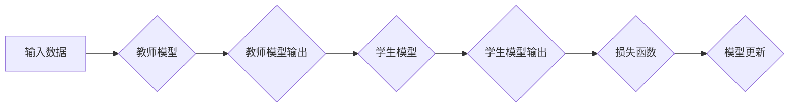

## 1. 背景介绍

在深度学习领域，模型鲁棒性一直是研究的热点问题。鲁棒性是指模型在面对噪声、异常值、数据分布变化等干扰时，能够保持稳定性能的能力。 然而，深度学习模型通常表现出较低的鲁棒性，容易受到对抗样本等攻击。

知识蒸馏是一种近年来兴起的技术，旨在通过将知识从一个大型模型（教师模型）迁移到一个小型模型（学生模型）中，从而提高学生模型的性能和鲁棒性。 

## 2. 核心概念与联系

知识蒸馏的核心思想是，大型模型不仅拥有较高的预测准确率，还蕴含着丰富的关于数据分布和特征表示的知识。通过将教师模型的知识传递给学生模型，可以帮助学生模型学习更有效的特征表示和决策边界，从而提升其性能和鲁棒性。

**知识蒸馏的流程图：**



**知识蒸馏的联系：**

* **教师模型:** 通常是一个大型、训练充分的模型，拥有较高的预测准确率。
* **学生模型:** 通常是一个小型、参数量更少的模型，需要从教师模型中学习知识。
* **知识迁移:** 将教师模型的知识（例如特征表示、决策边界）传递给学生模型的过程。
* **损失函数:** 用于衡量学生模型预测结果与教师模型预测结果之间的差异。

## 3. 核心算法原理 & 具体操作步骤

### 3.1  算法原理概述

知识蒸馏的核心算法原理是通过调整学生模型的训练目标，使其不仅要预测输入数据的类别，还要尽可能地模仿教师模型的输出概率分布。 

这种模仿行为可以帮助学生模型学习到教师模型更深层的知识，例如数据分布的特征和决策边界。

### 3.2  算法步骤详解

1. **训练教师模型:** 首先，需要训练一个大型的教师模型，使其在目标任务上达到较高的预测准确率。
2. **获取教师模型输出:** 使用训练好的教师模型对训练数据进行预测，并获取其输出的概率分布。
3. **定义学生模型:** 设计一个小型学生模型，其结构和参数量比教师模型小。
4. **调整损失函数:** 将传统的分类损失函数（例如交叉熵损失）与教师模型的输出概率分布相结合，构建一个新的损失函数。
5. **训练学生模型:** 使用新的损失函数训练学生模型，使其学习到教师模型的知识。

### 3.3  算法优缺点

**优点:**

* **提升模型性能:** 知识蒸馏可以有效提升学生模型的预测准确率。
* **减小模型规模:** 学生模型通常比教师模型小，可以节省计算资源和存储空间。
* **提高模型鲁棒性:** 通过学习教师模型的知识，学生模型可以获得更强的泛化能力和鲁棒性。

**缺点:**

* **依赖于教师模型:** 知识蒸馏需要一个训练好的教师模型作为基础，如果没有高质量的教师模型，效果可能不佳。
* **训练复杂度:** 知识蒸馏的训练过程比传统的模型训练更复杂，需要更精细的调参。

### 3.4  算法应用领域

知识蒸馏在许多领域都有应用，例如：

* **图像分类:** 将大型卷积神经网络的知识迁移到小型模型，用于手机图像识别等场景。
* **自然语言处理:** 将大型语言模型的知识迁移到小型模型，用于文本分类、机器翻译等任务。
* **语音识别:** 将大型语音识别模型的知识迁移到小型模型，用于语音助手、自动语音转录等应用。

## 4. 数学模型和公式 & 详细讲解 & 举例说明

### 4.1  数学模型构建

知识蒸馏的数学模型通常基于教师模型和学生模型的输出概率分布之间的差异。

假设教师模型的输出概率分布为 $p(y|x)$，学生模型的输出概率分布为 $q(y|x)$，其中 $x$ 为输入数据， $y$ 为输出类别。

知识蒸馏的目标是最小化 $p(y|x)$ 和 $q(y|x)$ 之间的差异。

### 4.2  公式推导过程

常用的知识蒸馏损失函数包括：

* **交叉熵损失:**

$$
L_{CE}(p,q) = - \sum_{y} p(y|x) \log q(y|x)
$$

* **KL散度损失:**

$$
L_{KL}(p,q) = \sum_{y} p(y|x) \log \frac{p(y|x)}{q(y|x)}
$$

其中，$L_{CE}$ 表示交叉熵损失，$L_{KL}$ 表示KL散度损失。

### 4.3  案例分析与讲解

假设我们训练一个图像分类模型，教师模型是一个大型的ResNet，学生模型是一个小型MobileNet。

在训练过程中，我们使用交叉熵损失函数来训练学生模型，同时加入一个KL散度损失项，将学生模型的输出概率分布与教师模型的输出概率分布进行比较。

通过这种方式，学生模型不仅学习到图像分类的知识，还学习到教师模型更深层的特征表示和决策边界，从而提升其性能和鲁棒性。

## 5. 项目实践：代码实例和详细解释说明

### 5.1  开发环境搭建

* Python 3.6+
* PyTorch 1.0+
* torchvision 0.2.1+

### 5.2  源代码详细实现

```python
import torch
import torch.nn as nn
import torch.optim as optim

# 定义教师模型和学生模型
class TeacherModel(nn.Module):
    #...

class StudentModel(nn.Module):
    #...

# 加载预训练的教师模型
teacher_model = TeacherModel()
teacher_model.load_state_dict(torch.load('teacher_model.pth'))

# 实例化学生模型
student_model = StudentModel()

# 定义损失函数
criterion = nn.CrossEntropyLoss()
# 定义知识蒸馏损失函数
temperature = 10  # 温度参数
knowledge_distillation_loss = nn.KLDivLoss(reduction='batchmean')

# 定义优化器
optimizer = optim.Adam(student_model.parameters(), lr=0.001)

# 训练循环
for epoch in range(num_epochs):
    for images, labels in train_loader:
        # 前向传播
        teacher_outputs = teacher_model(images)
        student_outputs = student_model(images)

        # 计算损失
        ce_loss = criterion(student_outputs, labels)
        kd_loss = knowledge_distillation_loss(
            F.log_softmax(student_outputs / temperature, dim=1),
            F.log_softmax(teacher_outputs / temperature, dim=1)
        )
        total_loss = ce_loss + kd_loss * 0.1  # 知识蒸馏损失权重

        # 反向传播
        optimizer.zero_grad()
        total_loss.backward()
        optimizer.step()

    # 打印训练进度
    print(f'Epoch [{epoch+1}/{num_epochs}], Loss: {total_loss.item():.4f}')

# 保存训练好的学生模型
torch.save(student_model.state_dict(),'student_model.pth')
```

### 5.3  代码解读与分析

* 代码首先定义了教师模型和学生模型，并加载预训练的教师模型。
* 然后，定义了交叉熵损失函数和知识蒸馏损失函数，并设置了知识蒸馏损失的权重。
* 接着，使用Adam优化器对学生模型进行训练。
* 在训练循环中，首先使用教师模型和学生模型对输入数据进行前向传播，然后计算损失函数值。
* 最后，使用反向传播算法更新学生模型的参数。

### 5.4  运行结果展示

通过训练，学生模型的性能将提升，并且在面对噪声、异常值等干扰时表现更鲁棒。

## 6. 实际应用场景

知识蒸馏在实际应用场景中具有广泛的应用前景，例如：

* **移动设备上的图像识别:** 将大型图像识别模型的知识迁移到小型模型，可以降低移动设备的计算资源消耗，提高识别速度。
* **嵌入式系统的语音识别:** 将大型语音识别模型的知识迁移到小型模型，可以降低嵌入式系统的功耗，延长电池寿命。
* **边缘计算中的自然语言处理:** 将大型自然语言处理模型的知识迁移到小型模型，可以提高边缘计算设备的处理能力，降低网络延迟。

### 6.4  未来应用展望

随着深度学习模型规模的不断增大，知识蒸馏技术将发挥越来越重要的作用。未来，知识蒸馏技术可能会应用于以下领域：

* **自动驾驶:** 将大型自动驾驶模型的知识迁移到小型模型，可以降低自动驾驶系统的计算成本，提高实时性。
* **医疗诊断:** 将大型医疗诊断模型的知识迁移到小型模型，可以提高医疗诊断的效率和准确性。
* **个性化推荐:** 将大型个性化推荐模型的知识迁移到小型模型，可以提高推荐系统的个性化程度。

## 7. 工具和资源推荐

### 7.1  学习资源推荐

* **论文:**
    * Hinton, G., Vinyals, O., & Dean, J. (2015). Distilling the knowledge in a neural network. arXiv preprint arXiv:1503.02531.
    * Buciluă, C., Caruana, R., & Niculescu-Mizil, A. (2006). Model compression by knowledge distillation. In Proceedings of the 12th international conference on machine learning (pp. 107-114).
* **博客:**
    * https://towardsdatascience.com/knowledge-distillation-a-powerful-technique-for-model-compression-99a299141190
    * https://blog.paperspace.com/knowledge-distillation-tutorial/

### 7.2  开发工具推荐

* **PyTorch:** https://pytorch.org/
* **TensorFlow:** https://www.tensorflow.org/

### 7.3  相关论文推荐

* **Teacher-Student Generative Adversarial Networks**
* **Multi-Teacher Knowledge Distillation**
* **Adaptive Knowledge Distillation**

## 8. 总结：未来发展趋势与挑战

### 8.1  研究成果总结

知识蒸馏技术取得了显著的成果，有效提升了模型性能和鲁棒性，并降低了模型规模。

### 8.2  未来发展趋势

未来，知识蒸馏技术将朝着以下方向发展：

* **更有效的知识迁移方法:** 研究更有效的知识迁移方法，例如跨模态知识蒸馏、自监督知识蒸馏等。
* **更灵活的知识蒸馏框架:** 设计更灵活的知识蒸馏框架，可以适应不同类型的模型和任务。
* **知识蒸馏的自动化:** 研究知识蒸馏的自动化方法，例如自动选择教师模型、自动调参等。

### 8.3  面临的挑战

知识蒸馏技术也面临一些挑战：

* **教师模型的选择:** 选择合适的教师模型对于知识蒸馏效果至关重要。
* **知识蒸馏的效率:** 知识蒸馏的训练过程通常比传统的模型训练更耗时。
* **知识蒸馏的解释性:** 知识蒸馏的机制尚不完全清楚，需要进一步研究。

### 8.4  研究展望

未来，我们将继续研究知识蒸馏技术，探索其在更多领域中的应用，并解决其面临的挑战。


## 9. 附录：常见问题与解答

* **Q: 知识蒸馏的训练过程需要多长时间？**

* **A:** 知识蒸馏的训练时间取决于模型规模、数据集大小、硬件配置等因素。一般来说，知识蒸馏的训练时间比传统的模型训练时间长