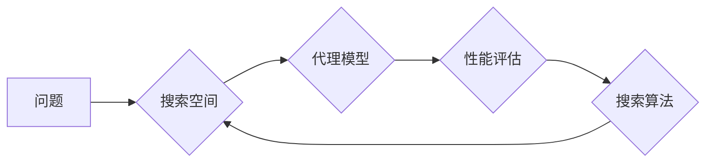

## 神经架构搜索面临的挑战：搜索空间设计

> 关键词：神经架构搜索、搜索空间、深度学习、自动机器学习、优化算法、效能、可解释性

### 1. 背景介绍

深度学习近年来取得了令人瞩目的成就，在图像识别、自然语言处理、语音识别等领域取得了突破性的进展。然而，深度学习模型的性能很大程度上依赖于人工设计的网络架构。手工设计网络架构是一个耗时费力、需要专业知识的过程，并且难以保证找到最优的架构。

神经架构搜索 (NAS) 应运而生，它利用机器学习算法自动搜索最优的网络架构，从而解放人类的设计者，提高模型性能。NAS 算法通常通过一个代理模型来评估不同架构的性能，并根据评估结果进行搜索和优化。

### 2. 核心概念与联系

#### 2.1 核心概念

* **神经网络架构:** 指的是神经网络的层数、节点数量、激活函数、连接方式等结构组成。
* **搜索空间:**  指所有可能的网络架构的集合，这是一个巨大的搜索空间，包含了无数种可能的组合。
* **代理模型:**  一个用来快速评估网络架构性能的模型，通常是一个较小的网络，可以用来替代训练完整的网络进行评估。
* **搜索算法:**  用于探索搜索空间，找到最优网络架构的算法，例如遗传算法、强化学习等。

#### 2.2 架构关系



### 3. 核心算法原理 & 具体操作步骤

#### 3.1 算法原理概述

NAS 算法的核心是利用代理模型和搜索算法来探索搜索空间，找到最优的网络架构。代理模型可以快速评估不同架构的性能，而搜索算法则根据评估结果进行搜索和优化。

常见的 NAS 算法包括：

* **进化算法:**  通过模拟自然进化过程，从初始的随机架构开始，不断进行变异、交叉和选择，最终得到最优的架构。
* **强化学习:**  将网络架构搜索问题视为一个马尔可夫决策过程，训练一个代理模型作为“智能体”，通过与环境交互，学习到最优的架构搜索策略。

#### 3.2 算法步骤详解

以进化算法为例，NAS 算法的具体步骤如下：

1. **初始化:**  随机生成初始的网络架构集合。
2. **评估:**  使用代理模型评估每个架构的性能。
3. **选择:**  根据性能选择部分优秀的架构作为父代。
4. **变异:**  对父代架构进行变异操作，生成新的架构。
5. **交叉:**  将两个父代架构进行交叉操作，生成新的架构。
6. **重复:**  重复步骤 2-5，直到达到终止条件。

#### 3.3 算法优缺点

**优点:**

* 自动搜索，解放人类设计者。
* 能够找到超越手工设计的网络架构。

**缺点:**

* 计算资源消耗大。
* 训练时间长。
* 难以解释搜索过程。

#### 3.4 算法应用领域

* **图像识别:**  搜索更有效的图像分类、目标检测、图像分割网络架构。
* **自然语言处理:**  搜索更有效的文本分类、机器翻译、文本生成网络架构。
* **语音识别:**  搜索更有效的语音识别、语音合成网络架构。

### 4. 数学模型和公式 & 详细讲解 & 举例说明

#### 4.1 数学模型构建

NAS 算法通常使用代理模型来评估网络架构的性能。代理模型可以是一个简单的网络，例如一个全连接层或卷积层，它可以快速地评估不同架构的性能。

#### 4.2 公式推导过程

代理模型的性能评估通常使用一个损失函数，例如交叉熵损失函数。损失函数的值越小，模型的性能越好。

$$
Loss = -\sum_{i=1}^{N} y_i \log(\hat{y}_i)
$$

其中：

* $N$ 是样本数量。
* $y_i$ 是真实标签。
* $\hat{y}_i$ 是模型预测的概率。

#### 4.3 案例分析与讲解

例如，在图像分类任务中，代理模型可以是一个简单的全连接网络，它接受图像特征作为输入，输出每个类别的概率。损失函数可以是交叉熵损失函数，它衡量模型预测的概率与真实标签之间的差异。

通过训练代理模型，我们可以得到一个可以快速评估不同网络架构性能的模型。

### 5. 项目实践：代码实例和详细解释说明

#### 5.1 开发环境搭建

* Python 3.6+
* TensorFlow/PyTorch
* CUDA

#### 5.2 源代码详细实现

```python
# 使用 TensorFlow 实现一个简单的 NAS 算法

import tensorflow as tf

# 定义代理模型
class ProxyModel(tf.keras.Model):
    def __init__(self):
        super(ProxyModel, self).__init__()
        self.dense1 = tf.keras.layers.Dense(128, activation='relu')
        self.dense2 = tf.keras.layers.Dense(10, activation='softmax')

    def call(self, inputs):
        x = self.dense1(inputs)
        return self.dense2(x)

# 定义搜索空间
search_space = {
    'dense1_units': [64, 128, 256],
    'dense2_units': [10, 20, 50],
}

# 定义代理模型训练函数
def train_proxy_model(model, data, epochs):
    model.compile(optimizer='adam', loss='categorical_crossentropy', metrics=['accuracy'])
    model.fit(data['x_train'], data['y_train'], epochs=epochs)

# 定义搜索算法
def search_algorithm(search_space, data, epochs):
    best_model = None
    best_loss = float('inf')
    for config in search_space:
        model = ProxyModel()
        # 根据 config 设置模型参数
        #...
        train_proxy_model(model, data, epochs)
        loss = model.evaluate(data['x_test'], data['y_test'])[0]
        if loss < best_loss:
            best_loss = loss
            best_model = model
    return best_model

# 使用搜索算法搜索最优模型
best_model = search_algorithm(search_space, data, epochs=10)

# 使用最优模型进行预测
predictions = best_model.predict(data['x_test'])
```

#### 5.3 代码解读与分析

* 代码首先定义了一个代理模型 `ProxyModel`，它是一个简单的全连接网络。
* 然后定义了一个搜索空间 `search_space`，它包含了代理模型参数的可能取值。
* `train_proxy_model` 函数用于训练代理模型。
* `search_algorithm` 函数用于搜索最优模型，它遍历搜索空间，训练每个模型，并根据损失函数的值选择最优模型。
* 最后，使用搜索到的最优模型进行预测。

#### 5.4 运行结果展示

运行结果将显示最优模型的性能，例如准确率、损失函数值等。

### 6. 实际应用场景

NAS 已经应用于许多实际场景，例如：

* **图像分类:**  搜索更有效的图像分类网络架构，例如 MobileNet、EfficientNet 等。
* **目标检测:**  搜索更有效的目标检测网络架构，例如 YOLO、Faster R-CNN 等。
* **语音识别:**  搜索更有效的语音识别网络架构，例如 Transformer、WaveNet 等。

#### 6.4 未来应用展望

NAS 作为自动机器学习的重要组成部分，未来将有更广泛的应用场景，例如：

* **个性化推荐:**  搜索个性化推荐系统的最佳网络架构。
* **医疗诊断:**  搜索医疗图像诊断的最佳网络架构。
* **药物研发:**  搜索药物研发过程中的最佳网络架构。

### 7. 工具和资源推荐

#### 7.1 学习资源推荐

* **论文:**  
    * Neural Architecture Search with Reinforcement Learning
    * Efficient Neural Architecture Search via Parameter Sharing
* **博客:**  
    * https://towardsdatascience.com/neural-architecture-search-nas-a-comprehensive-guide-59474911949c
    * https://blog.paperspace.com/neural-architecture-search-nas/

#### 7.2 开发工具推荐

* **TensorFlow:**  https://www.tensorflow.org/
* **PyTorch:**  https://pytorch.org/
* **AutoML:**  https://automl.google.ai/

#### 7.3 相关论文推荐

* **论文:**  
    * Neural Architecture Search with Reinforcement Learning
    * Efficient Neural Architecture Search via Parameter Sharing
    * DARTS: Differentiable Architecture Search

### 8. 总结：未来发展趋势与挑战

#### 8.1 研究成果总结

NAS 已经取得了显著的成果，在许多任务上都取得了超越手工设计的网络架构的性能。

#### 8.2 未来发展趋势

* **效率提升:**  开发更有效的 NAS 算法，降低计算资源消耗和训练时间。
* **可解释性增强:**  提高 NAS 算法的可解释性，帮助人类理解搜索过程。
* **应用场景拓展:**  将 NAS 应用到更多实际场景，例如个性化推荐、医疗诊断等。

#### 8.3 面临的挑战

* **搜索空间规模:**  深度学习模型的搜索空间非常庞大，难以穷尽搜索。
* **计算资源限制:**  NAS 算法通常需要大量的计算资源，难以在资源有限的设备上进行训练。
* **可解释性问题:**  NAS 算法的搜索过程难以解释，难以理解为什么选择特定的架构。

#### 8.4 研究展望

未来，NAS 研究将继续探索更有效的算法、更强大的硬件平台和更广泛的应用场景，最终实现自动机器学习的自动化和智能化。

### 9. 附录：常见问题与解答

* **Q: NAS 算法真的能找到比手工设计更好的网络架构吗？**

* **A:**  是的，许多研究表明，NAS 算法能够找到超越手工设计的网络架构，尤其是在搜索空间足够大、算法足够有效的情况下。

* **Q: NAS 算法的计算资源消耗很大吗？**

* **A:**  是的，NAS 算法通常需要大量的计算资源，特别是对于大型的搜索空间和复杂的模型。

* **Q: NAS 算法的搜索过程难以解释吗？**

* **A:**  是的，NAS 算法的搜索过程通常是一个黑箱，难以理解为什么选择特定的架构。

* **Q: NAS 算法的应用场景有哪些？**

* **A:**  NAS 已经应用于许多实际场景，例如图像分类、目标检测、语音识别等。

作者：禅与计算机程序设计艺术 / Zen and the Art of Computer Programming


