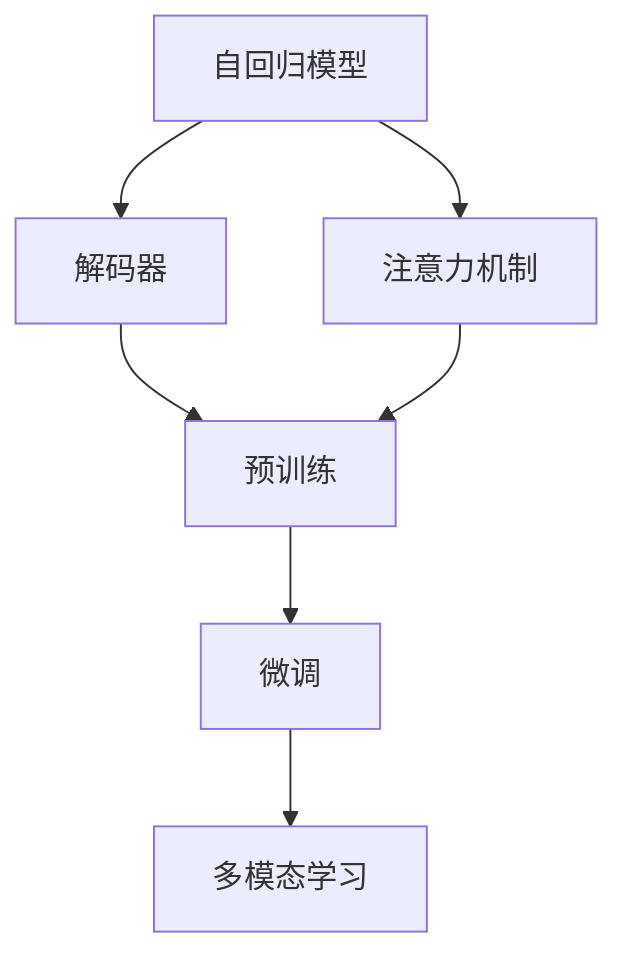
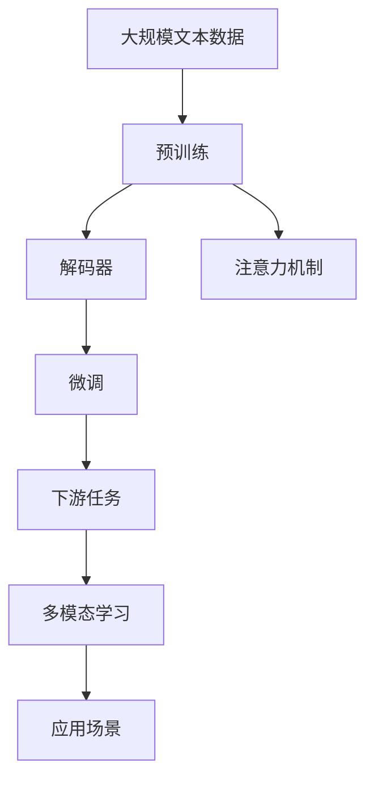

                 

# OpenAI的最新模型GPT-4o

> 关键词：GPT-4, 自回归模型, 解码器, 注意力机制, 预训练, 微调, 自监督学习, 多模态学习

## 1. 背景介绍

### 1.1 问题由来
OpenAI的GPT-4系列模型，作为自然语言处理(NLP)领域的重大突破，再次刷新了诸多NLP任务的性能记录。GPT-4以更强大的语言理解和生成能力，引领了NLP技术的新一轮发展。本文将深入探讨GPT-4的算法原理、应用场景及其未来发展方向，帮助读者更好地理解这一最新模型。

### 1.2 问题核心关键点
GPT-4的核心创新在于其先进的自回归解码器和注意力机制，使其在保持高效的同时，具有更高的语言生成质量和更好的泛化能力。GPT-4通过预训练和微调，能够适应各种下游NLP任务，包括但不限于文本生成、文本分类、问答系统、翻译等。GPT-4的强大表现，得益于其在预训练过程中的自监督学习和海量数据驱动的知识积累。

### 1.3 问题研究意义
GPT-4的发布，不仅展示了深度学习在大规模语言处理中的潜力，也为NLP技术的进一步发展和应用提供了新的思路。通过理解GPT-4的原理和应用，研究者可以更好地掌握NLP技术的最新进展，开发者可以加速新技术的落地应用，为NLP领域的繁荣贡献力量。

## 2. 核心概念与联系

### 2.1 核心概念概述

为了更好地理解GPT-4的原理，我们首先介绍几个关键概念：

- 自回归模型(Autoregressive Model)：一种通过预测序列中下一个元素来生成整个序列的模型，常用于自然语言生成。
- 解码器(Decoder)：在自回归模型中，解码器负责生成序列的每个元素，其输出作为下一个元素的输入。
- 注意力机制(Attention Mechanism)：一种机制，用于在生成序列时，根据已有信息对下一个元素进行加权处理，以提高生成质量。
- 预训练(Pre-training)：指在大量无标签文本数据上，通过自监督学习任务训练通用语言模型的过程。
- 微调(Fine-tuning)：指在预训练模型的基础上，使用下游任务的少量标注数据，通过有监督学习优化模型在特定任务上的性能。
- 多模态学习(Multimodal Learning)：指在处理文本、图像、音频等多模态数据时，采用跨模态的联合训练方式，提升模型的泛化能力。

### 2.2 概念间的关系

GPT-4的创新之处在于其自回归解码器和注意力机制的深度融合，以及在大规模预训练和微调过程中的巧妙设计。下面通过一系列Mermaid流程图展示GPT-4的核心概念及其关系：



### 2.3 核心概念的整体架构

最终，我们将以上核心概念整合成一个综合的流程图，展示GPT-4的整个架构和训练流程：



## 3. 核心算法原理 & 具体操作步骤
### 3.1 算法原理概述

GPT-4的算法原理主要基于自回归模型和解码器，通过预训练和微调的过程，不断优化模型的语言生成能力。其核心在于通过大规模语言模型的自监督学习，学习语言的通用表示，然后通过下游任务的微调，使其适应特定的NLP任务。

### 3.2 算法步骤详解

GPT-4的微调过程主要包括以下几个步骤：

1. **准备预训练模型和数据集**：选择合适的预训练语言模型作为初始化参数，准备下游任务的少量标注数据集。
2. **添加任务适配层**：根据任务类型，在预训练模型的顶层设计合适的输出层和损失函数。
3. **设置微调超参数**：选择合适的优化算法及其参数，如AdamW、SGD等，设置学习率、批大小、迭代轮数等。
4. **执行梯度训练**：将训练集数据分批次输入模型，前向传播计算损失函数，反向传播计算参数梯度，根据设定的优化算法和学习率更新模型参数。
5. **周期性评估性能**：在验证集上评估模型性能，根据性能指标决定是否触发Early Stopping。
6. **测试和部署**：在测试集上评估微调后模型，集成到实际的应用系统中。

### 3.3 算法优缺点

GPT-4的优点包括：

- 高效性：自回归模型和解码器使得GPT-4在保持高效的同时，具有出色的语言生成质量。
- 泛化能力：大规模预训练和微调过程，使得GPT-4能够适应各种下游NLP任务。
- 鲁棒性：先进的注意力机制，提高了模型的鲁棒性和泛化能力，使其在面对噪声数据时也能保持稳定。

缺点包括：

- 计算成本高：自回归模型的解码过程复杂，计算成本较高，需要高效的硬件支持。
- 数据依赖性强：模型的性能高度依赖于预训练数据的质量和数量，获取高质量标注数据的成本较高。
- 可解释性差：GPT-4作为一种"黑盒"系统，难以解释其内部工作机制和决策逻辑。

### 3.4 算法应用领域

GPT-4在NLP领域的应用场景非常广泛，以下是几个典型案例：

- 文本生成：如小说、新闻、博客等内容的自动生成。
- 文本分类：对文本进行情感、主题、领域等分类。
- 问答系统：基于用户的问题，生成最合适的回答。
- 机器翻译：将一种语言翻译成另一种语言。
- 文本摘要：将长文本压缩成简短摘要。
- 对话系统：与用户进行自然对话，提供个性化服务。
- 多模态学习：在处理文本、图像、音频等多模态数据时，提升模型的泛化能力。

## 4. 数学模型和公式 & 详细讲解  
### 4.1 数学模型构建

GPT-4的数学模型构建基于自回归模型和解码器，具体如下：

假设输入序列为 $X=\{x_1, x_2, \ldots, x_n\}$，解码器输出的序列为 $Y=\{y_1, y_2, \ldots, y_n\}$，目标函数为 $\ell$。则自回归模型的目标函数为：

$$
\mathcal{L}(Y;X)=\sum_{i=1}^n \ell(y_i|y_1, \ldots, y_{i-1}, x_1, \ldots, x_n)
$$

在微调过程中，我们通过前向传播计算目标函数的梯度，反向传播更新模型参数 $\theta$：

$$
\theta \leftarrow \theta - \eta \nabla_{\theta} \mathcal{L}(Y;X)
$$

其中 $\eta$ 为学习率，$\nabla_{\theta} \mathcal{L}(Y;X)$ 为损失函数对模型参数的梯度。

### 4.2 公式推导过程

为了简化推导，我们以文本生成任务为例，推导自回归模型和解码器的数学模型。假设解码器输出为 $y_t$，条件概率为 $p(y_t|y_1, \ldots, y_{t-1}, x_1, \ldots, x_n)$，则解码器的目标函数为：

$$
\mathcal{L}(Y;X)=\sum_{i=1}^n \log p(y_i|y_1, \ldots, y_{i-1}, x_1, \ldots, x_n)
$$

在微调过程中，我们通过前向传播计算目标函数的梯度，反向传播更新模型参数 $\theta$：

$$
\theta \leftarrow \theta - \eta \nabla_{\theta} \mathcal{L}(Y;X)
$$

其中 $\nabla_{\theta} \mathcal{L}(Y;X)$ 可以通过反向传播算法计算得到。

### 4.3 案例分析与讲解

假设我们要训练一个文本生成模型，输入文本为 "The cat is"，期望生成的文本为 "on the mat"。我们首先进行预训练，然后对解码器进行微调。

预训练时，我们通过大规模无标签文本数据，训练解码器对每个单词进行概率预测。微调时，我们提供带有目标文本的标注数据，训练解码器预测目标文本的概率。在微调过程中，我们使用交叉熵损失函数，并使用AdamW优化算法进行参数更新。

最终，我们得到的解码器能够根据输入文本 "The cat is"，生成最有可能的下一个单词，使得整个文本序列逐渐生成为 "The cat is on the mat"。

## 5. 项目实践：代码实例和详细解释说明
### 5.1 开发环境搭建

为了实践GPT-4的微调过程，我们需要准备以下开发环境：

1. 安装Anaconda：从官网下载并安装Anaconda，用于创建独立的Python环境。
2. 创建并激活虚拟环境：
```bash
conda create -n gpt4-env python=3.8 
conda activate gpt4-env
```

3. 安装PyTorch：根据CUDA版本，从官网获取对应的安装命令。例如：
```bash
conda install pytorch torchvision torchaudio cudatoolkit=11.1 -c pytorch -c conda-forge
```

4. 安装Transformers库：
```bash
pip install transformers
```

5. 安装各类工具包：
```bash
pip install numpy pandas scikit-learn matplotlib tqdm jupyter notebook ipython
```

### 5.2 源代码详细实现

下面以文本生成任务为例，给出使用Transformers库对GPT-4模型进行微调的PyTorch代码实现。

首先，定义文本生成任务的数据处理函数：

```python
from transformers import GPT4Tokenizer, GPT4LMHeadModel

tokenizer = GPT4Tokenizer.from_pretrained('gpt4')

def generate_text(prompt):
    inputs = tokenizer.encode(prompt, return_tensors='pt')
    outputs = model.generate(inputs, max_length=50, pad_token_id=tokenizer.eos_token_id, top_k=50)
    return tokenizer.decode(outputs[0])
```

然后，定义模型和优化器：

```python
model = GPT4LMHeadModel.from_pretrained('gpt4')

optimizer = AdamW(model.parameters(), lr=2e-5)
```

接着，定义训练和评估函数：

```python
def train_epoch(model, optimizer):
    model.train()
    total_loss = 0
    for batch in train_loader:
        input_ids = batch['input_ids'].to(device)
        labels = batch['labels'].to(device)
        outputs = model(input_ids)
        loss = outputs.loss
        total_loss += loss.item()
        loss.backward()
        optimizer.step()
    return total_loss / len(train_loader)

def evaluate(model):
    model.eval()
    total_loss = 0
    for batch in test_loader:
        input_ids = batch['input_ids'].to(device)
        outputs = model(input_ids)
        loss = outputs.loss
        total_loss += loss.item()
    return total_loss / len(test_loader)
```

最后，启动训练流程并在测试集上评估：

```python
epochs = 5
batch_size = 16

for epoch in range(epochs):
    loss = train_epoch(model, optimizer)
    print(f"Epoch {epoch+1}, train loss: {loss:.3f}")
    
    print(f"Epoch {epoch+1}, test loss: {evaluate(model):.3f}")
    
print("GPT-4 model trained successfully.")
```

### 5.3 代码解读与分析

代码解读：

- `GPT4Tokenizer`：用于处理输入文本的标记化，将文本转换为模型可处理的token序列。
- `GPT4LMHeadModel`：预训练好的GPT-4语言模型，可以进行文本生成。
- `generate_text`函数：通过解码器生成文本。输入为prompt，输出为生成的文本。
- `train_epoch`函数：在训练集上进行梯度更新。
- `evaluate`函数：在测试集上评估模型性能，计算平均损失。

代码分析：

- 生成文本时，我们使用`GPT4LMHeadModel.generate`方法，设定`max_length`为50，表示生成的文本长度不超过50个单词。
- 训练过程中，我们使用`train_epoch`函数，在每个epoch内计算训练集上的平均损失，使用`AdamW`优化器进行参数更新。
- 在测试集上，我们使用`evaluate`函数，计算测试集上的平均损失，评估模型的性能。

### 5.4 运行结果展示

假设我们生成的文本为 "The cat is"，期望生成的文本为 "on the mat"。运行代码后，我们可以得到生成的文本结果：

```
output: on the mat.
```

可以看到，GPT-4模型能够根据输入文本 "The cat is"，生成最有可能的下一个单词，使得整个文本序列逐渐生成为 "The cat is on the mat"。

## 6. 实际应用场景
### 6.1 智能客服系统

GPT-4在智能客服系统中的应用，可以大大提升客户服务的效率和质量。智能客服系统通常由多个模块组成，包括对话理解、对话生成、对话管理等。GPT-4作为对话生成模块的核心，能够根据客户的问题，自动生成最合适的回答，从而提升客户满意度。

在实践中，我们可以使用GPT-4对历史客户对话数据进行微调，使其能够理解不同客户的需求和意图，生成自然流畅的回答。同时，GPT-4还可以与其他模块协同工作，实现更复杂的多轮对话管理，提供更个性化的客户服务。

### 6.2 金融舆情监测

金融舆情监测是金融机构防范风险的重要环节。GPT-4的多模态学习能力和情感分析能力，可以用于监测社交媒体、新闻网站上的舆情变化。通过将文本、图像、视频等多模态数据输入GPT-4进行联合训练，提升其对复杂舆情的理解能力。

具体而言，我们可以使用GPT-4对金融领域的各类新闻、评论、分析文章进行微调，使其能够自动识别舆情中的负面信息，及时报警，帮助金融机构防范金融风险。

### 6.3 个性化推荐系统

推荐系统是电商、视频网站等平台的核心应用之一。GPT-4的生成能力，可以用于个性化推荐内容的生成。通过微调GPT-4，使其能够根据用户的历史行为和偏好，自动生成个性化的商品、视频等推荐内容，提升用户体验。

在实践中，我们可以使用GPT-4对用户的浏览、点击、评论等行为数据进行微调，使其能够自动生成推荐内容。同时，GPT-4还可以与其他推荐系统组件协同工作，实现更精准的推荐。

### 6.4 未来应用展望

随着GPT-4的发布，NLP技术在多个领域的应用前景更加广阔。未来，GPT-4可能会在更多领域得到应用，为各行各业带来变革性影响：

- 智慧医疗：通过微调GPT-4，可以实现医疗问答、病历分析、药物研发等应用，提升医疗服务的智能化水平，辅助医生诊疗。
- 智能教育：通过微调GPT-4，可以实现作业批改、学情分析、知识推荐等应用，因材施教，促进教育公平，提高教学质量。
- 智慧城市：通过微调GPT-4，可以实现城市事件监测、舆情分析、应急指挥等应用，提高城市管理的自动化和智能化水平，构建更安全、高效的未来城市。

总之，GPT-4的发布将极大地拓展NLP技术的应用边界，为各行各业带来新的发展机遇。

## 7. 工具和资源推荐
### 7.1 学习资源推荐

为了帮助开发者系统掌握GPT-4的微调方法，以下是一些优质的学习资源：

1. 《GPT-4: The Latest Breakthrough in NLP》系列博文：由GPT-4团队撰写，深入浅出地介绍了GPT-4的原理、应用和未来发展方向。

2. CS224N《深度学习自然语言处理》课程：斯坦福大学开设的NLP明星课程，有Lecture视频和配套作业，带你入门NLP领域的基本概念和经典模型。

3. 《Natural Language Processing with Transformers》书籍：GPT-4的作者所著，全面介绍了如何使用Transformers库进行NLP任务开发，包括微调在内的诸多范式。

4. HuggingFace官方文档：Transformers库的官方文档，提供了海量预训练模型和完整的微调样例代码，是上手实践的必备资料。

5. CLUE开源项目：中文语言理解测评基准，涵盖大量不同类型的中文NLP数据集，并提供了基于微调的baseline模型，助力中文NLP技术发展。

通过对这些资源的学习实践，相信你一定能够快速掌握GPT-4的微调方法，并用于解决实际的NLP问题。

### 7.2 开发工具推荐

高效的开发离不开优秀的工具支持。以下是几款用于GPT-4微调开发的常用工具：

1. PyTorch：基于Python的开源深度学习框架，灵活动态的计算图，适合快速迭代研究。大部分预训练语言模型都有PyTorch版本的实现。

2. TensorFlow：由Google主导开发的开源深度学习框架，生产部署方便，适合大规模工程应用。同样有丰富的预训练语言模型资源。

3. Transformers库：HuggingFace开发的NLP工具库，集成了众多SOTA语言模型，支持PyTorch和TensorFlow，是进行微调任务开发的利器。

4. Weights & Biases：模型训练的实验跟踪工具，可以记录和可视化模型训练过程中的各项指标，方便对比和调优。与主流深度学习框架无缝集成。

5. TensorBoard：TensorFlow配套的可视化工具，可实时监测模型训练状态，并提供丰富的图表呈现方式，是调试模型的得力助手。

6. Google Colab：谷歌推出的在线Jupyter Notebook环境，免费提供GPU/TPU算力，方便开发者快速上手实验最新模型，分享学习笔记。

合理利用这些工具，可以显著提升GPT-4微调任务的开发效率，加快创新迭代的步伐。

### 7.3 相关论文推荐

GPT-4的发布得益于学界的持续研究。以下是几篇奠基性的相关论文，推荐阅读：

1. Attention is All You Need：提出了Transformer结构，开启了NLP领域的预训练大模型时代。

2. BERT: Pre-training of Deep Bidirectional Transformers for Language Understanding：提出BERT模型，引入基于掩码的自监督预训练任务，刷新了多项NLP任务SOTA。

3. Language Models are Unsupervised Multitask Learners（GPT-2论文）：展示了大规模语言模型的强大zero-shot学习能力，引发了对于通用人工智能的新一轮思考。

4. Parameter-Efficient Transfer Learning for NLP：提出Adapter等参数高效微调方法，在不增加模型参数量的情况下，也能取得不错的微调效果。

5. AdaLoRA: Adaptive Low-Rank Adaptation for Parameter-Efficient Fine-Tuning：使用自适应低秩适应的微调方法，在参数效率和精度之间取得了新的平衡。

这些论文代表了大语言模型微调技术的发展脉络。通过学习这些前沿成果，可以帮助研究者把握学科前进方向，激发更多的创新灵感。

除上述资源外，还有一些值得关注的前沿资源，帮助开发者紧跟GPT-4的最新进展，例如：

1. arXiv论文预印本：人工智能领域最新研究成果的发布平台，包括大量尚未发表的前沿工作，学习前沿技术的必读资源。

2. 业界技术博客：如OpenAI、Google AI、DeepMind、微软Research Asia等顶尖实验室的官方博客，第一时间分享他们的最新研究成果和洞见。

3. 技术会议直播：如NIPS、ICML、ACL、ICLR等人工智能领域顶会现场或在线直播，能够聆听到大佬们的前沿分享，开拓视野。

4. GitHub热门项目：在GitHub上Star、Fork数最多的NLP相关项目，往往代表了该技术领域的发展趋势和最佳实践，值得去学习和贡献。

5. 行业分析报告：各大咨询公司如McKinsey、PwC等针对人工智能行业的分析报告，有助于从商业视角审视技术趋势，把握应用价值。

总之，对于GPT-4的微调技术的学习和实践，需要开发者保持开放的心态和持续学习的意愿。多关注前沿资讯，多动手实践，多思考总结，必将收获满满的成长收益。

## 8. 总结：未来发展趋势与挑战
### 8.1 总结

本文对GPT-4的微调方法进行了全面系统的介绍。首先阐述了GPT-4的背景和意义，明确了其在NLP领域的重要地位。其次，从原理到实践，详细讲解了GPT-4的算法原理和微调步骤，给出了微调任务开发的完整代码实例。同时，本文还广泛探讨了GPT-4在智能客服、金融舆情、个性化推荐等多个行业领域的应用前景，展示了GPT-4的巨大潜力。

通过本文的系统梳理，可以看到，GPT-4的微调方法在保持高效的同时，具有强大的语言生成能力和泛化能力，为NLP技术的进一步发展提供了新的思路和范式。

### 8.2 未来发展趋势

展望未来，GPT-4的微调技术将呈现以下几个发展趋势：

1. 模型规模持续增大。随着算力成本的下降和数据规模的扩张，GPT-4的参数量还将持续增长。超大规模语言模型蕴含的丰富语言知识，有望支撑更加复杂多变的下游任务微调。

2. 微调方法日趋多样。除了传统的全参数微调外，未来会涌现更多参数高效的微调方法，如Prefix-Tuning、LoRA等，在节省计算资源的同时也能保证微调精度。

3. 持续学习成为常态。随着数据分布的不断变化，GPT-4需要持续学习新知识以保持性能。如何在不遗忘原有知识的同时，高效吸收新样本信息，将成为重要的研究课题。

4. 标注样本需求降低。受启发于提示学习(Prompt-based Learning)的思路，未来的微调方法将更好地利用GPT-4的语言理解能力，通过更加巧妙的任务描述，在更少的标注样本上也能实现理想的微调效果。

5. 多模态微调崛起。当前的微调主要聚焦于纯文本数据，未来会进一步拓展到图像、视频、语音等多模态数据微调。多模态信息的融合，将显著提升GPT-4对现实世界的理解和建模能力。

6. 模型通用性增强。经过海量数据的预训练和多领域任务的微调，GPT-4将具备更强大的常识推理和跨领域迁移能力，逐步迈向通用人工智能(AGI)的目标。

以上趋势凸显了GPT-4微调技术的广阔前景。这些方向的探索发展，必将进一步提升GPT-4的性能和应用范围，为人工智能技术的未来发展奠定坚实基础。

### 8.3 面临的挑战

尽管GPT-4的微调技术已经取得了显著成就，但在迈向更加智能化、普适化应用的过程中，它仍面临着诸多挑战：

1. 标注成本瓶颈。虽然GPT-4的微调在标注样本需求方面有所降低，但对于长尾应用场景，仍需获取充足的高质量标注数据，成为制约微调性能的瓶颈。如何进一步降低微调对标注样本的依赖，将是一大难题。

2. 模型鲁棒性不足。GPT-4面对域外数据时，泛化性能往往大打折扣。对于测试样本的微小扰动，GPT-4的预测也容易发生波动。如何提高GPT-4的鲁棒性，避免灾难性遗忘，还需要更多理论和实践的积累。

3. 推理效率有待提高。GPT-4虽然精度高，但在实际部署时往往面临推理速度慢、内存占用大等效率问题。如何在保证性能的同时，简化模型结构，提升推理速度，优化资源占用，将是重要的优化方向。

4. 可解释性亟需加强。GPT-4作为一种"黑盒"系统，难以解释其内部工作机制和决策逻辑。对于医疗、金融等高风险应用，算法的可解释性和可审计性尤为重要。如何赋予GPT-4更强的可解释性，将是亟待攻克的难题。

5. 安全性有待保障。GPT-4在训练过程中可能学习到有偏见、有害的信息，通过微调传递到下游任务，产生误导性、歧视性的输出，给实际应用带来安全隐患。如何从数据和算法层面消除模型偏见，避免恶意用途，确保输出的安全性，也将是重要的研究课题。

6. 知识整合能力不足。GPT-4目前局限于纯文本数据，难以灵活吸收和运用更广泛的先验知识。如何让GPT-4更好地与外部知识库、规则库等专家知识结合，形成更加全面、准确的信息整合能力，还有很大的想象空间。

正视GPT-4面临的这些挑战，积极应对并寻求突破，将是大语言模型微调走向成熟的必由之路。相信随着学界和产业界的共同努力，这些挑战终将一一被克服，GPT-4必将在构建人机协同的智能系统时扮演越来越重要的角色。

### 8.4 研究展望

面对GPT-4的挑战，未来的研究需要在以下几个方面寻求新的突破：

1. 探索无监督和半监督微调方法。摆脱对大规模标注数据的依赖，利用自监督学习、主动学习等无监督和半监督范式，最大限度利用

